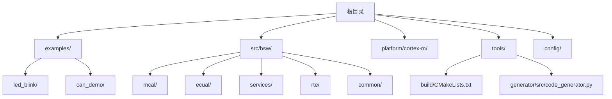
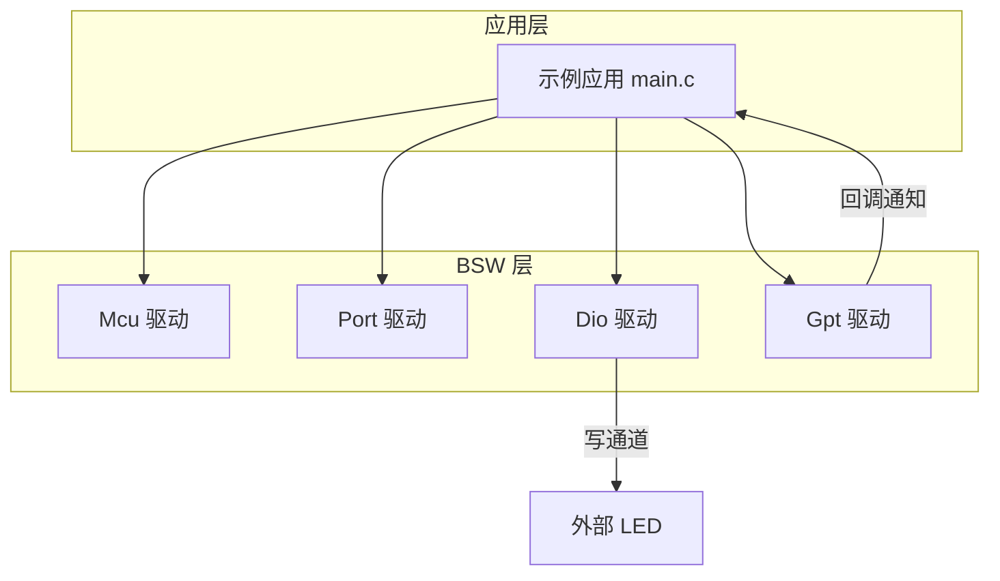
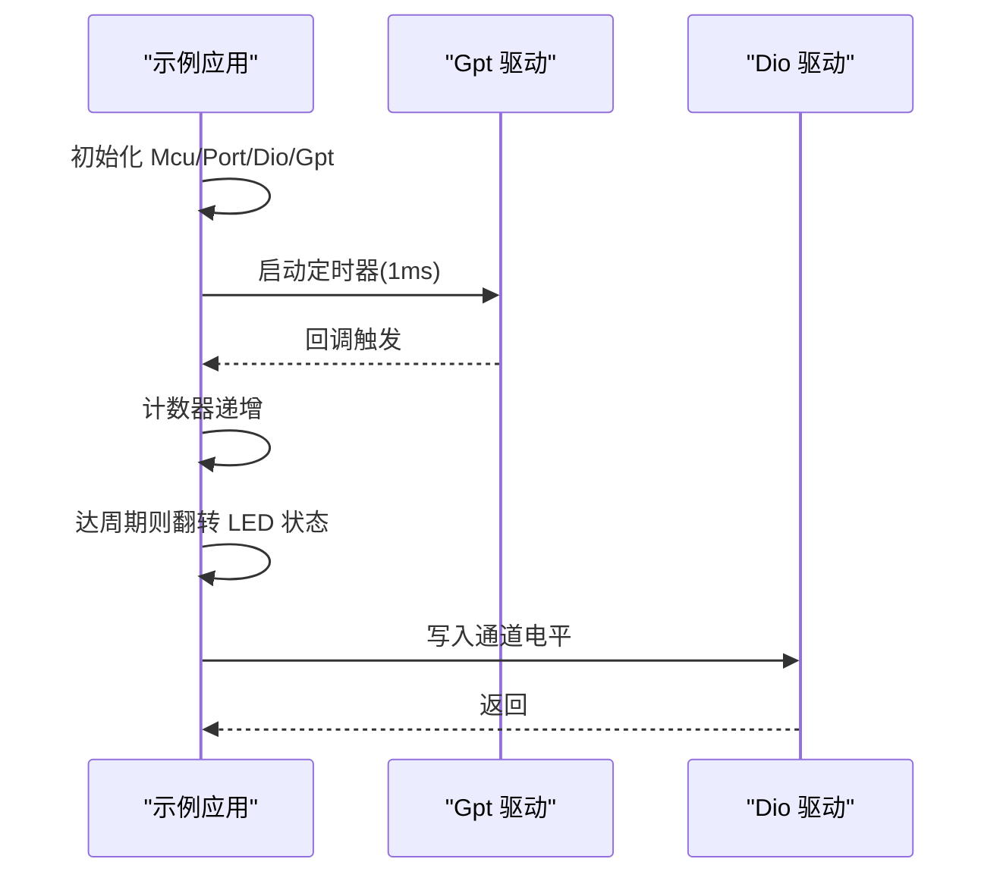
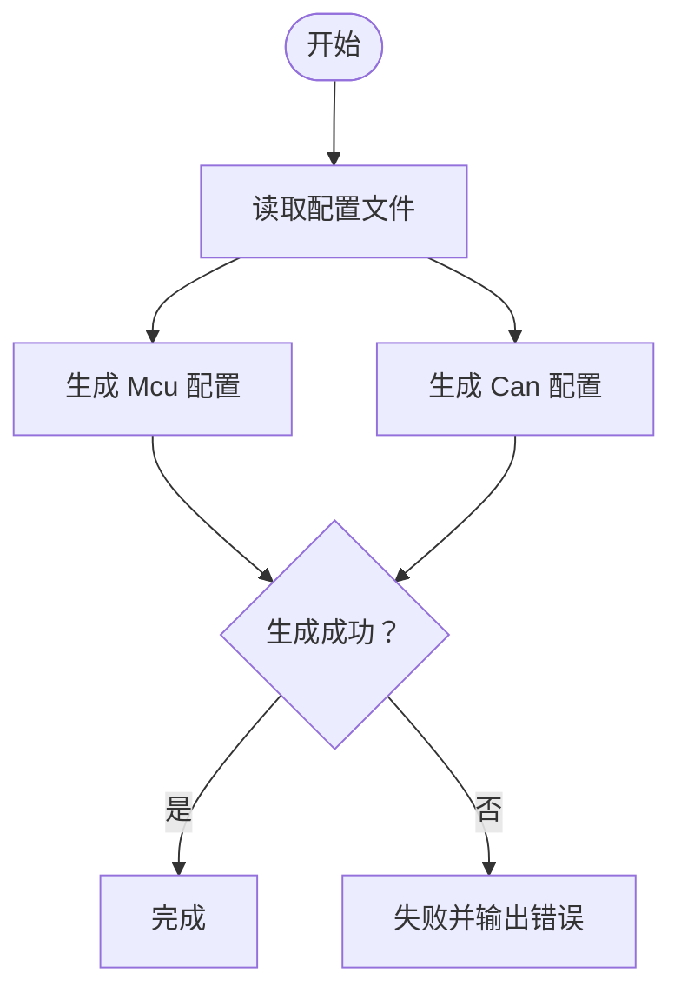
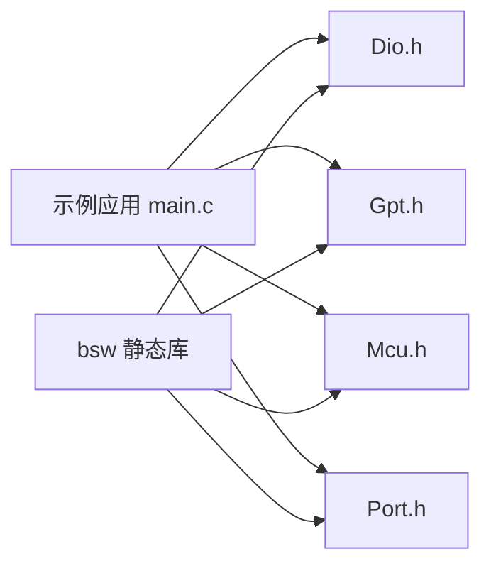

# 快速开始

<cite>
**本文引用的文件**
- [README.md](file://README.md)
- [开发指南.md](file://docs/development-guide.md)
- [示例说明.md](file://examples/README.md)
- [LED闪烁示例 main.c](file://examples/led_blink/main.c)
- [平台配置 platform_config.h](file://platform/cortex-m/platform_config.h)
- [构建脚本 CMakeLists.txt](file://tools/build/CMakeLists.txt)
- [代码生成器 code_generator.py](file://tools/generator/src/code_generator.py)
- [BSW 配置 bsw_config.json](file://config/bsw_config.json)
- [Dio 头文件 Dio.h](file://src/bsw/mcal/dio/include/Dio.h)
- [Gpt 头文件 Gpt.h](file://src/bsw/mcal/gpt/include/Gpt.h)
- [DET 头文件 Det.h](file://src/bsw/services/det/include/Det.h)
</cite>

## 目录
1. [简介](#简介)
2. [项目结构](#项目结构)
3. [核心组件](#核心组件)
4. [架构总览](#架构总览)
5. [详细组件分析](#详细组件分析)
6. [依赖关系分析](#依赖关系分析)
7. [性能与构建特性](#性能与构建特性)
8. [故障排除指南](#故障排除指南)
9. [结论](#结论)
10. [附录](#附录)

## 简介
本指南面向首次接触 YuleTech AutoSAR BSW 平台的开发者，帮助你在 Windows、Linux 和 macOS 上在约 30 分钟内完成环境准备、工具链安装、项目构建与第一个 LED 闪烁示例的运行。你将学习：
- 系统要求与环境配置
- CMake 构建系统与交叉编译工具链设置
- BSW 模块（MCAL、ECUAL、Service、RTE）的基本工作原理
- 使用 Dio 与 Gpt 实现基础 GPIO 控制
- 常见问题排查与调试建议

## 项目结构
该仓库采用分层组织方式，包含 BSW 源码、示例、文档与工具链配置：
- examples：示例工程（LED 闪烁、CAN 通信）
- src/bsw：按层划分的 BSW 实现（MCAL、ECUAL、Services、RTE、common）
- platform/cortex-m：Cortex-M 平台适配与配置
- tools：构建、代码生成与配置工具
- config：运行时配置样例（如 bsw_config.json）

**图表来源**
- [示例说明.md:1-165](file://examples/README.md#L1-L165)
- [构建脚本 CMakeLists.txt:1-107](file://tools/build/CMakeLists.txt#L1-L107)

**章节来源**
- [示例说明.md:1-165](file://examples/README.md#L1-L165)
- [构建脚本 CMakeLists.txt:1-107](file://tools/build/CMakeLists.txt#L1-L107)

## 核心组件
- BSW 分层架构：RTE、Service、ECUAL、MCAL、硬件抽象
- 关键模块：Dio（GPIO）、Gpt（定时器）、Mcu（微控制器）、Port（端口）
- 构建系统：CMake + ARM GCC 工具链
- 代码生成：基于 JSON 配置生成模块配置头文件

**章节来源**
- [README.md:48-85](file://README.md#L48-L85)
- [开发指南.md:17-81](file://docs/development-guide.md#L17-L81)
- [平台配置 platform_config.h:1-307](file://platform/cortex-m/platform_config.h#L1-L307)

## 架构总览
下图展示了示例程序中涉及的关键模块与数据流：应用通过 Mcu、Port、Dio、Gpt 初始化与协作，定时器回调驱动 LED 状态翻转。

**图表来源**
- [LED闪烁示例 main.c:61-99](file://examples/led_blink/main.c#L61-L99)
- [Dio 头文件 Dio.h:101-112](file://src/bsw/mcal/dio/include/Dio.h#L101-L112)
- [Gpt 头文件 Gpt.h:178-222](file://src/bsw/mcal/gpt/include/Gpt.h#L178-L222)

**章节来源**
- [LED闪烁示例 main.c:61-99](file://examples/led_blink/main.c#L61-L99)
- [Dio 头文件 Dio.h:101-112](file://src/bsw/mcal/dio/include/Dio.h#L101-L112)
- [Gpt 头文件 Gpt.h:178-222](file://src/bsw/mcal/gpt/include/Gpt.h#L178-L222)

## 详细组件分析

### 环境与工具链准备
- 操作系统：Windows 10/11、Linux（Ubuntu 20.04+）、macOS（12+）
- 编译器：GCC ARM Embedded 10.3.1+ 或 IAR Embedded Workbench 9.20+
- 构建工具：CMake 3.20+
- Python：3.9+（用于代码生成工具）
- VS Code（推荐）：安装 C/C++、CMake Tools、Python、GitLens 扩展

安装要点：
- Linux/macOS：使用包管理器安装工具链与 CMake
- Windows：下载并安装 ARM GCC 工具链与 CMake
- 配置 PATH 使 arm-none-eabi-gcc、cmake 可用

**章节来源**
- [开发指南.md:19-55](file://docs/development-guide.md#L19-L55)
- [README.md:97-103](file://README.md#L97-L103)

### 构建系统与交叉编译
- 使用 CMake 作为构建系统，最小版本要求 3.20
- 通过 CMakeLists.txt 指定包含路径与源文件集合，构建静态库 bsw
- 交叉编译工具链文件路径需正确指向项目中的工具链脚本

构建步骤（通用）：
- 创建构建目录并进入
- 配置项目（指定工具链文件）
- 执行构建

注意：当前仓库中缺少工具链脚本与顶层构建脚本，建议在本地补齐或参考示例工程的构建方式。

**章节来源**
- [构建脚本 CMakeLists.txt:1-107](file://tools/build/CMakeLists.txt#L1-L107)
- [开发指南.md:67-80](file://docs/development-guide.md#L67-L80)
- [示例说明.md:64-82](file://examples/README.md#L64-L82)

### 第一个示例：LED 闪烁
目标：通过 Gpt 定时器回调每 500ms 翻转一次 Dio 通道电平，点亮/熄灭 LED。

实现要点：
- 初始化 Mcu、Port、Dio、Gpt
- 启动 Gpt 定时器（周期 1ms），启用通知
- 在回调中累加计数，达到设定周期后翻转 LED 状态
- 主循环中可执行复位等操作

**图表来源**
- [LED闪烁示例 main.c:37-56](file://examples/led_blink/main.c#L37-L56)
- [Gpt 头文件 Gpt.h:216-222](file://src/bsw/mcal/gpt/include/Gpt.h#L216-L222)
- [Dio 头文件 Dio.h:112-112](file://src/bsw/mcal/dio/include/Dio.h#L112-L112)

**章节来源**
- [LED闪烁示例 main.c:61-99](file://examples/led_blink/main.c#L61-L99)
- [Gpt 头文件 Gpt.h:178-222](file://src/bsw/mcal/gpt/include/Gpt.h#L178-L222)
- [Dio 头文件 Dio.h:101-112](file://src/bsw/mcal/dio/include/Dio.h#L101-L112)

### 代码生成与配置
- 使用 JSON 配置文件（bsw_config.json）描述模块参数
- 代码生成器根据配置渲染模块配置头文件（如 Mcu_Cfg.h、Can_Cfg.h）
- 生成逻辑包含错误处理与进度提示

**图表来源**
- [代码生成器 code_generator.py:67-152](file://tools/generator/src/code_generator.py#L67-L152)
- [BSW 配置 bsw_config.json:1-21](file://config/bsw_config.json#L1-L21)

**章节来源**
- [代码生成器 code_generator.py:1-176](file://tools/generator/src/code_generator.py#L1-L176)
- [BSW 配置 bsw_config.json:1-21](file://config/bsw_config.json#L1-L21)

### 平台适配与配置
- platform/cortex-m 提供 Cortex-M 平台相关的内存、时钟、NVIC、SysTick 等配置
- 可通过宏选择具体内核（如 CORTEX_M4），并设置系统频率、中断优先级等
- 该配置为底层硬件抽象提供统一接口

**章节来源**
- [平台配置 platform_config.h:1-307](file://platform/cortex-m/platform_config.h#L1-L307)

## 依赖关系分析
- 示例应用依赖 BSW 驱动（Mcu、Port、Dio、Gpt）
- BSW 静态库由 CMake 统一构建，包含各层源文件
- 代码生成器依赖 Python 与 Jinja2 模板引擎

**图表来源**
- [构建脚本 CMakeLists.txt:43-78](file://tools/build/CMakeLists.txt#L43-L78)
- [LED闪烁示例 main.c:15-18](file://examples/led_blink/main.c#L15-L18)

**章节来源**
- [构建脚本 CMakeLists.txt:1-107](file://tools/build/CMakeLists.txt#L1-L107)
- [LED闪烁示例 main.c:15-18](file://examples/led_blink/main.c#L15-L18)

## 性能与构建特性
- C 标准：C99
- 编译选项：启用告警与优化级别
- 库产物：静态库 bsw，安装至系统库目录
- 版本信息：通过编译定义注入版本号

**章节来源**
- [构建脚本 CMakeLists.txt:6-11](file://tools/build/CMakeLists.txt#L6-L11)
- [构建脚本 CMakeLists.txt:84-88](file://tools/build/CMakeLists.txt#L84-L88)

## 故障排除指南
- LED 不闪烁
  - 检查 GPIO 引脚配置与硬件连接
  - 确认时钟设置与系统频率
  - 核对 LED 正负极与限流电阻
- Gpt 回调不触发
  - 确认定时器已启动且启用通知
  - 检查中断优先级与 NVIC 配置
- 构建失败
  - 确认 ARM GCC 工具链可用
  - 检查 CMake 版本与工具链文件路径
  - 清理构建缓存后重试
- 代码生成异常
  - 检查 JSON 配置语法与字段完整性
  - 确认 Python 与 Jinja2 安装

**章节来源**
- [示例说明.md:149-160](file://examples/README.md#L149-L160)
- [开发指南.md:431-492](file://docs/development-guide.md#L431-L492)

## 结论
通过本指南，你可以在多平台上快速完成工具链安装与项目构建，并成功运行第一个 LED 闪烁示例。建议在理解 BSW 分层架构与关键模块的基础上，逐步扩展到更复杂的通信与存储场景。

## 附录

### 快速命令参考（示例工程）
- 进入示例目录并构建
- 加载到目标设备
- 使用 GDB 调试

**章节来源**
- [示例说明.md:64-82](file://examples/README.md#L64-L82)
- [示例说明.md:130-148](file://examples/README.md#L130-L148)