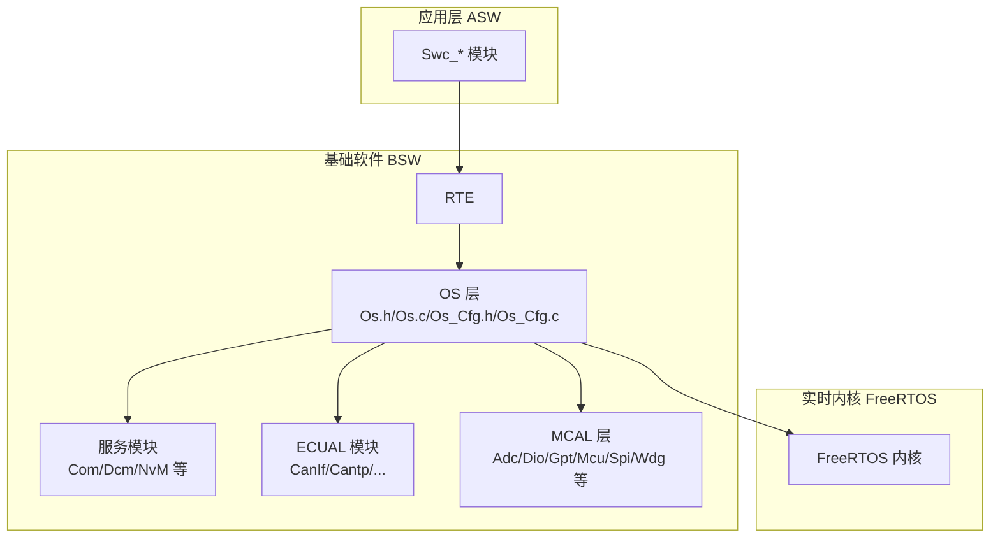
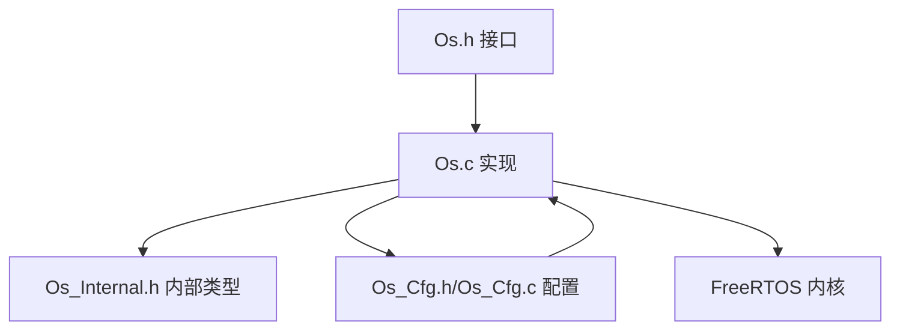
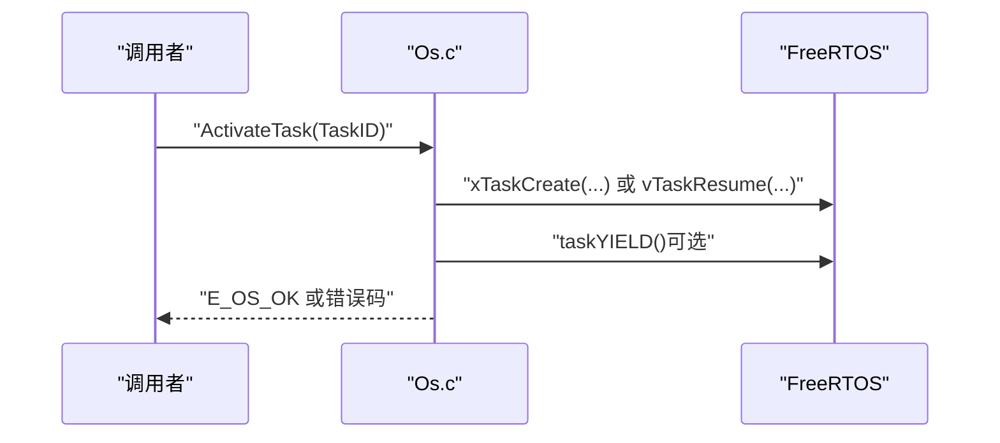
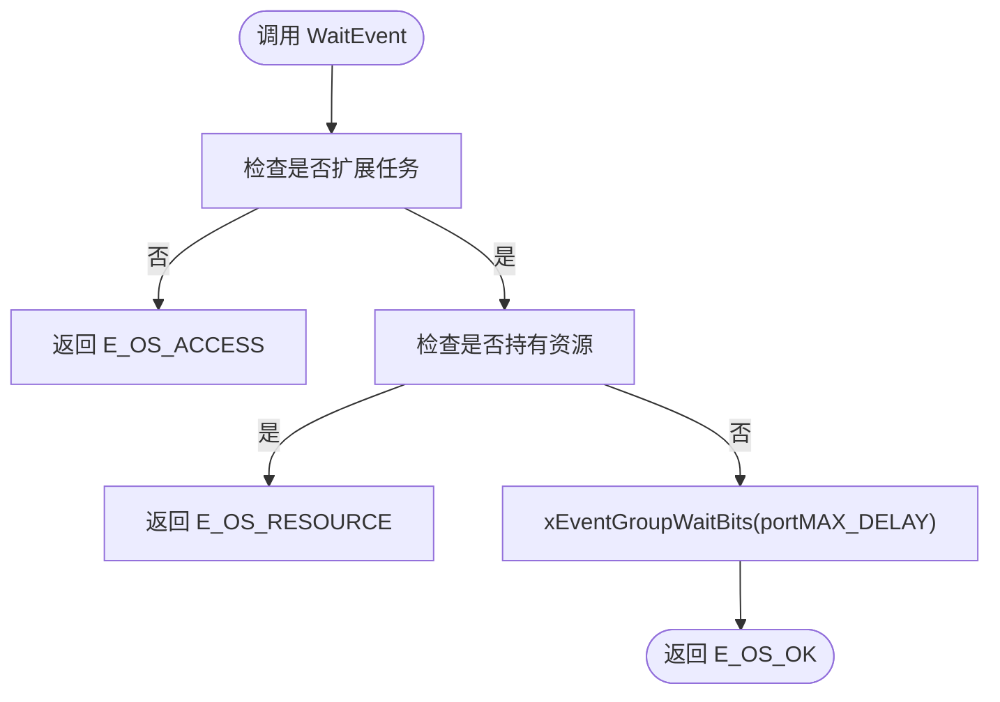
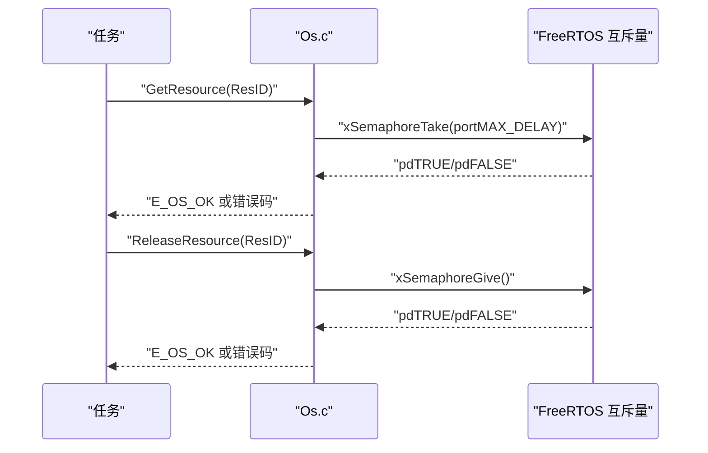
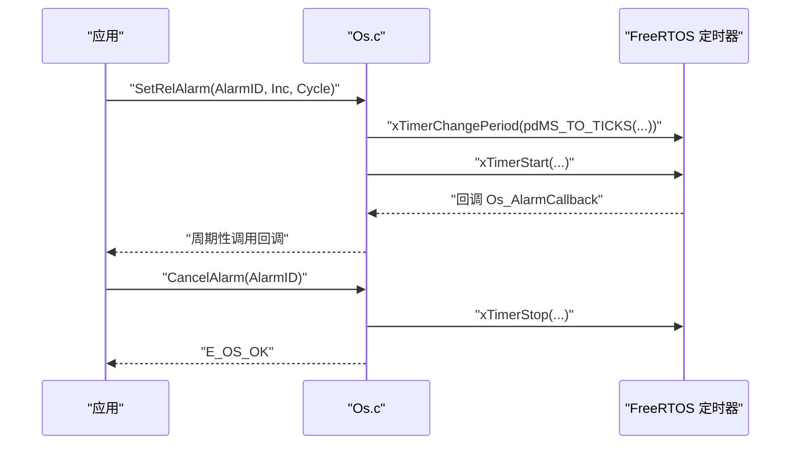
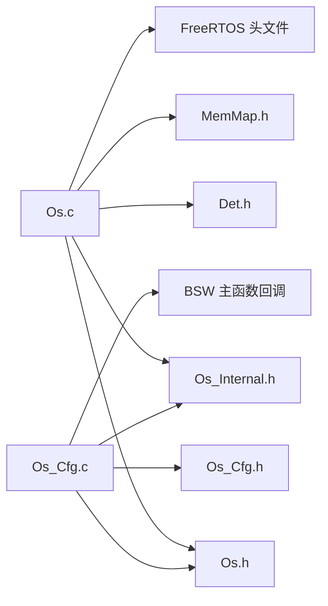

# 操作系统支持

<cite>
**本文引用的文件列表**
- [Os.h](file://src/bsw/os/include/Os.h)
- [Os.c](file://src/bsw/os/src/Os.c)
- [Os_Cfg.h](file://src/bsw/os/include/Os_Cfg.h)
- [Os_Cfg.c](file://src/bsw/os/src/Os_Cfg.c)
- [Os_Internal.h](file://src/bsw/os/include/Os_Internal.h)
- [task.h](file://src/bsw/os/include/task.h)
- [Std_Types.h](file://src/bsw/common/Std_Types.h)
- [Det.h](file://src/bsw/common/Det.h)
- [os_verification.md](file://verification/os_verification.md)
</cite>

## 目录
1. [简介](#简介)
2. [项目结构](#项目结构)
3. [核心组件](#核心组件)
4. [架构总览](#架构总览)
5. [详细组件分析](#详细组件分析)
6. [依赖关系分析](#依赖关系分析)
7. [性能考虑](#性能考虑)
8. [故障排查指南](#故障排查指南)
9. [结论](#结论)
10. [附录](#附录)

## 简介
本技术文档面向基于 FreeRTOS 的实时操作系统集成实现，围绕 AutoSAR OS 接口与 FreeRTOS 的适配展开，系统阐述 Os.h 接口设计、任务管理机制、中断处理、内存管理策略、Os.c 的实现细节、Os_Cfg.c 的配置管理以及 task.h 的调度机制。文档同时给出时间片管理、优先级调度、资源分配策略、配置参数、性能优化与实时性保障方法，并解释如何在嵌入式环境中实现高效的多任务并发执行。

## 项目结构
本项目采用分层架构：上层为 ASW（应用服务软件）模块，中层为 BSW（基础软件）模块，底层为 MCAL（微控制器抽象层）与 FreeRTOS 实时内核。操作系统适配位于 BSW 的 os 子目录，包含公共接口头文件、内部头文件、配置头与配置表、以及实现源文件。

图表来源
- [Os.h:1-213](file://src/bsw/os/include/Os.h#L1-L213)
- [Os.c:1-1466](file://src/bsw/os/src/Os.c#L1-L1466)
- [Os_Cfg.h:1-101](file://src/bsw/os/include/Os_Cfg.h#L1-L101)
- [Os_Cfg.c:1-404](file://src/bsw/os/src/Os_Cfg.c#L1-L404)

章节来源
- [Os.h:1-213](file://src/bsw/os/include/Os.h#L1-L213)
- [Os.c:1-1466](file://src/bsw/os/src/Os.c#L1-L1466)
- [Os_Cfg.h:1-101](file://src/bsw/os/include/Os_Cfg.h#L1-L101)
- [Os_Cfg.c:1-404](file://src/bsw/os/src/Os_Cfg.c#L1-L404)

## 核心组件
- 接口层（Os.h）：定义 AutoSAR OS API、状态码、类型别名与回调钩子，提供任务、事件、资源、报警、中断与 OS 控制等接口。
- 实现层（Os.c）：封装 FreeRTOS 调度器、任务、事件组、互斥量与软件定时器，实现任务激活/终止/链式切换、显式调度、事件等待与设置、资源互斥、报警设置/取消/查询、中断开关控制、OS 启动/关闭与钩子调用。
- 配置层（Os_Cfg.h/Os_Cfg.c）：集中定义任务、报警、资源、事件、计数器与栈大小等配置；生成全局状态表与配置表，初始化资源互斥量、报警定时器与自动启动任务。
- 内部头（Os_Internal.h）：定义内部数据结构（任务/报警/资源/全局状态）、FreeRTOS 类型映射、回调函数原型与任务包装器。
- FreeRTOS 适配头（task.h）：提供 FreeRTOS 任务 API 的轻量封装，用于状态枚举、任务控制、通知与钩子声明。

章节来源
- [Os.h:154-210](file://src/bsw/os/include/Os.h#L154-L210)
- [Os.c:64-1466](file://src/bsw/os/src/Os.c#L64-L1466)
- [Os_Cfg.h:14-101](file://src/bsw/os/include/Os_Cfg.h#L14-L101)
- [Os_Cfg.c:54-404](file://src/bsw/os/src/Os_Cfg.c#L54-L404)
- [Os_Internal.h:19-124](file://src/bsw/os/include/Os_Internal.h#L19-L124)
- [task.h:1-79](file://src/bsw/os/include/task.h#L1-L79)

## 架构总览
下图展示 OS 层与 FreeRTOS 的关键交互关系：OS 层通过包装器与适配层调用 FreeRTOS API，完成任务生命周期管理、事件同步、资源互斥、报警驱动与钩子回调。

图表来源
- [Os.h:154-210](file://src/bsw/os/include/Os.h#L154-L210)
- [Os.c:64-1466](file://src/bsw/os/src/Os.c#L64-L1466)
- [Os_Internal.h:19-124](file://src/bsw/os/include/Os_Internal.h#L19-L124)
- [Os_Cfg.h:14-101](file://src/bsw/os/include/Os_Cfg.h#L14-L101)
- [Os_Cfg.c:54-404](file://src/bsw/os/src/Os_Cfg.c#L54-L404)

## 详细组件分析

### 接口设计与类型体系（Os.h）
- 版本与服务 ID：定义 OS 模块版本、AutoSAR 版本兼容性与服务 ID 常量，便于 DET 报错与调试。
- 状态类型与错误码：StatusType 与 E_OS_* 错误码覆盖访问、状态、资源、参数、中断禁用等典型错误场景。
- 任务/事件/报警/资源类型：TaskType、EventMaskType、AlarmType、ResourceType、TickType 等，统一映射到 FreeRTOS 数据类型。
- 钩子回调：ErrorHook、PreTaskHook、PostTaskHook、StartupHook、ShutdownHook，支持弱符号覆盖，便于应用层定制。
- OS 控制：StartOS、ShutdownOS、GetActiveApplicationMode，配合内部钩子完成启动/关闭流程。

章节来源
- [Os.h:24-210](file://src/bsw/os/include/Os.h#L24-L210)

### 任务管理机制（Os.c）
- 任务激活（ActivateTask）：若任务未创建则使用 xTaskCreate 创建，扩展任务同时创建事件组；已创建则 vTaskResume 恢复；必要时触发 taskYIELD。
- 任务终止（TerminateTask）：检查是否持有资源，若无则调用 Os_Internal_PostTaskHook 并 vTaskSuspend 自身；否则返回 E_OS_RESOURCE。
- 任务链式切换（ChainTask）：先激活目标任务，再终止自身，实现无缝切换。
- 显式调度（Schedule）：直接调用 taskYIELD。
- 任务查询（GetTaskID/GetTaskState）：通过 xTaskGetCurrentTaskHandle 与 eTaskGetState 查询句柄与状态，映射到 SUSPENDED/READY/RUNNING/WAITING。

图表来源
- [Os.c:165-234](file://src/bsw/os/src/Os.c#L165-L234)

章节来源
- [Os.c:165-234](file://src/bsw/os/src/Os.c#L165-L234)
- [Os.c:243-284](file://src/bsw/os/src/Os.c#L243-L284)
- [Os.c:295-324](file://src/bsw/os/src/Os.c#L295-L324)
- [Os.c:333-375](file://src/bsw/os/src/Os.c#L333-L375)
- [Os.c:388-444](file://src/bsw/os/src/Os.c#L388-L444)

### 事件管理机制（Os.c）
- 事件设置（SetEvent）：仅扩展任务可用，通过 xEventGroupSetBits 设置位掩码。
- 事件清除（ClearEvent）：仅扩展任务可用，通过 xEventGroupClearBits 清除位掩码。
- 事件等待（WaitEvent）：扩展任务等待指定事件掩码，使用 portMAX_DELAY 无限等待；若任务持有资源则返回 E_OS_RESOURCE。
- 事件查询（GetEvent）：获取当前事件掩码值。

图表来源
- [Os.c:630-696](file://src/bsw/os/src/Os.c#L630-L696)

章节来源
- [Os.c:514-558](file://src/bsw/os/src/Os.c#L514-L558)
- [Os.c:570-618](file://src/bsw/os/src/Os.c#L570-L618)
- [Os.c:630-696](file://src/bsw/os/src/Os.c#L630-L696)
- [Os.c:710-760](file://src/bsw/os/src/Os.c#L710-L760)

### 资源管理机制（Os.c）
- 资源获取（GetResource）：通过 xSemaphoreTake 获取互斥量，记录 OwnerTask 与嵌套计数 NestCount。
- 资源释放（ReleaseResource）：校验所有权与嵌套计数，xSemaphoreGive 释放互斥量，必要时清零 OwnerTask。

图表来源
- [Os.c:801-822](file://src/bsw/os/src/Os.c#L801-L822)
- [Os.c:835-891](file://src/bsw/os/src/Os.c#L835-L891)

章节来源
- [Os.c:801-822](file://src/bsw/os/src/Os.c#L801-L822)
- [Os.c:835-891](file://src/bsw/os/src/Os.c#L835-L891)

### 报警管理机制（Os.c）
- 报警基信息（GetAlarmBase）：返回最大允许值、ticksperbase、mincycle，ticksperbase 由 OS_TICKS_PER_MS 决定。
- 报警查询（GetAlarm）：返回当前 ExpiryTick，仅当状态为 ACTIVE。
- 相对报警（SetRelAlarm）：计算周期毫秒数，xTimerChangePeriod + xTimerStart 启动定时器；支持周期性循环。
- 绝对报警（SetAbsAlarm）：通过当前 tick 计算相对增量，委托 SetRelAlarm 实现。
- 取消报警（CancelAlarm）：xTimerStop 停止定时器，更新状态为 CANCELED。

图表来源
- [Os.c:908-928](file://src/bsw/os/src/Os.c#L908-L928)
- [Os.c:942-985](file://src/bsw/os/src/Os.c#L942-L985)
- [Os.c:999-1063](file://src/bsw/os/src/Os.c#L999-L1063)
- [Os.c:1077-1104](file://src/bsw/os/src/Os.c#L1077-L1104)
- [Os.c:1124-1173](file://src/bsw/os/src/Os.c#L1124-L1173)
- [Os.c:1417-1440](file://src/bsw/os/src/Os.c#L1417-L1440)

章节来源
- [Os.c:908-928](file://src/bsw/os/src/Os.c#L908-L928)
- [Os.c:942-985](file://src/bsw/os/src/Os.c#L942-L985)
- [Os.c:999-1063](file://src/bsw/os/src/Os.c#L999-L1063)
- [Os.c:1077-1104](file://src/bsw/os/src/Os.c#L1077-L1104)
- [Os.c:1124-1173](file://src/bsw/os/src/Os.c#L1124-L1173)
- [Os.c:1417-1440](file://src/bsw/os/src/Os.c#L1417-L1440)

### 中断管理与 OS 控制（Os.c）
- 中断控制：EnableAllInterrupts/DisableAllInterrupts/ResumeAllInterrupts/SuspendAllInterrupts 通过 portENABLE_INTERRUPTS/portDISABLE_INTERRUPTS 实现。
- OS 控制：StartOS 调用 Os_Internal_StartOS，初始化资源/报警/任务，调用 StartupHook，然后 vTaskStartScheduler；ShutdownOS 调用 Os_Internal_ShutdownOS，触发 ShutdownHook，尝试 vTaskEndScheduler 并进入死循环。

章节来源
- [Os.c:453-496](file://src/bsw/os/src/Os.c#L453-L496)
- [Os.c:76-109](file://src/bsw/os/src/Os.c#L76-L109)
- [Os.c:116-139](file://src/bsw/os/src/Os.c#L116-L139)

### 钩子函数与版本信息（Os.c）
- 钩子函数：ErrorHook/PreTaskHook/PostTaskHook/StartupHook/ShutdownHook 提供默认空实现，可通过弱符号在应用层覆盖。
- 版本信息：Os_GetVersionInfo 返回 vendorID/moduleID/sw_major/minor/patch。

章节来源
- [Os.c:1184-1338](file://src/bsw/os/src/Os.c#L1184-L1338)

### 配置管理（Os_Cfg.h/Os_Cfg.c）
- 通用配置：DEV_ERROR_DETECT、HOOK 开关、栈监控、启动/关闭钩子等。
- 任务配置：任务数量、任务 ID、优先级、是否自动启动、是否扩展任务、入口函数指针。
- 报警配置：报警数量、报警 ID、周期（ms）、回调函数指针。
- 资源配置：资源数量、互斥量句柄、拥有者任务、嵌套计数、是否启用优先级天花板。
- 事件配置：事件掩码常量。
- 计数器配置：ticks_per_ms、max_allowed、min_cycle。
- 栈配置：任务栈大小、ISR 栈大小。
- 全局状态：Os_GlobalState 统一管理运行态、当前应用模式、任务/报警/资源表指针。

章节来源
- [Os_Cfg.h:14-101](file://src/bsw/os/include/Os_Cfg.h#L14-L101)
- [Os_Cfg.c:54-404](file://src/bsw/os/src/Os_Cfg.c#L54-L404)

### 内部数据结构与适配（Os_Internal.h/task.h）
- 内部类型：AlarmConfigType、TaskConfigType、ResourceConfigType、Os_GlobalStateType，统一映射 FreeRTOS 句柄与状态。
- 适配头：task.h 提供 FreeRTOS 任务 API 的轻量封装，包括状态枚举、任务控制、通知与钩子声明。

章节来源
- [Os_Internal.h:19-124](file://src/bsw/os/include/Os_Internal.h#L19-L124)
- [task.h:1-79](file://src/bsw/os/include/task.h#L1-L79)

## 依赖关系分析
- Os.c 依赖：
  - Os.h/Os_Internal.h：接口与内部类型
  - Det.h：错误检测宏与 DET 报告
  - MemMap.h：内存分区宏
  - FreeRTOS 头文件：FreeRTOS.h、task.h、timers.h、event_groups.h、semphr.h
- Os_Cfg.c 依赖：
  - Os.h/Os_Internal.h/Os_Cfg.h：配置与内部类型
  - BswM.h/Com.h/CanIf.h/Dcm.h/NvM.h/Dem.h：各模块主函数回调
  - MemMap.h：内存分区宏

图表来源
- [Os.c:19-24](file://src/bsw/os/src/Os.c#L19-L24)
- [Os_Cfg.c:18-31](file://src/bsw/os/src/Os_Cfg.c#L18-L31)

章节来源
- [Os.c:19-24](file://src/bsw/os/src/Os.c#L19-L24)
- [Os_Cfg.c:18-31](file://src/bsw/os/src/Os_Cfg.c#L18-L31)

## 性能考虑
- 优先级抢占：通过 FreeRTOS 优先级与 taskYIELD 实现抢占式调度，满足 AutoSAR 优先级调度需求。
- 时间片管理：FreeRTOS tick 精度决定最小周期（配置中 OS_TICKS_PER_MS 决定），建议报警周期不小于 1ms。
- 事件等待：WaitEvent 使用 portMAX_DELAY，避免忙等待；扩展任务事件组按需创建，减少内存占用。
- 资源互斥：互斥量采用阻塞获取，避免忙锁；嵌套计数 NestCount 支持嵌套访问，降低上下文切换开销。
- 报警实现：相对时间转换为 FreeRTOS 定时器周期，周期性报警通过回调重启动定时器，避免轮询。
- 栈空间：任务栈大小（OS_CFG_TASK_STACK_SIZE）与 ISR 栈大小（OS_CFG_ISR_STACK_SIZE）应结合实际负载评估，确保安全余量。
- 钩子与错误检测：DET 开关（OS_DEV_ERROR_DETECT）影响运行时错误上报成本，建议在开发阶段开启，在发布版本根据需求关闭以节省资源。

## 故障排查指南
- 任务无法激活/恢复
  - 检查任务句柄是否为空（首次激活会创建），确认优先级与栈大小配置合理。
  - 若返回 E_OS_LIMIT，可能为 FreeRTOS 创建失败或内存不足。
- 任务终止失败
  - 若返回 E_OS_RESOURCE，表示任务仍持有资源，需先 ReleaseResource。
- 事件等待异常
  - 仅扩展任务可使用 WaitEvent/SetEvent/ClearEvent；非扩展任务返回 E_OS_ACCESS。
  - 若返回 E_OS_STATE，表示事件组未创建或任务状态异常。
- 资源获取/释放失败
  - E_OS_ID：资源 ID 越界；E_OS_NOFUNC：非拥有者释放；E_OS_ACCESS：互斥量操作失败。
- 报警设置失败
  - E_OS_ID：报警 ID 越界；E_OS_VALUE：参数非法（如增量为 0）；E_OS_NOFUNC：报警未激活。
- 中断控制无效
  - 确认 portENABLE_INTERRUPTS/portDISABLE_INTERRUPTS 在目标平台有效，且调用时机正确。
- 启动/关闭问题
  - StartOS 后应立即启动调度器；ShutdownOS 后进入死循环，需确保 ShutdownHook 正确执行。

章节来源
- [Os.c:165-234](file://src/bsw/os/src/Os.c#L165-L234)
- [Os.c:243-284](file://src/bsw/os/src/Os.c#L243-L284)
- [Os.c:514-558](file://src/bsw/os/src/Os.c#L514-L558)
- [Os.c:570-618](file://src/bsw/os/src/Os.c#L570-L618)
- [Os.c:630-696](file://src/bsw/os/src/Os.c#L630-L696)
- [Os.c:801-822](file://src/bsw/os/src/Os.c#L801-L822)
- [Os.c:835-891](file://src/bsw/os/src/Os.c#L835-L891)
- [Os.c:999-1063](file://src/bsw/os/src/Os.c#L999-L1063)
- [Os.c:1124-1173](file://src/bsw/os/src/Os.c#L1124-L1173)
- [Os.c:453-496](file://src/bsw/os/src/Os.c#L453-L496)
- [Os.c:76-109](file://src/bsw/os/src/Os.c#L76-L109)
- [Os.c:116-139](file://src/bsw/os/src/Os.c#L116-L139)

## 结论
本实现基于 FreeRTOS 完整实现了 AutoSAR OS 的六大核心功能域：任务管理、事件管理、资源管理、报警管理、中断管理与 OS 控制。通过 Os.h/Os.c/Os_Cfg.h/Os_Cfg.c 的清晰分层与 Os_Internal.h 的内部适配，系统在保持 AutoSAR 语义一致性的同时，充分利用 FreeRTOS 的成熟调度、同步与定时能力。验证报告表明各 API 与映射均通过，具备在嵌入式环境（如 NXP i.MX8M Mini）中高效并发执行的基础。

## 附录

### AutoSAR 与 FreeRTOS 映射对照
- 任务（Basic/Extended）→ xTaskCreate（扩展任务附加事件组）
- 事件 → Event Group（每扩展任务独立事件组）
- 资源 → Mutex（互斥量）
- 报警 → Software Timer（相对周期或通过相对转换实现绝对）
- 调度 → Priority Preemption（taskYIELD 与优先级）
- 钩子 → vApplication*Hooks（Startup/Shutdown/Error/Pre/Post）

章节来源
- [os_verification.md:100-124](file://verification/os_verification.md#L100-L124)