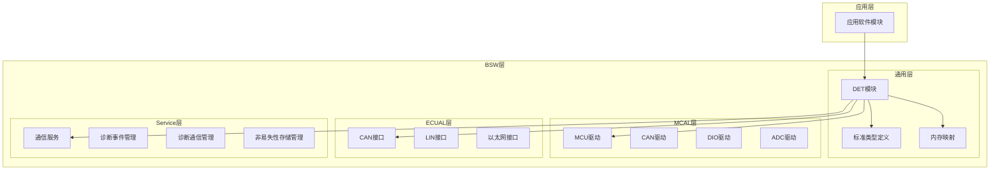
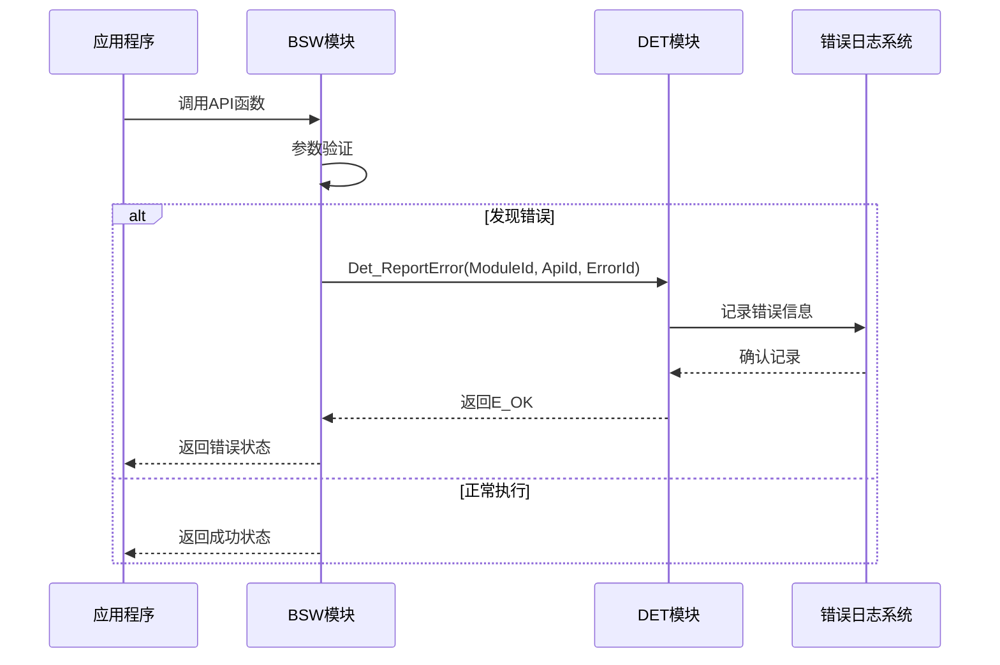
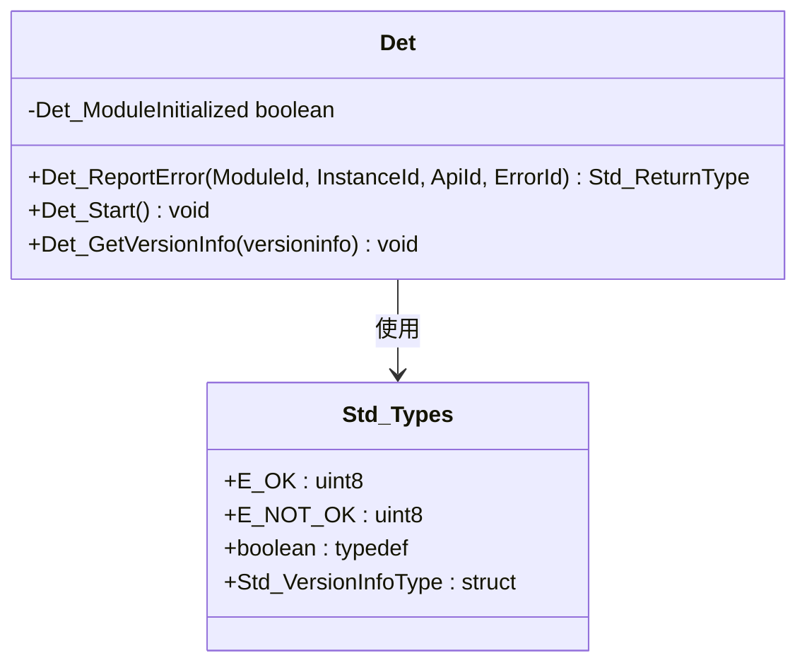
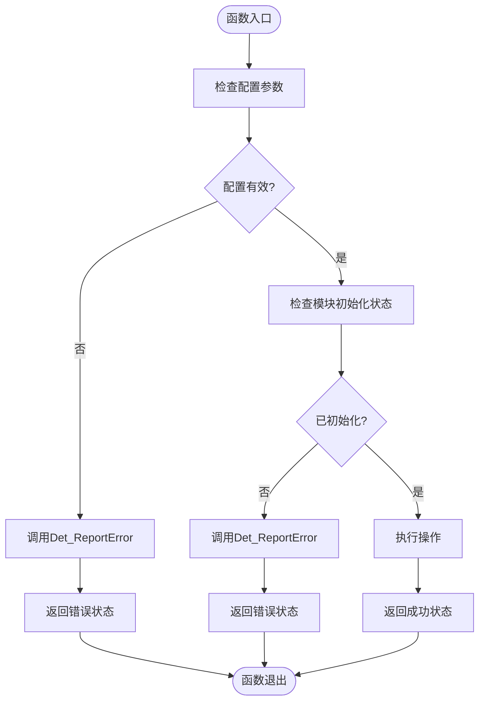
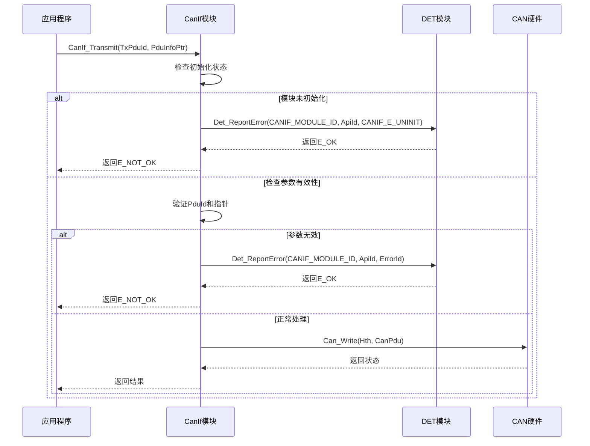
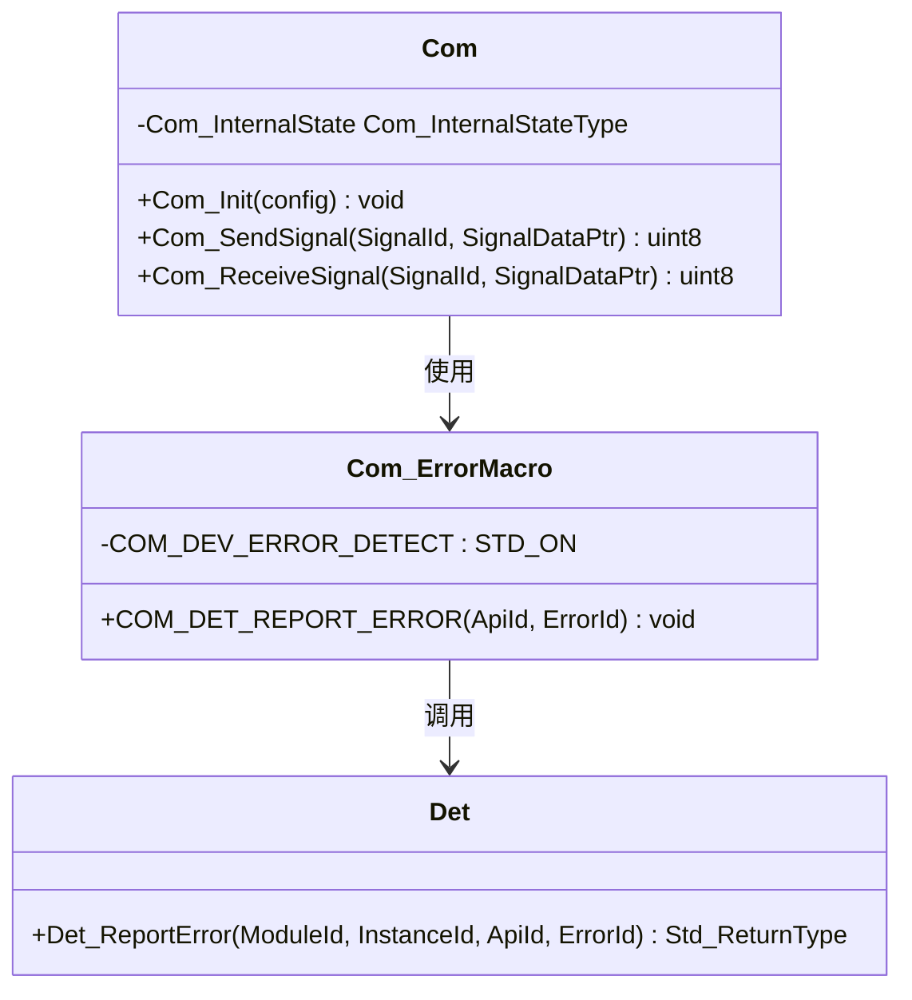
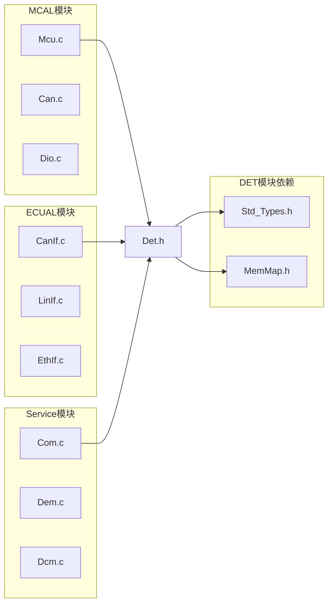

# DET错误检测机制

<cite>
**本文档引用的文件**
- [Det.h](file://src/bsw/common/Det.h)
- [Det.c](file://src/bsw/common/Det.c)
- [Std_Types.h](file://src/bsw/common/Std_Types.h)
- [MemMap.h](file://src/bsw/general/inc/MemMap.h)
- [Mcu.h](file://src/bsw/mcal/mcu/include/Mcu.h)
- [Mcu.c](file://src/bsw/mcal/mcu/src/Mcu.c)
- [Mcu_Cfg.h](file://src/bsw/mcal/mcu/include/Mcu_Cfg.h)
- [CanIf.h](file://src/bsw/ecual/canif/include/CanIf.h)
- [CanIf.c](file://src/bsw/ecual/canif/src/CanIf.c)
- [CanIf_Cfg.h](file://src/bsw/ecual/canif/include/CanIf_Cfg.h)
- [Com.h](file://src/bsw/services/com/include/Com.h)
- [Com.c](file://src/bsw/services/com/src/Com.c)
- [Com_Cfg.h](file://src/bsw/services/com/include/Com_Cfg.h)
</cite>

## 目录
1. [简介](#简介)
2. [项目结构](#项目结构)
3. [核心组件](#核心组件)
4. [架构概览](#架构概览)
5. [详细组件分析](#详细组件分析)
6. [依赖关系分析](#依赖关系分析)
7. [性能考虑](#性能考虑)
8. [故障排除指南](#故障排除指南)
9. [结论](#结论)
10. [附录](#附录)

## 简介

DET（Development Error Tracer）是YuleTech BSW平台中的开发错误追踪模块，遵循AUTOSAR标准设计。该模块为整个BSW系统提供了统一的错误检测和报告机制，支持MCAL、ECUAL和Service层的错误处理。

DET模块的核心功能包括：
- 统一的错误代码定义和管理
- 标准化的错误报告接口
- 版本信息查询功能
- 与各BSW模块的无缝集成

## 项目结构

YuleTech BSW平台采用分层架构设计，DET模块位于BSW通用层，为上层MCAL、ECUAL和Service模块提供错误检测服务。



**图表来源**
- [Det.h:1-76](file://src/bsw/common/Det.h#L1-L76)
- [Mcu.h:1-239](file://src/bsw/mcal/mcu/include/Mcu.h#L1-L239)
- [CanIf.h:1-403](file://src/bsw/ecual/canif/include/CanIf.h#L1-L403)
- [Com.h:1-508](file://src/bsw/services/com/include/Com.h#L1-L508)

**章节来源**
- [Det.h:1-76](file://src/bsw/common/Det.h#L1-L76)
- [Std_Types.h:1-117](file://src/bsw/common/Std_Types.h#L1-L117)
- [MemMap.h:1-796](file://src/bsw/general/inc/MemMap.h#L1-L796)

## 核心组件

### DET模块接口定义

DET模块提供三个核心服务接口：

1. **错误报告接口** (`Det_ReportError`)
2. **模块启动接口** (`Det_Start`)
3. **版本信息查询接口** (`Det_GetVersionInfo`)

### 错误代码体系

DET模块定义了基础错误代码，所有BSW模块共享这些错误码：

| 错误代码 | 十六进制值 | 含义 | 使用场景 |
|---------|------------|------|----------|
| DET_E_NO_ERROR | 0x00 | 无错误 | 正常操作完成 |
| DET_E_PARAM_POINTER | 0x01 | 参数指针无效 | 检测到NULL指针参数 |
| DET_E_UNAVAILABLE | 0x02 | 资源不可用 | 模块未初始化或资源被占用 |

### 版本信息管理

DET模块支持完整的版本信息查询，包括：
- 供应商ID (Vendor ID)
- 模块ID (Module ID)
- 软件版本号 (主版本/次版本/补丁版本)
- AUTOSAR兼容性版本

**章节来源**
- [Det.h:34-70](file://src/bsw/common/Det.h#L34-L70)
- [Det.c:70-80](file://src/bsw/common/Det.c#L70-L80)

## 架构概览

DET模块采用插桩式设计，在各BSW模块中通过条件编译启用错误检测功能。



**图表来源**
- [Mcu.c:252-280](file://src/bsw/mcal/mcu/src/Mcu.c#L252-L280)
- [CanIf.c:29-50](file://src/bsw/ecual/canif/src/CanIf.c#L29-L50)
- [Com.c:405-453](file://src/bsw/services/com/src/Com.c#L405-L453)

## 详细组件分析

### DET模块实现

DET模块采用最小化实现策略，专注于提供标准化接口：



**图表来源**
- [Det.c:47-80](file://src/bsw/common/Det.c#L47-L80)
- [Std_Types.h:23-80](file://src/bsw/common/Std_Types.h#L23-L80)

#### 关键实现特性

1. **模块初始化状态管理**
   - 使用静态变量跟踪DET模块状态
   - 提供启动接口确保模块正确初始化

2. **版本信息查询**
   - 支持完整的AUTOSAR版本信息结构
   - 包含供应商ID、模块ID和软件版本

3. **错误报告接口**
   - 标准化参数格式 (ModuleId, InstanceId, ApiId, ErrorId)
   - 返回标准AUTOSAR返回类型

**章节来源**
- [Det.c:33-80](file://src/bsw/common/Det.c#L33-L80)

### MCAL层集成示例

MCAL模块（以Mcu为例）展示了DET的完整集成模式：



**图表来源**
- [Mcu.c:252-280](file://src/bsw/mcal/mcu/src/Mcu.c#L252-L280)

#### 集成要点

1. **条件编译控制**
   - 通过`MCU_DEV_ERROR_DETECT`宏控制错误检测启用
   - 支持运行时禁用以优化性能

2. **错误检测点**
   - 函数入口参数验证
   - 模块状态检查
   - 资源可用性检查

3. **错误报告格式**
   - 使用模块特定的错误代码
   - 标准化的API服务ID

**章节来源**
- [Mcu.c:252-488](file://src/bsw/mcal/mcu/src/Mcu.c#L252-L488)
- [Mcu_Cfg.h:15-20](file://src/bsw/mcal/mcu/include/Mcu_Cfg.h#L15-L20)

### ECUAL层集成示例

ECUAL模块（以CanIf为例）展示了更复杂的错误检测场景：

#### 错误检测流程



**图表来源**
- [CanIf.c:142-185](file://src/bsw/ecual/canif/src/CanIf.c#L142-L185)

**章节来源**
- [CanIf.c:29-257](file://src/bsw/ecual/canif/src/CanIf.c#L29-L257)
- [CanIf_Cfg.h:15-27](file://src/bsw/ecual/canif/include/CanIf_Cfg.h#L15-L27)

### Service层集成示例

Service模块（以Com为例）展示了高级错误检测模式：

#### 宏封装机制



**图表来源**
- [Com.c:45-50](file://src/bsw/services/com/src/Com.c#L45-L50)
- [Com.c:405-453](file://src/bsw/services/com/src/Com.c#L405-L453)

**章节来源**
- [Com.c:45-800](file://src/bsw/services/com/src/Com.c#L45-L800)
- [Com_Cfg.h:15-18](file://src/bsw/services/com/include/Com_Cfg.h#L15-L18)

## 依赖关系分析

### 模块间依赖关系



**图表来源**
- [Det.h:17-18](file://src/bsw/common/Det.h#L17-L18)
- [Mcu.c:17-20](file://src/bsw/mcal/mcu/src/Mcu.c#L17-L20)
- [CanIf.c:9-13](file://src/bsw/ecual/canif/src/CanIf.c#L9-L13)
- [Com.c:19-24](file://src/bsw/services/com/src/Com.c#L19-L24)

### 内存映射集成

DET模块通过MemMap.h实现跨编译器的内存段管理：

| 内存段类型 | GCC编译器 | ARMCC编译器 | IAR编译器 |
|-----------|-----------|-------------|-----------|
| 代码段 | MCU_START_SEC_CODE | MCU_START_SEC_CODE | MCU_START_SEC_CODE |
| 常量数据 | MCU_START_SEC_CONST_UNSPECIFIED | MCU_START_SEC_CONST_UNSPECIFIED | MCU_START_SEC_CONST_UNSPECIFIED |
| 配置数据 | MCU_START_SEC_CONFIG_DATA_UNSPECIFIED | MCU_START_SEC_CONFIG_DATA_UNSPECIFIED | MCU_START_SEC_CONFIG_DATA_UNSPECIFIED |
| 变量 | MCU_START_SEC_VAR_CLEARED_UNSPECIFIED | MCU_START_SEC_VAR_CLEARED_UNSPECIFIED | MCU_START_SEC_VAR_CLEARED_UNSPECIFIED |

**章节来源**
- [MemMap.h:37-793](file://src/bsw/general/inc/MemMap.h#L37-L793)

## 性能考虑

### 错误检测开销

1. **条件编译优化**
   - 通过`STD_ON`/`STD_OFF`宏控制错误检测启用
   - 生产版本可完全禁用错误检测以提升性能

2. **内存访问优化**
   - 错误检测仅在函数入口和关键检查点执行
   - 避免在热路径中进行昂贵的错误检查

3. **编译器优化**
   - 利用编译器内联展开减少函数调用开销
   - 合理使用`static`关键字优化局部变量访问

### 最佳实践建议

1. **错误检测粒度控制**
   - 在关键API入口启用严格检查
   - 在内部辅助函数中使用轻量级检查

2. **错误代码选择**
   - 优先使用模块特定的错误代码
   - 避免重复定义相似的错误码

3. **调试与发布配置**
   - 调试版本启用完整错误检测
   - 发布版本可按需禁用非关键检查

## 故障排除指南

### 常见错误场景

#### DET_E_PARAM_POINTER (0x01)
**症状**: 函数返回错误状态，但错误码显示参数指针无效

**可能原因**:
1. 传入NULL指针参数
2. 缓冲区未正确初始化
3. 配置结构体指针为空

**解决步骤**:
1. 检查函数调用时的参数传递
2. 验证所有输入指针的有效性
3. 确保配置数据正确加载

#### DET_E_UNAVAILABLE (0x02)
**症状**: 操作失败，提示资源不可用

**可能原因**:
1. 模块未正确初始化
2. 资源已被其他模块占用
3. 系统处于不正确的状态

**解决步骤**:
1. 检查模块初始化顺序
2. 验证资源分配状态
3. 确认系统状态转换逻辑

### 调试技巧

1. **启用详细日志**
   ```c
   // 在配置文件中启用详细错误报告
   #define DET_DEV_ERROR_DETECT (STD_ON)
   ```

2. **使用断点调试**
   - 在Det_ReportError函数中设置断点
   - 检查调用栈和参数值
   - 分析错误发生的具体位置

3. **错误统计分析**
   - 记录错误发生频率
   - 分析错误类型分布
   - 识别潜在的设计问题

**章节来源**
- [Det.h:41-43](file://src/bsw/common/Det.h#L41-L43)
- [Mcu.c:254-264](file://src/bsw/mcal/mcu/src/Mcu.c#L254-L264)
- [CanIf.c:31-40](file://src/bsw/ecual/canif/src/CanIf.c#L31-L40)

## 结论

DET模块为YuleTech BSW平台提供了标准化的错误检测基础设施，通过以下方式确保系统的可靠性：

1. **统一的错误处理框架** - 所有BSW模块遵循相同的错误检测模式
2. **灵活的配置选项** - 支持运行时启用/禁用错误检测
3. **完整的版本管理** - 提供详细的模块版本信息
4. **跨编译器兼容性** - 通过MemMap.h实现编译器无关的内存管理

通过合理使用DET模块，开发者可以：
- 快速定位和诊断系统问题
- 提高代码质量和可维护性
- 确保系统在各种异常情况下的稳定性
- 为后续的系统调试和优化提供有力支持

## 附录

### 配置选项参考

#### DET模块配置
| 配置项 | 默认值 | 说明 |
|--------|--------|------|
| DET_DEV_ERROR_DETECT | STD_ON | 控制DET错误检测启用 |
| DET_VERSION_INFO_API | STD_ON | 控制版本信息查询功能 |

#### 各模块错误检测配置
- **MCU模块**: `MCU_DEV_ERROR_DETECT = STD_ON`
- **CANIF模块**: `CANIF_DEV_ERROR_DETECT = STD_ON`
- **COM模块**: `COM_DEV_ERROR_DETECT = STD_ON`

### 版本信息查询

```c
// 查询DET模块版本信息
Std_VersionInfoType versionInfo;
Det_GetVersionInfo(&versionInfo);
// versionInfo包含供应商ID、模块ID和软件版本
```

**章节来源**
- [Det.c:70-80](file://src/bsw/common/Det.c#L70-L80)
- [Mcu_Cfg.h:15](file://src/bsw/mcal/mcu/include/Mcu_Cfg.h#L15)
- [CanIf_Cfg.h:15](file://src/bsw/ecual/canif/include/CanIf_Cfg.h#L15)
- [Com_Cfg.h:15](file://src/bsw/services/com/include/Com_Cfg.h#L15)