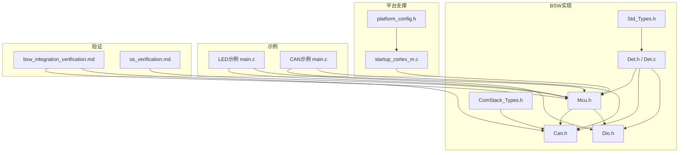
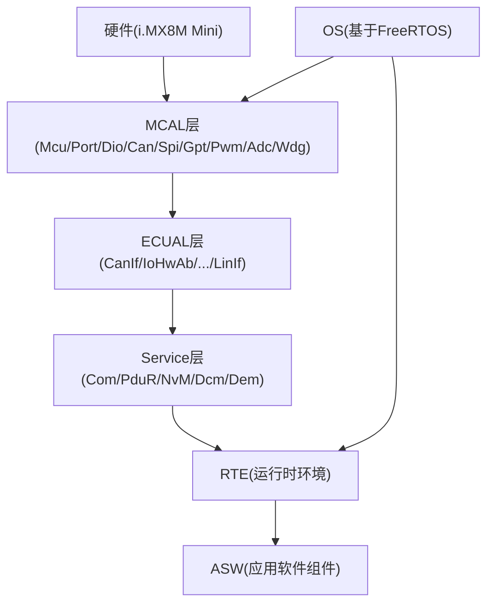
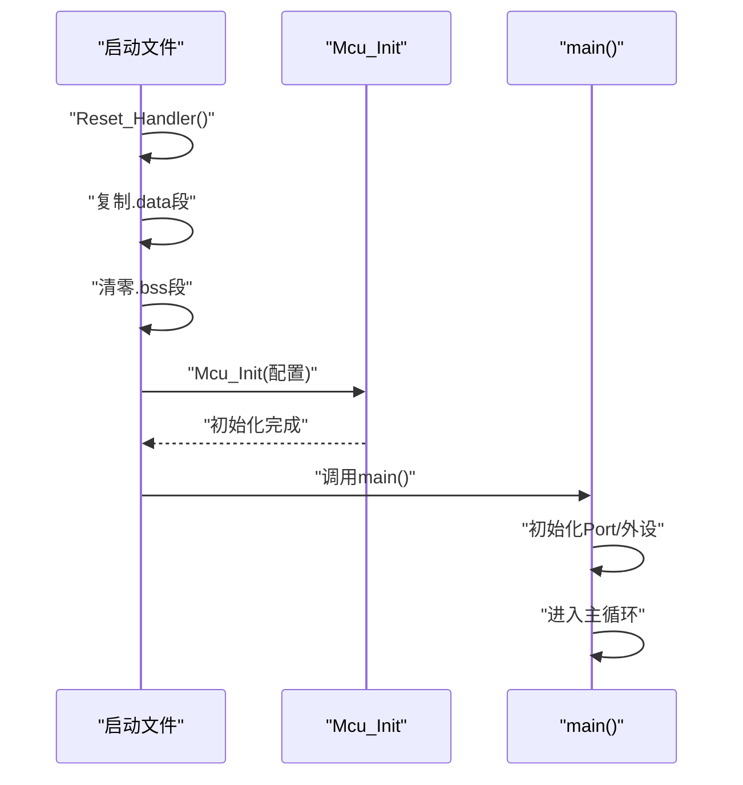
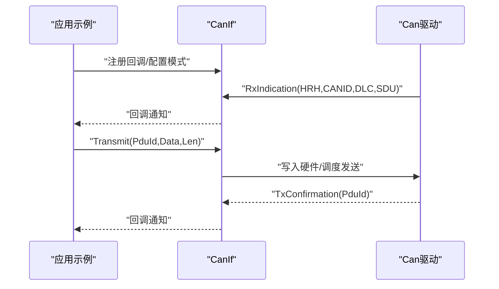
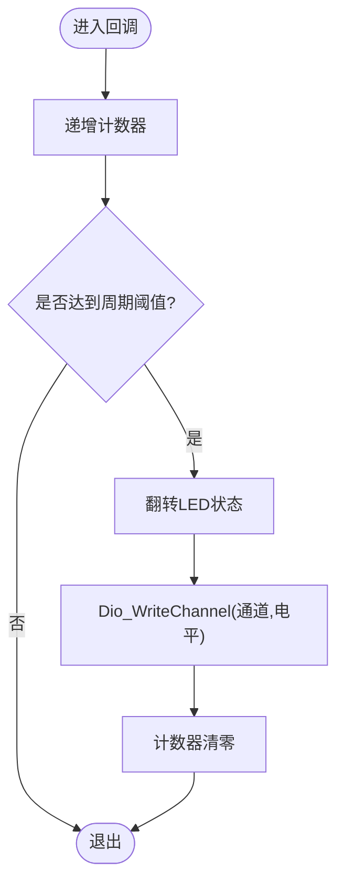
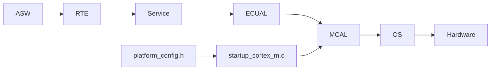

# 常见问题诊断

<cite>
**本文引用的文件**
- [README.md](file://README.md)
- [bsw_config.json](file://config/bsw_config.json)
- [platform_config.h](file://platform/cortex-m/platform_config.h)
- [startup_cortex_m.c](file://platform/cortex-m/startup_cortex_m.c)
- [Det.h](file://src/bsw/common/Det.h)
- [Det.c](file://src/bsw/common/Det.c)
- [Mcu.h](file://src/bsw/mcal/mcu/include/Mcu.h)
- [Can.h](file://src/bsw/mcal/can/include/Can.h)
- [Dio.h](file://src/bsw/mcal/dio/include/Dio.h)
- [main.c（LED闪烁示例）](file://examples/led_blink/main.c)
- [main.c（CAN通信示例）](file://examples/can_demo/main.c)
- [static_analysis.py](file://tools/analysis/static_analysis.py)
- [Std_Types.h](file://src/bsw/common/Std_Types.h)
- [ComStack_Types.h](file://src/bsw/common/ComStack_Types.h)
- [bsw_integration_verification.md](file://verification/bsw_integration_verification.md)
- [os_verification.md](file://verification/os_verification.md)
</cite>

## 目录
1. [简介](#简介)
2. [项目结构](#项目结构)
3. [核心组件](#核心组件)
4. [架构总览](#架构总览)
5. [详细组件分析](#详细组件分析)
6. [依赖关系分析](#依赖关系分析)
7. [性能考虑](#性能考虑)
8. [故障排除指南](#故障排除指南)
9. [结论](#结论)
10. [附录](#附录)

## 简介
本指南面向YuleTech BSW平台的开发者与集成者，聚焦开发过程中的常见问题与系统化诊断方法。内容覆盖编译/链接/配置/运行时错误的定位流程；硬件相关问题（MCU初始化、CAN通信、GPIO配置）的排查步骤；模块间通信与配置不匹配的解决方案；性能问题（内存与任务调度）的识别与优化；以及调试工具的实操与最佳实践。同时提供思维导图与检查清单，帮助快速定位根因。

## 项目结构
YuleTech BSW平台遵循AutoSAR Classic 4.x分层架构，涵盖MCAL、ECUAL、Service、OS、RTE、ASW等层级，并提供针对Cortex-M与i.MX8M Mini的平台支撑与示例工程。关键目录与文件如下：
- 平台支撑：platform/cortex-m（内核特性、内存、NVIC、SysTick、启动文件）
- BSW实现：src/bsw（common、mcal、ecual、services、rte、integration、os）
- 示例工程：examples（LED闪烁、CAN通信）
- 验证报告：verification（集成与OS验证）
- 工具链：tools（静态分析、配置工具等）



**图表来源**
- [platform_config.h:1-307](file://platform/cortex-m/platform_config.h#L1-L307)
- [startup_cortex_m.c:1-267](file://platform/cortex-m/startup_cortex_m.c#L1-L267)
- [Mcu.h:1-239](file://src/bsw/mcal/mcu/include/Mcu.h#L1-L239)
- [Can.h:1-269](file://src/bsw/mcal/can/include/Can.h#L1-L269)
- [Dio.h:1-195](file://src/bsw/mcal/dio/include/Dio.h#L1-L195)
- [Det.h:1-76](file://src/bsw/common/Det.h#L1-L76)
- [Det.c:1-88](file://src/bsw/common/Det.c#L1-L88)
- [Std_Types.h:1-117](file://src/bsw/common/Std_Types.h#L1-L117)
- [ComStack_Types.h:1-170](file://src/bsw/common/ComStack_Types.h#L1-L170)
- [main.c（LED闪烁示例）:1-100](file://examples/led_blink/main.c#L1-L100)
- [main.c（CAN通信示例）:1-119](file://examples/can_demo/main.c#L1-L119)
- [bsw_integration_verification.md:1-193](file://verification/bsw_integration_verification.md#L1-L193)
- [os_verification.md:1-164](file://verification/os_verification.md#L1-L164)

**章节来源**
- [README.md:153-199](file://README.md#L153-L199)

## 核心组件
- MCU驱动：提供时钟、复位、模式管理与版本信息查询，是系统初始化的首要模块。
- CAN驱动：遵循AutoSAR标准，提供控制器模式、中断、消息收发与主函数处理。
- Dio驱动：提供通道/端口/通道组的读写与翻转能力。
- DET（开发错误追踪）：统一错误上报与版本查询接口，贯穿各模块。
- 标准类型与通信栈类型：定义返回码、布尔、版本信息及通信相关类型。
- 平台配置与启动：Cortex-M内核特性、内存、NVIC优先级、SysTick、启动向量表与Reset_Handler。

**章节来源**
- [Mcu.h:134-230](file://src/bsw/mcal/mcu/include/Mcu.h#L134-L230)
- [Can.h:193-266](file://src/bsw/mcal/can/include/Can.h#L193-L266)
- [Dio.h:90-185](file://src/bsw/mcal/dio/include/Dio.h#L90-L185)
- [Det.h:47-73](file://src/bsw/common/Det.h#L47-L73)
- [Det.c:47-80](file://src/bsw/common/Det.c#L47-L80)
- [Std_Types.h:23-80](file://src/bsw/common/Std_Types.h#L23-L80)
- [ComStack_Types.h:36-168](file://src/bsw/common/ComStack_Types.h#L36-L168)
- [platform_config.h:101-153](file://platform/cortex-m/platform_config.h#L101-L153)
- [startup_cortex_m.c:243-266](file://platform/cortex-m/startup_cortex_m.c#L243-L266)

## 架构总览
YuleTech BSW平台采用AutoSAR Classic 4.x分层架构，自下而上为MCAL→ECUAL→Service→RTE→ASW，配合OS层（基于FreeRTOS）进行任务调度与资源管理。平台提供完整的错误检测（DET）与内存分区（MemMap）支持。



**图表来源**
- [bsw_integration_verification.md:136-154](file://verification/bsw_integration_verification.md#L136-L154)

**章节来源**
- [bsw_integration_verification.md:1-193](file://verification/bsw_integration_verification.md#L1-L193)

## 详细组件分析

### MCU初始化与启动流程
- Reset_Handler负责数据段复制、BSS清零、调用Mcu_Init与main。
- 平台配置定义内核特性、内存基地址、AHB/APB时钟域、NVIC优先级位宽、SysTick参数等。
- 示例中LED闪烁与CAN示例均先初始化Mcu与Port，再初始化具体外设。



**图表来源**
- [startup_cortex_m.c:243-266](file://platform/cortex-m/startup_cortex_m.c#L243-L266)
- [platform_config.h:101-153](file://platform/cortex-m/platform_config.h#L101-L153)
- [main.c（LED闪烁示例）:61-96](file://examples/led_blink/main.c#L61-L96)
- [main.c（CAN通信示例）:63-115](file://examples/can_demo/main.c#L63-L115)

**章节来源**
- [startup_cortex_m.c:243-266](file://platform/cortex-m/startup_cortex_m.c#L243-L266)
- [platform_config.h:101-153](file://platform/cortex-m/platform_config.h#L101-L153)
- [main.c（LED闪烁示例）:61-96](file://examples/led_blink/main.c#L61-L96)
- [main.c（CAN通信示例）:63-115](file://examples/can_demo/main.c#L63-L115)

### CAN通信流程
- 应用侧通过CanIf回调接收/发送，底层驱动提供Write/Read/MainFunction等处理。
- 示例展示了RxIndication与TxConfirmation回调、周期性发送与后台处理。



**图表来源**
- [main.c（CAN通信示例）:37-115](file://examples/can_demo/main.c#L37-L115)
- [Can.h:193-266](file://src/bsw/mcal/can/include/Can.h#L193-L266)

**章节来源**
- [main.c（CAN通信示例）:37-115](file://examples/can_demo/main.c#L37-L115)
- [Can.h:193-266](file://src/bsw/mcal/can/include/Can.h#L193-L266)

### GPIO与定时器联动（LED闪烁）
- 通过Dio写通道控制LED电平，Gpt定时器产生周期性中断作为tick源。
- 示例展示了回调中翻转状态与写入Dio的典型模式。



**图表来源**
- [main.c（LED闪烁示例）:37-56](file://examples/led_blink/main.c#L37-L56)
- [Dio.h:90-185](file://src/bsw/mcal/dio/include/Dio.h#L90-L185)

**章节来源**
- [main.c（LED闪烁示例）:37-56](file://examples/led_blink/main.c#L37-L56)
- [Dio.h:90-185](file://src/bsw/mcal/dio/include/Dio.h#L90-L185)

## 依赖关系分析
- 分层依赖：ASW→RTE→Service→ECUAL→MCAL→OS→Hardware，符合AutoSAR规范。
- 模块内依赖：MCAL层各驱动相互独立；ECUAL层模块依赖对应MCAL驱动；Service层依赖ECUAL与RTE；OS层为运行时调度中枢。
- 平台相关：platform_config.h定义Cortex-M内核特性、内存、NVIC与SysTick，startup_cortex_m.c实现向量表与Reset_Handler。



**图表来源**
- [bsw_integration_verification.md:136-154](file://verification/bsw_integration_verification.md#L136-L154)
- [platform_config.h:1-307](file://platform/cortex-m/platform_config.h#L1-L307)
- [startup_cortex_m.c:1-267](file://platform/cortex-m/startup_cortex_m.c#L1-L267)

**章节来源**
- [bsw_integration_verification.md:136-154](file://verification/bsw_integration_verification.md#L136-L154)
- [platform_config.h:1-307](file://platform/cortex-m/platform_config.h#L1-L307)
- [startup_cortex_m.c:1-267](file://platform/cortex-m/startup_cortex_m.c#L1-L267)

## 性能考虑
- 任务调度与中断：OS基于FreeRTOS实现，提供任务、事件、资源、报警与中断管理。报警精度受FreeRTOS tick影响，最小周期为1ms；当前为单核实现，SMP多核支持待开发。
- 代码复杂度与质量：建议保持函数圈复杂度低于10，避免过长行与尾随空白，减少不必要的全局变量与宏滥用。
- 内存分区：使用MemMap进行标准分区，确保数据段、代码段与中断向量表布局合理。

**章节来源**
- [os_verification.md:150-156](file://verification/os_verification.md#L150-L156)
- [static_analysis.py:133-175](file://tools/analysis/static_analysis.py#L133-L175)
- [static_analysis.py:193-231](file://tools/analysis/static_analysis.py#L193-L231)

## 故障排除指南

### 一、编译错误
- 常见症状
  - 找不到头文件/链接器脚本缺失
  - 未定义符号/重复定义
  - 编译器版本不兼容
- 诊断步骤
  - 确认工具链与编译器版本满足要求（GCC ARM Embedded 10.3.1+ 或 IAR 9.20+）。
  - 检查CMake工具链文件路径与生成目录。
  - 核对MemMap分区宏包含顺序，避免跨模块重复包含。
  - 使用静态分析工具生成报告，关注函数复杂度与风格问题。
- 解决方案
  - 更新工具链至推荐版本。
  - 在CMake配置中显式指定工具链文件。
  - 对齐头文件包含顺序与分区宏分组。

**章节来源**
- [README.md:97-102](file://README.md#L97-L102)
- [static_analysis.py:302-322](file://tools/analysis/static_analysis.py#L302-L322)

### 二、链接错误
- 常见症状
  - undefined reference to Reset_Handler/Mcu_Init
  - 未解析的外部符号（如Can、Dio、Os等）
- 诊断步骤
  - 确认startup_cortex_m.c被编译并链接。
  - 检查各模块的配置头文件是否正确生成与包含。
  - 核对链接脚本与向量表位置。
- 解决方案
  - 将startup文件加入构建目标。
  - 确保配置生成器输出与编译选项一致。
  - 检查链接器脚本的内存映射与中断向量表地址。

**章节来源**
- [startup_cortex_m.c:138-238](file://platform/cortex-m/startup_cortex_m.c#L138-L238)
- [bsw_config.json:1-21](file://config/bsw_config.json#L1-L21)

### 三、配置错误
- 常见症状
  - MCU时钟配置无效、CAN波特率不匹配、GPIO引脚复用冲突。
- 诊断步骤
  - 检查bsw_config.json中的模块启用与参数（如Mcu时钟频率、CAN波特率）。
  - 确认平台配置（platform_config.h）与目标硬件一致（内核类型、内存基址、AHB/APB分频）。
  - 核对MCAL/ECUAL/Service层配置头文件是否与生成器输出一致。
- 解决方案
  - 在配置文件中修正参数，确保与硬件手册一致。
  - 使用配置工具生成并校验配置头文件。
  - 对比示例工程的初始化序列，逐项核对。

**章节来源**
- [bsw_config.json:1-21](file://config/bsw_config.json#L1-L21)
- [platform_config.h:19-120](file://platform/cortex-m/platform_config.h#L19-L120)
- [Mcu.h:94-101](file://src/bsw/mcal/mcu/include/Mcu.h#L94-L101)
- [Can.h:139-164](file://src/bsw/mcal/can/include/Can.h#L139-L164)

### 四、运行时错误
- 常见症状
  - 系统卡死/HardFault、CAN通信异常、GPIO输出无效。
- 诊断步骤
  - 启用DET并在错误发生时记录模块ID、实例ID、API ID与错误码。
  - 使用示例工程对比初始化顺序与回调实现。
  - 检查NVIC优先级分组与中断使能，确认SysTick配置正确。
- 解决方案
  - 在Det_ReportError中接入日志/断点，定位错误来源。
  - 确保Mcu_Init先于其他模块初始化，Port/Can/Dio按需初始化。
  - 校验中断优先级与抢占组合，避免优先级倒置。

**章节来源**
- [Det.h:47-73](file://src/bsw/common/Det.h#L47-L73)
- [Det.c:47-80](file://src/bsw/common/Det.c#L47-L80)
- [startup_cortex_m.c:243-266](file://platform/cortex-m/startup_cortex_m.c#L243-L266)
- [platform_config.h:125-136](file://platform/cortex-m/platform_config.h#L125-L136)

### 五、硬件相关问题

#### 1) MCU初始化失败
- 症状：Reset_Handler后系统立即进入死循环或HardFault。
- 诊断
  - 检查Mcu_Init调用是否成功，PLL状态是否锁定。
  - 确认系统时钟、AHB/APB分频与外设时钟源配置。
- 解决
  - 在Mcu_InitClock后轮询PLL锁定状态，失败时进入错误处理。
  - 校正platform_config.h中的SYSTEM_CLOCK_FREQ与分频参数。

**章节来源**
- [Mcu.h:148-182](file://src/bsw/mcal/mcu/include/Mcu.h#L148-L182)
- [platform_config.h:101-119](file://platform/cortex-m/platform_config.h#L101-L119)

#### 2) CAN通信异常
- 症状：无法接收/发送报文、BusOff、仲裁丢失。
- 诊断
  - 检查Can_Init配置、波特率参数与控制器模式。
  - 核对CanIf与PduR配置，确认PDU路由与回调注册。
- 解决
  - 在示例基础上逐项比对Can_Init与CanIf_SetControllerMode调用。
  - 使用Can_MainFunction_Write/Read定期处理收发队列。

**章节来源**
- [Can.h:193-266](file://src/bsw/mcal/can/include/Can.h#L193-L266)
- [main.c（CAN通信示例）:81-115](file://examples/can_demo/main.c#L81-L115)

#### 3) GPIO配置错误
- 症状：LED不亮、按键无响应。
- 诊断
  - 检查Port初始化与Dio配置，确认引脚复用与上下拉设置。
  - 核对Dio_WriteChannel的通道ID与电平。
- 解决
  - 在Port配置中启用对应引脚，确保Dio初始化成功。
  - 使用最小化示例验证单个通道输出。

**章节来源**
- [Dio.h:90-185](file://src/bsw/mcal/dio/include/Dio.h#L90-L185)
- [main.c（LED闪烁示例）:79-96](file://examples/led_blink/main.c#L79-L96)

### 六、系统集成问题
- 症状：模块间通信中断、PDU丢失、调度异常。
- 诊断
  - 检查RTE生成与接口一致性，确认Runnable调度器运行。
  - 核对Service层（Com/PduR/NvM/Dcm/Dem）与ECUAL/OS配置。
- 解决
  - 使用验证报告对照各层API实现与配置。
  - 在OS层确保任务优先级与资源分配满足实时性。

**章节来源**
- [bsw_integration_verification.md:1-193](file://verification/bsw_integration_verification.md#L1-L193)
- [os_verification.md:1-164](file://verification/os_verification.md#L1-L164)

### 七、性能问题
- 症状：任务切换频繁、报警抖动、内存碎片。
- 诊断
  - 使用静态分析工具评估函数复杂度与代码行长度。
  - 检查OS报警周期与任务栈大小，确认FreeRTOS tick精度。
- 优化
  - 降低函数复杂度，拆分长函数；减少中断处理时间。
  - 合理设置报警周期与任务优先级，避免抢占风暴。

**章节来源**
- [static_analysis.py:133-175](file://tools/analysis/static_analysis.py#L133-L175)
- [static_analysis.py:193-231](file://tools/analysis/static_analysis.py#L193-L231)
- [os_verification.md:150-156](file://verification/os_verification.md#L150-L156)

### 八、调试工具与最佳实践
- 静态分析
  - 使用static_analysis.py生成报告，关注MISRA规则、复杂度与风格问题。
  - 输出JSON报告便于持续集成与质量门禁。
- 最佳实践
  - 严格遵循AutoSAR命名与类型定义（Std_Types、ComStack_Types）。
  - 在所有模块中启用DET并记录关键错误码。
  - 使用示例工程作为基准，逐步增加功能。

**章节来源**
- [static_analysis.py:302-322](file://tools/analysis/static_analysis.py#L302-L322)
- [Std_Types.h:23-80](file://src/bsw/common/Std_Types.h#L23-L80)
- [ComStack_Types.h:36-168](file://src/bsw/common/ComStack_Types.h#L36-L168)
- [Det.h:47-73](file://src/bsw/common/Det.h#L47-L73)

## 故障排除思维导图与检查清单

### 思维导图
```mermaid
mindmap
ul
li 编译错误
li 工具链版本
li 头文件/链接脚本
li MemMap分区
li 链接错误
li Reset_Handler/符号未解析
li 启动文件/链接脚本
li 配置错误
li bsw_config.json
li platform_config.h
li 配置生成器
li 运行时错误
li DET启用与日志
li 初始化顺序
li NVIC优先级
li 硬件问题
li MCU初始化
li CAN通信
li GPIO配置
li 集成问题
li 模块间通信
li 配置不匹配
li 性能问题
li 复杂度/风格
li 任务调度/报警
```

### 检查清单
- 工具链与构建
  - [ ] 编译器版本满足要求
  - [ ] CMake工具链文件正确
  - [ ] MemMap分区宏顺序正确
- 配置与平台
  - [ ] bsw_config.json参数与硬件匹配
  - [ ] platform_config.h内核/时钟/内存配置正确
  - [ ] 配置生成器输出一致
- 初始化与启动
  - [ ] Reset_Handler执行流程正确
  - [ ] Mcu_Init先于其他模块
  - [ ] Port/外设初始化成功
- 通信与I/O
  - [ ] Can_Init/CanIf配置正确
  - [ ] Dio通道ID与硬件一致
  - [ ] 回调函数注册与处理
- 调试与验证
  - [ ] DET启用并记录错误
  - [ ] 静态分析报告通过
  - [ ] 示例工程可正常运行

## 结论
本指南提供了从编译、链接、配置到运行时与硬件层面的系统化诊断方法，并结合平台配置、示例工程与验证报告给出可操作的排错步骤与优化建议。建议在开发流程中持续使用静态分析与示例工程作为质量保障手段，确保系统稳定与可维护性。

## 附录
- 参考文档与示例
  - [README.md:95-133](file://README.md#L95-L133)
  - [examples/led_blink/main.c:61-96](file://examples/led_blink/main.c#L61-L96)
  - [examples/can_demo/main.c:63-115](file://examples/can_demo/main.c#L63-L115)
- 验证与规范
  - [bsw_integration_verification.md:1-193](file://verification/bsw_integration_verification.md#L1-L193)
  - [os_verification.md:1-164](file://verification/os_verification.md#L1-L164)