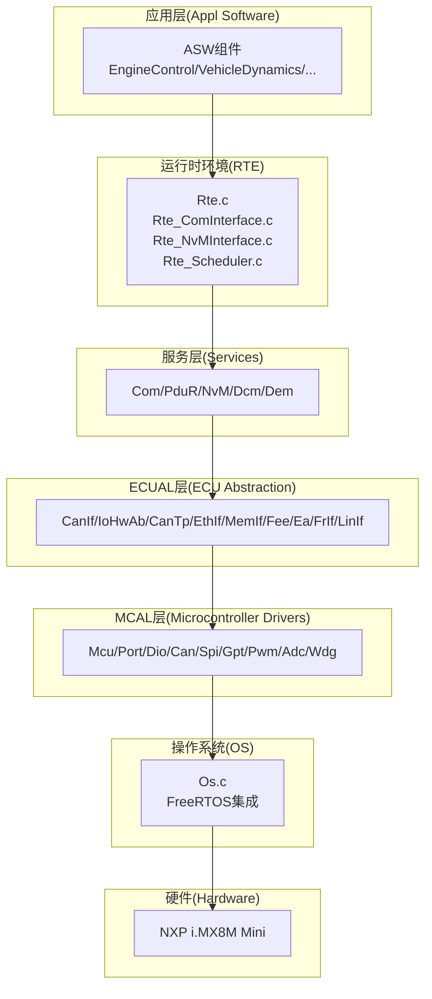
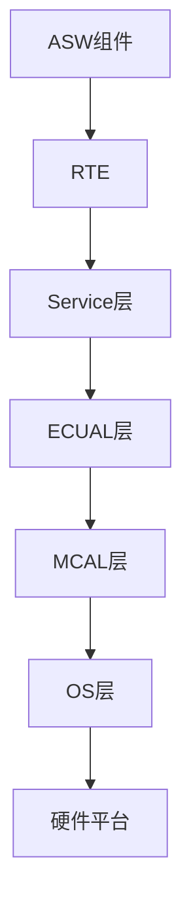
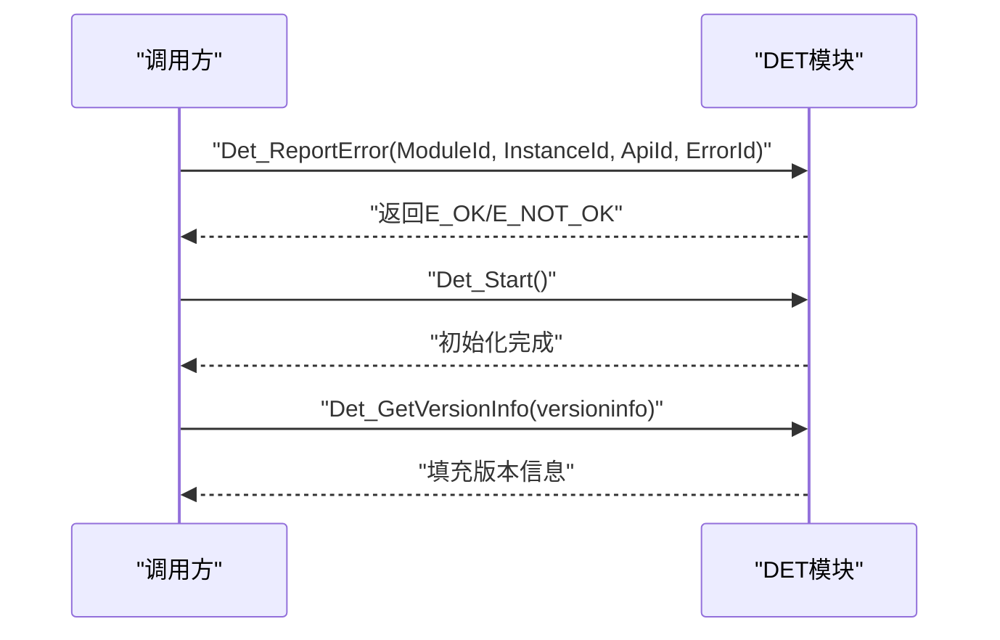
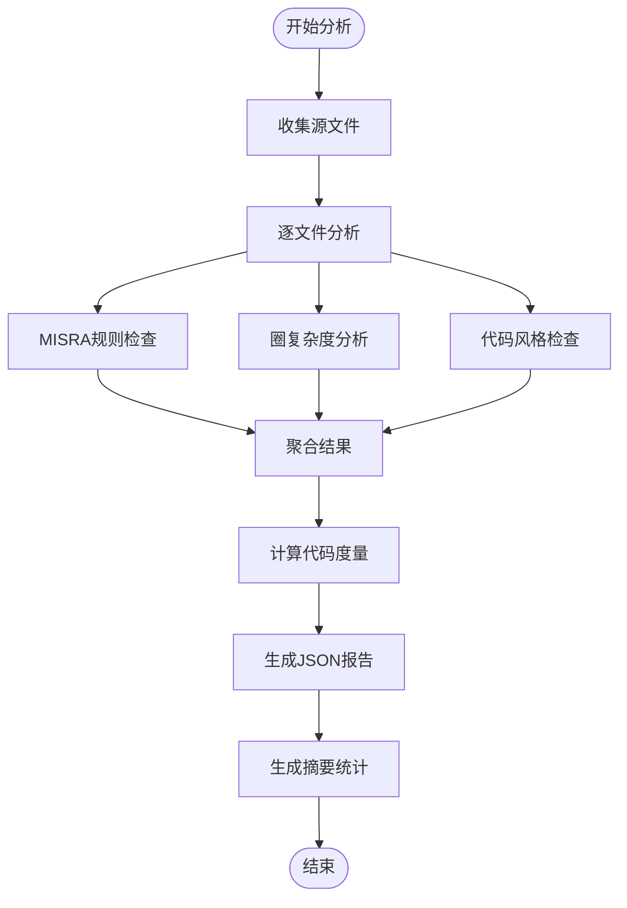
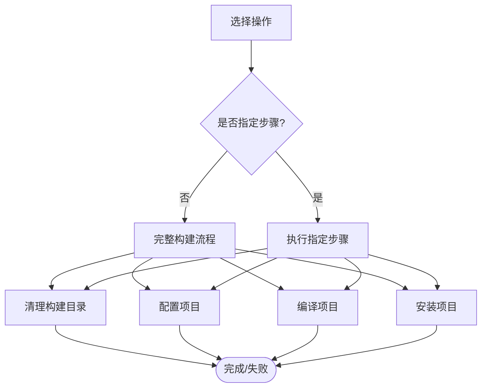
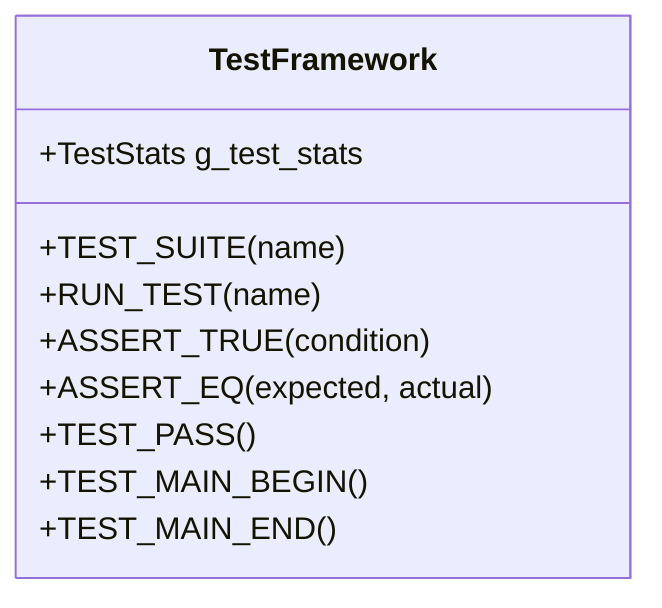
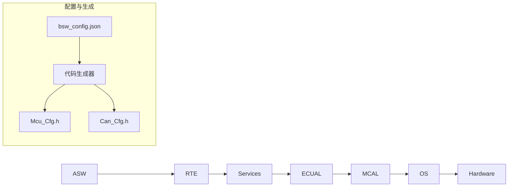

# 故障排除与调试

<cite>
**本文引用的文件**
- [README.md](file://README.md)
- [bsw_config.json](file://config/bsw_config.json)
- [static_analysis_report.json](file://reports/static_analysis_report.json)
- [Det.h](file://src/bsw/common/Det.h)
- [Det.c](file://src/bsw/common/Det.c)
- [build.py](file://tools/build/build.py)
- [test_framework.h](file://tests/unit/test_framework.h)
- [static_analysis.py](file://tools/analysis/static_analysis.py)
- [report_summary.py](file://tools/analysis/report_summary.py)
- [main.c](file://examples/can_demo/main.c)
- [platform_config.h](file://platform/cortex-m/platform_config.h)
- [BswM.h](file://src/bsw/integration/BswM.h)
- [EcuM.h](file://src/bsw/integration/EcuM.h)
- [bsw_integration_verification.md](file://verification/bsw_integration_verification.md)
- [asw_verification.md](file://verification/asw_verification.md)
- [os_verification.md](file://verification/os_verification.md)
- [code_generator.py](file://tools/generator/src/code_generator.py)
</cite>

## 目录
1. [简介](#简介)
2. [项目结构](#项目结构)
3. [核心组件](#核心组件)
4. [架构总览](#架构总览)
5. [详细组件分析](#详细组件分析)
6. [依赖关系分析](#依赖关系分析)
7. [性能考虑](#性能考虑)
8. [故障排除指南](#故障排除指南)
9. [结论](#结论)
10. [附录](#附录)

## 简介
本指南面向YuleTech BSW平台的开发者与维护者，提供系统化的故障排除与调试方法。内容覆盖编译错误、链接错误、运行时错误与功能缺陷的排查流程；详解DET错误检测机制的使用与日志分析技巧；介绍静态分析报告的解读与调试工具配置；并给出性能瓶颈识别与内存泄漏检测方法，帮助快速定位问题并提升代码质量。

## 项目结构
YuleTech BSW平台采用AutoSAR Classic Platform 4.x分层架构，自下而上包含MCAL、ECUAL、Service、OS、RTE与ASW层。项目提供示例工程、集成验证报告与多种工具链，便于开发与调试。



图示来源
- [bsw_integration_verification.md:136-154](file://verification/bsw_integration_verification.md#L136-L154)
- [asw_verification.md:1-251](file://verification/asw_verification.md#L1-L251)
- [os_verification.md:1-164](file://verification/os_verification.md#L1-L164)

章节来源
- [README.md:46-93](file://README.md#L46-L93)
- [bsw_integration_verification.md:15-25](file://verification/bsw_integration_verification.md#L15-L25)

## 核心组件
- DET错误检测：提供开发期错误上报与版本信息查询接口，便于在开发阶段捕获非法调用与参数错误。
- 静态分析工具：集成MISRA C检查、圈复杂度分析与代码风格检查，生成JSON报告并支持摘要统计。
- 构建工具：封装CMake流程，支持清理、配置、构建与安装，便于统一构建与问题定位。
- 单元测试框架：提供断言宏与测试运行器，支持快速编写与执行单元测试。
- 示例工程：CAN通信演示，展示模块初始化、回调与主循环调用，便于验证通信链路。
- 平台配置：Cortex-M平台配置，包含内存、时钟、NVIC与SysTick等底层能力，支撑调试与性能分析。

章节来源
- [Det.h:48-73](file://src/bsw/common/Det.h#L48-L73)
- [Det.c:47-80](file://src/bsw/common/Det.c#L47-L80)
- [static_analysis.py:52-379](file://tools/analysis/static_analysis.py#L52-L379)
- [build.py:15-167](file://tools/build/build.py#L15-L167)
- [test_framework.h:18-141](file://tests/unit/test_framework.h#L18-L141)
- [main.c:37-118](file://examples/can_demo/main.c#L37-L118)
- [platform_config.h:12-306](file://platform/cortex-m/platform_config.h#L12-L306)

## 架构总览
AutoSAR分层架构中，各层职责清晰：MCAL负责硬件抽象，ECUAL提供通信抽象，Service层实现具体服务，RTE协调组件间通信，OS提供调度与资源管理，ASW实现业务逻辑。调试时应从底层到上层逐层验证，确保接口契约与数据流正确。



图示来源
- [bsw_integration_verification.md:136-154](file://verification/bsw_integration_verification.md#L136-L154)

## 详细组件分析

### DET错误检测机制
DET模块提供错误上报、启动与版本信息查询接口。在开发阶段，应启用DEV_ERROR_DETECT并在关键路径调用错误上报函数，结合静态分析工具与日志定位问题。



图示来源
- [Det.h:48-73](file://src/bsw/common/Det.h#L48-L73)
- [Det.c:47-80](file://src/bsw/common/Det.c#L47-L80)

章节来源
- [Det.h:34-70](file://src/bsw/common/Det.h#L34-L70)
- [Det.c:47-80](file://src/bsw/common/Det.c#L47-L80)

### 静态分析工具与报告解读
静态分析工具支持MISRA C规则检查、圈复杂度分析与代码风格检查，生成JSON报告并提供摘要统计。建议按“错误-警告-信息”三类分级处理，并重点关注高复杂度函数与高频违规规则。



图示来源
- [static_analysis.py:100-379](file://tools/analysis/static_analysis.py#L100-L379)
- [report_summary.py:7-89](file://tools/analysis/report_summary.py#L7-L89)

章节来源
- [static_analysis.py:52-379](file://tools/analysis/static_analysis.py#L52-L379)
- [report_summary.py:7-89](file://tools/analysis/report_summary.py#L7-L89)
- [static_analysis_report.json:1-800](file://reports/static_analysis_report.json#L1-L800)

### 构建工具与常见编译/链接问题
构建工具封装CMake流程，支持清理、配置、构建与安装。若出现编译错误，优先检查工具链配置、头文件路径与依赖库链接；若出现链接错误，重点核查符号定义与库顺序。



图示来源
- [build.py:104-167](file://tools/build/build.py#L104-L167)

章节来源
- [build.py:15-167](file://tools/build/build.py#L15-L167)

### 单元测试框架与断点调试
单元测试框架提供断言宏与测试运行器，便于快速定位逻辑错误。结合IDE断点与变量监视，可高效定位函数调用异常与数据不一致问题。



图示来源
- [test_framework.h:18-141](file://tests/unit/test_framework.h#L18-L141)

章节来源
- [test_framework.h:18-141](file://tests/unit/test_framework.h#L18-L141)

### 示例工程：CAN通信调试
示例工程展示了MCAL、ECUAL与RTE的典型调用序列，适合验证通信链路与回调机制。调试时关注初始化顺序、主循环调用与回调触发。

```mermaid
sequenceDiagram
participant Main as "main()"
participant Mcu as "Mcu_Init"
participant Port as "Port_Init"
participant Can as "Can_Init"
participant CanIf as "CanIf_Init/SetControllerMode"
participant Loop as "主循环"
participant Rx as "CanIf_RxIndication"
participant Tx as "CanIf_TxConfirmation"
Main->>Mcu : "初始化MCU"
Main->>Port : "初始化端口"
Main->>Can : "初始化CAN"
Main->>CanIf : "初始化并设置控制器模式"
Loop->>Loop : "周期性发送/后台处理"
Rx-->>Main : "接收回调触发"
Tx-->>Main : "发送确认回调触发"
```

图示来源
- [main.c:63-118](file://examples/can_demo/main.c#L63-L118)

章节来源
- [main.c:37-118](file://examples/can_demo/main.c#L37-L118)

### 平台配置与底层调试
平台配置文件定义Cortex-M内核特性、内存布局与时钟频率等，影响中断、SysTick与调试行为。调试时可调整SysTick配置与NVIC优先级，观察中断响应与调度行为。

章节来源
- [platform_config.h:12-306](file://platform/cortex-m/platform_config.h#L12-L306)

### 集成与系统验证
集成验证报告涵盖MCAL、ECUAL、Service、OS、RTE与ASW层的验证结果，可作为回归测试基线。若新增模块或修改配置，建议重新执行对应层的验证流程。

章节来源
- [bsw_integration_verification.md:15-193](file://verification/bsw_integration_verification.md#L15-L193)
- [asw_verification.md:1-251](file://verification/asw_verification.md#L1-L251)
- [os_verification.md:1-164](file://verification/os_verification.md#L1-L164)

## 依赖关系分析
- 分层依赖：上层仅能调用下层，违反分层约束会导致编译或链接错误。
- 模块间接口：RTE负责组件间通信，Service层提供具体服务接口，ECUAL抽象物理接口，MCAL提供硬件驱动。
- 配置与生成：配置工具根据bsw_config.json生成模块配置头文件，确保编译期常量与运行期行为一致。



图示来源
- [bsw_integration_verification.md:136-154](file://verification/bsw_integration_verification.md#L136-L154)
- [code_generator.py:59-152](file://tools/generator/src/code_generator.py#L59-L152)
- [bsw_config.json:1-21](file://config/bsw_config.json#L1-L21)

章节来源
- [code_generator.py:59-152](file://tools/generator/src/code_generator.py#L59-L152)
- [bsw_config.json:1-21](file://config/bsw_config.json#L1-L21)

## 性能考虑
- 圈复杂度：静态分析工具会统计函数复杂度，建议将复杂度控制在10以内，避免过高的分支与嵌套导致维护困难与潜在缺陷。
- 任务与报警：OS层提供任务、事件、资源与报警管理，注意报警精度与调度开销；在FreeRTOS映射下，最小周期受tick精度限制。
- 通信链路：CAN通信示例展示了主循环与后台处理的调用关系，调试时关注周期性任务的执行时间与回调触发频率。

章节来源
- [static_analysis.py:133-175](file://tools/analysis/static_analysis.py#L133-L175)
- [os_verification.md:60-97](file://verification/os_verification.md#L60-L97)
- [main.c:92-115](file://examples/can_demo/main.c#L92-L115)

## 故障排除指南

### 编译错误排查
- 工具链与头文件：确认CMake工具链文件路径正确，头文件包含路径完整，避免“未解析的外部命令”或“找不到头文件”。
- 配置生成：若使用配置生成器，请先生成Mcu_Cfg.h与Can_Cfg.h，再进行编译。
- 代码规范：遵循MISRA C与项目命名规范，避免隐式返回类型、空if语句等违规。

章节来源
- [build.py:36-59](file://tools/build/build.py#L36-L59)
- [code_generator.py:131-152](file://tools/generator/src/code_generator.py#L131-L152)
- [static_analysis.py:61-98](file://tools/analysis/static_analysis.py#L61-L98)

### 链接错误排查
- 符号定义：检查模块是否正确导出符号，避免未定义引用；确认链接顺序与库依赖。
- 内存分区：确保MemMap分区包含正确，避免数据段或代码段放置错误导致链接失败。

章节来源
- [bsw_integration_verification.md:122-133](file://verification/bsw_integration_verification.md#L122-L133)

### 运行时错误与功能缺陷
- DET错误检测：在关键API处调用错误上报，结合静态分析报告定位非法参数与越界访问。
- 回调与主循环：以CAN示例为例，检查初始化顺序、主循环调用与回调触发，确保数据一致性与时序正确。
- OS调度：关注任务切换、事件等待与报警触发，避免优先级反转与死锁。

章节来源
- [Det.h:48-73](file://src/bsw/common/Det.h#L48-L73)
- [Det.c:47-80](file://src/bsw/common/Det.c#L47-L80)
- [main.c:63-118](file://examples/can_demo/main.c#L63-L118)
- [os_verification.md:30-97](file://verification/os_verification.md#L30-L97)

### 日志分析技巧
- 静态分析报告：使用报告摘要工具查看问题分类统计、Top规则违规与高复杂度函数，优先修复错误类问题。
- 代码度量：关注注释率、函数数量与平均/最大复杂度，评估代码可维护性。

章节来源
- [report_summary.py:7-89](file://tools/analysis/report_summary.py#L7-L89)
- [static_analysis_report.json:1-800](file://reports/static_analysis_report.json#L1-L800)

### 性能瓶颈识别
- 圈复杂度：高复杂度函数易产生性能热点，建议拆分逻辑或引入缓存。
- 任务与报警：检查任务执行时间与报警周期，避免频繁唤醒与上下文切换开销。
- 通信链路：测量发送/接收周期与回调触发频率，优化主循环与后台处理。

章节来源
- [static_analysis.py:133-175](file://tools/analysis/static_analysis.py#L133-L175)
- [os_verification.md:60-97](file://verification/os_verification.md#L60-L97)
- [main.c:92-115](file://examples/can_demo/main.c#L92-L115)

### 内存泄漏检测方法
- 静态分析：通过MISRA与风格检查发现悬空指针、未释放资源等潜在问题。
- 运行时监控：在FreeRTOS环境下，利用栈溢出检测与资源管理API监控内存使用情况。

章节来源
- [asw_verification.md:213-224](file://verification/asw_verification.md#L213-L224)
- [os_verification.md:150-156](file://verification/os_verification.md#L150-L156)

### 调试工具使用与断点设置
- 断点设置：在关键API入口（如CanIf_Init、CanIf_SetControllerMode）与回调函数（如CanIf_RxIndication）设置断点，观察参数与返回值。
- 变量监视：监视全局计数器（如tx/rx计数器）、状态标志与队列长度，辅助定位数据流异常。
- 平台寄存器：通过SysTick与NVIC寄存器观察中断与调度行为，必要时调整优先级与时钟频率。

章节来源
- [main.c:37-58](file://examples/can_demo/main.c#L37-L58)
- [platform_config.h:286-304](file://platform/cortex-m/platform_config.h#L286-L304)

### 静态分析工具配置与预防
- 规则定制：根据项目规范调整MISRA规则与复杂度阈值，定期生成报告并纳入CI流程。
- 自动化：在构建脚本中集成静态分析与报告生成，确保每次提交都进行质量检查。

章节来源
- [static_analysis.py:52-379](file://tools/analysis/static_analysis.py#L52-L379)
- [build.py:104-124](file://tools/build/build.py#L104-L124)

## 结论
通过系统化的故障排除与调试方法，结合DET错误检测、静态分析报告与平台配置，能够快速定位并解决编译、链接、运行时与功能缺陷问题。建议将静态分析与单元测试纳入日常开发流程，持续提升代码质量与系统稳定性。

## 附录

### 常用命令与流程
- 构建：使用构建工具执行完整流程或指定步骤。
- 静态分析：运行静态分析工具生成报告并使用摘要工具查看统计。
- 配置生成：根据bsw_config.json生成模块配置头文件。
- 验证：参考集成与OS验证报告，确保各层功能符合AutoSAR标准。

章节来源
- [build.py:104-167](file://tools/build/build.py#L104-L167)
- [static_analysis.py:361-379](file://tools/analysis/static_analysis.py#L361-L379)
- [report_summary.py:7-89](file://tools/analysis/report_summary.py#L7-L89)
- [code_generator.py:131-152](file://tools/generator/src/code_generator.py#L131-L152)
- [bsw_integration_verification.md:15-193](file://verification/bsw_integration_verification.md#L15-L193)
- [os_verification.md:1-164](file://verification/os_verification.md#L1-L164)