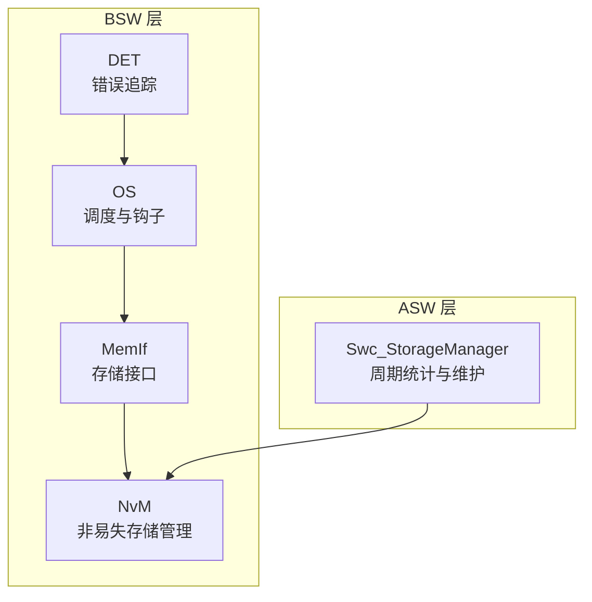
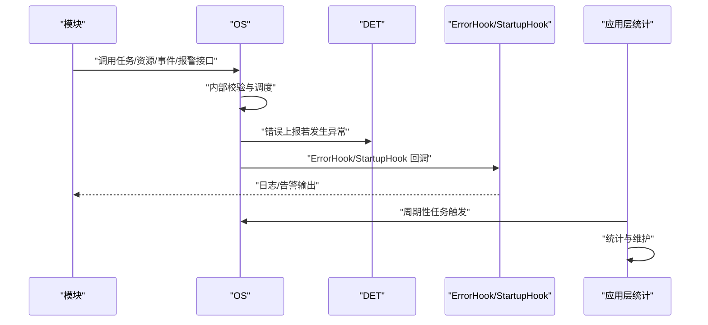
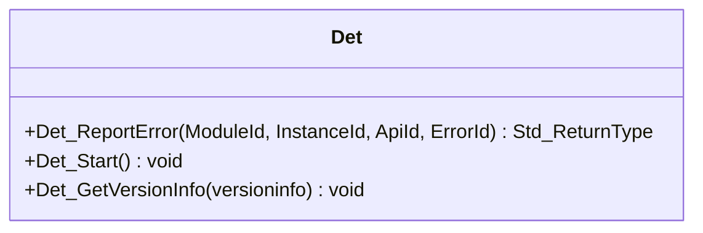
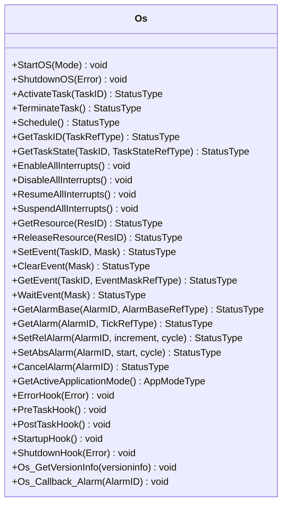
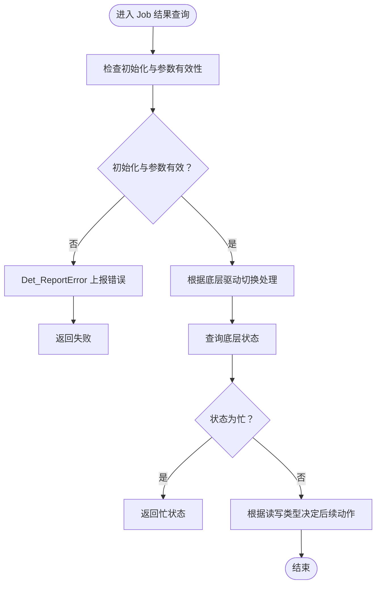
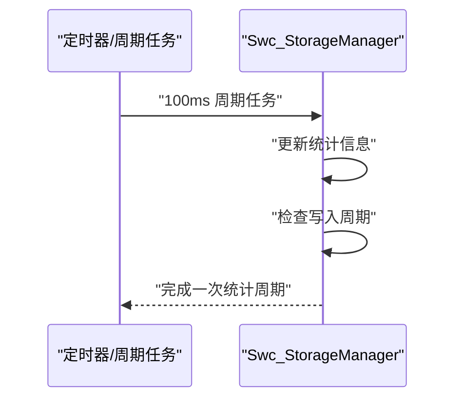
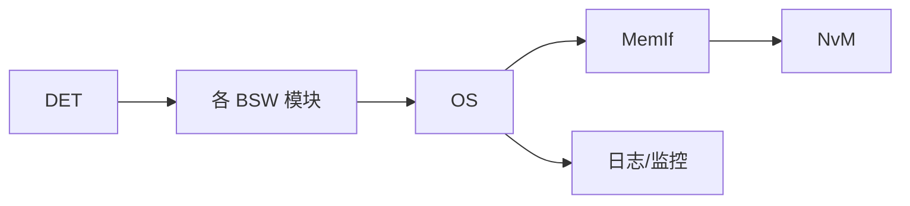

# 日志记录与监控

<cite>
**本文引用的文件**
- [Det.h](file://src/bsw/common/Det.h)
- [Det.c](file://src/bsw/common/Det.c)
- [Os.h](file://src/bsw/os/include/Os.h)
- [Os.c](file://src/bsw/os/src/Os.c)
- [development-guide.md](file://docs/development-guide.md)
- [changelog.md](file://docs/changelog.md)
- [MemMap.h](file://src/bsw/general/inc/MemMap.h)
- [Swc_StorageManager.c](file://src/asw/storage_manager/src/Swc_StorageManager.c)
- [MemIf.c](file://src/bsw/ecual/memif/src/MemIf.c)
- [NvM.c](file://src/bsw/services/nvm/src/NvM.c)
- [test_framework.h](file://tests/unit/test_framework.h)
</cite>

## 目录
1. [简介](#简介)
2. [项目结构](#项目结构)
3. [核心组件](#核心组件)
4. [架构总览](#架构总览)
5. [详细组件分析](#详细组件分析)
6. [依赖关系分析](#依赖关系分析)
7. [性能考量](#性能考量)
8. [故障排查指南](#故障排查指南)
9. [结论](#结论)
10. [附录](#附录)

## 简介
本文件面向 YuleTech BSW 平台，系统化阐述日志记录与监控体系的设计与实现要点，覆盖 BSW 模块中的错误追踪（DET）、运行时调度与回调钩子（OS）、以及应用层统计与可观测性实践。文档同时给出日志级别与格式建议、运行时监控指标与采集方法、日志分析与告警思路，以及最佳实践与性能优化建议。

## 项目结构
围绕日志与监控的关键路径包括：
- 错误追踪（DET）：统一的错误上报与版本查询接口，贯穿各模块。
- 操作系统（OS）：基于 FreeRTOS 的调度与回调钩子，提供启动/关闭、任务/资源/事件/报警管理。
- 应用层统计：存储管理器示例展示周期性统计与健康检查。
- 存储接口与 NvM：通过状态机与重试逻辑体现运行时监控与恢复策略。
- 开发指南与测试框架：提供日志输出、断言与调试建议。

**图表来源**
- [Det.h:1-76](file://src/bsw/common/Det.h#L1-L76)
- [Det.c:1-88](file://src/bsw/common/Det.c#L1-L88)
- [Os.h:1-213](file://src/bsw/os/include/Os.h#L1-L213)
- [Os.c:1-800](file://src/bsw/os/src/Os.c#L1-L800)
- [MemIf.c:225-268](file://src/bsw/ecual/memif/src/MemIf.c#L225-L268)
- [NvM.c:2043-2071](file://src/bsw/services/nvm/src/NvM.c#L2043-L2071)
- [Swc_StorageManager.c:185-235](file://src/asw/storage_manager/src/Swc_StorageManager.c#L185-L235)

**章节来源**
- [changelog.md:1-205](file://docs/changelog.md#L1-L205)

## 核心组件
- 错误追踪（DET）
  - 提供统一的错误上报接口、启动与版本信息查询。
  - 作为模块间错误检测的“统一出口”，便于集中处理与日志化。
- 操作系统（OS）
  - 提供任务、资源、事件、报警管理，并定义错误钩子与启动/关闭回调。
  - 通过回调钩子可注入日志与监控逻辑。
- 存储接口（MemIf）与 NvM
  - 通过状态查询与重试机制，体现运行时健康度与可靠性监控。
- 应用层统计（Swc_StorageManager）
  - 展示周期性统计与维护流程，可作为运行时指标采集的参考实现。

**章节来源**
- [Det.h:34-70](file://src/bsw/common/Det.h#L34-L70)
- [Det.c:47-80](file://src/bsw/common/Det.c#L47-L80)
- [Os.h:154-210](file://src/bsw/os/include/Os.h#L154-L210)
- [Os.c:84-139](file://src/bsw/os/src/Os.c#L84-L139)
- [MemIf.c:225-268](file://src/bsw/ecual/memif/src/MemIf.c#L225-L268)
- [NvM.c:2043-2071](file://src/bsw/services/nvm/src/NvM.c#L2043-L2071)
- [Swc_StorageManager.c:185-235](file://src/asw/storage_manager/src/Swc_StorageManager.c#L185-L235)

## 架构总览
下图展示了从模块调用到 OS 回调再到 DET 错误上报的整体链路，以及应用层统计与存储子系统的协同。

**图表来源**
- [Os.h:196-201](file://src/bsw/os/include/Os.h#L196-L201)
- [Os.c:84-139](file://src/bsw/os/src/Os.c#L84-L139)
- [Det.h:48-70](file://src/bsw/common/Det.h#L48-L70)

## 详细组件分析

### 错误追踪（DET）组件
- 职责
  - 统一错误上报入口，支持启动与版本查询。
  - 作为模块级错误检测的“开关”，通过宏在编译期启用/禁用。
- 关键接口
  - 错误上报、启动、版本信息获取。
- 设计要点
  - 模块 ID、实例 ID、API ID、错误 ID 的标准化，便于日志聚合与检索。
  - 与 OS 的错误钩子配合，形成“运行时错误捕获—上报—日志”的闭环。

**图表来源**
- [Det.h:48-70](file://src/bsw/common/Det.h#L48-L70)
- [Det.c:47-80](file://src/bsw/common/Det.c#L47-L80)

**章节来源**
- [Det.h:1-76](file://src/bsw/common/Det.h#L1-L76)
- [Det.c:1-88](file://src/bsw/common/Det.c#L1-L88)

### 操作系统（OS）组件
- 职责
  - 任务生命周期管理、资源互斥、事件同步、报警调度。
  - 提供错误钩子与启动/关闭回调，用于注入日志与监控。
- 关键接口
  - 任务管理、中断管理、资源管理、事件管理、报警管理、OS控制、版本信息、BSW报警回调分发。
- 设计要点
  - 通过回调钩子（ErrorHook、StartupHook、PreTaskHook、PostTaskHook）插入日志与监控。
  - 与 DET 协同，在异常路径上报错误并触发日志输出。

**图表来源**
- [Os.h:154-210](file://src/bsw/os/include/Os.h#L154-L210)
- [Os.c:84-139](file://src/bsw/os/src/Os.c#L84-L139)

**章节来源**
- [Os.h:1-213](file://src/bsw/os/include/Os.h#L1-L213)
- [Os.c:1-800](file://src/bsw/os/src/Os.c#L1-L800)

### 存储接口（MemIf）与 NvM 组件
- 职责
  - MemIf 提供设备状态查询；NvM 通过状态机与重试逻辑保障数据一致性与可靠性。
- 关键点
  - 通过状态判断与错误上报，体现运行时健康度与恢复策略。
  - 可结合周期性任务输出统计与告警。

**图表来源**
- [MemIf.c:249-268](file://src/bsw/ecual/memif/src/MemIf.c#L249-L268)
- [NvM.c:2043-2071](file://src/bsw/services/nvm/src/NvM.c#L2043-L2071)

**章节来源**
- [MemIf.c:225-268](file://src/bsw/ecual/memif/src/MemIf.c#L225-L268)
- [NvM.c:2043-2071](file://src/bsw/services/nvm/src/NvM.c#L2043-L2071)

### 应用层统计（Swc_StorageManager）组件
- 职责
  - 周期性更新统计信息，检查写入周期，触发维护操作。
- 关键点
  - 可作为运行时指标采集的参考实现，便于集成日志与告警。

**图表来源**
- [Swc_StorageManager.c:185-235](file://src/asw/storage_manager/src/Swc_StorageManager.c#L185-L235)

**章节来源**
- [Swc_StorageManager.c:185-235](file://src/asw/storage_manager/src/Swc_StorageManager.c#L185-L235)

## 依赖关系分析
- 模块耦合
  - DET 作为横切关注点被各模块通过宏调用；OS 作为调度中枢，向上承接模块调用，向下驱动存储与服务。
  - MemIf 与 NvM 形成“接口—实现”协作，共同承担数据可靠性职责。
- 外部依赖
  - OS 基于 FreeRTOS，回调钩子为日志与监控提供天然切入点。
  - MemMap.h 用于内存分区，确保代码与变量按段组织，利于静态分析与链接。

**图表来源**
- [Det.h:48-70](file://src/bsw/common/Det.h#L48-L70)
- [Os.h:154-210](file://src/bsw/os/include/Os.h#L154-L210)
- [MemMap.h](file://src/bsw/general/inc/MemMap.h)

**章节来源**
- [MemMap.h](file://src/bsw/general/inc/MemMap.h)

## 性能考量
- 错误检测与日志开销
  - 在开发阶段启用 DET 错误检测，有助于早期发现异常；生产环境可根据需求选择性开启，避免对实时性造成影响。
- OS 回调与日志
  - 回调钩子（如 ErrorHook、StartupHook）应尽量轻量化，避免阻塞或引入抖动。
- 存储与统计
  - 周期性统计与维护应在低优先级任务中执行，避免抢占关键路径。
- 内存分区
  - 严格使用 MemMap.h 进行内存分区，减少碎片与链接时的不确定性。

[本节为通用指导，无需列出具体文件来源]

## 故障排查指南
- 使用 DET 进行错误定位
  - 在模块中启用 DET 错误检测宏，结合错误码与 API ID，快速定位问题模块与调用点。
- 日志输出与断言
  - 开发指南提供了条件日志输出与断言示例，可在关键路径加入日志，辅助回溯。
- GDB 调试
  - 通过 GDB 设置断点、单步执行、查看变量与调用栈，定位运行时问题。
- 测试框架
  - 使用测试框架提供的断言宏，确保边界条件与异常路径得到覆盖。

**章节来源**
- [development-guide.md:431-495](file://docs/development-guide.md#L431-L495)
- [test_framework.h:44-92](file://tests/unit/test_framework.h#L44-L92)

## 结论
YuleTech BSW 平台的日志与监控体系以 DET 为错误追踪基座，以 OS 回调为日志与监控注入点，辅以 MemIf/NvM 的状态与重试机制，以及应用层统计示例，形成了从模块到系统层面的可观测闭环。结合开发指南中的日志与调试建议，可进一步完善日志级别、格式与告警策略，提升问题定位效率与系统稳定性。

[本节为总结性内容，无需列出具体文件来源]

## 附录

### 日志级别与格式建议
- 级别建议
  - TRACE/DEBUG/INFO/WARN/ERROR/FATAL
  - 建议在开发阶段使用 DEBUG/INFO，生产阶段聚焦 ERROR/FATAL
- 格式建议
  - 时间戳、模块标识、任务/线程 ID、日志级别、消息正文
  - 可选：API ID、错误码、堆栈摘要
- 输出目标
  - 控制台、串口、文件、网络日志收集端

[本节为通用指导，无需列出具体文件来源]

### 运行时监控指标与采集
- 任务执行
  - 任务状态（就绪/运行/等待/挂起）、切换次数、上下文切换频率
  - 采集点：OS 任务状态查询与回调钩子
- 内存使用
  - 堆栈使用率、可用堆大小、内存分配失败次数
  - 采集点：系统统计与应用层统计
- 通信状态
  - 发送/接收队列长度、丢包数、错误帧数
  - 采集点：通信模块与路由器统计
- 存储健康
  - 读写次数、擦写周期、坏块数量、重试次数
  - 采集点：存储管理器与 NvM 状态

**章节来源**
- [Swc_StorageManager.c:185-235](file://src/asw/storage_manager/src/Swc_StorageManager.c#L185-L235)
- [NvM.c:2043-2071](file://src/bsw/services/nvm/src/NvM.c#L2043-L2071)

### 日志分析与告警
- 分析方法
  - 聚合错误码与 API ID，识别热点模块与高频异常
  - 对比任务状态变化，定位调度瓶颈
  - 关联存储重试与写入周期，评估磨损风险
- 告警机制
  - 阈值告警：连续错误超阈、任务长时间阻塞、存储重试过多
  - 变化告警：状态突变、异常上升沿
  - 自动恢复：达到阈值自动降级或重启

[本节为通用指导，无需列出具体文件来源]

### 最佳实践与性能优化
- 日志优化
  - 条件日志与采样日志，避免高频路径上的日志风暴
  - 结构化日志，便于解析与检索
- 错误处理
  - 明确错误码与处理策略，避免静默失败
  - 在 DET 与 OS 回调中统一错误上报与日志输出
- 性能优化
  - 将统计与日志输出安排在低优先级任务
  - 合理设置报警周期与任务调度，避免抢占
  - 使用 MemMap.h 规范内存分区，减少链接与加载开销

**章节来源**
- [development-guide.md:431-495](file://docs/development-guide.md#L431-L495)
- [MemMap.h](file://src/bsw/general/inc/MemMap.h)