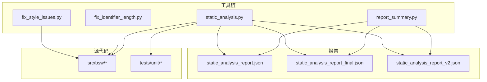
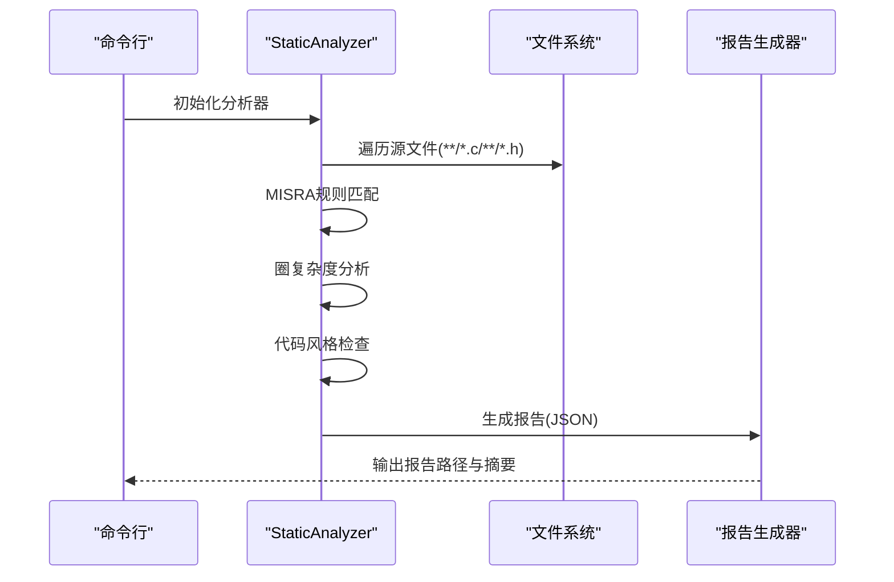
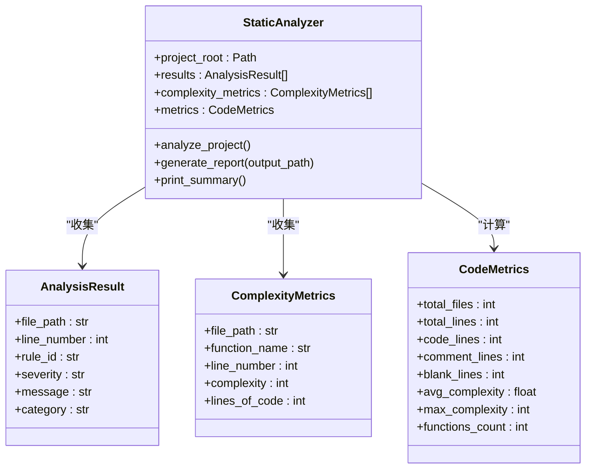
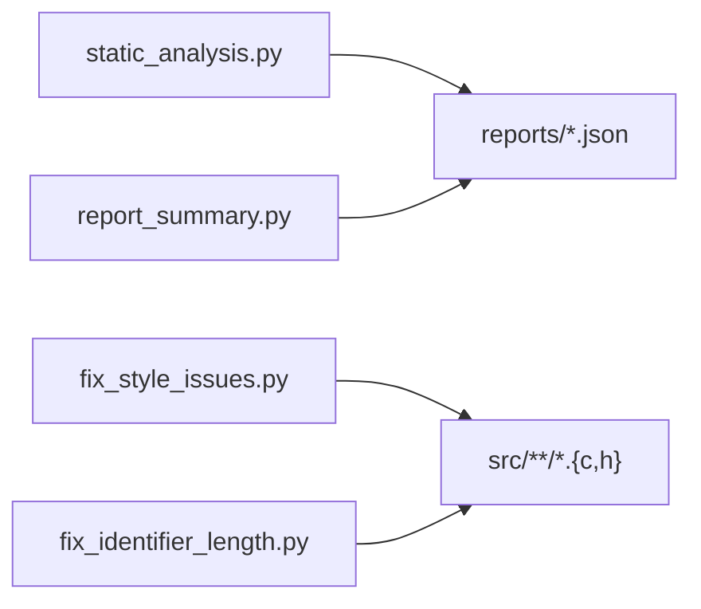

# 静态分析与调试工具

<cite>
**本文引用的文件**
- [static_analysis.py](file://tools/analysis/static_analysis.py)
- [report_summary.py](file://tools/analysis/report_summary.py)
- [fix_style_issues.py](file://tools/analysis/fix_style_issues.py)
- [fix_identifier_length.py](file://tools/analysis/fix_identifier_length.py)
- [static_analysis_report.json](file://reports/static_analysis_report.json)
- [static_analysis_report_final.json](file://reports/static_analysis_report_final.json)
- [static_analysis_report_v2.json](file://reports/static_analysis_report_v2.json)
- [test_mcu.c](file://tests/unit/test_mcu.c)
- [PduR.c](file://src/bsw/services/pdur/src/PduR.c)
- [bsw_config.json](file://config/bsw_config.json)
- [README.md](file://README.md)
- [ci.yml](file://.github/workflows/ci.yml)
</cite>

## 目录
1. [简介](#简介)
2. [项目结构](#项目结构)
3. [核心组件](#核心组件)
4. [架构总览](#架构总览)
5. [详细组件分析](#详细组件分析)
6. [依赖分析](#依赖分析)
7. [性能考虑](#性能考虑)
8. [故障排查指南](#故障排查指南)
9. [结论](#结论)
10. [附录](#附录)

## 简介
本指南面向YuleTech BSW平台的静态分析与调试工具，系统讲解静态分析工具的工作原理、分析规则与报告解读方法；深入解析static_analysis_report.json、static_analysis_report_final.json与static_analysis_report_v2.json三类报告文件的结构与含义；覆盖代码风格检查、安全漏洞检测与性能问题识别；提供调试工具的配置与使用技巧，并结合实际案例展示如何通过静态分析发现与修复问题，从而提升代码质量与可靠性。

## 项目结构
YuleTech BSW平台采用分层架构，工具链位于tools/analysis目录，报告输出于reports目录，核心源码位于src/bsw与tests/unit等目录。CI工作流中集成静态分析步骤，确保每次提交都进行质量门禁检查。

图示来源
- [static_analysis.py:1-379](file://tools/analysis/static_analysis.py#L1-L379)
- [report_summary.py:1-90](file://tools/analysis/report_summary.py#L1-L90)
- [fix_style_issues.py:1-67](file://tools/analysis/fix_style_issues.py#L1-L67)
- [fix_identifier_length.py:1-50](file://tools/analysis/fix_identifier_length.py#L1-L50)

章节来源
- [README.md:153-199](file://README.md#L153-L199)
- [ci.yml:38-59](file://.github/workflows/ci.yml#L38-L59)

## 核心组件
- 静态分析器：负责扫描源文件，执行MISRA C规则、圈复杂度与代码风格检查，汇总度量与问题列表。
- 报告摘要工具：对静态分析报告进行统计与可视化，输出Top问题与高复杂度函数。
- 自动修复工具：修复常见风格问题（如行尾空格、制表符）与标识符长度超限问题。
- CI集成：在流水线中自动运行静态分析，作为质量门禁。

章节来源
- [static_analysis.py:52-379](file://tools/analysis/static_analysis.py#L52-L379)
- [report_summary.py:1-90](file://tools/analysis/report_summary.py#L1-L90)
- [fix_style_issues.py:1-67](file://tools/analysis/fix_style_issues.py#L1-L67)
- [fix_identifier_length.py:1-50](file://tools/analysis/fix_identifier_length.py#L1-L50)
- [ci.yml:38-59](file://.github/workflows/ci.yml#L38-L59)

## 架构总览
静态分析工具链从命令行启动，遍历源文件，逐项执行规则匹配与度量计算，最终生成JSON格式报告与控制台摘要。

图示来源
- [static_analysis.py:233-379](file://tools/analysis/static_analysis.py#L233-L379)

## 详细组件分析

### 静态分析器（StaticAnalyzer）
- 功能职责
  - MISRA C规则检查：涵盖函数返回类型、空条件判断、标识符长度、返回值使用等。
  - 圈复杂度分析：统计函数复杂度并标记超阈值函数。
  - 代码风格检查：行长度、尾随空格、制表符等。
  - 度量计算：总文件数、总行数、代码/注释/空行、函数数、平均/最大复杂度。
- 关键数据结构
  - AnalysisResult：问题条目（文件路径、行号、规则ID、严重级别、消息、类别）。
  - ComplexityMetrics：函数复杂度指标（文件、函数名、行号、复杂度、代码行数）。
  - CodeMetrics：代码度量（文件、行数、函数数、复杂度统计）。
- 规则与正则表达式
  - MISRA-C-8.1：函数必须显式返回类型。
  - MISRA-C-5.1：标识符长度不超过31字符（排除特定前缀宏）。
  - MISRA-C-17.7：函数返回值应被使用。
  - 其他规则：空if语句、单一退出点、复杂度关键字计数等。
- 复杂度计算
  - 以函数定义为单位，统计if/while/for/case/&&/||/?等关键字出现次数，复杂度=1+关键字数。
  - 超过10时标记为警告。

图示来源
- [static_analysis.py:18-301](file://tools/analysis/static_analysis.py#L18-L301)

章节来源
- [static_analysis.py:52-301](file://tools/analysis/static_analysis.py#L52-L301)

### 报告摘要工具（report_summary.py）
- 功能职责
  - 加载静态分析报告，输出概览统计、代码度量、问题分类统计、Top规则违规、Top高复杂度函数、Top问题文件。
- 输出要点
  - 概览统计：总问题数、错误/警告/信息数量。
  - 代码度量：文件数、总行数、代码/注释/空行、注释率、函数数、平均/最大复杂度。
  - Top统计：按规则、按文件维度排序，便于定位热点问题。

章节来源
- [report_summary.py:1-90](file://tools/analysis/report_summary.py#L1-L90)

### 自动修复工具
- 行尾空格修复（fix_style_issues.py）
  - 逐行去除尾随空白，确保文件以换行符结尾。
  - 适用于src目录下所有.c与.h文件。
- 标识符长度修复（fix_identifier_length.py）
  - 检测#define定义的长标识符（>31字符），输出问题清单，提示需人工审查以避免命名冲突。

章节来源
- [fix_style_issues.py:1-67](file://tools/analysis/fix_style_issues.py#L1-L67)
- [fix_identifier_length.py:1-50](file://tools/analysis/fix_identifier_length.py#L1-L50)

### CI集成（.github/workflows/ci.yml）
- 步骤
  - 安装ARM GCC与Python依赖。
  - 构建BSW。
  - 运行静态分析，生成报告并上传。
  - 质量门禁：若错误数超过阈值则失败。

章节来源
- [ci.yml:38-59](file://.github/workflows/ci.yml#L38-L59)

## 依赖分析
静态分析工具链内部耦合度低，职责清晰：
- static_analysis.py独立完成扫描与度量，输出JSON报告。
- report_summary.py仅消费报告，不直接访问源文件。
- 两个修复脚本独立作用于源文件，互不依赖。

图示来源
- [static_analysis.py:302-322](file://tools/analysis/static_analysis.py#L302-L322)
- [report_summary.py:7-16](file://tools/analysis/report_summary.py#L7-L16)
- [fix_style_issues.py:43-64](file://tools/analysis/fix_style_issues.py#L43-L64)
- [fix_identifier_length.py:29-47](file://tools/analysis/fix_identifier_length.py#L29-L47)

## 性能考虑
- 文件扫描范围：默认遍历src与tests目录下的.c/.h文件，可通过参数调整根目录。
- 复杂度计算：对每个函数进行关键字计数，时间复杂度近似O(n)，其中n为函数内容字符数。
- 正则匹配：规则数量有限且模式相对简单，整体开销可控。
- 建议
  - 在大型项目中可限制扫描目录或启用增量分析。
  - 将报告生成与CI缓存结合，减少重复计算。

## 故障排查指南
- 报告缺失
  - 确认已执行静态分析命令并指定正确输出路径。
  - 检查CI日志中的“Upload Analysis Report”步骤是否成功。
- 规则误报
  - 检查正则表达式是否过于宽泛，必要时细化规则。
  - 对于MISRA-C-5.1，长标识符可能有特殊命名约定，需人工确认。
- 复杂度过高
  - 优先拆分大函数，降低分支密度；引入辅助函数与早返回。
- 风格问题
  - 使用fix_style_issues.py批量修复尾随空格与制表符。
  - 标识符长度问题需人工审查后修改。

章节来源
- [ci.yml:42-46](file://.github/workflows/ci.yml#L42-L46)
- [fix_style_issues.py:43-64](file://tools/analysis/fix_style_issues.py#L43-L64)
- [fix_identifier_length.py:29-47](file://tools/analysis/fix_identifier_length.py#L29-L47)

## 结论
YuleTech BSW平台的静态分析工具链提供了从规则检查、复杂度分析到报告生成与自动修复的完整能力。通过CI质量门禁与定期报告摘要，团队可以持续监控代码质量，及时发现并修复问题，从而提升系统的安全性、可维护性与稳定性。

## 附录

### 报告文件结构与含义
- static_analysis_report.json
  - summary：总问题数、错误/警告/信息数量。
  - metrics：文件数、总行数、代码/注释/空行、函数数、平均/最大复杂度。
  - issues：问题列表，包含file_path、line_number、rule_id、severity、message、category。
  - complexity：函数复杂度列表，包含file_path、function_name、line_number、complexity、lines_of_code。
- static_analysis_report_final.json
  - 结构与上类似，但问题总数更少，代表经过修复后的最终状态。
- static_analysis_report_v2.json
  - 结构与上类似，包含更多风格与复杂度问题，用于对比分析。

章节来源
- [static_analysis_report.json:1-800](file://reports/static_analysis_report.json#L1-L800)
- [static_analysis_report_final.json:1-800](file://reports/static_analysis_report_final.json#L1-L800)
- [static_analysis_report_v2.json:1-800](file://reports/static_analysis_report_v2.json#L1-L800)

### 实际案例：通过静态分析发现并修复问题
- 案例一：MISRA-C-8.1（函数返回类型）
  - 问题：多处函数未显式声明返回类型。
  - 定位：报告中file_path指向具体源文件与行号。
  - 修复：为函数添加明确返回类型。
  - 验证：再次运行静态分析，确认错误计数下降。
- 案例二：MISRA-C-17.7（返回值未使用）
  - 问题：某些函数返回值未被使用。
  - 定位：报告中category为misra，message包含规则说明。
  - 修复：根据业务逻辑使用返回值或重构函数。
- 案例三：圈复杂度超限（COMPLEXITY）
  - 问题：函数复杂度过高（>10）。
  - 定位：报告中complexity字段与message包含函数名与复杂度。
  - 修复：拆分函数、减少嵌套、引入早返回。
- 案例四：风格问题（STYLE-002/STYLE-003）
  - 问题：行尾空格、制表符。
  - 修复：使用fix_style_issues.py批量修复。
- 案例五：标识符长度超限（MISRA-C-5.1）
  - 问题：宏定义标识符超过31字符。
  - 修复：使用fix_identifier_length.py列出问题，人工缩短并避免冲突。

章节来源
- [test_mcu.c:19-209](file://tests/unit/test_mcu.c#L19-L209)
- [PduR.c:122-200](file://src/bsw/services/pdur/src/PduR.c#L122-L200)
- [static_analysis_report.json:18-800](file://reports/static_analysis_report.json#L18-L800)
- [static_analysis_report_final.json:18-800](file://reports/static_analysis_report_final.json#L18-L800)
- [static_analysis_report_v2.json:18-800](file://reports/static_analysis_report_v2.json#L18-L800)
- [fix_style_issues.py:43-64](file://tools/analysis/fix_style_issues.py#L43-L64)
- [fix_identifier_length.py:29-47](file://tools/analysis/fix_identifier_length.py#L29-L47)