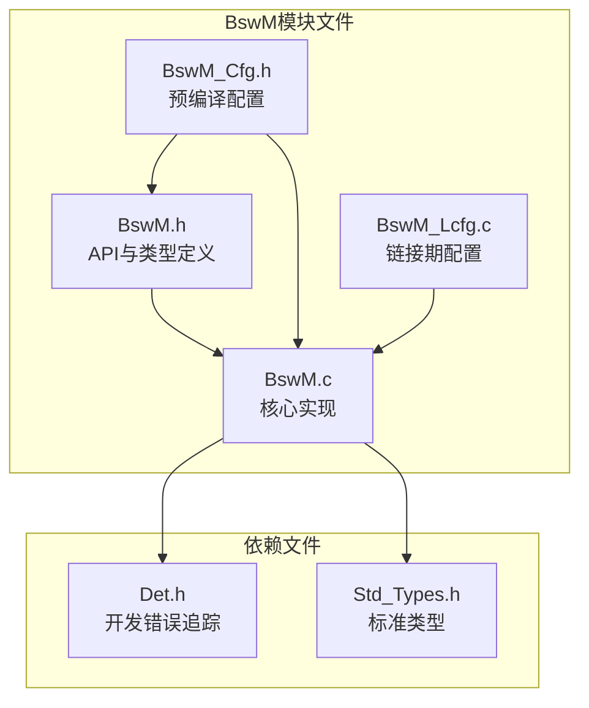
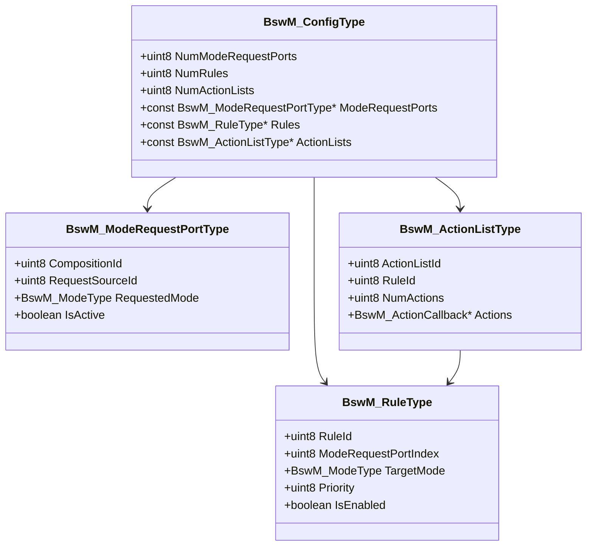
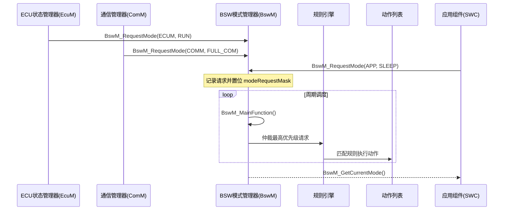
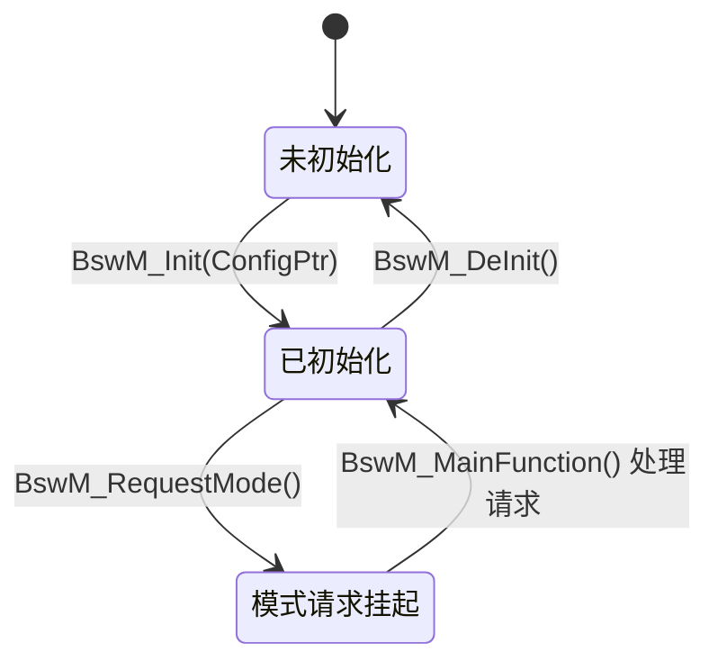
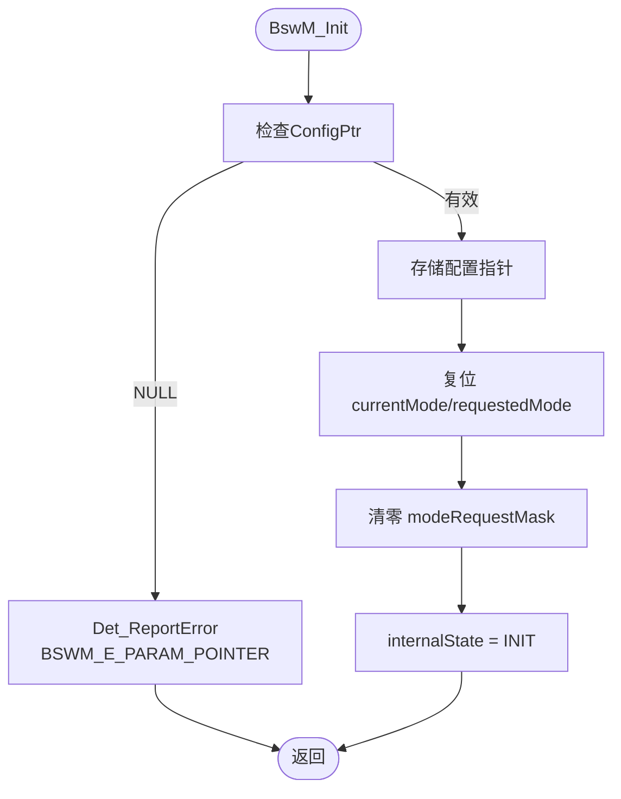
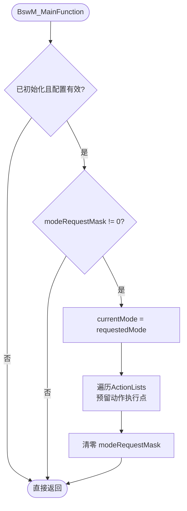
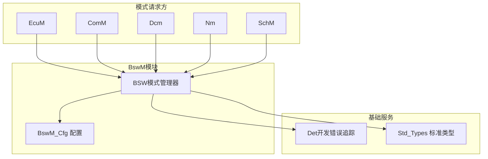

# BSW模式管理器（BswM）

<cite>
**本文档引用的文件**
- [BswM.h](file://src/bsw/services/bswm/include/BswM.h)
- [BswM_Cfg.h](file://src/bsw/services/bswm/include/BswM_Cfg.h)
- [BswM.c](file://src/bsw/services/bswm/src/BswM.c)
- [BswM_Lcfg.c](file://src/bsw/services/bswm/src/BswM_Lcfg.c)
- [Det.h](file://src/bsw/services/det/include/Det.h)
- [Std_Types.h](file://src/bsw/os/include/Std_Types.h)
</cite>

## 目录
1. [简介](#简介)
2. [项目结构](#项目结构)
3. [核心组件](#核心组件)
4. [架构概览](#架构概览)
5. [详细组件分析](#详细组件分析)
6. [依赖关系分析](#依赖关系分析)
7. [性能考虑](#性能考虑)
8. [故障排除指南](#故障排除指南)
9. [结论](#结论)
10. [附录](#附录)

## 简介

BSW模式管理器（BswM）是遵循AUTOSAR经典平台4.4标准的BSW模式管理模块，位于服务层。该模块负责集中管理ECU内各BSW模块和应用组件的模式请求，通过"模式请求端口→规则→动作列表"的三级模型实现模式仲裁与动作调度。

在AUTOSAR分层架构中，BswM处于服务层的上层，是EcuM（ECU状态管理器）、ComM（通信管理器）、Dcm（诊断通信管理器）、Nm（网络管理）等模块模式请求的汇聚点。应用软件组件（SWC）也可以通过RTE的BswM服务接口发起模式请求，例如请求进入RUN模式或SLEEP模式。

BswM模块在yuleASR工程中的实现遵循AUTOSAR_SWS_BSWModeManager规范，模块ID为0x12U，厂商ID为0x0055U（YuleTech）。

## 项目结构

BswM模块在项目中的文件组织如下：

**图表来源**
- [BswM.h:1-84](file://src/bsw/services/bswm/include/BswM.h#L1-L84)
- [BswM.c:1-121](file://src/bsw/services/bswm/src/BswM.c#L1-L121)

### 文件清单

| 文件 | 路径 | 职责 |
|------|------|------|
| BswM.h | include/BswM.h | 公开API、数据类型、模式值定义 |
| BswM_Cfg.h | include/BswM_Cfg.h | 预编译配置（由yuleASR Configurator生成） |
| BswM.c | src/BswM.c | 状态管理、模式请求处理、主函数 |
| BswM_Lcfg.c | src/BswM_Lcfg.c | 链接期配置数据（模式请求端口/规则/动作列表） |

**章节来源**
- [BswM.h:1-84](file://src/bsw/services/bswm/include/BswM.h#L1-L84)

## 核心组件

### 模式请求端口（BswM_ModeRequestPortType）

模式请求端口是模式请求方（如EcuM、ComM）与BswM之间的接口抽象：

**图表来源**
- [BswM.h:30-56](file://src/bsw/services/bswm/include/BswM.h#L30-L56)

### 模式值定义

BswM定义了统一抽象的模式值，供各模式请求源使用：

| 宏 | 值 | 含义 |
|----|----|----|
| BSWM_MODE_VALUE_OFF | 0 | 关闭 |
| BSWM_MODE_VALUE_START | 1 | 启动 |
| BSWM_MODE_VALUE_RUN | 2 | 运行 |
| BSWM_MODE_VALUE_POST_RUN | 3 | 后运行 |
| BSWM_MODE_VALUE_SLEEP | 4 | 睡眠 |
| BSWM_MODE_VALUE_SHUTDOWN | 5 | 关机 |
| BSWM_MODE_VALUE_WAKEUP | 6 | 唤醒 |
| BSWM_MODE_VALUE_STARTUP | 7 | 启动完成 |

**章节来源**
- [BswM.h:39-47](file://src/bsw/services/bswm/include/BswM.h#L39-L47)

### 请求源标识

模块通过宏标识不同的模式请求源：

- BSWM_ECUM_REQUEST（0x01U）：EcuM状态请求
- BSWM_COMM_REQUEST（0x02U）：ComM通信模式请求
- BSWM_DCM_REQUEST（0x03U）：Dcm诊断会话请求
- BSWM_NM_REQUEST（0x04U）：Nm网络管理请求
- BSWM_SCHM_REQUEST（0x05U）：SchM调度请求

**章节来源**
- [BswM.h:29-33](file://src/bsw/services/bswm/include/BswM.h#L29-L33)

## 架构概览

BswM模块在ECU模式管理体系中的位置与交互如下：

**图表来源**
- [BswM.c:37-40](file://src/bsw/services/bswm/src/BswM.c#L37-L40)
- [BswM.c:85-110](file://src/bsw/services/bswm/src/BswM.c#L85-L110)

### 内部状态机

**章节来源**
- [BswM.c:42-50](file://src/bsw/services/bswm/src/BswM.c#L42-L50)

## 详细组件分析

### 初始化过程（BswM_Init）

BswM_Init是模块的初始化入口，负责建立运行环境：

初始化关键步骤：
1. 在DEV_ERROR_DETECT开启时验证配置指针
2. 保存配置指针到内部状态
3. 复位当前模式与请求模式为BSWM_MODE_VALUE_OFF
4. 清零模式请求位掩码
5. 设置内部状态为INIT

**章节来源**
- [BswM.c:52-67](file://src/bsw/services/bswm/src/BswM.c#L52-L67)

### 模式请求处理（BswM_RequestMode）

模式请求是BswM的核心输入机制：

1. **参数校验**：检查模块是否已初始化（未初始化时报BSWM_E_UNINIT）
2. **模式记录**：将请求模式存入requestedMode
3. **位掩码更新**：`modeRequestMask |= (1U << Mode)`，标记有待处理请求
4. **返回E_OK**

请求采用"先记录、后仲裁"的异步模式——实际模式切换发生在下一个BswM_MainFunction周期。

**章节来源**
- [BswM.c:69-83](file://src/bsw/services/bswm/src/BswM.c#L69-L83)

### 主函数处理（BswM_MainFunction）

主函数在周期性调度中执行模式仲裁与动作执行：

**实现要点**：
- 当前实现采用简化仲裁：取最近一次请求模式作为当前模式
- 动作列表遍历为预留机制（`(void)BswM_State.configPtr->ActionLists[i]`），完整规则引擎动作执行留给后续版本
- 模式请求掩码在一次主函数周期内被消费

**章节来源**
- [BswM.c:85-110](file://src/bsw/services/bswm/src/BswM.c#L85-L110)

### 版本信息（BswM_GetVersionInfo）

版本信息API向调用方报告模块版本：

- vendorID = BSWM_VENDOR_ID（0x0055U）
- moduleID = BSWM_MODULE_ID（0x12U）
- sw_major/minor/patch = 1.0.0

**章节来源**
- [BswM.c:112-121](file://src/bsw/services/bswm/src/BswM.c#L112-L121)

## 依赖关系分析

**图表来源**
- [BswM.h:17-20](file://src/bsw/services/bswm/include/BswM.h#L17-L20)

### 依赖特性

1. **对上游提供服务**：EcuM/ComM/Dcm/Nm/SchM均可调用BswM_RequestMode发起模式请求
2. **配置驱动**：模式请求端口、规则、动作列表均由链接期配置（BswM_Lcfg.c）提供
3. **错误检测集成**：通过Det_ReportError上报开发错误
4. **被依赖**：应用层通过BswM_GetCurrentMode查询当前ECU模式状态

**章节来源**
- [BswM.h:29-33](file://src/bsw/services/bswm/include/BswM.h#L29-L33)

## 性能考虑

### 资源占用

- **静态内存**：BswM_InternalType全局状态结构（约20字节），无动态分配
- **配置表**：最大支持32个模式请求端口、64条规则、128个动作、32个动作列表（BswM_Cfg.h）
- **代码体积**：约1.5KB，属于轻量级服务模块

### 实时性

- **O(1)请求处理**：BswM_RequestMode仅做位运算，无循环
- **主函数复杂度**：O(ActionLists数量)，当前实现仅遍历动作列表数组
- **调度周期**：建议10ms周期调用BswM_MainFunction，与OS任务对齐

### 优化建议

1. 模式请求使用位掩码而非数组，节省存储并加速仲裁
2. 主函数内避免阻塞操作，动作执行应尽量轻量
3. 若动作列表数量大，可考虑按RuleId索引直接寻址，避免线性遍历

**章节来源**
- [BswM_Cfg.h:19-31](file://src/bsw/services/bswm/include/BswM_Cfg.h#L19-L31)

## 故障排除指南

### 错误代码

| 错误代码 | 触发场景 | 可能原因 | 解决方案 |
|----------|----------|----------|----------|
| BSWM_E_PARAM_POINTER (0x10U) | Init/GetVersionInfo | 传入NULL指针 | 检查调用方传参 |
| BSWM_E_UNINIT (0x20U) | RequestMode | 未调用BswM_Init | 确保先初始化 |
| BSWM_E_PARAM_MODE (0x30U) | 模式参数错误 | 模式值超出范围 | 校验模式值合法性 |
| BSWM_E_MODE_REQUEST_REJECT (0x40U) | 请求被拒绝 | 规则仲裁不通过 | 检查规则配置 |

### 调试建议

1. 开启BSWM_DEV_ERROR_DETECT（STD_ON），错误将上报Det
2. 检查BswM_Lcfg.c中规则/动作列表配置是否正确链接
3. 使用BswM_GetCurrentMode/BswM_GetRequestedMode对比请求与当前模式差异
4. 若模式不切换，确认BswM_MainFunction是否被周期调用

**章节来源**
- [BswM.c:17-24](file://src/bsw/services/bswm/src/BswM.c#L17-L24)

## 结论

BSW模式管理器（BswM）是ECU模式管理的枢纽模块，其设计特点：

1. **统一抽象**：将EcuM/ComM/Dcm/Nm等异构模式请求统一为BswM_ModeType
2. **异步仲裁**：请求记录与模式切换分离，主函数周期消费请求
3. **配置驱动**：模式请求端口/规则/动作列表全部可配置，支持yuleASR Configurator自动生成
4. **轻量实现**：位掩码请求跟踪，静态内存分配，适合资源受限的嵌入式环境

当前实现提供了模式请求与查询的基础框架，规则仲裁与动作列表执行机制已预留接口，可作为后续功能增强的扩展点。

## 附录

### API参考

- **初始化/反初始化**：BswM_Init(), BswM_DeInit()
- **模式请求**：BswM_RequestMode()
- **模式查询**：BswM_GetCurrentMode(), BswM_GetRequestedMode()
- **周期处理**：BswM_MainFunction()
- **版本信息**：BswM_GetVersionInfo()

### 配置最佳实践

1. 模式请求源ID应全局唯一，避免仲裁冲突
2. 动作列表回调应保持短小，避免阻塞主函数
3. 主函数调度周期与OS任务周期一致（建议10ms）
4. 使用BswM_Cfg.h中的上限宏规划配置规模，避免配置超限
