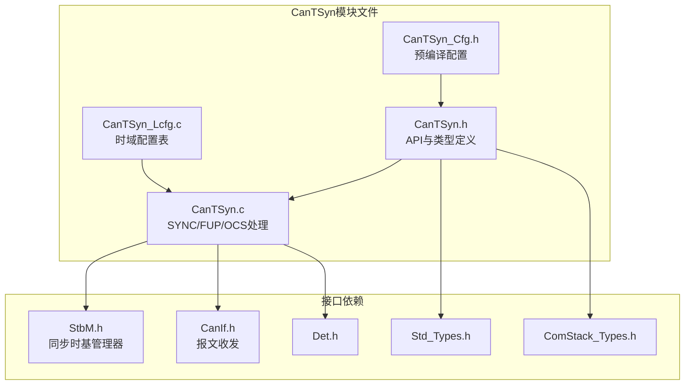
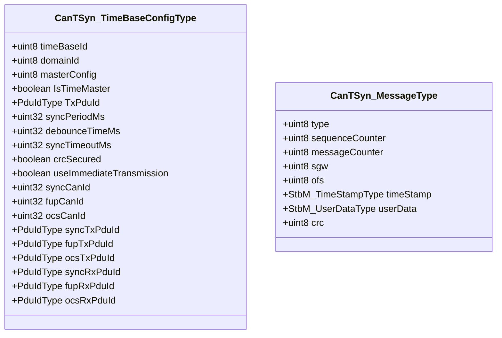
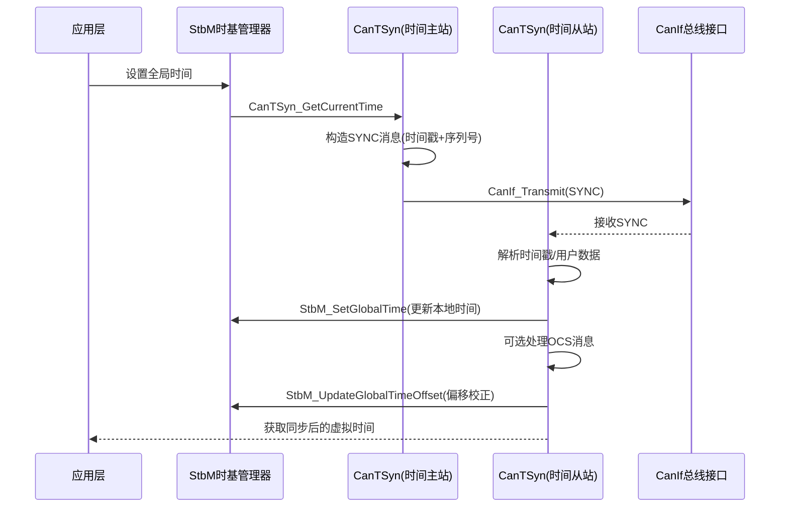
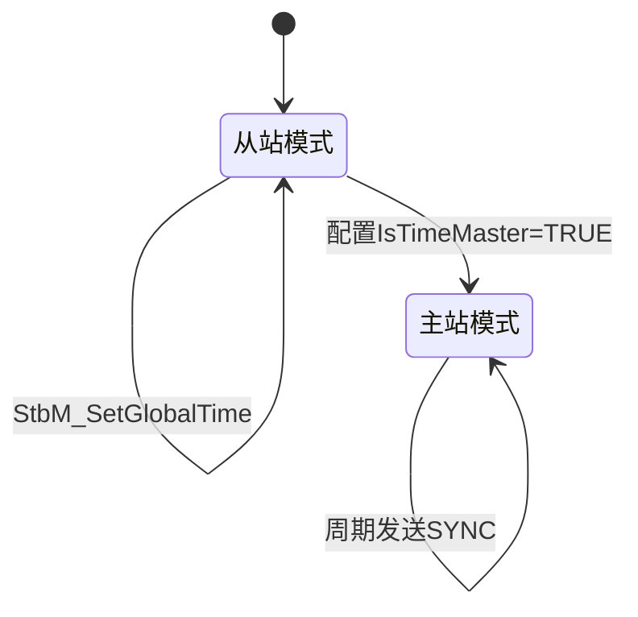
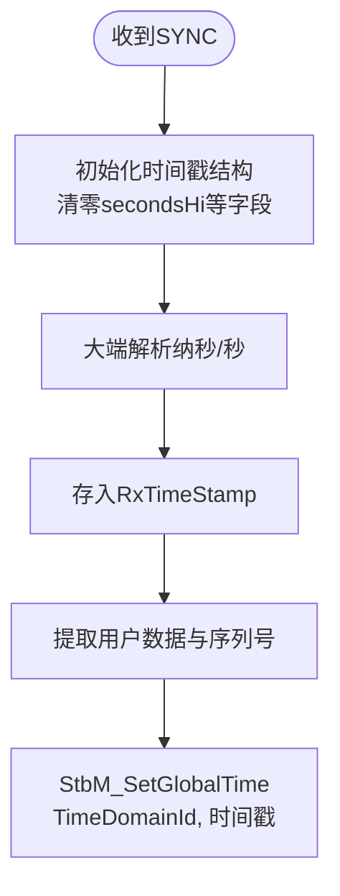

# CAN时间同步（CanTSyn）

<cite>
**本文档引用的文件**
- [CanTSyn.h](file://src/bsw/services/cantsyn/include/CanTSyn.h)
- [CanTSyn_Cfg.h](file://src/bsw/services/cantsyn/include/CanTSyn_Cfg.h)
- [CanTSyn.c](file://src/bsw/services/cantsyn/src/CanTSyn.c)
- [CanTSyn_Lcfg.c](file://src/bsw/services/cantsyn/src/CanTSyn_Lcfg.c)
- [StbM.h](file://src/bsw/services/stbm/include/StbM.h)
- [CanIf.h](file://src/bsw/ecual/canif/include/CanIf.h)
- [Det.h](file://src/bsw/services/det/include/Det.h)
- [Std_Types.h](file://src/bsw/os/include/Std_Types.h)
</cite>

## 目录
1. [简介](#简介)
2. [项目结构](#项目结构)
3. [核心组件](#核心组件)
4. [架构概览](#架构概览)
5. [详细组件分析](#详细组件分析)
6. [依赖关系分析](#依赖关系分析)
7. [性能考虑](#性能考虑)
8. [故障排除指南](#故障排除指南)
9. [结论](#结论)
10. [附录](#附录)

## 简介

CAN时间同步（CanTSyn）是遵循AUTOSAR R22-11规范的CAN总线时间同步模块，位于服务层，模块ID为0xA4U。该模块为分布式汽车系统提供基于CAN总线的全局时间同步服务，支持时间主站（Time Master）和时间从站（Time Slave）两种角色。

CanTSyn基于SYNC/FUP消息机制实现时间分发：时间主站周期性发送SYNC消息广播全局时间，可选发送FUP消息携带更精确的时间戳；时间从站接收SYNC/FUP消息，通过StbM（同步时基管理器）调整本地虚拟时间。同时支持OCS（Offset Correction Scale）消息承载用户数据，实现微秒级同步精度。

模块遵循AUTOSAR_SWS_CANTimeSynchronization规范，软件版本4.7.0，适配NXP i.MX8M Mini平台。

## 项目结构

CanTSyn模块在项目中的文件组织如下：



**图表来源**
- [CanTSyn.h:23-28](file://src/bsw/services/cantsyn/include/CanTSyn.h#L23-L28)
- [CanTSyn.c:52-58](file://src/bsw/services/cantsyn/src/CanTSyn.c#L52-L58)

### 文件清单

| 文件 | 路径 | 职责 |
|------|------|------|
| CanTSyn.h | include/CanTSyn.h | API、传输模式、消息类型、配置类型 |
| CanTSyn_Cfg.h | include/CanTSyn_Cfg.h | 预编译配置 |
| CanTSyn.c | src/CanTSyn.c | 消息构造/解析、主函数、回调 |
| CanTSyn_Lcfg.c | src/CanTSyn_Lcfg.c | 时间域配置数组CanTSyn_TimeDomainConfig |

**章节来源**
- [CanTSyn.h:1-408](file://src/bsw/services/cantsyn/include/CanTSyn.h#L1-L408)

## 核心组件

### 时间基配置（CanTSyn_TimeBaseConfigType）

每个时间基的完整配置：



**图表来源**
- [CanTSyn.h:142-180](file://src/bsw/services/cantsyn/include/CanTSyn.h#L142-L180)

### 传输模式

| 模式 | 宏 | 说明 |
|------|----|------|
| 立即模式 | CANTSYN_TX_MODE_IMMEDIATE (0x00U) | 时间随SYNC消息发送 |
| 延迟模式 | CANTSYN_TX_MODE_DELAYED (0x01U) | 时间随FUP消息发送 |
| 关闭 | CANTSYN_TX_MODE_OFF (0x02U) | 停止时间发送 |

### 消息类型

| 类型 | 宏 | 说明 |
|------|----|------|
| SYNC | CANTSYN_MSG_TYPE_SYNC (0x00U) | 同步消息 |
| FUP | CANTSYN_MSG_TYPE_FUP (0x01U) | 跟随消息 |
| OCS | CANTSYN_MSG_TYPE_OCS (0x02U) | 可选内容（用户数据） |
| SYNC_CRC | 0x04U | 带CRC的SYNC |
| FUP_CRC | 0x05U | 带CRC的FUP |
| OCS_CRC | 0x06U | 带CRC的OCS |

**章节来源**
- [CanTSyn.h:82-106](file://src/bsw/services/cantsyn/include/CanTSyn.h#L82-L106)

## 架构概览

CanTSyn时间同步体系架构：



**图表来源**
- [CanTSyn.c:230-300](file://src/bsw/services/cantsyn/src/CanTSyn.c#L230-L300)
- [CanTSyn.c:384-440](file://src/bsw/services/cantsyn/src/CanTSyn.c#L384-L440)

### 主从角色切换



**章节来源**
- [CanTSyn_Cfg.h:15-40](file://src/bsw/services/cantsyn/include/CanTSyn_Cfg.h#L15-L40)

## 详细组件分析

### SYNC消息构造（CanTSyn_PrepareSyncMessage）

SYNC消息（16字节）布局：

```mermaid
flowchart LR
subgraph "SYNC消息格式"
B0[Byte0<br/>类型0x10+时域ID]
B1_4[Byte1-4<br/>纳秒(大端)]
B5_8[Byte5-8<br/>秒(大端)]
B9_11[Byte9-11<br/>用户数据3字节+序列号]
B12_15[Byte12-15<br/>部分秒保留]
end
```

构造步骤：
1. Byte0：`CANTSYN_SYNC_MSG_TYPE | (TimeDomainId << 4U)`
2. 时间戳纳秒/秒按大端序写入
3. 用户数据3字节写入（高4位用户数据 + 低4位序列号）
4. 设置SduLength = CANTSYN_SYNC_MSG_LENGTH (16)

**章节来源**
- [CanTSyn.c:181-223](file://src/bsw/services/cantsyn/src/CanTSyn.c#L181-L223)

### OCS消息构造（CanTSyn_PrepareOfsMessage）

OCS消息（12字节）携带偏移校正信息：
1. Byte0：`CANTSYN_OFS_MSG_TYPE | (TimeDomainId << 4U)`
2. 纳秒/秒大端序时间戳
3. Byte9：timeBaseStatus
4. Byte10-11：用户数据+序列号

**章节来源**
- [CanTSyn.c:225-256](file://src/bsw/services/cantsyn/src/CanTSyn.c#L225-L256)

### 接收处理（CanTSyn_RxIndication）

接收流程：
1. 校验初始化状态与PDU ID范围
2. 从Byte0解析时域ID与消息类型
3. 按类型分发：SYNC→CanTSyn_ProcessSyncMessage，OCS→CanTSyn_ProcessOfsMessage
4. RxCounter++

### SYNC接收处理（CanTSyn_ProcessSyncMessage）

从站侧时间更新流程：



**要点**：接收时间戳的secondsHi/timeBaseStatus字段显式清零，避免栈垃圾数据传播到StbM。

**章节来源**
- [CanTSyn.c:258-291](file://src/bsw/services/cantsyn/src/CanTSyn.c#L258-L291)

### OCS接收处理（CanTSyn_ProcessOfsMessage）

从站侧偏移校正：解析纳秒/秒/timeBaseStatus后调用StbM_UpdateGlobalTimeOffset，实现时间偏移修正。

**章节来源**
- [CanTSyn.c:293-325](file://src/bsw/services/cantsyn/src/CanTSyn.c#L293-L325)

### 主函数（CanTSyn_MainFunction）

周期任务（CANTSYN_TIME_MASTER_SUPPORT=STD_ON时）：
1. 遍历所有时间域
2. 对配置为时间主站的域：从StbM获取当前时间
3. 构造SYNC消息，通过CanIf_Transmit发送
4. 发送成功后TxState=BUSY，序列号自增（0-15循环）

**章节来源**
- [CanTSyn.c:384-440](file://src/bsw/services/cantsyn/src/CanTSyn.c#L384-L440)

### 发送确认（CanTSyn_TxConfirmation）

发送完成后TxState复位为IDLE，允许下一帧发送；成功时TxCounter++。

**章节来源**
- [CanTSyn.c:140-162](file://src/bsw/services/cantsyn/src/CanTSyn.c#L140-L162)

## 依赖关系分析

```mermaid
graph TB
subgraph "上层"
App[应用层]
StbM[StbM同步时基管理器]
end
subgraph "CanTSyn"
CanTSyn[CAN时间同步]
Cfg[CanTSyn_Cfg]
Lcfg[CanTSyn_Lcfg 时域配置]
end
subgraph "下层"
CanIf[CAN接口层]
Can[Can驱动]
end
subgraph "基础"
Det[Det]
Std[Std_Types]
Os[OS调度]
end
App --> StbM
StbM --> CanTSyn
CanTSyn --> Cfg
CanTSyn --> Lcfg
CanTSyn --> CanIf
CanIf --> Can
CanTSyn --> Det
CanTSyn --> Std
CanTSyn --> Os
```

**图表来源**
- [CanTSyn.h:23-28](file://src/bsw/services/cantsyn/include/CanTSyn.h#L23-L28)
- [CanTSyn.c:52-58](file://src/bsw/services/cantsyn/src/CanTSyn.c#L52-L58)

### 关键依赖特性

1. **StbM集成**：主站从StbM取时间，从站将时间写回StbM，是时间同步的核心通道
2. **CanIf传输**：SYNC/OCS消息通过CanIf_Transmit发送，PDU ID由时域配置提供
3. **Os依赖**：时间戳获取（Csm_Cfg_GetTimestamp同类机制）依赖OS时间服务
4. **时间域隔离**：每个时域独立配置，支持多时域并行同步

**章节来源**
- [CanTSyn.h:27](file://src/bsw/services/cantsyn/include/CanTSyn.h#L27)

## 性能考虑

### 资源占用

- **时域状态**：CanTSyn_TimeDomainInfoType约40字节/时域
- **发送缓冲**：16字节SYNC缓冲（栈上分配）
- **代码体积**：约6KB

### 同步精度

- **立即模式**：时间戳在SYNC发送时采样，误差=发送队列延迟
- **延迟模式**：时间戳由硬件TimeTxConfirmation提供（CanTSyn_TimeTxConfirmationSYNC/FUP/OCS），精度可达微秒级
- **单位换算**：CANTSYN_NS_TO_US/US_TO_NS宏支持纳秒/微秒转换

### 实时性

- **主函数复杂度**：O(时域数)，每域仅构造+发送一帧
- **发送互斥**：TxState（IDLE/BUSY）避免多域并发发送冲突
- **调度**：MainFunction需与syncPeriodMs对齐（周期任务）

**章节来源**
- [CanTSyn.c:84-100](file://src/bsw/services/cantsyn/src/CanTSyn.c#L84-L100)

## 故障排除指南

### 错误代码

| 错误代码 | 含义 | 可能原因 | 解决方案 |
|----------|------|----------|----------|
| CANTSYN_E_PARAM_POINTER (0x01U) | 指针无效 | NULL传参 | 检查参数 |
| CANTSYN_E_PARAM_CONFIG (0x02U) | 配置无效 | 配置不完整 | 检查配置表 |
| CANTSYN_E_UNINIT (0x03U) | 未初始化 | 未调用Init | 检查初始化顺序 |
| CANTSYN_E_ALREADY_INITIALIZED (0x04U) | 重复初始化 | 多次Init | 检查调用次数 |
| CANTSYN_E_SYNC_LOST (0x0AU) | 同步丢失 | 连续未收到SYNC | 检查总线与时域ID |
| CANTSYN_E_TIME_NOT_AVAILABLE (0x0BU) | 时间不可用 | StbM未同步 | 检查StbM状态 |
| CANTSYN_E_TRANSMISSION_FAILED (0x0CU) | 发送失败 | CanIf_Transmit错误 | 检查PDU ID与总线 |

### 调试建议

1. **从站时间不更新**：确认TimeDomainId与主站一致，检查SYNC帧接收
2. **同步漂移**：启用延迟传输模式并检查硬件时间戳回调
3. **序列号不连续**：检查总线丢帧，适当增大debounceTimeMs
4. **时间跳变**：检查secondsHi清零逻辑，确认StbM_SetGlobalTime调用
5. **多时域干扰**：确认各时域CAN ID不冲突

**章节来源**
- [CanTSyn.h:61-71](file://src/bsw/services/cantsyn/include/CanTSyn.h#L61-L71)

## 结论

CAN时间同步（CanTSyn）模块实现了基于CAN总线的分布式时间同步：

1. **协议完整**：SYNC/FUP/OCS三类消息 + CRC可选安全保护
2. **角色灵活**：时间主站/从站可按时域独立配置
3. **StbM深度集成**：全局时间设置、偏移校正与虚拟时间查询全链路打通
4. **精度可调**：立即/延迟两种传输模式，延迟模式支持硬件时间戳达微秒级

该模块为CAN网络上的ECU间时间同步提供了完整解决方案，是SOA（面向服务）架构下时间敏感应用的基础设施。

## 附录

### API参考

- **生命周期**：CanTSyn_Init(), CanTSyn_DeInit()
- **时间管理**：CanTSyn_SetGlobalTime(), CanTSyn_GetCurrentVirtualTime(), CanTSyn_SetRateCorrection()
- **传输控制**：CanTSyn_SetTransmissionMode(), CanTSyn_GetTransmissionMode()
- **状态查询**：CanTSyn_GetSyncReceived()
- **用户数据**：CanTSyn_SetUserData(), CanTSyn_GetUserData()
- **回调**：CanTSyn_RxIndication(), CanTSyn_TxConfirmation(), CanTSyn_TimeTxConfirmationSYNC/FUP/OCS()

### 同步精度配置建议

1. 高精度场景使用延迟传输模式（CANTSYN_TX_MODE_DELAYED）
2. syncPeriodMs建议100ms，与NM周期对齐减少总线冲突
3. syncTimeoutMs设置为3-5个同步周期，兼顾检测速度与误报
4. CRC安全（crcSecured）用于安全相关时间分发场景
