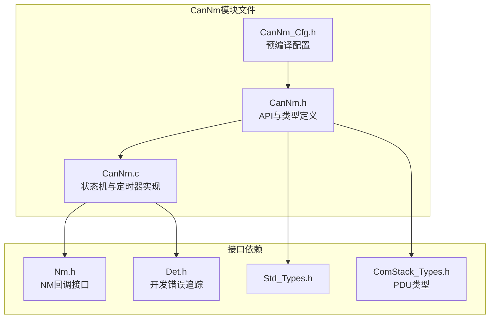
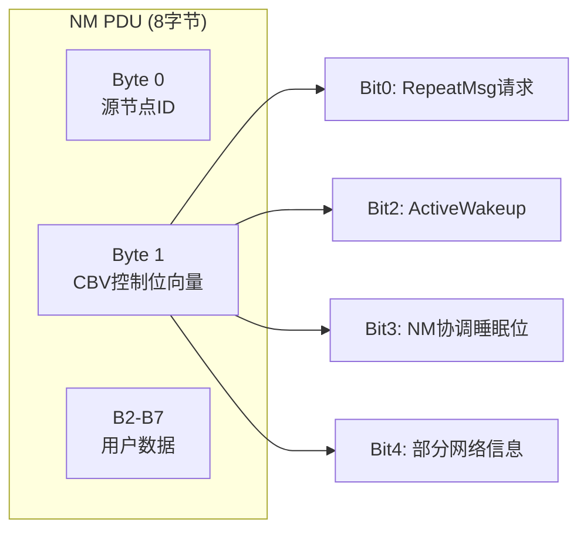
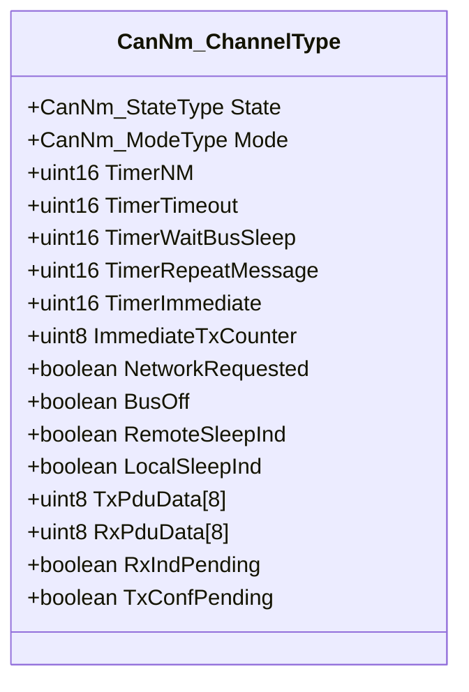
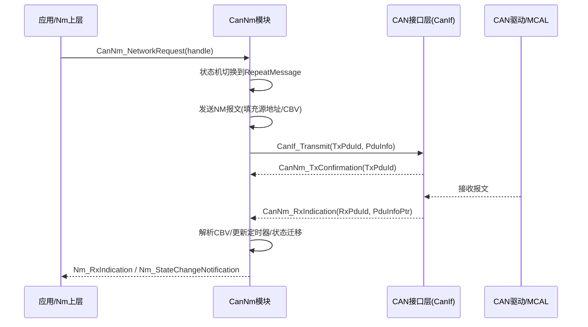
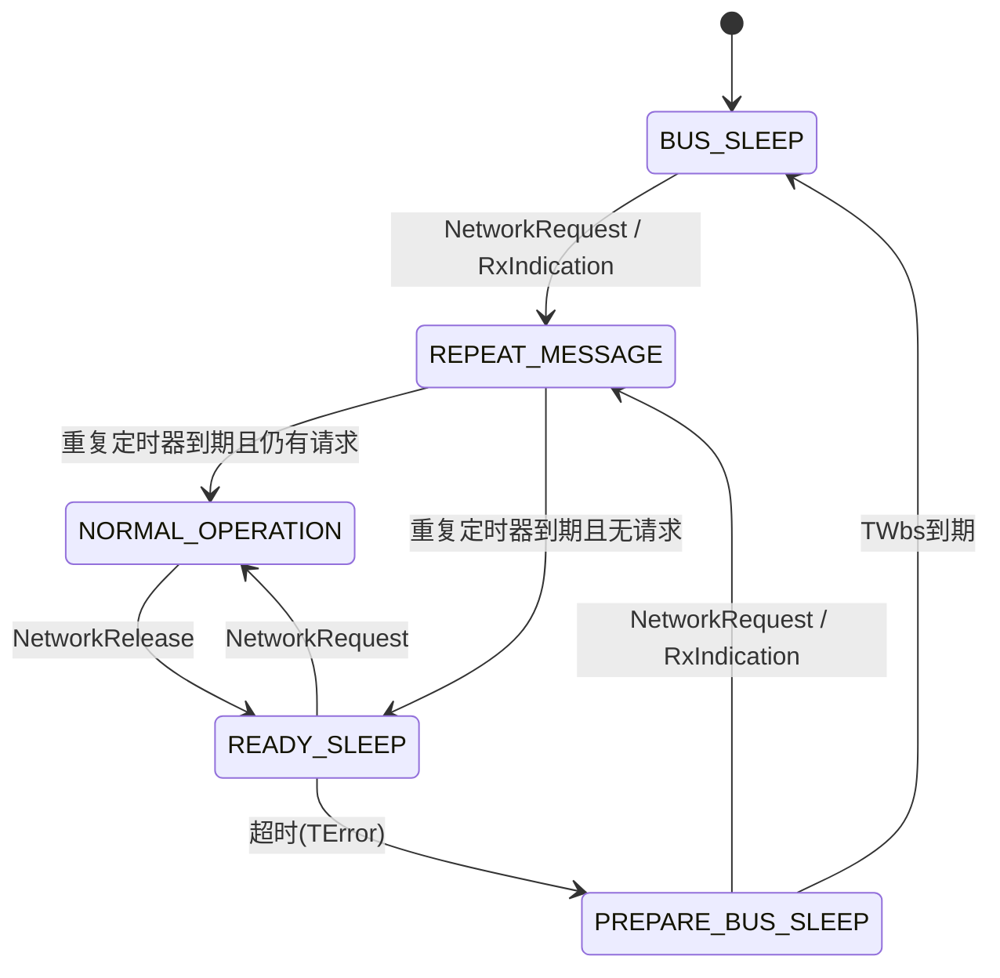
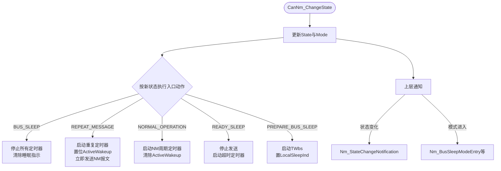

# CAN网络管理（CanNm）

<cite>
**本文档引用的文件**
- [CanNm.h](file://src/bsw/services/canm/include/CanNm.h)
- [CanNm_Cfg.h](file://src/bsw/services/canm/include/CanNm_Cfg.h)
- [CanNm.c](file://src/bsw/services/canm/src/CanNm.c)
- [Nm.h](file://src/bsw/services/nm/include/Nm.h)
- [Det.h](file://src/bsw/services/det/include/Det.h)
- [Std_Types.h](file://src/bsw/os/include/Std_Types.h)
- [ComStack_Types.h](file://src/bsw/ecual/include/ComStack_Types.h)
</cite>

## 目录
1. [简介](#简介)
2. [项目结构](#项目结构)
3. [核心组件](#核心组件)
4. [架构概览](#架构概览)
5. [详细组件分析](#详细组件分析)
6. [依赖关系分析](#依赖关系分析)
7. [性能考虑](#性能考虑)
8. [故障排除指南](#故障排除指南)
9. [结论](#结论)
10. [附录](#附录)

## 简介

CAN网络管理（CanNm）是遵循AUTOSAR经典平台4.4标准的CAN网络管理模块，位于服务层，实现OSEK NM协议。该模块负责管理CAN网络的通信状态（总线睡眠、预备总线睡眠、就绪睡眠、正常通信、重复报文），通过网络请求/释放机制协调ECU进入或退出网络模式，实现整车网络的睡眠与唤醒协调。

CanNm模块ID为0x1FU（AUTOSAR标准定义），厂商ID为0x01U（YuleTech），软件版本1.0.0。模块支持多通道配置（CANNM_NUMBER_OF_CHANNELS）、远程睡眠指示、总线同步、用户数据扩展等特性，并通过Nm.h提供的标准接口与上层Nm模块交互。

## 项目结构

CanNm模块在项目中的文件组织如下：



**图表来源**
- [CanNm.h:23-28](file://src/bsw/services/canm/include/CanNm.h#L23-L28)
- [CanNm.c:16-21](file://src/bsw/services/canm/src/CanNm.c#L16-L21)

### 文件清单

| 文件 | 路径 | 职责 |
|------|------|------|
| CanNm.h | include/CanNm.h | 公开API、NM PDU定义、状态/模式枚举 |
| CanNm_Cfg.h | include/CanNm_Cfg.h | 预编译配置（通道数、定时参数、特性开关） |
| CanNm.c | src/CanNm.c | 状态机、定时器处理、报文收发 |

**章节来源**
- [CanNm.h:1-344](file://src/bsw/services/canm/include/CanNm.h#L1-L344)

## 核心组件

### OSEK NM PDU格式

CanNm遵循OSEK NM规范，NM报文数据域格式如下：



**图表来源**
- [CanNm.h:132-145](file://src/bsw/services/canm/include/CanNm.h#L132-L145)

CBV（控制位向量）各标志位：
- CANNM_CBV_REPEAT_MSG（0x01U）：请求对方进入重复报文状态
- CANNM_CBV_ACTIVE_WAKEUP（0x04U）：主动唤醒指示
- CANNM_CBV_NM_COORD_SLEEP（0x08U）：NM协调者睡眠位
- CANNM_CBV_PARTIAL_NETWORK（0x10U）：部分网络信息

### 通道内部状态（CanNm_ChannelType）

每个通道维护独立的状态与定时器集合：



**图表来源**
- [CanNm.h:115-131](file://src/bsw/services/canm/include/CanNm.h#L115-L131)

### 状态与模式枚举

| 枚举 | 状态 | 说明 |
|------|------|------|
| CANNM_STATE_BUS_SLEEP | 总线睡眠 | 不发送NM报文，等待唤醒 |
| CANNM_STATE_PREPARE_BUS_SLEEP | 预备总线睡眠 | 等待总线睡眠定时器TWbs |
| CANNM_STATE_READY_SLEEP | 就绪睡眠 | 停止发送，等待超时确认 |
| CANNM_STATE_NORMAL_OPERATION | 正常通信 | 周期发送NM报文 |
| CANNM_STATE_REPEAT_MESSAGE | 重复报文 | 快速发送NM报文 |

模式（CanNm_ModeType）：UNINIT、BUS_SLEEP、PREPARE_BUS_SLEEP、SYNCHRONIZE、NETWORK。

**章节来源**
- [CanNm.h:92-113](file://src/bsw/services/canm/include/CanNm.h#L92-L113)

## 架构概览

CanNm在CAN网络管理栈中的位置与交互：



**图表来源**
- [CanNm.c:278-330](file://src/bsw/services/canm/src/CanNm.c#L278-L330)

### 状态机总览



**图表来源**
- [CanNm.c:36-45](file://src/bsw/services/canm/src/CanNm.c#L36-L45)
- [CanNm.c:336-398](file://src/bsw/services/canm/src/CanNm.c#L336-L398)

## 详细组件分析

### 状态迁移（CanNm_ChangeState）

状态迁移是状态机的核心枢纽，负责状态切换、入口动作执行与上层通知：



**章节来源**
- [CanNm.c:61-107](file://src/bsw/services/canm/src/CanNm.c#L61-L107)

### 报文发送（CanNm_TransmitMessage）

发送流程：
1. 填充源节点地址（`TxPduData[CANNM_PDU_BYTE_SRC_ADDR] = cfgPtr->NodeId`）
2. 构造PduInfo（SduDataPtr + SduLength = CANNM_PDU_LENGTH）
3. 置位TxConfPending标记
4. 调用Nm_NetworkStartIndication回调
5. 复位NM周期定时器

**章节来源**
- [CanNm.c:230-255](file://src/bsw/services/canm/src/CanNm.c#L230-L255)

### 报文接收（CanNm_ProcessPduData）

接收处理流程：
1. 拷贝PDU数据到RxPduData
2. 检查CBV_REPEAT_MSG位：若在NORMAL_OPERATION或READY_SLEEP状态收到，则进入REPEAT_MESSAGE
3. 通知上层Nm_RxIndication
4. 清除远程睡眠指示并回调Nm_RemoteSleepCancellation

**章节来源**
- [CanNm.c:257-276](file://src/bsw/services/canm/src/CanNm.c#L257-L276)

### 定时器处理（CanNm_ProcessTimers）

主函数周期（CANNM_MAIN_FUNCTION_PERIOD = 10ms）驱动的定时器集合：

| 定时器 | 配置参数 | 到期行为 |
|--------|----------|----------|
| TimerNM | MsgCycleTime (100ms) | 周期发送NM报文 |
| TimerImmediate | ImmediateNmCycleTime (20ms) | 立即发送（最多5次） |
| TimerTimeout | TimeoutTime (600ms) | READY_SLEEP→PREPARE_BUS_SLEEP |
| TimerRepeatMessage | RepeatMessageTime (1500ms) | 重复报文结束，按请求状态迁移 |
| TimerWaitBusSleep | WaitBusSleepTime (2000ms) | PREPARE_BUS_SLEEP→BUS_SLEEP |

**章节来源**
- [CanNm.c:278-333](file://src/bsw/services/canm/src/CanNm.c#L278-L333)
- [CanNm_Cfg.h:31-45](file://src/bsw/services/canm/include/CanNm_Cfg.h#L31-L45)

### 初始化（CanNm_Init）

初始化流程：
1. 参数校验（NULL指针时报CANNM_E_INVALID_POINTER）
2. 保存配置指针
3. 逐通道初始化：State=BUS_SLEEP、Mode=BUS_SLEEP、所有定时器清零
4. 清空Tx/Rx PDU缓冲

**章节来源**
- [CanNm.c:400-505](file://src/bsw/services/canm/src/CanNm.c#L400-L505)

## 依赖关系分析

```mermaid
graph TB
subgraph "上层"
Nm[Nm模块]
ComM[通信管理器]
end
subgraph "CanNm"
CanNm[CAN网络管理]
Cfg[CanNm_Cfg 配置]
end
subgraph "下层"
CanIf[CAN接口层CanIf]
Can[Can驱动]
end
subgraph "基础"
Det[Det]
Std[Std_Types]
CST[ComStack_Types]
end
Nm --> CanNm
ComM --> CanNm
CanNm --> Cfg
CanNm --> CanIf
CanIf --> Can
CanNm --> Det
CanNm --> Std
CanNm --> CST
```

**图表来源**
- [CanNm.h:23-28](file://src/bsw/services/canm/include/CanNm.h#L23-L28)

### 关键依赖特性

1. **Nm接口回调**：通过Nm_StateChangeNotification、Nm_RxIndication、Nm_NetworkStartIndication等向Nm模块报告事件
2. **CanIf传输**：发送通过CanIf_Transmit完成，PDU ID由配置定义（CANNM_TX_PDU_ID=0、CANNM_RX_PDU_ID=1）
3. **配置驱动**：定时参数、特性开关全部由CanNm_Cfg.h控制
4. **被依赖**：ComM通过Nm/ComM接口与CanNm交互，驱动网络请求

**章节来源**
- [CanNm_Cfg.h:21-26](file://src/bsw/services/canm/include/CanNm_Cfg.h#L21-L26)

## 性能考虑

### 资源占用

- **每通道RAM**：CanNm_ChannelType约64字节（含双PDU缓冲8+8字节）
- **静态配置**：单通道（CANNM_NUMBER_OF_CHANNELS=1），支持最多8个节点（CANNM_MAX_NODES）
- **代码体积**：约5KB，含完整状态机与定时器处理

### 实时性

- **主函数复杂度**：O(通道数×定时器数)，定时器递减运算为O(1)
- **调度周期**：CANNM_MAIN_FUNCTION_PERIOD=10ms
- **报文发送**：NM周期100ms，立即发送周期20ms×5次，保证快速建网

### 总线负载

- 支持总线负载降低（CANNM_BUS_LOAD_REDUCTION_ENABLED，默认STD_OFF）
- 重复报文阶段快速发送（20ms×5次）用于快速同步，正常阶段100ms周期
- 可通过ImmediateNmTransmissions参数调节建网速度与总线负载的平衡

**章节来源**
- [CanNm_Cfg.h:31-45](file://src/bsw/services/canm/include/CanNm_Cfg.h#L31-L45)

## 故障排除指南

### 错误代码

| 错误代码 | 含义 | 可能原因 | 解决方案 |
|----------|------|----------|----------|
| CANNM_E_UNINIT (0x01U) | 未初始化 | 未调用CanNm_Init | 检查初始化顺序 |
| CANNM_E_INVALID_CHANNEL (0x02U) | 通道无效 | 通道句柄越界 | 检查句柄范围 |
| CANNM_E_INVALID_POINTER (0x03U) | 指针无效 | 传入NULL | 检查调用参数 |
| CANNM_E_INIT_FAILED (0x04U) | 初始化失败 | 配置错误 | 检查配置完整性 |
| CANNM_E_NOT_OK (0x05U) | 操作失败 | 状态不允许 | 检查当前状态 |

### 调试建议

1. **网络无法唤醒**：检查NetworkRequest是否被调用、RxIndication是否到达、CBV_ACTIVE_WAKEUP位是否正确
2. **无法进入睡眠**：检查NetworkRelease是否调用、RemoteSleepInd是否仍为TRUE、TWbs是否到期
3. **报文发送失败**：检查CanIf_Transmit返回值与TxConfirmation回调
4. **状态异常**：确认MainFunction周期调用（10ms），定时器精度依赖调度周期
5. **总线关闭**：通过CanNm_ControllerBusOff回调跟踪BusOff事件

**章节来源**
- [CanNm.h:52-58](file://src/bsw/services/canm/include/CanNm.h#L52-L58)

## 结论

CAN网络管理（CanNm）模块完整实现了OSEK NM协议的6状态机与5模式管理，是整车网络睡眠/唤醒管理的核心：

1. **协议完整**：实现BUS_SLEEP、PREPARE_BUS_SLEEP、READY_SLEEP、NORMAL_OPERATION、REPEAT_MESSAGE全状态机
2. **定时精确**：5类定时器覆盖NM周期、超时、总线睡眠等全部时序需求
3. **可配置性强**：全部定时参数与特性开关由配置头文件控制，支持yuleASR Configurator生成
4. **标准接口**：通过Nm.h标准回调与上层交互，符合AUTOSAR分层

该模块为CAN网络的建网、维持、睡眠提供了完整的OSEK NM解决方案。

## 附录

### API参考

- **生命周期**：CanNm_Init(), CanNm_DeInit()
- **网络控制**：CanNm_NetworkRequest(), CanNm_NetworkRelease(), CanNm_PassiveStartUp()
- **通信控制**：CanNm_EnableCommunication(), CanNm_DisableCommunication()
- **数据访问**：CanNm_GetUserData(), CanNm_SetUserData(), CanNm_GetPduData()
- **状态查询**：CanNm_GetState(), CanNm_CheckRemoteSleepIndication()
- **回调**：CanNm_TxConfirmation(), CanNm_RxIndication(), CanNm_ControllerBusOff()

### 定时参数速查

| 参数 | 配置宏 | 默认值 |
|------|--------|--------|
| NM报文周期 | CANNM_MSG_CYCLE_TIME | 100ms |
| 重复报文时间 | CANNM_REPEAT_MESSAGE_TIME | 1500ms |
| 等待总线睡眠 | CANNM_WAIT_BUS_SLEEP_TIME | 2000ms |
| 超时时间 | CANNM_TIMEOUT_TIME | 600ms |
| 立即发送周期 | CANNM_IMMEDIATE_NM_CYCLE_TIME | 20ms |
| 立即发送次数 | CANNM_IMMEDIATE_NM_TRANSMISSIONS | 5次 |
