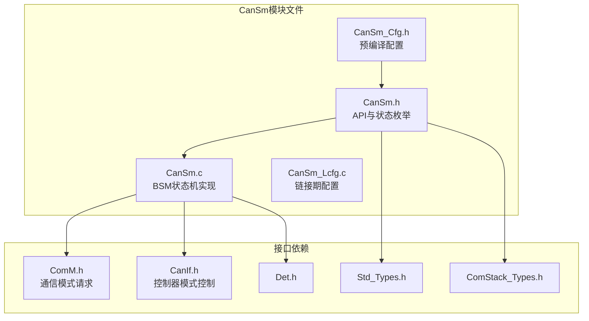
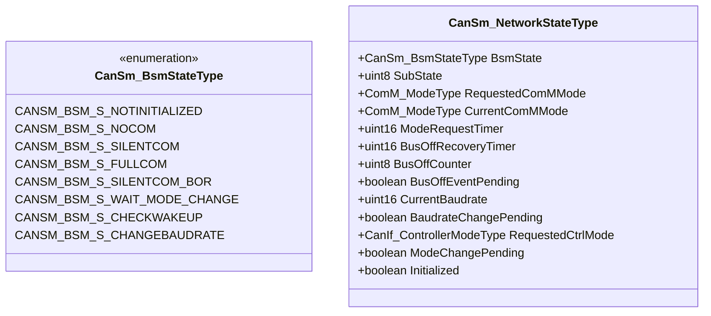
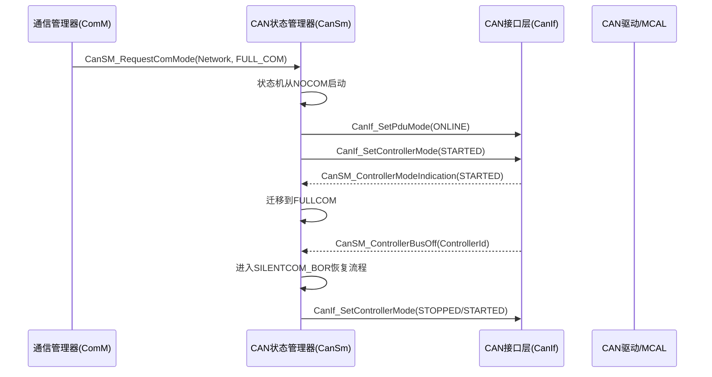
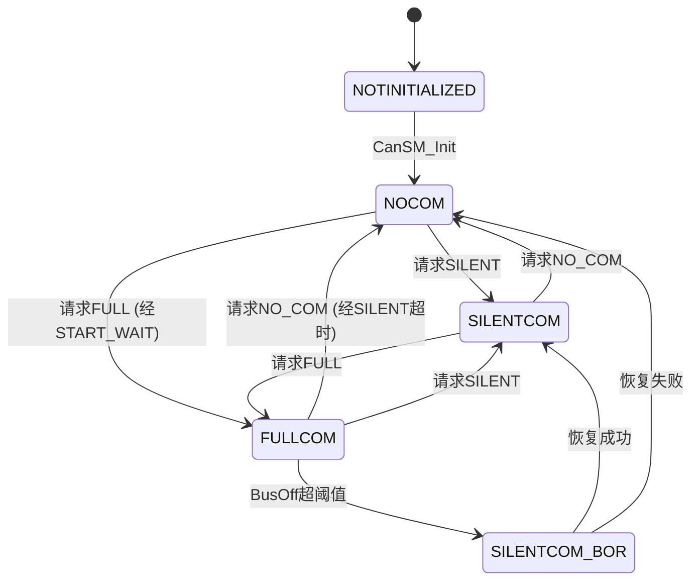
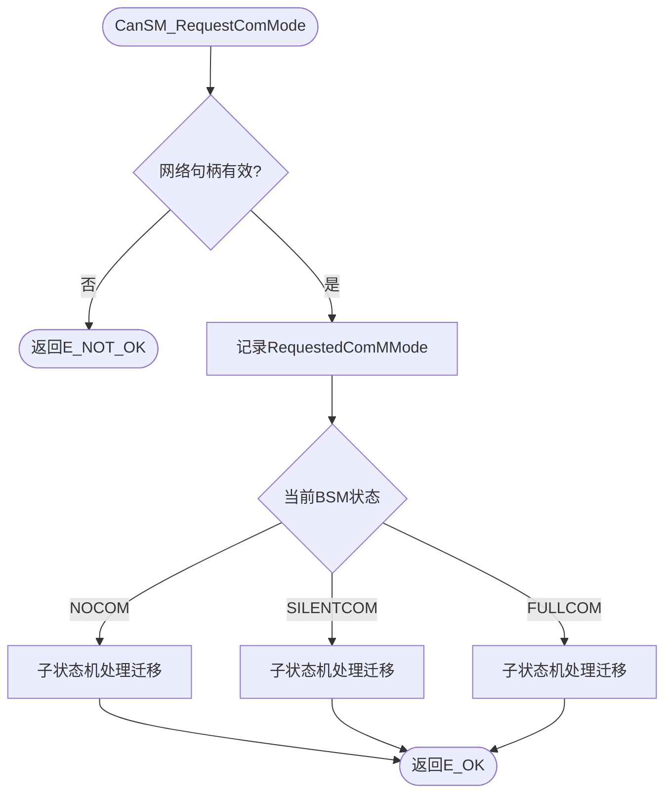
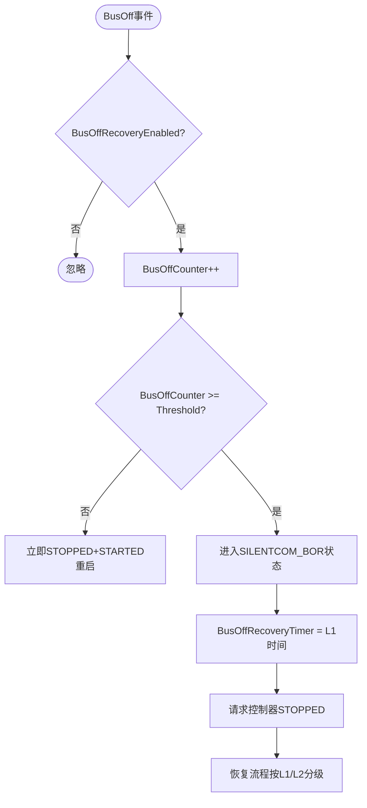

# CAN通信状态管理器（CanSm）

<cite>
**本文档引用的文件**
- [CanSm.h](file://src/bsw/services/cansm/include/CanSm.h)
- [CanSm_Cfg.h](file://src/bsw/services/cansm/include/CanSm_Cfg.h)
- [CanSm.c](file://src/bsw/services/cansm/src/CanSm.c)
- [CanSm_Lcfg.c](file://src/bsw/services/cansm/src/CanSm_Lcfg.c)
- [ComM.h](file://src/bsw/services/comm/include/ComM.h)
- [CanIf.h](file://src/bsw/ecual/canif/include/CanIf.h)
- [Det.h](file://src/bsw/services/det/include/Det.h)
- [Std_Types.h](file://src/bsw/os/include/Std_Types.h)
</cite>

## 目录
1. [简介](#简介)
2. [项目结构](#项目结构)
3. [核心组件](#核心组件)
4. [架构概览](#架构概览)
5. [详细组件分析](#详细组件分析)
6. [依赖关系分析](#依赖关系分析)
7. [性能考虑](#性能考虑)
8. [故障排除指南](#故障排除指南)
9. [结论](#结论)
10. [附录](#附录)

## 简介

CAN通信状态管理器（CanSm）是遵循AUTOSAR经典平台4.4标准的CAN状态管理模块，位于服务层。该模块在ComM与CanIf之间提供桥梁：接收ComM的通信模式请求（无通信/静默通信/全通信），通过内部BSM（总线状态机）驱动CanIf完成控制器模式的切换，并处理总线关闭（BusOff）检测与恢复。

CanSm模块ID为0x08U（CANSM_MODULE_ID），厂商ID为0x01U（YuleTech），软件版本1.0.0。模块支持多网络（CANNUM_NETWORKS=2，CAN0/CAN1）、波特率动态切换、总线关闭自动恢复、唤醒支持等特性。

## 项目结构

CanSm模块在项目中的文件组织如下：



**图表来源**
- [CanSm.h:17-21](file://src/bsw/services/cansm/include/CanSm.h#L17-L21)
- [CanSm.c:36-40](file://src/bsw/services/cansm/src/CanSm.c#L36-L40)

### 文件清单

| 文件 | 路径 | 职责 |
|------|------|------|
| CanSm.h | include/CanSm.h | API、BSM状态枚举、配置类型 |
| CanSm_Cfg.h | include/CanSm_Cfg.h | 预编译配置 |
| CanSm.c | src/CanSm.c | 状态机、模式切换、BusOff恢复 |
| CanSm_Lcfg.c | src/CanSm_Lcfg.c | 网络配置表（每网络波特率/定时参数） |

**章节来源**
- [CanSm.h:1-290](file://src/bsw/services/cansm/include/CanSm.h#L1-L290)

## 核心组件

### BSM状态机状态（CanSm_BsmStateType）

每个CAN控制器维护一个BSM状态机：



**图表来源**
- [CanSm.h:36-74](file://src/bsw/services/cansm/include/CanSm.h#L36-L74)
- [CanSm.c:48-72](file://src/bsw/services/cansm/src/CanSm.c#L48-L72)

### 网络配置（CanSm_NetworkConfigType）

每个网络（总线）的配置项：

| 配置项 | 类型 | 说明 |
|--------|------|------|
| NetworkHandle | uint8 | ComM通道句柄 |
| ControllerId | uint8 | CAN控制器ID |
| NumBaudrates | uint8 | 支持的波特率数量 |
| BaudrateConfigs | 指针 | 波特率配置表（125K/250K/500K/1000K） |
| MainFunctionPeriodMs | uint16 | 主函数周期 |
| BusOffRecoveryTimeMs | uint16 | BusOff恢复超时 |
| BusOffThreshold | uint8 | BusOff计数阈值 |
| WakeupSupport | boolean | 唤醒支持 |
| BusOffRecoveryEnabled | boolean | 自动恢复使能 |
| TransceiverSupport | boolean | 收发器管理 |
| TransceiverId | uint8 | 收发器ID |

**章节来源**
- [CanSm.h:110-130](file://src/bsw/services/cansm/include/CanSm.h#L110-L130)

## 架构概览

CanSm在通信栈中的位置：



**图表来源**
- [CanSm.c:145-193](file://src/bsw/services/cansm/src/CanSm.c#L145-L193)

### BSM状态迁移总览



**章节来源**
- [CanSm.c:81-97](file://src/bsw/services/cansm/src/CanSm.c#L81-L97)

## 详细组件分析

### 模式请求处理（CanSM_RequestComMode）

ComM调用此API请求网络通信模式：



**章节来源**
- [CanSm.c:300-360](file://src/bsw/services/cansm/src/CanSm.c#L300-L360)

### 控制器模式请求（CanSm_RequestControllerMode）

状态机通过CanIf控制底层控制器：

1. 调用CanIf_SetControllerMode(ControllerId, Mode)
2. 成功后记录RequestedCtrlMode、置位ModeChangePending
3. 启动模式切换超时定时器（CANSM_MODE_CHANGE_REQUEST_TIMEOUT_MS）

支持的控制器模式：CANIF_CS_UNINIT、CANIF_CS_STOPPED、CANIF_CS_STARTED、CANIF_CS_SLEEP。

**章节来源**
- [CanSm.c:152-170](file://src/bsw/services/cansm/src/CanSm.c#L152-L170)

### 模式确认处理（CanSm_HandleModeConfirmation）

CanIf回调CanSM_ControllerModeIndication触发：

| 确认模式 | 迁移逻辑 |
|----------|----------|
| CANIF_CS_STARTED | NOCOM状态下迁移到FULLCOM |
| CANIF_CS_STOPPED | FULLCOM状态下迁移到SILENTCOM |
| CANIF_CS_SLEEP | 非NOCOM状态迁移到NOCOM |
| CANIF_CS_UNINIT | 无动作 |

**章节来源**
- [CanSm.c:172-215](file://src/bsw/services/cansm/src/CanSm.c#L172-L215)

### 总线关闭恢复（CanSm_HandleBusOffRecovery）

BusOff处理采用分级恢复策略：



**章节来源**
- [CanSm.c:217-243](file://src/bsw/services/cansm/src/CanSm.c#L217-L243)

### 状态处理函数族

各BSM状态的处理逻辑：

- **CanSm_ProcessNoComState**：处理NOCOM子状态（NOP/START_WAIT/SLEEP_WAIT等），SILENT/FULL请求触发迁移
- **CanSm_ProcessSilentComState**：SILENTCOM下响应NO_COM/FULL请求
- **CanSm_ProcessFullComState**：FULLCOM下响应NO_COM/SILENT请求
- **CanSm_ProcessSilentComBorState**：BusOff恢复期间的子状态机

**章节来源**
- [CanSm.c:336-442](file://src/bsw/services/cansm/src/CanSm.c#L336-L442)

### 波特率管理（CanSM_SetBaudrate/GetBaudrate）

支持运行期波特率切换：
1. 查表匹配请求波特率（125K/250K/500K/1000K）
2. 设置CurrentBaudrate并标记BaudrateChangePending
3. 状态机在安全点执行切换

**章节来源**
- [CanSm.h:169-190](file://src/bsw/services/cansm/include/CanSm.h#L169-L190)

## 依赖关系分析

```mermaid
graph TB
subgraph "上层"
ComM[ComM通信管理器]
end
subgraph "CanSm"
CanSm[CAN状态管理器]
Cfg[CanSm_Cfg]
Lcfg[CanSm_Lcfg]
end
subgraph "下层"
CanIf[CAN接口层]
Can[CAN驱动]
end
subgraph "基础"
Det[Det]
Std[Std_Types]
end
ComM --> CanSm
CanSm --> Cfg
CanSm --> Lcfg
CanSm --> CanIf
CanIf --> Can
CanSm --> Det
CanSm --> Std
```

**图表来源**
- [CanSm.h:17-21](file://src/bsw/services/cansm/include/CanSm.h#L17-L21)

### 关键依赖特性

1. **ComM上游**：CanSM_RequestComMode/GetCurrentComMode是ComM的标准接口
2. **CanIf下游**：控制器模式控制（SetControllerMode）、PDU模式控制（SetPduMode）
3. **回调集成**：CanSM_ControllerBusOff、CanSM_ControllerModeIndication由CanIf调用
4. **配置驱动**：网络数、波特率表、恢复参数由配置提供

**章节来源**
- [CanSm.c:44-46](file://src/bsw/services/cansm/src/CanSm.c#L44-L46)

## 性能考虑

### 资源占用

- **每网络状态**：CanSm_NetworkStateType约24字节
- **配置表**：2网络×4波特率配置，静态只读存储
- **代码体积**：约5.5KB，主要开销在状态机处理函数族

### 实时性

- **主函数复杂度**：O(网络数)，每网络仅处理一个BSM状态
- **定时器**：模式切换超时（CANSM_MODE_CHANGE_REQUEST_TIMEOUT_MS）以主函数周期折算ticks
- **BusOff恢复**：L1/L2分级恢复，恢复期间控制器停止发送，避免总线持续干扰

### 优化建议

1. 波特率查表采用二分查找（当前线性遍历最多4项）
2. 状态机子状态处理可合并冗余分支
3. BusOff阈值与恢复时间需结合EMC测试结果标定

**章节来源**
- [CanSm_Cfg.h:15-40](file://src/bsw/services/cansm/include/CanSm_Cfg.h#L15-L40)

## 故障排除指南

### 错误代码

| 错误代码 | 含义 | 可能原因 | 解决方案 |
|----------|------|----------|----------|
| CANSM_E_PARAM_POINTER (0x01U) | 指针无效 | NULL传参 | 检查参数 |
| CANSM_E_PARAM_CONTROLLER (0x02U) | 控制器无效 | ID越界 | 校验控制器ID |
| CANSM_E_INVALID_NETWORK_MODE (0x03U) | 网络模式无效 | 非法模式值 | 检查ComM模式 |
| CANSM_E_MODE_REQUEST_TIMEOUT (0x05U) | 模式切换超时 | 控制器无响应 | 检查CanIf链路 |
| CANSM_E_NOT_INITIALIZED (0x07U) | 未初始化 | 初始化顺序错误 | 确保CanSM_Init先执行 |
| CANSM_E_BUSOFF_RECOVERY_ACTIVE (0x09U) | BusOff恢复中 | 恢复流程未完成 | 等待恢复结束 |

### 调试建议

1. **无法进入FULLCOM**：检查CanIf_SetControllerMode返回值、ControllerModeIndication是否到达
2. **BusOff反复发生**：检查总线终端电阻、波特率匹配、线束
3. **模式切换超时**：确认MainFunction周期调度，检查CANSM_MODE_CHANGE_REQUEST_TIMEOUT_MS配置
4. **静默模式异常**：确认CanIf_SetPduMode(TX_OFFLINE)是否正确执行

**章节来源**
- [CanSm.h:60-68](file://src/bsw/services/cansm/include/CanSm.h#L60-L68)

## 结论

CAN通信状态管理器（CanSm）是ComM与CanIf之间的关键桥梁，实现了：

1. **完整BSM状态机**：8个BSM状态 + 各状态的子状态细化，覆盖全部通信场景
2. **BusOff分级恢复**：阈值触发SILENTCOM_BOR，L1/L2分级恢复机制
3. **波特率动态切换**：支持运行期切换波特率，适应诊断/刷写场景
4. **标准接口**：与ComM、CanIf的接口完全符合AUTOSAR规范

该模块为CAN网络通信状态管理提供了可靠的实现基础。

## 附录

### API参考

- **生命周期**：CanSM_Init(), CanSM_DeInit()
- **模式管理**：CanSM_RequestComMode(), CanSM_GetCurrentComMode()
- **状态查询**：CanSM_GetCurrentInternalState()
- **波特率**：CanSM_SetBaudrate(), CanSM_GetBaudrate()
- **回调**：CanSM_ControllerBusOff(), CanSM_ControllerModeIndication()

### 配置最佳实践

1. BusOffThreshold建议2-3次，避免瞬时干扰误触发
2. BusOffRecoveryTimeMs需大于CANIF控制器重启时间
3. 波特率配置表顺序按从小到大排列便于查找
4. 多网络场景确认各网络MainFunctionPeriodMs一致，保证定时器精度
