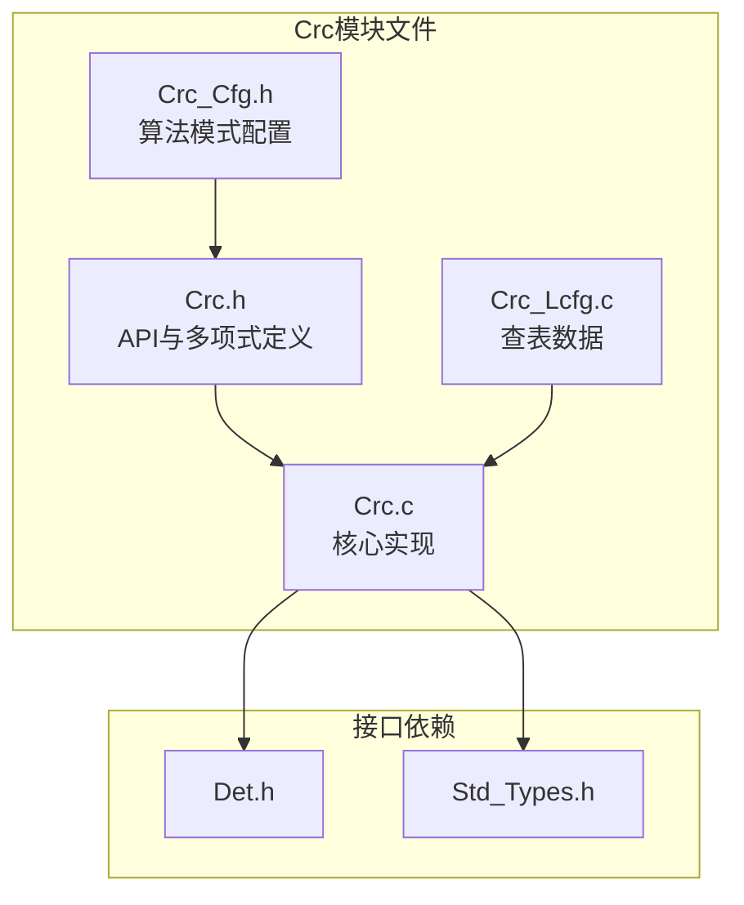
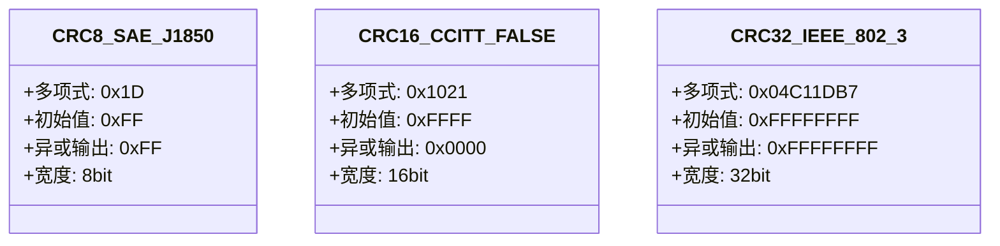
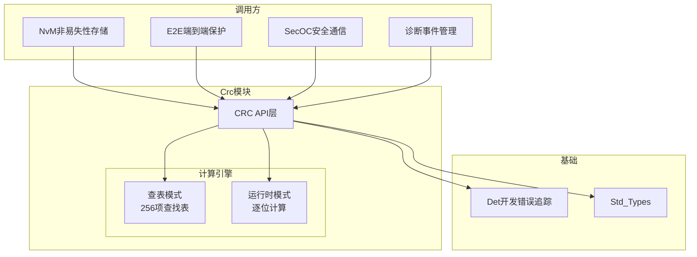
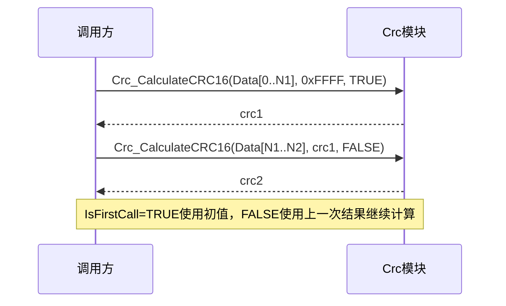
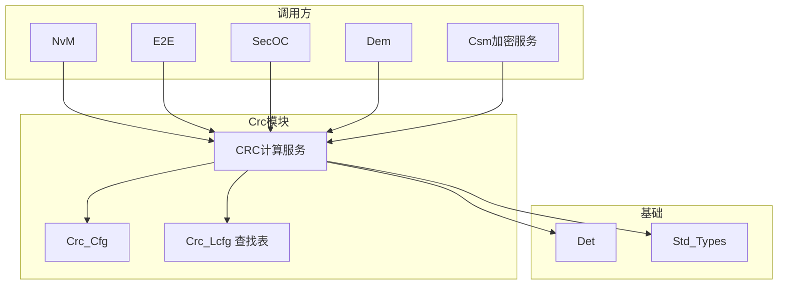

# CRC计算服务（Crc）

<cite>
**本文档引用的文件**
- [Crc.h](file://src/bsw/services/crc/include/Crc.h)
- [Crc_Cfg.h](file://src/bsw/services/crc/include/Crc_Cfg.h)
- [Crc.c](file://src/bsw/services/crc/src/Crc.c)
- [Crc_Lcfg.c](file://src/bsw/services/crc/src/Crc_Lcfg.c)
- [Det.h](file://src/bsw/services/det/include/Det.h)
- [Std_Types.h](file://src/bsw/os/include/Std_Types.h)
</cite>

## 目录
1. [简介](#简介)
2. [项目结构](#项目结构)
3. [核心组件](#核心组件)
4. [架构概览](#架构概览)
5. [详细组件分析](#详细组件分析)
6. [依赖关系分析](#依赖关系分析)
7. [性能考虑](#性能考虑)
8. [故障排除指南](#故障排除指南)
9. [结论](#结论)
10. [附录](#附录)

## 简介

CRC计算服务（Crc）是遵循AUTOSAR经典平台4.4标准的CRC计算模块，位于服务层。该模块提供CRC8（SAE J1850）、CRC16（CCITT-FALSE）、CRC32（IEEE 802.3）三种标准CRC算法的计算服务，支持查表法和运行时逐位计算两种实现模式。

Crc模块被广泛用于NvM数据校验、E2E端到端保护、诊断安全（SecOC）等需要数据完整性校验的场景。模块ID为201U（CRC_MODULE_ID），厂商ID为0x2026U（YuleTech），软件版本1.0.0。

## 项目结构

Crc模块在项目中的文件组织如下：



**图表来源**
- [Crc.h:8-16](file://src/bsw/services/crc/include/Crc.h#L8-L16)
- [Crc.c:14-20](file://src/bsw/services/crc/src/Crc.c#L14-L20)

### 文件清单

| 文件 | 路径 | 职责 |
|------|------|------|
| Crc.h | include/Crc.h | API、多项式/初值/XOR值定义 |
| Crc_Cfg.h | include/Crc_Cfg.h | 算法使能、表模式配置 |
| Crc.c | src/Crc.c | CRC8/16/32计算实现 |
| Crc_Lcfg.c | src/Crc_Lcfg.c | 查表数据（Crc_8/16/32_Table） |

**章节来源**
- [Crc.h:1-142](file://src/bsw/services/crc/include/Crc.h#L1-L142)

## 核心组件

### CRC算法规范

模块实现的三种标准算法：



**图表来源**
- [Crc.h:31-53](file://src/bsw/services/crc/include/Crc.h#L31-L53)

### 配置项（Crc_Cfg.h）

| 配置宏 | 值 | 说明 |
|--------|----|----|
| CRC_DEV_ERROR_DETECT | STD_OFF | 开发错误检测 |
| CRC_VERSION_INFO_API | STD_ON | 版本信息API |
| CRC_8_MODE | STD_ON | CRC8使能 |
| CRC_8_TABLE_MODE | STD_ON | CRC8查表模式 |
| CRC_16_MODE | STD_ON | CRC16使能 |
| CRC_16_TABLE_MODE | STD_ON | CRC16查表模式 |
| CRC_32_MODE | STD_ON | CRC32使能 |
| CRC_32_TABLE_MODE | STD_ON | CRC32查表模式 |

**章节来源**
- [Crc_Cfg.h:15-35](file://src/bsw/services/crc/include/Crc_Cfg.h#L15-L35)

## 架构概览

Crc模块的计算架构：



**图表来源**
- [Crc.c:29-38](file://src/bsw/services/crc/src/Crc.c#L29-L38)

### 连续数据流计算模式



**章节来源**
- [Crc.h:61-75](file://src/bsw/services/crc/include/Crc.h#L61-L75)

## 详细组件分析

### 初始化（Crc_Init）

预编译配置模式下configPtr不使用（`(void)configPtr`），仅置位Crc_InitStatus。若CRC_DEV_ERROR_DETECT开启，未初始化调用计算API将报CRC_E_UNINIT。

**章节来源**
- [Crc.c:60-68](file://src/bsw/services/crc/src/Crc.c#L60-L68)

### CRC8计算（Crc_CalculateCRC8）

```mermaid
flowchart TD
Start([Crc_CalculateCRC8]) --> Check[参数校验<br/>未初始化/空指针/零长度]
Check -->|失败| Err[Det_ReportError<br/>返回0]
Check -->|通过| Init{IsFirstCall?}
Init -->|TRUE| Set8[初值 = 0xFF]
Init -->|FALSE| Use8[使用StartValue8]
Set8 --> Table8{CRC_8_TABLE_MODE?}
Use8 --> Table8
Table8 -->|查表| Loop8[逐字节: crc = Table[crc ^ Data[i]]]
Table8 -->|运行时| Bit8[Crc8_RuntimeCalculate<br/>逐位算法]
Loop8 --> Xor8[crc ^= CRC_8_XOR_OUT(0xFF)]
Bit8 --> Xor8
Xor8 --> Ret8([返回crc])
```

**章节来源**
- [Crc.c:80-125](file://src/bsw/services/crc/src/Crc.c#L80-L125)

### CRC16计算（Crc_CalculateCRC16）

查表模式核心运算：`crc = (crc << 8U) ^ Crc_16_Table[((crc >> 8U) ^ Data[i]) & 0xFFU]`，最终异或CRC_16_XOR_OUT（0x0000）。

运行时模式（Crc16_RuntimeCalculate）：每字节先异或到高8位，再逐位执行`crc & 0x8000U`判断，与CRC_16_POLYNOMIAL（0x1021）异或。

**章节来源**
- [Crc.c:127-172](file://src/bsw/services/crc/src/Crc.c#L127-L172)
- [Crc.c:330-350](file://src/bsw/services/crc/src/Crc.c#L330-L350)

### CRC32计算（Crc_CalculateCRC32）

查表模式核心运算：`crc = (crc << 8U) ^ Crc_32_Table[((crc >> 24U) ^ Data[i]) & 0xFFU]`，最终异或CRC_32_XOR_OUT（0xFFFFFFFF）。

运行时模式（Crc32_RuntimeCalculate）：每字节异或到高8位，逐位判断0x80000000位，与CRC_32_POLYNOMIAL（0x04C11DB7）异或。

**章节来源**
- [Crc.c:174-219](file://src/bsw/services/crc/src/Crc.c#L174-L219)
- [Crc.c:352-372](file://src/bsw/services/crc/src/Crc.c#L352-L372)

### 查表数据（Crc_Lcfg.c）

Crc_Lcfg.c提供256项查找表：
- Crc_8_Table：基于SAE J1850多项式0x1D生成
- Crc_16_Table：基于CCITT多项式0x1021生成
- Crc_32_Table：基于IEEE 802.3多项式0x04C11DB7生成

查表模式将逐位运算（8次/字节）优化为单次查表+异或（1次/字节）。

**章节来源**
- [Crc.c:29-38](file://src/bsw/services/crc/src/Crc.c#L29-L38)

### 版本信息（Crc_GetVersionInfo）

返回vendorID=0x2026U、moduleID=201U、版本1.0.0。

**章节来源**
- [Crc.c:221-240](file://src/bsw/services/crc/src/Crc.c#L221-L240)

## 依赖关系分析



**图表来源**
- [Crc.h:8-16](file://src/bsw/services/crc/include/Crc.h#L8-L16)

### 关键依赖特性

1. **被广泛调用**：NvM块校验、E2E Profile 1/2 CRC、Dem事件状态等均依赖Crc
2. **轻量依赖**：仅依赖Std_Types与Det（可选），无其他BSW依赖
3. **静态配置**：算法使能/模式由Crc_Cfg.h编译期决定
4. **无状态API**：除InitStatus外无内部状态，天然线程安全

**章节来源**
- [Crc_Cfg.h:15-35](file://src/bsw/services/crc/include/Crc_Cfg.h#L15-L35)

## 性能考虑

### 计算性能对比

| 算法 | 查表模式 | 运行时模式 | 说明 |
|------|----------|------------|------|
| CRC8 | 1次查表+1次异或/字节 | 8次移位判断/字节 | 查表快8倍 |
| CRC16 | 2次移位+1次查表/字节 | 8次移位判断/字节 | 查表快约4倍 |
| CRC32 | 2次移位+1次查表/字节 | 8次移位判断/字节 | 查表快约4倍 |

### 资源占用

- **查表RAM/ROM**：3×256项表（8/16/32位各一），约1.5KB只读存储
- **运行时模式**：代码更小（省表），但CPU占用高
- **栈使用**：API无大缓冲区，栈开销极小

### 优化建议

1. **批量数据**：使用查表模式（当前默认），吞吐量最高
2. **分段计算**：大数据分段调用时正确管理StartValue与IsFirstCall
3. **DMA配合**：高负载场景可将CRC计算放入低优先级任务
4. **算法选择**：数据量小时CRC8足够，安全关键数据用CRC32

**章节来源**
- [Crc.c:85-89](file://src/bsw/services/crc/src/Crc.c#L85-L89)

## 故障排除指南

### 错误代码

| 错误代码 | 含义 | 触发条件 | 解决方案 |
|----------|------|----------|----------|
| CRC_E_PARAM_POINTER (0x01U) | 指针无效 | 数据指针NULL | 检查传参 |
| CRC_E_PARAM_DATA (0x02U) | 数据无效 | 长度为0 | 校验长度 |
| CRC_E_UNINIT (0x03U) | 未初始化 | 未调用Crc_Init | 检查初始化顺序 |

### 调试建议

1. **校验失败**：用已知测试向量验证算法参数（多项式/初值/XOR值）
2. **分段计算错误**：确认第二次调用IsFirstCall=FALSE且传入上次返回值
3. **CRC8常见误区**：SAE J1850初值0xFF与XOR 0xFF，勿与CRC-8/ATM混淆
4. **CRC16常见误区**：CCITT-FALSE（初值0xFFFF，非反射）勿与XMODEM混淆
5. **字节序**：确认数据按发送顺序（大端）传入

**章节来源**
- [Crc.h:24-30](file://src/bsw/services/crc/include/Crc.h#L24-L30)

## 结论

CRC计算服务（Crc）模块提供了：

1. **标准算法覆盖**：CRC8/16/32三种AUTOSAR标准算法
2. **双实现模式**：查表（高性能）与运行时（低存储）可配置
3. **流式计算支持**：StartValue/IsFirstCall实现任意长度数据分段计算
4. **广泛集成**：为NvM/E2E/SecOC等安全机制提供数据完整性基础

该模块是yuleASR数据完整性保障体系的基础设施。

## 附录

### API参考

- **初始化**：Crc_Init(const void* configPtr)
- **CRC8**：Crc_CalculateCRC8(DataPtr, Length, StartValue8, IsFirstCall)
- **CRC16**：Crc_CalculateCRC16(DataPtr, Length, StartValue16, IsFirstCall)
- **CRC32**：Crc_CalculateCRC32(DataPtr, Length, StartValue32, IsFirstCall)
- **版本信息**：Crc_GetVersionInfo()

### 使用示例（分段计算）

```c
uint16 crc = 0xFFFFU;  /* 初始值 */
crc = Crc_CalculateCRC16(buf1, len1, crc, TRUE);   /* 第一段 */
crc = Crc_CalculateCRC16(buf2, len2, crc, FALSE);  /* 后续段 */
/* crc ^ CRC_16_XOR_OUT 由API内部完成 */
```

### 配置建议

1. 默认保持三种算法全部使能（CRC_8/16/32_MODE=STD_ON）
2. 存储受限时关闭不常用算法或切换运行时模式
3. 安全相关应用（SecOC）建议CRC32或更强机制
