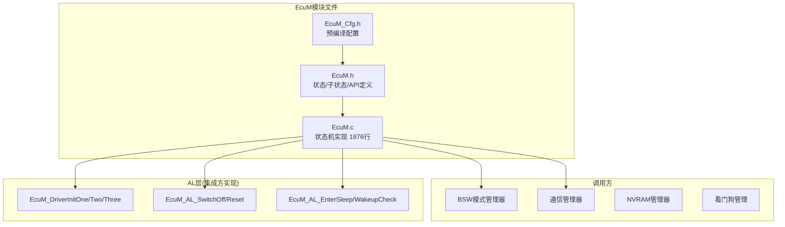
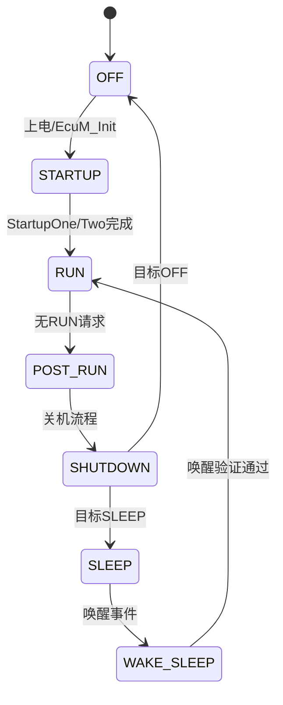
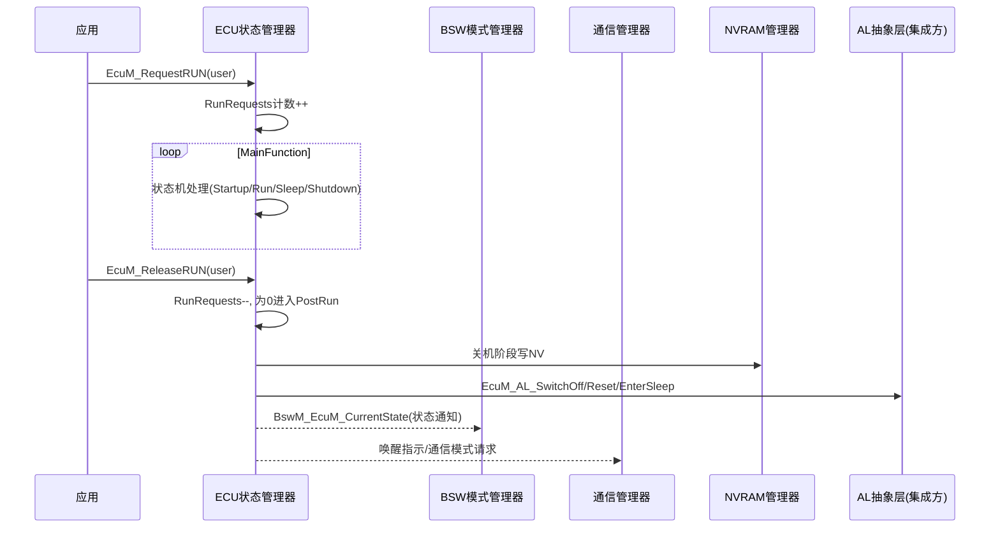
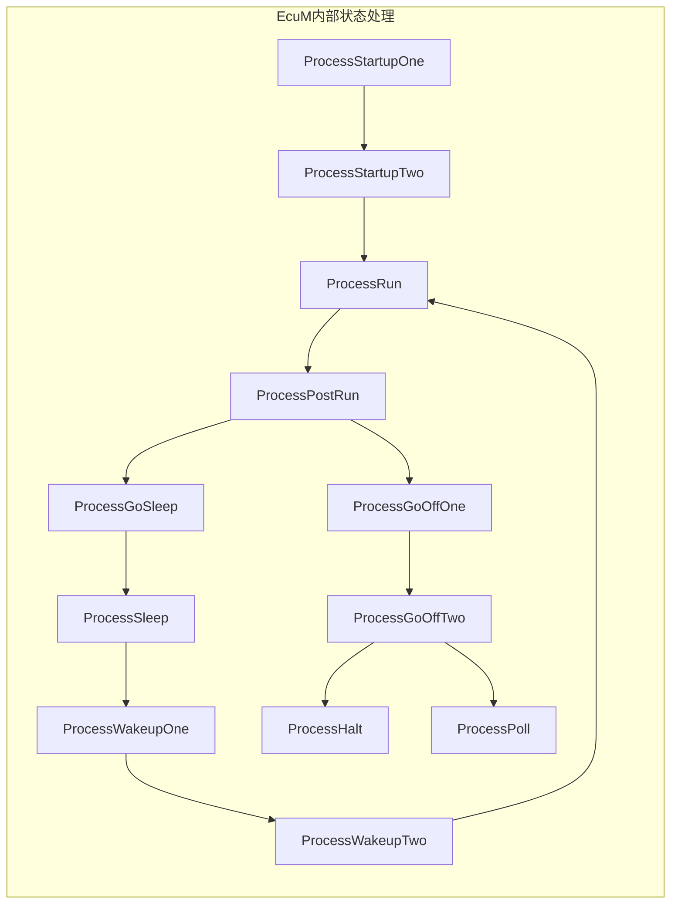
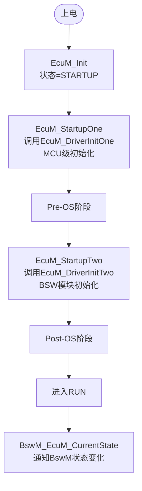
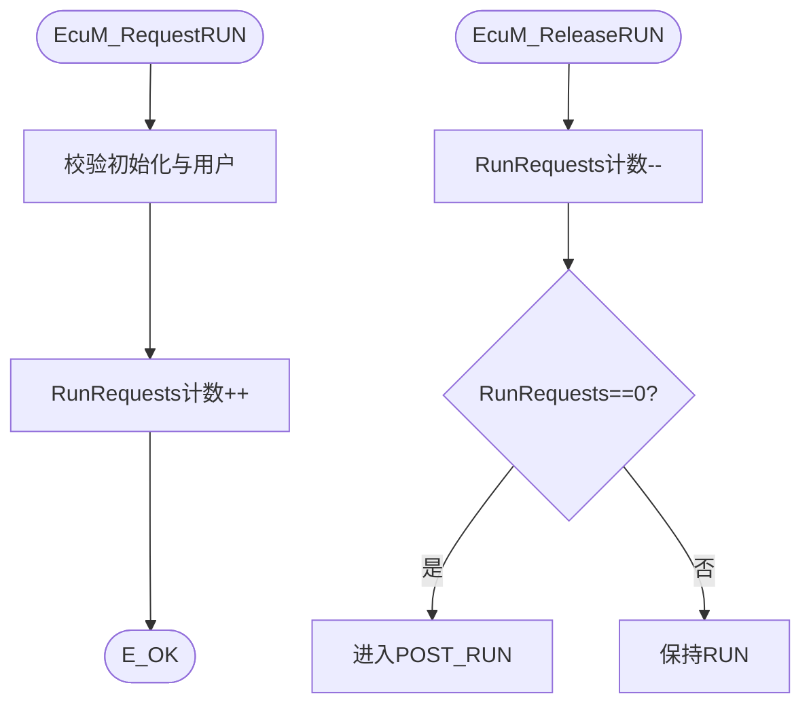
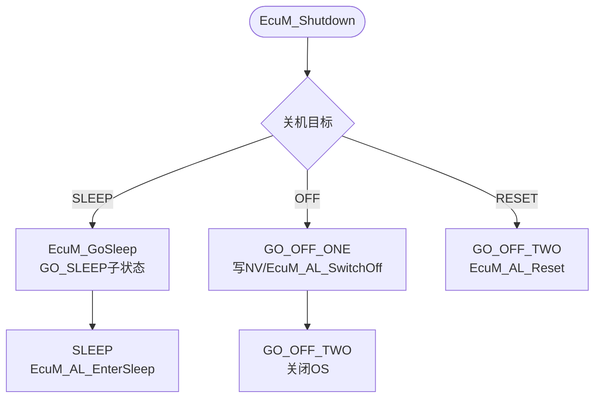
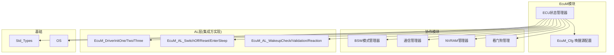

# ECU状态管理器（EcuM）

<cite>
**本文档引用的文件**
- [EcuM.h](file://src/bsw/services/ecum/include/EcuM.h)
- [EcuM_Cfg.h](file://src/bsw/services/ecum/include/EcuM_Cfg.h)
- [EcuM.c](file://src/bsw/services/ecum/src/EcuM.c)
- [Std_Types.h](file://src/bsw/os/include/Std_Types.h)
</cite>

## 目录
1. [简介](#简介)
2. [项目结构](#项目结构)
3. [核心组件](#核心组件)
4. [架构概览](#架构概览)
5. [详细组件分析](#详细组件分析)
6. [依赖关系分析](#依赖关系分析)
7. [性能考虑](#性能考虑)
8. [故障排除指南](#故障排除指南)
9. [结论](#结论)
10. [附录](#附录)

## 简介

ECU状态管理器（EcuM）是遵循AUTOSAR经典平台4.0.3标准的ECU状态管理模块，位于服务层，是ECU电源管理模式（启动/运行/后运行/睡眠/关机）的仲裁中心。EcuM实现多阶段启动（StartupOne/Two）、运行请求管理、关机目标选择、唤醒源验证与睡眠流程管理。

EcuM软件版本2.0.0，实现AUTOSAR EcuM SWS的核心功能：
- **启动管理**：StartupOne（MCU级初始化）→ StartupTwo（BSW初始化）→ RUN
- **运行管理**：RUN请求/释放计数，全部释放后进入PostRun
- **关机管理**：关机目标（OFF/RESET/SLEEP）选择与执行
- **唤醒管理**：唤醒源登记、验证（ValidationTimeout）、过期与睡眠转换

## 项目结构

EcuM模块在项目中的文件组织如下：



**图表来源**
- [EcuM.h:12-19](file://src/bsw/services/ecum/include/EcuM.h#L12-L19)
- [EcuM.c:65-110](file://src/bsw/services/ecum/src/EcuM.c#L65-L110)

### 文件清单

| 文件 | 路径 | 职责 |
|------|------|------|
| EcuM.h | include/EcuM.h | 状态/子状态/唤醒源/API声明 |
| EcuM_Cfg.h | include/EcuM_Cfg.h | 唤醒源配置、定时参数 |
| EcuM.c | src/EcuM.c | 状态机实现（1876行） |

**章节来源**
- [EcuM.h:1-337](file://src/bsw/services/ecum/include/EcuM.h#L1-L337)

## 核心组件

### ECU主状态



**章节来源**
- [EcuM.h:55-69](file://src/bsw/services/ecum/include/EcuM.h#L55-L69)

### 子状态定义

| 阶段 | 子状态 | 值 | 说明 |
|------|--------|----|----|
| 启动 | STARTUP_ONE | 0x11U | MCU初始化 |
| 启动 | STARTUP_TWO | 0x12U | BSW初始化 |
| 启动 | STARTUP_THREE | 0x13U | SWC初始化 |
| 运行 | RUN | 0x21U | 正常运行 |
| 运行 | POST_RUN | 0x22U | 后运行（清理） |
| 睡眠 | GO_SLEEP | 0x31U | 准备睡眠 |
| 睡眠 | SLEEP | 0x32U | 睡眠中 |
| 睡眠 | WAKEUP_ONE/TWO | 0x33U/0x34U | 唤醒阶段 |
| 关机 | GO_OFF_ONE/TWO | 0x41U/0x42U | 写NV/关OS |
| 关机 | RESET | 0x43U | 复位 |
| 特殊 | HALT/POLL | 0x50U/0x51U | 停机/轮询 |

**章节来源**
- [EcuM.h:72-110](file://src/bsw/services/ecum/include/EcuM.h#L72-L110)

### 唤醒源位图（EcuM_WakeupSourceType）

32位位图定义唤醒源：POWER/RESET/INTERNAL_WDG/EXTERNAL_WDG/TIMER/CAN0-4/LIN0-3/ETH0-1/FLEXRAY/SPI/I2C/GPIO/ADC/KEY/NVM/COMM/DCM等。

**章节来源**
- [EcuM.h:124-158](file://src/bsw/services/ecum/include/EcuM.h#L124-L158)

### 关机目标与原因

- **目标**：ECUM_SHUTDOWN_TARGET_OFF/RESET/SLEEP
- **原因**：ECUM_CAUSE_ECU_STATE/WATCHDOG/HARDWARE/SOFTWARE/FATAL_ERROR/DCM

**章节来源**
- [EcuM.h:112-121](file://src/bsw/services/ecum/include/EcuM.h#L112-L121)

## 架构概览

EcuM在ECU电源管理架构中的枢纽位置：



**图表来源**
- [EcuM.c:151-246](file://src/bsw/services/ecum/src/EcuM.c#L151-L246)

### 状态处理函数族



**章节来源**
- [EcuM.c:112-140](file://src/bsw/services/ecum/include/EcuM.c#L112-L140)

## 详细组件分析

### 初始化与启动（EcuM_Init / EcuM_StartupOne / EcuM_StartupTwo）



**章节来源**
- [EcuM.c:151-298](file://src/bsw/services/ecum/src/EcuM.c#L151-L298)

### 运行请求管理（EcuM_RequestRUN / EcuM_ReleaseRUN / EcuM_KillAllRUNRequests）



**要点**：KillAllRUNRequests强制清零并记录KilledRunRequests，用于紧急关机场景。

**章节来源**
- [EcuM.c:300-380](file://src/bsw/services/ecum/src/EcuM.c#L300-L380)

### 唤醒管理（EcuM_SetWakeupEvent / EcuM_CheckWakeup / 验证流程）

```mermaid
flowchart TD
Start([唤醒事件]) --> Set[EcuM_SetWakeupEvent<br/>PendingWakeupEvents |= sources]
Set --> Check[EcuM_CheckWakeup<br/>启动验证定时器]
Check --> Timeout{ValidationTimeout到期?}
Timeout -->|验证成功| Valid[ValidatedWakeupEvents]
Timeout -->|验证失败| Expired[ExpiredWakeupEvents<br/>状态=EXPIRED]
Valid --> Notify[通知唤醒原因<br/>ComM_EcuM_WakeUpIndication]
Expired --> Sleep[回到SLEEP]
```

唤醒源状态（EcuM_WakeupStatusType）：NONE/PENDING/VALIDATED/EXPIRED/DISABLED。

**章节来源**
- [EcuM.c:400-520](file://src/bsw/services/ecum/src/EcuM.c#L400-L520)

### 关机流程（EcuM_Shutdown / EcuM_SelectShutdownTarget）



**章节来源**
- [EcuM.c:520-650](file://src/bsw/services/ecum/src/EcuM.c#L520-L650)

### 主函数（EcuM_MainFunction）

周期任务（EcuM_MainFunctionCounter驱动）：
1. 按当前状态分发到对应Process函数
2. 处理唤醒源验证定时器（EcuM_WakeupValidationTimer）
3. 处理睡眠转换检查（EcuM_CheckSleepTransition）
4. 状态计时（EcuM_StateTimer）

**章节来源**
- [EcuM.c:100-110](file://src/bsw/services/ecum/src/EcuM.c#L100-L110)

## 依赖关系分析



**图表来源**
- [EcuM.h:12-19](file://src/bsw/services/ecum/include/EcuM.h#L12-L19)

### 关键依赖特性

1. **BswM通知**：BswM_EcuM_CurrentState状态上报
2. **ComM集成**：唤醒指示（ComM_EcuM_WakeUpIndication）与通信模式请求
3. **AL抽象层**：驱动初始化/断电/复位/睡眠由集成方实现（弱依赖）
4. **NvM协调**：关机阶段NV存储时序协调

**章节来源**
- [EcuM.h:295-337](file://src/bsw/services/ecum/include/EcuM.h#L295-L337)

## 性能考虑

### 资源占用

- **全局状态**：状态变量+唤醒位图+定时器数组，约200字节
- **唤醒源状态表**：EcuM_WakeupStatus[ECUM_MAX_WAKEUP_SOURCES]
- **代码体积**：EcuM.c约1876行，服务层大模块之一

### 实时性

- **主函数复杂度**：O(状态处理+唤醒源数)
- **状态处理**：每个Process函数为有限步骤序列，无循环
- **关键时序**：唤醒验证超时（ValidationTimeout）、睡眠转换等待需精确定时

### 优化建议

1. 唤醒源验证定时器数组按需启用（ECUM_MAX_WAKEUP_SOURCES裁剪）
2. 中断上下文调用EcuM_SetWakeupEvent时保证位操作原子性
3. 关机流程中NV写入采用异步（NvM异步API），避免阻塞关机路径
4. 休眠模式（ECUM_SUBSTATE_SLEEP）下最小化MainFunction唤醒频率

**章节来源**
- [EcuM_Cfg.h:15-60](file://src/bsw/services/ecum/include/EcuM_Cfg.h#L15-L60)

## 故障排除指南

### 错误代码

| 错误代码 | 含义 | 可能原因 | 解决方案 |
|----------|------|----------|----------|
| ECUM_E_NOT_INITIALIZED (0x10) | 未初始化 | 未调用EcuM_Init | 检查启动顺序 |
| ECUM_E_INVALID_PAR (0x11) | 参数无效 | 用户/状态非法 | 校验参数 |
| ECUM_E_NULL_POINTER (0x12) | 空指针 | 输出指针NULL | 检查传参 |
| ECUM_E_STATE_CHANGE_FAILED (0x13) | 状态迁移失败 | 非法迁移 | 检查状态序列 |
| ECUM_E_WRONG_API_ORDER (0x16) | API顺序错误 | 调用顺序违规 | 遵循生命周期 |
| ECUM_E_ALL_CORES_NOT_SYNCHRONIZED (0x19) | 多核未同步 | 多核启动失步 | 检查核同步 |

### 调试建议

1. **无法进入RUN**：检查StartupOne/Two调用链与DriverInit回调
2. **无法睡眠**：检查RunRequests是否清零、唤醒源是否持续有效
3. **唤醒异常**：检查唤醒源位图与ValidationTimeout配置
4. **关机卡死**：检查EcuM_AL_*实现（集成方）是否返回
5. **状态跳变**：确认MainFunction周期调度与状态计时

**章节来源**
- [EcuM.h:44-53](file://src/bsw/services/ecum/include/EcuM.h#L44-L53)

## 结论

ECU状态管理器（EcuM）是ECU电源生命周期管理的核心：

1. **全生命周期覆盖**：启动/运行/后运行/睡眠/关机/复位完整状态机
2. **多阶段启动**：StartupOne/Two/Three分阶段初始化，Pre-OS/Post-OS清晰分层
3. **唤醒管理完善**：唤醒源位图+验证超时+过期机制
4. **AL层解耦**：硬件相关操作通过AL回调隔离，便于平台移植

该模块为ECU电源管理提供了完整的AUTOSAR标准实现，是整车睡眠/唤醒管理的关键。

## 附录

### API参考

- **启动**：EcuM_Init(), EcuM_StartupOne(), EcuM_StartupTwo()
- **运行管理**：EcuM_RequestRUN(), EcuM_ReleaseRUN(), EcuM_KillAllRUNRequests()
- **关机**：EcuM_Shutdown(), EcuM_SelectShutdownTarget(), EcuM_SelectShutdownCause()
- **睡眠**：EcuM_GoSleep(), EcuM_GoHalt(), EcuM_GoPoll(), EcuM_WakeupRestart()
- **唤醒**：EcuM_SetWakeupEvent(), EcuM_ClearWakeupEvent(), EcuM_CheckWakeup(), EcuM_Enable/DisableWakeupSources(), EcuM_GetStatusOfWakeupSource()
- **查询**：EcuM_GetState(), EcuM_GetSubState(), EcuM_GetShutdownTarget(), EcuM_GetWakeupSources()

### AL层实现清单（集成方必须提供）

| 回调 | 用途 |
|------|------|
| EcuM_DriverInitOne/Two/Three | 三阶段驱动初始化 |
| EcuM_AL_DriverInitOne/Two/Three | AL层驱动初始化 |
| EcuM_AL_SwitchOff | 断电动作 |
| EcuM_AL_Reset | 复位动作 |
| EcuM_AL_EnterSleep | 进入睡眠 |
| EcuM_AL_WakeupCheck/Validation/Reaction | 唤醒验证三步骤 |
