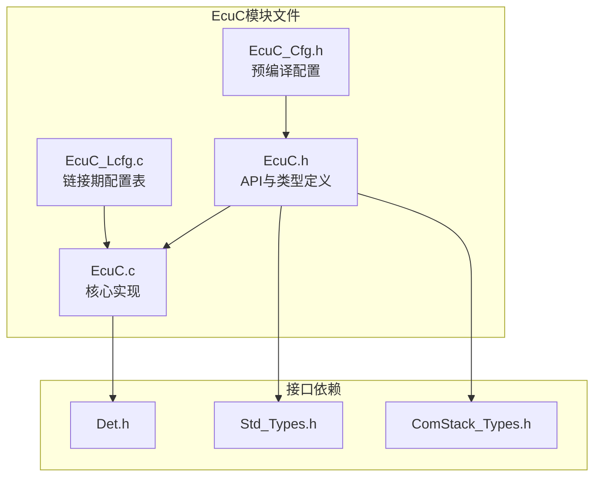
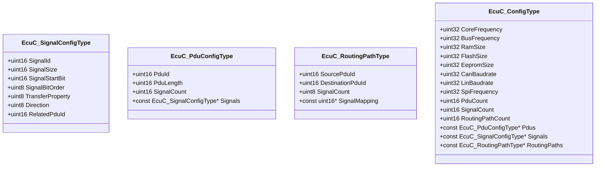
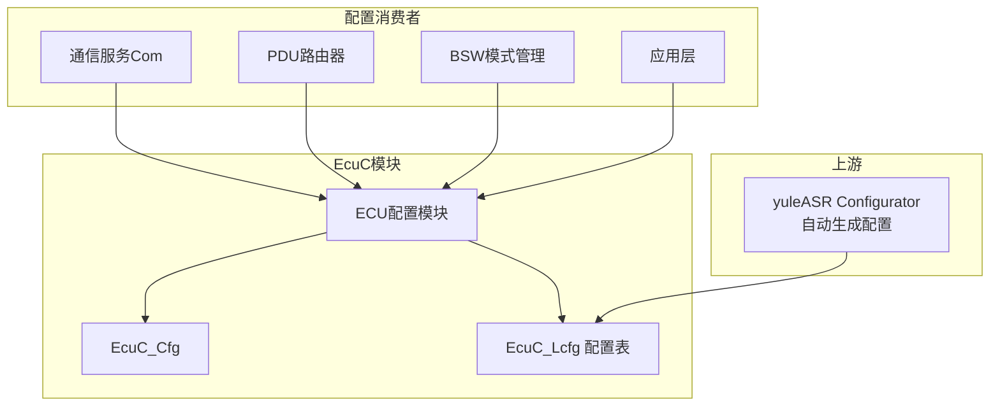
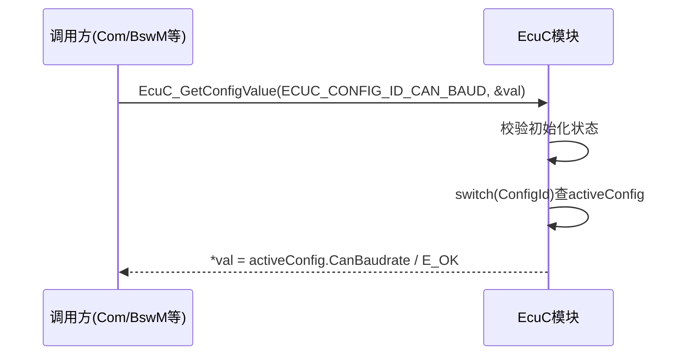
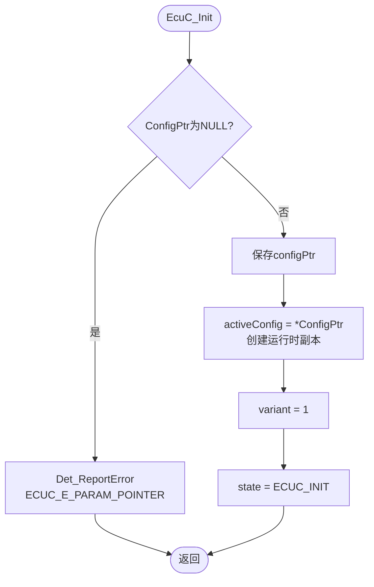
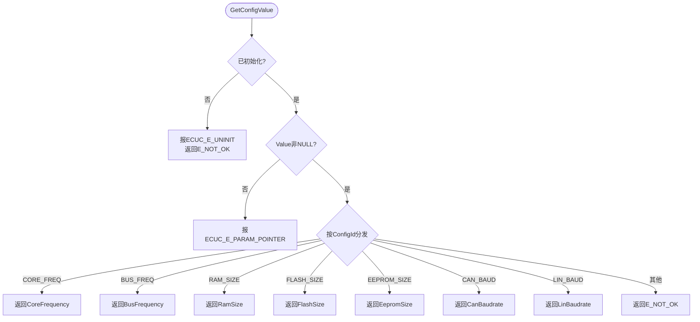

# ECU配置（EcuC）

<cite>
**本文档引用的文件**
- [EcuC.h](file://src/bsw/services/ecuc/include/EcuC.h)
- [EcuC_Cfg.h](file://src/bsw/services/ecuc/include/EcuC_Cfg.h)
- [EcuC.c](file://src/bsw/services/ecuc/src/EcuC.c)
- [EcuC_Lcfg.c](file://src/bsw/services/ecuc/src/EcuC_Lcfg.c)
- [Det.h](file://src/bsw/services/det/include/Det.h)
- [Std_Types.h](file://src/bsw/os/include/Std_Types.h)
- [ComStack_Types.h](file://src/bsw/ecual/include/ComStack_Types.h)
</cite>

## 目录
1. [简介](#简介)
2. [项目结构](#项目结构)
3. [核心组件](#核心组件)
4. [架构概览](#架构概览)
5. [详细组件分析](#详细组件分析)
6. [依赖关系分析](#依赖关系分析)
7. [性能考虑](#性能考虑)
8. [故障排除指南](#故障排除指南)
9. [结论](#结论)
10. [附录](#附录)

## 简介

ECU配置（EcuC）是遵循AUTOSAR_SWS_ECUConfiguration规范的ECU配置参数访问模块，位于服务层，模块ID为0x13U（ECUC_MODULE_ID），厂商ID为0x0055U（YuleTech），软件版本2.0.0。

EcuC承载两类职责：
1. **ECU级配置参数访问**：核心频率、总线频率、RAM/Flash/EEPROM容量、CAN/LIN波特率等，通过EcuC_GetConfigValue/EcuC_SetConfigValue按配置ID访问
2. **信号/PDU/路由元数据**：EcuC_SignalConfigType、EcuC_PduConfigType、EcuC_RoutingPathType描述信号打包与路由路径，供Com等模块查询

EcuC是ECU的"配置数据库"，为系统集成提供统一的配置查询入口。

## 项目结构

EcuC模块在项目中的文件组织如下：



**图表来源**
- [EcuC.h:11-16](file://src/bsw/services/ecuc/include/EcuC.h#L11-L16)
- [EcuC.c:10-13](file://src/bsw/services/ecuc/src/EcuC.c#L10-L13)

### 文件清单

| 文件 | 路径 | 职责 |
|------|------|------|
| EcuC.h | include/EcuC.h | API、配置ID、信号/PDU类型 |
| EcuC_Cfg.h | include/EcuC_Cfg.h | 预编译配置 |
| EcuC.c | src/EcuC.c | 配置访问、运行时配置副本 |
| EcuC_Lcfg.c | src/EcuC_Lcfg.c | PDU/信号/路由配置表 |

**章节来源**
- [EcuC.h:1-96](file://src/bsw/services/ecuc/include/EcuC.h#L1-L96)

## 核心组件

### 配置ID定义

| 配置ID | 值 | 说明 |
|--------|----|----|
| ECUC_CONFIG_ID_CORE_FREQ | 0x01U | 核心频率 |
| ECUC_CONFIG_ID_BUS_FREQ | 0x02U | 总线频率 |
| ECUC_CONFIG_ID_RAM_SIZE | 0x03U | RAM容量 |
| ECUC_CONFIG_ID_FLASH_SIZE | 0x04U | Flash容量 |
| ECUC_CONFIG_ID_EEPROM_SIZE | 0x05U | EEPROM容量 |
| ECUC_CONFIG_ID_CAN_BAUD | 0x06U | CAN波特率 |
| ECUC_CONFIG_ID_LIN_BAUD | 0x07U | LIN波特率 |

**章节来源**
- [EcuC.h:22-29](file://src/bsw/services/ecuc/include/EcuC.h#L22-L29)

### 配置数据结构



**图表来源**
- [EcuC.h:45-77](file://src/bsw/services/ecuc/include/EcuC.h#L45-L77)

### 属性枚举

- **信号传输属性**：ECUC_SIGNAL_TRIGGERED（1，触发式）、ECUC_SIGNAL_TRIGGERED_ON_CHANGE（2，变化触发）
- **信号方向**：ECUC_SEND（1）、ECUC_RECEIVE（2）
- **容器类型**：ECUC_CONTAINER_ECU/PDU/SIGNAL（1/2/3）

**章节来源**
- [EcuC.h:32-43](file://src/bsw/services/ecuc/include/EcuC.h#L32-L43)

## 架构概览

EcuC在ECU软件架构中的位置：



**图表来源**
- [EcuC.h:11-16](file://src/bsw/services/ecuc/include/EcuC.h#L11-L16)

### 配置访问流程



**章节来源**
- [EcuC.c:66-95](file://src/bsw/services/ecuc/src/EcuC.c#L66-L95)

## 详细组件分析

### 初始化（EcuC_Init）



**关键设计**：EcuC将链接期配置整体拷贝到RAM副本（activeConfig），SetConfigValue修改的是RAM副本，实现"运行时可变配置"。

**章节来源**
- [EcuC.c:38-53](file://src/bsw/services/ecuc/src/EcuC.c#L38-L53)

### 配置读取（EcuC_GetConfigValue）



**章节来源**
- [EcuC.c:56-95](file://src/bsw/services/ecuc/src/EcuC.c#L56-L95)

### 配置写入（EcuC_SetConfigValue）

与读取对称，支持运行时修改activeConfig副本中的参数（如波特率运行时切换）。未知ConfigId返回E_NOT_OK。

**章节来源**
- [EcuC.c:97-126](file://src/bsw/services/ecuc/src/EcuC.c#L97-L126)

### 版本信息（EcuC_GetVersionInfo）

返回vendorID=0x0055U、moduleID=0x13U、版本1.0.0（实现中写死，与头文件声明2.0.0存在轻微不一致，属已知实现细节）。

**章节来源**
- [EcuC.c:128-142](file://src/bsw/services/ecuc/src/EcuC.c#L128-L142)

## 依赖关系分析

```mermaid
graph TB
subgraph "消费者"
Com[Com通信服务]
PduR[PDU路由器]
BswM[BSW模式管理]
EcuM[ECU状态管理]
end
subgraph "EcuC"
EcuC[ECU配置模块]
Cfg[EcuC_Cfg]
Lcfg[EcuC_Lcfg]
end
subgraph "基础"
Det[Det]
Std[Std_Types]
CST[ComStack_Types]
end
Com --> EcuC
PduR --> EcuC
BswM --> EcuC
EcuM --> EcuC
EcuC --> Cfg
EcuC --> Lcfg
EcuC --> Det
EcuC --> Std
EcuC --> CST
```

**图表来源**
- [EcuC.h:11-16](file://src/bsw/services/ecuc/include/EcuC.h#L11-L16)

### 关键依赖特性

1. **配置数据库角色**：ECU级参数与信号/PDU元数据的统一访问入口
2. **Configurator上游**：EcuC_Lcfg.c由yuleASR Configurator生成
3. **轻量依赖**：仅依赖Det/Std_Types/ComStack_Types
4. **运行时可变**：SetConfigValue支持运行时配置调整（区别于纯静态配置）

**章节来源**
- [EcuC_Cfg.h:15-52](file://src/bsw/services/ecuc/include/EcuC_Cfg.h#L15-L52)

## 性能考虑

### 资源占用

- **运行时副本**：EcuC_ConfigType完整拷贝（约60字节+指针表）
- **状态结构**：EcuC_InternalType（state/variant/activeConfig/configPtr）
- **代码体积**：约1.5KB，轻量模块

### 性能特征

- **访问复杂度**：O(1)，switch分发无循环
- **初始化开销**：一次结构体拷贝（memcpy级别）
- **无中断保护**：Set/Get并发访问需外部加锁（当前实现未内置）

### 优化建议

1. 高频读取的参数（如波特率）可缓存局部变量避免重复调用
2. 若无需运行时修改，SetConfigValue路径可裁剪
3. 并发场景（中断/任务共享配置）需在调用方加临界区保护

**章节来源**
- [EcuC.c:23-28](file://src/bsw/services/ecuc/src/EcuC.c#L23-L28)

## 故障排除指南

### 错误代码

| 错误代码 | 含义 | 可能原因 | 解决方案 |
|----------|------|----------|----------|
| ECUC_E_UNINIT (0x20U) | 未初始化 | 未调用EcuC_Init | 检查初始化顺序 |
| ECUC_E_READ_ONLY (0x40U) | 只读配置 | 尝试写只读项 | 检查配置属性 |
| ECUC_E_PARAM_POINTER | 指针无效 | Value为NULL | 检查传参 |
| 默认分支E_NOT_OK | 配置ID无效 | ConfigId越界 | 校验ID范围 |

### 调试建议

1. **读取异常值**：确认EcuC_Init已执行且activeConfig已填充
2. **写入不生效**：检查是否误用了只读路径、ConfigId是否正确
3. **配置表缺失**：确认EcuC_Lcfg.c正确链接（PduCount/SignalCount匹配）
4. **版本不一致**：注意GetVersionInfo返回1.0.0与头文件2.0.0的差异

**章节来源**
- [EcuC.c:19-21](file://src/bsw/services/ecuc/include/EcuC.c#L19-L21)

## 结论

ECU配置（EcuC）模块提供了：

1. **统一配置访问**：7类ECU级参数通过ConfigId访问
2. **信号元数据**：信号打包（位序/起始位/大小）与PDU关联
3. **路由描述**：源/目的PDU的信号映射，支撑网关路由
4. **运行时可变**：RAM副本支持运行期参数调整

该模块是yuleASR配置体系在运行时的查询入口，与yuleASR Configurator生成链路闭环。

## 附录

### API参考

- **生命周期**：EcuC_Init(), EcuC_DeInit()
- **配置访问**：EcuC_GetConfigValue(), EcuC_SetConfigValue()
- **版本信息**：EcuC_GetVersionInfo()

### 配置ID速查

| 配置ID | 获取内容 |
|--------|----------|
| ECUC_CONFIG_ID_CORE_FREQ | CPU核心频率(Hz) |
| ECUC_CONFIG_ID_BUS_FREQ | 总线时钟频率(Hz) |
| ECUC_CONFIG_ID_RAM_SIZE | RAM容量(字节) |
| ECUC_CONFIG_ID_FLASH_SIZE | Flash容量(字节) |
| ECUC_CONFIG_ID_EEPROM_SIZE | EEPROM容量(字节) |
| ECUC_CONFIG_ID_CAN_BAUD | CAN波特率(bps) |
| ECUC_CONFIG_ID_LIN_BAUD | LIN波特率(bps) |
