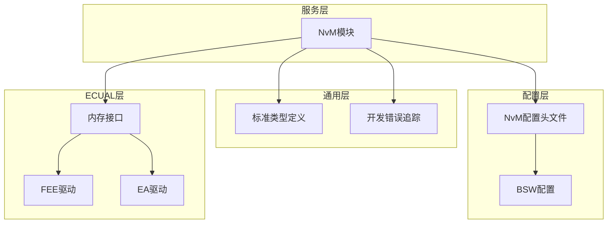
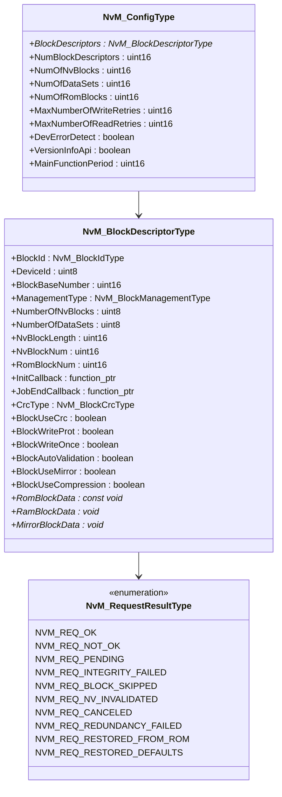
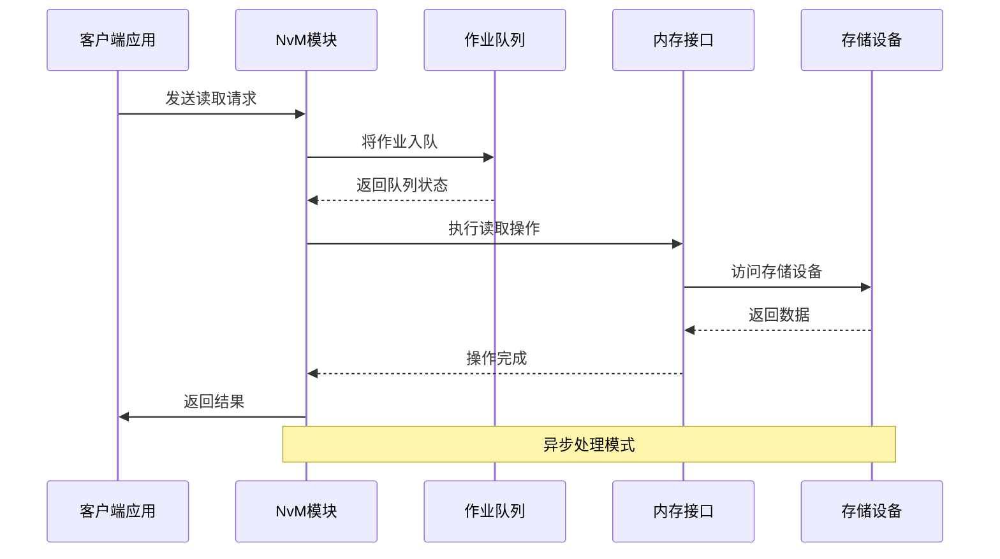
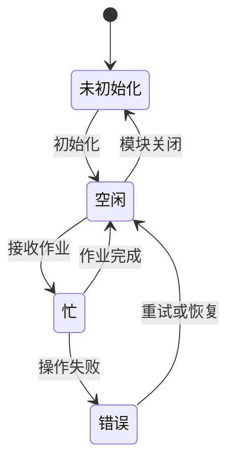
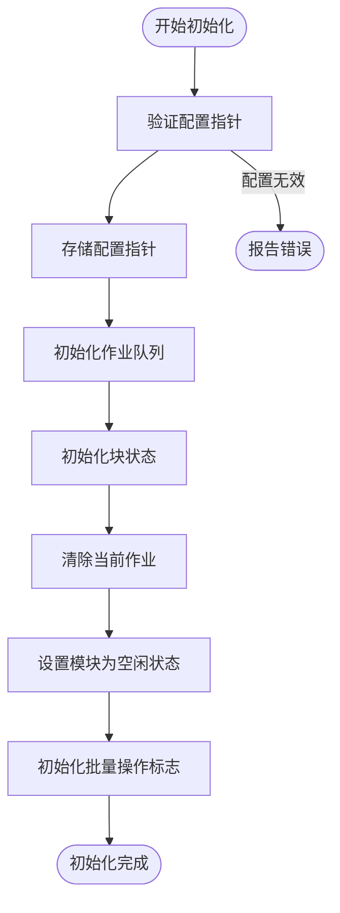
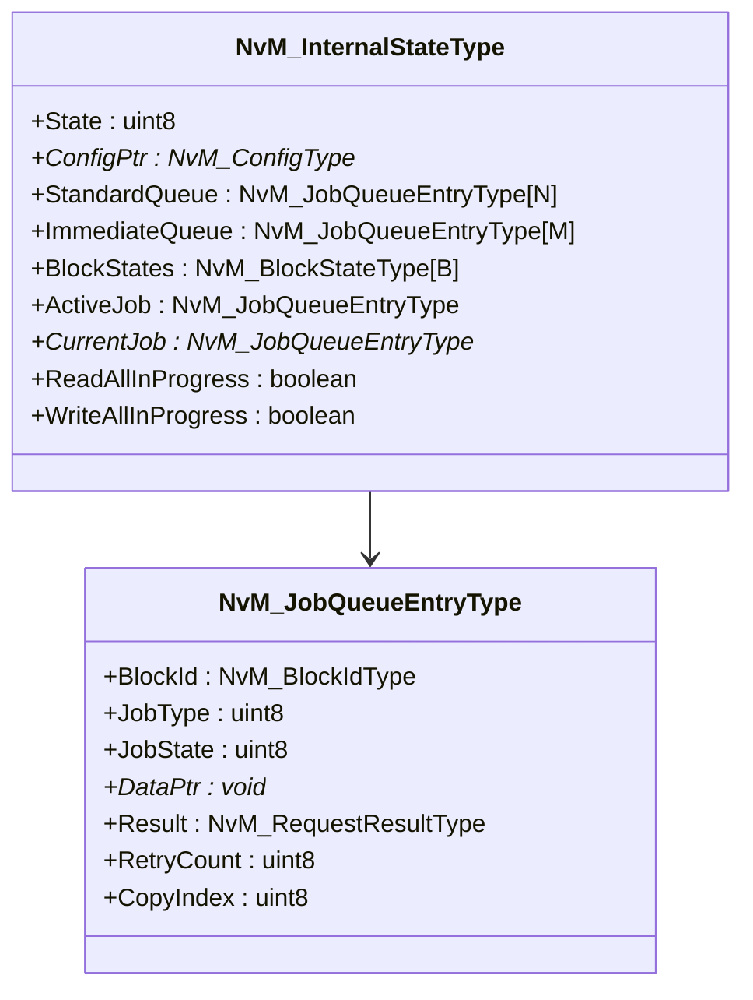
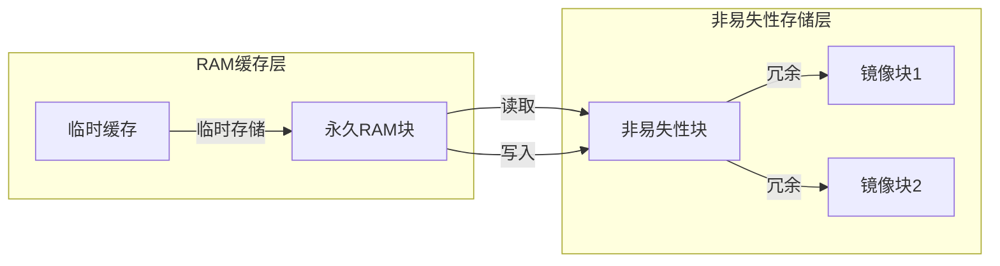
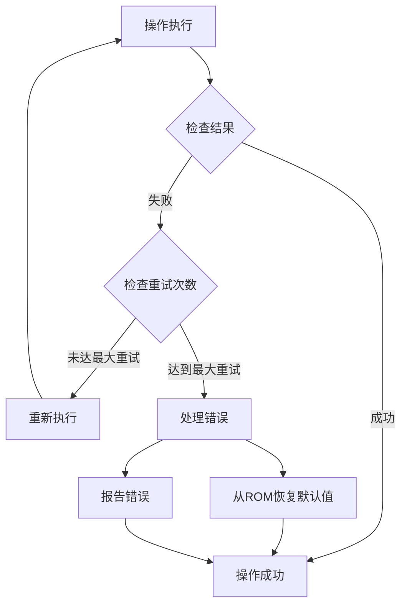
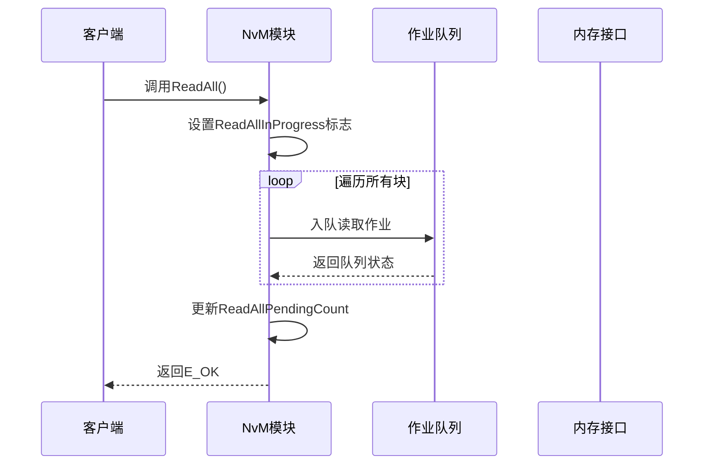
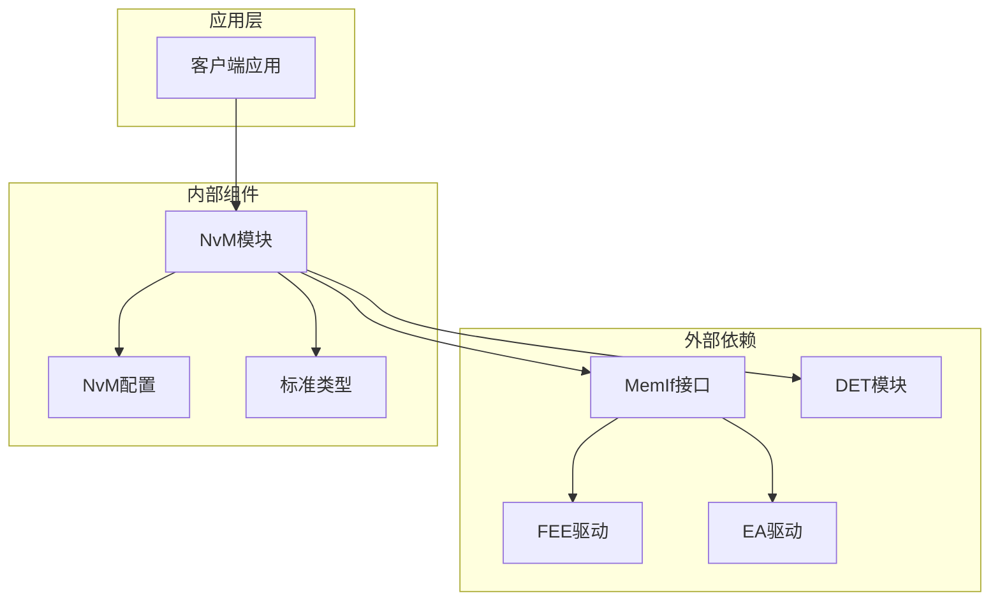

# NVRAM管理器（NvM）

<cite>
**本文档引用的文件**
- [NvM.h](file://src/bsw/services/nvm/include/NvM.h)
- [NvM_Cfg.h](file://src/bsw/services/nvm/include/NvM_Cfg.h)
- [NvM.c](file://src/bsw/services/nvm/src/NvM.c)
- [Det.h](file://src/bsw/common/Det.h)
- [Std_Types.h](file://src/bsw/common/Std_Types.h)
- [bsw_config.json](file://config/bsw_config.json)
</cite>

## 目录
1. [简介](#简介)
2. [项目结构](#项目结构)
3. [核心组件](#核心组件)
4. [架构概览](#架构概览)
5. [详细组件分析](#详细组件分析)
6. [依赖关系分析](#依赖关系分析)
7. [性能考虑](#性能考虑)
8. [故障排除指南](#故障排除指南)
9. [结论](#结论)
10. [附录](#附录)

## 简介

NVRAM管理器（NvM）是遵循AUTOSAR经典平台4.x标准的非易失性存储管理模块。该模块提供了完整的非易失性存储管理功能，包括数据持久化、批量操作和错误恢复机制。

NvM模块采用分层架构设计，位于服务层，通过内存接口（MemIf）与底层存储设备进行交互。模块支持多种数据管理策略，包括立即写入、延迟写入和批量更新，并提供了完善的缓存机制来确保数据的一致性和可靠性。

## 项目结构

NvM模块在项目中的组织结构如下：

**图表来源**
- [NvM.h:1-355](file://src/bsw/services/nvm/include/NvM.h#L1-L355)
- [NvM_Cfg.h:1-88](file://src/bsw/services/nvm/include/NvM_Cfg.h#L1-L88)

**章节来源**
- [NvM.h:1-355](file://src/bsw/services/nvm/include/NvM.h#L1-L355)
- [NvM_Cfg.h:1-88](file://src/bsw/services/nvm/include/NvM_Cfg.h#L1-L88)

## 核心组件

### 数据类型定义

NvM模块定义了以下核心数据类型：

**图表来源**
- [NvM.h:116-172](file://src/bsw/services/nvm/include/NvM.h#L116-L172)

### 配置参数

NvM模块支持丰富的配置选项：

| 配置项 | 默认值 | 描述 |
|--------|--------|------|
| NVM_DEV_ERROR_DETECT | STD_ON | 开发错误检测开关 |
| NVM_VERSION_INFO_API | STD_ON | 版本信息API开关 |
| NVM_SET_RAM_BLOCK_STATUS_API | STD_ON | RAM块状态设置API |
| NVM_GET_ERROR_STATUS_API | STD_ON | 错误状态获取API |
| NVM_NUM_OF_NVRAM_BLOCKS | 32 | 非易失性存储块数量 |
| NVM_NUM_OF_DATASETS | 8 | 数据集数量 |
| NVM_NUM_OF_ROM_BLOCKS | 16 | ROM块数量 |
| NVM_MAX_NUMBER_OF_WRITE_RETRIES | 3 | 最大写入重试次数 |
| NVM_MAX_NUMBER_OF_READ_RETRIES | 3 | 最大读取重试次数 |
| NVM_MAIN_FUNCTION_PERIOD_MS | 10 | 主函数周期（毫秒） |

**章节来源**
- [NvM_Cfg.h:15-87](file://src/bsw/services/nvm/include/NvM_Cfg.h#L15-L87)

## 架构概览

NvM模块采用事件驱动的异步架构，通过作业队列管理系统请求：

**图表来源**
- [NvM.c:1687-2125](file://src/bsw/services/nvm/src/NvM.c#L1687-L2125)

### 状态管理

模块维护以下状态：

**图表来源**
- [NvM.c:37-40](file://src/bsw/services/nvm/src/NvM.c#L37-L40)

**章节来源**
- [NvM.c:918-968](file://src/bsw/services/nvm/src/NvM.c#L918-L968)

## 详细组件分析

### 初始化过程（NvM_Init）

初始化过程负责建立模块的基础运行环境：

**图表来源**
- [NvM.c:918-968](file://src/bsw/services/nvm/src/NvM.c#L918-L968)

初始化过程的关键步骤包括：
1. 配置指针验证
2. 作业队列初始化（标准队列和即时队列）
3. 块状态表初始化
4. 批量操作状态复位

**章节来源**
- [NvM.c:918-968](file://src/bsw/services/nvm/src/NvM.c#L918-L968)

### 作业队列管理

NvM模块实现了双队列架构来管理不同类型的操作：

**图表来源**
- [NvM.c:72-129](file://src/bsw/services/nvm/src/NvM.c#L72-L129)

#### 队列操作实现

队列操作基于环形缓冲区实现，支持以下功能：

1. **入队操作（NvM_QueuePush）**
   - 检查队列是否已满
   - 使用尾指针循环添加元素
   - 更新队列计数

2. **出队操作（NvM_QueuePop）**
   - 检查队列是否为空
   - 使用头指针循环移除元素
   - 更新队列计数

3. **优先级调度**
   - 即时队列（高优先级）：用于紧急操作如默认值恢复
   - 标准队列（普通优先级）：用于常规读写操作

**章节来源**
- [NvM.c:177-233](file://src/bsw/services/nvm/src/NvM.c#L177-L233)

### 数据管理策略

NvM模块支持三种主要的数据管理策略：

#### 立即写入策略
适用于对数据一致性要求极高的关键信息，如VIN码、里程表等。

#### 延迟写入策略
适用于一般性配置数据，通过批量写入减少存储设备磨损。

#### 批量更新策略
支持一次性处理多个数据块，提高系统整体性能。

### 缓存机制

**图表来源**
- [NvM.c:424-433](file://src/bsw/services/nvm/src/NvM.c#L424-L433)

缓存机制的特点：
1. **多级缓存**：支持永久RAM块和临时缓存
2. **数据完整性**：通过CRC校验确保数据正确性
3. **冗余保护**：支持镜像块提供数据冗余

**章节来源**
- [NvM.c:424-433](file://src/bsw/services/nvm/src/NvM.c#L424-L433)

### 错误处理机制

NvM模块实现了多层次的错误处理机制：

**图表来源**
- [NvM.c:1977-2034](file://src/bsw/services/nvm/src/NvM.c#L1977-L2034)

错误处理流程包括：
1. **重试机制**：根据配置的最大重试次数自动重试
2. **ROM回退**：当存储操作失败时从ROM恢复默认值
3. **错误报告**：通过DET模块报告开发错误
4. **状态跟踪**：维护每个块的最后操作结果

**章节来源**
- [NvM.c:1977-2034](file://src/bsw/services/nvm/src/NvM.c#L1977-L2034)

### 批量操作管理

NvM模块支持高效的批量操作：

#### ReadAll操作

**图表来源**
- [NvM.c:2131-2173](file://src/bsw/services/nvm/src/NvM.c#L2131-L2173)

#### WriteAll操作
WriteAll操作只处理标记为"已更改"的块，提高效率并减少不必要的写入操作。

**章节来源**
- [NvM.c:2179-2222](file://src/bsw/services/nvm/src/NvM.c#L2179-L2222)

## 依赖关系分析

NvM模块的依赖关系如下：

**图表来源**
- [NvM.h:19-21](file://src/bsw/services/nvm/include/NvM.h#L19-L21)

### 关键依赖特性

1. **MemIf接口抽象**：通过MemIf接口屏蔽底层存储设备差异
2. **配置驱动**：所有行为通过配置文件控制
3. **错误检测集成**：与DET模块深度集成提供开发错误检测

**章节来源**
- [NvM.h:19-21](file://src/bsw/services/nvm/include/NvM.h#L19-L21)

## 性能考虑

### 队列容量优化

- **标准队列大小**：16个作业，适合一般应用场景
- **即时队列大小**：4个作业，确保紧急操作的响应性
- **队列满处理**：当队列满时拒绝新作业，避免内存溢出

### CRC计算优化

模块支持多种CRC算法：
- **CRC-8**：计算开销最小，适合小数据块
- **CRC-16**：平衡计算速度和错误检测能力
- **CRC-32**：提供最强的错误检测能力

### 批量操作优化

- **WriteAll智能过滤**：只处理已更改的块
- **ReadAll并行处理**：所有块同时排队处理
- **内存预分配**：避免运行时内存分配

## 故障排除指南

### 常见错误代码

| 错误代码 | 含义 | 可能原因 | 解决方案 |
|----------|------|----------|----------|
| NVM_E_NOT_INITIALIZED | 未初始化 | 模块未调用初始化 | 确保先调用NvM_Init |
| NVM_E_BLOCK_PENDING | 块挂起 | 前一个操作未完成 | 等待操作完成或取消作业 |
| NVM_E_WRITE_PROTECTED | 写保护 | 块被锁定或写一次保护 | 检查块状态和保护设置 |
| NVM_E_PARAM_BLOCK_ID | 块ID参数错误 | 块ID超出范围 | 验证块ID的有效性 |

### 调试建议

1. **启用开发错误检测**：设置NVM_DEV_ERROR_DETECT为STD_ON
2. **监控队列状态**：定期检查队列长度避免溢出
3. **跟踪块状态**：使用NvM_GetErrorStatus监控操作结果
4. **日志记录**：在关键节点添加调试输出

**章节来源**
- [NvM.h:67-76](file://src/bsw/services/nvm/include/NvM.h#L67-L76)

## 结论

NVRAM管理器（NvM）模块提供了完整的非易失性存储管理解决方案。其设计特点包括：

1. **模块化架构**：清晰的层次结构便于维护和扩展
2. **高性能设计**：双队列架构和批量操作提升系统性能
3. **可靠性保障**：多重错误处理和数据完整性检查
4. **灵活性配置**：丰富的配置选项适应不同应用场景

该模块为AUTOSAR系统提供了可靠的非易失性存储管理基础，支持从简单配置到复杂数据管理的各种需求。

## 附录

### API参考

NvM模块提供以下主要API：

- **初始化**：NvM_Init()
- **数据操作**：NvM_ReadBlock(), NvM_WriteBlock()
- **批量操作**：NvM_ReadAll(), NvM_WriteAll()
- **状态管理**：NvM_GetErrorStatus(), NvM_SetRamBlockStatus()
- **作业管理**：NvM_CancelJobs(), NvM_MainFunction()

### 配置最佳实践

1. **队列大小配置**：根据应用负载调整队列大小
2. **重试次数设置**：平衡可靠性与响应时间
3. **CRC选择**：根据数据重要性选择合适的CRC算法
4. **批处理策略**：合理使用ReadAll和WriteAll提高效率