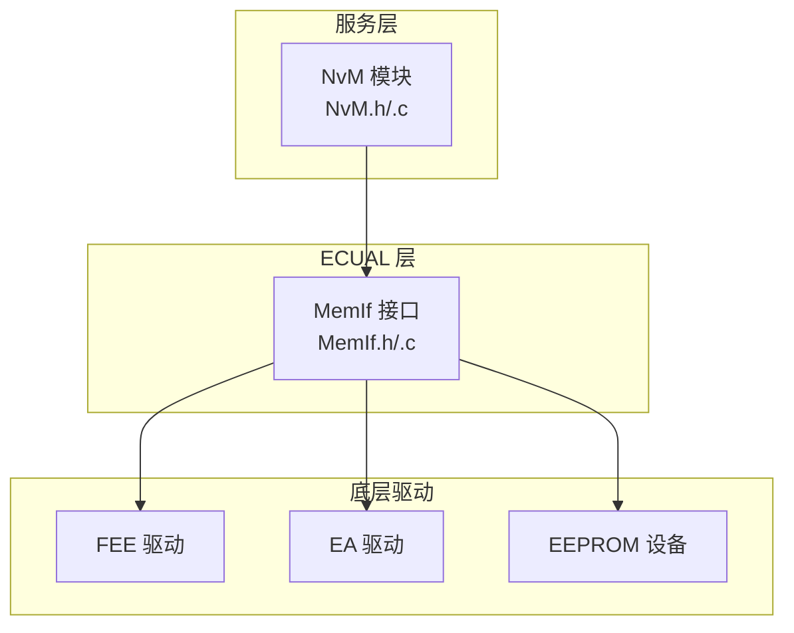
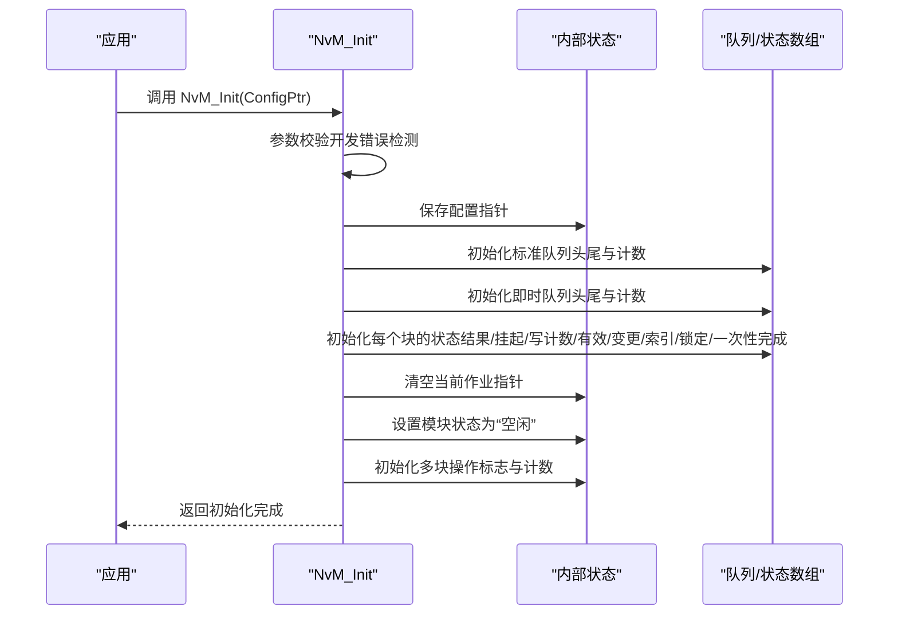
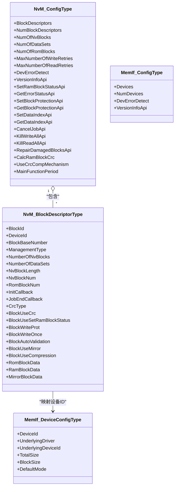

# 初始化与配置管理

<cite>
**本文引用的文件**
- [NvM.h](file://src/bsw/services/nvm/include/NvM.h)
- [NvM.c](file://src/bsw/services/nvm/src/NvM.c)
- [NvM_Cfg.h](file://src/bsw/services/nvm/include/NvM_Cfg.h)
- [NvM_Cfg.h（模板）](file://src/bsw/config/templates/NvM_Cfg.h)
- [NvM_test.c](file://src/bsw/services/nvm/src/NvM_test.c)
- [MemIf.h](file://src/bsw/ecual/memif/include/MemIf.h)
- [MemIf_Cfg.h](file://src/bsw/ecual/memif/include/MemIf_Cfg.h)
- [example_config.json](file://tools/rte_generator/example_config.json)
</cite>

## 目录
1. [引言](#引言)
2. [项目结构](#项目结构)
3. [核心组件](#核心组件)
4. [架构总览](#架构总览)
5. [详细组件分析](#详细组件分析)
6. [依赖关系分析](#依赖关系分析)
7. [性能考量](#性能考量)
8. [故障排查指南](#故障排查指南)
9. [结论](#结论)
10. [附录](#附录)

## 引言
本文件聚焦于NVRAM管理器（NvM）的初始化与配置管理，系统化阐述NvM_Init函数的初始化流程、配置参数验证、内存分配与模块状态设置；详解NvM_ConfigType配置结构体的字段语义与设置方法；说明不同存储设备的初始化策略与兼容性处理；文档化配置验证机制、错误检测与故障恢复流程；并给出配置文件生成、参数校验与初始化顺序的最佳实践及常见配置错误的排查方法。

## 项目结构
NvM位于BSW服务层，通过MemIf抽象访问底层存储驱动（如EEP/FEE/EA）。其配置由NvM_Cfg.h定义，运行时配置指针指向全局常量NvM_Config。单元测试在NvM_test.c中演示了初始化、队列调度与错误报告等行为。

图示来源
- [NvM.c:918-968](file://src/bsw/services/nvm/src/NvM.c#L918-L968)
- [MemIf.h:149](file://src/bsw/ecual/memif/include/MemIf.h#L149-L226)

章节来源
- [NvM.h:177-183](file://src/bsw/services/nvm/include/NvM.h#L177-L183)
- [NvM_Cfg.h:15-86](file://src/bsw/services/nvm/include/NvM_Cfg.h#L15-L86)
- [MemIf.h:109-126](file://src/bsw/ecual/memif/include/MemIf.h#L109-L126)

## 核心组件
- NvM_Init：模块初始化入口，负责配置指针保存、队列与状态初始化、模块状态置位。
- NvM_ConfigType：运行时配置结构体，包含块描述符数组、统计计数、重试次数、功能开关与主函数周期等。
- NvM_BlockDescriptorType：块级配置，描述块ID、设备ID、基地址、冗余/镜像/数据集策略、CRC类型与启用标志、ROM默认数据指针、RAM与镜像缓冲区等。
- MemIf：统一的存储接口，向上提供读写/擦除/失效等操作，向下适配不同底层驱动。

章节来源
- [NvM.h:149-172](file://src/bsw/services/nvm/include/NvM.h#L149-L172)
- [NvM.h:121-144](file://src/bsw/services/nvm/include/NvM.h#L121-L144)
- [NvM.c:918-968](file://src/bsw/services/nvm/src/NvM.c#L918-L968)
- [MemIf.h:109-126](file://src/bsw/ecual/memif/include/MemIf.h#L109-L126)

## 架构总览
NvM初始化阶段的关键流程如下：

图示来源
- [NvM.c:918-968](file://src/bsw/services/nvm/src/NvM.c#L918-L968)

章节来源
- [NvM.c:918-968](file://src/bsw/services/nvm/src/NvM.c#L918-L968)

## 详细组件分析

### NvM_Init 初始化流程与参数验证
- 参数校验
  - 开发错误检测开启时，若传入配置指针为空，上报NVM_E_PARAM_POINTER并返回。
- 配置指针保存
  - 将外部传入的配置指针保存到内部状态，供后续API使用。
- 队列初始化
  - 标准队列与即时队列的头、尾、计数清零。
- 块状态初始化
  - 遍历NVM_NUM_OF_NVRAM_BLOCKS，逐项初始化：
    - 最终结果、是否有挂起作业、写计数、数据有效性、数据变更标记、数据索引、块锁定、一次性写入完成标记。
- 当前作业与模块状态
  - 清空当前作业指针，设置模块状态为NVM_STATE_IDLE。
- 多块操作状态
  - 初始化ReadAll/WriteAll进行标志、取消请求标志与待处理计数。

章节来源
- [NvM.c:918-968](file://src/bsw/services/nvm/src/NvM.c#L918-L968)
- [NvM_Cfg.h:31-33](file://src/bsw/services/nvm/include/NvM_Cfg.h#L31-L33)

### NvM_ConfigType 配置结构体详解
- 关键字段与含义
  - BlockDescriptors：块描述符数组指针，用于描述所有NVRAM块的属性与内存布局。
  - NumBlockDescriptors：块描述符数量，决定遍历范围。
  - NumOfNvBlocks/NumOfDataSets/NumOfRomBlocks：统计信息，便于资源规划与批量操作。
  - MaxNumberOfWriteRetries/MaxNumberOfReadRetries：读写失败重试上限。
  - DevErrorDetect/各API使能开关：版本信息、RAM块状态设置、错误状态查询、保护/索引/取消/多块操作等API的可用性。
  - CalcRamBlockCrc/UseCrcCompMechanism：是否计算RAM块CRC、是否启用CRC一致性机制。
  - MainFunctionPeriod：主函数周期（毫秒），用于任务调度与节拍控制。
- 设置方法
  - 在NvM_Cfg.h中预编译宏定义各项参数，最终由NvM_Config在实现文件中实例化为全局常量，供NvM_Init读取。

章节来源
- [NvM.h:149-172](file://src/bsw/services/nvm/include/NvM.h#L149-L172)
- [NvM_Cfg.h:15-86](file://src/bsw/services/nvm/include/NvM_Cfg.h#L15-L86)
- [NvM_Cfg.h（模板）:20-91](file://src/bsw/config/templates/NvM_Cfg.h#L20-L91)

### NvM_BlockDescriptorType 块描述符详解
- 关键字段与含义
  - BlockId：块标识，唯一且非零。
  - DeviceId：所属存储设备ID，对应MemIf设备表。
  - BlockBaseNumber：块基地址（块号）。
  - ManagementType：块管理模式（原生/冗余/数据集）。
  - NumberOfNvBlocks/NumberOfDataSets：冗余副本数或数据集数量。
  - NvBlockLength/NvBlockNum/RomBlockNum：NV块长度、NV块数量、ROM块数量。
  - InitCallback/JobEndCallback：回调钩子。
  - CrcType/BlockUseCrc：CRC类型与是否启用CRC。
  - BlockWriteProt/BlockWriteOnce/BlockAutoValidation/BlockUseMirror/BlockUseCompression：写保护、一次性写入、自动校验、镜像、压缩等特性。
  - RomBlockData/RamBlockData/MirrorBlockData：ROM默认数据、RAM缓冲区、镜像缓冲区指针。
- 设置方法
  - 在NvM_Config中提供BlockDescriptors数组，按块逐一配置上述字段；确保DeviceId与MemIf设备表一致。

章节来源
- [NvM.h:121-144](file://src/bsw/services/nvm/include/NvM.h#L121-L144)
- [NvM_test.c:114-187](file://src/bsw/services/nvm/src/NvM_test.c#L114-L187)

### 不同存储设备的初始化策略与兼容性
- MemIf 抽象
  - NvM通过MemIf统一访问底层存储，支持多种驱动（如FEE、EA、EEP）。
  - MemIf_Config定义设备列表、默认模式、块大小限制等。
- 设备ID映射
  - NvM_BlockDescriptorType中的DeviceId需与MemIf_DeviceConfigType数组下标一致，或通过映射关系正确关联。
- 兼容性处理
  - 对于不支持的功能（如CRC、镜像、一次性写入），NvM在初始化后按配置启用相应逻辑；对不满足条件的操作（如写保护/一次性写入后再次写入）触发错误报告。

章节来源
- [MemIf.h:109-126](file://src/bsw/ecual/memif/include/MemIf.h#L109-L126)
- [MemIf_Cfg.h:39-47](file://src/bsw/ecual/memif/include/MemIf_Cfg.h#L39-L47)
- [NvM.h:121-144](file://src/bsw/services/nvm/include/NvM.h#L121-L144)

### 配置验证机制、错误检测与故障恢复
- 错误检测
  - 开发错误检测开启时，NvM_Init对空配置指针上报NVM_E_PARAM_POINTER；其他API对未初始化、参数非法、阻塞等情况上报相应错误码。
- 故障恢复
  - 读失败时可回退至ROM默认数据；写失败可重试至最大次数；CRC不一致时尝试冗余副本或回退ROM。
- 回调机制
  - 块级JobEndCallback在作业完成后被调用，便于上层感知。

章节来源
- [NvM.c:922-928](file://src/bsw/services/nvm/src/NvM.c#L922-L928)
- [NvM.c:424-448](file://src/bsw/services/nvm/src/NvM.c#L424-L448)
- [NvM.c:1865-1936](file://src/bsw/services/nvm/src/NvM.c#L1865-L1936)

### 初始化顺序与最佳实践
- 初始化顺序
  - 先配置MemIf（设备表、默认模式、块大小限制），再配置NvM（块描述符、统计计数、重试次数、功能开关），最后调用NvM_Init。
- 内存分配与缓冲区
  - 确保每个块的RamBlockData/MirrorBlockData/RomBlockData指针有效且大小满足NvBlockLength；冗余块应提供两份副本的缓冲区。
- 功能开关与性能
  - 合理设置MainFunctionPeriod与队列大小，避免过长的响应时间；CRC计算会增加CPU开销，按需启用。
- 批量操作
  - 使用ReadAll/WriteAll时注意多块操作标志与取消请求（KillReadAll/KillWriteAll）的配合。

章节来源
- [NvM.c:918-968](file://src/bsw/services/nvm/src/NvM.c#L918-L968)
- [NvM.c:2131-2222](file://src/bsw/services/nvm/src/NvM.c#L2131-L2222)

### 配置文件生成与参数校验
- 配置生成
  - 可参考NvM_Cfg.h（模板）生成初始配置，随后根据硬件平台与需求调整块数量、块大小、设备映射与功能开关。
- 参数校验
  - 单元测试覆盖了NvM_Init的空配置检测、读写队列成功入队、错误状态查询、主函数处理作业等场景，可作为参数校验的参考实现。

章节来源
- [NvM_Cfg.h（模板）:20-91](file://src/bsw/config/templates/NvM_Cfg.h#L20-L91)
- [NvM_test.c:240-263](file://src/bsw/services/nvm/src/NvM_test.c#L240-L263)
- [NvM_test.c:281-312](file://src/bsw/services/nvm/src/NvM_test.c#L281-L312)

## 依赖关系分析
NvM依赖MemIf进行存储访问，MemIf再依赖具体驱动（FEE/EA/EEP）。NvM的配置通过NvM_ConfigType与NvM_BlockDescriptorType描述块与设备映射关系。

图示来源
- [NvM.h:149-172](file://src/bsw/services/nvm/include/NvM.h#L149-L172)
- [NvM.h:121-144](file://src/bsw/services/nvm/include/NvM.h#L121-L144)
- [MemIf.h:121-126](file://src/bsw/ecual/memif/include/MemIf.h#L121-L126)
- [MemIf.h:109-116](file://src/bsw/ecual/memif/include/MemIf.h#L109-L116)

章节来源
- [NvM.h:149-172](file://src/bsw/services/nvm/include/NvM.h#L149-L172)
- [NvM.h:121-144](file://src/bsw/services/nvm/include/NvM.h#L121-L144)
- [MemIf.h:109-126](file://src/bsw/ecual/memif/include/MemIf.h#L109-L126)

## 性能考量
- 主函数周期与队列容量
  - MainFunctionPeriod影响批处理与重试节奏；队列大小影响并发度与延迟。
- CRC计算
  - 启用CalcRamBlockCrc会增加CPU与内存带宽消耗，建议仅在关键数据启用。
- 冗余与镜像
  - 冗余写入需要两次I/O，提升可靠性但降低吞吐；镜像策略需权衡空间与性能。
- 批量操作
  - ReadAll/WriteAll在启动/关机时使用，应结合系统负载与实时性要求合理安排。

## 故障排查指南
- 常见错误与定位
  - NVM_E_NOT_INITIALIZED：在未调用NvM_Init的情况下调用API。
  - NVM_E_PARAM_POINTER：NvM_Init传入空配置指针。
  - NVM_E_PARAM_BLOCK_ID：块ID无效或超出范围。
  - NVM_E_BLOCK_PENDING：同一块已有挂起作业。
  - NVM_E_WRITE_PROTECTED：块处于写保护/一次性写入已执行状态。
- 排查步骤
  - 确认NvM_Init已成功调用且无DET上报。
  - 检查块ID是否在有效范围内，且存在于BlockDescriptors中。
  - 核对设备ID与MemIf设备表一致，底层驱动正常。
  - 若启用CRC，检查数据完整性与冗余副本可用性。
  - 使用GetErrorStatus查询块最近结果，结合JobEndCallback确认回调是否触发。
- 单元测试参考
  - 可参考NvM_test.c中的测试用例，验证初始化、读写队列、错误状态与主函数处理等行为。

章节来源
- [NvM.c:981-1031](file://src/bsw/services/nvm/src/NvM.c#L981-L1031)
- [NvM_test.c:240-263](file://src/bsw/services/nvm/src/NvM_test.c#L240-L263)
- [NvM_test.c:281-312](file://src/bsw/services/nvm/src/NvM_test.c#L281-L312)

## 结论
NvM初始化流程简洁明确：先进行参数校验，再保存配置、初始化队列与块状态、设置模块状态。通过NvM_ConfigType与NvM_BlockDescriptorType，NvM实现了对多设备、多块策略（原生/冗余/数据集）的统一管理。结合MemIf抽象，NvM具备良好的设备兼容性与可扩展性。建议在实际工程中严格遵循初始化顺序、合理配置功能开关与队列容量，并利用单元测试与错误状态监控保障系统稳定性。

## 附录
- 配置生成建议
  - 以NvM_Cfg.h（模板）为基础，逐步完善块描述符、设备映射与功能开关；在集成阶段进行端到端测试。
- 示例配置参考
  - 可参考rte_generator的example_config.json中关于NvBlock的配置方式，理解块ID与数据元素的映射关系。

章节来源
- [NvM_Cfg.h（模板）:20-91](file://src/bsw/config/templates/NvM_Cfg.h#L20-L91)
- [example_config.json:32-54](file://tools/rte_generator/example_config.json#L32-L54)