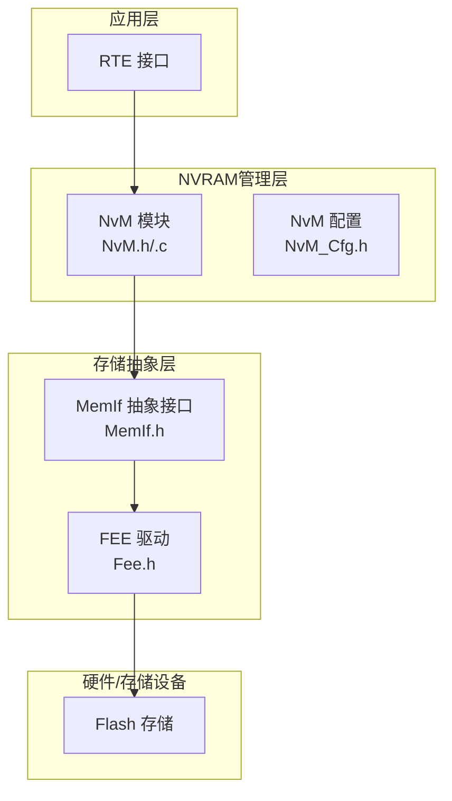
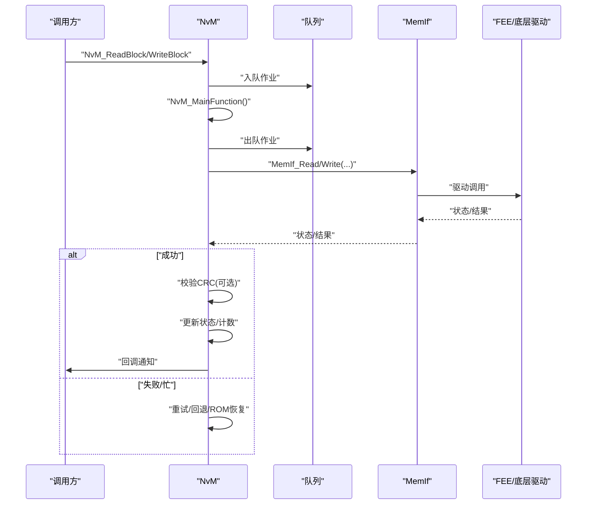
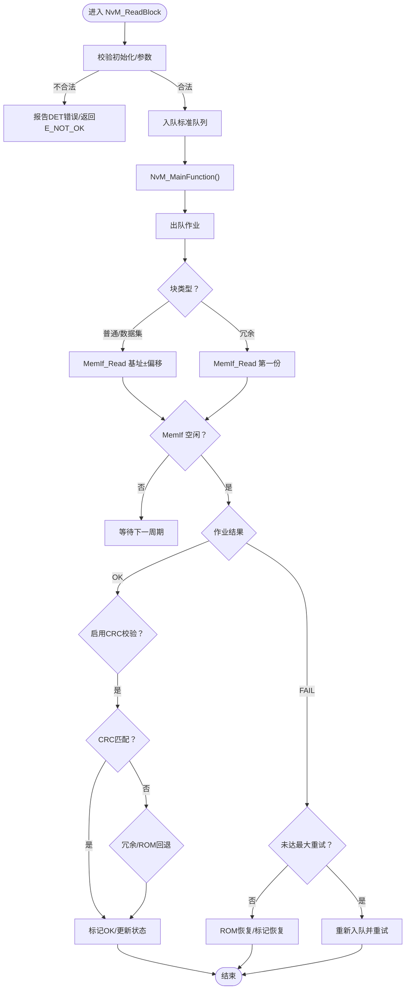
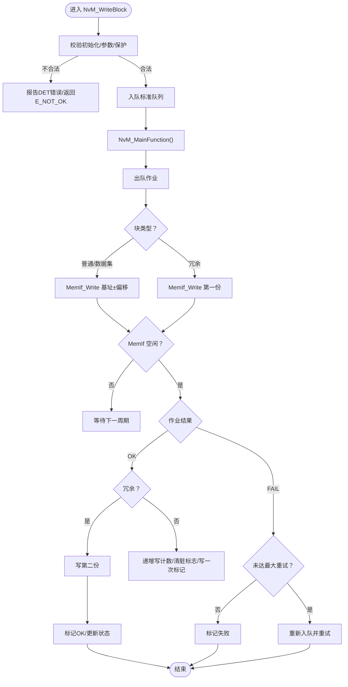
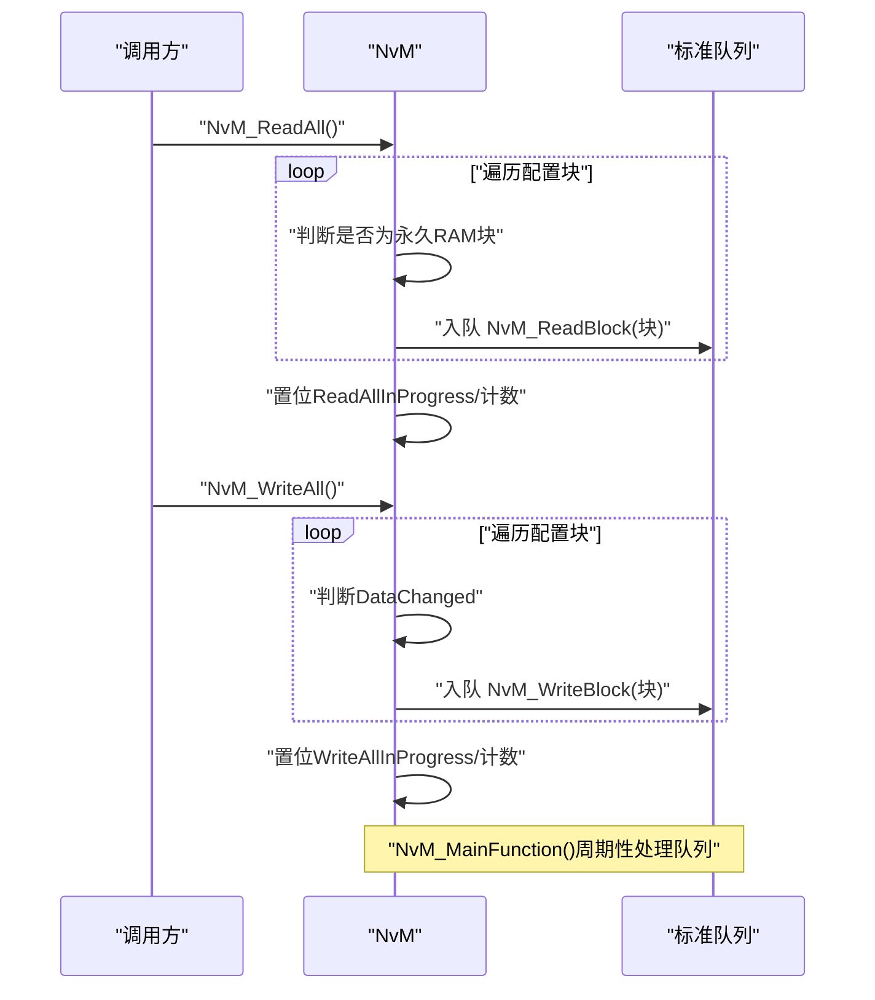
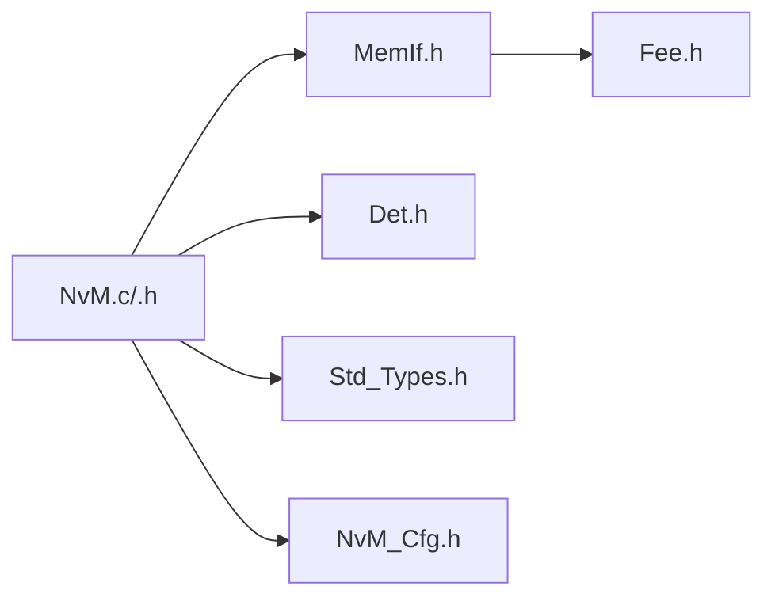

# 数据读写操作

<cite>
**本文引用的文件列表**
- [NvM.h](file://src/bsw/services/nvm/include/NvM.h)
- [NvM.c](file://src/bsw/services/nvm/src/NvM.c)
- [NvM_Cfg.h](file://src/bsw/services/nvm/include/NvM_Cfg.h)
- [NvM_test.c](file://src/bsw/services/nvm/src/NvM_test.c)
- [MemIf.h](file://src/bsw/ecual/memif/include/MemIf.h)
- [Fee.h](file://src/bsw/ecual/fee/include/Fee.h)
- [Det.h](file://src/bsw/services/det/include/Det.h)
- [Std_Types.h](file://src/bsw/os/include/Std_Types.h)
</cite>

## 目录
1. [简介](#简介)
2. [项目结构](#项目结构)
3. [核心组件](#核心组件)
4. [架构总览](#架构总览)
5. [详细组件分析](#详细组件分析)
6. [依赖关系分析](#依赖关系分析)
7. [性能考量](#性能考量)
8. [故障排查指南](#故障排查指南)
9. [结论](#结论)
10. [附录](#附录)

## 简介
本文件面向NVRAM管理器（NvM）的数据读写操作，围绕NvM_ReadBlock与NvM_WriteBlock两大核心接口，系统性阐述其在不同存储块类型（普通块、镜像块、数据集块）下的实现机制，覆盖数据完整性校验（CRC）、错误恢复策略、批量读写（ReadAll/WriteAll）的调度与性能优化、数据索引管理与默认值恢复、异步作业处理与回调机制、以及状态查询与并发访问控制等关键主题。文档同时给出基于源码的流程图与类图，帮助读者快速建立对模块内部工作原理的理解。

## 项目结构
NvM位于BSW服务层，向上为RTE提供接口，向下通过MemIf抽象访问底层存储驱动（如FEE/Ea）。配置由NvM_Cfg.h定义，运行时状态与队列在NvM.c中维护。

图表来源
- [NvM.h:188-352](file://src/bsw/services/nvm/include/NvM.h#L188-L352)
- [NvM.c:1687-2125](file://src/bsw/services/nvm/src/NvM.c#L1687-L2125)
- [MemIf.h:140-229](file://src/bsw/ecual/memif/include/MemIf.h#L140-L229)
- [Fee.h:160-272](file://src/bsw/ecual/fee/include/Fee.h#L160-L272)

章节来源
- [NvM.h:1-355](file://src/bsw/services/nvm/include/NvM.h#L1-L355)
- [NvM.c:1-2368](file://src/bsw/services/nvm/src/NvM.c#L1-L2368)
- [NvM_Cfg.h:1-88](file://src/bsw/services/nvm/include/NvM_Cfg.h#L1-L88)

## 核心组件
- NvM模块：负责任务排队、状态机推进、CRC校验、重试与回退策略、回调通知、批量操作调度。
- MemIf抽象：统一读写/擦除/失效等操作接口，屏蔽底层驱动差异。
- Fee驱动：提供Flash仿真EEPROM能力，支持状态查询与作业结果获取。
- 配置与描述符：NvM_ConfigType/NvM_BlockDescriptorType描述块属性、CRC策略、镜像/数据集管理等。

章节来源
- [NvM.h:149-172](file://src/bsw/services/nvm/include/NvM.h#L149-L172)
- [NvM.h:121-144](file://src/bsw/services/nvm/include/NvM.h#L121-L144)
- [MemIf.h:108-126](file://src/bsw/ecual/memif/include/MemIf.h#L108-L126)
- [Fee.h:129-147](file://src/bsw/ecual/fee/include/Fee.h#L129-L147)

## 架构总览
NvM采用“请求入队+主函数周期处理”的异步模型：
- 请求阶段：NvM_ReadBlock/NvM_WriteBlock将作业推入标准队列；立即优先级作业（如默认值恢复）进入即时队列。
- 执行阶段：NvM_MainFunction轮询队列，调用MemIf执行具体I/O；根据MemIf状态与结果推进状态机，必要时重试或回退到冗余拷贝或ROM默认值。
- 完成阶段：更新块状态（LastResult、DataChanged、WriteCounter等），触发JobEndCallback，释放当前作业。

图表来源
- [NvM.c:1687-2125](file://src/bsw/services/nvm/src/NvM.c#L1687-L2125)
- [NvM.c:1817-2047](file://src/bsw/services/nvm/src/NvM.c#L1817-L2047)
- [MemIf.h:150-213](file://src/bsw/ecual/memif/include/MemIf.h#L150-L213)
- [Fee.h:166-228](file://src/bsw/ecual/fee/include/Fee.h#L166-L228)

## 详细组件分析

### NvM_ReadBlock 实现机制
- 入队与参数校验：检查初始化状态、目标指针与块ID有效性；若无挂起作业则将读作业推入标准队列。
- 作业执行：NvM_MainFunction取出作业后，依据块类型选择读取路径：
  - 普通块：直接按基地址+偏移读取。
  - 数据集块：按当前DataIndex计算实际块号。
  - 冗余块：先读第一份，若失败尝试第二份，否则回退至ROM默认值。
- 完成与校验：MemIf空闲后获取作业结果；若为读作业且启用RAM块CRC，则对数据进行CRC校验；校验失败时按冗余策略或ROM恢复；成功则标记DataValid并更新LastResult。

图表来源
- [NvM.c:976-1032](file://src/bsw/services/nvm/src/NvM.c#L976-L1032)
- [NvM.c:507-568](file://src/bsw/services/nvm/src/NvM.c#L507-L568)
- [NvM.c:1817-2047](file://src/bsw/services/nvm/src/NvM.c#L1817-L2047)

章节来源
- [NvM.c:976-1032](file://src/bsw/services/nvm/src/NvM.c#L976-L1032)
- [NvM.c:507-568](file://src/bsw/services/nvm/src/NvM.c#L507-L568)
- [NvM.c:1863-1936](file://src/bsw/services/nvm/src/NvM.c#L1863-L1936)

### NvM_WriteBlock 实现机制
- 入队与保护检查：校验初始化、源指针与块ID；检查写保护（写保护位、写一次位、锁定状态）；若无挂起作业则入队。
- 作业执行：依据块类型决定写入路径：
  - 普通/数据集：按基地址+偏移写入；若启用CRC则在缓冲区尾部附加CRC。
  - 冗余：先写第一份，成功后再写第二份作为备份。
- 完成与计数：写成功后递增WriteCounter，清除DataChanged；若为写一次块，设置WriteOnceDone；失败则按最大重试次数回退，最终失败时记录LastResult。

图表来源
- [NvM.c:1040-1116](file://src/bsw/services/nvm/src/NvM.c#L1040-L1116)
- [NvM.c:649-731](file://src/bsw/services/nvm/src/NvM.c#L649-L731)
- [NvM.c:1938-1966](file://src/bsw/services/nvm/src/NvM.c#L1938-L1966)

章节来源
- [NvM.c:1040-1116](file://src/bsw/services/nvm/src/NvM.c#L1040-L1116)
- [NvM.c:649-731](file://src/bsw/services/nvm/src/NvM.c#L649-L731)
- [NvM.c:1940-1966](file://src/bsw/services/nvm/src/NvM.c#L1940-L1966)

### 数据完整性检查、CRC校验与错误恢复
- CRC策略：支持NVM_CRC_NONE/8/16/32；启用RAM块CRC时，读取完成后从数据尾部提取存储CRC并与计算值比较；不匹配时尝试冗余副本或回退ROM默认值。
- 错误恢复：读失败且未达最大重试时重试；超过重试上限则回退ROM默认值；写失败同样重试，冗余写失败则直接标记失败。
- 回调通知：作业完成后调用Block的JobEndCallback，便于上层感知完成事件。

章节来源
- [NvM.c:1865-1936](file://src/bsw/services/nvm/src/NvM.c#L1865-L1936)
- [NvM.c:1903-1928](file://src/bsw/services/nvm/src/NvM.c#L1903-L1928)
- [NvM.c:438-448](file://src/bsw/services/nvm/src/NvM.c#L438-L448)

### 不同类型存储块的读写策略
- 普通块（Native）：直接按基地址读写，可选CRC校验。
- 镜像块（Redundant）：双副本写入与读取，失败自动回退到另一份；写成功后才认为完成。
- 数据集块（Dataset）：通过NvM_SetDataIndex切换当前数据集索引，后续读写均作用于该索引对应的块位置。

章节来源
- [NvM.h:97-101](file://src/bsw/services/nvm/include/NvM.h#L97-L101)
- [NvM.c:520-540](file://src/bsw/services/nvm/src/NvM.c#L520-L540)
- [NvM.c:663-677](file://src/bsw/services/nvm/src/NvM.c#L663-L677)
- [NvM.c:1188-1234](file://src/bsw/services/nvm/src/NvM.c#L1188-L1234)

### 批量操作：NvM_ReadAll 与 NvM_WriteAll
- NvM_ReadAll：遍历所有配置块，仅对具备RamBlockData的永久RAM块发起读请求，累计待完成计数，置位ReadAllInProgress。
- NvM_WriteAll：遍历所有配置块，仅对DataChanged为TRUE的永久RAM块发起写请求，累计待完成计数，置位WriteAllInProgress。
- 终止控制：NvM_KillReadAll/NvM_KillWriteAll通过标志位在下个主函数周期清理对应队列中的作业并复位状态。

图表来源
- [NvM.c:2131-2173](file://src/bsw/services/nvm/src/NvM.c#L2131-L2173)
- [NvM.c:2179-2222](file://src/bsw/services/nvm/src/NvM.c#L2179-L2222)
- [NvM.c:1697-1773](file://src/bsw/services/nvm/src/NvM.c#L1697-L1773)

章节来源
- [NvM.c:2131-2173](file://src/bsw/services/nvm/src/NvM.c#L2131-L2173)
- [NvM.c:2179-2222](file://src/bsw/services/nvm/src/NvM.c#L2179-L2222)
- [NvM.c:1697-1773](file://src/bsw/services/nvm/src/NvM.c#L1697-L1773)

### 数据索引管理、数据集切换与默认值恢复
- 数据集切换：NvM_SetDataIndex仅对数据集块有效，校验DataIndex范围后更新块状态中的DataIndex。
- 默认值恢复：NvM_RestoreBlockDefaults将ROM默认数据复制到RAM缓冲区，使用即时队列确保高优先级处理，完成后更新LastResult。

章节来源
- [NvM.c:1188-1234](file://src/bsw/services/nvm/src/NvM.c#L1188-L1234)
- [NvM.c:1124-1180](file://src/bsw/services/nvm/src/NvM.c#L1124-L1180)
- [NvM.c:424-433](file://src/bsw/services/nvm/src/NvM.c#L424-L433)

### 异步操作处理、回调函数机制与状态查询
- 异步处理：所有I/O通过MemIf异步执行；NvM_MainFunction轮询MemIf状态，驱动状态机前进。
- 回调机制：每个块可配置JobEndCallback，在作业完成后被调用。
- 状态查询：NvM_GetErrorStatus返回块的最近一次结果；多块请求ID使用特殊ID返回OK。

章节来源
- [NvM.c:1687-2125](file://src/bsw/services/nvm/src/NvM.c#L1687-L2125)
- [NvM.c:438-448](file://src/bsw/services/nvm/src/NvM.c#L438-L448)
- [NvM.c:1492-1531](file://src/bsw/services/nvm/src/NvM.c#L1492-L1531)

### 并发访问控制与一致性保证
- 互斥与队列：通过标准队列与即时队列隔离，避免同一时间多个作业竞争同一设备；当前作业完成后才释放CurrentJob。
- 一致性：写一次块通过WriteOnceDone防止重复写；冗余块写成功后才认为完成；CRC校验确保读取数据完整性。
- 锁定与保护：支持运行时设置块锁定与写保护，阻止写操作；取消作业接口用于清理队列。

章节来源
- [NvM.c:1288-1313](file://src/bsw/services/nvm/src/NvM.c#L1288-L1313)
- [NvM.c:1321-1348](file://src/bsw/services/nvm/src/NvM.c#L1321-L1348)
- [NvM.c:2301-2344](file://src/bsw/services/nvm/src/NvM.c#L2301-L2344)

## 依赖关系分析
- 模块内聚：NvM集中管理作业、状态、重试与回退逻辑，耦合度低。
- 外部依赖：依赖MemIf抽象接口与底层FEE/Ea驱动；错误检测通过DET上报。
- 配置驱动：块类型、CRC策略、队列大小、重试次数等均由NvM_Cfg.h配置。

图表来源
- [NvM.c:19-22](file://src/bsw/services/nvm/src/NvM.c#L19-L22)
- [MemIf.h:14-21](file://src/bsw/ecual/memif/include/MemIf.h#L14-L21)
- [Fee.h:14-21](file://src/bsw/ecual/fee/include/Fee.h#L14-L21)
- [Det.h:14-17](file://src/bsw/services/det/include/Det.h#L14-L17)
- [Std_Types.h:14-18](file://src/bsw/os/include/Std_Types.h#L14-L18)
- [NvM_Cfg.h:1-88](file://src/bsw/services/nvm/include/NvM_Cfg.h#L1-L88)

章节来源
- [NvM.c:19-22](file://src/bsw/services/nvm/src/NvM.c#L19-L22)
- [MemIf.h:14-21](file://src/bsw/ecual/memif/include/MemIf.h#L14-L21)
- [Fee.h:14-21](file://src/bsw/ecual/fee/include/Fee.h#L14-L21)

## 性能考量
- 队列容量与优先级：标准队列16项、即时队列4项，兼顾吞吐与实时性。
- 重试策略：读写最大重试次数均为3次，平衡可靠性与延迟。
- CRC开销：启用RAM块CRC会增加CPU与带宽消耗，建议按需求开启。
- 批量操作：ReadAll/WriteAll减少多次调用开销，但需注意队列压力与设备繁忙状态。

章节来源
- [NvM_Cfg.h:79-80](file://src/bsw/services/nvm/include/NvM_Cfg.h#L79-L80)
- [NvM_Cfg.h:62-63](file://src/bsw/services/nvm/include/NvM_Cfg.h#L62-L63)
- [NvM_Cfg.h:68-69](file://src/bsw/services/nvm/include/NvM_Cfg.h#L68-L69)

## 故障排查指南
- 初始化错误：未初始化调用相关API会触发DET错误码NVM_E_NOT_INITIALIZED。
- 参数错误：空指针、无效块ID、越界数据索引等触发DET错误码。
- 设备忙/异常：MemIf状态非空闲时重试；异常状态按最大重试处理。
- 读失败回退：若启用CRC且不匹配，优先尝试冗余副本，再回退ROM默认值。
- 写失败：冗余写失败直接标记失败；写一次块重复写会被拒绝。

章节来源
- [NvM.c:981-1029](file://src/bsw/services/nvm/src/NvM.c#L981-L1029)
- [NvM.c:1046-1113](file://src/bsw/services/nvm/src/NvM.c#L1046-L1113)
- [NvM.c:1976-2034](file://src/bsw/services/nvm/src/NvM.c#L1976-L2034)
- [NvM.c:2050-2106](file://src/bsw/services/nvm/src/NvM.c#L2050-L2106)

## 结论
NvM通过清晰的状态机与队列机制，实现了对多种存储块类型的统一管理；结合CRC校验与冗余/ROM回退策略，显著提升了数据完整性与系统鲁棒性；批量操作与回调机制满足了启动恢复与关机刷新等典型场景。建议在生产环境中合理配置CRC与重试参数，并充分利用数据集切换与写一次保护功能，以获得更好的可靠性与性能平衡。

## 附录
- 关键API与职责概览
  - NvM_ReadBlock/NvM_WriteBlock：提交单块读写请求。
  - NvM_ReadAll/NvM_WriteAll：批量读写永久RAM块。
  - NvM_SetDataIndex：切换数据集索引。
  - NvM_RestoreBlockDefaults：从ROM恢复默认值。
  - NvM_GetErrorStatus/NvM_SetRamBlockStatus：状态查询与脏标志设置。
  - NvM_MainFunction：周期性处理队列与设备状态。
  - NvM_KillReadAll/NvM_KillWriteAll：终止批量操作。

章节来源
- [NvM.h:191-349](file://src/bsw/services/nvm/include/NvM.h#L191-L349)
- [NvM.c:2131-2222](file://src/bsw/services/nvm/src/NvM.c#L2131-L2222)
- [NvM.c:1188-1234](file://src/bsw/services/nvm/src/NvM.c#L1188-L1234)
- [NvM.c:1492-1531](file://src/bsw/services/nvm/src/NvM.c#L1492-L1531)
- [NvM.c:1687-2125](file://src/bsw/services/nvm/src/NvM.c#L1687-L2125)
- [NvM.c:2349-2360](file://src/bsw/services/nvm/src/NvM.c#L2349-L2360)