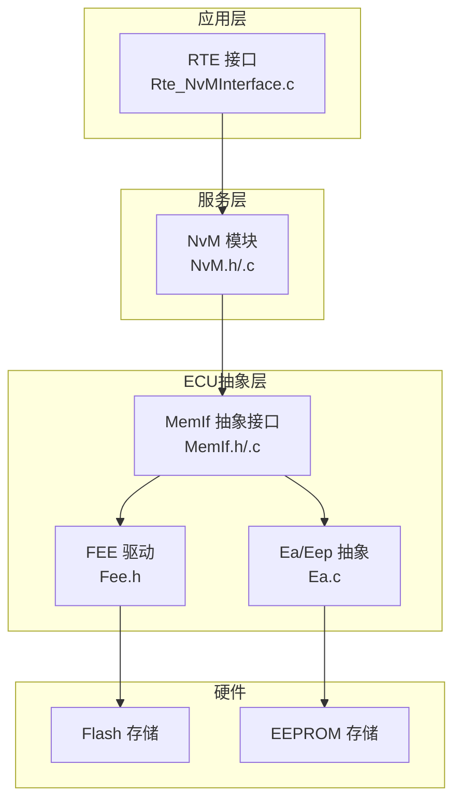
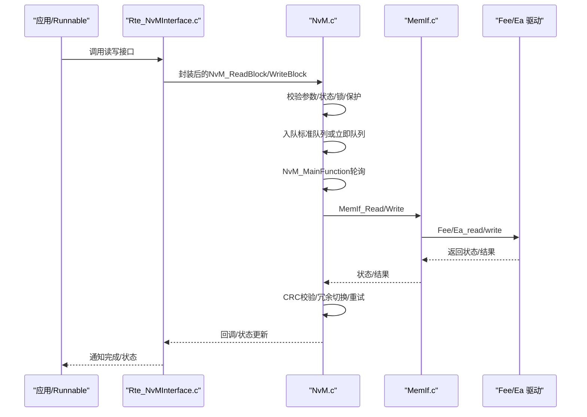
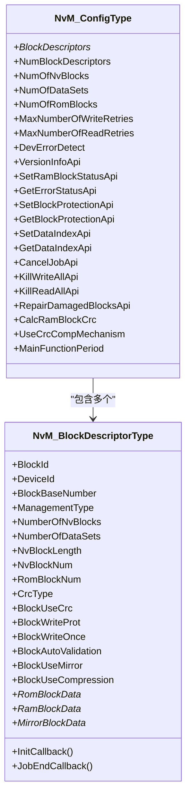
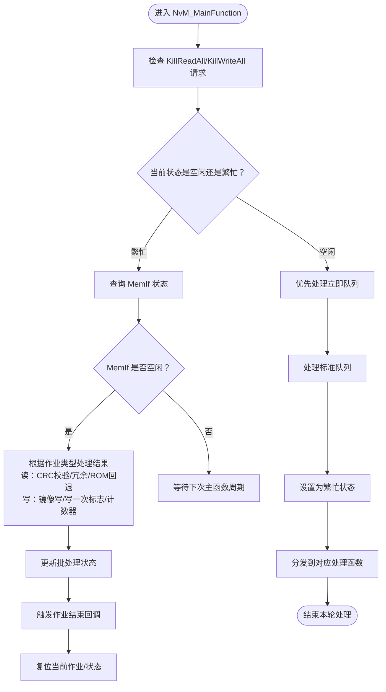
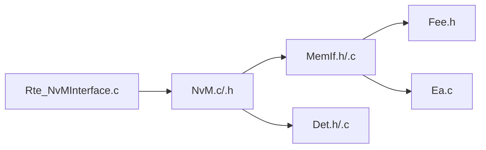

# 核心概念与架构

<cite>
**本文引用的文件**
- [NvM.h](file://src/bsw/services/nvm/include/NvM.h)
- [NvM.c](file://src/bsw/services/nvm/src/NvM.c)
- [NvM_Cfg.h](file://src/bsw/services/nvm/include/NvM_Cfg.h)
- [NvM_Cfg.h（模板）](file://src/bsw/config/templates/NvM_Cfg.h)
- [NvM_spec.md](file://openspec/changes/dev-nvm-enhancement/specs/NvM_spec.md)
- [MemIf.h](file://src/bsw/ecual/memif/include/MemIf.h)
- [MemIf.c](file://src/bsw/ecual/memif/src/MemIf.c)
- [Det.h](file://src/bsw/common/Det.h)
- [Det.c](file://src/bsw/common/Det.c)
- [Rte_NvMInterface.c](file://src/bsw/rte/src/Rte_NvMInterface.c)
- [Fee.h](file://src/bsw/ecual/fee/include/Fee.h)
- [Ea.c](file://src/bsw/ecual/ea/src/Ea.c)
</cite>

## 目录
1. [引言](#引言)
2. [项目结构](#项目结构)
3. [核心组件](#核心组件)
4. [架构总览](#架构总览)
5. [详细组件分析](#详细组件分析)
6. [依赖关系分析](#依赖关系分析)
7. [性能考虑](#性能考虑)
8. [故障排查指南](#故障排查指南)
9. [结论](#结论)
10. [附录](#附录)

## 引言
本文件面向NVRAM管理器（NvM）模块，系统化阐述其在AutoSAR经典平台中的定位、分层设计理念、数据持久化机制与存储层次结构，并深入解析主要数据结构（如NvM_BlockDescriptorType、NvM_ConfigType）的设计思路与字段含义。文档同时覆盖存储设备管理、块管理策略（原生、冗余、数据集）、错误处理与重试机制，以及与上层RTE、下层MemIf等模块的交互关系。

## 项目结构
NvM位于BSW服务层，向上通过RTE提供统一接口，向下通过MemIf抽象访问底层存储驱动（如Fee、Ea/Eep）。配置参数由NvM_Cfg.h定义，规格说明见NvM_spec.md。

图示来源
- [Rte_NvMInterface.c:361-371](file://src/bsw/rte/src/Rte_NvMInterface.c#L361-L371)
- [NvM.c:1687-1688](file://src/bsw/services/nvm/src/NvM.c#L1687-L1688)
- [MemIf.h:145-226](file://src/bsw/ecual/memif/include/MemIf.h#L145-L226)
- [Fee.h:166-185](file://src/bsw/ecual/fee/include/Fee.h#L166-L185)
- [Ea.c:1-47](file://src/bsw/ecual/ea/src/Ea.c#L1-L47)

章节来源
- [NvM.h:1-355](file://src/bsw/services/nvm/include/NvM.h#L1-L355)
- [NvM.c:1-2368](file://src/bsw/services/nvm/src/NvM.c#L1-L2368)
- [NvM_Cfg.h:1-88](file://src/bsw/services/nvm/include/NvM_Cfg.h#L1-L88)
- [NvM_spec.md:1-389](file://openspec/changes/dev-nvm-enhancement/specs/NvM_spec.md#L1-L389)

## 核心组件
- 数据类型与API
  - 请求结果类型：NvM_RequestResultType，涵盖成功、挂起、完整性失败、块跳过、NV失效、取消、冗余失败、从ROM恢复、恢复默认等状态。
  - 块管理类型：NvM_BlockManagementType，支持原生（Native）、冗余（Redundant）、数据集（Dataset）三种模式。
  - CRC类型：NvM_BlockCrcType，支持无CRC、8位、16位、32位CRC。
  - 块标识类型：NvM_BlockIdType，使用16位整型。
- 主要数据结构
  - NvM_BlockDescriptorType：描述单个块的元信息，包括块ID、设备ID、基地址、管理类型、NV块数量、数据集数量、块长度、NV块数、ROM块号、回调函数指针、CRC类型与开关、写保护、写一次保护、自动校验、镜像使用、压缩使用、ROM默认数据指针、RAM永久块指针、镜像块指针等。
  - NvM_ConfigType：全局配置，包含块描述符数组、块描述符数量、NV块总数、数据集总数、ROM块总数、最大写重试次数、最大读重试次数、开发错误检测开关、版本信息API开关、RAM块状态设置API开关、错误状态查询API开关、块保护控制API开关、数据索引设置/获取API开关、作业取消API开关、批量写/读终止API开关、损坏块修复API开关、RAM块CRC计算开关、CRC对比机制开关、主函数周期等。
- 关键API
  - 生命周期：NvM_Init、NvM_MainFunction、NvM_GetVersionInfo。
  - 单块操作：NvM_ReadBlock、NvM_WriteBlock、NvM_RestoreBlockDefaults、NvM_EraseNvBlock、NvM_InvalidateNvBlock。
  - 系统级：NvM_ReadAll、NvM_WriteAll、NvM_ReadPRAMBlock、NvM_WritePRAMBlock。
  - 状态控制：NvM_GetErrorStatus、NvM_SetRamBlockStatus、NvM_SetDataIndex、NvM_CancelJobs。
  - 保护控制：NvM_SetBlockLockStatus、NvM_SetBlockProtection、NvM_SetWriteOnceStatus。
  - 终止控制：NvM_KillWriteAll、NvM_KillReadAll。

章节来源
- [NvM.h:81-172](file://src/bsw/services/nvm/include/NvM.h#L81-L172)
- [NvM_spec.md:111-204](file://openspec/changes/dev-nvm-enhancement/specs/NvM_spec.md#L111-L204)

## 架构总览
NvM采用分层架构：
- 应用接口层：RTE通过Rte_NvMInterface.c封装NvM调用，提供端口映射与作业队列。
- 服务层：NvM负责块管理、作业调度、CRC校验、冗余恢复、写一次保护、多块批处理等。
- 抽象接口层：MemIf屏蔽底层不同存储介质差异（Flash、EEPROM），向上提供统一读写接口。
- 设备驱动层：Fee（Flash仿真）与Ea/Eep（EEPROM抽象）实现具体存储访问。

图示来源
- [Rte_NvMInterface.c:173-210](file://src/bsw/rte/src/Rte_NvMInterface.c#L173-L210)
- [NvM.c:1687-2125](file://src/bsw/services/nvm/src/NvM.c#L1687-L2125)
- [MemIf.h:160-213](file://src/bsw/ecual/memif/include/MemIf.h#L160-L213)

章节来源
- [NvM_spec.md:366-381](file://openspec/changes/dev-nvm-enhancement/specs/NvM_spec.md#L366-L381)
- [MemIf.h:145-226](file://src/bsw/ecual/memif/include/MemIf.h#L145-L226)

## 详细组件分析

### 数据结构设计与字段含义
- NvM_BlockDescriptorType
  - 用途：描述单个块的元信息，用于NvM内部识别块、选择设备、计算地址、启用CRC与保护策略。
  - 关键字段
    - BlockId：块唯一标识。
    - DeviceId：所属存储设备（MemIf设备索引）。
    - BlockBaseNumber：块基地址（块号）。
    - ManagementType：块管理模式（原生/冗余/数据集）。
    - NumberOfNvBlocks/NumberOfDataSets：冗余副本数或数据集数。
    - NvBlockLength：块大小（字节）。
    - NvBlockNum/RomBlockNum：NV块数/ROM块数。
    - InitCallback/JobEndCallback：初始化/作业结束回调。
    - CrcType/BlockUseCrc：CRC类型与是否启用CRC。
    - BlockWriteProt/BlockWriteOnce/BlockAutoValidation：写保护、写一次保护、自动校验。
    - BlockUseMirror/BlockUseCompression：镜像与压缩使用标记。
    - RomBlockData/RamBlockData/MirrorBlockData：ROM默认数据、RAM永久块、镜像块指针。
- NvM_ConfigType
  - 用途：全局配置入口，集中定义块描述符、统计计数、重试上限、功能开关、主函数周期等。
  - 关键字段
    - BlockDescriptors/NumBlockDescriptors：块描述符数组与数量。
    - NumOfNvBlocks/NumOfDataSets/NumOfRomBlocks：统计计数。
    - MaxNumberOfWriteRetries/MaxNumberOfReadRetries：读写最大重试次数。
    - DevErrorDetect/各API开关：功能使能与开发错误检测。
    - CalcRamBlockCrc/UseCrcCompMechanism：RAM块CRC计算与CRC对比机制。
    - MainFunctionPeriod：主函数周期（毫秒）。

图示来源
- [NvM.h:121-172](file://src/bsw/services/nvm/include/NvM.h#L121-L172)

章节来源
- [NvM.h:121-172](file://src/bsw/services/nvm/include/NvM.h#L121-L172)
- [NvM_spec.md:149-204](file://openspec/changes/dev-nvm-enhancement/specs/NvM_spec.md#L149-L204)

### 分层设计理念与数据流
- 硬件抽象层（MemIf）
  - 提供统一的读写接口（MemIf_Read/Write），屏蔽底层差异（Flash或EEPROM）。
  - 支持取消、状态查询、作业结果查询、擦除与失效等操作。
- 服务层（NvM）
  - 以块为单位进行管理，支持原生、冗余、数据集三类块。
  - 通过标准队列与立即队列实现异步作业调度；主函数周期性轮询底层状态，推进作业完成。
  - 在读路径执行CRC校验与冗余切换；在写路径支持写一次保护与镜像写入。
- 应用接口层（RTE）
  - 通过Rte_NvMInterface.c对NvM进行封装，提供端口映射、作业排队与回调通知。
  - 在主函数中协调RTE作业队列与NvM主函数。

图示来源
- [NvM.c:1687-2125](file://src/bsw/services/nvm/src/NvM.c#L1687-L2125)

章节来源
- [NvM.c:1687-2125](file://src/bsw/services/nvm/src/NvM.c#L1687-L2125)
- [MemIf.h:160-213](file://src/bsw/ecual/memif/include/MemIf.h#L160-L213)

### 块管理策略
- 原生块（Native）
  - 单一NV块+单一RAM镜像，最简单高效。
- 冗余块（Redundant）
  - 两个NV块（主/备）存储相同数据，读时自动容错，写时双副本写入。
- 数据集块（Dataset）
  - 多个数据集共享同一RAM块，通过数据索引切换不同NV存储区域。

章节来源
- [NvM_spec.md:28-51](file://openspec/changes/dev-nvm-enhancement/specs/NvM_spec.md#L28-L51)

### 错误处理与重试机制
- 开发错误检测（DET）
  - 当NVM_DEV_ERROR_DETECT开启时，NvM在关键API入口进行参数校验与状态检查，并通过Det_ReportError上报错误码。
- 重试策略
  - 读/写分别配置最大重试次数；当底层返回失败且未达上限，NvM会重新提交作业。
- 完整性保护
  - 读取后若CRC不匹配，优先尝试冗余副本；若仍失败则从ROM默认数据恢复。
- 写一次保护
  - 首次写成功后置位写一次标志，后续写请求直接拒绝。

章节来源
- [NvM.h:67-77](file://src/bsw/services/nvm/include/NvM.h#L67-L77)
- [NvM.c:1976-2034](file://src/bsw/services/nvm/src/NvM.c#L1976-L2034)
- [NvM_spec.md:208-233](file://openspec/changes/dev-nvm-enhancement/specs/NvM_spec.md#L208-L233)

### 与AutoSAR模块的交互
- 上层模块
  - RTE：通过Rte_NvMInterface.c桥接，提供端口映射与作业队列。
  - Dcm/Dem：通过NvM实现数据持久化与故障记忆。
- 下层模块
  - MemIf：统一抽象Flash/EEPROM访问。
  - Fee/Ea：底层驱动实现具体存储介质操作。
- 公共模块
  - Det：开发错误追踪。

章节来源
- [NvM_spec.md:366-381](file://openspec/changes/dev-nvm-enhancement/specs/NvM_spec.md#L366-L381)
- [Rte_NvMInterface.c:361-371](file://src/bsw/rte/src/Rte_NvMInterface.c#L361-L371)

## 依赖关系分析
- 内部耦合
  - NvM内部维护标准队列、立即队列、块状态表、当前作业指针等，形成高内聚低耦合的作业调度模型。
- 外部依赖
  - 依赖MemIf提供的统一接口；依赖Det进行错误上报；依赖Fee/Ea实现底层存储。
- 可能的循环依赖
  - 通过头文件与前向声明避免直接循环包含；RTE仅通过NvM.h进行弱耦合。

图示来源
- [NvM.c:19-22](file://src/bsw/services/nvm/src/NvM.c#L19-L22)
- [MemIf.h:145-226](file://src/bsw/ecual/memif/include/MemIf.h#L145-L226)
- [Rte_NvMInterface.c:19-23](file://src/bsw/rte/src/Rte_NvMInterface.c#L19-L23)

章节来源
- [NvM.c:19-22](file://src/bsw/services/nvm/src/NvM.c#L19-L22)
- [MemIf.h:145-226](file://src/bsw/ecual/memif/include/MemIf.h#L145-L226)

## 性能考虑
- 队列与状态管理
  - 使用环形队列与固定大小的状态表，避免动态分配，降低内存碎片风险。
- 主函数周期
  - 通过可配置主函数周期平衡实时性与CPU占用。
- CRC与冗余
  - CRC校验与冗余切换增加读取开销，建议按需启用；写一次保护减少写放大。
- 批量操作
  - ReadAll/WriteAll在启动/关机阶段执行，避免频繁小粒度I/O。

## 故障排查指南
- 常见错误码与定位
  - 未初始化、参数为空、块ID无效、块挂起、写保护、块锁定等。
- 快速定位步骤
  - 检查NvM_Init是否正确调用与配置指针有效。
  - 确认块描述符配置正确（设备ID、块基地址、CRC开关、保护标志）。
  - 观察NvM_MainFunction执行路径与MemIf状态变化。
  - 启用DET查看错误上报位置与错误码。
- 建议
  - 在调试阶段开启NVM_DEV_ERROR_DETECT，结合DET日志快速定位问题。

章节来源
- [NvM.h:67-77](file://src/bsw/services/nvm/include/NvM.h#L67-L77)
- [NvM.c:922-968](file://src/bsw/services/nvm/src/NvM.c#L922-L968)
- [Det.h:41-58](file://src/bsw/common/Det.h#L41-L58)

## 结论
NvM通过清晰的分层架构与严谨的数据结构设计，在AutoSAR服务层实现了对非易失性存储的统一管理。其异步作业调度、CRC完整性保护、冗余容错与写一次保护等机制，确保了数据持久化的可靠性与安全性。配合RTE接口与MemIf抽象，NvM能够灵活适配多种存储介质，满足复杂车载应用场景的需求。

## 附录
- 配置要点
  - 在NvM_Cfg.h中定义块数量、数据集数量、ROM块数量、重试次数、队列大小、功能开关与主函数周期。
  - 在NvM_Cfg.h（模板）中参考生成配置，确保与实际硬件一致。
- API使用建议
  - 读写操作建议通过Rte_NvMInterface.c进行封装，统一管理作业队列与回调。
  - 对于关键数据，启用CRC与写一次保护；对于安全相关数据，启用冗余块。

章节来源
- [NvM_Cfg.h:15-87](file://src/bsw/services/nvm/include/NvM_Cfg.h#L15-L87)
- [NvM_Cfg.h（模板）:20-92](file://src/bsw/config/templates/NvM_Cfg.h#L20-L92)
- [NvM_spec.md:235-270](file://openspec/changes/dev-nvm-enhancement/specs/NvM_spec.md#L235-L270)