# 错误处理与状态管理

<cite>
**本文档引用的文件**
- [NvM.h](file://src/bsw/services/nvm/include/NvM.h)
- [NvM.c](file://src/bsw/services/nvm/src/NvM.c)
- [NvM_Cfg.h](file://src/bsw/services/nvm/include/NvM_Cfg.h)
- [Det.h](file://src/bsw/common/Det.h)
- [Det.c](file://src/bsw/common/Det.c)
- [NvM_test.c](file://src/bsw/services/nvm/src/NvM_test.c)
</cite>

## 目录
1. [简介](#简介)
2. [项目结构](#项目结构)
3. [核心组件](#核心组件)
4. [架构概览](#架构概览)
5. [详细组件分析](#详细组件分析)
6. [依赖关系分析](#依赖关系分析)
7. [性能考虑](#性能考虑)
8. [故障排除指南](#故障排除指南)
9. [结论](#结论)

## 简介

本文档深入分析了NVRAM管理器（NvM）的错误处理机制和状态管理系统。NvM模块遵循AUTOSAR经典平台4.x标准，提供了完整的非易失性存储管理功能，包括数据读写、块管理、错误检测和恢复机制。

该模块实现了多层次的错误处理策略，包括开发期错误检测（DET）、运行时错误分类、自动重试机制和故障恢复流程。通过详细的API文档和实现分析，帮助开发者理解和正确使用NvM的错误处理功能。

## 项目结构

NvM模块位于服务层，采用分层架构设计：

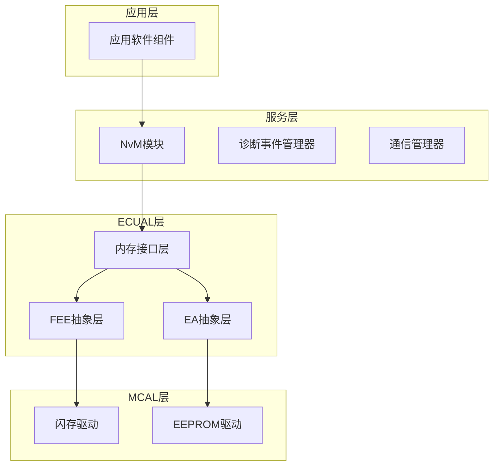

**图表来源**
- [NvM.c:16-23](file://src/bsw/services/nvm/src/NvM.c#L16-L23)

**章节来源**
- [NvM.h:1-355](file://src/bsw/services/nvm/include/NvM.h#L1-L355)
- [NvM.c:16-23](file://src/bsw/services/nvm/src/NvM.c#L16-L23)

## 核心组件

### 错误检测和报告机制

NvM模块实现了完整的错误检测和报告机制，基于AUTOSAR标准的开发期错误检测（DET）框架：

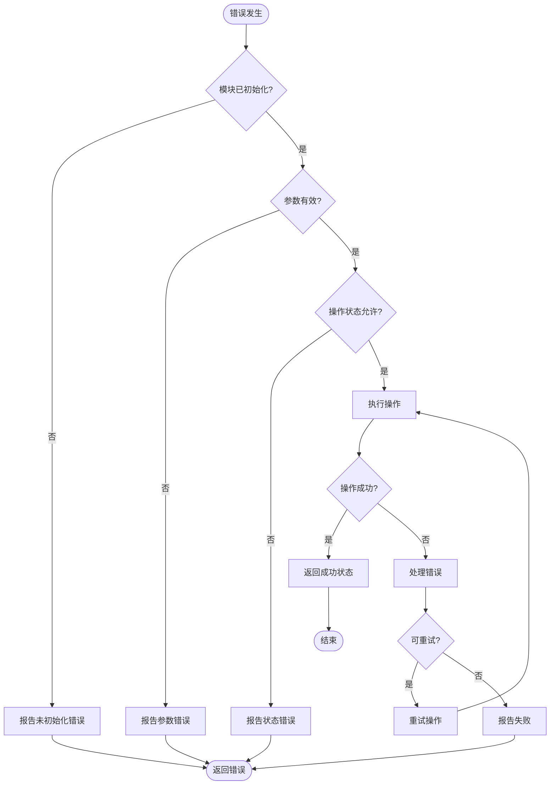

**图表来源**
- [NvM.c:918-968](file://src/bsw/services/nvm/src/NvM.c#L918-L968)
- [NvM.c:1492-1531](file://src/bsw/services/nvm/src/NvM.c#L1492-L1531)

### DET错误码定义

NvM模块定义了完整的错误码体系：

| 错误码 | 值 | 描述 |
|--------|----|------|
| NVM_E_NOT_INITIALIZED | 0x14 | 模块未初始化 |
| NVM_E_BLOCK_PENDING | 0x15 | 块操作已在进行中 |
| NVM_E_BLOCK_CONFIG | 0x16 | 块配置错误 |
| NVM_E_PARAM_BLOCK_ID | 0x0A | 块ID参数无效 |
| NVM_E_PARAM_BLOCK_DATA_IDX | 0x0B | 数据索引参数无效 |
| NVM_E_PARAM_BLOCK_TYPE | 0x0C | 块类型参数无效 |
| NVM_E_PARAM_DATA_IDX | 0x0D | 数据索引参数无效 |
| NVM_E_PARAM_POINTER | 0x0E | 指针参数无效 |
| NVM_E_BLOCK_LOCKED | 0x13 | 块被锁定 |
| NVM_E_WRITE_PROTECTED | 0x12 | 写保护启用 |

**章节来源**
- [NvM.h:67-76](file://src/bsw/services/nvm/include/NvM.h#L67-L76)
- [NvM.c:29-35](file://src/bsw/services/nvm/src/NvM.c#L29-L35)

### NvM_RequestResultType状态枚举

NvM_RequestResultType定义了所有可能的操作结果状态：

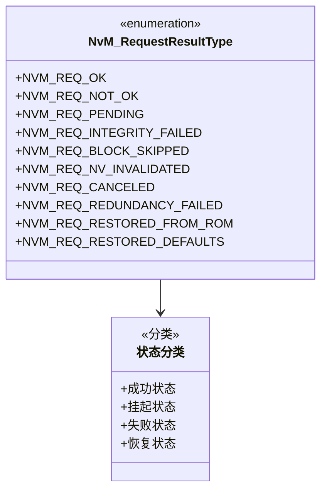

**图表来源**
- [NvM.h:81-92](file://src/bsw/services/nvm/include/NvM.h#L81-L92)

**章节来源**
- [NvM.h:81-92](file://src/bsw/services/nvm/include/NvM.h#L81-L92)

## 架构概览

### 系统架构图

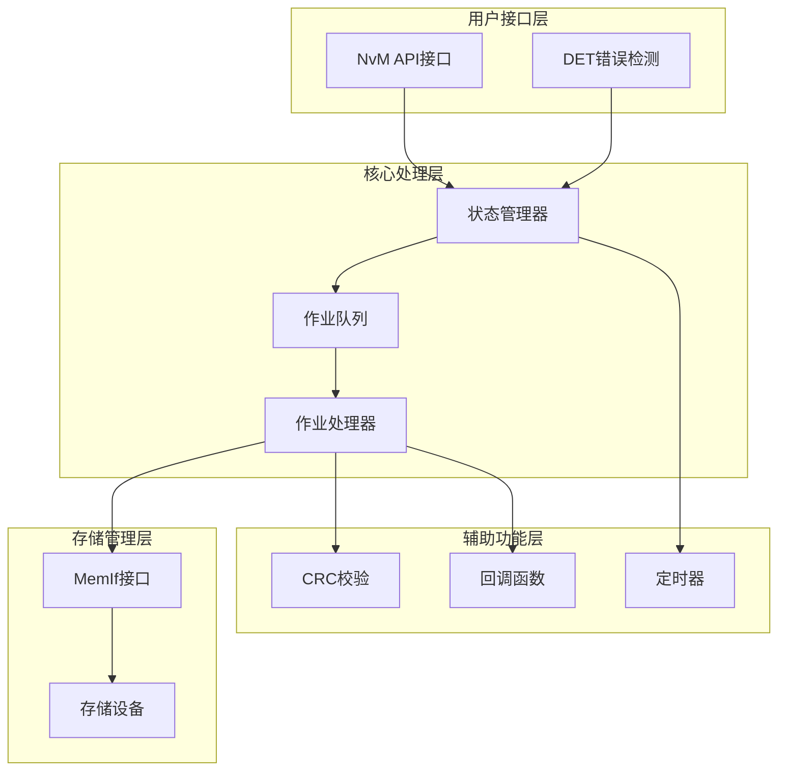

**图表来源**
- [NvM.c:98-129](file://src/bsw/services/nvm/src/NvM.c#L98-L129)
- [NvM.c:145-175](file://src/bsw/services/nvm/src/NvM.c#L145-L175)

### 错误处理流程图

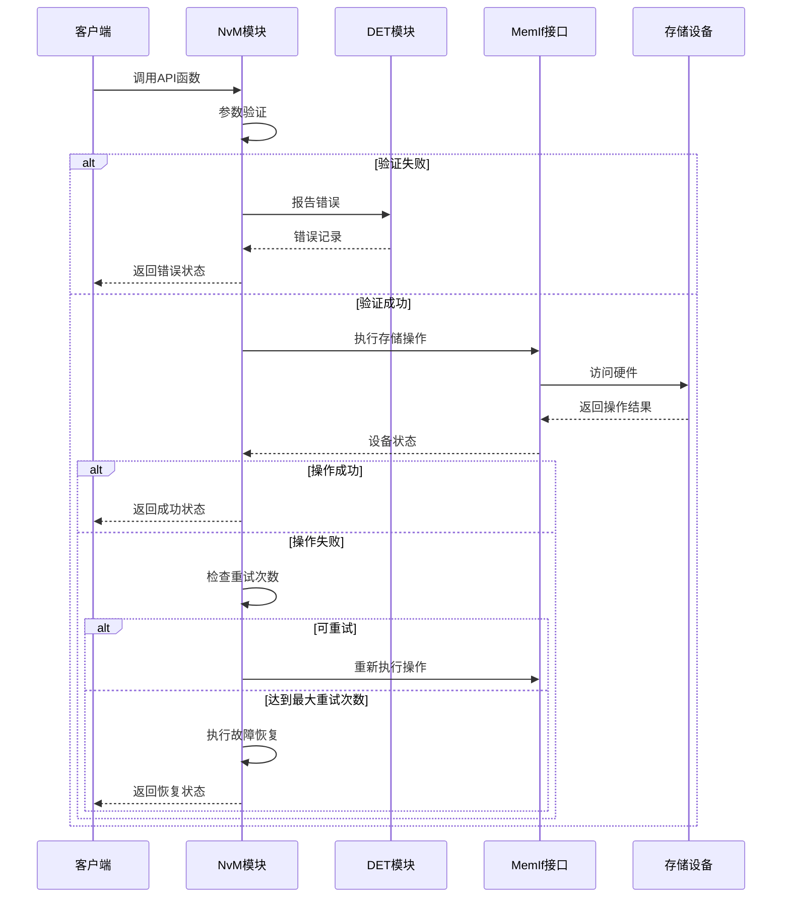

**图表来源**
- [NvM.c:1687-2125](file://src/bsw/services/nvm/src/NvM.c#L1687-L2125)

**章节来源**
- [NvM.c:918-968](file://src/bsw/services/nvm/src/NvM.c#L918-L968)
- [NvM.c:1687-2125](file://src/bsw/services/nvm/src/NvM.c#L1687-L2125)

## 详细组件分析

### 状态管理系统

NvM模块实现了完整的状态管理系统，包括模块状态、块状态和作业状态：

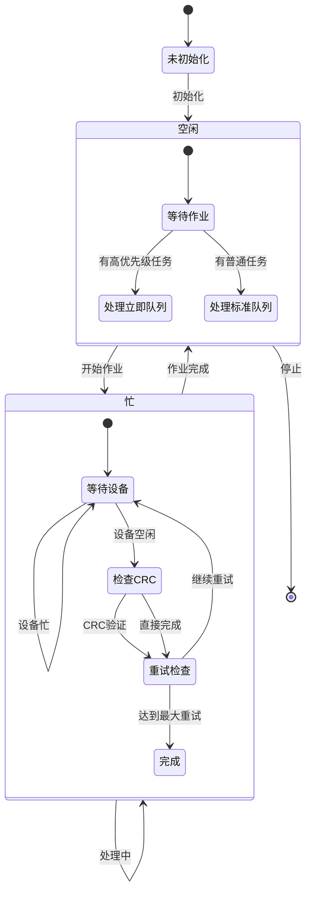

**图表来源**
- [NvM.c:37-40](file://src/bsw/services/nvm/src/NvM.c#L37-L40)
- [NvM.c:1687-2125](file://src/bsw/services/nvm/src/NvM.c#L1687-L2125)

### 作业队列管理

NvM模块实现了双队列系统，支持高优先级和普通优先级的作业处理：

| 队列类型 | 大小 | 用途 | 优先级 |
|----------|------|------|--------|
| 标准队列 | NVM_SIZE_STANDARD_JOB_QUEUE | 普通读写操作 | 低 |
| 立即队列 | NVM_SIZE_IMMEDIATE_JOB_QUEUE | 紧急恢复操作 | 高 |

**章节来源**
- [NvM.c:104-114](file://src/bsw/services/nvm/src/NvM.c#L104-L114)
- [NvM_Cfg.h:79-80](file://src/bsw/services/nvm/include/NvM_Cfg.h#L79-L80)

### 错误恢复机制

NvM模块实现了多层错误恢复机制：

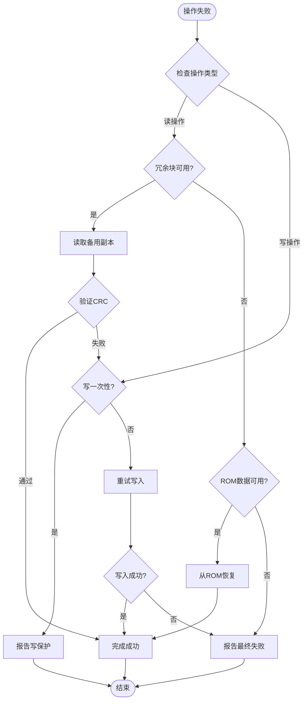

**图表来源**
- [NvM.c:1905-1936](file://src/bsw/services/nvm/src/NvM.c#L1905-L1936)
- [NvM.c:2018-2033](file://src/bsw/services/nvm/src/NvM.c#L2018-L2033)

**章节来源**
- [NvM.c:1905-1936](file://src/bsw/services/nvm/src/NvM.c#L1905-L1936)
- [NvM.c:2018-2033](file://src/bsw/services/nvm/src/NvM.c#L2018-L2033)

### 块锁定、写保护和写一次性状态管理

NvM模块实现了完整的块状态管理机制：

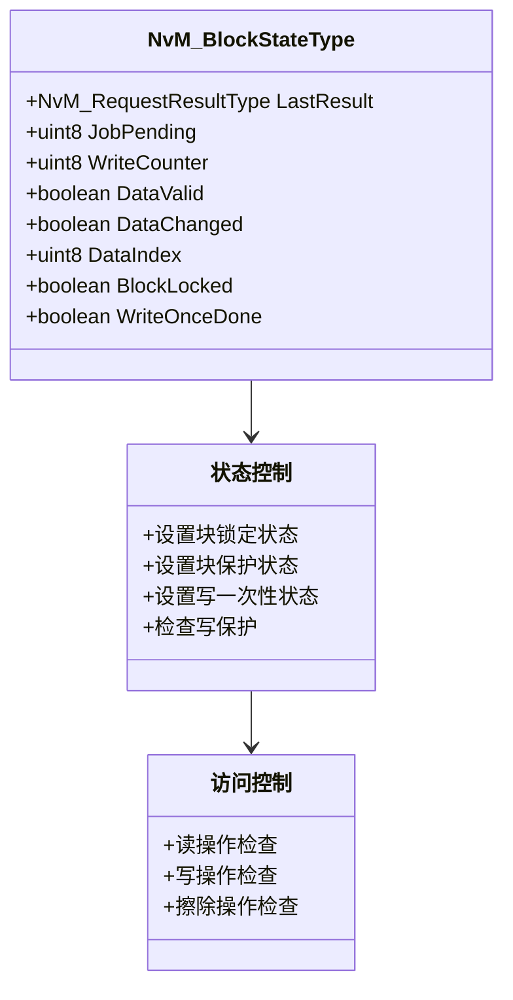

**图表来源**
- [NvM.c:84-95](file://src/bsw/services/nvm/src/NvM.c#L84-L95)
- [NvM.c:1288-1378](file://src/bsw/services/nvm/src/NvM.c#L1288-L1378)

**章节来源**
- [NvM.c:84-95](file://src/bsw/services/nvm/src/NvM.c#L84-L95)
- [NvM.c:1288-1378](file://src/bsw/services/nvm/src/NvM.c#L1288-L1378)

## 依赖关系分析

### 外部依赖关系

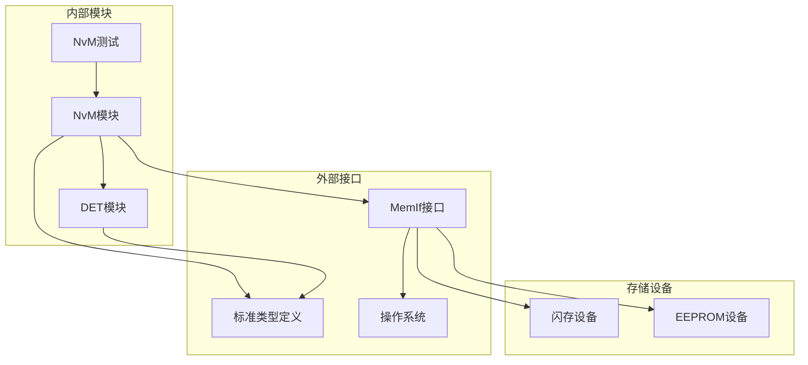

**图表来源**
- [NvM.c:19-22](file://src/bsw/services/nvm/src/NvM.c#L19-L22)
- [Det.h:17-18](file://src/bsw/common/Det.h#L17-L18)

### 错误处理依赖链

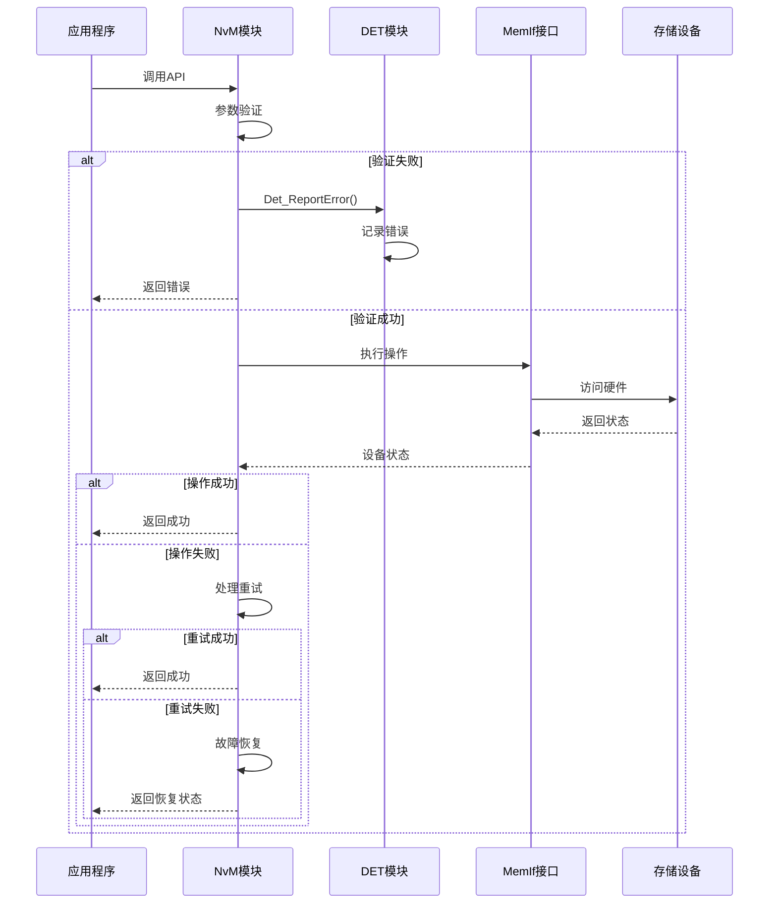

**图表来源**
- [NvM.c:62-67](file://src/bsw/services/nvm/src/NvM.c#L62-L67)
- [Det.c:47-57](file://src/bsw/common/Det.c#L47-L57)

**章节来源**
- [NvM.c:19-22](file://src/bsw/services/nvm/src/NvM.c#L19-L22)
- [Det.c:47-57](file://src/bsw/common/Det.c#L47-L57)

## 性能考虑

### 队列管理优化

NvM模块采用了环形缓冲区实现的队列系统，具有以下性能特点：

- **时间复杂度**: 入队和出队操作均为O(1)
- **空间效率**: 使用连续内存分配，减少内存碎片
- **优先级处理**: 支持紧急队列优先处理，确保关键操作及时响应

### 重试机制优化

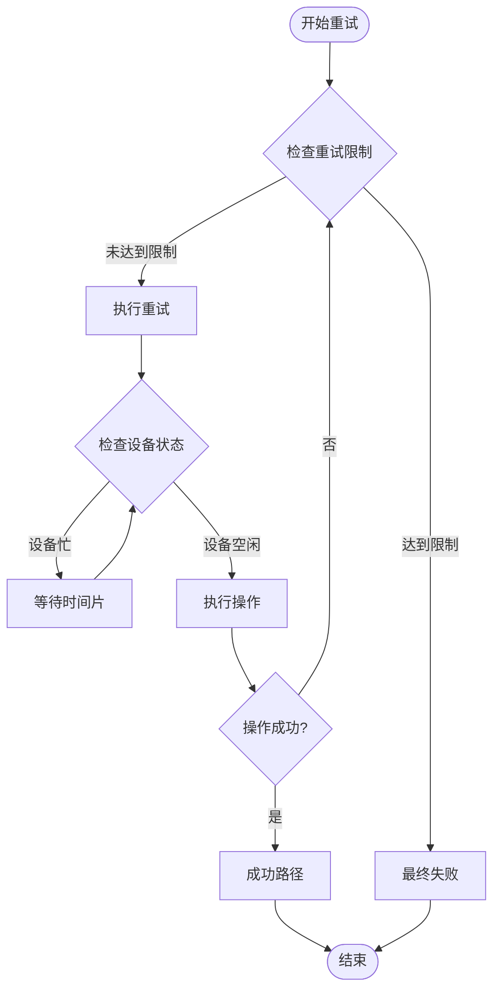

**图表来源**
- [NvM.c:1977-2016](file://src/bsw/services/nvm/src/NvM.c#L1977-L2016)

### 内存使用优化

- **静态内存分配**: 关键数据结构使用静态分配，避免运行时内存分配开销
- **状态缓存**: 块状态信息缓存在内存中，减少重复查询
- **批处理操作**: 支持批量读写操作，提高整体吞吐量

## 故障排除指南

### 常见错误场景和解决方案

#### 1. 模块未初始化错误 (NVM_E_NOT_INITIALIZED)

**症状**: 调用任何NvM API都返回错误

**原因**: 未调用NvM_Init()函数或初始化失败

**解决方案**:
- 确保在使用任何NvM功能前调用NvM_Init()
- 检查配置指针是否为NULL
- 验证配置参数的有效性

**章节来源**
- [NvM.c:922-928](file://src/bsw/services/nvm/src/NvM.c#L922-L928)
- [NvM_test.c:252-263](file://src/bsw/services/nvm/src/NvM_test.c#L252-L263)

#### 2. 参数验证错误

**症状**: 特定API调用返回参数错误

**常见类型**:
- NVM_E_PARAM_POINTER: 指针参数为NULL
- NVM_E_PARAM_BLOCK_ID: 块ID超出范围
- NVM_E_PARAM_DATA_IDX: 数据索引越界

**解决方案**:
- 在调用API前验证所有参数
- 检查块ID是否在有效范围内
- 确保指针参数不为NULL

**章节来源**
- [NvM.c:981-999](file://src/bsw/services/nvm/src/NvM.c#L981-L999)
- [NvM.c:1193-1233](file://src/bsw/services/nvm/src/NvM.c#L1193-L1233)

#### 3. 块锁定和写保护错误

**症状**: 写操作被拒绝

**原因**:
- 块被锁定 (BlockLocked = TRUE)
- 启用了写保护 (BlockWriteProt = TRUE)
- 启用了写一次性 (WriteOnceDone = TRUE)

**解决方案**:
- 检查块状态: `NvM_GetErrorStatus()`
- 解锁块: `NvM_SetBlockLockStatus(FALSE)`
- 禁用写保护: `NvM_SetBlockProtection(FALSE)`

**章节来源**
- [NvM.c:1068-1081](file://src/bsw/services/nvm/src/NvM.c#L1068-L1081)
- [NvM.c:1288-1313](file://src/bsw/services/nvm/src/NvM.c#L1288-L1313)

#### 4. 重试机制问题

**症状**: 操作频繁重试但最终失败

**原因**:
- 存储设备不稳定
- 电源波动
- 硬件故障

**解决方案**:
- 增加重试次数配置
- 实施更积极的故障恢复策略
- 检查硬件连接和电源稳定性

**章节来源**
- [NvM.c:1977-2033](file://src/bsw/services/nvm/src/NvM.c#L1977-L2033)

### 错误诊断技巧

#### 1. 使用NvM_GetErrorStatus()

```c
// 获取单个块的错误状态
NvM_RequestResultType result;
Std_ReturnType status = NvM_GetErrorStatus(BLOCK_ID, &result);
if (status == E_OK) {
    // 处理结果状态
    switch(result) {
        case NVM_REQ_OK:
            // 操作成功
            break;
        case NVM_REQ_PENDING:
            // 操作仍在进行
            break;
        case NVM_REQ_INTEGRITY_FAILED:
            // 数据完整性检查失败
            break;
        // ... 其他状态处理
    }
}
```

#### 2. 启用DET调试

在开发阶段启用DET可以捕获更多错误信息：

```c
// 配置中启用开发期错误检测
#define NVM_DEV_ERROR_DETECT (STD_ON)
```

#### 3. 监控队列状态

通过检查队列状态了解系统负载：

```c
// 检查队列使用情况
printf("标准队列: %d/%d\n", 
       NvM_InternalState.StandardQueueCount,
       NVM_SIZE_STANDARD_JOB_QUEUE);
printf("立即队列: %d/%d\n", 
       NvM_InternalState.ImmediateQueueCount,
       NVM_SIZE_IMMEDIATE_JOB_QUEUE);
```

**章节来源**
- [NvM.c:1492-1531](file://src/bsw/services/nvm/src/NvM.c#L1492-L1531)
- [NvM_test.c:399-413](file://src/bsw/services/nvm/src/NvM_test.c#L399-L413)

### 预防措施

#### 1. 初始化阶段检查

```c
// 完整的初始化流程
void initializeNvM(void) {
    // 1. 验证配置
    if (validateNvMConfig() != E_OK) {
        // 处理配置错误
        return;
    }
    
    // 2. 初始化NvM
    NvM_Init(&NvM_Config);
    
    // 3. 验证初始化
    if (checkNvMInitialization() != E_OK) {
        // 处理初始化失败
        return;
    }
}
```

#### 2. 参数验证

```c
// 在调用API前验证参数
Std_ReturnType validateAndCallNvM(
    NvM_BlockIdType blockId, 
    void* dataPtr, 
    size_t length
) {
    // 1. 验证指针
    if (dataPtr == NULL) {
        return E_NOT_OK;
    }
    
    // 2. 验证块ID范围
    if (blockId <= 0 || blockId >= NVM_NUM_OF_NVRAM_BLOCKS) {
        return E_NOT_OK;
    }
    
    // 3. 验证数据长度
    if (length == 0) {
        return E_NOT_OK;
    }
    
    // 4. 调用实际API
    return NvM_WriteBlock(blockId, dataPtr);
}
```

#### 3. 错误处理策略

```c
// 实施分层错误处理
void robustNvMOperation(
    NvM_BlockIdType blockId, 
    const void* dataPtr
) {
    Std_ReturnType result;
    
    // 第一层：快速失败检查
    if (!quickValidation(blockId, dataPtr)) {
        handleQuickFail();
        return;
    }
    
    // 第二层：标准操作
    result = NvM_WriteBlock(blockId, dataPtr);
    if (result == E_OK) {
        // 等待操作完成
        waitForCompletion(blockId);
    } else {
        // 第三层：降级处理
        handleDegradedMode(blockId, dataPtr);
    }
}
```

## 结论

NvM模块的错误处理机制体现了AUTOSAR标准的最佳实践，通过多层次的错误检测、智能的重试机制和完善的故障恢复策略，确保了系统的可靠性和稳定性。

### 主要特性总结

1. **完整的错误检测**: 基于DET框架的开发期错误检测
2. **智能重试机制**: 自适应重试策略，支持读写操作
3. **多层故障恢复**: 冗余块、ROM数据恢复等多种恢复策略
4. **状态管理**: 完整的模块、块和作业状态跟踪
5. **性能优化**: 队列管理和批处理操作优化

### 最佳实践建议

1. **初始化验证**: 始终在使用前验证模块初始化状态
2. **参数验证**: 在调用API前进行充分的参数验证
3. **错误监控**: 使用NvM_GetErrorStatus()持续监控操作状态
4. **配置优化**: 根据应用场景调整重试次数和超时设置
5. **硬件检查**: 定期检查存储设备的健康状态

通过遵循这些指导原则和最佳实践，可以最大化利用NvM模块的功能，构建稳定可靠的非易失性存储管理系统。