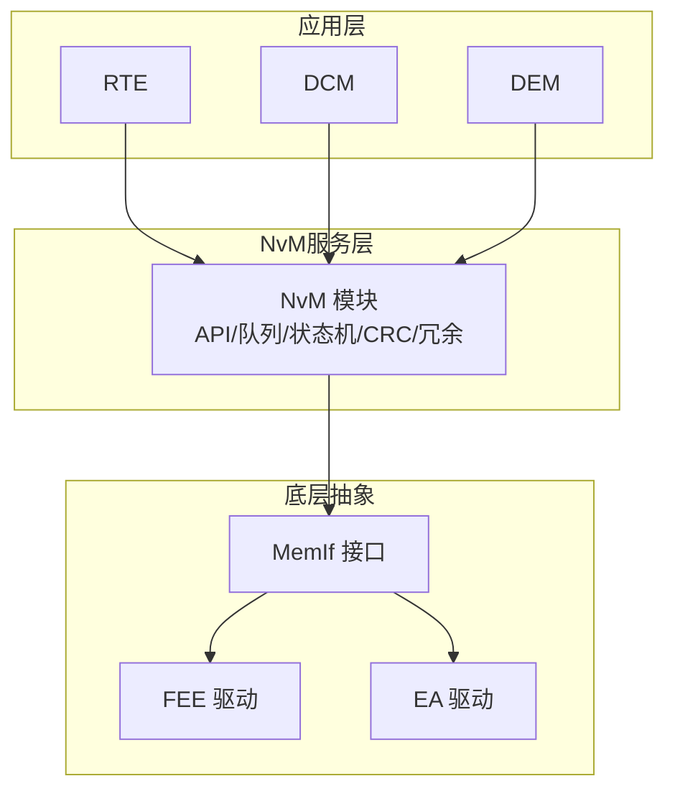
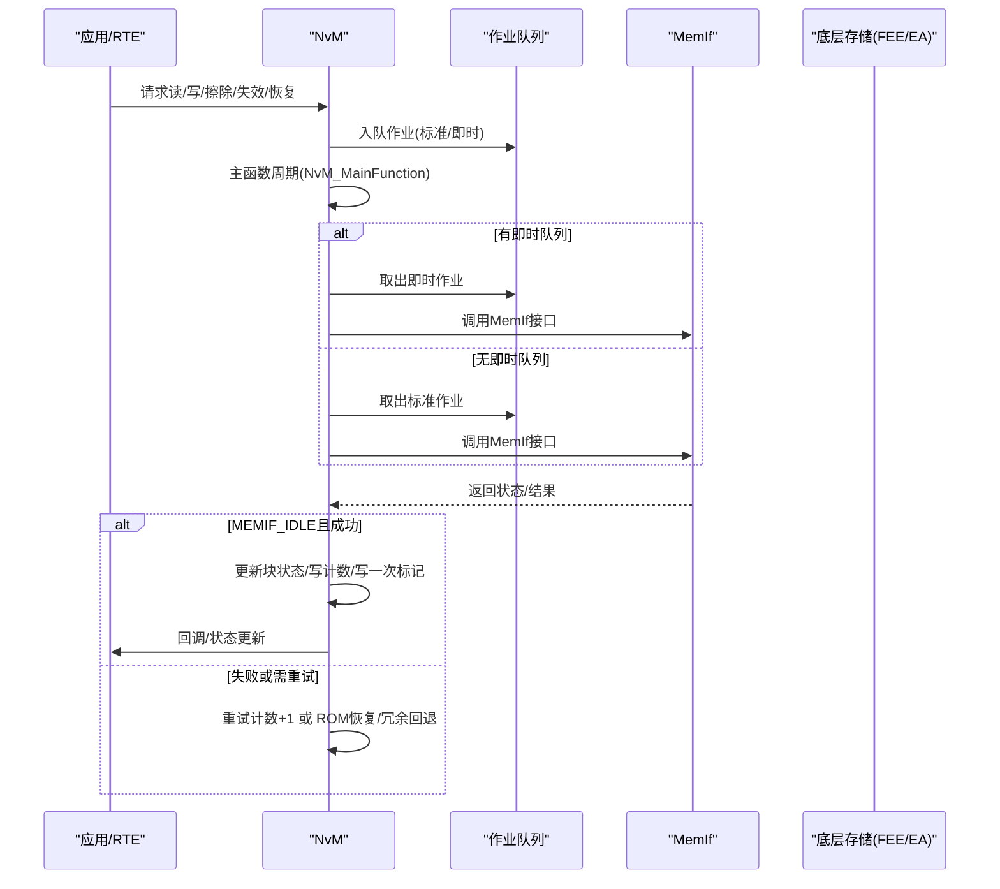
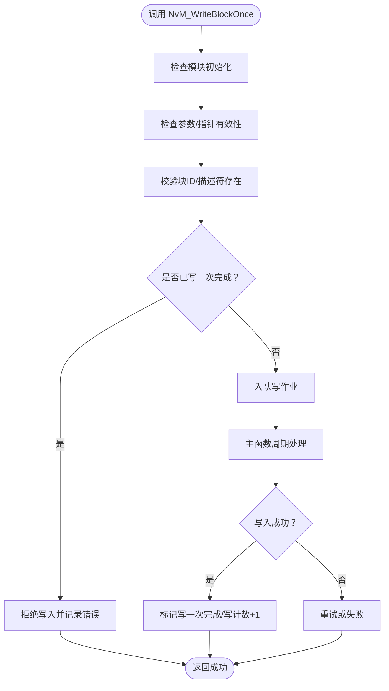
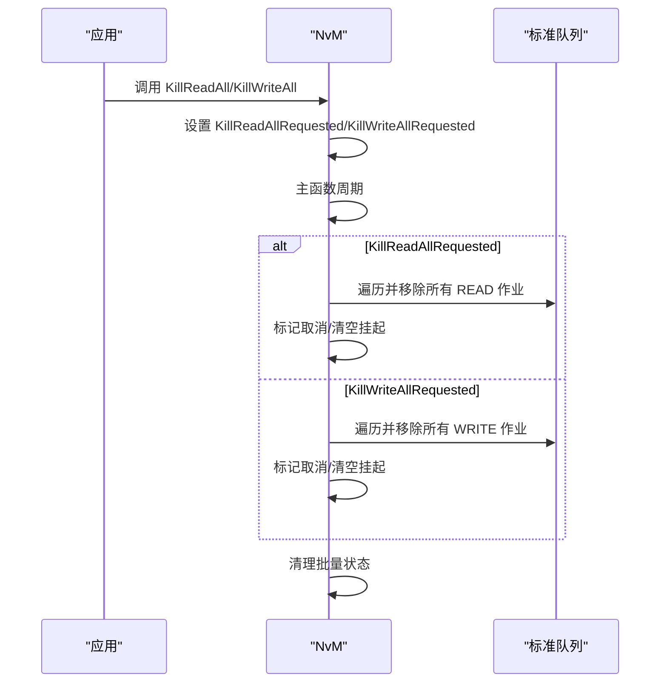
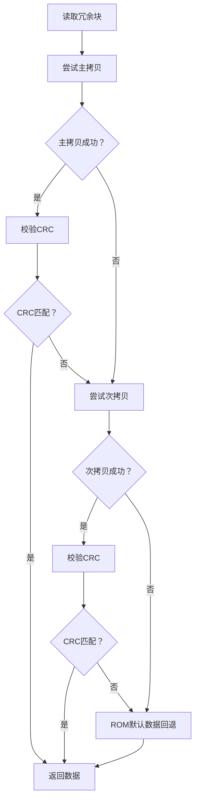
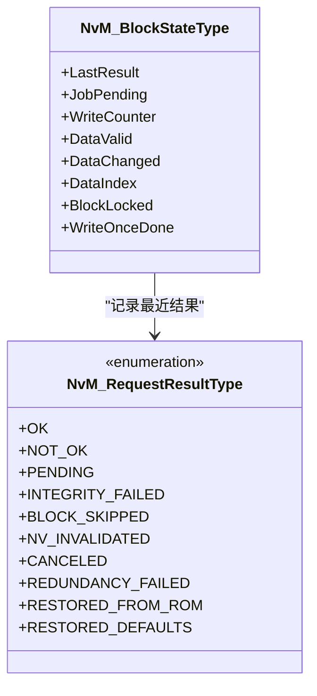
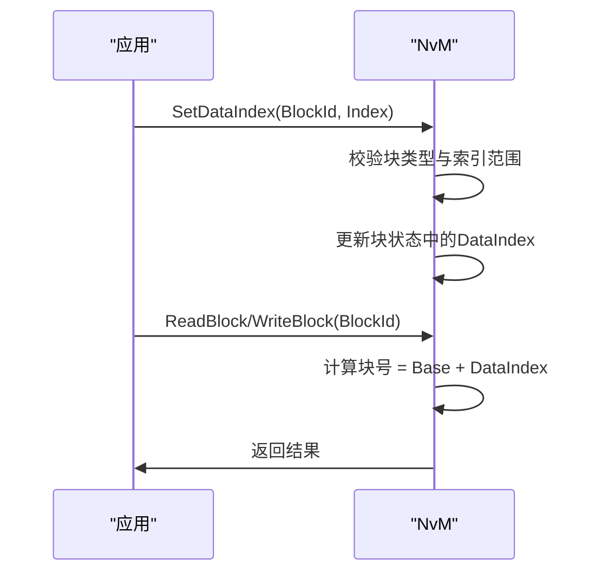
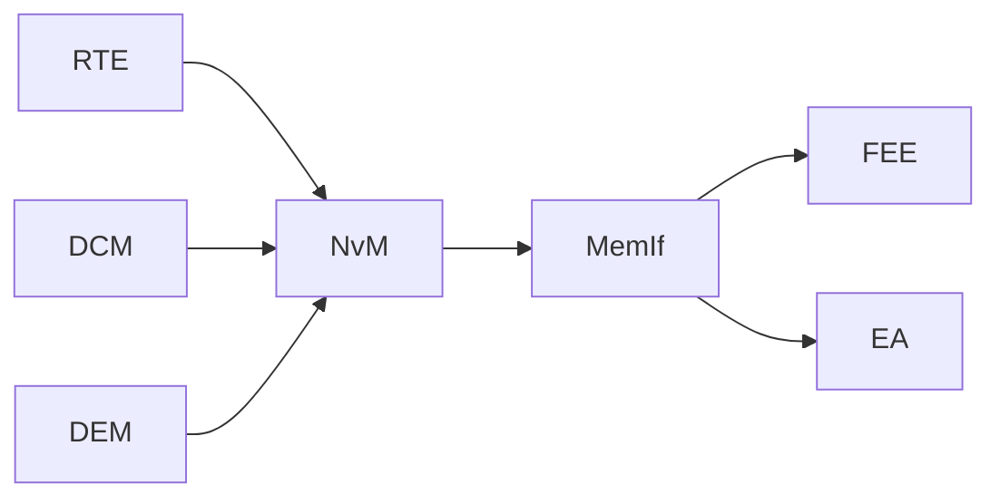

# 高级功能与优化

<cite>
**本文引用的文件**
- [NvM.h](file://src/bsw/services/nvm/include/NvM.h)
- [NvM.c](file://src/bsw/services/nvm/src/NvM.c)
- [NvM_Cfg.h](file://src/bsw/services/nvm/include/NvM_Cfg.h)
- [NvM_spec.md](file://openspec/changes/dev-nvm-enhancement/specs/NvM_spec.md)
- [NvM_test.c](file://src/bsw/services/nvm/src/NvM_test.c)
- [integration_test.c](file://src/bsw/integration/tests/integration_test.c)
</cite>

## 目录
1. [简介](#简介)
2. [项目结构](#项目结构)
3. [核心组件](#核心组件)
4. [架构总览](#架构总览)
5. [详细组件分析](#详细组件分析)
6. [依赖关系分析](#依赖关系分析)
7. [性能考量](#性能考量)
8. [故障排查指南](#故障排查指南)
9. [结论](#结论)
10. [附录](#附录)

## 简介
本文件面向NVRAM管理器（NvM）的高级功能与优化，围绕以下主题展开：
- 写一次性保护（Write-Once）
- 损坏块修复（Repair Damaged Blocks）
- 批量操作控制（KillWriteAll/KillReadAll）
- 数据压缩、镜像备份与冗余管理
- RAM块状态管理、自动验证与CRC计算
- 多数据集支持、动态数据索引切换与运行时配置修改
- 性能优化策略、内存使用优化与功耗管理
- 高级配置选项、调试工具与监控接口

## 项目结构
NvM位于服务层（Service Layer），通过Memory Abstraction Interface（MemIf）与底层存储设备交互，并向上提供统一的持久化数据访问接口。关键文件与职责如下：
- 接口定义：NvM.h（对外API、类型、错误码）
- 实现主体：NvM.c（队列、状态机、作业处理、CRC、冗余、批量控制等）
- 配置头：NvM_Cfg.h（编译期开关、队列大小、重试次数、主函数周期等）
- 规格说明：NvM_spec.md（功能场景、API列表、数据类型、错误处理）
- 测试用例：NvM_test.c、integration_test.c（配置样例、行为验证）

图示来源
- [NvM_spec.md: 366-382:366-382](file://openspec/changes/dev-nvm-enhancement/specs/NvM_spec.md#L366-L382)
- [NvM.h: 188-352:188-352](file://src/bsw/services/nvm/include/NvM.h#L188-L352)

章节来源
- [NvM.h: 13-355:13-355](file://src/bsw/services/nvm/include/NvM.h#L13-L355)
- [NvM.c: 1-2368:1-2368](file://src/bsw/services/nvm/src/NvM.c#L1-L2368)
- [NvM_Cfg.h: 1-88:1-88](file://src/bsw/services/nvm/include/NvM_Cfg.h#L1-L88)
- [NvM_spec.md: 1-389:1-389](file://openspec/changes/dev-nvm-enhancement/specs/NvM_spec.md#L1-L389)

## 核心组件
- 块描述符与配置：NvM_BlockDescriptorType、NvM_ConfigType，定义块类型（Native/Redundant/Dataset）、CRC类型、写保护、写一次、镜像、压缩、ROM默认数据指针、RAM地址等。
- 作业队列与状态机：标准队列与高优先级即时队列，作业类型（读/写/擦除/失效/恢复），当前作业与模块状态（空闲/忙碌）。
- CRC与自动验证：按配置在读写时附加/校验CRC，失败时尝试冗余副本或从ROM恢复。
- 批量操作：ReadAll/WriteAll，支持终止控制（KillReadAll/KillWriteAll）。
- 动态索引与保护：SetDataIndex、SetBlockLockStatus/SetBlockProtection/SetWriteOnceStatus。
- 调试与监控：DET错误报告、错误状态查询、版本信息、回调钩子。

章节来源
- [NvM.h: 119-172:119-172](file://src/bsw/services/nvm/include/NvM.h#L119-L172)
- [NvM.h: 188-352:188-352](file://src/bsw/services/nvm/include/NvM.h#L188-L352)
- [NvM_Cfg.h: 15-87:15-87](file://src/bsw/services/nvm/include/NvM_Cfg.h#L15-L87)
- [NvM_spec.md: 109-204:109-204](file://openspec/changes/dev-nvm-enhancement/specs/NvM_spec.md#L109-L204)

## 架构总览
NvM采用异步作业模型，通过主函数周期驱动MemIf完成底层I/O。模块内部维护块状态、作业队列与批量操作标志，确保可靠性与可中断性。

图示来源
- [NvM.c: 1687-2125:1687-2125](file://src/bsw/services/nvm/src/NvM.c#L1687-L2125)
- [NvM_spec.md: 274-363:274-363](file://openspec/changes/dev-nvm-enhancement/specs/NvM_spec.md#L274-L363)

## 详细组件分析

### 写一次性保护（NvM_WriteBlockOnce）
- 设计要点
  - 写一次保护由块配置中的“写一次”标志决定；首次写入后设置内部写完成标记，后续写入被拒绝。
  - 写一次API委托给常规写入流程，复用相同的保护检查与队列机制。
- 关键路径
  - 参数校验与初始化检查
  - 检查写保护/锁定/写一次完成标记
  - 入队并交由主函数异步执行
  - 成功后更新写计数与写一次完成标记
- 行为约束
  - 运行时修改写一次状态不支持（返回失败），仅配置期生效。

图示来源
- [NvM.c: 1242-1280:1242-1280](file://src/bsw/services/nvm/src/NvM.c#L1242-L1280)
- [NvM.c: 1957-1960:1957-1960](file://src/bsw/services/nvm/src/NvM.c#L1957-L1960)

章节来源
- [NvM.h: 285-291:285-291](file://src/bsw/services/nvm/include/NvM.h#L285-L291)
- [NvM.c: 1242-1280:1242-1280](file://src/bsw/services/nvm/src/NvM.c#L1242-L1280)
- [NvM.c: 1957-1960:1957-1960](file://src/bsw/services/nvm/src/NvM.c#L1957-L1960)

### 损坏块修复（NvM_RepairDamagedBlocks）
- 当前实现状态
  - 在配置中提供“修复损坏块”API开关，但当前实现未提供具体修复逻辑，API返回失败。
- 建议扩展方向
  - 增加损坏检测与修复流程：扫描冗余块、CRC一致性检查、ROM回退、日志记录与状态上报。
  - 提供可配置的修复阈值与策略（如自动重试、降级策略）。

章节来源
- [NvM.h: 330-334:330-334](file://src/bsw/services/nvm/include/NvM.h#L330-L334)
- [NvM_Cfg.h: 26](file://src/bsw/services/nvm/include/NvM_Cfg.h#L26)
- [NvM_test.c: 208](file://src/bsw/services/nvm/src/NvM_test.c#L208)

### 批量操作控制（NvM_KillWriteAll / NvM_KillReadAll）
- 设计要点
  - 通过请求标志触发主函数周期内的清理动作：移除标准队列中对应类型的作业，更新块状态为取消。
  - 支持在批量读/写进行中安全中断，避免阻塞系统。
- 关键路径
  - 设置请求标志
  - 主函数周期检测到请求，遍历队列，保留非目标类型作业，对目标类型作业标记取消并清空挂起状态
  - 重置批量操作进行中与待处理计数

图示来源
- [NvM.c: 2349-2360:2349-2360](file://src/bsw/services/nvm/src/NvM.c#L2349-L2360)
- [NvM.c: 1697-1773:1697-1773](file://src/bsw/services/nvm/src/NvM.c#L1697-L1773)

章节来源
- [NvM.h: 336-344:336-344](file://src/bsw/services/nvm/include/NvM.h#L336-L344)
- [NvM.c: 2349-2360:2349-2360](file://src/bsw/services/nvm/src/NvM.c#L2349-L2360)
- [NvM.c: 1697-1773:1697-1773](file://src/bsw/services/nvm/src/NvM.c#L1697-L1773)

### 数据压缩、镜像备份与冗余管理
- 数据压缩
  - 块描述符中提供压缩标志字段，但当前实现未见压缩/解压逻辑，建议在写入前压缩、读取后解压，并结合CRC校验。
- 镜像备份
  - 块描述符包含镜像块指针字段，当前实现未启用镜像写入；可在写入主块后同步写入镜像块，失败时回滚或报警。
- 冗余管理
  - 冗余块类型支持双拷贝读写：主拷贝失败则自动切换到次拷贝；写入完成后写第二份拷贝。
  - CRC校验失败时优先尝试冗余拷贝，否则回退ROM默认数据。

图示来源
- [NvM.c: 453-502:453-502](file://src/bsw/services/nvm/src/NvM.c#L453-L502)
- [NvM.c: 507-568:507-568](file://src/bsw/services/nvm/src/NvM.c#L507-L568)
- [NvM.c: 573-644:573-644](file://src/bsw/services/nvm/src/NvM.c#L573-L644)
- [NvM.c: 1905-1921:1905-1921](file://src/bsw/services/nvm/src/NvM.c#L1905-L1921)

章节来源
- [NvM.h: 144](file://src/bsw/services/nvm/include/NvM.h#L144)
- [NvM.c: 453-644:453-644](file://src/bsw/services/nvm/src/NvM.c#L453-L644)
- [NvM.c: 1905-1921:1905-1921](file://src/bsw/services/nvm/src/NvM.c#L1905-L1921)

### RAM块状态管理、自动验证与CRC计算
- RAM块状态
  - 每个块维护最后结果、挂起作业、写计数、数据有效/变更标志、活动数据集索引、锁定与写一次完成标记。
- 自动验证与CRC
  - 读取完成后根据配置计算CRC并与尾部存储的CRC比较；不一致时尝试冗余拷贝或ROM回退。
  - 写入时根据配置在数据尾部附加CRC；冗余块写入两份拷贝。
- 结果类型
  - 统一的结果枚举覆盖正常、挂起、完整性失败、块跳过、NV失效、取消、冗余失败、从ROM恢复、恢复默认等。

图示来源
- [NvM.c: 84-95:84-95](file://src/bsw/services/nvm/src/NvM.c#L84-L95)
- [NvM.h: 81-92:81-92](file://src/bsw/services/nvm/include/NvM.h#L81-L92)

章节来源
- [NvM.c: 84-95:84-95](file://src/bsw/services/nvm/src/NvM.c#L84-L95)
- [NvM.h: 81-92:81-92](file://src/bsw/services/nvm/include/NvM.h#L81-L92)
- [NvM.c: 1865-1921:1865-1921](file://src/bsw/services/nvm/src/NvM.c#L1865-L1921)

### 多数据集支持、动态数据索引切换与运行时配置修改
- 多数据集
  - Dataset块类型支持多个数据集，通过活动索引选择不同NV区域；索引范围受块描述符中数据集数量限制。
- 动态索引切换
  - SetDataIndex更新块状态中的活动索引，后续读写基于该索引计算NV块号。
- 运行时配置修改
  - 块锁定/保护/写一次状态在运行时可通过相应API设置；写一次状态通常仅配置期生效，运行时修改返回失败。

图示来源
- [NvM.c: 1188-1234:1188-1234](file://src/bsw/services/nvm/src/NvM.c#L1188-L1234)
- [NvM.c: 527-534:527-534](file://src/bsw/services/nvm/src/NvM.c#L527-L534)
- [NvM.c: 1288-1313:1288-1313](file://src/bsw/services/nvm/src/NvM.c#L1288-L1313)
- [NvM.c: 1357-1378:1357-1378](file://src/bsw/services/nvm/src/NvM.c#L1357-L1378)

章节来源
- [NvM.h: 197-203:197-203](file://src/bsw/services/nvm/include/NvM.h#L197-L203)
- [NvM.c: 1188-1234:1188-1234](file://src/bsw/services/nvm/src/NvM.c#L1188-L1234)
- [NvM.c: 527-534:527-534](file://src/bsw/services/nvm/src/NvM.c#L527-L534)
- [NvM.c: 1288-1313:1288-1313](file://src/bsw/services/nvm/src/NvM.c#L1288-L1313)
- [NvM.c: 1357-1378:1357-1378](file://src/bsw/services/nvm/src/NvM.c#L1357-L1378)

### 高级配置选项、调试工具与监控接口
- 配置项
  - 开关：开发错误检测、版本信息API、RAM块状态API、错误状态API、块保护API、数据索引API、取消作业API、批量终止API、修复损坏块API、RAM块CRC计算、CRC比较机制。
  - 重试：最大读/写重试次数
  - 队列：标准队列与即时队列大小
  - 主函数周期：主函数执行周期（毫秒）
- 调试与监控
  - DET错误报告：针对未初始化、参数错误、块锁定/写保护等情况
  - 错误状态查询：GetErrorStatus返回块最近结果
  - 版本信息：GetVersionInfo
  - 回调：JobEndCallback钩子

章节来源
- [NvM_Cfg.h: 15-87:15-87](file://src/bsw/services/nvm/include/NvM_Cfg.h#L15-L87)
- [NvM.h: 67-76:67-76](file://src/bsw/services/nvm/include/NvM.h#L67-L76)
- [NvM.h: 1492-1531:1492-1531](file://src/bsw/services/nvm/include/NvM.h#L1492-L1531)
- [NvM.h: 1474-1484:1474-1484](file://src/bsw/services/nvm/include/NvM.h#L1474-L1484)
- [NvM.c: 438-448:438-448](file://src/bsw/services/nvm/src/NvM.c#L438-L448)

## 依赖关系分析
- 上层依赖：RTE、DCM、DEM
- 下层依赖：MemIf、FEE、EA
- 内部耦合：块描述符与配置紧密耦合；主函数周期与队列/状态机强耦合；CRC与冗余逻辑贯穿读写路径。

图示来源
- [NvM_spec.md: 366-382:366-382](file://openspec/changes/dev-nvm-enhancement/specs/NvM_spec.md#L366-L382)

章节来源
- [NvM_spec.md: 366-382:366-382](file://openspec/changes/dev-nvm-enhancement/specs/NvM_spec.md#L366-L382)

## 性能考量
- 异步与批处理
  - 使用队列与主函数周期避免阻塞上层任务；ReadAll/WriteAll在启动/关闭阶段集中处理，减少频繁I/O。
- 队列与重试
  - 合理设置标准/即时队列大小与最大重试次数，平衡吞吐与可靠性。
- CRC与冗余
  - CRC计算带来CPU开销，建议仅对关键块启用；冗余写入增加存储与时间成本，应按风险评估启用。
- 内存与功耗
  - 尽量减少不必要的数据复制；在低功耗模式下降低主函数周期或暂停非关键作业。
- 缓存与预取
  - 对热点数据可考虑在RAM中缓存并延迟写入，结合写计数与写一次保护策略。

## 故障排查指南
- 常见错误与定位
  - 未初始化：调用API前先调用NvM_Init
  - 参数错误：检查块ID、指针、数据索引范围
  - 块锁定/写保护：确认SetBlockLockStatus/SetBlockProtection/SetWriteOnceStatus状态
  - 作业挂起：检查队列是否满或已有同块作业
  - 完整性失败：检查CRC类型与长度、冗余拷贝可用性、ROM默认数据一致性
- 调试手段
  - 启用DET错误报告，捕获错误码与API ID
  - 使用GetErrorStatus查询块最近结果
  - 在块描述符中注册JobEndCallback观察作业完成事件
- 中断与恢复
  - 使用KillReadAll/KillWriteAll中断批量操作
  - 重启后ReadAll自动恢复数据；若CRC失败，将回退至ROM默认数据

章节来源
- [NvM.h: 67-76:67-76](file://src/bsw/services/nvm/include/NvM.h#L67-L76)
- [NvM.c: 1492-1531:1492-1531](file://src/bsw/services/nvm/src/NvM.c#L1492-L1531)
- [NvM.c: 1697-1773:1697-1773](file://src/bsw/services/nvm/src/NvM.c#L1697-L1773)
- [NvM.c: 1905-1921:1905-1921](file://src/bsw/services/nvm/src/NvM.c#L1905-L1921)

## 结论
NvM在AutoSAR经典平台4.x规范下提供了完善的NV数据管理能力，具备异步作业、CRC保护、冗余容错、批量控制与动态索引等高级特性。当前实现中，损坏块修复API尚未落地，写一次状态运行时修改受限，建议在后续版本中补充这些能力，并结合压缩、镜像备份与运行时配置热更新，进一步提升系统的可靠性与可维护性。

## 附录
- 配置示例参考
  - 单元测试配置：包含写保护、写一次、镜像与压缩字段的示例
  - 集成测试配置：批量块配置与API开关示例

章节来源
- [NvM_test.c: 114-187:114-187](file://src/bsw/services/nvm/src/NvM_test.c#L114-L187)
- [NvM_test.c: 189-212:189-212](file://src/bsw/services/nvm/src/NvM_test.c#L189-L212)
- [integration_test.c: 714-737:714-737](file://src/bsw/integration/tests/integration_test.c#L714-L737)