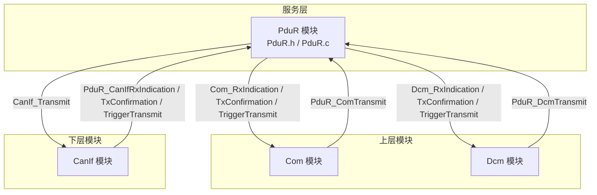
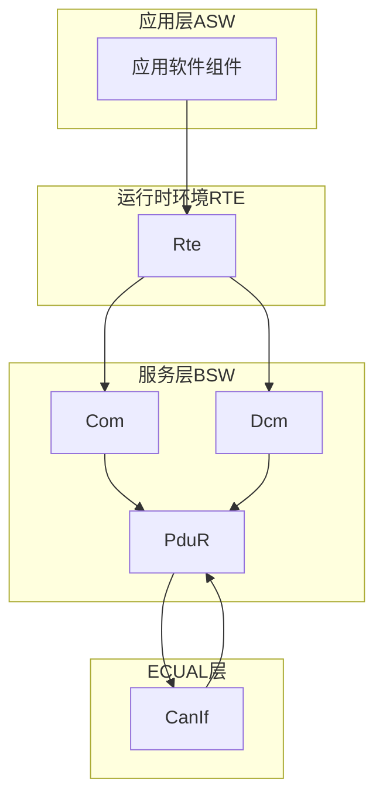
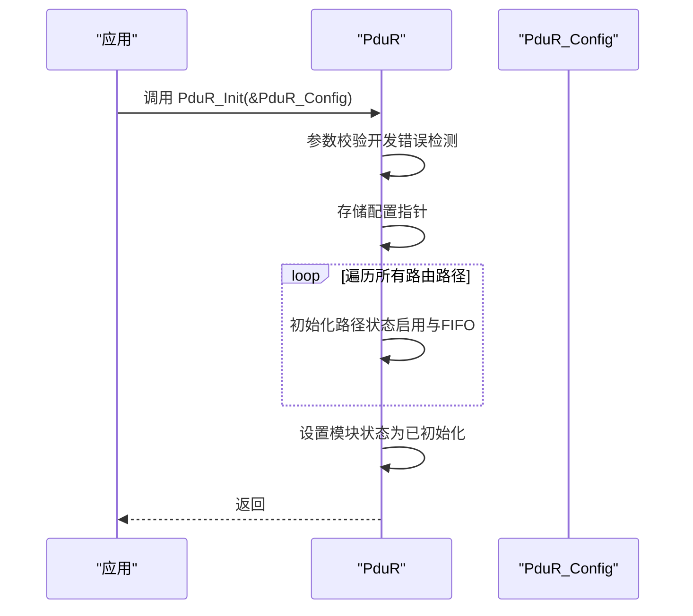
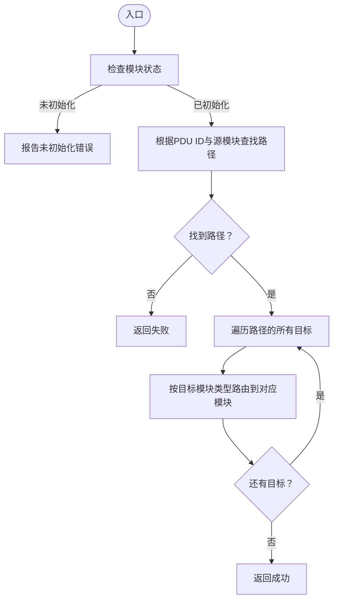
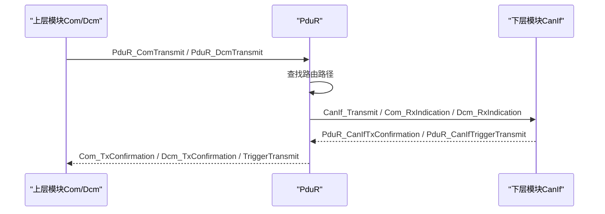
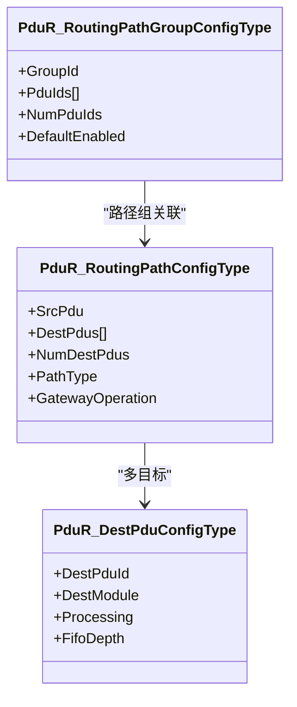
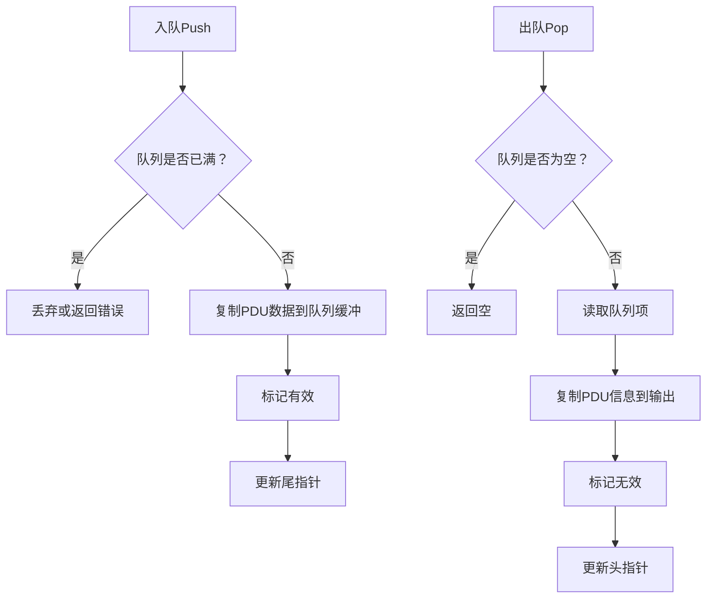
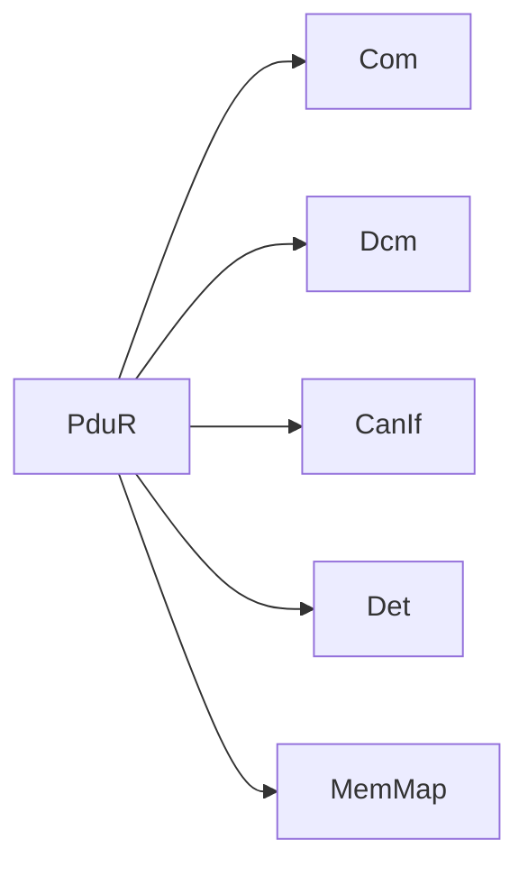

# PDU路由器 (PduR)

<cite>
**本文引用的文件**
- [PduR.h](file://src/bsw/services/pdur/include/PduR.h)
- [PduR_Cfg.h](file://src/bsw/services/pdur/include/PduR_Cfg.h)
- [PduR.c](file://src/bsw/services/pdur/src/PduR.c)
- [PduR_Lcfg.c](file://src/bsw/services/pdur/src/PduR_Lcfg.c)
- [PduR_test.c](file://src/bsw/services/pdur/src/PduR_test.c)
- [modules.md](file://docs/modules.md)
- [PduR_spec.md](file://openspec/changes/dev-pdu-router/specs/PduR_spec.md)
- [pdur_verification.md](file://verification/pdur_verification.md)
</cite>

## 目录
1. [简介](#简介)
2. [项目结构](#项目结构)
3. [核心组件](#核心组件)
4. [架构总览](#架构总览)
5. [详细组件分析](#详细组件分析)
6. [依赖关系分析](#依赖关系分析)
7. [性能考量](#性能考量)
8. [故障排除指南](#故障排除指南)
9. [结论](#结论)
10. [附录](#附录)

## 简介
本文件为PDU路由器（PduR）模块的全面技术文档，面向AutoSAR Classic Platform 4.x架构，聚焦于PDU消息在服务层内的路由核心能力。内容涵盖：
- 路由路径选择、多路复用与转发机制
- 初始化流程、路由表配置与路径管理
- 目标类型与路径类型的定义与使用
- 不同路由类型（直接、延迟、网关）的实现原理
- 关键API（如PduR_ComTransmit、PduR_RouteTransmit等）的使用方法
- 路由配置最佳实践、性能调优与故障排除

## 项目结构
PduR模块位于服务层，负责在上层模块（如Com、Dcm）与下层接口（如CanIf）之间进行PDU路由。其核心文件组织如下：
- 头文件：对外API、类型定义与配置宏
- 实现：路由查找、路径遍历、上下行回调、FIFO队列与主函数
- 配置：静态路由表与路径组配置
- 测试：单元测试与行为验证

图表来源
- [PduR.h:168-279](file://src/bsw/services/pdur/include/PduR.h#L168-L279)
- [PduR.c:28-36](file://src/bsw/services/pdur/src/PduR.c#L28-L36)

章节来源
- [modules.md:247-263](file://docs/modules.md#L247-L263)
- [PduR_spec.md:11-25](file://openspec/changes/dev-pdu-router/specs/PduR_spec.md#L11-L25)

## 核心组件
- 配置与类型
  - 配置结构体：PduR_ConfigType、PduR_RoutingPathConfigType、PduR_RoutingPathGroupConfigType
  - 目标配置：PduR_DestPduConfigType（含目标模块、处理策略、FIFO深度）
  - 路由路径类型：直接、延迟（FIFO）、网关
- 生命周期与API
  - 初始化/反初始化：PduR_Init、PduR_DeInit
  - 查询与版本：PduR_GetVersionInfo
  - 传输与取消：PduR_Transmit、PduR_ComTransmit、PduR_DcmTransmit、PduR_CancelTransmitRequest
  - 上下行回调：PduR_RxIndication、PduR_TxConfirmation、PduR_TriggerTransmit
  - 路径组控制：PduR_EnableRouting、PduR_DisableRouting
  - 主函数：PduR_MainFunction（周期性处理延迟队列）
- 内部状态与数据结构
  - 内部状态：模块状态、配置指针、每条路径的FIFO队列
  - FIFO队列：环形缓冲、入队/出队、满/空判断

章节来源
- [PduR.h:100-149](file://src/bsw/services/pdur/include/PduR.h#L100-L149)
- [PduR.h:168-279](file://src/bsw/services/pdur/include/PduR.h#L168-L279)
- [PduR.c:88-118](file://src/bsw/services/pdur/src/PduR.c#L88-L118)

## 架构总览
PduR在AutoSAR分层中处于服务层，作为上层（Com、Dcm）与下层（CanIf等）之间的桥梁，不参与具体总线协议处理，仅依据静态配置进行路由决策与分发。

图表来源
- [modules.md:340-376](file://docs/modules.md#L340-L376)
- [PduR_spec.md:261-276](file://openspec/changes/dev-pdu-router/specs/PduR_spec.md#L261-L276)

## 详细组件分析

### 初始化流程与配置装载
- 初始化步骤
  - 参数校验（开发错误检测）
  - 存储配置指针
  - 初始化每条路由路径的状态（默认启用）与FIFO队列
  - 设置模块状态为已初始化
- 配置来源
  - 静态配置：PduR_Lcfg.c中定义的路由路径数组与路径组数组
  - 配置宏：PduR_Cfg.h中预编译参数（如最大路径数、最大目标数、FIFO深度）

图表来源
- [PduR.c:374-398](file://src/bsw/services/pdur/src/PduR.c#L374-L398)
- [PduR_Lcfg.c:246-253](file://src/bsw/services/pdur/src/PduR_Lcfg.c#L246-L253)

章节来源
- [PduR.c:374-398](file://src/bsw/services/pdur/src/PduR.c#L374-L398)
- [PduR_Lcfg.c:246-253](file://src/bsw/services/pdur/src/PduR_Lcfg.c#L246-L253)
- [PduR_Cfg.h:15-64](file://src/bsw/services/pdur/include/PduR_Cfg.h#L15-L64)

### 路由路径查找与多路复用
- 查找逻辑
  - 根据PDU ID与源模块类型（COM/DCM/CANIF等）在路由表中匹配
  - 返回匹配的路径索引或失败
- 多路复用
  - 一条路径可配置多个目标（DestPdus），实现一对多转发
  - 对每个目标执行对应模块的路由动作（发送、回调或触发）

图表来源
- [PduR.c:132-183](file://src/bsw/services/pdur/src/PduR.c#L132-L183)
- [PduR.c:191-224](file://src/bsw/services/pdur/src/PduR.c#L191-L224)

章节来源
- [PduR.c:132-183](file://src/bsw/services/pdur/src/PduR.c#L132-L183)
- [PduR.c:191-224](file://src/bsw/services/pdur/src/PduR.c#L191-L224)

### 上下行回调与确认转发
- 下行（上层到下层）：PduR_Transmit（映射为PduR_ComTransmit、PduR_DcmTransmit）
  - 查找路径并逐目标转发
- 上行（下层到上层）：PduR_RxIndication（映射为PduR_CanIfRxIndication）
  - 将下层接收的数据转发给上层模块
- 确认与触发：PduR_TxConfirmation、PduR_TriggerTransmit
  - 确认：将下层发送结果回传至上层
  - 触发：请求上层填充待发送数据（若需要）

图表来源
- [PduR.h:237-276](file://src/bsw/services/pdur/include/PduR.h#L237-L276)
- [PduR.c:428-624](file://src/bsw/services/pdur/src/PduR.c#L428-L624)

章节来源
- [PduR.h:237-276](file://src/bsw/services/pdur/include/PduR.h#L237-L276)
- [PduR.c:428-624](file://src/bsw/services/pdur/src/PduR.c#L428-L624)

### 路由类型与路径组管理
- 路由路径类型
  - 直接（DIRECT）：立即转发至目标模块
  - 延迟（FIFO）：将PDU入队，由主函数周期处理
  - 网关（GATEWAY）：预留扩展（当前实现未使用）
- 路径组
  - 通过PduR_EnableRouting/PduR_DisableRouting按组启用/禁用
  - 默认启用/禁用由配置决定

图表来源
- [PduR.h:119-149](file://src/bsw/services/pdur/include/PduR.h#L119-L149)
- [PduR_Lcfg.c:114-243](file://src/bsw/services/pdur/src/PduR_Lcfg.c#L114-L243)

章节来源
- [PduR.h:85-149](file://src/bsw/services/pdur/include/PduR.h#L85-L149)
- [PduR_Lcfg.c:114-243](file://src/bsw/services/pdur/src/PduR_Lcfg.c#L114-L243)

### FIFO队列与延迟路由
- FIFO结构
  - 环形缓冲、固定深度（可配置）
  - 支持入队/出队、满/空检测
- 延迟路由
  - 当目标不可达或需要异步处理时，PDU被入队
  - 主函数周期性弹出并重试路由

图表来源
- [PduR.c:253-329](file://src/bsw/services/pdur/src/PduR.c#L253-L329)
- [PduR.c:746-772](file://src/bsw/services/pdur/src/PduR.c#L746-L772)

章节来源
- [PduR.c:64-118](file://src/bsw/services/pdur/src/PduR.c#L64-L118)
- [PduR.c:253-329](file://src/bsw/services/pdur/src/PduR.c#L253-L329)
- [PduR.c:746-772](file://src/bsw/services/pdur/src/PduR.c#L746-L772)

### 关键API使用方法
- 初始化与查询
  - PduR_Init：加载配置并初始化内部状态
  - PduR_GetVersionInfo：获取模块版本信息（可配置开关）
- 传输与取消
  - PduR_ComTransmit / PduR_DcmTransmit：上行发送
  - PduR_CancelTransmitRequest：取消发送（委托下层模块）
- 上下行回调
  - PduR_RxIndication：上行接收
  - PduR_TxConfirmation：上行确认
  - PduR_TriggerTransmit：触发传输（请求上层填充数据）
- 路径组控制
  - PduR_EnableRouting / PduR_DisableRouting：按组启用/禁用

章节来源
- [PduR.h:168-279](file://src/bsw/services/pdur/include/PduR.h#L168-L279)
- [PduR.c:374-772](file://src/bsw/services/pdur/src/PduR.c#L374-L772)

## 依赖关系分析
- 与上层模块
  - Com：信号路由、接收指示、发送确认、触发传输
  - Dcm：诊断路由、接收指示、发送确认、触发传输
- 与下层模块
  - CanIf：发送、接收指示、发送确认、触发传输
- 内部依赖
  - Det：开发错误检测
  - MemMap：内存分区

图表来源
- [PduR_spec.md:261-276](file://openspec/changes/dev-pdu-router/specs/PduR_spec.md#L261-L276)
- [PduR.c:28-36](file://src/bsw/services/pdur/src/PduR.c#L28-L36)

章节来源
- [PduR_spec.md:261-276](file://openspec/changes/dev-pdu-router/specs/PduR_spec.md#L261-L276)
- [PduR.c:28-36](file://src/bsw/services/pdur/src/PduR.c#L28-L36)

## 性能考量
- 时间复杂度
  - 路由查找：O(n)，n为路由路径数量
  - FIFO操作：O(1)
  - 主函数轮询：对每条启用路径进行一次FIFO处理
- 空间复杂度
  - 静态内存：内部状态、路径状态数组、FIFO缓冲区
  - FIFO缓冲区大小可配置，满足嵌入式资源限制
- 实时性
  - 主函数周期（可配置）内处理延迟队列，满足实时需求

章节来源
- [pdur_verification.md:101-112](file://verification/pdur_verification.md#L101-L112)
- [PduR_Cfg.h:64-64](file://src/bsw/services/pdur/include/PduR_Cfg.h#L64-L64)

## 故障排除指南
- 常见错误与定位
  - 未初始化：调用API前未调用PduR_Init
  - 空指针：传入NULL的PDU信息指针
  - 路由路径未找到：PDU ID不在配置表中
  - 下行回调无请求：下层模块回调时未匹配到对应路径
- 调试建议
  - 启用开发错误检测（PDUR_DEV_ERROR_DETECT），通过Det_ReportError定位问题
  - 使用单元测试覆盖关键场景（初始化、路由、回调、错误路径）
  - 检查配置表是否与实际模块ID一致
- 验证参考
  - 单元测试覆盖初始化、路由、回调、版本查询、未知PDU等场景
  - 验证报告确认功能、接口兼容性与性能指标

章节来源
- [PduR.h:53-71](file://src/bsw/services/pdur/include/PduR.h#L53-L71)
- [PduR_test.c:136-325](file://src/bsw/services/pdur/src/PduR_test.c#L136-L325)
- [pdur_verification.md:9-129](file://verification/pdur_verification.md#L9-L129)

## 结论
PduR模块实现了AutoSAR服务层的核心路由能力，具备清晰的配置模型、完善的上下行回调机制与可扩展的延迟路由能力。通过静态配置与有限的动态控制（路径组），模块在保证实时性的同时提供了良好的可维护性与可移植性。建议在实际项目中结合配置工具生成配置、严格启用开发错误检测，并在集成阶段充分验证路由路径与回调链路。

## 附录

### 路由配置最佳实践
- 明确模块ID与PDU ID映射，确保配置与上/下层模块一致
- 合理设置FIFO深度，避免频繁溢出；根据业务负载调整主函数周期
- 使用路径组对相关业务进行分组管理，便于运行时启停
- 对多目标路径进行最小化设计，减少不必要的广播

### 关键API速查
- 初始化与查询：PduR_Init、PduR_DeInit、PduR_GetVersionInfo
- 传输与取消：PduR_ComTransmit、PduR_DcmTransmit、PduR_CancelTransmitRequest
- 回调与触发：PduR_RxIndication、PduR_TxConfirmation、PduR_TriggerTransmit
- 路径组控制：PduR_EnableRouting、PduR_DisableRouting
- 主函数：PduR_MainFunction

章节来源
- [PduR.h:168-279](file://src/bsw/services/pdur/include/PduR.h#L168-L279)
- [PduR_spec.md:27-70](file://openspec/changes/dev-pdu-router/specs/PduR_spec.md#L27-L70)