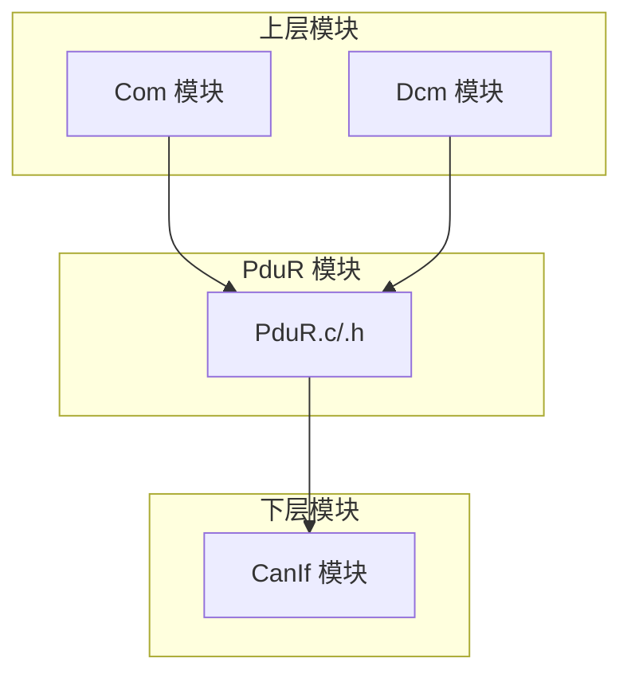
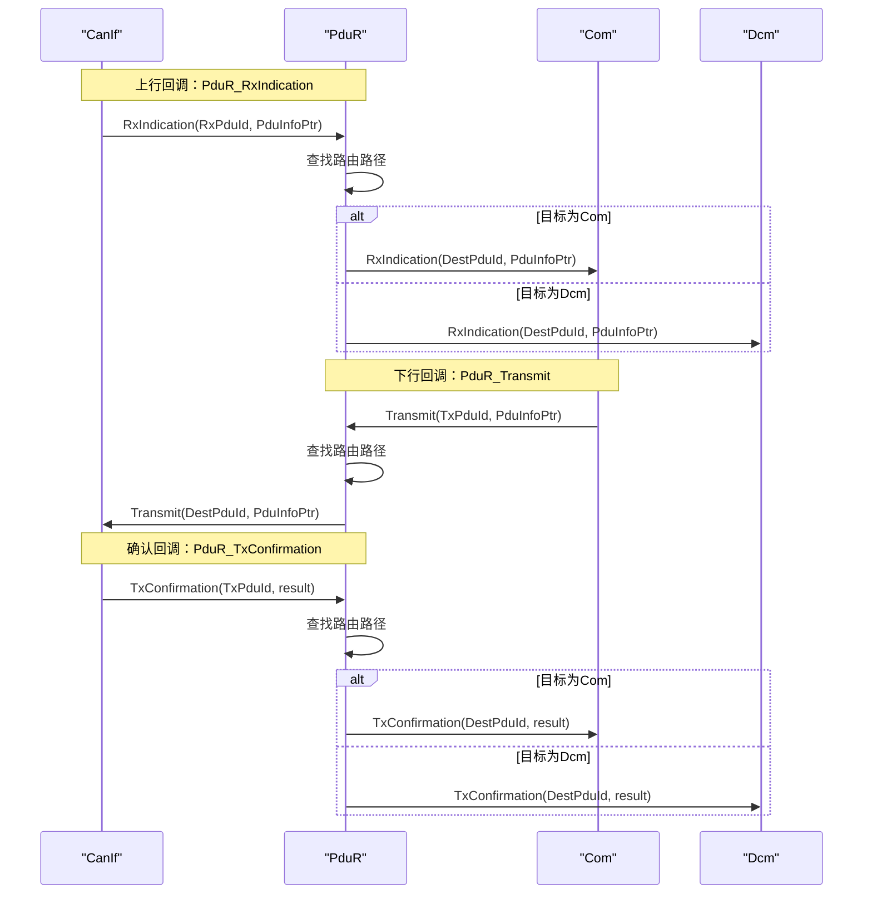
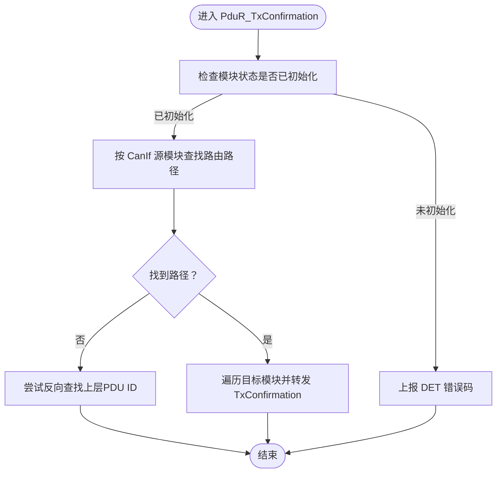
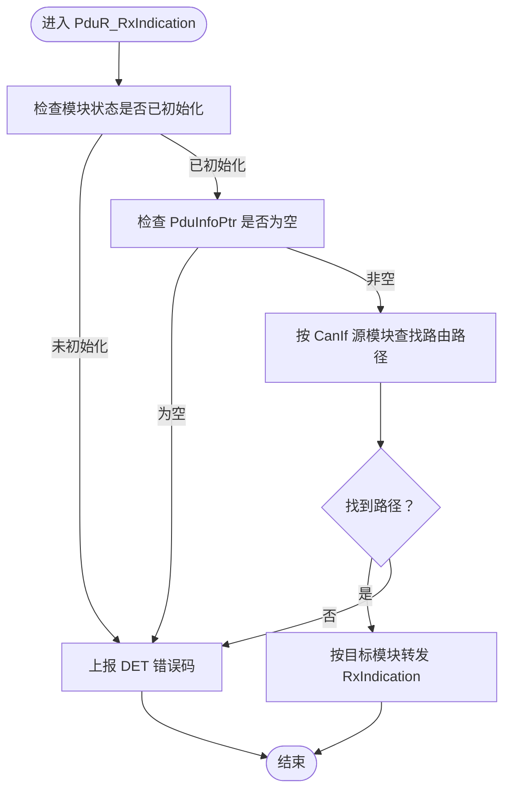
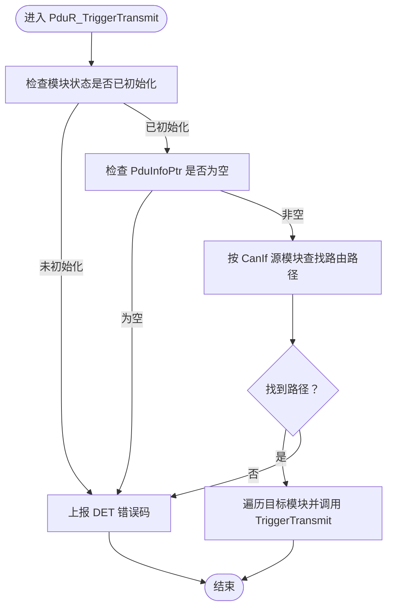
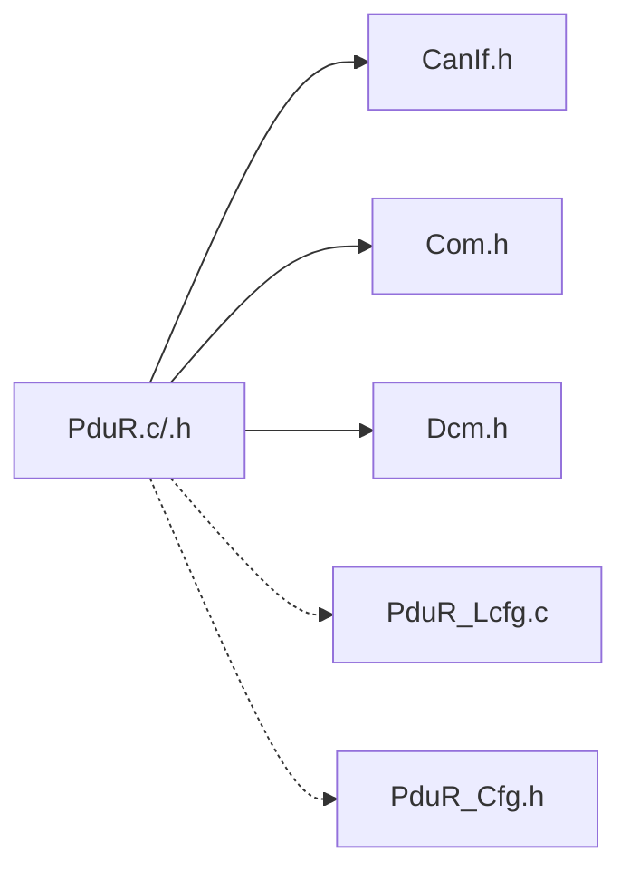

# 回调处理与接口

<cite>
**本文引用的文件**
- [PduR.h](file://src/bsw/services/pdur/include/PduR.h)
- [PduR.c](file://src/bsw/services/pdur/src/PduR.c)
- [PduR_Cfg.h](file://src/bsw/services/pdur/include/PduR_Cfg.h)
- [PduR_Lcfg.c](file://src/bsw/services/pdur/src/PduR_Lcfg.c)
- [PduR_test.c](file://src/bsw/services/pdur/src/PduR_test.c)
- [Com.h](file://src/bsw/services/com/include/Com.h)
- [Dcm.h](file://src/bsw/services/dcm/include/Dcm.h)
- [CanIf.h](file://src/bsw/ecual/canif/include/CanIf.h)
- [pdur_verification.md](file://verification/pdur_verification.md)
- [modules.md](file://docs/modules.md)
</cite>

## 目录
1. [简介](#简介)
2. [项目结构](#项目结构)
3. [核心组件](#核心组件)
4. [架构总览](#架构总览)
5. [详细组件分析](#详细组件分析)
6. [依赖分析](#依赖分析)
7. [性能考虑](#性能考虑)
8. [故障排查指南](#故障排查指南)
9. [结论](#结论)
10. [附录](#附录)

## 简介
本文件面向PduR（PDU Router）模块的回调处理与接口功能，系统性阐述以下主题：
- 回调函数调用时机与处理逻辑：PduR_TxConfirmation、PduR_RxIndication、PduR_TriggerTransmit
- 上层模块接口映射机制：Com、Dcm、CanIf等模块的API适配
- 参数修改请求PduR_ChangeParameterRequest的处理流程与参数验证机制
- 回调函数的注册、注销与错误处理策略
- 接口兼容性、版本升级与向后兼容性说明
- 回调函数实现指南、错误码定义与调试技巧

## 项目结构
PduR位于AutoSAR Service层，负责在上层（Com、Dcm）与下层（CanIf等）之间进行PDU路由与回调转发。其核心文件与配置如下：
- 头文件与实现：PduR.h、PduR.c
- 配置头与链接时配置：PduR_Cfg.h、PduR_Lcfg.c
- 单元测试：PduR_test.c
- 上层模块接口：Com.h、Dcm.h
- 下层模块接口：CanIf.h
- 验证报告：pdur_verification.md
- 模块清单与依赖：modules.md

图表来源
- [PduR.c:28-35](file://src/bsw/services/pdur/src/PduR.c#L28-L35)
- [PduR.h:237-250](file://src/bsw/services/pdur/include/PduR.h#L237-L250)
- [modules.md:340-375](file://docs/modules.md#L340-L375)

章节来源
- [PduR.h:1-282](file://src/bsw/services/pdur/include/PduR.h#L1-L282)
- [PduR.c:1-780](file://src/bsw/services/pdur/src/PduR.c#L1-L780)
- [PduR_Cfg.h:1-67](file://src/bsw/services/pdur/include/PduR_Cfg.h#L1-L67)
- [PduR_Lcfg.c:1-261](file://src/bsw/services/pdur/src/PduR_Lcfg.c#L1-L261)
- [modules.md:340-375](file://docs/modules.md#L340-L375)

## 核心组件
- PduR模块对外提供通用API（如PduR_Transmit、PduR_RxIndication、PduR_TxConfirmation、PduR_TriggerTransmit），并通过宏映射为上层模块的便捷入口（如PduR_ComTransmit、PduR_DcmTransmit、PduR_CanIfRxIndication等）。
- PduR内部维护路由路径表与运行时状态，支持直接路由、FIFO延迟路由与多目标转发；同时提供路由路径组的启用/禁用能力。
- PduR通过外部函数指针调用下层CanIf与上层Com/Dcm的回调接口，形成双向数据通路。

章节来源
- [PduR.h:168-279](file://src/bsw/services/pdur/include/PduR.h#L168-L279)
- [PduR.c:428-624](file://src/bsw/services/pdur/src/PduR.c#L428-L624)
- [PduR_Lcfg.c:114-243](file://src/bsw/services/pdur/src/PduR_Lcfg.c#L114-L243)

## 架构总览
PduR在AutoSAR分层中承担“服务层”角色，向上承接Com/Dcm，向下对接CanIf等ECUAL模块。其回调处理遵循“上行/下行”方向：
- 上行（从下层到上层）：PduR_RxIndication接收CanIf的PDU，按路由表转发至Com或Dcm
- 下行（从上层到下层）：PduR_Transmit接收Com/Dcm的PDU，按路由表转发至CanIf
- 确认与触发：PduR_TxConfirmation与PduR_TriggerTransmit分别处理发送确认与触发传输

图表来源
- [PduR.c:474-571](file://src/bsw/services/pdur/src/PduR.c#L474-L571)
- [PduR.c:428-466](file://src/bsw/services/pdur/src/PduR.c#L428-L466)
- [PduR.c:512-571](file://src/bsw/services/pdur/src/PduR.c#L512-L571)

章节来源
- [PduR.c:428-571](file://src/bsw/services/pdur/src/PduR.c#L428-L571)
- [PduR.h:256-276](file://src/bsw/services/pdur/include/PduR.h#L256-L276)

## 详细组件分析

### 回调函数：PduR_TxConfirmation
- 调用时机：来自下层CanIf的发送确认（TxConfirmation）
- 处理逻辑：
  - 查找与TxPduId对应的路由路径（源模块为CanIf）
  - 遍历路径中的目标模块，将确认转发给对应上层（Com或Dcm）
  - 若未找到路径，则尝试反向查找（上层PDU ID作为CanIf目标的情况），再转发
- 错误处理：若模块未初始化或未找到路径，根据配置可能上报DET错误码

图表来源
- [PduR.c:512-571](file://src/bsw/services/pdur/src/PduR.c#L512-L571)

章节来源
- [PduR.c:512-571](file://src/bsw/services/pdur/src/PduR.c#L512-L571)
- [PduR.h:261-261](file://src/bsw/services/pdur/include/PduR.h#L261-L261)

### 回调函数：PduR_RxIndication
- 调用时机：来自下层CanIf的接收指示（RxIndication）
- 处理逻辑：
  - 查找与RxPduId对应的路由路径（源模块为CanIf）
  - 将PDU信息按目标模块转发至Com或Dcm
- 错误处理：未初始化或PduInfoPtr为空时，根据配置上报DET错误码

图表来源
- [PduR.c:474-504](file://src/bsw/services/pdur/src/PduR.c#L474-L504)

章节来源
- [PduR.c:474-504](file://src/bsw/services/pdur/src/PduR.c#L474-L504)
- [PduR.h:268-268](file://src/bsw/services/pdur/include/PduR.h#L268-L268)

### 回调函数：PduR_TriggerTransmit
- 调用时机：来自下层CanIf的触发传输请求（TriggerTransmit）
- 处理逻辑：
  - 查找与TxPduId对应的路由路径（源模块为CanIf）
  - 遍历目标模块，调用对应上层的TriggerTransmit以提供PDU数据
- 错误处理：未初始化或PduInfoPtr为空时，根据配置上报DET错误码

图表来源
- [PduR.c:579-624](file://src/bsw/services/pdur/src/PduR.c#L579-L624)

章节来源
- [PduR.c:579-624](file://src/bsw/services/pdur/src/PduR.c#L579-L624)
- [PduR.h:276-276](file://src/bsw/services/pdur/include/PduR.h#L276-L276)

### 上层模块接口映射机制
- PduR为上层模块提供便捷宏映射：
  - PduR_ComTransmit → PduR_Transmit
  - PduR_DcmTransmit → PduR_Transmit
  - PduR_CanIfRxIndication → PduR_RxIndication
  - PduR_CanIfTxConfirmation → PduR_TxConfirmation
  - PduR_CanIfTriggerTransmit → PduR_TriggerTransmit
- 这些映射确保上层模块无需关心底层细节，直接使用PduR提供的统一接口。

章节来源
- [PduR.h:237-250](file://src/bsw/services/pdur/include/PduR.h#L237-L250)

### 参数修改请求：PduR_ChangeParameterRequest
- 当前实现：返回E_NOT_OK，表示暂不支持参数修改请求
- 处理流程与参数验证：当前未实现具体逻辑，预留扩展点
- 建议：若后续需要支持，可在实现中增加参数类型校验、目标PDU有效性检查与状态一致性判断，并通过DET上报相应错误码

章节来源
- [PduR.c:680-686](file://src/bsw/services/pdur/src/PduR.c#L680-L686)
- [PduR.h:214-214](file://src/bsw/services/pdur/include/PduR.h#L214-L214)

### 回调函数的注册、注销与错误处理策略
- 注册/注销：
  - PduR不直接“注册”上层回调；而是通过路由表与宏映射间接“绑定”上层模块
  - CanIf回调（如CanIf_Transmit、CanIf_CancelTransmit）由CanIf模块自身管理
- 错误处理：
  - DET错误检测：在开发阶段可开启，对未初始化、空指针、无效PDU ID等情况上报错误码
  - 错误码覆盖：包括参数指针错误、配置错误、请求无效、PDU ID无效、路由路径组无效、缓冲长度无效、缓冲请求失败/可用、以及各类“无请求”错误码（如LoIf/Up/LoTp相关）

章节来源
- [PduR.c:374-420](file://src/bsw/services/pdur/src/PduR.c#L374-L420)
- [PduR.h:53-71](file://src/bsw/services/pdur/include/PduR.h#L53-L71)

### 接口兼容性、版本升级与向后兼容性
- 版本信息：PduR模块提供版本信息API（在配置开启时），包含供应商ID、模块ID与软件版本号
- 向后兼容：模块提供宏别名与服务ID常量，便于在不同版本中保持接口稳定
- 验证结论：模块实现符合AutoSAR 4.x标准，功能验证通过，接口兼容性良好

章节来源
- [PduR.h:26-33](file://src/bsw/services/pdur/include/PduR.h#L26-L33)
- [PduR.c:719-739](file://src/bsw/services/pdur/src/PduR.c#L719-L739)
- [pdur_verification.md:1-129](file://verification/pdur_verification.md#L1-L129)

### 回调函数实现指南
- 实现原则：
  - 严格遵守AutoSAR回调签名，确保参数与返回值一致
  - 在回调中避免阻塞操作，必要时采用异步或延迟处理
  - 对输入参数进行有效性检查（空指针、长度、ID范围等）
- PduR侧要点：
  - 使用路由表查找目标模块，避免硬编码
  - 对多目标路径逐一转发，确保所有目标均得到处理
  - 在未初始化或异常情况下，及时上报DET错误码

章节来源
- [PduR.c:428-624](file://src/bsw/services/pdur/src/PduR.c#L428-L624)
- [PduR.h:256-276](file://src/bsw/services/pdur/include/PduR.h#L256-L276)

### 错误码定义与调试技巧
- 错误码类别：
  - 参数类：参数指针、参数配置、参数无效
  - 请求类：无效请求、缓冲长度无效、缓冲请求失败/可用
  - 路由类：PDU ID无效、路由路径组无效、路由路径未找到
  - 无请求类：LoIf/Up/LoTp相关“无请求”错误码
- 调试技巧：
  - 启用DET错误检测，定位未初始化、空指针等问题
  - 使用单元测试覆盖典型场景（初始化、NULL配置、未知PDU ID等）
  - 在回调中打印关键参数（PduId、模块类型、结果），便于追踪

章节来源
- [PduR.h:53-71](file://src/bsw/services/pdur/include/PduR.h#L53-L71)
- [PduR_test.c:136-325](file://src/bsw/services/pdur/src/PduR_test.c#L136-L325)

## 依赖分析
- 模块内依赖：
  - PduR.c通过静态函数实现内部逻辑（路由查找、FIFO管理、主函数）
  - 通过外部函数指针调用CanIf、Com、Dcm的回调
- 模块间依赖：
  - PduR依赖CanIf进行下行传输
  - PduR依赖Com/Dcm进行上行接收与确认
- 配置依赖：
  - 路由路径表与路由路径组在PduR_Lcfg.c中定义
  - 配置开关（如DEV_ERROR_DETECT、VERSION_INFO_API）在PduR_Cfg.h中控制

图表来源
- [PduR.c:28-35](file://src/bsw/services/pdur/src/PduR.c#L28-L35)
- [PduR_Lcfg.c:1-261](file://src/bsw/services/pdur/src/PduR_Lcfg.c#L1-L261)
- [PduR_Cfg.h:1-67](file://src/bsw/services/pdur/include/PduR_Cfg.h#L1-L67)

章节来源
- [modules.md:340-375](file://docs/modules.md#L340-L375)
- [PduR.c:28-35](file://src/bsw/services/pdur/src/PduR.c#L28-L35)
- [PduR_Lcfg.c:114-243](file://src/bsw/services/pdur/src/PduR_Lcfg.c#L114-L243)

## 性能考虑
- 时间复杂度：
  - 路由查找：O(n)，n为路由路径数量
  - FIFO操作：O(1)
- 空间复杂度：
  - 静态内存分配，FIFO缓冲区大小可配置
- 实时性：
  - 主函数PduR_MainFunction定期轮询FIFO队列，满足延迟路由需求

章节来源
- [pdur_verification.md:101-112](file://verification/pdur_verification.md#L101-L112)
- [PduR.c:746-772](file://src/bsw/services/pdur/src/PduR.c#L746-L772)

## 故障排查指南
- 常见问题与定位：
  - 未初始化：调用API前必须先调用PduR_Init；否则DET上报“未初始化”
  - 空指针：传入PduInfoPtr为空时，DET上报“参数指针错误”
  - 未知PDU ID：路由表中不存在该PDU ID时，返回E_NOT_OK
  - 路由路径未找到：上下行回调中若无法匹配路由路径，可能无响应或上报错误
- 单元测试参考：
  - 包含初始化、NULL配置、未知PDU ID、未初始化状态下的回调行为等用例

章节来源
- [PduR_test.c:136-325](file://src/bsw/services/pdur/src/PduR_test.c#L136-L325)
- [PduR.c:374-420](file://src/bsw/services/pdur/src/PduR.c#L374-L420)

## 结论
PduR模块实现了完整的回调处理与接口映射，具备良好的AutoSAR兼容性与可维护性。其回调函数在上下行方向上提供了清晰的处理流程，配合路由表与路由路径组，能够灵活地支持多目标转发与延迟路由。当前参数修改请求尚未实现，但保留了扩展空间。整体实现通过验证报告确认符合标准，可投入生产使用。

## 附录
- 相关文件与路径：
  - 头文件与实现：PduR.h、PduR.c
  - 配置与链接时配置：PduR_Cfg.h、PduR_Lcfg.c
  - 单元测试：PduR_test.c
  - 上层模块接口：Com.h、Dcm.h
  - 下层模块接口：CanIf.h
  - 验证报告：pdur_verification.md
  - 模块清单与依赖：modules.md