# 数据处理与缓冲

<cite>
**本文档引用的文件**
- [PduR.h](file://src/bsw/services/pdur/include/PduR.h)
- [PduR.c](file://src/bsw/services/pdur/src/PduR.c)
- [PduR_Cfg.h](file://src/bsw/services/pdur/include/PduR_Cfg.h)
- [PduR_Lcfg.c](file://src/bsw/services/pdur/src/PduR_Lcfg.c)
- [PduR_test.c](file://src/bsw/services/pdur/src/PduR_test.c)
- [ComStack_Types.h](file://src/bsw/common/ComStack_Types.h)
- [PduR_Cfg.h](file://src/bsw/config/templates/PduR_Cfg.h)
- [pdur_verification.md](file://verification/pdur_verification.md)
</cite>

## 目录
1. [简介](#简介)
2. [项目结构](#项目结构)
3. [核心组件](#核心组件)
4. [架构概览](#架构概览)
5. [详细组件分析](#详细组件分析)
6. [依赖关系分析](#依赖关系分析)
7. [性能考虑](#性能考虑)
8. [故障排除指南](#故障排除指南)
9. [结论](#结论)

## 简介

本文档深入分析了PduR（PDU Router）模块的数据处理与缓冲功能，重点解释目标PDU处理类型的即时处理和延迟处理机制，以及FIFO缓冲区的实现原理、深度配置和溢出处理策略。文档还详细说明了关键API的数据处理流程，包括SDU长度验证、缓冲区分配和释放机制，并提供了数据完整性保证、并发访问控制和内存管理的最佳实践。

PduR模块遵循AutoSAR Classic Platform 4.x标准，作为服务层组件负责在不同通信模块之间路由PDU（Protocol Data Unit），实现了灵活的路由路径配置和高效的缓冲区管理机制。

## 项目结构

PduR模块位于`src/bsw/services/pdur/`目录下，采用标准的AutoSAR分层架构：

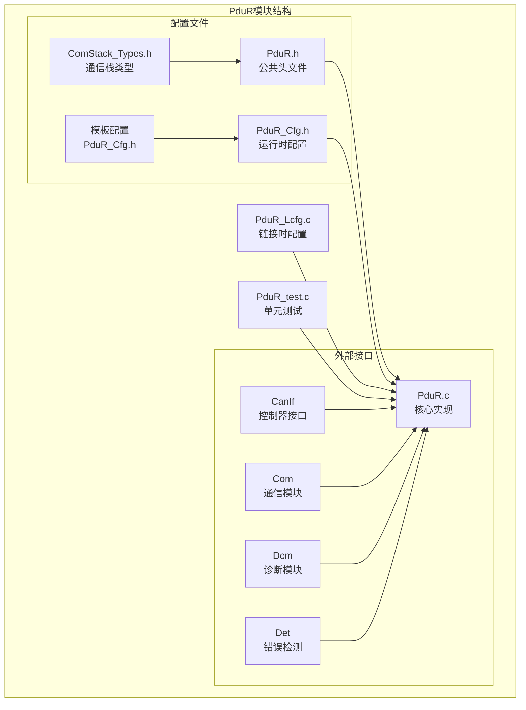

**图表来源**
- [PduR.h:1-282](file://src/bsw/services/pdur/include/PduR.h#L1-L282)
- [PduR.c:1-780](file://src/bsw/services/pdur/src/PduR.c#L1-L780)
- [PduR_Cfg.h:1-67](file://src/bsw/services/pdur/include/PduR_Cfg.h#L1-L67)

**章节来源**
- [PduR.h:1-282](file://src/bsw/services/pdur/include/PduR.h#L1-L282)
- [PduR.c:1-780](file://src/bsw/services/pdur/src/PduR.c#L1-L780)
- [PduR_Cfg.h:1-67](file://src/bsw/services/pdur/include/PduR_Cfg.h#L1-L67)

## 核心组件

### 目标PDU处理类型

PduR定义了两种目标PDU处理类型，用于控制数据传输的时机：

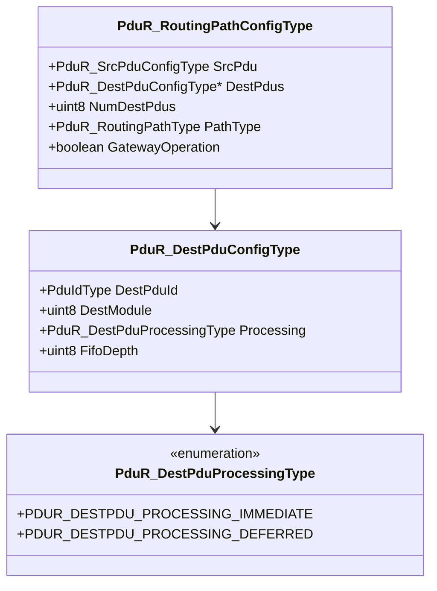

**图表来源**
- [PduR.h:94-127](file://src/bsw/services/pdur/include/PduR.h#L94-L127)

### FIFO缓冲区结构

FIFO缓冲区是PduR实现延迟处理的核心组件：

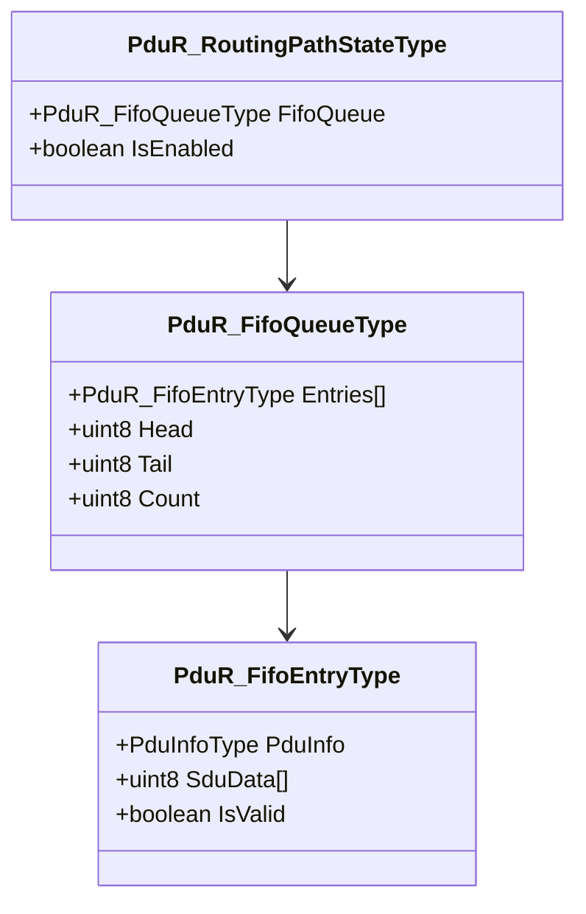

**图表来源**
- [PduR.c:64-86](file://src/bsw/services/pdur/src/PduR.c#L64-L86)

**章节来源**
- [PduR.h:94-127](file://src/bsw/services/pdur/include/PduR.h#L94-L127)
- [PduR.c:64-86](file://src/bsw/services/pdur/src/PduR.c#L64-L86)

## 架构概览

PduR模块采用分层架构设计，实现了灵活的路由机制和高效的缓冲区管理：

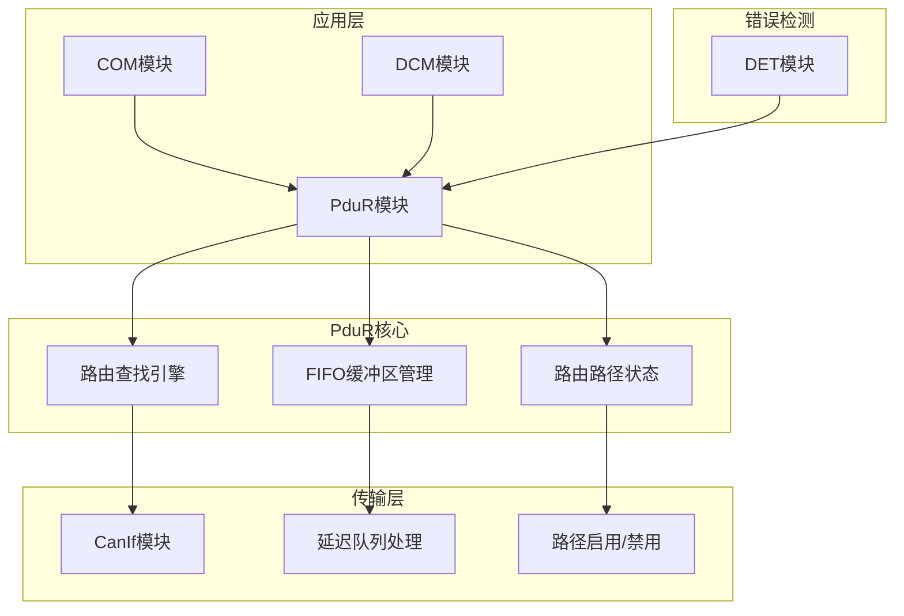

**图表来源**
- [PduR.c:28-35](file://src/bsw/services/pdur/src/PduR.c#L28-L35)
- [PduR.c:42-59](file://src/bsw/services/pdur/src/PduR.c#L42-L59)

### 关键API流程

PduR提供了完整的API集合来处理各种通信场景：

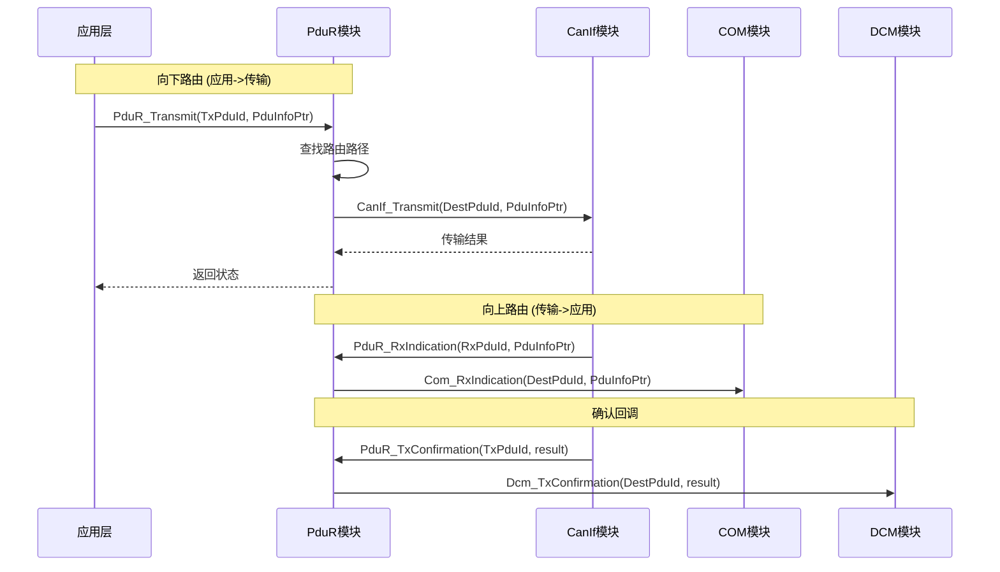

**图表来源**
- [PduR.c:428-624](file://src/bsw/services/pdur/src/PduR.c#L428-L624)
- [PduR.h:168-276](file://src/bsw/services/pdur/include/PduR.h#L168-L276)

**章节来源**
- [PduR.c:428-624](file://src/bsw/services/pdur/src/PduR.c#L428-L624)
- [PduR.h:168-276](file://src/bsw/services/pdur/include/PduR.h#L168-L276)

## 详细组件分析

### 即时处理机制

即时处理模式适用于对实时性要求较高的场景，数据直接转发而不进行缓冲：

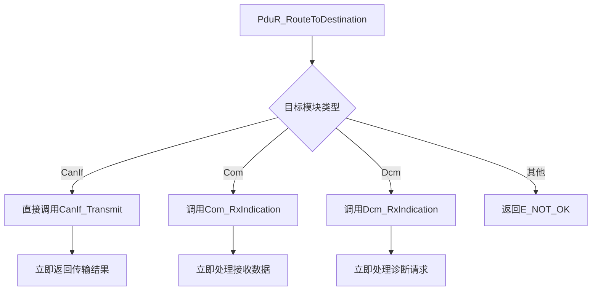

**图表来源**
- [PduR.c:191-224](file://src/bsw/services/pdur/src/PduR.c#L191-L224)

即时处理的特点：
- **零延迟**：数据直接转发，无额外等待时间
- **简单可靠**：无需缓冲区管理，减少复杂性
- **资源节省**：不占用内存缓冲区
- **适用场景**：实时性强、数据量小的应用

**章节来源**
- [PduR.c:191-224](file://src/bsw/services/pdur/src/PduR.c#L191-L224)

### 延迟处理机制

延迟处理模式通过FIFO缓冲区实现异步数据传输：

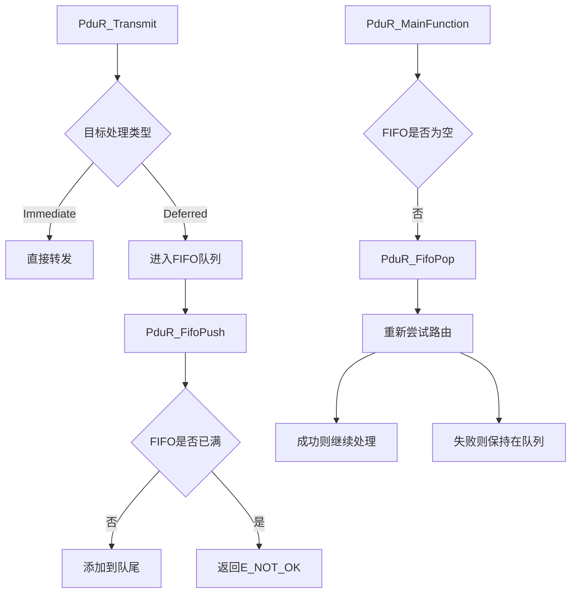

**图表来源**
- [PduR.c:253-329](file://src/bsw/services/pdur/src/PduR.c#L253-L329)
- [PduR.c:746-772](file://src/bsw/services/pdur/src/PduR.c#L746-L772)

延迟处理的优势：
- **流量整形**：平滑突发流量，避免传输拥塞
- **可靠性增强**：即使目标模块忙也能暂存数据
- **资源管理**：合理利用内存资源
- **适用场景**：高负载、间歇性传输的应用

**章节来源**
- [PduR.c:253-329](file://src/bsw/services/pdur/src/PduR.c#L253-L329)
- [PduR.c:746-772](file://src/bsw/services/pdur/src/PduR.c#L746-L772)

### FIFO缓冲区实现

FIFO缓冲区采用环形队列设计，支持动态扩展和高效管理：

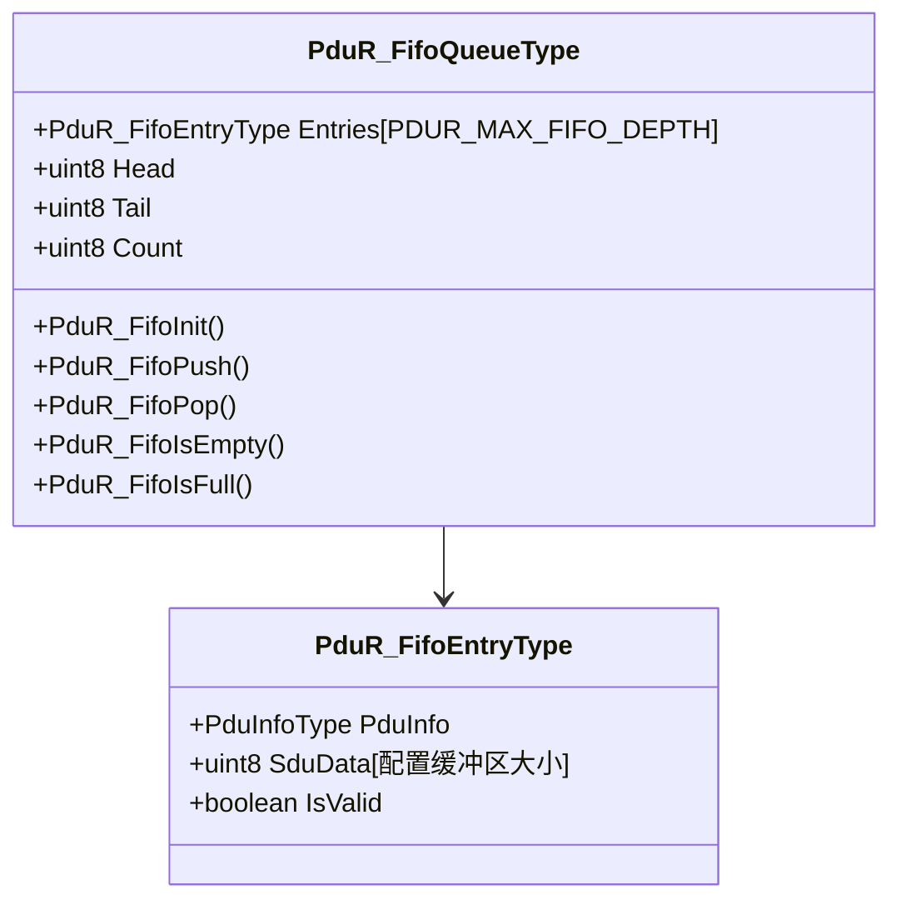

**图表来源**
- [PduR.c:64-86](file://src/bsw/services/pdur/src/PduR.c#L64-L86)

FIFO缓冲区的关键特性：

1. **环形结构**：使用模运算实现循环访问
2. **固定容量**：最大深度由配置参数决定
3. **内存复用**：单个缓冲区在多个条目间复用
4. **状态跟踪**：通过IsValid标志管理有效数据

**章节来源**
- [PduR.c:64-86](file://src/bsw/services/pdur/src/PduR.c#L64-L86)

### SDU长度验证机制

PduR实现了严格的SDU（Service Data Unit）长度验证：

```mermaid
flowchart TD
A[接收PDU数据] --> B{SDU长度验证}
B --> |长度为0| C[标记无数据]
B --> |长度>0| D{SDU长度<=缓冲区大小}
D --> |是| E[安全复制数据]
D --> |否| F[截断复制到缓冲区大小}
E --> G[更新PduInfo.SduLength]
F --> G
C --> H[设置SduDataPtr=NULL]
G --> I[标记条目有效]
H --> I
```

**图表来源**
- [PduR.c:267-279](file://src/bsw/services/pdur/src/PduR.c#L267-L279)

验证规则：
- **最小长度**：0字节表示无数据
- **最大长度**：受缓冲区容量限制
- **安全复制**：防止缓冲区溢出
- **长度一致性**：确保SDU长度与实际数据匹配

**章节来源**
- [PduR.c:267-279](file://src/bsw/services/pdur/src/PduR.c#L267-L279)

### 缓冲区分配和释放机制

PduR采用静态内存分配策略，确保确定性的内存使用：

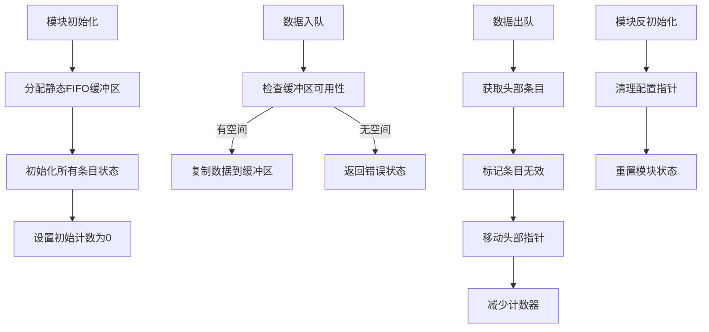

**图表来源**
- [PduR.c:230-245](file://src/bsw/services/pdur/src/PduR.c#L230-L245)
- [PduR.c:300-329](file://src/bsw/services/pdur/src/PduR.c#L300-L329)

内存管理特点：
- **静态分配**：编译时确定内存需求
- **确定性行为**：避免动态内存分配的风险
- **自动清理**：模块反初始化时自动清理
- **状态跟踪**：通过IsValid标志管理内存状态

**章节来源**
- [PduR.c:230-245](file://src/bsw/services/pdur/src/PduR.c#L230-L245)
- [PduR.c:300-329](file://src/bsw/services/pdur/src/PduR.c#L300-L329)

### 并发访问控制

PduR模块设计为单线程操作，通过以下机制确保数据完整性：

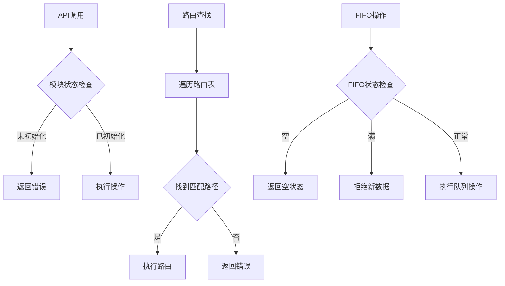

**图表来源**
- [PduR.c:433-466](file://src/bsw/services/pdur/src/PduR.c#L433-L466)
- [PduR.c:336-363](file://src/bsw/services/pdur/src/PduR.c#L336-L363)

并发控制策略：
- **状态机管理**：明确的初始化/未初始化状态
- **原子操作**：FIFO队列操作的原子性保证
- **边界检查**：严格的输入参数验证
- **错误隔离**：DET错误检测和报告

**章节来源**
- [PduR.c:433-466](file://src/bsw/services/pdur/src/PduR.c#L433-L466)
- [PduR.c:336-363](file://src/bsw/services/pdur/src/PduR.c#L336-L363)

## 依赖关系分析

PduR模块与外部组件的依赖关系：

```mermaid
graph TB
subgraph "PduR内部依赖"
A[PduR.c] --> B[PduR.h]
A --> C[PduR_Cfg.h]
A --> D[ComStack_Types.h]
A --> E[Det.h]
end
subgraph "外部接口依赖"
A --> F[CanIf_Transmit]
A --> G[CanIf_CancelTransmit]
A --> H[Com_RxIndication]
A --> I[Com_TxConfirmation]
A --> J[Dcm_RxIndication]
A --> K[Dcm_TxConfirmation]
end
subgraph "配置依赖"
L[PduR_Lcfg.c] --> B
M[PduR_Cfg.h] --> B
N[PduR_Cfg.h] --> O[PduR_Cfg.h(模板)]
end
```

**图表来源**
- [PduR.c:19-23](file://src/bsw/services/pdur/src/PduR.c#L19-L23)
- [PduR.c:28-35](file://src/bsw/services/pdur/src/PduR.c#L28-L35)

**章节来源**
- [PduR.c:19-23](file://src/bsw/services/pdur/src/PduR.c#L19-L23)
- [PduR.c:28-35](file://src/bsw/services/pdur/src/PduR.c#L28-L35)

### 关键API数据流

#### PduR_Transmit数据处理流程

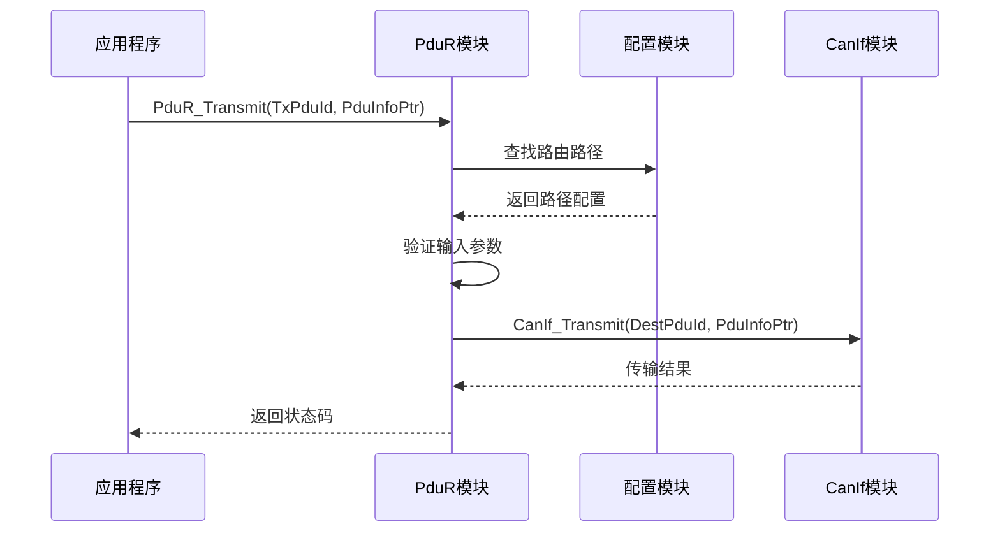

**图表来源**
- [PduR.c:428-466](file://src/bsw/services/pdur/src/PduR.c#L428-L466)

#### PduR_CancelTransmitRequest处理流程

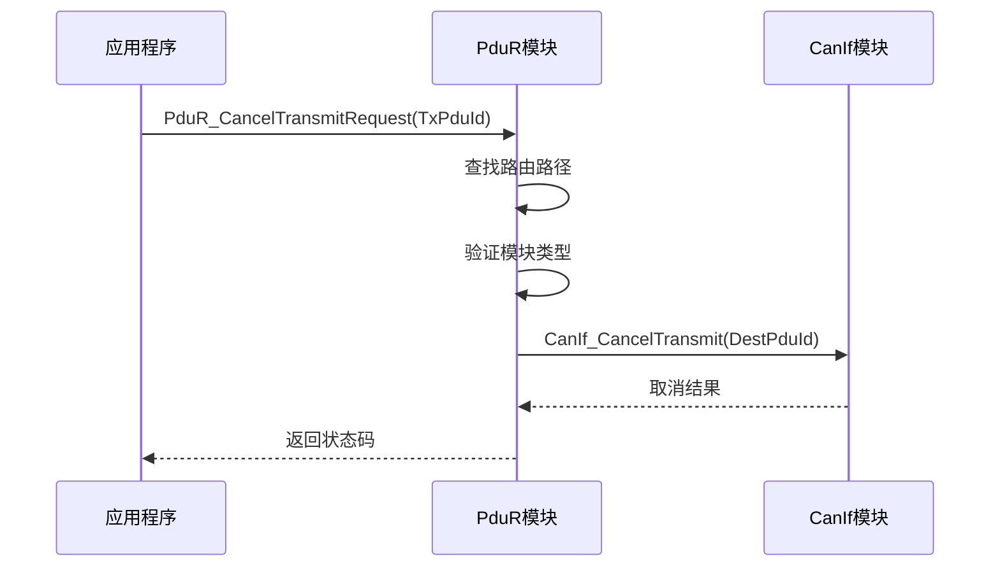

**图表来源**
- [PduR.c:631-660](file://src/bsw/services/pdur/src/PduR.c#L631-L660)

#### PduR_CancelReceiveRequest处理流程

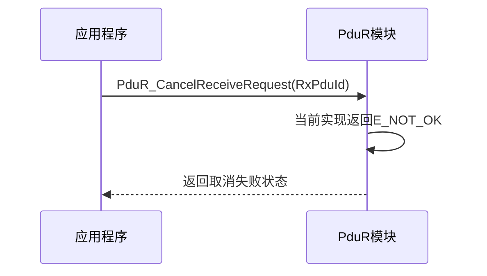

**图表来源**
- [PduR.c:667-671](file://src/bsw/services/pdur/src/PduR.c#L667-L671)

**章节来源**
- [PduR.c:428-466](file://src/bsw/services/pdur/src/PduR.c#L428-L466)
- [PduR.c:631-660](file://src/bsw/services/pdur/src/PduR.c#L631-L660)
- [PduR.c:667-671](file://src/bsw/services/pdur/src/PduR.c#L667-L671)

## 性能考虑

### 内存使用统计

PduR模块的内存使用具有确定性特征：

| 组件 | 内存用途 | 数量 | 总计 |
|------|----------|------|------|
| FIFO队列 | 条目结构体 | PDUR_MAX_FIFO_DEPTH × 1 | N × 24字节 |
| FIFO数据缓冲 | SDU数据缓冲 | PDUR_MAX_FIFO_DEPTH × PDUR_MAX_DESTINATIONS_PER_PATH × 8 | N × M × 8字节 |
| 路由路径状态 | 状态结构体 | PDUR_NUMBER_OF_ROUTING_PATHS × 1 | K × 8字节 |
| 配置指针 | 指针数组 | PDUR_NUMBER_OF_ROUTING_PATHS × 1 | K × 4字节 |

### 性能指标

1. **路由查找复杂度**：O(n)，其中n为路由路径数量
2. **FIFO操作复杂度**：O(1)，常数时间操作
3. **内存访问模式**：顺序访问，缓存友好
4. **中断处理**：无动态内存分配，中断安全

### 缓冲区利用率统计

```mermaid
flowchart TD
A[缓冲区使用率计算] --> B{当前队列深度}
B --> C{最大队列深度}
C --> D[使用率 = (当前深度/最大深度) × 100%]
E[性能监控指标] --> F[平均队列长度]
E --> G[峰值队列长度]
E --> H[溢出次数统计]
E --> I[处理延迟分布]
```

**图表来源**
- [PduR.c:746-772](file://src/bsw/services/pdur/src/PduR.c#L746-L772)

## 故障排除指南

### 常见错误类型

PduR模块定义了完整的错误检测机制：

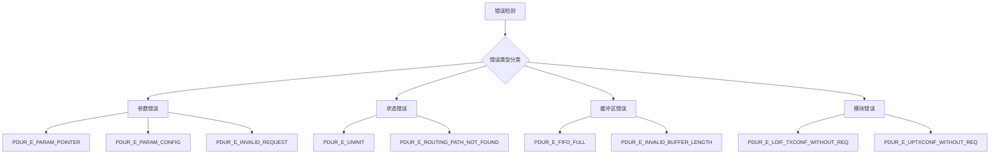

**图表来源**
- [PduR.h:53-71](file://src/bsw/services/pdur/include/PduR.h#L53-L71)
- [PduR.c:43-45](file://src/bsw/services/pdur/src/PduR.c#L43-L45)

### 内存泄漏防护措施

PduR模块采用静态内存分配策略，天然具备内存泄漏防护：

1. **编译时内存分配**：所有内存都在编译时确定
2. **确定性生命周期**：模块初始化时分配，反初始化时释放
3. **无动态分配**：避免malloc/free带来的风险
4. **状态跟踪**：通过IsValid标志管理内存状态

### 性能监控最佳实践

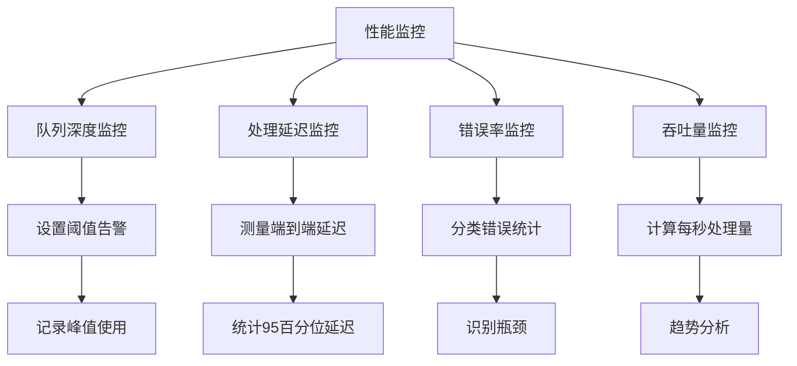

**章节来源**
- [PduR.h:53-71](file://src/bsw/services/pdur/include/PduR.h#L53-L71)
- [PduR.c:43-45](file://src/bsw/services/pdur/src/PduR.c#L43-L45)

## 结论

PduR模块实现了高效、可靠的PDU路由功能，其核心优势包括：

1. **灵活的处理模式**：即时处理和延迟处理相结合，适应不同的应用场景
2. **高效的缓冲区管理**：环形FIFO队列设计，支持动态扩展和高效管理
3. **严格的质量保证**：完整的错误检测、内存管理和性能监控机制
4. **确定性的行为**：静态内存分配和状态机设计，确保实时性要求

该模块的设计充分考虑了AutoSAR标准的要求，在保证功能完整性的同时，提供了良好的性能表现和可维护性。通过合理的配置和监控，PduR模块能够稳定地支持复杂的车载网络通信需求。