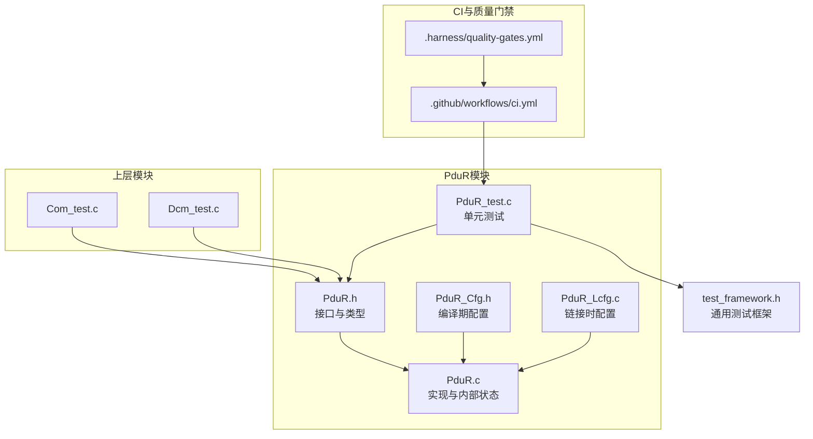
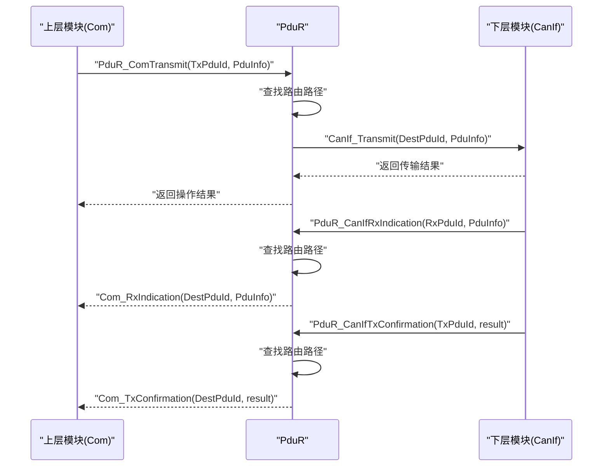
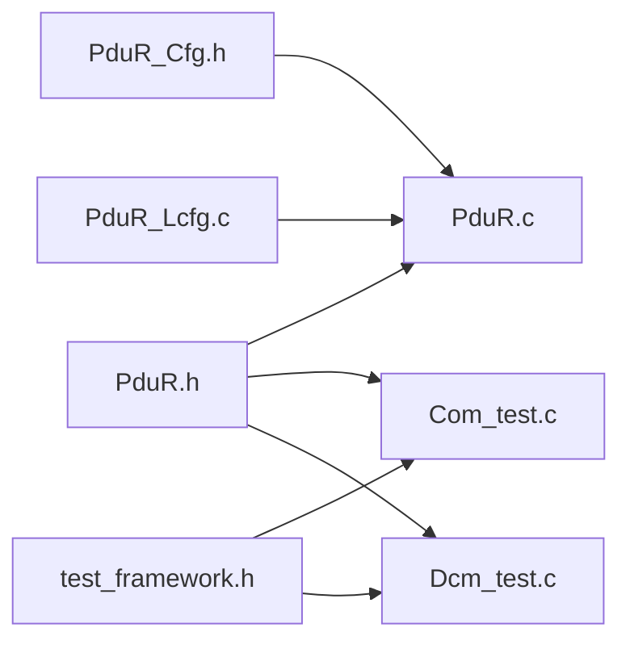

# 测试验证与调试

<cite>
**本文引用的文件列表**
- [PduR.h](file://src/bsw/services/pdur/include/PduR.h)
- [PduR.c](file://src/bsw/services/pdur/src/PduR.c)
- [PduR_Cfg.h](file://src/bsw/services/pdur/include/PduR_Cfg.h)
- [PduR_Lcfg.c](file://src/bsw/services/pdur/src/PduR_Lcfg.c)
- [PduR_test.c](file://src/bsw/services/pdur/src/PduR_test.c)
- [test_framework.h](file://tests/unit/test_framework.h)
- [pdur_verification.md](file://verification/pdur_verification.md)
- [ci.yml](file://.github/workflows/ci.yml)
- [quality-gates.yml](file://.harness/quality-gates.yml)
- [Com_test.c](file://src/bsw/services/com/src/Com_test.c)
- [Dcm_test.c](file://src/bsw/services/dcm/src/Dcm_test.c)
- [README.md](file://README.md)
</cite>

## 目录
1. [简介](#简介)
2. [项目结构](#项目结构)
3. [核心组件](#核心组件)
4. [架构总览](#架构总览)
5. [详细组件分析](#详细组件分析)
6. [依赖关系分析](#依赖关系分析)
7. [性能考量](#性能考量)
8. [故障排查指南](#故障排查指南)
9. [结论](#结论)
10. [附录](#附录)

## 简介
本文件面向PduR（PDU路由器）模块，提供一套完整的测试验证与调试方案。内容涵盖单元测试策略、测试用例设计、覆盖率要求、测试框架使用、测试数据准备与环境配置、典型测试场景（正常路径、异常处理、边界条件、压力测试）、调试工具与日志分析、性能基准测试、测试报告生成、缺陷跟踪与回归流程，以及测试自动化脚本与持续集成配置及质量门禁标准。

## 项目结构
围绕PduR模块的相关文件组织如下：
- 头文件与实现：PduR接口、内部实现、配置与链接时配置
- 单元测试：PduR单元测试、通用测试框架、上层模块（Com、Dcm）测试
- 验证报告：PduR模块验证报告
- 持续集成与质量门禁：CI流水线、Harness质量门禁配置

图表来源
- [PduR.h:1-282](file://src/bsw/services/pdur/include/PduR.h#L1-L282)
- [PduR.c:1-780](file://src/bsw/services/pdur/src/PduR.c#L1-L780)
- [PduR_Cfg.h:1-67](file://src/bsw/services/pdur/include/PduR_Cfg.h#L1-L67)
- [PduR_Lcfg.c:1-261](file://src/bsw/services/pdur/src/PduR_Lcfg.c#L1-L261)
- [PduR_test.c:1-325](file://src/bsw/services/pdur/src/PduR_test.c#L1-L325)
- [test_framework.h:1-141](file://tests/unit/test_framework.h#L1-L141)
- [Com_test.c:1-394](file://src/bsw/services/com/src/Com_test.c#L1-L394)
- [Dcm_test.c:1-274](file://src/bsw/services/dcm/src/Dcm_test.c#L1-L274)
- [ci.yml:1-144](file://.github/workflows/ci.yml#L1-L144)
- [quality-gates.yml:1-274](file://.harness/quality-gates.yml#L1-L274)

章节来源
- [PduR.h:1-282](file://src/bsw/services/pdur/include/PduR.h#L1-L282)
- [PduR.c:1-780](file://src/bsw/services/pdur/src/PduR.c#L1-L780)
- [PduR_Cfg.h:1-67](file://src/bsw/services/pdur/include/PduR_Cfg.h#L1-L67)
- [PduR_Lcfg.c:1-261](file://src/bsw/services/pdur/src/PduR_Lcfg.c#L1-L261)
- [PduR_test.c:1-325](file://src/bsw/services/pdur/src/PduR_test.c#L1-L325)
- [test_framework.h:1-141](file://tests/unit/test_framework.h#L1-L141)
- [Com_test.c:1-394](file://src/bsw/services/com/src/Com_test.c#L1-L394)
- [Dcm_test.c:1-274](file://src/bsw/services/dcm/src/Dcm_test.c#L1-L274)
- [ci.yml:1-144](file://.github/workflows/ci.yml#L1-L144)
- [quality-gates.yml:1-274](file://.harness/quality-gates.yml#L1-L274)

## 核心组件
- 接口与类型定义：PduR对外API、错误码、返回类型、路由路径类型、配置结构等
- 实现与内部状态：模块状态机、路由查找、向上/向下路由、FIFO队列、主函数处理
- 配置与链接时配置：编译期开关、路由路径、路由组、模块ID、PDU ID、FIFO深度等
- 单元测试：覆盖初始化、错误检测、路由转发、回调、版本信息、未知PDU等
- 通用测试框架：断言宏、测试运行器、统计输出
- 验证报告：功能验证、代码质量、接口兼容性、性能评估
- CI与质量门禁：静态分析、测试、覆盖率阈值、架构检查、安全检查

章节来源
- [PduR.h:35-282](file://src/bsw/services/pdur/include/PduR.h#L35-L282)
- [PduR.c:47-772](file://src/bsw/services/pdur/src/PduR.c#L47-L772)
- [PduR_Cfg.h:14-67](file://src/bsw/services/pdur/include/PduR_Cfg.h#L14-L67)
- [PduR_Lcfg.c:36-253](file://src/bsw/services/pdur/src/PduR_Lcfg.c#L36-L253)
- [PduR_test.c:13-325](file://src/bsw/services/pdur/src/PduR_test.c#L13-L325)
- [test_framework.h:18-141](file://tests/unit/test_framework.h#L18-L141)
- [pdur_verification.md:1-129](file://verification/pdur_verification.md#L1-L129)

## 架构总览
PduR作为服务层模块，负责在上层（COM/DCM）与下层（CanIf等）之间进行PDU路由。其核心流程包括：
- 初始化：加载配置、初始化路径状态与FIFO
- 向下路由（Transmit）：根据源模块与PDU ID查找路径，转发至目标模块
- 向上路由（RxIndication）：接收下层PDU，按路径转发至上层
- 回调处理（TxConfirmation/TriggerTransmit）：将下层回调转发至上层或触发上层发送
- 主函数（MainFunction）：处理延迟路由，从FIFO中取出待发送PDU并重试路由

图表来源
- [PduR.h:168-276](file://src/bsw/services/pdur/include/PduR.h#L168-L276)
- [PduR.c:428-571](file://src/bsw/services/pdur/src/PduR.c#L428-L571)

## 详细组件分析

### PduR接口与类型
- 服务ID与错误码：定义了模块内所有API的服务ID与错误码，便于DET上报与测试断言
- 返回类型：统一返回类型，便于上层判断操作结果
- 路由路径类型：支持直连、FIFO、网关三种路径类型
- 配置结构：包含路由路径数组、路由路径组、DEV错误检测与版本信息API开关

章节来源
- [PduR.h:35-149](file://src/bsw/services/pdur/include/PduR.h#L35-L149)

### PduR内部实现与状态
- 模块状态：未初始化/已初始化
- 路由查找：根据PDU ID与源模块类型匹配路由路径
- 向下路由：遍历目标模块并调用对应接口
- 向上路由：接收下层PDU并转发至上层
- FIFO队列：固定容量队列，支持入队/出队/满/空检测
- 主函数：周期性处理延迟路由，从FIFO重试发送

章节来源
- [PduR.c:47-772](file://src/bsw/services/pdur/src/PduR.c#L47-L772)

### 配置与链接时配置
- 编译期配置：错误检测开关、版本信息API开关、路由路径数量、最大目标数、FIFO深度等
- 链接时配置：具体路由路径、目标PDU配置、路由路径组、默认启用状态等
- PDU ID与模块ID：定义了COM/DCM与CanIf之间的映射关系

章节来源
- [PduR_Cfg.h:14-67](file://src/bsw/services/pdur/include/PduR_Cfg.h#L14-L67)
- [PduR_Lcfg.c:36-253](file://src/bsw/services/pdur/src/PduR_Lcfg.c#L36-L253)

### 单元测试策略与用例设计
- 测试框架：提供断言宏、测试运行器、统计输出，便于编写与运行测试
- Mock策略：对上层（Com/Dcm）与下层（CanIf）接口进行Mock，隔离被测模块
- 覆盖范围：初始化、错误检测、路由转发、回调、版本信息、未知PDU等
- 断言点：调用次数、参数值、返回值、DET错误码等

章节来源
- [test_framework.h:18-141](file://tests/unit/test_framework.h#L18-L141)
- [PduR_test.c:13-325](file://src/bsw/services/pdur/src/PduR_test.c#L13-L325)

### 测试用例设计
- 初始化测试：有效配置初始化成功；空配置触发DET错误
- 路由转发测试：Com发送PDU路由至CanIf；CanIf接收PDU路由至上层
- 异常处理测试：未初始化状态下的操作触发DET错误；空指针参数触发DET错误
- 版本信息测试：GetVersionInfo返回正确版本号
- 边界条件测试：未知PDU ID返回失败
- 回调测试：TxConfirmation与TriggerTransmit回调正确转发

章节来源
- [PduR_test.c:136-306](file://src/bsw/services/pdur/src/PduR_test.c#L136-L306)

### 调试工具与日志分析
- DET错误上报：通过Det_ReportError上报错误，便于定位问题
- 日志输出：测试框架输出测试结果统计，便于快速定位失败用例
- 回调验证：通过Mock变量记录回调参数与调用次数，辅助调试

章节来源
- [PduR_test.c:98-130](file://src/bsw/services/pdur/src/PduR_test.c#L98-L130)
- [test_framework.h:122-138](file://tests/unit/test_framework.h#L122-L138)

### 性能基准测试
- 时间复杂度：路由查找O(n)，FIFO操作O(1)
- 空间复杂度：静态内存分配，FIFO缓冲区大小可配置
- 主函数周期：可配置周期，用于处理延迟路由

章节来源
- [pdur_verification.md:101-112](file://verification/pdur_verification.md#L101-L112)
- [PduR_Cfg.h:62-64](file://src/bsw/services/pdur/include/PduR_Cfg.h#L62-L64)

### 常见测试场景
- 正常路径测试：初始化成功、路由转发成功、版本信息返回正确
- 异常处理测试：未初始化、空指针、未知PDU ID等
- 边界条件测试：FIFO满/空、无效路由路径
- 压力测试：大量PDU进入FIFO，验证主函数周期处理能力

章节来源
- [PduR_test.c:136-306](file://src/bsw/services/pdur/src/PduR_test.c#L136-L306)
- [PduR.c:746-772](file://src/bsw/services/pdur/src/PduR.c#L746-L772)

### 测试报告生成与缺陷跟踪
- 测试报告：测试框架输出统计信息，便于生成报告
- 缺陷跟踪：结合DET错误码与Mock变量，快速定位缺陷
- 回归测试：新增用例后重新运行全部用例，确保回归通过

章节来源
- [test_framework.h:122-138](file://tests/unit/test_framework.h#L122-L138)
- [PduR_test.c:311-325](file://src/bsw/services/pdur/src/PduR_test.c#L311-L325)

### 测试自动化脚本与持续集成
- CI流水线：构建BSW、静态分析、运行单元测试、生成文档、发布包
- 质量门禁：静态分析、MISRA检查、复杂度检查、代码风格、测试覆盖率、安全检查、架构检查、文档检查
- 覆盖率要求：服务层语句/分支/函数/MC/DC覆盖率阈值

章节来源
- [ci.yml:1-144](file://.github/workflows/ci.yml#L1-L144)
- [quality-gates.yml:123-145](file://.harness/quality-gates.yml#L123-L145)

## 依赖关系分析
PduR模块的依赖关系如下：
- 外部接口：CanIf、Com、Dcm、Det、MemMap
- 内部依赖：配置头文件、链接时配置、通用类型与返回类型
- 测试依赖：通用测试框架、上层模块测试（Com、Dcm）

图表来源
- [PduR.c:19-36](file://src/bsw/services/pdur/src/PduR.c#L19-L36)
- [PduR.h:18-22](file://src/bsw/services/pdur/include/PduR.h#L18-L22)
- [PduR_Cfg.h:14-67](file://src/bsw/services/pdur/include/PduR_Cfg.h#L14-L67)
- [PduR_Lcfg.c:16-17](file://src/bsw/services/pdur/src/PduR_Lcfg.c#L16-L17)
- [test_framework.h:15-16](file://tests/unit/test_framework.h#L15-L16)
- [Com_test.c:14-15](file://src/bsw/services/com/src/Com_test.c#L14-L15)
- [Dcm_test.c:14-15](file://src/bsw/services/dcm/src/Dcm_test.c#L14-L15)

## 性能考量
- 路由查找：线性扫描路由路径，时间复杂度O(n)
- FIFO处理：入队/出队均为O(1)，适合实时处理
- 内存占用：静态分配，FIFO大小可配置，满足嵌入式资源限制
- 主函数周期：可配置周期，平衡实时性与CPU占用

章节来源
- [pdur_verification.md:101-112](file://verification/pdur_verification.md#L101-L112)
- [PduR.c:746-772](file://src/bsw/services/pdur/src/PduR.c#L746-L772)

## 故障排查指南
- 初始化失败：检查配置指针是否为空；确认配置结构与链接时配置一致
- 路由失败：确认PDU ID与模块类型匹配；检查路由路径是否存在
- 回调异常：确认回调函数签名与调用时机；检查上层模块是否正确注册
- DET错误：根据错误码定位问题；查看测试用例中的错误断言
- 性能问题：检查主函数周期与FIFO深度；评估路由路径数量

章节来源
- [PduR_test.c:147-159](file://src/bsw/services/pdur/src/PduR_test.c#L147-L159)
- [PduR_test.c:228-239](file://src/bsw/services/pdur/src/PduR_test.c#L228-L239)
- [PduR_test.c:255-267](file://src/bsw/services/pdur/src/PduR_test.c#L255-L267)

## 结论
PduR模块实现了AutoSAR 4.x标准的PDU路由器功能，具备完善的错误检测、路由转发与回调处理能力。单元测试覆盖初始化、路由转发、回调、版本信息与异常处理等关键路径，并通过CI与质量门禁保障代码质量与覆盖率。建议在后续迭代中考虑路由路径缓存与更丰富的路由算法以进一步提升性能与灵活性。

## 附录

### 测试覆盖率要求（服务层）
- 语句覆盖率：≥85%
- 分支覆盖率：≥80%
- 函数覆盖率：100%
- MC/DC覆盖率：100%

章节来源
- [quality-gates.yml:123-145](file://.harness/quality-gates.yml#L123-L145)

### 测试环境配置
- 构建工具：CMake + ARM GCC
- Python工具：用于静态分析与代码生成
- 单元测试：GCC编译测试文件，运行测试框架

章节来源
- [ci.yml:26-36](file://.github/workflows/ci.yml#L26-L36)
- [ci.yml:77-88](file://.github/workflows/ci.yml#L77-L88)
- [README.md:95-133](file://README.md#L95-L133)

### 质量门禁标准
- 静态分析：cppcheck，禁止信息类警告
- MISRA C:2012：必须遵守规则与建议规则
- 复杂度：圈复杂度≤10，函数行数≤50，文件行数≤500
- 代码风格：命名规范、格式化、注释比例
- 安全检查：缓冲区溢出、空指针、整数溢出、use-after-free、格式串
- 架构检查：分层依赖、无循环依赖、接口使用、无直接硬件访问
- 文档检查：文件头、函数文档、类型文档、宏文档

章节来源
- [quality-gates.yml:6-274](file://.harness/quality-gates.yml#L6-L274)