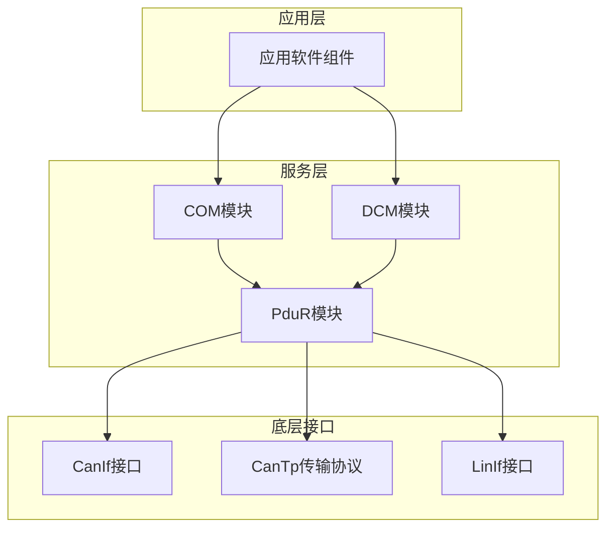
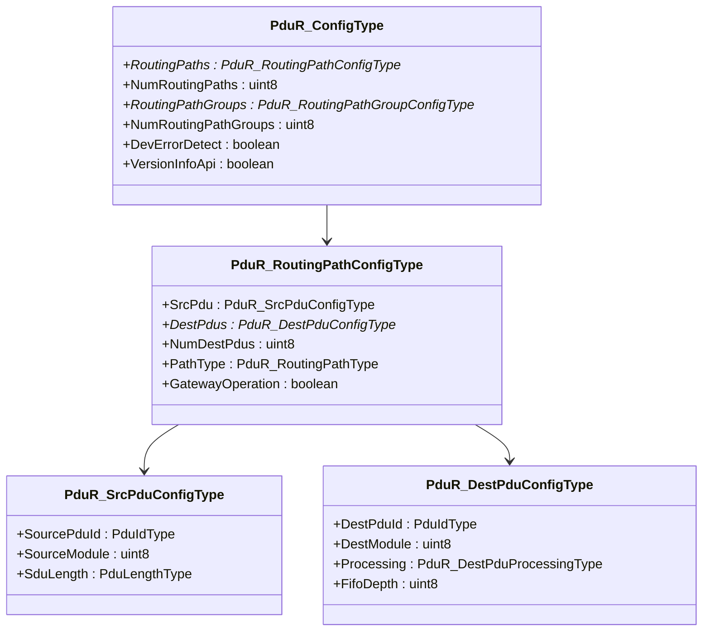
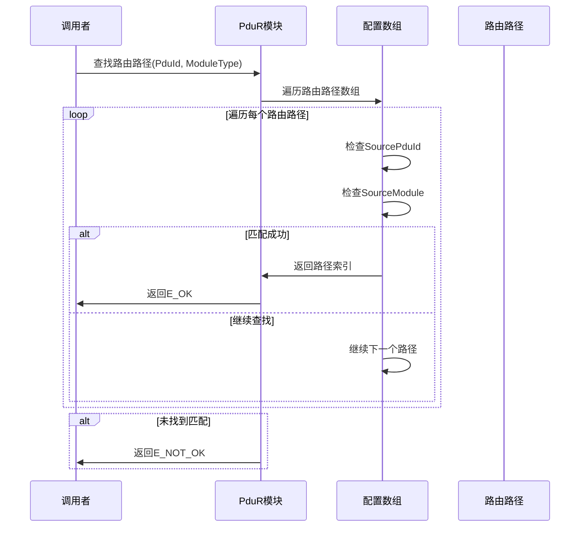
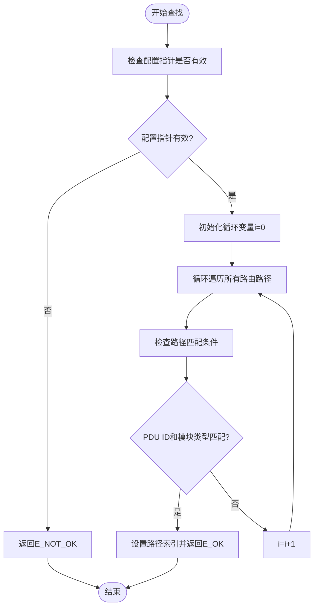
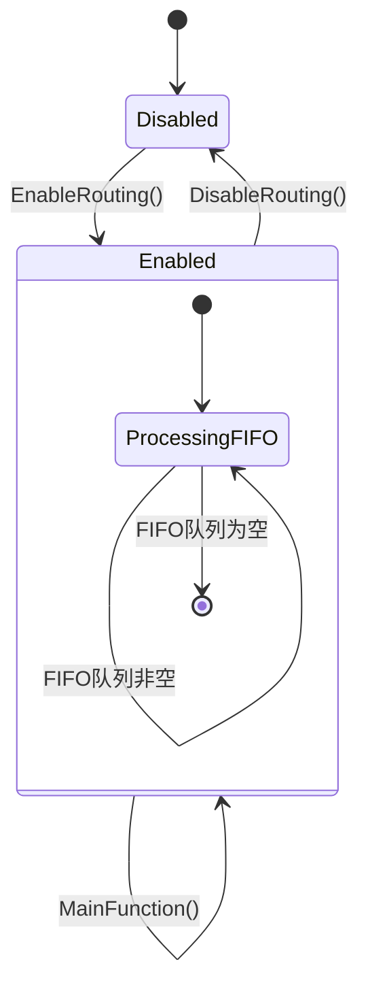
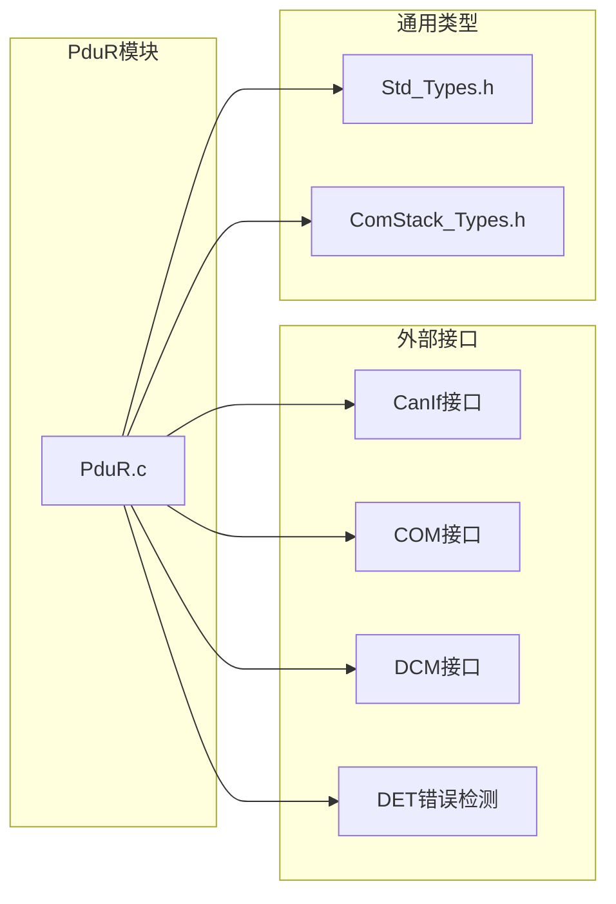

# 路径查找算法

<cite>
**本文档引用的文件**
- [PduR.h](file://src/bsw/services/pdur/include/PduR.h)
- [PduR_Cfg.h](file://src/bsw/services/pdur/include/PduR_Cfg.h)
- [PduR.c](file://src/bsw/services/pdur/src/PduR.c)
- [PduR_Lcfg.c](file://src/bsw/services/pdur/src/PduR_Lcfg.c)
- [PduR_test.c](file://src/bsw/services/pdur/src/PduR_test.c)
- [ComStack_Types.h](file://src/bsw/ecual/include/ComStack_Types.h)
- [Std_Types.h](file://src/bsw/os/include/Std_Types.h)
- [PduR_Cfg.h](file://src/bsw/config/templates/PduR_Cfg.h)
- [pdur_verification.md](file://verification/pdur_verification.md)
</cite>

## 目录
1. [简介](#简介)
2. [项目结构](#项目结构)
3. [核心组件](#核心组件)
4. [架构概览](#架构概览)
5. [详细组件分析](#详细组件分析)
6. [依赖关系分析](#依赖关系分析)
7. [性能考虑](#性能考虑)
8. [故障排除指南](#故障排除指南)
9. [结论](#结论)

## 简介

PduR（PDU Router）路径查找算法是AUTOSAR经典平台4.x标准中通信栈的关键组件，负责在不同通信模块之间路由PDU（Protocol Data Unit）。该算法实现了高效的路径查找机制，支持多种路由路径类型和动态路径切换功能。

本文档深入分析PduR路径查找算法的核心实现，包括PduIdType到路由路径的映射机制、路径优先级处理逻辑和动态路径切换算法。同时详细说明路径查找的数据结构设计、查找效率优化策略和缓存机制，以及PduR_SrcPduConfigType和PduR_DestPduConfigType在路径查找中的关键作用。

## 项目结构

PduR模块位于服务层，采用AutoSAR标准的分层架构设计：

**图表来源**
- [PduR.h:1-282](file://src/bsw/services/pdur/include/PduR.h#L1-L282)
- [PduR.c:1-780](file://src/bsw/services/pdur/src/PduR.c#L1-L780)

**章节来源**
- [PduR.h:1-282](file://src/bsw/services/pdur/include/PduR.h#L1-L282)
- [PduR.c:1-780](file://src/bsw/services/pdur/src/PduR.c#L1-L780)

## 核心组件

### 数据结构设计

PduR模块的核心数据结构包括：

#### 路由路径配置结构

**图表来源**
- [PduR.h:100-149](file://src/bsw/services/pdur/include/PduR.h#L100-L149)

#### 路径查找算法实现

路径查找算法的核心实现位于`PduR_FindRoutingPath`函数中：

**章节来源**
- [PduR.h:100-149](file://src/bsw/services/pdur/include/PduR.h#L100-L149)
- [PduR.c:132-154](file://src/bsw/services/pdur/src/PduR.c#L132-L154)

## 架构概览

PduR路径查找算法采用线性搜索策略，通过比较PDU ID和模块类型来定位对应的路由路径：

**图表来源**
- [PduR.c:132-154](file://src/bsw/services/pdur/src/PduR.c#L132-L154)

### 路径优先级处理逻辑

当前实现采用简单的线性搜索，第一个匹配的路径即被选择。这种设计具有以下特点：

1. **确定性**: 搜索顺序固定，结果可预测
2. **简单性**: 实现逻辑简洁，易于理解和维护
3. **扩展性**: 可以通过调整配置数组顺序来实现优先级控制

**章节来源**
- [PduR.c:132-154](file://src/bsw/services/pdur/src/PduR.c#L132-L154)

## 详细组件分析

### 路径查找算法实现

#### 核心查找函数

**图表来源**
- [PduR.c:132-154](file://src/bsw/services/pdur/src/PduR.c#L132-L154)

#### 匹配条件分析

路径匹配采用双重条件检查：
1. **PDU ID匹配**: `configPtr->RoutingPaths[i].SrcPdu.SourcePduId == PduId`
2. **模块类型匹配**: `configPtr->RoutingPaths[i].SrcPdu.SourceModule == ModuleType`

这种设计确保了精确的路径定位，避免了错误的路由。

**章节来源**
- [PduR.c:132-154](file://src/bsw/services/pdur/src/PduR.c#L132-L154)

### 动态路径切换算法

PduR模块支持运行时的路径组启用/禁用功能：

**图表来源**
- [PduR.c:693-712](file://src/bsw/services/pdur/src/PduR.c#L693-L712)
- [PduR.c:746-772](file://src/bsw/services/pdur/src/PduR.c#L746-L772)

#### 路径组管理

路径组功能允许按组启用或禁用路由路径：

**章节来源**
- [PduR.c:693-712](file://src/bsw/services/pdur/src/PduR.c#L693-L712)
- [PduR_Lcfg.c:218-243](file://src/bsw/services/pdur/src/PduR_Lcfg.c#L218-L243)

### 缓存机制分析

当前实现采用静态配置数组，未实现专用的路径查找缓存。但存在以下潜在优化点：

1. **最近使用路径缓存**: 缓存最近使用的路径查找结果
2. **哈希表优化**: 使用哈希表加速PDU ID到路径的映射
3. **前缀树结构**: 对于大量PDU ID，可考虑使用前缀树优化

**章节来源**
- [PduR.c:132-154](file://src/bsw/services/pdur/src/PduR.c#L132-L154)

## 依赖关系分析

### 外部依赖关系

**图表来源**
- [PduR.c:28-35](file://src/bsw/services/pdur/src/PduR.c#L28-L35)
- [PduR.h:19-21](file://src/bsw/services/pdur/include/PduR.h#L19-L21)

### 内部依赖关系

PduR模块内部的组件依赖关系：

**章节来源**
- [PduR.c:28-35](file://src/bsw/services/pdur/src/PduR.c#L28-L35)
- [PduR.h:19-21](file://src/bsw/services/pdur/include/PduR.h#L19-L21)

## 性能考虑

### 时间复杂度分析

基于当前实现的性能特征：

| 操作 | 复杂度 | 说明 |
|------|--------|------|
| 路径查找 | O(n) | n为路由路径数量，线性搜索 |
| FIFO操作 | O(1) | 队列的入队出队操作 |
| 路径组切换 | O(1) | 直接设置状态标志 |
| 内存访问 | O(1) | 随机访问配置数组 |

### 空间复杂度分析

- **静态内存**: 配置数组和内部状态结构
- **FIFO缓冲区**: 可配置大小，最大PDUR_MAX_FIFO_DEPTH
- **临时变量**: 常量级别的额外开销

### 性能优化建议

1. **缓存优化**
   - 实现最近使用路径缓存
   - 考虑LRU替换策略

2. **数据结构优化**
   - 使用哈希表替代线性搜索
   - 实现二分查找针对有序PDU ID

3. **并行处理**
   - 多核环境下并行处理多个路径
   - 异步FIFO处理

**章节来源**
- [pdur_verification.md:103-111](file://verification/pdur_verification.md#L103-L111)

## 故障排除指南

### 常见错误诊断

#### 路径查找失败
**症状**: `E_NOT_OK`返回值
**可能原因**:
1. PDU ID不在配置数组中
2. 模块类型不匹配
3. 配置指针为NULL

**解决方法**:
1. 验证PDU ID是否在配置中定义
2. 检查模块类型常量是否正确
3. 确认PduR_Init已正确调用

#### FIFO相关错误
**症状**: `PDUR_E_FIFO_FULL`错误
**可能原因**:
1. FIFO队列已满
2. MainFunction未定期调用

**解决方法**:
1. 增加FIFO深度配置
2. 确保MainFunction按周期调用

#### DET错误检测
**症状**: DET报告错误
**可能原因**:
1. 未初始化就调用API
2. 传入NULL指针
3. 参数超出范围

**解决方法**:
1. 确保按正确的API序列调用
2. 验证所有参数的有效性
3. 检查配置文件的完整性

**章节来源**
- [PduR.c:43-59](file://src/bsw/services/pdur/src/PduR.c#L43-L59)
- [PduR_test.c:136-325](file://src/bsw/services/pdur/src/PduR_test.c#L136-L325)

### 调试方法

#### 单元测试覆盖
模块提供了完整的单元测试，包括：
- 初始化功能测试
- 路由查找功能测试
- 回调函数测试
- 错误场景测试

#### 关键调试点
1. **PduR_FindRoutingPath**: 路径查找的主要入口
2. **PduR_RoutePdu**: 路由执行的核心函数
3. **PduR_MainFunction**: FIFO处理的主循环

**章节来源**
- [PduR_test.c:136-325](file://src/bsw/services/pdur/src/PduR_test.c#L136-L325)

## 结论

PduR路径查找算法实现了高效、可靠的PDU路由功能。其核心特点包括：

1. **简洁可靠**: 采用线性搜索确保查找结果的确定性和可靠性
2. **灵活配置**: 支持运行时的路径组启用/禁用
3. **完善的错误处理**: 全面的DET错误检测机制
4. **良好的性能**: O(n)时间复杂度满足实时性要求

### 主要优势
- 实现简单，易于理解和维护
- 符合AUTOSAR标准，接口兼容性良好
- 提供完整的单元测试覆盖
- 支持基本的动态路径切换功能

### 改进建议
1. **性能优化**: 考虑实现路径查找缓存机制
2. **扩展功能**: 支持基于优先级的路由选择
3. **监控能力**: 添加路径查找统计和监控功能

该模块为整个通信栈提供了稳定的路由基础设施，为上层应用提供了可靠的PDU传输服务。