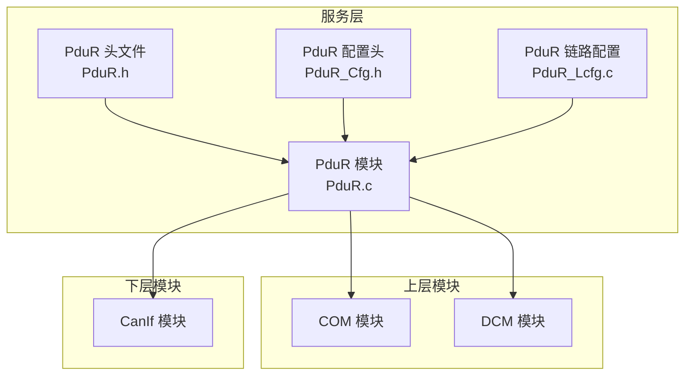
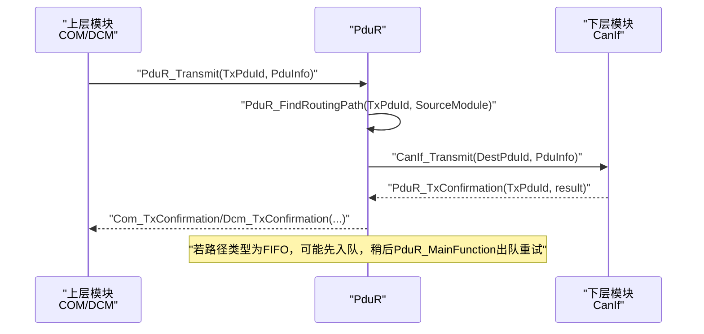
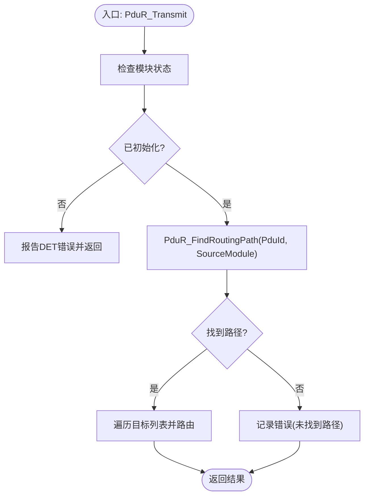
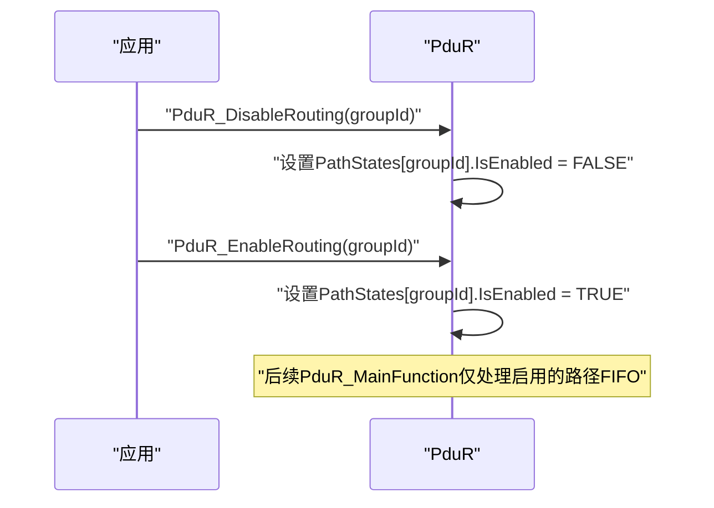
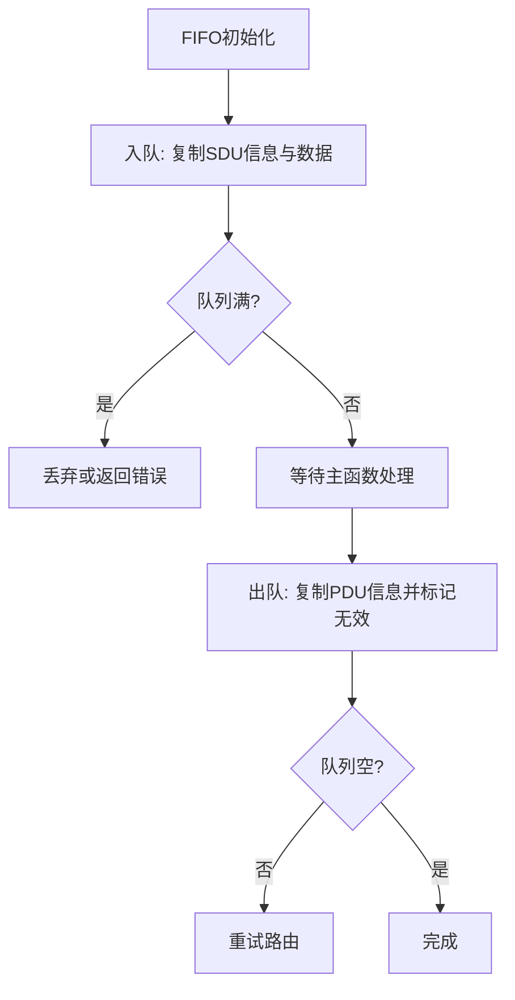
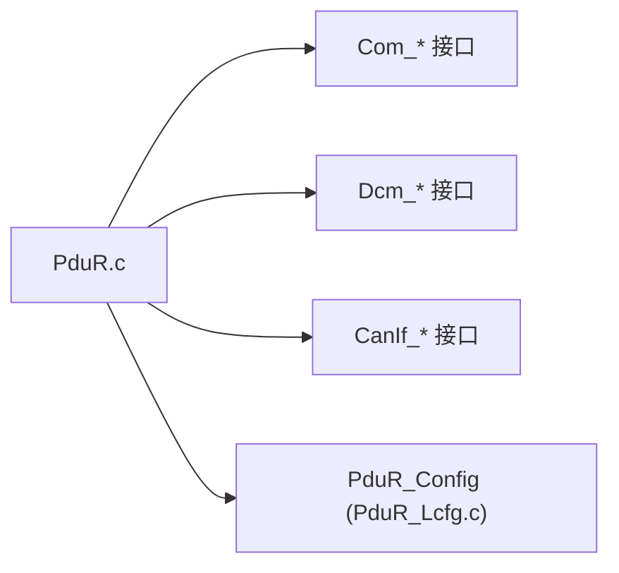

# 路径管理与选择

<cite>
**本文引用的文件**
- [PduR.h](file://src/bsw/services/pdur/include/PduR.h)
- [PduR_Cfg.h](file://src/bsw/services/pdur/include/PduR_Cfg.h)
- [PduR.c](file://src/bsw/services/pdur/src/PduR.c)
- [PduR_Lcfg.c](file://src/bsw/services/pdur/src/PduR_Lcfg.c)
- [PduR_test.c](file://src/bsw/services/pdur/src/PduR_test.c)
- [pdur_verification.md](file://verification/pdur_verification.md)
- [PduR_Cfg.h（模板）](file://src/bsw/config/templates/PduR_Cfg.h)
- [spec.md](file://openspec/specs/bsw/spec.md)
</cite>

## 目录
1. [简介](#简介)
2. [项目结构](#项目结构)
3. [核心组件](#核心组件)
4. [架构总览](#架构总览)
5. [详细组件分析](#详细组件分析)
6. [依赖关系分析](#依赖关系分析)
7. [性能考虑](#性能考虑)
8. [故障排查指南](#故障排查指南)
9. [结论](#结论)
10. [附录](#附录)

## 简介
本文件面向PduR（PDU Router）路径管理与选择功能，系统化阐述三种路由路径类型（直接路由、FIFO路由、网关路由）的实现原理、适用场景与配置要点；深入解析路径查找算法、路径优先级处理与动态路径切换机制；文档化源PDU配置与目标PDU配置的管理方式；解释路径组管理机制及PduR_EnableRouting/PduR_DisableRouting的使用方法；提供路径配置优化策略、性能调优建议与路径冲突解决方案；并给出路径监控、调试工具使用与故障诊断指南。

## 项目结构
PduR位于基础软件服务层，负责在上层（COM/DCM）与下层（CanIf等）之间进行PDU路由与回调转发。关键文件组织如下：
- 头文件与配置：PduR.h、PduR_Cfg.h
- 实现：PduR.c
- 链路配置：PduR_Lcfg.c
- 单元测试：PduR_test.c
- 验证报告：pdur_verification.md
- 配置模板：PduR_Cfg.h（模板）
- 规范：spec.md

图表来源
- [PduR.c:374-420](file://src/bsw/services/pdur/src/PduR.c#L374-L420)
- [PduR.h:168-282](file://src/bsw/services/pdur/include/PduR.h#L168-L282)
- [PduR_Cfg.h:15-67](file://src/bsw/services/pdur/include/PduR_Cfg.h#L15-L67)
- [PduR_Lcfg.c:246-253](file://src/bsw/services/pdur/src/PduR_Lcfg.c#L246-L253)

章节来源
- [PduR.h:13-282](file://src/bsw/services/pdur/include/PduR.h#L13-L282)
- [PduR_Cfg.h:15-67](file://src/bsw/services/pdur/include/PduR_Cfg.h#L15-L67)
- [PduR.c:374-420](file://src/bsw/services/pdur/src/PduR.c#L374-L420)
- [PduR_Lcfg.c:246-253](file://src/bsw/services/pdur/src/PduR_Lcfg.c#L246-L253)

## 核心组件
- 路由路径类型枚举：直接路由、FIFO路由、网关路由
- 源PDU配置：包含源PDU标识、源模块类型、SDU长度
- 目标PDU配置：包含目标PDU标识、目标模块类型、处理类型（立即/延迟）、FIFO深度
- 路由路径配置：源PDU配置、目标PDU数组、目标数量、路径类型、是否网关操作
- 路由路径组配置：组ID、PDU ID集合、默认启用状态
- 全局配置：路由路径数组、数量、路由路径组数组、数量、错误检测与版本信息API开关

章节来源
- [PduR.h:85-149](file://src/bsw/services/pdur/include/PduR.h#L85-L149)
- [PduR_Cfg.h:15-67](file://src/bsw/services/pdur/include/PduR_Cfg.h#L15-L67)
- [PduR_Lcfg.c:114-243](file://src/bsw/services/pdur/src/PduR_Lcfg.c#L114-L243)

## 架构总览
PduR在初始化时保存配置指针，为每条路由路径维护运行时状态（含FIFO队列与启用标志）。对外提供向上/向下路由、回调转发、主函数（周期性处理延迟PDU）等能力。路径查找基于PDU ID与模块类型进行线性匹配，支持多目标路由。

图表来源
- [PduR.c:428-466](file://src/bsw/services/pdur/src/PduR.c#L428-L466)
- [PduR.c:512-571](file://src/bsw/services/pdur/src/PduR.c#L512-L571)
- [PduR.c:746-772](file://src/bsw/services/pdur/src/PduR.c#L746-L772)

## 详细组件分析

### 路由路径类型与适用场景
- 直接路由（PDUR_ROUTING_PATH_DIRECT）
  - 特点：一对一或一对多直连转发，不引入额外缓冲
  - 适用：实时性要求高、吞吐量可控、路径稳定
  - 实现：在PduR_RoutePdu中遍历目标列表，按目标模块类型调用对应接口
- FIFO路由（PDUR_ROUTING_PATH_FIFO）
  - 特点：引入环形FIFO队列，用于延迟或背压场景下的异步处理
  - 适用：下游传输拥塞、需要削峰填谷、批量处理
  - 实现：在PduR_MainFunction中轮询各路径FIFO，尝试重放
- 网关路由（PDUR_ROUTING_PATH_GATEWAY）
  - 特点：配置项GatewayOperation为真时启用，通常用于跨域/协议转换
  - 适用：不同网络/协议间的桥接
  - 实现：当前实现中未见具体网关逻辑，保留扩展位

章节来源
- [PduR.h:85-89](file://src/bsw/services/pdur/include/PduR.h#L85-L89)
- [PduR_Lcfg.c:114-199](file://src/bsw/services/pdur/src/PduR_Lcfg.c#L114-L199)
- [PduR.c:162-183](file://src/bsw/services/pdur/src/PduR.c#L162-L183)

### 路径查找算法与优先级处理
- 查找算法
  - 线性扫描：根据PDU ID与源模块类型匹配路由路径
  - 时间复杂度：O(n)，n为路由路径数量
  - 优先级：当前实现未显式支持“优先级字段”，按配置顺序匹配
- 优先级处理建议
  - 若需严格优先级，可在配置层面将高优先级路径置于前部
  - 或在实现中增加“优先级字段”并在查找时排序

图表来源
- [PduR.c:428-466](file://src/bsw/services/pdur/src/PduR.c#L428-L466)
- [PduR.c:132-154](file://src/bsw/services/pdur/src/PduR.c#L132-L154)

章节来源
- [PduR.c:132-154](file://src/bsw/services/pdur/src/PduR.c#L132-L154)
- [pdur_verification.md:103-106](file://verification/pdur_verification.md#L103-L106)

### 动态路径切换机制
- 路径组启用/禁用
  - PduR_EnableRouting(id)：将指定组内的路径状态设为启用
  - PduR_DisableRouting(id)：将指定组内的路径状态设为禁用
  - 当前实现中，路径状态数组与组ID存在一一映射关系，便于按组控制
- 主函数周期处理
  - PduR_MainFunction在初始化状态下轮询各路径FIFO，尝试重放延迟PDU
  - 适合配合FIFO路由实现动态背压缓解

图表来源
- [PduR.c:693-712](file://src/bsw/services/pdur/src/PduR.c#L693-L712)
- [PduR_Lcfg.c:218-243](file://src/bsw/services/pdur/src/PduR_Lcfg.c#L218-L243)

章节来源
- [PduR.c:693-712](file://src/bsw/services/pdur/src/PduR.c#L693-L712)
- [PduR_Lcfg.c:218-243](file://src/bsw/services/pdur/src/PduR_Lcfg.c#L218-L243)

### 源PDU配置与目标PDU配置管理
- 源PDU配置（PduR_SrcPduConfigType）
  - 字段：SourcePduId、SourceModule、SduLength
  - 作用：标识上游PDU来源与长度
- 目标PDU配置（PduR_DestPduConfigType）
  - 字段：DestPduId、DestModule、Processing（立即/延迟）、FifoDepth
  - 作用：描述下游目标模块与处理策略
- 链路配置示例
  - 例如：COM TX Engine Status -> CanIf，路径类型为直接路由，目标处理为立即

章节来源
- [PduR.h:102-116](file://src/bsw/services/pdur/include/PduR.h#L102-L116)
- [PduR_Lcfg.c:43-111](file://src/bsw/services/pdur/src/PduR_Lcfg.c#L43-L111)
- [PduR_Lcfg.c:114-199](file://src/bsw/services/pdur/src/PduR_Lcfg.c#L114-L199)

### 路由路径组管理
- 路由路径组配置（PduR_RoutingPathGroupConfigType）
  - 字段：GroupId、PduIds、NumPduIds、DefaultEnabled
  - 作用：按组聚合PDU ID，便于批量启用/禁用
- 默认启用策略
  - 在链路配置中可设置DefaultEnabled，影响初始化后的默认状态
- 组与路径的关联
  - 通过PduR_Lcfg.c中的PduIds数组将多个PDU ID绑定到同一组

章节来源
- [PduR.h:132-137](file://src/bsw/services/pdur/include/PduR.h#L132-L137)
- [PduR_Lcfg.c:201-243](file://src/bsw/services/pdur/src/PduR_Lcfg.c#L201-L243)

### FIFO队列与延迟处理
- FIFO结构
  - 环形队列：Head/Tail/Count，固定最大深度
  - 条目包含PDU信息与本地拷贝缓冲
- 操作
  - 初始化：清零Head/Tail/Count并将所有条目标记无效
  - 入队：复制SDU长度与数据（受最大目标数×单包缓冲限制），更新Tail
  - 出队：复制PDU信息，标记条目无效，更新Head
  - 满/空检测：基于Count与最大深度
- 主函数处理
  - PduR_MainFunction在初始化状态下对非空队列尝试重放

图表来源
- [PduR.c:230-363](file://src/bsw/services/pdur/src/PduR.c#L230-L363)
- [PduR.c:746-772](file://src/bsw/services/pdur/src/PduR.c#L746-L772)

章节来源
- [PduR.c:230-363](file://src/bsw/services/pdur/src/PduR.c#L230-L363)
- [PduR.c:746-772](file://src/bsw/services/pdur/src/PduR.c#L746-L772)

### 回调与上下行路由
- 向下路由（上层->下层）
  - PduR_Transmit：根据源模块（COM/DCM）与PDU ID查找路径，调用CanIf_Transmit
- 向上路由（下层->上层）
  - PduR_RxIndication：根据CanIf的PDU ID查找路径，调用Com_RxIndication/Dcm_RxIndication
- 回调转发
  - PduR_TxConfirmation：转发至对应上层模块（COM/DCM）
  - PduR_TriggerTransmit：转发至支持的上层模块（COM/DCM）

章节来源
- [PduR.c:428-466](file://src/bsw/services/pdur/src/PduR.c#L428-L466)
- [PduR.c:474-504](file://src/bsw/services/pdur/src/PduR.c#L474-L504)
- [PduR.c:512-571](file://src/bsw/services/pdur/src/PduR.c#L512-L571)
- [PduR.c:579-624](file://src/bsw/services/pdur/src/PduR.c#L579-L624)

## 依赖关系分析
- 外部接口依赖
  - 上层：Com_RxIndication、Com_TxConfirmation、Com_TriggerTransmit
  - 下层：CanIf_Transmit、CanIf_CancelTransmit
- 内部耦合
  - PduR.c内部通过静态函数封装查找、路由、FIFO操作，降低耦合
  - 全局配置通过PduR_Config暴露，链路配置在PduR_Lcfg.c中定义

图表来源
- [PduR.c:28-35](file://src/bsw/services/pdur/src/PduR.c#L28-L35)
- [PduR_Lcfg.c:246-253](file://src/bsw/services/pdur/src/PduR_Lcfg.c#L246-L253)

章节来源
- [PduR.c:28-35](file://src/bsw/services/pdur/src/PduR.c#L28-L35)
- [PduR_Lcfg.c:246-253](file://src/bsw/services/pdur/src/PduR_Lcfg.c#L246-L253)

## 性能考虑
- 时间复杂度
  - 路由查找：O(n)，n为路由路径数量
  - FIFO操作：O(1)
- 空间复杂度
  - 静态内存：路径状态数组、FIFO缓冲区
  - FIFO缓冲区大小可配置，满足嵌入式资源限制
- 实时性
  - 验证报告表明整体性能满足实时性要求
- 优化建议
  - 路由表缓存：按PDU ID+模块类型建立哈希索引，将查找降为O(1)
  - 路由优先级：在配置中增加优先级字段，按优先级排序后匹配
  - 批量处理：合并多次入队，减少上下文切换

章节来源
- [pdur_verification.md:103-111](file://verification/pdur_verification.md#L103-L111)
- [pdur_verification.md:119-120](file://verification/pduR_verification.md#L119-L120)

## 故障排查指南
- 常见错误与定位
  - 未初始化：调用API前未调用PduR_Init或已DeInit
  - 参数为空：PduInfoPtr为空
  - 未找到路径：PDU ID与模块类型不匹配
  - FIFO满：入队失败
- DET错误码
  - 参考PduR.h中的错误码定义，结合单元测试与验证报告定位问题
- 调试步骤
  - 使用单元测试桩（mock）验证路由路径查找与回调转发
  - 在PduR_MainFunction中观察FIFO队列状态变化
  - 对比链路配置与实际调用序列，确保模块类型与PDU ID一致

章节来源
- [PduR.h:53-71](file://src/bsw/services/pdur/include/PduR.h#L53-L71)
- [PduR_test.c:136-325](file://src/bsw/services/pdur/src/PduR_test.c#L136-L325)
- [pdur_verification.md:11-129](file://verification/pdur_verification.md#L11-L129)

## 结论
PduR实现了基于AutoSAR 4.x标准的PDU路由框架，支持直接路由与FIFO延迟处理，并预留网关扩展。通过链路配置与路径组管理，可灵活控制路由行为。当前实现具备良好的可维护性与接口兼容性，满足实时性要求。建议在生产环境中结合配置模板与验证流程，持续优化查找与优先级策略，以提升系统性能与可靠性。

## 附录
- 配置模板与规范
  - 配置模板：PduR_Cfg.h（模板）
  - 规范：spec.md（包含分层架构与模块规范）

章节来源
- [PduR_Cfg.h（模板）:15-72](file://src/bsw/config/templates/PduR_Cfg.h#L15-L72)
- [spec.md:13-47](file://openspec/specs/bsw/spec.md#L13-L47)