# 路径配置管理

<cite>
**本文档引用的文件**
- [PduR.h](file://src/bsw/services/pdur/include/PduR.h)
- [PduR_Cfg.h](file://src/bsw/services/pdur/include/PduR_Cfg.h)
- [PduR.c](file://src/bsw/services/pdur/src/PduR.c)
- [PduR_Lcfg.c](file://src/bsw/services/pdur/src/PduR_Lcfg.c)
- [PduR_Cfg.h（模板）](file://src/bsw/config/templates/PduR_Cfg.h)
- [PduR 规格说明](file://openspec/changes/dev-pdu-router/specs/PduR_spec.md)
- [PduR 验证报告](file://verification/pdur_verification.md)
- [配置工具](file://tools/config/src/config_tool.py)
</cite>

## 目录
1. [简介](#简介)
2. [项目结构](#项目结构)
3. [核心组件](#核心组件)
4. [架构概览](#架构概览)
5. [详细组件分析](#详细组件分析)
6. [依赖关系分析](#依赖关系分析)
7. [性能考虑](#性能考虑)
8. [故障排除指南](#故障排除指南)
9. [结论](#结论)
10. [附录](#附录)

## 简介
本文件为PduR（PDU路由器）路径配置管理的全面技术文档。重点阐述PduR_ConfigType配置结构的设计原理、源PDU配置（PduR_SrcPduConfigType）与目标PDU配置（PduR_DestPduConfigType）的管理机制、配置验证规则与错误处理策略。同时涵盖路径配置的生命周期管理、动态参数修改与配置更新机制，分析配置参数对性能的影响，并提供配置文件生成、验证工具使用与调试方法，最后给出故障排除指南与最佳实践。

## 项目结构
PduR位于BSW服务层，采用AutoSAR经典平台4.x标准实现。关键文件组织如下：
- 头文件：定义数据类型、API接口与配置宏
- 实现文件：实现路由查找、转发、回调处理与主函数
- 链接时配置：定义具体的路由路径、目标配置与分组
- 规格说明与验证：明确数据结构、行为规范与验证结果
- 配置模板与工具：提供预设配置与生成工具

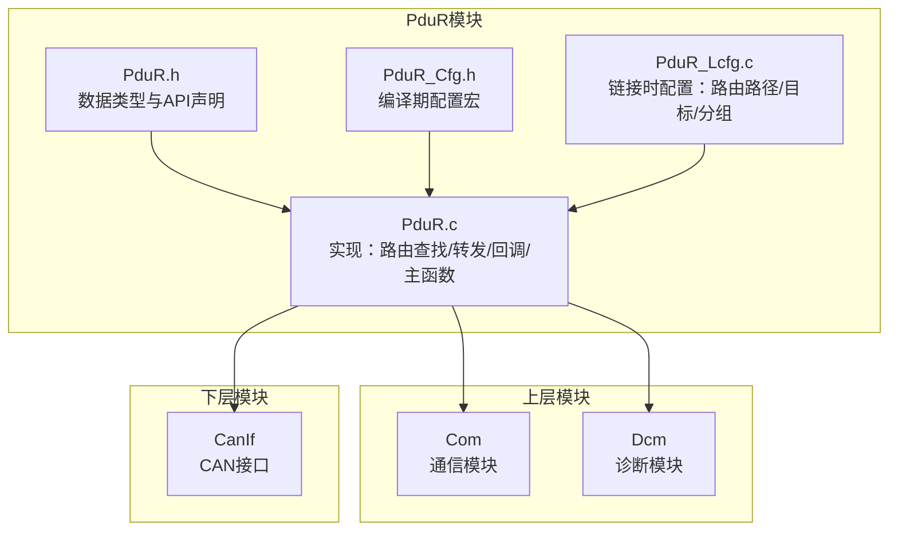

**图表来源**
- [PduR.h:100-160](file://src/bsw/services/pdur/include/PduR.h#L100-L160)
- [PduR_Cfg.h:15-67](file://src/bsw/services/pdur/include/PduR_Cfg.h#L15-L67)
- [PduR.c:19-36](file://src/bsw/services/pdur/src/PduR.c#L19-L36)
- [PduR_Lcfg.c:38-261](file://src/bsw/services/pdur/src/PduR_Lcfg.c#L38-L261)

**章节来源**
- [PduR.h:1-282](file://src/bsw/services/pdur/include/PduR.h#L1-L282)
- [PduR_Cfg.h:1-67](file://src/bsw/services/pdur/include/PduR_Cfg.h#L1-L67)
- [PduR.c:1-780](file://src/bsw/services/pdur/src/PduR.c#L1-L780)
- [PduR_Lcfg.c:1-261](file://src/bsw/services/pdur/src/PduR_Lcfg.c#L1-L261)

## 核心组件
本节聚焦于PduR配置结构与关键数据类型，解释设计原则与参数含义。

- PduR_ConfigType：全局配置容器，包含路由路径数组、分组信息、开发错误检测与版本信息API开关。
- PduR_RoutingPathConfigType：路由路径配置，描述源PDU、目标数组、路径类型与网关操作标志。
- PduR_SrcPduConfigType：源PDU配置，包含源PDU ID、源模块类型与SDU长度。
- PduR_DestPduConfigType：目标PDU配置，包含目标PDU ID、目标模块类型、处理方式（立即/延迟）与FIFO深度。
- PduR_RoutingPathGroupConfigType：路由路径分组配置，包含分组ID、PDU ID集合、数量与默认启用状态。

这些结构共同构成PduR的静态配置模型，确保在编译期确定路由关系，运行期通过查找与转发实现高效的数据流调度。

**章节来源**
- [PduR.h:100-160](file://src/bsw/services/pdur/include/PduR.h#L100-L160)
- [PduR 规格说明:110-150](file://openspec/changes/dev-pdu-router/specs/PduR_spec.md#L110-L150)

## 架构概览
PduR作为服务层模块，负责在上层（Com、Dcm）与下层（CanIf等）之间进行I-PDU路由。其架构遵循AutoSAR标准，不参与总线协议处理，仅执行路由决策与分发。

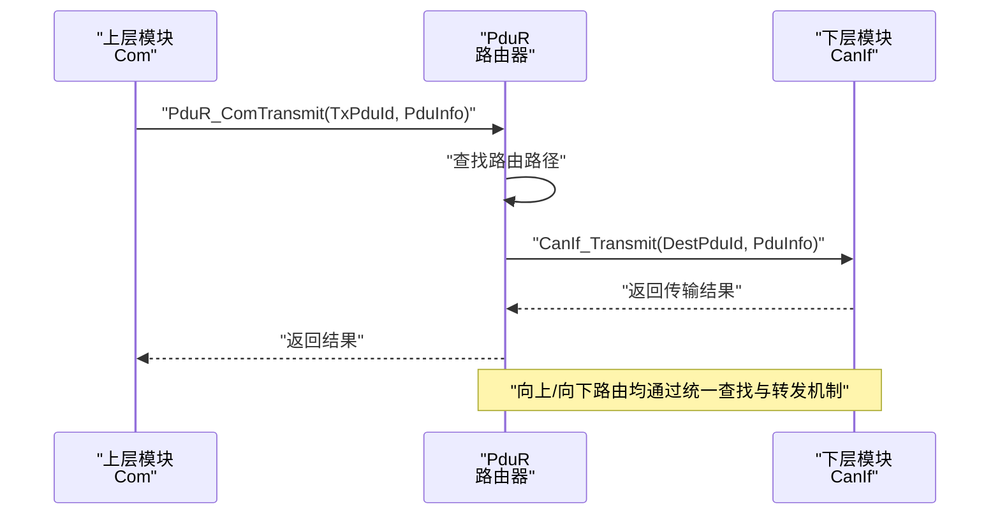

**图表来源**
- [PduR.c:428-466](file://src/bsw/services/pdur/src/PduR.c#L428-L466)
- [PduR.c:474-504](file://src/bsw/services/pdur/src/PduR.c#L474-L504)

**章节来源**
- [PduR 规格说明:209-246](file://openspec/changes/dev-pdu-router/specs/PduR_spec.md#L209-L246)
- [PduR.c:428-504](file://src/bsw/services/pdur/src/PduR.c#L428-L504)

## 详细组件分析

### 源PDU配置（PduR_SrcPduConfigType）
- 设计目的：标识路由的起点，包含源PDU ID、源模块类型与SDU长度。
- 参数含义：
  - SourcePduId：源模块中的PDU标识符，用于路由查找匹配。
  - SourceModule：源模块类型（如COM、DCM、CanIf），用于限定查找范围。
  - SduLength：SDU长度，用于缓冲区与性能规划。
- 管理机制：在PduR_Lcfg.c中按路径定义，与目标数组关联形成完整的路由单元。

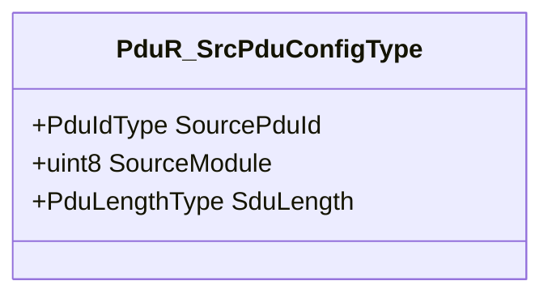

**图表来源**
- [PduR.h:102-106](file://src/bsw/services/pdur/include/PduR.h#L102-L106)

**章节来源**
- [PduR.h:100-106](file://src/bsw/services/pdur/include/PduR.h#L100-L106)
- [PduR_Lcfg.c:114-199](file://src/bsw/services/pdur/src/PduR_Lcfg.c#L114-L199)

### 目标PDU配置（PduR_DestPduConfigType）
- 设计目的：描述路由的目的地，包含目标模块、处理方式与FIFO深度。
- 参数含义：
  - DestPduId：目标模块中的PDU标识符。
  - DestModule：目标模块类型（如CanIf、Com、Dcm）。
  - Processing：处理方式（立即或延迟），决定是否进入FIFO队列。
  - FifoDepth：延迟处理时的FIFO深度，影响缓冲区占用与吞吐能力。
- 管理机制：在PduR_Lcfg.c中为每个路径定义目标数组，支持多播（一个源对应多个目标）。

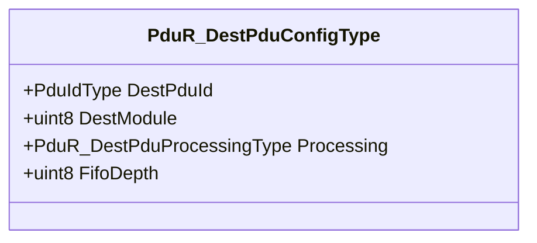

**图表来源**
- [PduR.h:111-116](file://src/bsw/services/pdur/include/PduR.h#L111-L116)

**章节来源**
- [PduR.h:108-116](file://src/bsw/services/pdur/include/PduR.h#L108-L116)
- [PduR_Lcfg.c:41-111](file://src/bsw/services/pdur/src/PduR_Lcfg.c#L41-L111)

### 路由路径配置（PduR_RoutingPathConfigType）
- 设计目的：将源PDU与目标数组组合，定义路径类型与网关操作。
- 参数含义：
  - SrcPdu：源PDU配置。
  - DestPdus：目标数组指针与数量。
  - NumDestPdus：目标数量，支持多播。
  - PathType：路径类型（直接、FIFO、网关）。
  - GatewayOperation：是否启用网关操作（预留扩展）。
- 管理机制：在PduR_Lcfg.c中集中定义，供PduR.c在运行期查找与转发。

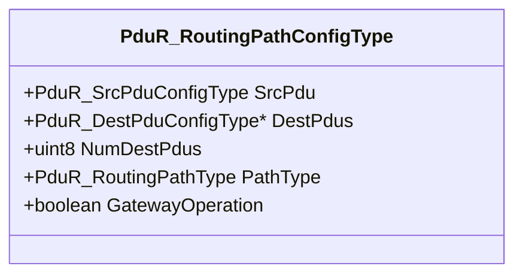

**图表来源**
- [PduR.h:121-127](file://src/bsw/services/pdur/include/PduR.h#L121-L127)

**章节来源**
- [PduR.h:118-127](file://src/bsw/services/pdur/include/PduR.h#L118-L127)
- [PduR_Lcfg.c:114-199](file://src/bsw/services/pdur/src/PduR_Lcfg.c#L114-L199)

### 全局配置（PduR_ConfigType）
- 设计目的：承载所有路由路径与分组信息，控制开发错误检测与版本信息API。
- 参数含义：
  - RoutingPaths：路由路径数组。
  - NumRoutingPaths：路径数量。
  - RoutingPathGroups：路由路径分组数组。
  - NumRoutingPathGroups：分组数量。
  - DevErrorDetect：开发错误检测开关。
  - VersionInfoApi：版本信息API开关。
- 生命周期：在PduR_Init时加载，PduR_DeInit时释放；运行期通过Enable/DisableRouting控制分组启用状态。

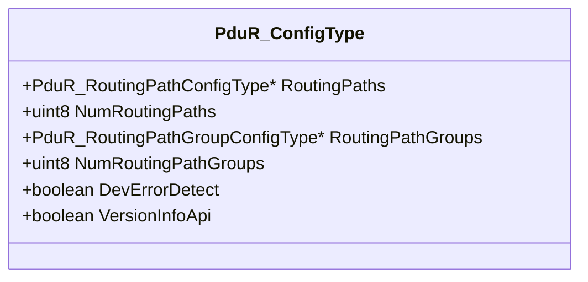

**图表来源**
- [PduR.h:142-149](file://src/bsw/services/pdur/include/PduR.h#L142-L149)

**章节来源**
- [PduR.h:139-149](file://src/bsw/services/pdur/include/PduR.h#L139-L149)
- [PduR_Lcfg.c:245-253](file://src/bsw/services/pdur/src/PduR_Lcfg.c#L245-L253)

### 路由路径分组（PduR_RoutingPathGroupConfigType）
- 设计目的：按业务域或功能域对路由路径进行逻辑分组，支持启用/禁用。
- 参数含义：
  - GroupId：分组ID。
  - PduIds：该分组包含的PDU ID数组。
  - NumPduIds：PDU数量。
  - DefaultEnabled：默认启用状态。
- 管理机制：通过PduR_EnableRouting/PduR_DisableRouting在运行期动态控制。

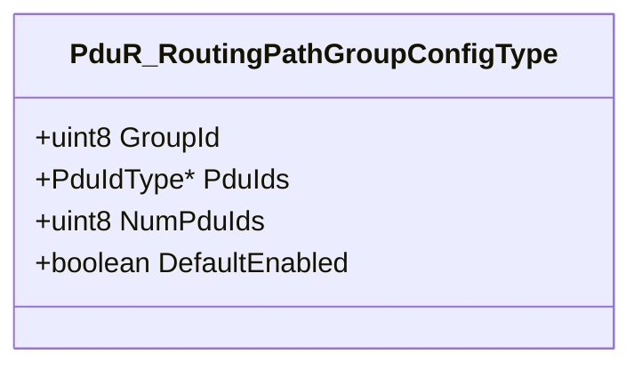

**图表来源**
- [PduR.h:132-137](file://src/bsw/services/pdur/include/PduR.h#L132-L137)

**章节来源**
- [PduR.h:129-137](file://src/bsw/services/pdur/include/PduR.h#L129-L137)
- [PduR_Lcfg.c:201-243](file://src/bsw/services/pdur/src/PduR_Lcfg.c#L201-L243)

### 配置验证规则与错误处理策略
- 开发错误检测（DET）：当PDUR_DEV_ERROR_DETECT开启时，各API在参数校验失败或状态异常时通过Det_ReportError上报错误码。
- 关键错误码：
  - 参数为空指针、配置无效、请求无效、PDU ID无效、路由路径组无效、参数无效、模块未初始化、缓冲区长度无效、缓冲区请求失败或可用等。
- API错误检测要点：
  - PduR_Init：若ConfigPtr为空则报PDUR_E_PARAM_POINTER。
  - PduR_DeInit：若模块未初始化则报PDUR_E_UNINIT。
  - PduR_Transmit/RxIndication/TxConfirmation：若模块未初始化或PduInfoPtr为空则报相应错误。
- 路由查找失败：当根据PDU ID与模块类型无法找到路由路径时，记录PDUR_E_ROUTING_PATH_NOT_FOUND（在特定API中）。

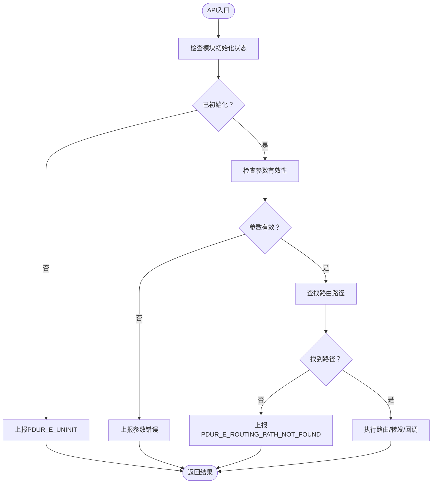

**图表来源**
- [PduR.c:433-465](file://src/bsw/services/pdur/src/PduR.c#L433-L465)
- [PduR.c:478-503](file://src/bsw/services/pdur/src/PduR.c#L478-L503)
- [PduR.c:516-570](file://src/bsw/services/pdur/src/PduR.c#L516-L570)

**章节来源**
- [PduR.h:53-71](file://src/bsw/services/pdur/include/PduR.h#L53-L71)
- [PduR.c:433-570](file://src/bsw/services/pdur/src/PduR.c#L433-L570)
- [PduR 规格说明:154-180](file://openspec/changes/dev-pdu-router/specs/PduR_spec.md#L154-L180)

### 路径配置生命周期管理
- 初始化阶段：PduR_Init加载配置指针，初始化所有路由路径状态与FIFO队列，设置模块状态为已初始化。
- 运行阶段：通过PduR_Transmit（向下路由）、PduR_RxIndication（向上路由）、PduR_TxConfirmation（确认回传）与PduR_TriggerTransmit（触发传输）完成数据流调度。
- 主函数阶段：PduR_MainFunction周期性处理延迟路由（FIFO队列），尝试重试转发。
- 反初始化阶段：PduR_DeInit清除配置指针，设置模块状态为未初始化。

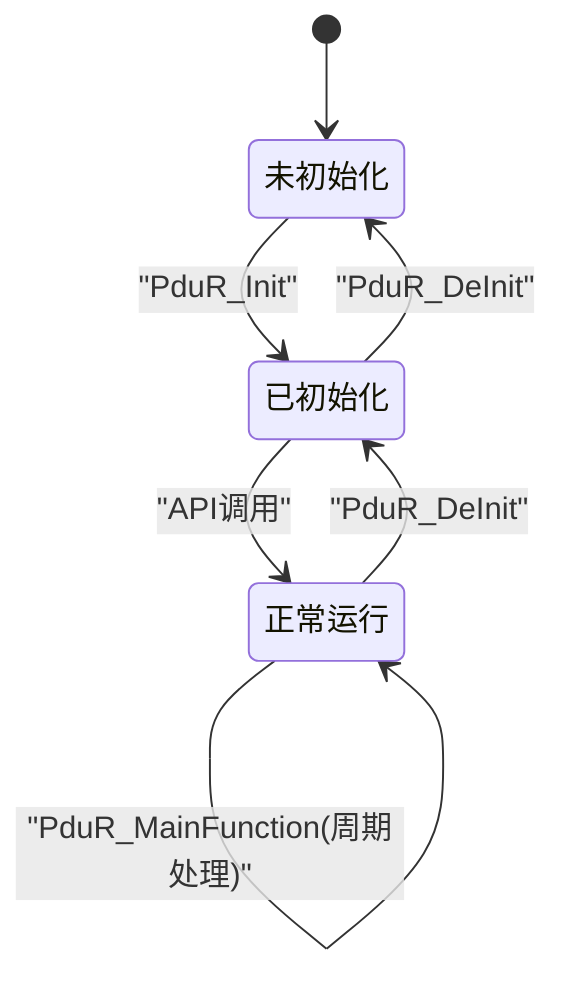

**图表来源**
- [PduR.c:374-398](file://src/bsw/services/pdur/src/PduR.c#L374-L398)
- [PduR.c:405-420](file://src/bsw/services/pdur/src/PduR.c#L405-L420)
- [PduR.c:746-772](file://src/bsw/services/pdur/src/PduR.c#L746-L772)

**章节来源**
- [PduR.c:374-420](file://src/bsw/services/pdur/src/PduR.c#L374-L420)
- [PduR.c:746-772](file://src/bsw/services/pdur/src/PduR.c#L746-L772)
- [PduR 验证报告:11-61](file://verification/pdur_verification.md#L11-L61)

### 动态参数修改与配置更新机制
- 动态参数修改：当前实现中PduR_ChangeParameterRequest返回E_NOT_OK，表示不支持动态修改参数。
- 配置更新机制：通过重新初始化（PduR_DeInit后PduR_Init）加载新的PduR_Config，实现配置更新。运行期可通过Enable/DisableRouting切换分组启用状态，无需重启。

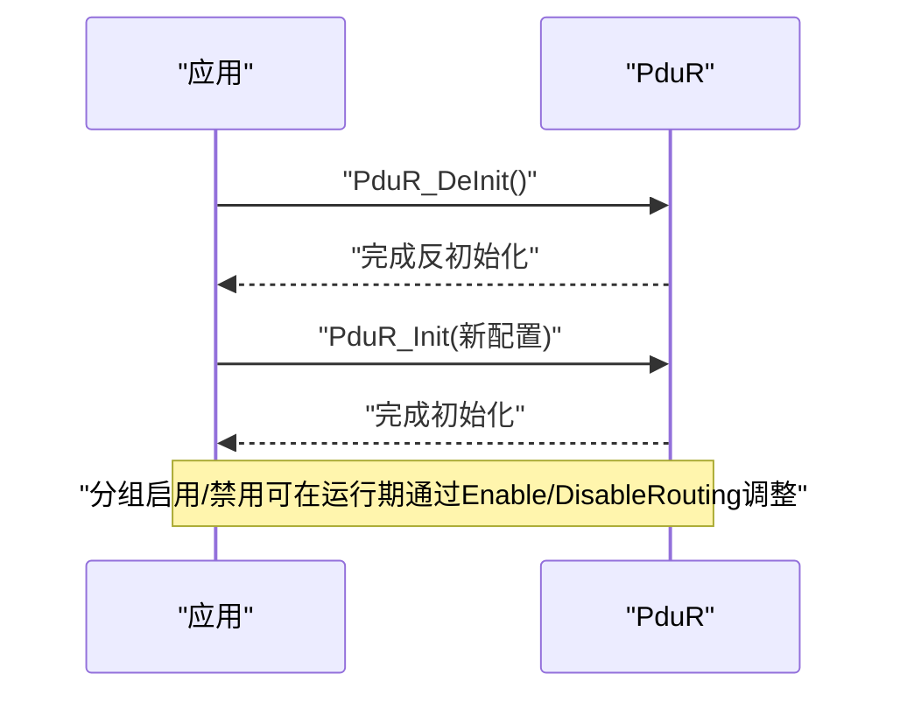

**图表来源**
- [PduR.c:680-686](file://src/bsw/services/pdur/src/PduR.c#L680-L686)
- [PduR.c:693-712](file://src/bsw/services/pdur/src/PduR.c#L693-L712)

**章节来源**
- [PduR.c:680-712](file://src/bsw/services/pdur/src/PduR.c#L680-L712)

### 配置参数对性能的影响与优化策略
- 路由查找复杂度：O(n)，n为路由路径数量。可通过路由路径缓存（建议项）优化查找性能。
- FIFO操作复杂度：O(1)，但受FIFO深度限制。合理设置PDUR_FIFO_DEPTH可平衡延迟与内存占用。
- 内存占用：静态分配，FIFO缓冲区大小可配置。应结合实际业务流量与内存约束选择合适的深度。
- 最佳实践：
  - 将高频路径置于前部，减少查找时间。
  - 合理设置目标数量（NumDestPdus），避免过度多播导致上下行压力。
  - 对高延迟链路启用延迟处理（Processing=DEFERRED），配合FIFO提升吞吐。
  - 分组启用策略：按场景启用必要分组，降低无关路径的查找开销。

**章节来源**
- [PduR 验证报告:101-112](file://verification/pdur_verification.md#L101-L112)
- [PduR 规格说明:183-196](file://openspec/changes/dev-pdu-router/specs/PduR_spec.md#L183-L196)

### 配置文件生成、验证与调试
- 配置文件生成：
  - 使用PduR_Cfg.h模板（编译期配置宏）与PduR_Lcfg.c（链接时配置）分别定义预编译参数与具体路由。
  - 可参考配置模板文件与验证报告中的参数示例。
- 配置验证工具：
  - 项目提供通用配置工具（config_tool.py），可用于生成与验证基础模块配置，便于集成到整体配置流程。
- 调试方法：
  - 启用PDUR_DEV_ERROR_DETECT，通过Det_ReportError定位参数与状态错误。
  - 在PduR_MainFunction中观察FIFO队列处理情况，判断是否存在拥塞。
  - 使用验证报告中的场景用例（如COM->CAN、CAN->COM、确认回传）进行端到端验证。

**章节来源**
- [PduR_Cfg.h（模板）:15-71](file://src/bsw/config/templates/PduR_Cfg.h#L15-L71)
- [PduR_Lcfg.c:38-261](file://src/bsw/services/pdur/src/PduR_Lcfg.c#L38-L261)
- [配置工具:1-158](file://tools/config/src/config_tool.py#L1-L158)
- [PduR 验证报告:1-129](file://verification/pdur_verification.md#L1-L129)

## 依赖关系分析
PduR依赖上层模块（Com、Dcm）与下层模块（CanIf），并通过Det与MemMap等公共模块协作。

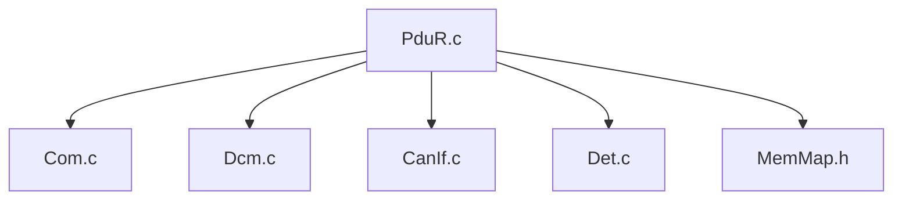

**图表来源**
- [PduR.c:28-36](file://src/bsw/services/pdur/src/PduR.c#L28-L36)
- [PduR 规格说明:261-275](file://openspec/changes/dev-pdu-router/specs/PduR_spec.md#L261-L275)

**章节来源**
- [PduR.c:28-36](file://src/bsw/services/pdur/src/PduR.c#L28-L36)
- [PduR 规格说明:261-275](file://openspec/changes/dev-pdu-router/specs/PduR_spec.md#L261-L275)

## 性能考虑
- 时间复杂度：路由查找O(n)，FIFO操作O(1)。整体满足实时性要求。
- 空间复杂度：静态内存分配，FIFO缓冲区大小可配置。需满足嵌入式系统资源限制。
- 建议：在保证可靠性的前提下，适度增加FIFO深度以提高吞吐，同时监控内存占用与延迟。

**章节来源**
- [PduR 验证报告:101-112](file://verification/pdur_verification.md#L101-L112)

## 故障排除指南
- 常见错误与解决：
  - PDUR_E_UNINIT：确保先调用PduR_Init再调用其他API。
  - PDUR_E_PARAM_POINTER：检查PduInfoPtr与ConfigPtr非空。
  - PDUR_E_ROUTING_PATH_NOT_FOUND：核对PDU ID与模块类型是否与配置一致。
  - FIFO满/空：检查FIFO深度配置与主函数周期，必要时增大深度或缩短周期。
- 调试步骤：
  - 启用DET并观察错误码，定位问题发生点。
  - 使用验证报告中的场景用例逐项验证，缩小问题范围。
  - 检查PduR_Lcfg.c中的路由路径与目标配置，确保与实际业务一致。

**章节来源**
- [PduR.h:53-71](file://src/bsw/services/pdur/include/PduR.h#L53-L71)
- [PduR.c:433-570](file://src/bsw/services/pdur/src/PduR.c#L433-L570)
- [PduR 验证报告:113-129](file://verification/pdur_verification.md#L113-L129)

## 结论
PduR通过清晰的配置结构与严格的错误处理机制，实现了高效的I-PDU路由。源PDU与目标PDU配置支持多播与延迟处理，结合分组启用策略可灵活适配不同业务场景。尽管当前不支持动态参数修改，但通过重新初始化与分组控制即可实现配置更新。建议在实际部署中结合业务流量与资源约束，合理配置FIFO深度与目标数量，以获得最佳性能与可靠性。

## 附录
- 配置参数参考：
  - 预编译参数：PDUR_DEV_ERROR_DETECT、PDUR_VERSION_INFO_API、PDUR_NUMBER_OF_ROUTING_PATHS、PDUR_NUMBER_OF_ROUTING_PATH_GROUPS、PDUR_MAX_DESTINATIONS_PER_PATH、PDUR_FIFO_DEPTH、PDUR_MAIN_FUNCTION_PERIOD_MS。
  - 模块ID与PDU ID：PDUR_MODULE_*、PDUR_*_TX_*、PDUR_*_RX_*。
- 场景参考：
  - COM到CAN传输、CAN到COM接收、确认回传与未初始化错误检测等典型用例。

**章节来源**
- [PduR_Cfg.h（模板）:15-71](file://src/bsw/config/templates/PduR_Cfg.h#L15-L71)
- [PduR 规格说明:183-258](file://openspec/changes/dev-pdu-router/specs/PduR_spec.md#L183-L258)