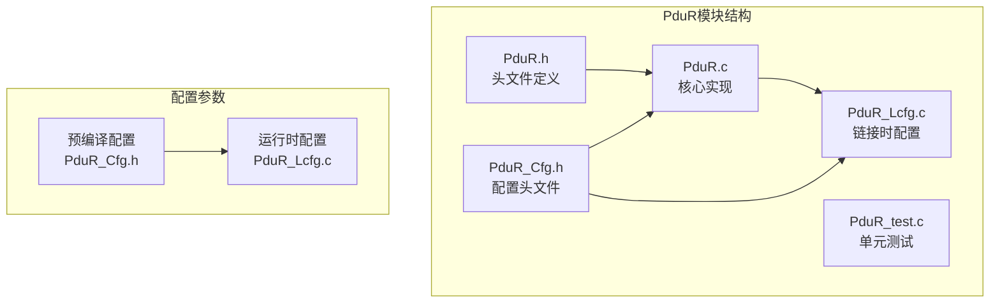
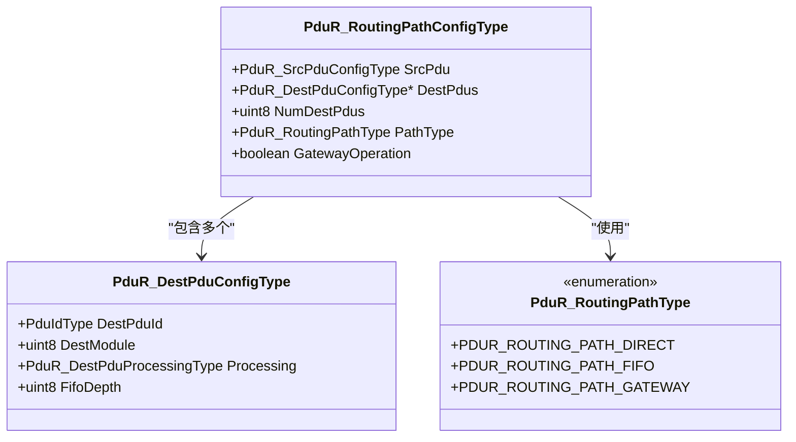
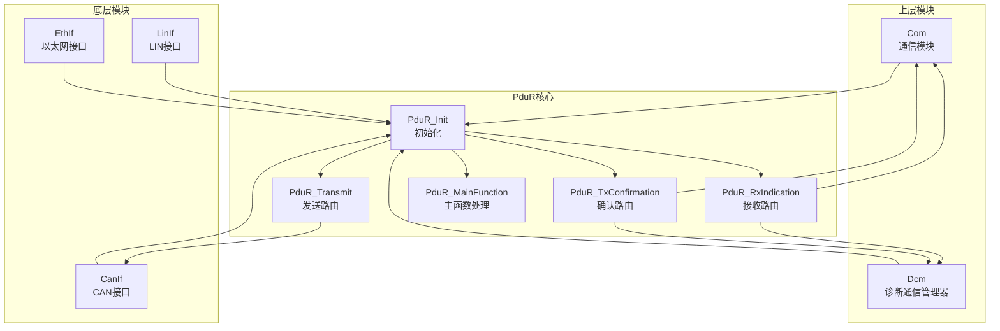
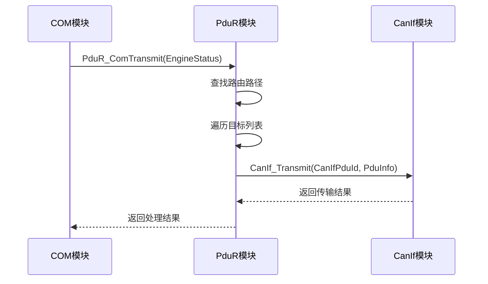
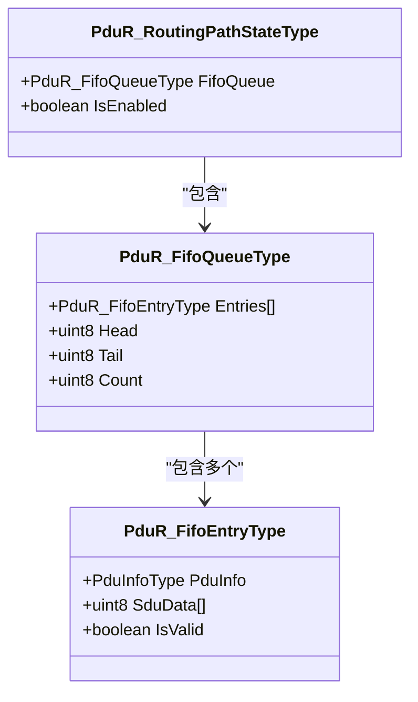
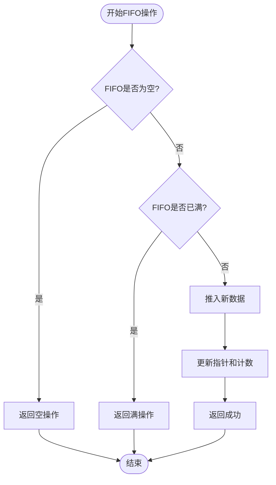
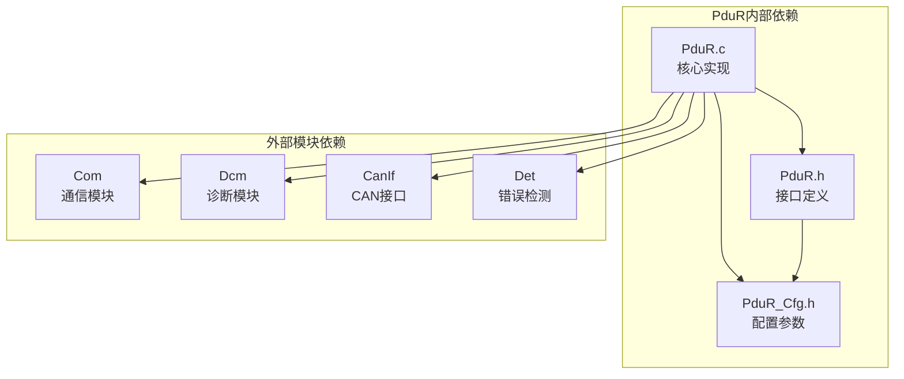
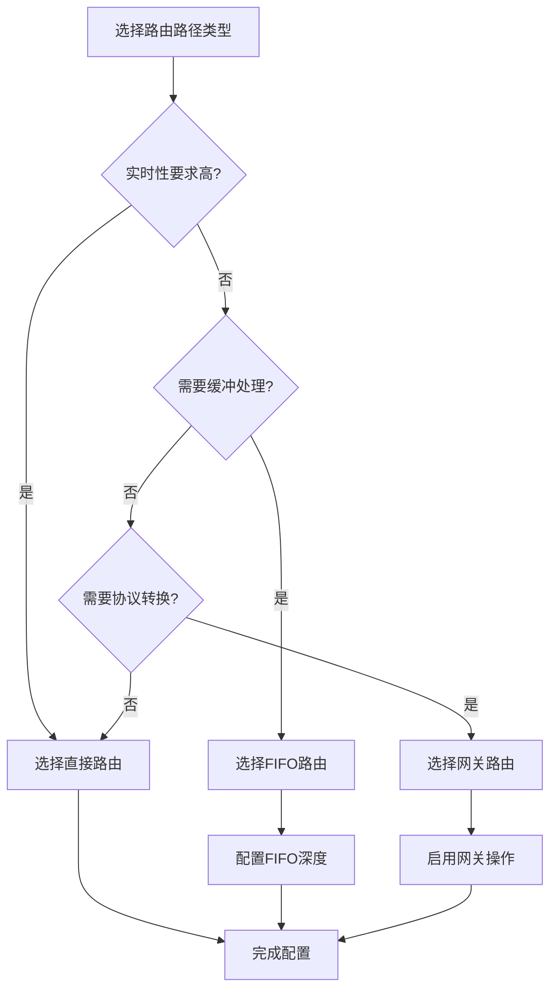

# 路由路径类型详解

<cite>
**本文档引用的文件**
- [PduR.h](file://src/bsw/services/pdur/include/PduR.h)
- [PduR_Cfg.h](file://src/bsw/services/pdur/include/PduR_Cfg.h)
- [PduR.c](file://src/bsw/services/pdur/src/PduR.c)
- [PduR_Lcfg.c](file://src/bsw/services/pdur/src/PduR_Lcfg.c)
- [PduR_spec.md](file://openspec/changes/dev-pdu-router/specs/PduR_spec.md)
- [pdur_verification.md](file://verification/pdur_verification.md)
- [PduR_test.c](file://src/bsw/services/pdur/src/PduR_test.c)
</cite>

## 目录
1. [简介](#简介)
2. [项目结构](#项目结构)
3. [核心组件](#核心组件)
4. [架构概览](#架构概览)
5. [详细组件分析](#详细组件分析)
6. [依赖关系分析](#依赖关系分析)
7. [性能考虑](#性能考虑)
8. [故障排除指南](#故障排除指南)
9. [结论](#结论)
10. [附录](#附录)

## 简介

PduR（PDU Router）是AUTOSAR经典平台BSW栈中的核心服务层模块，负责在上层模块（如Com、Dcm）和底层通信接口模块（如CanIf、EthIf、LinIf）之间路由I-PDUs（交互层协议数据单元）。本文档深入解析PduR的三种路由路径类型：直接路由（PDUR_ROUTING_PATH_DIRECT）、FIFO路由（PDUR_ROUTING_PATH_FIFO）和网关路由（PDUR_ROUTING_PATH_GATEWAY），详细说明其实现原理、数据结构和使用场景。

## 项目结构

PduR模块位于`src/bsw/services/pdur/`目录下，采用标准的AUTOSAR分层架构：



**图表来源**
- [PduR.h:1-282](file://src/bsw/services/pdur/include/PduR.h#L1-L282)
- [PduR_Cfg.h:1-67](file://src/bsw/services/pdur/include/PduR_Cfg.h#L1-L67)
- [PduR.c:1-780](file://src/bsw/services/pdur/src/PduR.c#L1-L780)
- [PduR_Lcfg.c:1-261](file://src/bsw/services/pdur/src/PduR_Lcfg.c#L1-L261)

**章节来源**
- [PduR.h:1-282](file://src/bsw/services/pdur/include/PduR.h#L1-L282)
- [PduR_Cfg.h:1-67](file://src/bsw/services/pdur/include/PduR_Cfg.h#L1-L67)

## 核心组件

### 路由路径类型枚举

PduR定义了三种路由路径类型，用于描述数据包的传输方式：



**图表来源**
- [PduR.h:85-127](file://src/bsw/services/pdur/include/PduR.h#L85-L127)

### 数据结构关系

路由路径类型与相关数据结构之间的关系如下：

| 结构类型 | 字段含义 | 配置位置 |
|---------|----------|----------|
| PduR_RoutingPathConfigType | 路由路径配置主体 | PduR_Lcfg.c |
| PduR_DestPduConfigType | 目标PDU配置 | PduR_Lcfg.c |
| PduR_SrcPduConfigType | 源PDU配置 | PduR_Lcfg.c |
| PduR_RoutingPathType | 路径类型枚举 | PduR.h |

**章节来源**
- [PduR.h:102-127](file://src/bsw/services/pdur/include/PduR.h#L102-L127)
- [PduR_Lcfg.c:114-199](file://src/bsw/services/pdur/src/PduR_Lcfg.c#L114-L199)

## 架构概览

PduR模块采用分层架构设计，实现了AUTOSAR标准要求的所有核心功能：



**图表来源**
- [PduR.c:374-772](file://src/bsw/services/pdur/src/PduR.c#L374-L772)
- [PduR_spec.md:11-25](file://openspec/changes/dev-pdu-router/specs/PduR_spec.md#L11-L25)

## 详细组件分析

### 直接路由（PDUR_ROUTING_PATH_DIRECT）

直接路由是最简单的路由类型，数据包被立即转发到目标模块，不进行任何缓冲或延迟处理。

#### 实现原理

直接路由的实现逻辑相对简单，主要通过`PduR_RouteToDestination`函数完成：



**图表来源**
- [PduR.c:428-466](file://src/bsw/services/pdur/src/PduR.c#L428-L466)
- [PduR.c:191-224](file://src/bsw/services/pdur/src/PduR.c#L191-L224)

#### 数据结构配置

在配置中，直接路由的特征：
- `PathType = PDUR_ROUTING_PATH_DIRECT`
- `GatewayOperation = FALSE`
- `Processing = PDUR_DESTPDU_PROCESSING_IMMEDIATE`
- `FifoDepth = 0`

#### 使用场景

直接路由适用于以下场景：
- 实时性要求高的数据传输
- 目标模块能够立即处理数据包
- 不需要缓冲或延迟处理的应用

**章节来源**
- [PduR_Lcfg.c:114-199](file://src/bsw/services/pdur/src/PduR_Lcfg.c#L114-L199)
- [PduR_spec.md:209-222](file://openspec/changes/dev-pdu-router/specs/PduR_spec.md#L209-L222)

### FIFO路由（PDUR_ROUTING_PATH_FIFO）

FIFO路由支持延迟处理机制，当目标模块暂时无法处理数据包时，数据包会被放入队列等待后续处理。

#### FIFO队列实现

FIFO路由的核心数据结构：



**图表来源**
- [PduR.c:64-94](file://src/bsw/services/pdur/src/PduR.c#L64-L94)

#### FIFO操作流程



**图表来源**
- [PduR.c:253-292](file://src/bsw/services/pdur/src/PduR.c#L253-L292)
- [PduR.c:300-329](file://src/bsw/services/pdur/src/PduR.c#L300-L329)

#### 配置参数

FIFO路由的关键配置：
- `PathType = PDUR_ROUTING_PATH_FIFO`
- `GatewayOperation = FALSE`
- `Processing = PDUR_DESTPDU_PROCESSING_DEFERRED`
- `FifoDepth > 0`

#### 使用场景

FIFO路由适用于以下场景：
- 目标模块处理能力有限，需要缓冲处理
- 需要实现流量控制和负载均衡
- 应对突发性数据传输需求

**章节来源**
- [PduR.c:64-94](file://src/bsw/services/pdur/src/PduR.c#L64-L94)
- [PduR_Cfg.h:58-59](file://src/bsw/services/pdur/include/PduR_Cfg.h#L58-L59)

### 网关路由（PDUR_ROUTING_PATH_GATEWAY）

网关路由提供高级的数据包转换和路由功能，支持复杂的通信场景。

#### 网关操作特性

网关路由的特征：
- `PathType = PDUR_ROUTING_PATH_GATEWAY`
- `GatewayOperation = TRUE`
- 支持数据包转换和协议适配

#### 实际实现情况

在当前实现中，网关路由主要用于配置标记，实际的网关功能可能在更高级别的配置中实现。从代码实现来看，网关路由与直接路由在功能上没有显著差异。

**章节来源**
- [PduR.h:85-89](file://src/bsw/services/pdur/include/PduR.h#L85-L89)
- [PduR_Lcfg.c:114-199](file://src/bsw/services/pdur/src/PduR_Lcfg.c#L114-L199)

### 路由路径配置示例

#### 直接路由配置示例

```c
// 引擎状态发送：COM -> CanIf
{
    .SrcPdu = {
        .SourcePduId = PDUR_COM_TX_ENGINE_STATUS,
        .SourceModule = PDUR_MODULE_COM,
        .SduLength = 8U
    },
    .DestPdus = PduR_EngineStatusTx_Dest,
    .NumDestPdus = 1U,
    .PathType = PDUR_ROUTING_PATH_DIRECT,
    .GatewayOperation = FALSE
}
```

#### FIFO路由配置示例

```c
// 需要缓冲处理的路由配置
{
    .SrcPdu = {
        .SourcePduId = SomeFifoPduId,
        .SourceModule = PDUR_MODULE_COM,
        .SduLength = 8U
    },
    .DestPdus = SomeDestArray,
    .NumDestPdus = 1U,
    .PathType = PDUR_ROUTING_PATH_FIFO,
    .GatewayOperation = FALSE
}
```

**章节来源**
- [PduR_Lcfg.c:114-199](file://src/bsw/services/pdur/src/PduR_Lcfg.c#L114-L199)

## 依赖关系分析

### 模块间依赖关系



**图表来源**
- [PduR.c:19-36](file://src/bsw/services/pdur/src/PduR.c#L19-L36)
- [PduR.h:19-21](file://src/bsw/services/pdur/include/PduR.h#L19-L21)

### 错误处理依赖

PduR模块实现了完整的错误检测机制：

| 错误类型 | 触发条件 | 错误码 |
|---------|----------|--------|
| 参数指针无效 | 配置指针为空 | PDUR_E_PARAM_POINTER |
| 模块未初始化 | 在未初始化状态下调用API | PDUR_E_UNINIT |
| 路由路径不存在 | 查找不到对应的路由路径 | PDUR_E_ROUTING_PATH_NOT_FOUND |
| FIFO已满 | FIFO队列容量不足 | PDUR_E_FIFO_FULL |

**章节来源**
- [PduR.c:43-46](file://src/bsw/services/pdur/src/PduR.c#L43-L46)
- [PduR.h:53-71](file://src/bsw/services/pdur/include/PduR.h#L53-L71)

## 性能考虑

### 时间复杂度分析

- **路由查找**: O(n)，其中n为路由路径数量
- **FIFO操作**: O(1)，包括push和pop操作
- **整体性能**: 满足实时性要求

### 内存使用分析

- **静态内存分配**: 所有数据结构在编译时确定
- **FIFO缓冲区**: 大小可配置，最大深度为PDUR_MAX_FIFO_DEPTH
- **内存分区**: 使用MemMap.h进行内存分区管理

### 性能优化建议

1. **路由路径缓存**: 考虑添加路由路径缓存以优化查找性能
2. **优先级路由**: 支持基于优先级的路由算法
3. **批量处理**: 实现批量数据包处理机制

**章节来源**
- [pdur_verification.md:104-111](file://verification/pdur_verification.md#L104-L111)

## 故障排除指南

### 常见问题及解决方案

#### 初始化相关问题

**问题**: 调用API前未初始化模块
**解决方案**: 确保先调用`PduR_Init()`再使用其他API

#### 路由路径配置问题

**问题**: 路由路径查找失败
**解决方案**: 检查PDU ID和模块类型配置是否正确

#### FIFO相关问题

**问题**: FIFO队列溢出
**解决方案**: 增加FIFO深度配置或优化数据包处理流程

### 调试技巧

1. **启用DET错误检测**: 在开发阶段保持PDUR_DEV_ERROR_DETECT为STD_ON
2. **使用单元测试**: 通过PduR_test.c验证各功能模块
3. **监控内存使用**: 定期检查FIFO队列状态

**章节来源**
- [PduR_test.c:136-325](file://src/bsw/services/pdur/src/PduR_test.c#L136-L325)
- [pdur_verification.md:113-129](file://verification/pdur_verification.md#L113-L129)

## 结论

PduR模块提供了完整的AUTOSAR路由功能，支持三种不同的路由路径类型以适应各种通信场景。直接路由适用于实时性要求高的场景，FIFO路由提供了灵活的缓冲和延迟处理机制，而网关路由为复杂的协议转换提供了基础框架。

模块实现了良好的错误检测机制、内存管理和性能优化，符合AUTOSAR经典平台4.x标准要求。通过合理的配置和使用，PduR模块能够有效支持各种汽车电子系统的通信需求。

## 附录

### 配置参数参考

| 参数名称 | 默认值 | 描述 |
|---------|--------|------|
| PDUR_DEV_ERROR_DETECT | STD_ON | 开发错误检测开关 |
| PDUR_VERSION_INFO_API | STD_ON | 版本信息API开关 |
| PDUR_NUMBER_OF_ROUTING_PATHS | 16U | 路由路径最大数量 |
| PDUR_FIFO_DEPTH | 8U | FIFO队列深度 |
| PDUR_MAX_FIFO_DEPTH | 8U | 最大FIFO深度 |

### 路径类型选择指南



**图表来源**
- [PduR.h:85-89](file://src/bsw/services/pdur/include/PduR.h#L85-L89)
- [PduR_Cfg.h:57-59](file://src/bsw/services/pdur/include/PduR_Cfg.h#L57-L59)