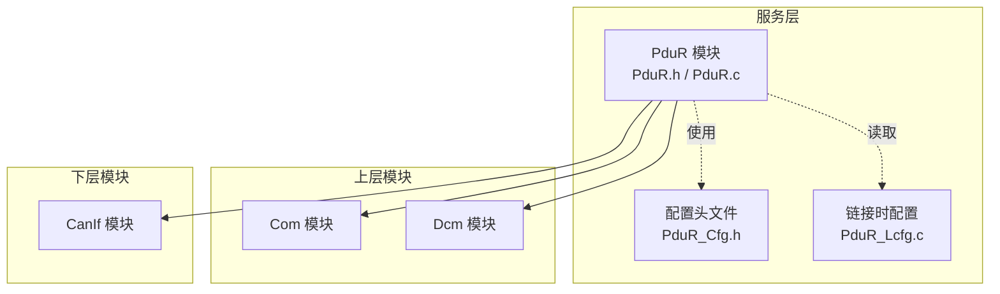
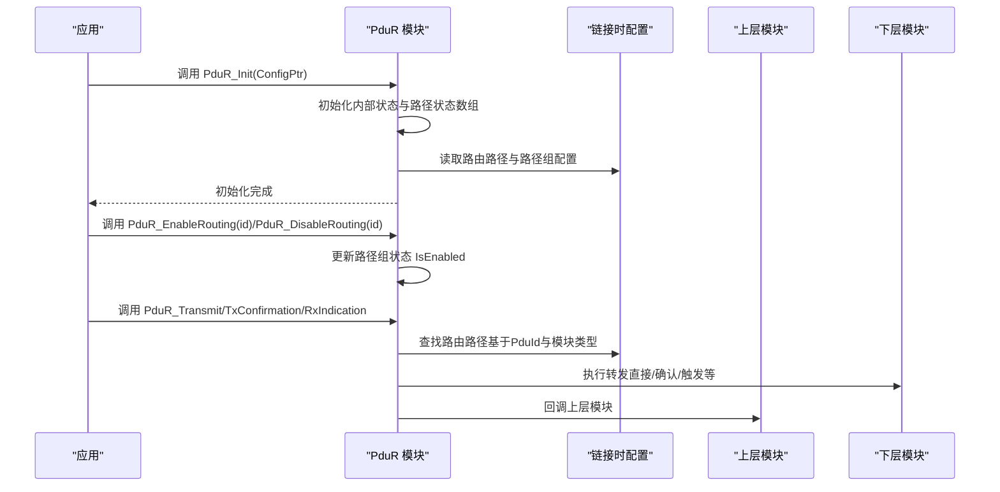
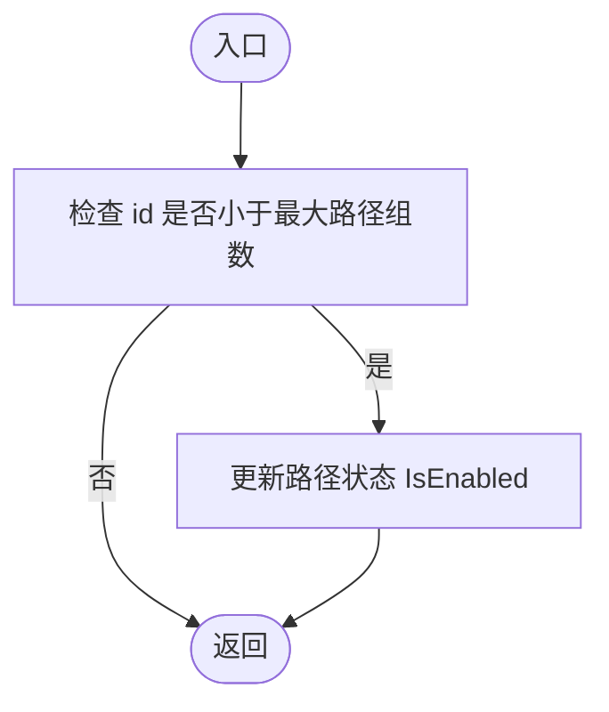
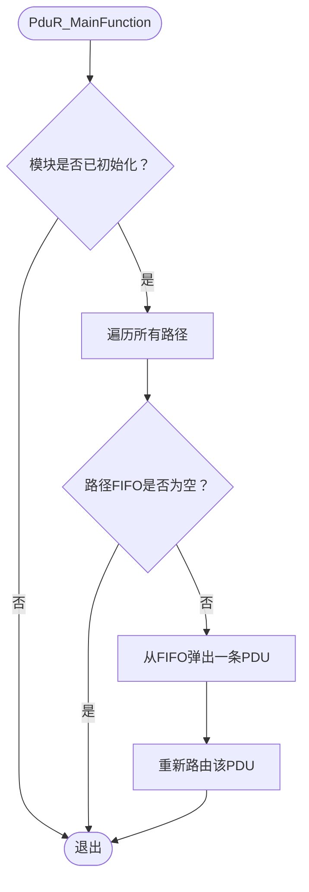
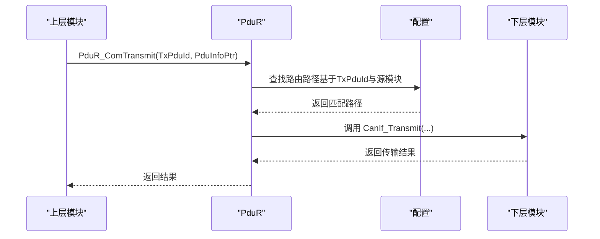
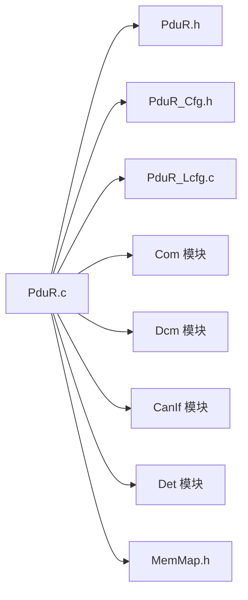

# 路由路径组管理

<cite>
**本文引用的文件**
- [PduR.h](file://src/bsw/services/pdur/include/PduR.h)
- [PduR_Cfg.h](file://src/bsw/services/pdur/include/PduR_Cfg.h)
- [PduR.c](file://src/bsw/services/pdur/src/PduR.c)
- [PduR_Lcfg.c](file://src/bsw/services/pdur/src/PduR_Lcfg.c)
- [PduR_test.c](file://src/bsw/services/pdur/src/PduR_test.c)
- [PduR_spec.md](file://openspec/changes/dev-pdu-router/specs/PduR_spec.md)
- [pdur_verification.md](file://verification/pdur_verification.md)
- [PduR_Cfg.h](file://src/bsw/config/templates/PduR_Cfg.h)
</cite>

## 目录
1. [简介](#简介)
2. [项目结构](#项目结构)
3. [核心组件](#核心组件)
4. [架构总览](#架构总览)
5. [详细组件分析](#详细组件分析)
6. [依赖关系分析](#依赖关系分析)
7. [性能考虑](#性能考虑)
8. [故障排查指南](#故障排查指南)
9. [结论](#结论)
10. [附录](#附录)

## 简介
本文件围绕PduR（PDU Router）模块中的“路由路径组”管理进行深入技术文档化，重点解释以下内容：
- PduR_RoutingPathGroupConfigType结构的设计原理与管理机制
- PduR_EnableRouting与PduR_DisableRouting的实现逻辑、路径组状态管理与动态启停机制
- 路径组配置参数、默认启用状态处理与组间依赖关系
- 路径组与PduIdType的映射关系、组内路径优先级规则与冲突处理策略
- 路径组配置优化、性能调优建议与故障恢复机制
- 路径组调试工具使用指南与监控方法

## 项目结构
PduR模块位于服务层，负责在上层模块（如Com、Dcm）与底层通信接口（如CanIf）之间进行I-PDU路由。路径组管理是配置层面的重要能力，用于按业务域或功能域对路由路径进行分组与启停控制。

图表来源
- [PduR.h:162-282](file://src/bsw/services/pdur/include/PduR.h#L162-L282)
- [PduR.c:19-36](file://src/bsw/services/pdur/src/PduR.c#L19-L36)
- [PduR_Cfg.h:1-67](file://src/bsw/services/pdur/include/PduR_Cfg.h#L1-L67)
- [PduR_Lcfg.c:38-261](file://src/bsw/services/pdur/src/PduR_Lcfg.c#L38-L261)

章节来源
- [PduR.h:162-282](file://src/bsw/services/pdur/include/PduR.h#L162-L282)
- [PduR.c:19-36](file://src/bsw/services/pdur/src/PduR.c#L19-L36)
- [PduR_Cfg.h:1-67](file://src/bsw/services/pdur/include/PduR_Cfg.h#L1-L67)
- [PduR_Lcfg.c:38-261](file://src/bsw/services/pdur/src/PduR_Lcfg.c#L38-L261)

## 核心组件
- 路径组配置类型：PduR_RoutingPathGroupConfigType
  - 字段含义：GroupId（组ID）、PduIds（该组包含的PduId集合）、NumPduIds（数量）、DefaultEnabled（默认启用状态）
- 路由路径状态：PduR_RoutingPathStateType
  - 字段含义：FifoQueue（每条路径的FIFO队列）、IsEnabled（路径组启用标志）
- 内部状态：PduR_InternalStateType
  - 字段含义：State（模块状态）、ConfigPtr（配置指针）、PathStates[PDUR_NUMBER_OF_ROUTING_PATHS]（路径状态数组）

章节来源
- [PduR.h:130-149](file://src/bsw/services/pdur/include/PduR.h#L130-L149)
- [PduR.c:81-94](file://src/bsw/services/pdur/src/PduR.c#L81-L94)

## 架构总览
PduR通过配置驱动的方式管理路由路径组。初始化时，模块将所有路径状态初始化为启用；运行时，路径组的启用/禁用通过PduR_EnableRouting/PduR_DisableRouting进行动态控制。路径组与PduId的映射关系由链接时配置文件提供，模块在运行时根据PduId查找对应的路由路径并执行转发。

图表来源
- [PduR.c:374-420](file://src/bsw/services/pdur/src/PduR.c#L374-L420)
- [PduR.c:693-712](file://src/bsw/services/pdur/src/PduR.c#L693-L712)
- [PduR.c:428-466](file://src/bsw/services/pdur/src/PduR.c#L428-L466)
- [PduR.c:512-571](file://src/bsw/services/pdur/src/PduR.c#L512-L571)
- [PduR.c:474-504](file://src/bsw/services/pdur/src/PduR.c#L474-L504)

## 详细组件分析

### PduR_RoutingPathGroupConfigType 结构设计与管理机制
- 设计要点
  - 组标识：GroupId唯一标识一个路径组
  - 成员映射：PduIds指向一组PduId，NumPduIds给出数量
  - 默认状态：DefaultEnabled指示该组在初始化后是否默认启用
- 管理机制
  - 初始化：模块内部状态数组PathStates按路径数量分配，每个路径对应一个状态
  - 启用/禁用：通过PduR_EnableRouting/PduR_DisableRouting修改对应路径的状态IsEnabled
  - 查找路径：FindRoutingPath根据PduId与模块类型在配置中线性查找匹配路径

章节来源
- [PduR.h:130-137](file://src/bsw/services/pdur/include/PduR.h#L130-L137)
- [PduR.c:81-94](file://src/bsw/services/pdur/src/PduR.c#L81-L94)
- [PduR.c:132-154](file://src/bsw/services/pdur/src/PduR.c#L132-L154)

### PduR_EnableRouting 与 PduR_DisableRouting 实现逻辑
- 实现要点
  - 边界检查：仅当id小于最大路径组数时才更新
  - 状态更新：直接设置对应路径状态的IsEnabled为TRUE/FALSE
- 动态启停机制
  - 通过外部API动态控制路径组的启用/禁用
  - 适用于业务域切换、故障隔离、带宽控制等场景

图表来源
- [PduR.c:693-712](file://src/bsw/services/pdur/src/PduR.c#L693-L712)

章节来源
- [PduR.c:693-712](file://src/bsw/services/pdur/src/PduR.c#L693-L712)

### 路径组配置参数、默认启用状态处理与组间依赖关系
- 配置参数
  - 路径组数量：PDUR_NUMBER_OF_ROUTING_PATH_GROUPS
  - 路径数量：PDUR_NUMBER_OF_ROUTING_PATHS
  - 最大目的地数：PDUR_MAX_DESTINATIONS_PER_PATH
  - FIFO深度：PDUR_FIFO_DEPTH
- 默认启用状态
  - 在链接时配置中，部分路径组的DefaultEnabled为TRUE，表示初始化后即启用
  - 初始化时，模块会将所有路径状态初始化为启用（见初始化流程）
- 组间依赖关系
  - 当前实现未显式支持路径组间的依赖关系；路径组独立管理
  - 若存在跨组依赖需求，可在上层逻辑中通过业务策略实现

章节来源
- [PduR_Cfg.h:21-23](file://src/bsw/services/pdur/include/PduR_Cfg.h#L21-L23)
- [PduR_Lcfg.c:218-243](file://src/bsw/services/pdur/src/PduR_Lcfg.c#L218-L243)
- [PduR.c:390-394](file://src/bsw/services/pdur/src/PduR.c#L390-L394)

### 路径组与PduIdType的映射关系、组内路径优先级规则与冲突处理策略
- 映射关系
  - 路径组通过PduIds数组维护一组PduId；模块在运行时根据PduId查找路由路径
  - 查找算法为线性搜索，匹配条件包括PduId与源模块类型
- 优先级规则
  - 当前实现未定义组内路径的优先级；路径遍历顺序由配置中定义的顺序决定
- 冲突处理策略
  - 若同一PduId被多个路径组包含，模块将按配置顺序依次匹配，未提供去重或优先级裁决
  - 建议在配置阶段避免重复映射同一PduId至不同路径组

章节来源
- [PduR_Lcfg.c:202-243](file://src/bsw/services/pdur/src/PduR_Lcfg.c#L202-L243)
- [PduR.c:132-154](file://src/bsw/services/pdur/src/PduR.c#L132-L154)

### 路由路径状态管理与主函数调度
- 路径状态
  - 每个路径对应一个FIFO队列与启用标志
  - FIFO用于延迟路由（Deferred），主函数周期性处理队列
- 主函数调度
  - PduR_MainFunction在模块初始化状态下遍历所有路径
  - 对于非空的FIFO队列，尝试弹出一条PDU并重新路由

图表来源
- [PduR.c:746-772](file://src/bsw/services/pdur/src/PduR.c#L746-L772)

章节来源
- [PduR.c:746-772](file://src/bsw/services/pdur/src/PduR.c#L746-L772)

### API工作流（以PduR_Transmit为例）

图表来源
- [PduR.c:428-466](file://src/bsw/services/pdur/src/PduR.c#L428-L466)
- [PduR.c:132-154](file://src/bsw/services/pdur/src/PduR.c#L132-L154)

章节来源
- [PduR.c:428-466](file://src/bsw/services/pdur/src/PduR.c#L428-L466)
- [PduR.c:132-154](file://src/bsw/services/pdur/src/PduR.c#L132-L154)

## 依赖关系分析
- 外部依赖
  - 上层模块：Com、Dcm
  - 下层模块：CanIf
  - 公共模块：Det（错误检测）、MemMap（内存分区）
- 内部耦合
  - PduR.c依赖PduR.h与PduR_Cfg.h提供的类型与宏
  - 链接时配置PduR_Lcfg.c提供具体路由路径与路径组配置
- 配置与实现一致性
  - 配置头文件与链接时配置需保持常量与枚举的一致性

图表来源
- [PduR.c:19-36](file://src/bsw/services/pdur/src/PduR.c#L19-L36)
- [PduR.h:19-21](file://src/bsw/services/pdur/include/PduR.h#L19-L21)
- [PduR_Cfg.h:1-67](file://src/bsw/services/pdur/include/PduR_Cfg.h#L1-L67)
- [PduR_Lcfg.c:38-261](file://src/bsw/services/pdur/src/PduR_Lcfg.c#L38-L261)

章节来源
- [PduR.c:19-36](file://src/bsw/services/pdur/src/PduR.c#L19-L36)
- [PduR.h:19-21](file://src/bsw/services/pdur/include/PduR.h#L19-L21)
- [PduR_Cfg.h:1-67](file://src/bsw/services/pdur/include/PduR_Cfg.h#L1-L67)
- [PduR_Lcfg.c:38-261](file://src/bsw/services/pdur/src/PduR_Lcfg.c#L38-L261)

## 性能考虑
- 时间复杂度
  - 路由路径查找：O(n)，n为路由路径数量
  - FIFO操作：O(1)
- 空间复杂度
  - 静态内存分配，FIFO缓冲区大小可配置
- 调优建议
  - 合理设置PDUR_NUMBER_OF_ROUTING_PATHS与PDUR_NUMBER_OF_ROUTING_PATH_GROUPS
  - 控制PDUR_FIFO_DEPTH以平衡延迟与内存占用
  - 在配置阶段避免冗余路径，减少查找开销
  - 考虑添加路由路径缓存以优化查找性能（当前实现未实现）

章节来源
- [pdur_verification.md:103-111](file://verification/pdur_verification.md#L103-L111)
- [PduR_spec.md:183-196](file://openspec/changes/dev-pdu-router/specs/PduR_spec.md#L183-L196)

## 故障排查指南
- 常见错误与定位
  - 未初始化调用：PduR_E_UNINIT，检查初始化流程
  - 空指针参数：PduR_E_PARAM_POINTER，检查传入指针有效性
  - 路由路径未找到：PduR_E_ROUTING_PATH_NOT_FOUND，检查PduId与模块类型配置
- 调试工具与监控
  - 使用单元测试覆盖关键路径（初始化、路由、回调、版本信息等）
  - 通过PduR_MainFunction周期性处理延迟路由，观察FIFO队列状态
  - 在配置阶段严格校验路径组与PduId映射，避免重复与冲突

章节来源
- [PduR_test.c:136-325](file://src/bsw/services/pdur/src/PduR_test.c#L136-L325)
- [pdur_verification.md:11-129](file://verification/pdur_verification.md#L11-L129)

## 结论
PduR的路径组管理通过配置驱动实现了灵活的路由控制。PduR_RoutingPathGroupConfigType提供了简洁的组定义方式，结合PduR_EnableRouting/PduR_DisableRouting实现了动态启停。当前实现未提供路径组间的显式依赖关系与组内优先级规则，但通过配置阶段的合理规划可以满足大多数应用场景。建议在后续版本中引入路径缓存与优先级机制以进一步提升性能与可控性。

## 附录
- 配置模板参考
  - 预编译配置项：PDUR_DEV_ERROR_DETECT、PDUR_NUMBER_OF_ROUTING_PATHS、PDUR_NUMBER_OF_ROUTING_PATH_GROUPS、PDUR_FIFO_DEPTH等
- 规格与验证
  - 规格文档定义了数据类型、API列表与场景描述
  - 验证报告确认了功能、代码质量与接口兼容性

章节来源
- [PduR_Cfg.h:20-64](file://src/bsw/services/pdur/include/PduR_Cfg.h#L20-L64)
- [PduR_spec.md:183-259](file://openspec/changes/dev-pdu-router/specs/PduR_spec.md#L183-L259)
- [pdur_verification.md:1-129](file://verification/pdur_verification.md#L1-L129)