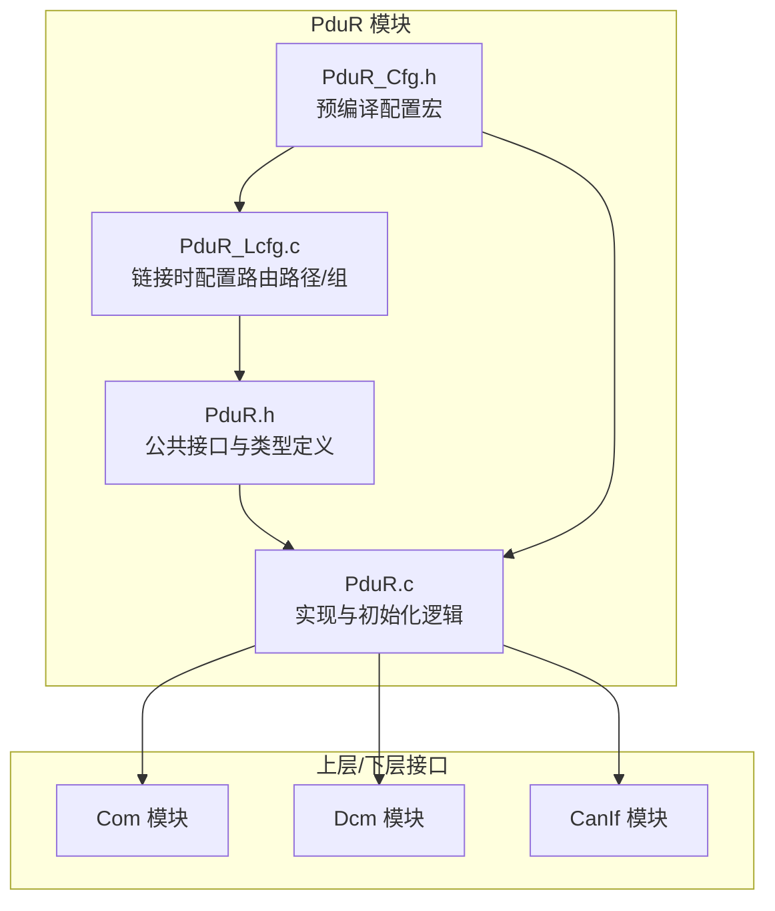
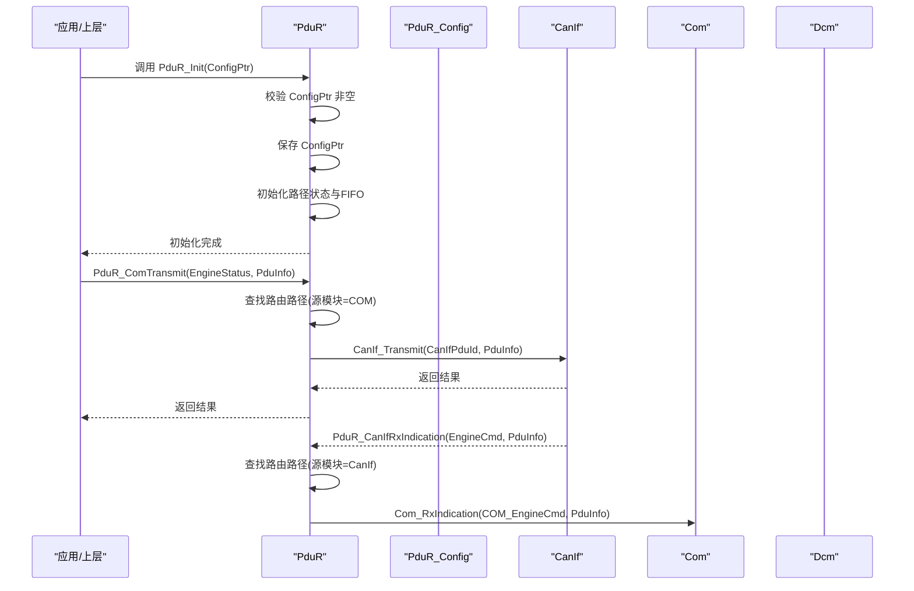
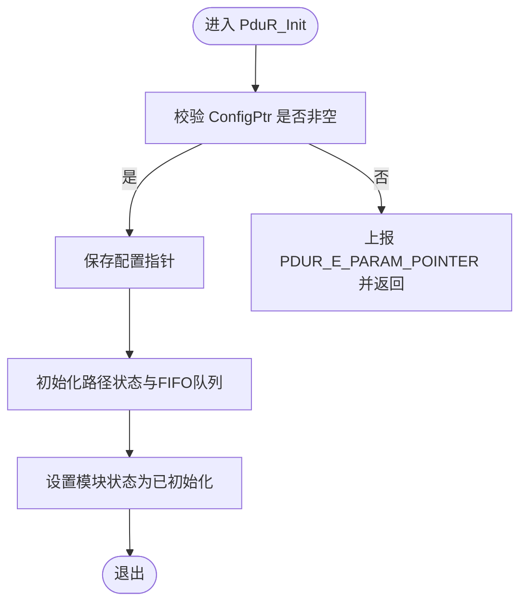
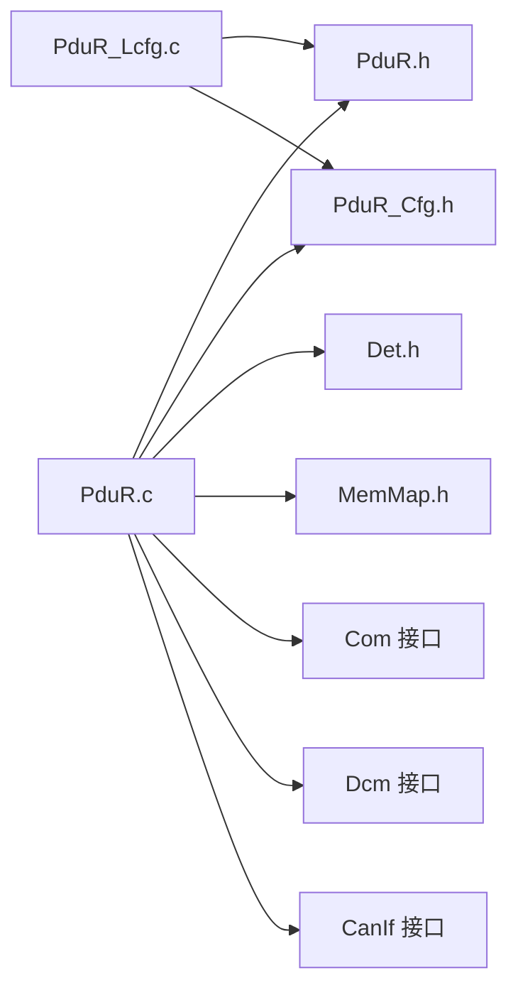

# 路由配置与初始化

<cite>
**本文引用的文件**
- [PduR.h](file://src/bsw/services/pdur/include/PduR.h)
- [PduR_Cfg.h](file://src/bsw/services/pdur/include/PduR_Cfg.h)
- [PduR.c](file://src/bsw/services/pdur/src/PduR.c)
- [PduR_Lcfg.c](file://src/bsw/services/pdur/src/PduR_Lcfg.c)
- [PduR_spec.md](file://openspec/changes/dev-pdu-router/specs/PduR_spec.md)
- [pdur_verification.md](file://verification/pdur_verification.md)
- [PduR_test.c](file://src/bsw/services/pdur/src/PduR_test.c)
- [architecture.md](file://docs/architecture.md)
- [PduR_Cfg.h（模板）](file://src/bsw/config/templates/PduR_Cfg.h)
</cite>

## 目录
1. [简介](#简介)
2. [项目结构](#项目结构)
3. [核心组件](#核心组件)
4. [架构总览](#架构总览)
5. [详细组件分析](#详细组件分析)
6. [依赖关系分析](#依赖关系分析)
7. [性能考量](#性能考量)
8. [故障排查指南](#故障排查指南)
9. [结论](#结论)
10. [附录](#附录)

## 简介
本文件聚焦于 PduR（PDU 路由器）的“路由配置与初始化”能力，系统化阐述：
- PduR_Init 初始化流程与配置参数验证机制
- PduR_ConfigType 配置结构体各字段含义与作用
- 路由路径配置 PduR_RoutingPathConfigType 与路由组配置 PduR_RoutingPathGroupConfigType 的结构与用途
- 配置验证规则、错误检测机制与初始化失败处理策略
- 配置文件编写指南、最佳实践与常见错误排除方法
- 完整配置示例与配置验证工具使用说明

## 项目结构
围绕 PduR 的配置与实现，相关文件分布如下：
- 头文件与配置头：PduR.h、PduR_Cfg.h
- 实现与链接时配置：PduR.c、PduR_Lcfg.c
- 规范与验证：PduR_spec.md、pdur_verification.md
- 单元测试与模板：PduR_test.c、PduR_Cfg.h（模板）

图表来源
- [PduR.h:165-280](file://src/bsw/services/pdur/include/PduR.h#L165-L280)
- [PduR.c:374-420](file://src/bsw/services/pdur/src/PduR.c#L374-L420)
- [PduR_Lcfg.c:246-253](file://src/bsw/services/pdur/src/PduR_Lcfg.c#L246-L253)
- [PduR_Cfg.h:15-65](file://src/bsw/services/pdur/include/PduR_Cfg.h#L15-L65)

章节来源
- [PduR.h:1-282](file://src/bsw/services/pdur/include/PduR.h#L1-L282)
- [PduR_Cfg.h:1-67](file://src/bsw/services/pdur/include/PduR_Cfg.h#L1-L67)
- [PduR.c:1-780](file://src/bsw/services/pdur/src/PduR.c#L1-L780)
- [PduR_Lcfg.c:1-261](file://src/bsw/services/pdur/src/PduR_Lcfg.c#L1-L261)

## 核心组件
- PduR_ConfigType：全局配置结构体，承载路由路径数组、路由路径组数组、数量以及开关参数
- PduR_RoutingPathConfigType：单条路由路径配置，描述源 PDU、目标 PDU 列表、路径类型与网关操作标志
- PduR_RoutingPathGroupConfigType：路由路径组配置，按组启用/禁用一组 PDU
- PduR_SrcPduConfigType / PduR_DestPduConfigType：源/目的 PDU 配置，含模块类型、长度、处理策略等
- 预编译配置宏：控制最大路径数、最大目标数、FIFO 深度、模块 ID、PDU ID、是否启用 DET 等

章节来源
- [PduR.h:102-149](file://src/bsw/services/pdur/include/PduR.h#L102-L149)
- [PduR_Cfg.h:15-65](file://src/bsw/services/pdur/include/PduR_Cfg.h#L15-L65)
- [PduR_spec.md:140-150](file://openspec/changes/dev-pdu-router/specs/PduR_spec.md#L140-L150)

## 架构总览
PduR 在 AutoSAR 分层中位于 Service 层，负责将上层（Com、Dcm）与下层（CanIf 等）之间的 I-PDU 进行路由。初始化阶段，PduR 将配置指针保存至内部状态，并初始化每条路由路径的状态与 FIFO 队列；运行期通过查找表定位路径，将请求转发给对应模块。

图表来源
- [PduR.c:374-466](file://src/bsw/services/pdur/src/PduR.c#L374-L466)
- [PduR.c:474-504](file://src/bsw/services/pdur/src/PduR.c#L474-L504)
- [PduR.c:132-154](file://src/bsw/services/pdur/src/PduR.c#L132-L154)

章节来源
- [PduR.c:374-466](file://src/bsw/services/pdur/src/PduR.c#L374-L466)
- [PduR.c:474-504](file://src/bsw/services/pdur/src/PduR.c#L474-L504)
- [architecture.md:164-185](file://docs/architecture.md#L164-L185)

## 详细组件分析

### PduR_Init 初始化流程与配置参数验证
- 入口：PduR_Init(const PduR_ConfigType* ConfigPtr)
- 参数校验：当 PDUR_DEV_ERROR_DETECT 为 STD_ON 且 ConfigPtr 为空时，上报 PDUR_E_PARAM_POINTER 并返回
- 初始化步骤：
  - 保存配置指针至内部状态
  - 初始化每条路由路径的状态（默认启用）
  - 初始化每条路径对应的 FIFO 队列（容量由 PDUR_MAX_FIFO_DEPTH 控制）
  - 设置模块状态为已初始化
- 失败处理：若未通过参数校验，DET 会记录错误码；模块状态保持未初始化

图表来源
- [PduR.c:374-398](file://src/bsw/services/pdur/src/PduR.c#L374-L398)

章节来源
- [PduR.c:374-398](file://src/bsw/services/pdur/src/PduR.c#L374-L398)
- [PduR_spec.md:174-176](file://openspec/changes/dev-pdu-router/specs/PduR_spec.md#L174-L176)

### PduR_ConfigType 配置结构体详解
- 字段说明
  - RoutingPaths：指向路由路径数组的指针
  - NumRoutingPaths：路由路径数量
  - RoutingPathGroups：指向路由路径组数组的指针
  - NumRoutingPathGroups：路由路径组数量
  - DevErrorDetect：是否启用 DET 错误检测
  - VersionInfoApi：是否启用版本信息 API
- 作用：作为全局配置入口，供 PduR_Init 读取并建立运行时路由表

章节来源
- [PduR.h:142-149](file://src/bsw/services/pdur/include/PduR.h#L142-L149)
- [PduR_Lcfg.c:246-253](file://src/bsw/services/pdur/src/PduR_Lcfg.c#L246-L253)

### 路由路径配置 PduR_RoutingPathConfigType
- 字段说明
  - SrcPdu：源 PDU 配置（SourcePduId、SourceModule、SduLength）
  - DestPdus：目的 PDU 配置数组指针
  - NumDestPdus：目的 PDU 数量
  - PathType：路径类型（DIRECT/FIFO/GATEWAY）
  - GatewayOperation：是否启用网关操作
- 用途：定义一条从源模块到一个或多个目的模块的路由路径

章节来源
- [PduR.h:119-127](file://src/bsw/services/pdur/include/PduR.h#L119-L127)
- [PduR_Lcfg.c:114-199](file://src/bsw/services/pdur/src/PduR_Lcfg.c#L114-L199)

### 路由组配置 PduR_RoutingPathGroupConfigType
- 字段说明
  - GroupId：组标识
  - PduIds：该组内包含的 PDU ID 数组
  - NumPduIds：PDU 数量
  - DefaultEnabled：默认启用状态
- 用途：通过组维度启用/禁用一组 PDU 的路由路径，便于批量控制

章节来源
- [PduR.h:129-137](file://src/bsw/services/pdur/include/PduR.h#L129-L137)
- [PduR_Lcfg.c:201-243](file://src/bsw/services/pdur/src/PduR_Lcfg.c#L201-L243)

### 预编译配置宏（PduR_Cfg.h）
- 开关与容量
  - PDUR_DEV_ERROR_DETECT：是否启用 DET
  - PDUR_VERSION_INFO_API：是否启用版本信息 API
  - PDUR_NUMBER_OF_ROUTING_PATHS：最大路由路径数
  - PDUR_NUMBER_OF_ROUTING_PATH_GROUPS：最大路由路径组数
  - PDUR_MAX_DESTINATIONS_PER_PATH：每路径最大目的数
  - PDUR_FIFO_DEPTH / PDUR_MAX_FIFO_DEPTH：FIFO 深度
- 模块 ID 与 PDU ID
  - PDUR_MODULE_*：模块类型枚举值
  - PDUR_*_TX_* / PDUR_*_RX_*：PDU ID 宏
- 主函数周期
  - PDUR_MAIN_FUNCTION_PERIOD_MS：主函数周期（毫秒）

章节来源
- [PduR_Cfg.h:15-65](file://src/bsw/services/pdur/include/PduR_Cfg.h#L15-L65)
- [PduR_Cfg.h（模板）:20-70](file://src/bsw/config/templates/PduR_Cfg.h#L20-L70)

### 链接时配置示例（PduR_Lcfg.c）
- 目标 PDU 配置：每个目标包含 DestPduId、DestModule、Processing（立即/延迟）、FifoDepth
- 路由路径配置：每条路径包含 SrcPdu、DestPdus、NumDestPdus、PathType、GatewayOperation
- 路由路径组配置：按组组织 PduIds，指定 DefaultEnabled
- 全局配置：PduR_Config 指向上述数组与数量，并设置 DevErrorDetect 与 VersionInfoApi

章节来源
- [PduR_Lcfg.c:41-253](file://src/bsw/services/pdur/src/PduR_Lcfg.c#L41-L253)

### 初始化失败与错误检测机制
- DET 错误码（部分）
  - PDUR_E_PARAM_POINTER：传入空配置指针
  - PDUR_E_UNINIT：模块未初始化即调用 API
  - PDUR_E_ROUTING_PATH_NOT_FOUND：未找到匹配的路由路径
- 触发条件
  - PduR_Init：ConfigPtr 为空
  - PduR_DeInit：模块状态非已初始化
  - PduR_Transmit/RxIndication/TxConfirmation：模块未初始化
  - PduR_RxIndication：PduInfoPtr 为空
- 处理策略
  - DET 上报错误码
  - 返回 E_NOT_OK 或不继续处理
  - 初始化成功后模块状态置为已初始化

章节来源
- [PduR.h:53-71](file://src/bsw/services/pdur/include/PduR.h#L53-L71)
- [PduR.c:407-420](file://src/bsw/services/pdur/src/PduR.c#L407-L420)
- [PduR.c:433-466](file://src/bsw/services/pdur/src/PduR.c#L433-L466)
- [PduR.c:478-504](file://src/bsw/services/pdur/src/PduR.c#L478-L504)
- [PduR.c:516-522](file://src/bsw/services/pdur/src/PduR.c#L516-L522)
- [PduR_spec.md:154-180](file://openspec/changes/dev-pdu-router/specs/PduR_spec.md#L154-L180)

### 配置验证与单元测试
- 验证报告要点
  - 初始化功能：配置指针存储、路径状态与 FIFO 初始化、模块状态设置
  - 反初始化功能：配置指针清除、状态回退、DET 正常
  - 路由查找：按 PDU ID 与模块类型正确匹配
  - 向下/向上路由：COM/DCM 与 CanIf 之间的转发正确
  - FIFO 管理：Push/Pop、满/空检测
  - 主函数：延迟路由处理
- 单元测试覆盖
  - 有效配置初始化
  - 空配置指针初始化错误
  - COM 发送路由到 CanIf
  - 未初始化调用 API 的错误
  - CanIf 接收路由到 COM
  - CanIf 发送确认路由到 COM
  - 版本信息查询
  - 未知 PDU ID 的处理

章节来源
- [pdur_verification.md:11-61](file://verification/pdur_verification.md#L11-L61)
- [PduR_test.c:136-325](file://src/bsw/services/pdur/src/PduR_test.c#L136-L325)

## 依赖关系分析
- 内部依赖
  - PduR.c 依赖 PduR.h、PduR_Cfg.h、Det.h、MemMap.h
  - 内部状态包含模块状态、配置指针、每路径的 FIFO 队列与启用状态
- 外部接口
  - 上层：Com_RxIndication、Com_TxConfirmation、Com_TriggerTransmit
  - 下层：CanIf_Transmit、CanIf_CancelTransmit、CanIf_RxIndication、CanIf_TxConfirmation
- 配置依赖
  - 预编译宏决定最大路径数、最大目标数、FIFO 深度、模块 ID、PDU ID、开关

图表来源
- [PduR.c:19-36](file://src/bsw/services/pdur/src/PduR.c#L19-L36)
- [PduR_Lcfg.c:16-18](file://src/bsw/services/pdur/src/PduR_Lcfg.c#L16-L18)

章节来源
- [PduR.c:19-36](file://src/bsw/services/pdur/src/PduR.c#L19-L36)
- [PduR_Lcfg.c:16-18](file://src/bsw/services/pdur/src/PduR_Lcfg.c#L16-L18)

## 性能考量
- 时间复杂度
  - 路由查找：O(n)，n 为 NumRoutingPaths
  - FIFO 操作：O(1)
- 空间复杂度
  - 静态内存分配：路由路径数组、路径组数组、内部状态
  - FIFO 缓冲区大小可配置，受 PDUR_MAX_FIFO_DEPTH 限制
- 实时性
  - 主函数周期由 PDUR_MAIN_FUNCTION_PERIOD_MS 控制，用于轮询处理延迟路由

章节来源
- [pdur_verification.md:103-112](file://verification/pdur_verification.md#L103-L112)
- [PduR_Cfg.h:64-65](file://src/bsw/services/pdur/include/PduR_Cfg.h#L64-L65)

## 故障排查指南
- 初始化失败
  - 现象：PduR_Init 返回 E_NOT_OK 或 DET 报错
  - 排查：确认 ConfigPtr 非空；检查 PduR_Config 是否正确链接
- 未初始化调用 API
  - 现象：调用 PduR_Transmit/RxIndication/TxConfirmation 返回 E_NOT_OK
  - 排查：确保先调用 PduR_Init；避免重复 DeInit 后再次调用
- 未找到路由路径
  - 现象：PduR_Transmit/RxIndication 返回 E_NOT_OK
  - 排查：确认 PduR_Config 中是否存在匹配的 SourcePduId 与 SourceModule；检查模块 ID 宏是否正确
- FIFO 相关问题
  - 现象：延迟路由未被处理或数据丢失
  - 排查：确认 FIFO 深度配置合理；检查主函数周期与调用频率
- 配置不一致
  - 现象：PduR_Config 与实际模块/接口不匹配
  - 排查：核对 PduR_Cfg.h 与 PduR_Lcfg.c 的宏定义一致性；确保 DestPduId 与下层模块映射正确

章节来源
- [PduR.h:53-71](file://src/bsw/services/pdur/include/PduR.h#L53-L71)
- [PduR.c:433-466](file://src/bsw/services/pdur/src/PduR.c#L433-L466)
- [PduR.c:478-504](file://src/bsw/services/pdur/src/PduR.c#L478-L504)
- [PduR.c:516-522](file://src/bsw/services/pdur/src/PduR.c#L516-L522)
- [PduR_spec.md:174-180](file://openspec/changes/dev-pdu-router/specs/PduR_spec.md#L174-L180)

## 结论
PduR 的路由配置与初始化以“静态配置 + 运行时状态管理”为核心，通过 PduR_ConfigType、路由路径与路由组配置，实现从上层到下层的可靠路由。初始化流程严格进行参数校验与状态设置，配合 DET 错误检测与单元测试验证，确保在嵌入式实时场景下的稳定性与可维护性。按本文提供的配置指南与最佳实践，可高效完成配置编写与验证。

## 附录

### 配置文件编写指南
- 步骤
  - 在 PduR_Cfg.h 中设置预编译参数（路径数、目标数、FIFO 深度、模块 ID、PDU ID、开关）
  - 在 PduR_Lcfg.c 中定义各目标 PDU 配置数组
  - 在 PduR_Lcfg.c 中定义路由路径数组，填写 SrcPdu、DestPdus、NumDestPdus、PathType、GatewayOperation
  - 在 PduR_Lcfg.c 中定义路由路径组数组，设置 GroupId、PduIds、NumPduIds、DefaultEnabled
  - 在 PduR_Lcfg.c 中定义全局 PduR_Config，赋值上述数组与数量，并设置 DevErrorDetect 与 VersionInfoApi
- 注意事项
  - 确保 SourceModule 与 DestModule 的模块 ID 与预编译宏一致
  - DestPduId 必须与下层模块的 PDU ID 对应
  - NumRoutingPaths 与 NumRoutingPathGroups 不得超过预编译上限
  - 若使用 FIFO 路径，需保证 PDUR_MAX_FIFO_DEPTH 足够

章节来源
- [PduR_Cfg.h:15-65](file://src/bsw/services/pdur/include/PduR_Cfg.h#L15-L65)
- [PduR_Lcfg.c:41-253](file://src/bsw/services/pdur/src/PduR_Lcfg.c#L41-L253)
- [PduR_Cfg.h（模板）:20-70](file://src/bsw/config/templates/PduR_Cfg.h#L20-L70)

### 配置参数最佳实践
- 合理设置最大路径数与目标数，避免运行时越界
- FIFO 深度根据业务峰值流量与主函数周期综合评估
- 将相关模块 ID 与 PDU ID 集中管理，统一命名规范
- 路由路径组用于分组启停，建议按业务域划分（如动力域、车身域、底盘域）

章节来源
- [PduR_Cfg.h:26-65](file://src/bsw/services/pdur/include/PduR_Cfg.h#L26-L65)
- [PduR_Lcfg.c:201-243](file://src/bsw/services/pdur/src/PduR_Lcfg.c#L201-L243)

### 常见配置错误与排除
- 错误：ConfigPtr 为空导致初始化失败
  - 排查：确认 PduR_Config 已正确定义并链接
- 错误：模块 ID 不一致导致路由失败
  - 排查：核对 PduR_Cfg.h 与 PduR_Lcfg.c 的模块 ID 宏
- 错误：DestPduId 与下层模块不匹配
  - 排查：核对 CanIf 等下层模块的 PDU ID 映射
- 错误：路径数/目标数超过上限
  - 排查：调整预编译宏或拆分路径

章节来源
- [PduR.c:378-384](file://src/bsw/services/pdur/src/PduR.c#L378-L384)
- [PduR_Lcfg.c:114-199](file://src/bsw/services/pdur/src/PduR_Lcfg.c#L114-L199)

### 配置验证工具使用说明
- 单元测试
  - 使用 PduR_test.c 中的测试用例验证初始化、路由、回调、版本信息等功能
  - 通过断言 DET 错误码与模块行为的一致性
- 验证报告
  - 参考 pdur_verification.md 的验证结果与结论，确保各项功能通过

章节来源
- [PduR_test.c:136-325](file://src/bsw/services/pdur/src/PduR_test.c#L136-L325)
- [pdur_verification.md:1-129](file://verification/pdur_verification.md#L1-L129)