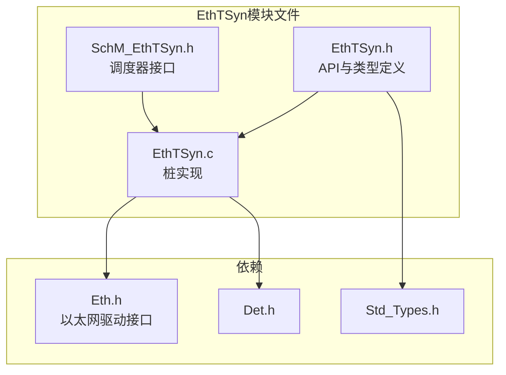
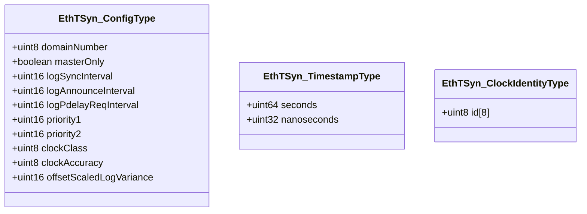
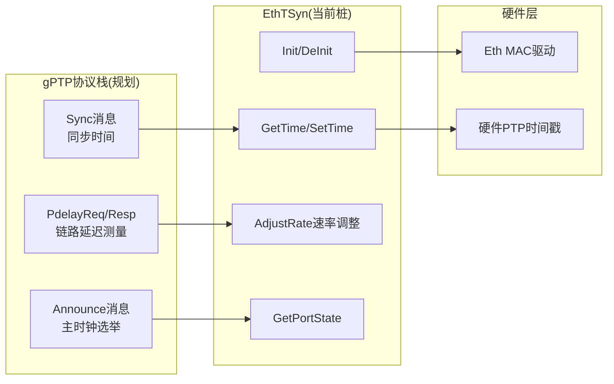
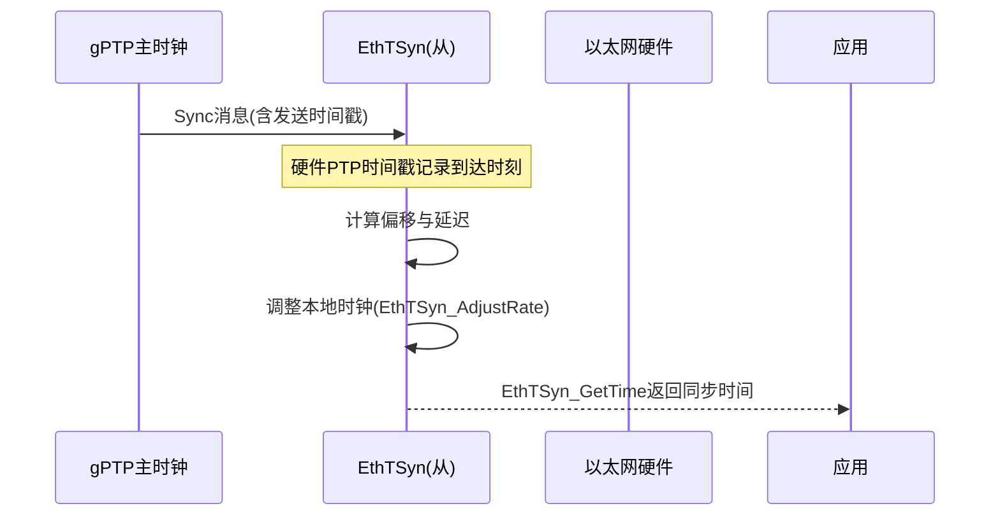
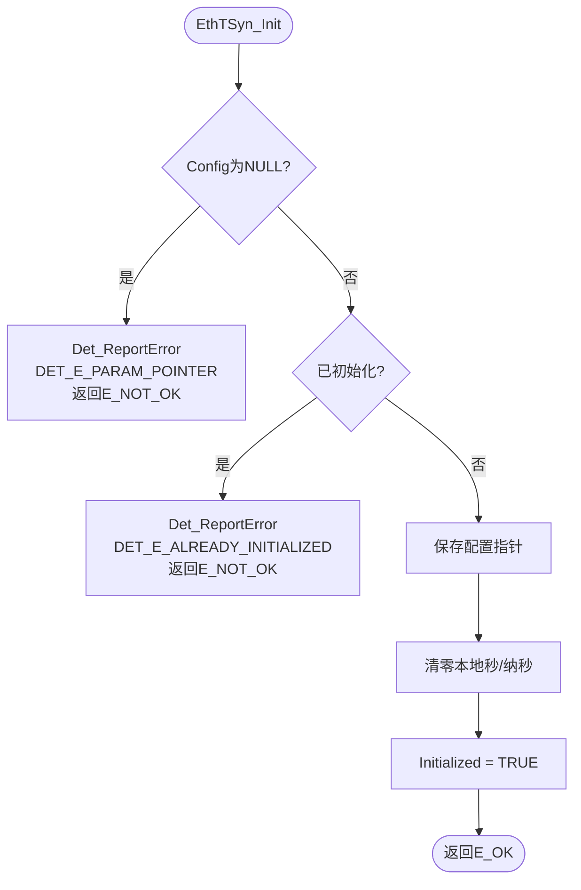
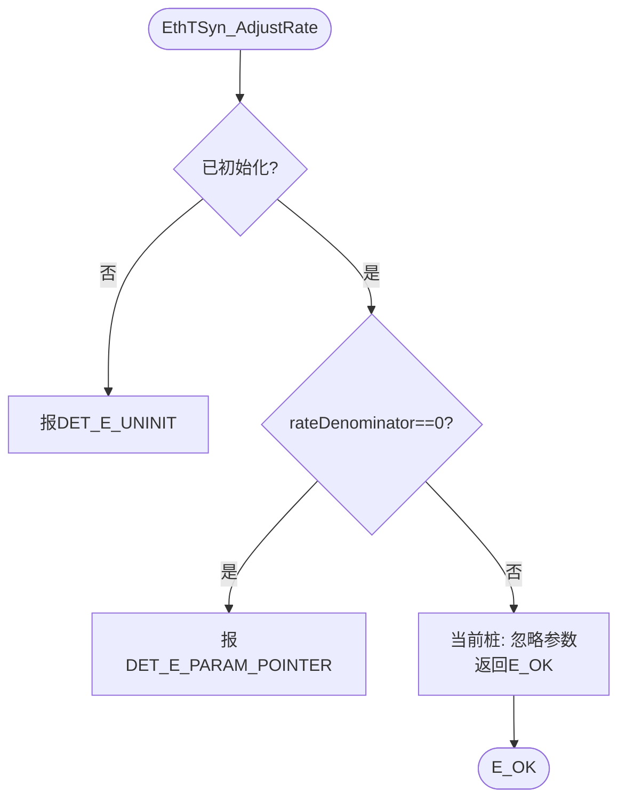

# 以太网时间同步（EthTSyn）

<cite>
**本文档引用的文件**
- [EthTSyn.h](file://src/bsw/services/ethtsyn/include/EthTSyn.h)
- [SchM_EthTSyn.h](file://src/bsw/services/ethtsyn/include/SchM_EthTSyn.h)
- [EthTSyn.c](file://src/bsw/services/ethtsyn/src/EthTSyn.c)
- [Eth.h](file://src/bsw/mcal/eth/include/Eth.h)
- [Det.h](file://src/bsw/services/det/include/Det.h)
- [Std_Types.h](file://src/bsw/os/include/Std_Types.h)
</cite>

## 目录
1. [简介](#简介)
2. [项目结构](#项目结构)
3. [核心组件](#核心组件)
4. [架构概览](#架构概览)
5. [详细组件分析](#详细组件分析)
6. [依赖关系分析](#依赖关系分析)
7. [性能考虑](#性能考虑)
8. [故障排除指南](#故障排除指南)
9. [结论](#结论)
10. [附录](#附录)

## 简介

以太网时间同步（EthTSyn）是遵循AUTOSAR R21-11规范（§12.9）的以太网时间同步模块，位于服务层，模块ID为0x0AUL。EthTSyn依据IEEE 802.1AS（gPTP）提供以太网时间同步服务，实现主从时钟同步、端口状态管理与时钟速率调整。

**重要说明**：当前仓库中的EthTSyn为**完整性占位实现（COMPLETENESS stub）**——提供完整的API结构、类型定义与错误处理框架以支撑可追溯性，但gPTP协议处理与硬件PTP时间戳采集逻辑留待后续完整实现。

## 项目结构

EthTSyn模块在项目中的文件组织如下：



**图表来源**
- [EthTSyn.h:1-16](file://src/bsw/services/ethtsyn/include/EthTSyn.h#L1-L16)
- [EthTSyn.c:8-14](file://src/bsw/services/ethtsyn/src/EthTSyn.c#L8-L14)

### 文件清单

| 文件 | 路径 | 职责 |
|------|------|------|
| EthTSyn.h | include/EthTSyn.h | 配置/时钟身份/端口状态类型与API |
| SchM_EthTSyn.h | include/SchM_EthTSyn.h | SchM调度接口（13行，极简） |
| EthTSyn.c | src/EthTSyn.c | 桩实现（177行） |

**章节来源**
- [EthTSyn.h:1-78](file://src/bsw/services/ethtsyn/include/EthTSyn.h#L1-L78)

## 核心组件

### 配置类型（EthTSyn_ConfigType）



**图表来源**
- [EthTSyn.h:14-38](file://src/bsw/services/ethtsyn/include/EthTSyn.h#L14-L38)

### 端口状态（EthTSyn_PortStateType）

IEEE 802.1AS端口状态机状态：

| 状态 | 说明 |
|------|------|
| ETHTSYN_PORT_INIT | 初始化 |
| ETHTSYN_PORT_FAULTY | 故障 |
| ETHTSYN_PORT_DISABLED | 禁用 |
| ETHTSYN_PORT_LISTENING | 监听 |
| ETHTSYN_PORT_PRE_MASTER | 预备主时钟 |
| ETHTSYN_PORT_MASTER | 主时钟 |
| ETHTSYN_PORT_PASSIVE | 被动 |
| ETHTSYN_PORT_UNCALIBRATED | 未校准 |
| ETHTSYN_PORT_SLAVE | 从时钟 |

**章节来源**
- [EthTSyn.h:40-52](file://src/bsw/services/ethtsyn/include/EthTSyn.h#L40-L52)

### 本地时钟状态

```c
static uint64 EthTSyn_LocalSeconds = 0U;
static uint32 EthTSyn_LocalNanoSeconds = 0U;
```

**章节来源**
- [EthTSyn.c:18-19](file://src/bsw/services/ethtsyn/src/EthTSyn.c#L18-L19)

## 架构概览

EthTSyn在gPTP时间同步体系中的目标架构（当前为桩）：



**图表来源**
- [EthTSyn.h:3-8](file://src/bsw/services/ethtsyn/include/EthTSyn.h#L3-L8)
- [EthTSyn.c:4-7](file://src/bsw/services/ethtsyn/src/EthTSyn.c#L4-L7)

### 时间同步概念流程（目标实现）



**章节来源**
- [EthTSyn.h:3-8](file://src/bsw/services/ethtsyn/include/EthTSyn.h#L3-L8)

## 详细组件分析

### 初始化（EthTSyn_Init）



**章节来源**
- [EthTSyn.c:22-43](file://src/bsw/services/ethtsyn/src/EthTSyn.c#L22-L43)

### 时间读写（EthTSyn_GetTime / EthTSyn_SetTime）

- **EthTSyn_GetTime**：返回本地时钟（seconds+nanoseconds），未初始化报DET_E_UNINIT，空指针报DET_E_PARAM_POINTER
- **EthTSyn_SetTime**：设置本地时钟（当前实现为直接赋值，后续应叠加伺服偏移）

**章节来源**
- [EthTSyn.c:66-105](file://src/bsw/services/ethtsyn/src/EthTSyn.c#L66-L105)

### 速率调整（EthTSyn_AdjustRate）



**说明**：参数（rateNumerator/rateDenominator）为gPTP时钟伺服的比例系数，完整实现时应驱动硬件时钟频率调整。

**章节来源**
- [EthTSyn.c:107-131](file://src/bsw/services/ethtsyn/src/EthTSyn.c#L107-L131)

### 端口状态查询（EthTSyn_GetPortState）

当前桩实现固定返回ETHTSYN_PORT_LISTENING，完整实现时应由gPTP状态机（INIT/LISTENING/PRE_MASTER/MASTER/PASSIVE/UNCALIBRATED/SLAVE/FAULTY/DISABLED）驱动。

**章节来源**
- [EthTSyn.c:133-148](file://src/bsw/services/ethtsyn/src/EthTSyn.c#L133-L148)

### 主函数（EthTSyn_MainFunction）

周期处理入口，当前桩仅检查初始化状态，时间同步周期处理（Announce/Sync/Pdelay消息处理）留待实现。

**章节来源**
- [EthTSyn.c:56-64](file://src/bsw/services/ethtsyn/src/EthTSyn.c#L56-L64)

## 依赖关系分析

```mermaid
graph TB
subgraph "上层"
App[应用/服务]
StbM[StbM时基管理器(规划集成)]
end
subgraph "EthTSyn"
EthTSyn[以太网时间同步]
SchM[SchM_EthTSyn 调度接口]
end
subgraph "下层"
Eth[Eth驱动 MCAL]
HWTS[硬件PTP时间戳]
end
subgraph "基础"
Det[Det]
Std[Std_Types]
end
App --> EthTSyn
StbM --> EthTSyn
EthTSyn --> SchM
EthTSyn --> Eth
Eth --> HWTS
EthTSyn --> Det
EthTSyn --> Std
```

**图表来源**
- [EthTSyn.h:10-12](file://src/bsw/services/ethtsyn/include/EthTSyn.h#L10-L12)
- [EthTSyn.c:8-12](file://src/bsw/services/ethtsyn/src/EthTSyn.c#L8-L12)

### 关键依赖特性

1. **Eth驱动依赖**：通过Eth.h接口接入MAC层（当前桩未实际调用）
2. **SchM接口**：SchM_EthTSyn.h提供调度互斥接口（桩）
3. **Det集成**：全部错误路径通过Det_ReportError上报
4. **StbM规划**：与CanTSyn类似，后续集成StbM统一时基管理

**章节来源**
- [SchM_EthTSyn.h:1-13](file://src/bsw/services/ethtsyn/include/SchM_EthTSyn.h#L1-L13)

## 性能考虑

### 资源占用

- **本地时钟状态**：12字节（seconds+nanoseconds）
- **配置结构**：约20字节
- **代码体积**：约2KB（桩实现）

### 性能特征（目标完整实现）

- **时间戳精度**：依赖硬件PTP时间戳（MAC层），典型精度<1µs
- **周期消息**：Sync消息间隔由logSyncInterval决定（2^logSyncInterval秒）
- **伺服开销**：AdjustRate驱动的时钟伺服计算为低开销定点运算

### 优化建议

1. 完整实现需优先接入硬件PTP时间戳能力（Eth_GetTimeStamp类接口）
2. 主时钟选举（Announce处理）与Sync处理分离调度，避免相互阻塞
3. 时钟伺服使用定点算术避免浮点开销
4. 多端口场景按端口独立状态机，共享时钟伺服

**章节来源**
- [EthTSyn.h:14-38](file://src/bsw/services/ethtsyn/include/EthTSyn.h#L14-L38)

## 故障排除指南

### 错误处理

| 场景 | 上报错误 | 说明 |
|------|----------|------|
| Config为NULL | DET_E_PARAM_POINTER | Init参数错误 |
| 重复初始化 | DET_E_ALREADY_INITIALIZED | 二次Init |
| 未初始化调用 | DET_E_UNINIT | API顺序错误 |
| GetTime空指针 | DET_E_PARAM_POINTER | 输出指针NULL |
| AdjustRate分母0 | DET_E_PARAM_POINTER | 除零防护 |

### 调试建议

1. **功能未实现**：当前为桩，所有时间同步功能不生效属预期——检查后续完整实现版本
2. **Init失败**：检查Config有效性、是否重复Init
3. **时间读取失败**：确认EthTSyn_Init先执行
4. **集成状态**：追踪TODO——硬件时间戳、gPTP状态机、StbM集成

**章节来源**
- [EthTSyn.c:22-43](file://src/bsw/services/ethtsyn/src/EthTSyn.c#L22-L43)

## 结论

以太网时间同步（EthTSyn）模块当前状态：

1. **API框架完整**：Init/DeInit/GetTime/SetTime/AdjustRate/GetPortState/GetClockIdentity全API声明
2. **类型定义齐全**：gPTP配置参数、时钟身份、9态端口状态机枚举
3. **错误处理就绪**：全部API具备DET错误路径
4. **实现状态明确**：属完整性桩，gPTP协议与硬件时间戳待实现

该模块为yuleASR以太网时间同步能力提供了可追溯的框架基础，完整实现需结合Eth MAC硬件PTP能力（IEEE 802.1AS/gPTP）。

## 附录

### API参考

- **生命周期**：EthTSyn_Init(), EthTSyn_DeInit()
- **时间服务**：EthTSyn_GetTime(), EthTSyn_SetTime(), EthTSyn_AdjustRate()
- **端口管理**：EthTSyn_GetPortState(), EthTSyn_GetClockIdentity()
- **周期处理**：EthTSyn_MainFunction()
- **版本信息**：EthTSyn_GetVersionInfo()（ETHTSYN_VERSION_INFO_API开启时）

### 完整实现清单（TODO）

1. 硬件PTP时间戳采集（依赖Eth MAC）
2. gPTP消息处理：Announce（主钟选举）/Sync（时间同步）/Pdelay（链路延迟）
3. 端口状态机实现（9状态）
4. 时钟伺服（EthTSyn_AdjustRate落地）
5. StbM时基管理器集成
