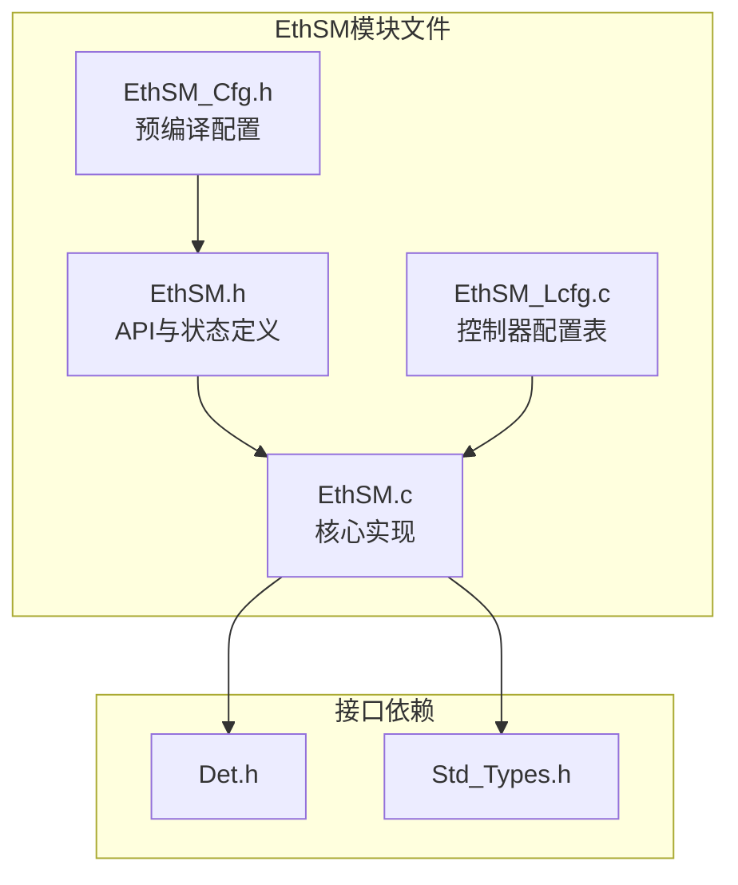
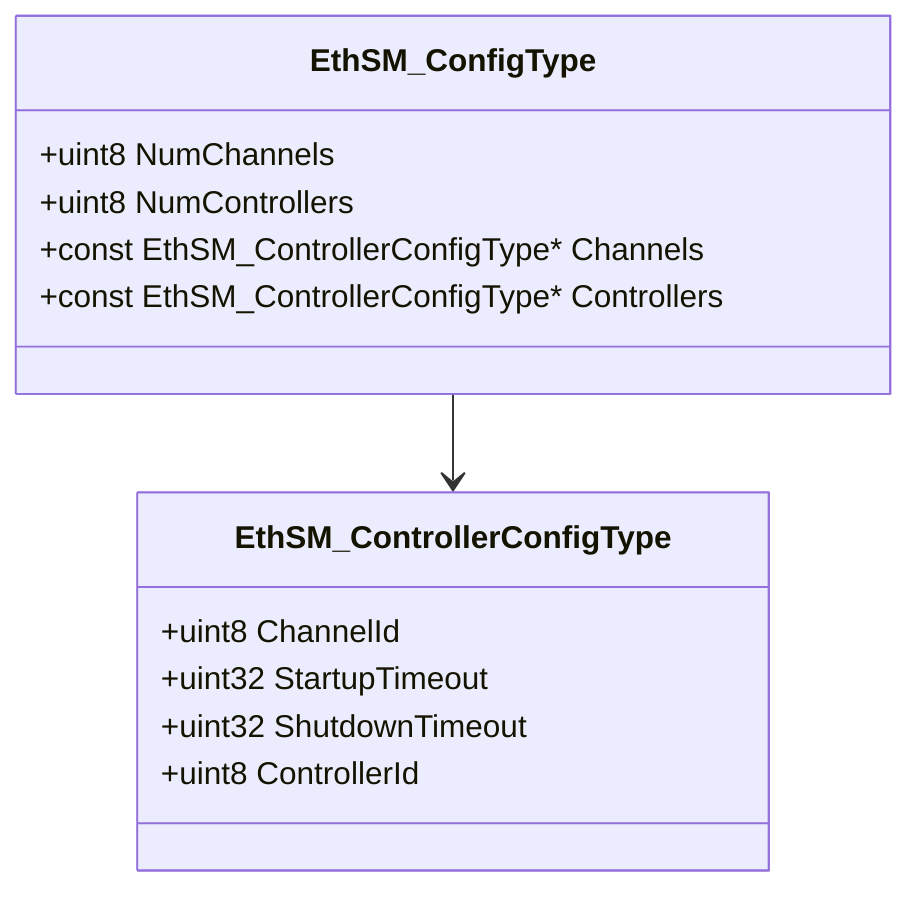
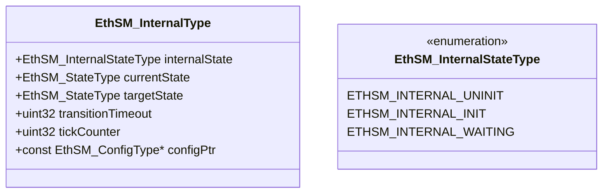
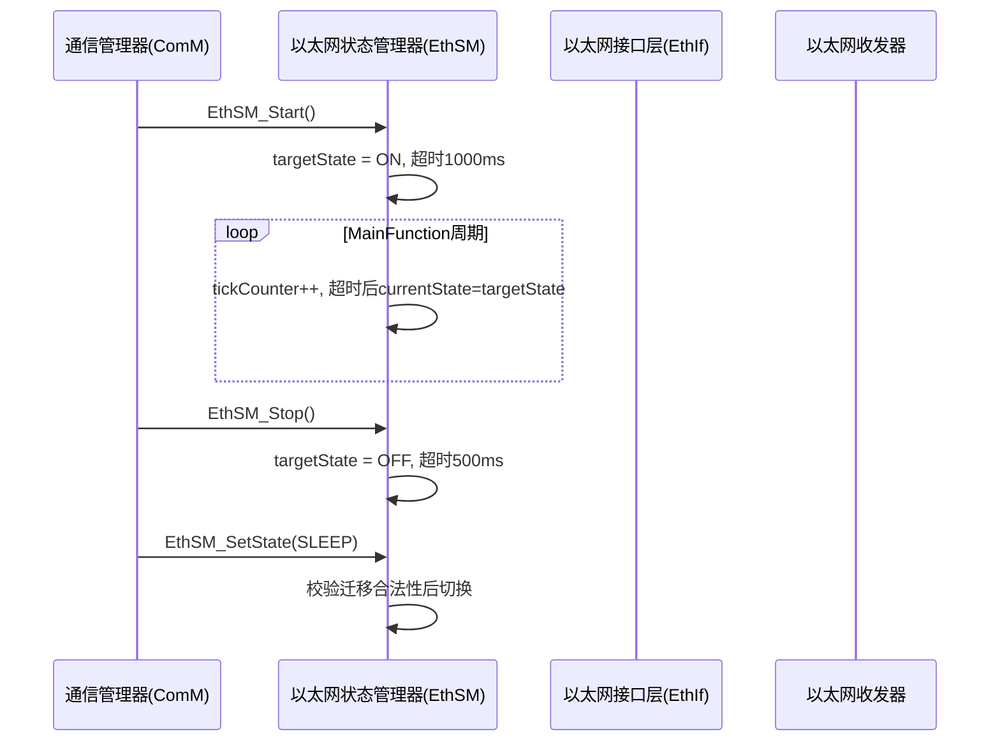
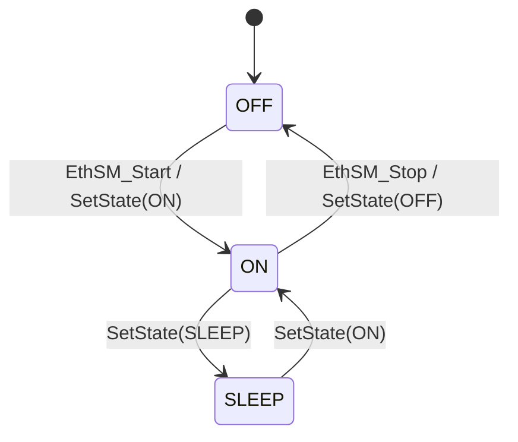
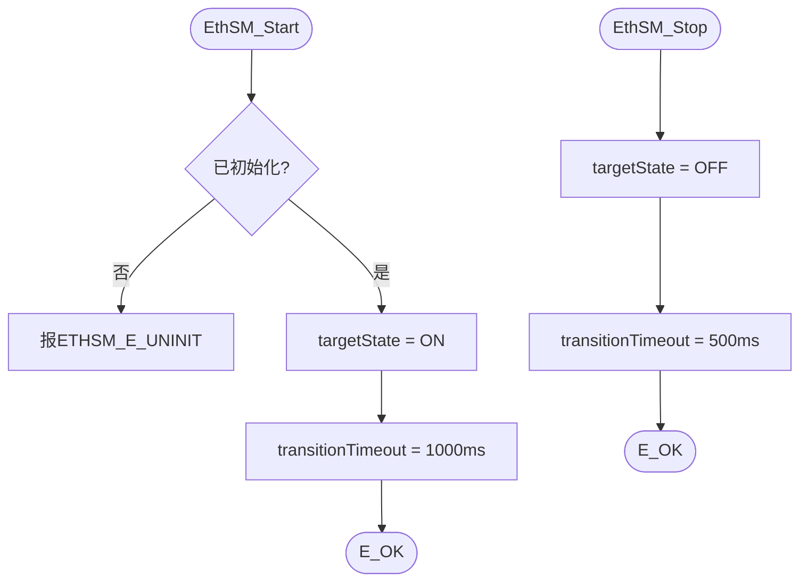
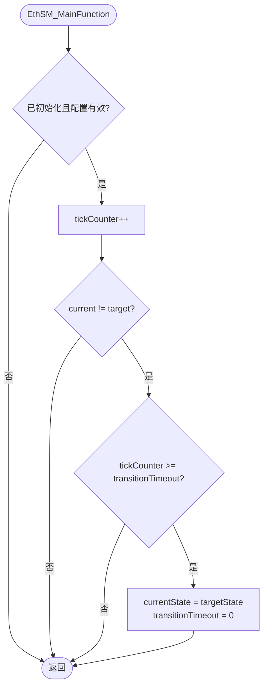

# 以太网状态管理器（EthSM）

<cite>
**本文档引用的文件**
- [EthSM.h](file://src/bsw/services/ethsm/include/EthSM.h)
- [EthSM_Cfg.h](file://src/bsw/services/ethsm/include/EthSM_Cfg.h)
- [EthSM.c](file://src/bsw/services/ethsm/src/EthSM.c)
- [EthSM_Lcfg.c](file://src/bsw/services/ethsm/src/EthSM_Lcfg.c)
- [Det.h](file://src/bsw/services/det/include/Det.h)
- [Std_Types.h](file://src/bsw/os/include/Std_Types.h)
</cite>

## 目录
1. [简介](#简介)
2. [项目结构](#项目结构)
3. [核心组件](#核心组件)
4. [架构概览](#架构概览)
5. [详细组件分析](#详细组件分析)
6. [依赖关系分析](#依赖关系分析)
7. [性能考虑](#性能考虑)
8. [故障排除指南](#故障排除指南)
9. [结论](#结论)
10. [附录](#附录)

## 简介

以太网状态管理器（EthSM）是遵循AUTOSAR_SWS_EthernetStateManager规范的以太网状态管理模块，位于服务层，模块ID为0x8AU（ETHSM_MODULE_ID），厂商ID为0x0055U（YuleTech），软件版本1.0.0。

EthSM负责管理以太网控制器的运行状态（OFF/ON/SLEEP），提供启动/停止/状态切换API与周期性主函数处理。在AUTOSAR以太网栈中，EthSM处于ComM与EthIf/EthTrcv之间的状态管理位置，对应CanSm在CAN栈中的角色。

## 项目结构

EthSM模块在项目中的文件组织如下：



**图表来源**
- [EthSM.h:10-14](file://src/bsw/services/ethsm/include/EthSM.h#L10-L14)
- [EthSM.c:11-14](file://src/bsw/services/ethsm/src/EthSM.c#L11-L14)

### 文件清单

| 文件 | 路径 | 职责 |
|------|------|------|
| EthSM.h | include/EthSM.h | API、状态枚举、控制器配置类型 |
| EthSM_Cfg.h | include/EthSM_Cfg.h | 预编译配置（DEV_ERROR_DETECT等） |
| EthSM.c | src/EthSM.c | 状态转换、主函数实现 |
| EthSM_Lcfg.c | src/EthSM_Lcfg.c | 链接期控制器配置 |

**章节来源**
- [EthSM.h:1-57](file://src/bsw/services/ethsm/include/EthSM.h#L1-L57)

## 核心组件

### 状态定义（EthSM_StateType）

| 状态 | 值 | 说明 |
|------|----|----|
| ETHSM_STATE_OFF | 0 | 关闭（无通信） |
| ETHSM_STATE_ON | 1 | 开启（正常通信） |
| ETHSM_STATE_SLEEP | 2 | 睡眠（低功耗） |

### 控制器配置（EthSM_ControllerConfigType）



**注意**：EthSM_ChannelConfigType是EthSM_ControllerConfigType的别名，兼容Lcfg使用。

**图表来源**
- [EthSM.h:19-35](file://src/bsw/services/ethsm/include/EthSM.h#L19-L35)

### 内部状态机（EthSM_InternalType）



**图表来源**
- [EthSM.c:28-40](file://src/bsw/services/ethsm/src/EthSM.c#L28-L40)

## 架构概览

EthSM在以太网通信栈中的位置：



**图表来源**
- [EthSM.c:52-110](file://src/bsw/services/ethsm/src/EthSM.c#L52-L110)

### 状态迁移图



**章节来源**
- [EthSM.c:85-110](file://src/bsw/services/ethsm/src/EthSM.c#L85-L110)

## 详细组件分析

### 初始化（EthSM_Init）

初始化流程：
1. 校验ConfigPtr（NULL时报ETHSM_E_PARAM_POINTER）
2. 保存配置指针
3. currentState/targetState = OFF
4. 清零tickCounter与transitionTimeout
5. internalState = INIT

**章节来源**
- [EthSM.c:42-60](file://src/bsw/services/ethsm/src/EthSM.c#L42-L60)

### 启动与停止（EthSM_Start / EthSM_Stop）



**章节来源**
- [EthSM.c:62-83](file://src/bsw/services/ethsm/src/EthSM.c#L62-L83)

### 状态设置（EthSM_SetState）

带迁移合法性校验：

| 当前状态 | 允许目标 | 说明 |
|----------|----------|------|
| OFF | ON | 正常启动 |
| ON | OFF / SLEEP | 停止或睡眠 |
| SLEEP | ON | 唤醒 |
| 其他 | - | 报ETHSM_E_TRANSITION |

非法迁移上报ETHSM_E_TRANSITION（0x30U）并返回E_NOT_OK。

**章节来源**
- [EthSM.c:85-110](file://src/bsw/services/ethsm/src/EthSM.c#L85-L110)

### 主函数（EthSM_MainFunction）



**说明**：transitionTimeout以"主函数调用次数"为单位（tick计数），而非真实毫秒；超时值需按调度周期换算。

**章节来源**
- [EthSM.c:112-130](file://src/bsw/services/ethsm/src/EthSM.c#L112-L130)

### 版本信息（EthSM_GetVersionInfo）

返回vendorID=0x0055U、moduleID=0x8AU、版本1.0.0。

**章节来源**
- [EthSM.c:132-141](file://src/bsw/services/ethsm/src/EthSM.c#L132-L141)

## 依赖关系分析

```mermaid
graph TB
subgraph "上层"
ComM[通信管理器]
BswM[BSW模式管理]
end
subgraph "EthSM"
EthSM[以太网状态管理器]
Cfg[EthSM_Cfg]
Lcfg[EthSM_Lcfg]
end
subgraph "下层(规划)"
EthIf[EthIf以太网接口]
EthTrcv[EthTrcv收发器]
end
subgraph "基础"
Det[Det]
Std[Std_Types]
end
ComM --> EthSM
BswM --> EthSM
EthSM --> Cfg
EthSM --> Lcfg
EthSM --> EthIf
EthIf --> EthTrcv
EthSM --> Det
EthSM --> Std
```

**图表来源**
- [EthSM.h:10-14](file://src/bsw/services/ethsm/include/EthSM.h#L10-L14)

### 关键依赖特性

1. **ComM上游**：接收通信模式驱动（Start/Stop对应FULL/NO_COM）
2. **EthIf下游**：控制器配置（ChannelId/ControllerId）为EthIf集成预留
3. **轻量实现**：当前版本为状态管理框架，收发器控制动作待集成
4. **配置驱动**：启动/关闭超时可配置

**章节来源**
- [EthSM_Lcfg.c:1-32](file://src/bsw/services/ethsm/src/EthSM_Lcfg.c#L1-L32)

## 性能考虑

### 资源占用

- **内部状态**：EthSM_InternalType约20字节
- **代码体积**：约1.5KB，轻量模块
- **无动态分配**：完全静态

### 实时性

- **API复杂度**：O(1)，无循环
- **主函数复杂度**：O(1)，仅比较与计数
- **超时精度**：以tick为单位（主函数调用次数），精度依赖调度周期

### 优化建议

1. 超时换算为真实毫秒需乘以MainFunction周期
2. 多控制器场景（NumControllers>1）需扩展为逐控制器状态跟踪
3. 睡眠路径可接入EthTrcv低功耗控制

**章节来源**
- [EthSM_Cfg.h:10-36](file://src/bsw/services/ethsm/include/EthSM_Cfg.h#L10-L36)

## 故障排除指南

### 错误代码

| 错误代码 | 含义 | 可能原因 | 解决方案 |
|----------|------|----------|----------|
| ETHSM_E_PARAM_POINTER (0x10U) | 指针无效 | Init/GetVersionInfo传NULL | 检查传参 |
| ETHSM_E_UNINIT (0x20U) | 未初始化 | 未调用EthSM_Init | 检查初始化顺序 |
| ETHSM_E_TRANSITION (0x30U) | 非法迁移 | 状态迁移不允许 | 检查状态序列 |
| ETHSM_E_PARAM_STATE (0x40U) | 状态参数无效 | 状态值>ETHSM_STATE_SLEEP | 校验状态值 |

### 调试建议

1. **状态不切换**：确认MainFunction被周期调用（超时以tick计数）
2. **启动失败**：检查Init是否先执行、ConfigPtr是否有效
3. **SetState报错**：核对迁移表（OFF→ON、ON→OFF/SLEEP、SLEEP→ON）
4. **超时异常**：tickCounter溢出检查（uint32，长时间运行注意）

**章节来源**
- [EthSM.c:17-24](file://src/bsw/services/ethsm/src/EthSM.c#L17-L24)

## 结论

以太网状态管理器（EthSM）模块提供了：

1. **状态管理框架**：OFF/ON/SLEEP三状态 + 超时迁移机制
2. **API完整**：Start/Stop/SetState/GetState/MainFunction
3. **迁移校验**：非法迁移检测与错误上报
4. **可扩展设计**：多控制器配置结构与EthIf集成预留

当前实现为以太网状态管理的基础框架，后续可扩展收发器控制、链路检测等能力，对标CanSm在CAN栈中的完整功能。

## 附录

### API参考

- **生命周期**：EthSM_Init(), EthSM_DeInit()
- **状态控制**：EthSM_Start(), EthSM_Stop(), EthSM_SetState(), EthSM_GetState()
- **周期处理**：EthSM_MainFunction()
- **版本信息**：EthSM_GetVersionInfo()

### 集成最佳实践

1. MainFunction调度周期固定（如10ms），超时值按tick换算
2. ComM FULL模式对应EthSM_Start，NO_COM对应EthSM_Stop
3. 睡眠场景使用EthSM_SetState(SLEEP)并配合EthTrcv低功耗
