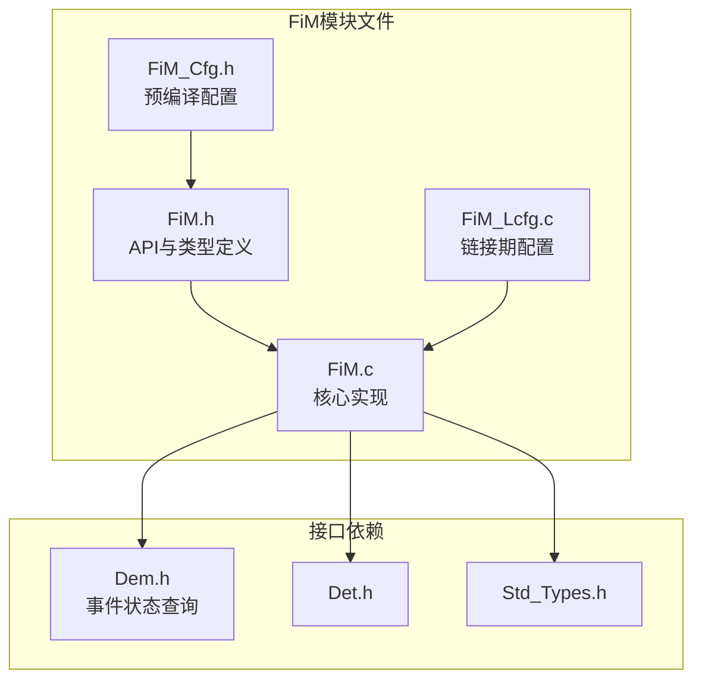
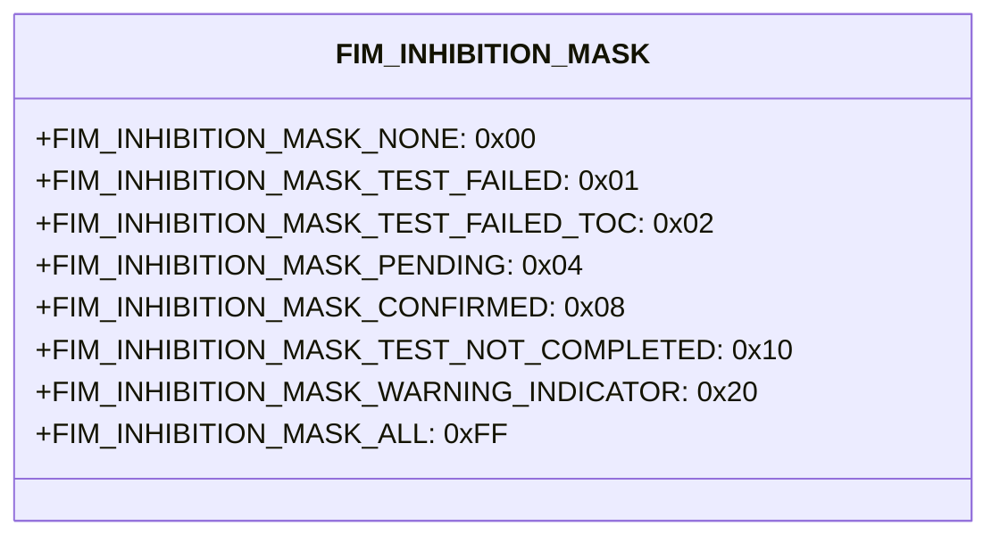
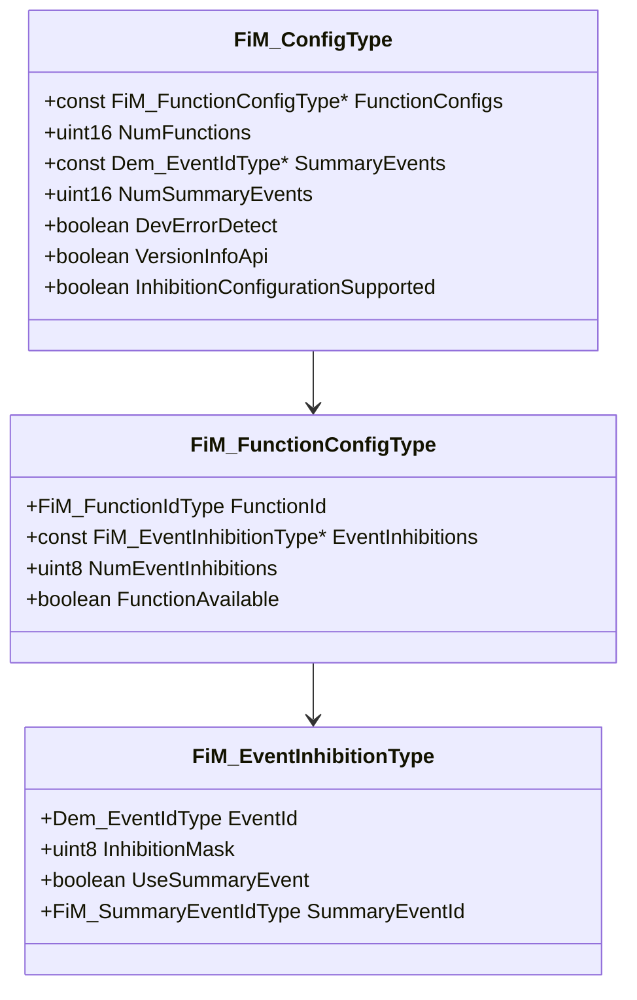
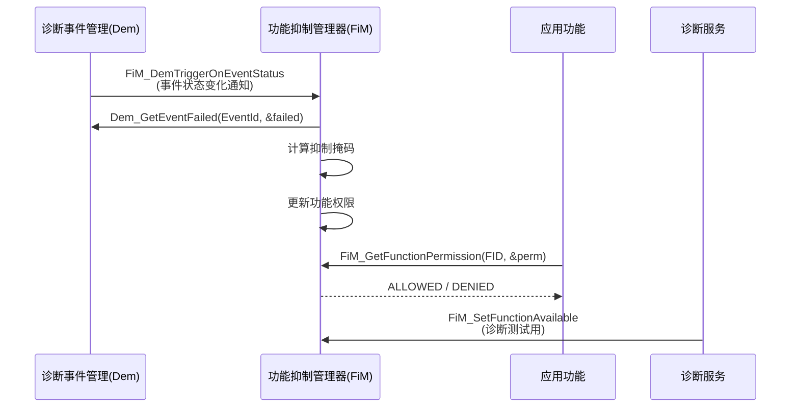
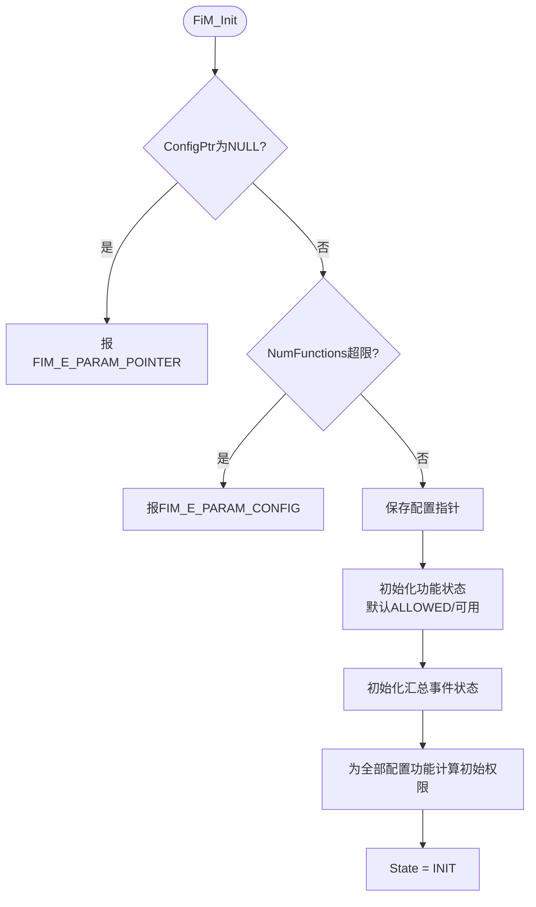

# 功能抑制管理器（FiM）

<cite>
**本文档引用的文件**
- [FiM.h](file://src/bsw/services/fim/include/FiM.h)
- [FiM_Cfg.h](file://src/bsw/services/fim/include/FiM_Cfg.h)
- [FiM.c](file://src/bsw/services/fim/src/FiM.c)
- [FiM_Lcfg.c](file://src/bsw/services/fim/src/FiM_Lcfg.c)
- [Dem.h](file://src/bsw/services/dem/include/Dem.h)
- [Dem_Types.h](file://src/bsw/services/dem/include/Dem_Types.h)
- [Det.h](file://src/bsw/services/det/include/Det.h)
- [Std_Types.h](file://src/bsw/os/include/Std_Types.h)
</cite>

## 目录
1. [简介](#简介)
2. [项目结构](#项目结构)
3. [核心组件](#核心组件)
4. [架构概览](#架构概览)
5. [详细组件分析](#详细组件分析)
6. [依赖关系分析](#依赖关系分析)
7. [性能考虑](#性能考虑)
8. [故障排除指南](#故障排除指南)
9. [结论](#结论)
10. [附录](#附录)

## 简介

功能抑制管理器（FiM）是遵循AUTOSAR经典平台4.4标准的功能权限管理模块，位于服务层，模块ID为0x55U（FIM_MODULE_ID），厂商ID为0x01U（YuleTech），软件版本1.0.0。

FiM基于诊断事件状态决定ECU功能的可用性：每个功能关联一组诊断事件（DTC），当相关事件处于"测试失败/挂起/已确认"等状态时，FiM通过抑制掩码（Inhibition Mask）计算功能是否被抑制（FIM_PERMISSION_DENIED）。典型应用场景包括：安全气囊在故障时禁用、发动机控制降级、防盗功能激活等。

FiM与Dem（诊断事件管理）深度集成，通过Dem_GetEventFailed查询事件状态，支持汇总事件（Summary Event）机制减少查询开销。

## 项目结构

FiM模块在项目中的文件组织如下：



**图表来源**
- [FiM.h:13-17](file://src/bsw/services/fim/include/FiM.h#L13-L17)
- [FiM.c:20-27](file://src/bsw/services/fim/src/FiM.c#L20-L27)

### 文件清单

| 文件 | 路径 | 职责 |
|------|------|------|
| FiM.h | include/FiM.h | API、抑制掩码、配置类型 |
| FiM_Cfg.h | include/FiM_Cfg.h | 预编译配置（32功能/16汇总事件） |
| FiM.c | src/FiM.c | 抑制计算、权限管理实现 |
| FiM_Lcfg.c | src/FiM_Lcfg.c | 功能-事件关联配置 |

**章节来源**
- [FiM.h:1-238](file://src/bsw/services/fim/include/FiM.h#L1-L238)

## 核心组件

### 抑制掩码（FiM Inhibition Mask）



**章节来源**
- [FiM.h:45-53](file://src/bsw/services/fim/include/FiM.h#L45-L53)

### 抑制配置枚举（FiM_InhibitionConfigurationType）

| 枚举 | 说明 |
|------|------|
| FIM_INHIBITION_CONFIG_NONE | 不抑制 |
| FIM_INHIBITION_CONFIG_TEST_FAILED | 测试失败抑制 |
| FIM_INHIBITION_CONFIG_TEST_FAILED_TOC | 本操作循环失败 |
| FIM_INHIBITION_CONFIG_PENDING | 挂起抑制 |
| FIM_INHIBITION_CONFIG_CONFIRMED | 已确认抑制 |
| FIM_INHIBITION_CONFIG_TEST_NOT_COMPLETED_TOC | 未完成(本循环) |
| FIM_INHIBITION_CONFIG_WARNING_INDICATOR | 警告指示 |

**章节来源**
- [FiM.h:56-68](file://src/bsw/services/fim/include/FiM.h#L56-L68)

### 核心数据结构



**图表来源**
- [FiM.h:86-120](file://src/bsw/services/fim/include/FiM.h#L86-L120)

## 架构概览

FiM在功能安全与诊断体系中的位置：



**图表来源**
- [FiM.c:170-230](file://src/bsw/services/fim/src/FiM.c#L170-L230)

### 抑制决策流程

```mermaid
flowchart TD
Start([事件状态变化]) --> Calc[FiM_CalculateInhibitionMask<br/>遍历功能的全部事件抑制项]
Calc --> Event{UseSummaryEvent?}
Event -->|是| Summary[查汇总事件状态]
Event -->|否| Query[Dem_GetEventFailed查询]
Query --> Status[构造UDS状态字节<br/>TF/TFTOC/PDTC]
Summary --> Match[FiM_CheckEventInhibition<br/>掩码匹配]
Status --> Match
Match -->|匹配| Inhibit[计算掩码|= 抑制位]
Match -->|不匹配| Next[下一个事件]
Inhibit --> Update[FiM_UpdateFunctionPermission<br/>掩码非零→DENIED]
Next --> Update
```

**章节来源**
- [FiM.c:100-160](file://src/bsw/services/fim/src/FiM.c#L100-L160)

## 详细组件分析

### 初始化（FiM_Init）



**章节来源**
- [FiM.c:230-300](file://src/bsw/services/fim/src/FiM.c#L230-L300)

### 抑制掩码计算（FiM_CalculateInhibitionMask）

核心算法：对功能的每个事件抑制项：
1. **汇总事件路径**：查FiM_InternalState.SummaryEventStates（IsFailed标志），失败则叠加抑制掩码
2. **直接事件路径**：调用Dem_GetEventFailed，从事件状态构造UDS状态字节（DEM_UDS_STATUS_TF/TFTOC/PDTC），再经FiM_CheckEventInhibition匹配

**章节来源**
- [FiM.c:100-160](file://src/bsw/services/fim/src/FiM.c#L100-L160)

### 事件抑制匹配（FiM_CheckEventInhibition）

按位匹配逻辑：

| 掩码位 | UDS状态位 | 抑制条件 |
|--------|-----------|----------|
| TEST_FAILED | DEM_UDS_STATUS_TF | 测试失败 |
| TEST_FAILED_TOC | DEM_UDS_STATUS_TFTOC | 本循环失败 |
| PENDING | DEM_UDS_STATUS_PDTC | 挂起DTC |
| CONFIRMED | DEM_UDS_STATUS_CDTC | 已确认DTC |
| TEST_NOT_COMPLETED | DEM_UDS_STATUS_TNCTOC | 未完成测试 |
| WARNING_INDICATOR | DEM_UDS_STATUS_WIR | 警告指示 |

**章节来源**
- [FiM.c:160-230](file://src/bsw/services/fim/src/FiM.c#L160-L230)

### 功能权限管理

| API | 功能 |
|-----|------|
| FiM_GetFunctionPermission | 查询功能权限（可用性+FID范围校验） |
| FiM_SetFunctionPermission | 测试用权限设置 |
| FiM_SetFunctionAvailable | 设置功能可用性（不可用→DENIED） |
| FiM_GetInhibitionStatus | 查询抑制状态（INHIBITED_YES/NO） |

**章节来源**
- [FiM.c:330-460](file://src/bsw/services/fim/src/FiM.c#L330-L460)

### Dem触发器（FiM_DemTriggerOnEventStatus / OnMonitorStatus）

Dem事件状态变化时调用，触发相关功能的抑制掩码重算。事件状态变化→更新汇总事件状态→更新受影响功能的权限。

**章节来源**
- [FiM.h:130-150](file://src/bsw/services/fim/include/FiM.h#L130-L150)

## 依赖关系分析

```mermaid
graph TB
subgraph "上层"
App[应用功能]
Dcm[诊断服务]
end
subgraph "FiM"
FiM[功能抑制管理器]
Cfg[FiM_Cfg]
Lcfg[FiM_Lcfg 功能配置]
end
subgraph "诊断体系"
Dem[Dem事件管理]
DemTypes[Dem_Types 状态类型]
end
subgraph "基础"
Det[Det]
Std[Std_Types]
end
App --> FiM
Dcm --> FiM
FiM --> Cfg
FiM --> Lcfg
FiM --> Dem
FiM --> DemTypes
FiM --> Det
FiM --> Std
```

**图表来源**
- [FiM.h:13-17](file://src/bsw/services/fim/include/FiM.h#L13-L17)

### 关键依赖特性

1. **Dem深度集成**：Dem_GetEventFailed查询 + FiM_DemTrigger*事件驱动
2. **Dem_Types依赖**：Dem_EventIdType/Dem_UdsStatusByteType类型
3. **配置驱动**：功能-事件关联在FiM_Lcfg.c定义（32功能×8事件/功能上限）
4. **被依赖**：应用通过FiM_GetFunctionPermission查询权限执行功能

**章节来源**
- [FiM_Cfg.h:19-31](file://src/bsw/services/fim/include/FiM_Cfg.h#L19-L31)

## 性能考虑

### 资源占用

- **功能状态表**：FiM_FunctionStateType（权限/可用性/抑制状态/掩码）约8字节×32
- **汇总事件表**：FiM_SummaryEventStateType约4字节×16
- **代码体积**：约5KB

### 性能特征

- **权限查询**：FiM_GetFunctionPermission为O(1)数组访问
- **掩码计算**：O(功能事件数)，最坏8次事件查询/功能
- **Dem查询开销**：Dem_GetEventFailed为跨模块调用，汇总事件机制可显著减少查询次数

### 优化建议

1. 高频查询的功能使用汇总事件（UseSummaryEvent=TRUE），将N次Dem查询降为1次
2. 抑制掩码计算在事件变化时增量更新，避免周期全量重算
3. FiM_MainFunction周期（FIM_MAIN_FUNCTION_PERIOD_MS=10ms）内避免长循环
4. 功能状态表索引直接映射FID-FIM_FID_MIN，避免查找

**章节来源**
- [FiM_Cfg.h:24-30](file://src/bsw/services/fim/include/FiM_Cfg.h#L24-L30)

## 故障排除指南

### 错误代码

| 错误代码 | 含义 | 可能原因 | 解决方案 |
|----------|------|----------|----------|
| FIM_E_PARAM_CONFIG (0x01U) | 配置无效 | NumFunctions超限 | 检查配置 |
| FIM_E_PARAM_POINTER (0x02U) | 指针无效 | 输出指针NULL | 检查传参 |
| FIM_E_PARAM_FID (0x03U) | 功能ID无效 | FID越界 | 校验FID范围 |
| FIM_E_PARAM_EVENTID (0x04U) | 事件ID无效 | 事件不存在 | 校验EventId |
| FIM_E_UNINIT (0x05U) | 未初始化 | 未调用FiM_Init | 检查初始化顺序 |
| FIM_E_INIT_FAILED (0x06U) | 初始化失败 | 配置异常 | 检查配置表 |

### 调试建议

1. **功能未抑制**：检查该功能的EventInhibitions掩码与事件实际状态是否匹配
2. **功能误抑制**：确认Dem事件状态（可能为测试残留），用FiM_GetInhibitionStatus诊断
3. **汇总事件不更新**：确认FiM_DemTriggerOnEventStatus被Dem正确回调
4. **权限与预期不符**：检查FunctionAvailable标志（不可用强制DENIED）
5. **FID映射**：注意FIM_FID_MIN=1、FIM_FID_MAX=31，FID=0为无效

**章节来源**
- [FiM.h:39-43](file://src/bsw/services/fim/include/FiM.h#L39-L43)

## 结论

功能抑制管理器（FiM）模块提供了：

1. **事件驱动抑制**：基于DTC状态的自动功能抑制
2. **多级抑制条件**：TF/TFTOC/PENDING/CONFIRMED/WIR六类状态位
3. **汇总事件优化**：批量事件聚合降低查询开销
4. **诊断友好**：SetFunctionAvailable/Permission支持诊断测试

该模块是功能安全（ASIL）需求落地与故障降级策略的关键执行者，与Dem形成"诊断检测→抑制决策"闭环。

## 附录

### API参考

- **生命周期**：FiM_Init(), FiM_DeInit()
- **权限管理**：FiM_GetFunctionPermission(), FiM_SetFunctionPermission(), FiM_SetFunctionAvailable()
- **状态查询**：FiM_GetInhibitionStatus()
- **Dem触发器**：FiM_DemTriggerOnMonitorStatus(), FiM_DemTriggerOnEventStatus()
- **周期处理**：FiM_MainFunction()
- **版本信息**：FiM_GetVersionInfo()

### 配置示例

```c
/* 功能12：车辆稳定控制，关联事件3与汇总事件1 */
const FiM_FunctionConfigType Func12 = {
    .FunctionId = 12U,
    .EventInhibitions = (const FiM_EventInhibitionType[]){
        { .EventId = 3U, .InhibitionMask = FIM_INHIBITION_MASK_CONFIRMED, .UseSummaryEvent = FALSE },
        { .UseSummaryEvent = TRUE, .SummaryEventId = 1U, .InhibitionMask = FIM_INHIBITION_MASK_TEST_FAILED }
    },
    .NumEventInhibitions = 2U,
    .FunctionAvailable = TRUE
};
```

### 最佳实践

1. 安全关键功能（气囊/制动）关联CONFIRMED位，避免瞬时故障误抑制
2. 舒适功能（空调等）可用PENDING位快速响应
3. 汇总事件按功能域划分（底盘域/动力域），提升查询效率
