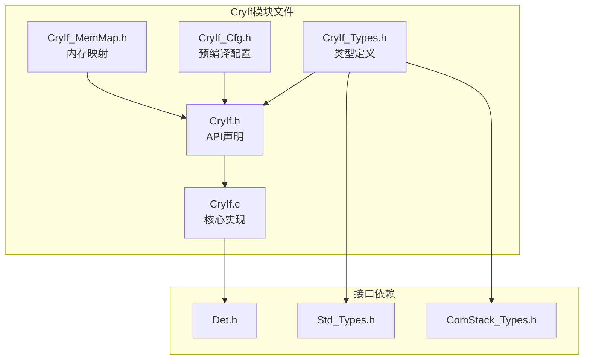
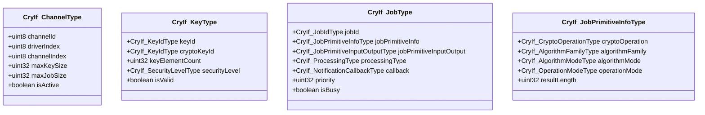
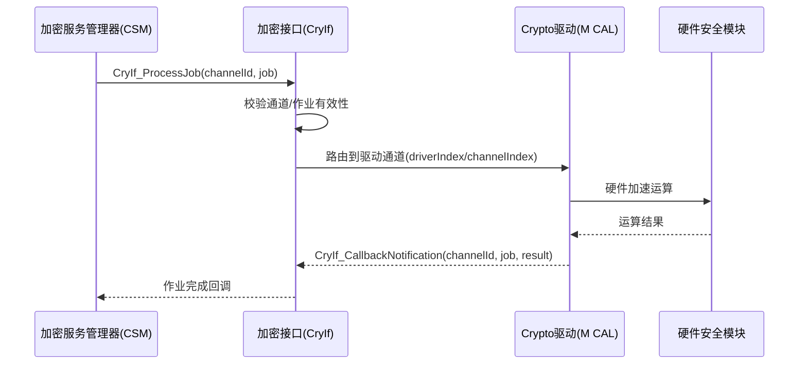
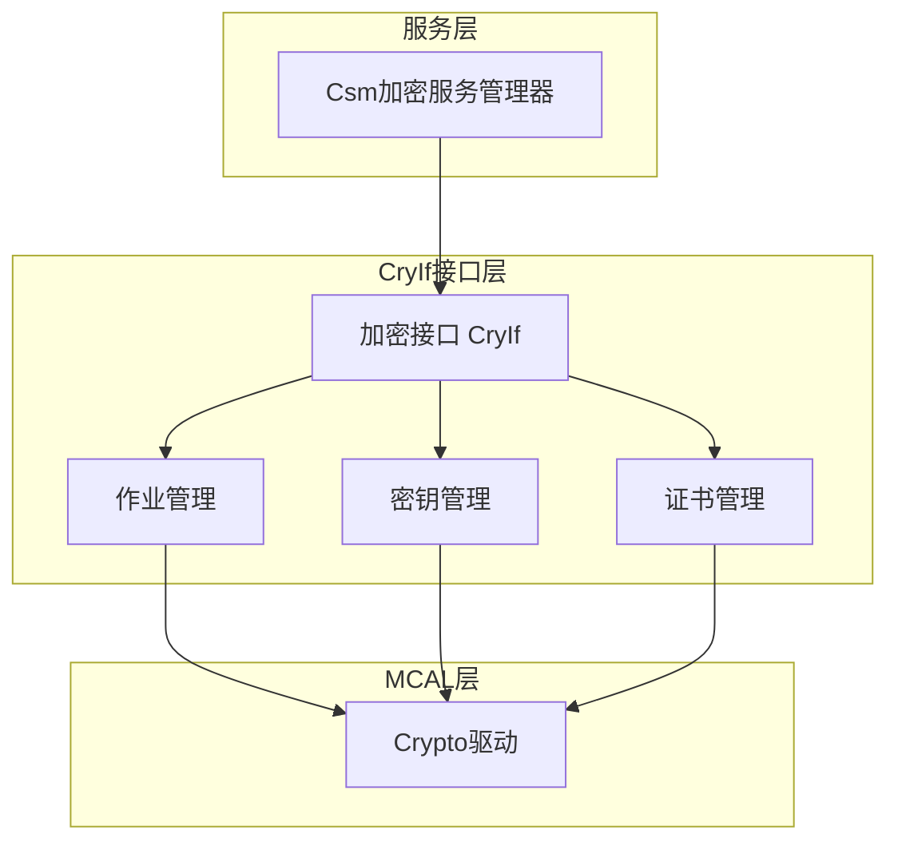
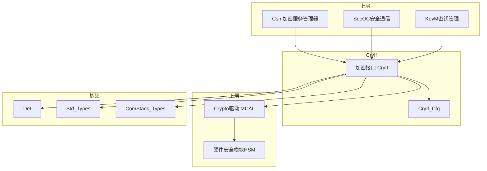

# 加密接口（CryIf）

<cite>
**本文档引用的文件**
- [CryIf.h](file://src/bsw/services/cryif/include/CryIf.h)
- [CryIf_Types.h](file://src/bsw/services/cryif/include/CryIf_Types.h)
- [CryIf_Cfg.h](file://src/bsw/services/cryif/include/CryIf_Cfg.h)
- [CryIf_MemMap.h](file://src/bsw/services/cryif/include/CryIf_MemMap.h)
- [CryIf.c](file://src/bsw/services/cryif/src/CryIf.c)
- [Det.h](file://src/bsw/services/det/include/Det.h)
- [Std_Types.h](file://src/bsw/os/include/Std_Types.h)
- [ComStack_Types.h](file://src/bsw/ecual/include/ComStack_Types.h)
</cite>

## 目录
1. [简介](#简介)
2. [项目结构](#项目结构)
3. [核心组件](#核心组件)
4. [架构概览](#架构概览)
5. [详细组件分析](#详细组件分析)
6. [依赖关系分析](#依赖关系分析)
7. [性能考虑](#性能考虑)
8. [故障排除指南](#故障排除指南)
9. [结论](#结论)
10. [附录](#附录)

## 简介

加密接口（CryIf）是遵循AUTOSAR经典平台4.4标准的密码服务抽象接口模块，位于服务层，在CSM（加密服务管理器）与底层Crypto驱动（MCAL）之间提供标准化的桥接。模块ID为0x007CU，厂商ID为0x0055U（YuleTech），软件版本1.0.0。

CryIf的职责包括：
- **作业管理**：将CSM的密码作业请求路由到对应Crypto驱动通道
- **密钥管理**：密钥元素的设置/获取/复制、密钥有效性校验
- **算法抽象**：屏蔽底层驱动差异，提供统一的算法族/模式枚举
- **异步处理**：支持同步/异步两种处理类型，通过CryIf_MainFunction调度

## 项目结构

CryIf模块在项目中的文件组织如下：



**图表来源**
- [CryIf.h:17-21](file://src/bsw/services/cryif/include/CryIf.h#L17-L21)
- [CryIf_Types.h:15-19](file://src/bsw/services/cryif/include/CryIf_Types.h#L15-L19)

### 文件清单

| 文件 | 路径 | 职责 |
|------|------|------|
| CryIf.h | include/CryIf.h | 生命周期/作业/密钥/证书API |
| CryIf_Types.h | include/CryIf_Types.h | 通道/密钥/作业/算法枚举类型 |
| CryIf_Cfg.h | include/CryIf_Cfg.h | 特性开关配置 |
| CryIf.c | src/CryIf.c | 作业路由、密钥管理实现 |

**章节来源**
- [CryIf.h:1-414](file://src/bsw/services/cryif/include/CryIf.h#L1-L414)

## 核心组件

### 类型体系（CryIf_Types.h）



**图表来源**
- [CryIf_Types.h:108-170](file://src/bsw/services/cryif/include/CryIf_Types.h#L108-L170)

### 算法族枚举（CryIf_AlgorithmFamilyEnumType）

覆盖20+算法族：AES、DES、RSA、ECC、SHA1/SHA2系列（224/256/384/512）、SHA3系列、HMAC、CMAC、HMAC_SHA256、DRBG、PBKDF2、KDFX963、RIPEMD160、ECDSA、ED25519及自定义（CRYIF_ALGOFAM_CUSTOM=0xFFU）。

### 操作模式与算法模式

- 操作模式（CryIf_OperationModeType）：SINGLE/START/UPDATE/STREAM/FINISH
- 算法模式（CryIf_AlgorithmModeEnumType）：ECB/CBC/CFB/OFB/CTR/GCM/CCM/PKCS7/XTS/RSA-PKCS1/PSS/OAEP/ECDSA
- 密码操作：ENCRYPT/DECRYPT/SIGN/VERIFY/HASH/MAC/KEYGEN/KEYDER

**章节来源**
- [CryIf_Types.h:61-107](file://src/bsw/services/cryif/include/CryIf_Types.h#L61-L107)

### 容量上限

| 常量 | 值 | 说明 |
|------|----|----|
| CRYIF_MAX_CHANNEL_COUNT | 8 | 最大通道数 |
| CRYIF_MAX_KEY_COUNT | 16 | 最大密钥数 |
| CRYIF_MAX_JOB_COUNT | 32 | 最大作业数 |
| CRYIF_MAX_KEY_ELEMENT_SIZE | 0x100U | 最大密钥元素字节数 |

**章节来源**
- [CryIf_Types.h:24-38](file://src/bsw/services/cryif/include/CryIf_Types.h#L24-L38)

## 架构概览

CryIf在密码服务栈中的位置：



**图表来源**
- [CryIf.h:110-125](file://src/bsw/services/cryif/include/CryIf.h#L110-L125)

### 分层抽象



**章节来源**
- [CryIf.h:11-16](file://src/bsw/services/cryif/include/CryIf.h#L11-L16)

## 详细组件分析

### 作业处理（CryIf_ProcessJob）

```mermaid
flowchart TD
Start([CryIf_ProcessJob]) --> Check[校验通道ID与作业指针]
Check -->|失败| Err[返回E_NOT_OK]
Check -->|通过| Route[按driverIndex路由到Crypto驱动]
Route --> Submit[提交作业到驱动]
Submit -->|驱动忙碌| Busy[返回CRYIF_E_BUSY]
Submit -->|接受| OK[返回E_OK]
Note over Route: 作业包含算法族/模式/操作类型<br/>输入输出缓冲区指针
```

**章节来源**
- [CryIf.h:110-125](file://src/bsw/services/cryif/include/CryIf.h#L110-L125)

### 作业取消（CryIf_CancelJob）

取消挂起作业的入口，调用底层驱动取消对应通道上的作业。返回E_OK表示取消请求已接受，E_NOT_OK表示取消失败（作业可能已完成）。

**章节来源**
- [CryIf.h:127-140](file://src/bsw/services/cryif/include/CryIf.h#L127-L140)

### 密钥管理API族

| API | 服务ID | 功能 |
|-----|--------|------|
| CryIf_KeyElementSet | CRYIF_SID_KEYELEMENTSET | 设置密钥元素（私钥/公钥/IV等） |
| CryIf_KeySetValid | CRYIF_SID_KEYSETVALID | 密钥置为有效 |
| CryIf_KeyElementGet | CRYIF_SID_KEYELEMENTGET | 读取密钥元素 |
| CryIf_KeyElementCopy | CRYIF_SID_KEYELEMENTCOPY | 元素级复制（可配置） |
| CryIf_KeyElementCopyPartial | - | 部分偏移复制 |
| CryIf_KeyCopy | CRYIF_SID_KEYCOPY | 整密钥复制 |
| CryIf_KeyElementIdsGet | CRYIF_SID_KEYELEMENTIDSGET | 枚举元素ID |
| CryIf_KeyValidCheck | - | 有效性检查（可配置） |

**章节来源**
- [CryIf.h:144-230](file://src/bsw/services/cryif/include/CryIf.h#L144-L230)

### 密码运算API族

| API | 服务ID | 功能 |
|-----|--------|------|
| CryIf_RandomSeed | CRYIF_SID_RANDOMSEED | 随机数发生器种子 |
| CryIf_KeyGenerate | CRYIF_SID_KEYGENERATE | 密钥生成 |
| CryIf_KeyDerive | CRYIF_SID_KEYDERIVE | 密钥派生 |
| CryIf_KeyExchangeCalcPubValue | CRYIF_SID_KEYEXCHANGECALCPUBVALUE | 公钥计算（DH/ECDH） |
| CryIf_KeyExchangeCalcSecret | CRYIF_SID_KEYEXCHANGECALCSECRET | 共享秘密计算 |
| CryIf_CertificateParse | CRYIF_SID_CERTIFICATEPARSE | 证书解析 |
| CryIf_CertificateVerify | CRYIF_SID_CERTIFICATEVERIFY | 证书验证 |

**章节来源**
- [CryIf.h:234-320](file://src/bsw/services/cryif/include/CryIf.h#L234-L320)

### 回调与主函数

- **CryIf_CallbackNotification**：Crypto驱动的异步完成回调，将结果返回CSM
- **CryIf_MainFunction**：周期调度，处理异步作业队列（CRYIF_SID_MAINFUNCTION）

**章节来源**
- [CryIf.h:326-352](file://src/bsw/services/cryif/include/CryIf.h#L326-L352)

## 依赖关系分析



**图表来源**
- [CryIf.h:17-21](file://src/bsw/services/cryif/include/CryIf.h#L17-L21)

### 关键依赖特性

1. **CSM上游**：CSM通过CryIf_ProcessJob发起作业，通过回调接收结果
2. **Crypto驱动下游**：通道配置（driverIndex/channelIndex）映射到驱动实例
3. **密钥映射**：CryIf_KeyCfgType将CryIf密钥ID映射到Crypto驱动密钥ID
4. **MemMap支持**：CryIf_MemMap.h提供代码/数据段映射，支持链接期重定位

**章节来源**
- [CryIf_Types.h:146-160](file://src/bsw/services/cryif/include/CryIf_Types.h#L146-L160)

## 性能考虑

### 资源占用

- **作业结构**：CryIf_JobType约60字节×32（最大），静态分配
- **密钥结构**：CryIf_KeyType约16字节×16
- **通道结构**：CryIf_ChannelType约16字节×8

### 性能特征

- **同步处理**（CRYIF_PROCESSING_SYNC）：ProcessJob阻塞至完成，适合短运算
- **异步处理**（CRYIF_PROCESSING_ASYNC）：立即返回，MainFunction轮询完成
- **硬件加速**：底层Crypto驱动可调用HSM硬件加速（AES/SHA/RSA），CPU卸载
- **作业优先级**：job.priority字段支持优先级调度

### 优化建议

1. 高频小运算（如MAC校验）使用同步模式减少调度开销
2. 大块加解密（SecOC帧）使用异步模式避免阻塞
3. 合理规划通道数，避免驱动通道竞争
4. 密钥元素缓冲区（CRYIF_MAX_KEY_ELEMENT_SIZE=256B）按实际算法需求裁剪

**章节来源**
- [CryIf_Types.h:24-38](file://src/bsw/services/cryif/include/CryIf_Types.h#L24-L38)

## 故障排除指南

### 错误代码

| 错误代码 | 含义 | 可能原因 | 解决方案 |
|----------|------|----------|----------|
| CRYIF_E_PARAM_POINTER (0x01U) | 指针无效 | job/缓冲区NULL | 检查传参 |
| CRYIF_E_UNINIT (0x02U) | 未初始化 | 未调用CryIf_Init | 检查初始化顺序 |
| CRYIF_E_INIT_FAILED (0x03U) | 初始化失败 | 驱动不可用 | 检查Crypto驱动 |
| CRYIF_E_PARAM_HANDLE (0x04U) | 句柄无效 | 通道/密钥ID越界 | 校验ID范围 |
| CRYIF_E_BUSY (0x06U) | 通道忙碌 | 前一个作业未完成 | 等待或取消作业 |
| CRYIF_E_QUEUE_FULL (0x03U) | 队列满 | 作业过多 | 增加队列或节流 |
| CRYIF_E_KEY_NOT_AVAILABLE (0x04U) | 密钥不可用 | 密钥未加载 | 检查密钥状态 |

### 调试建议

1. **作业失败**：检查CryIf_CallbackNotification的result参数
2. **密钥无效**：确认KeyElementSet后调用KeySetValid
3. **算法不支持**：核对算法族/模式枚举值与驱动能力
4. **性能瓶颈**：检查作业是否频繁返回CRYIF_E_BUSY（通道竞争）
5. **HSM异常**：检查Crypto驱动初始化与硬件自检

**章节来源**
- [CryIf_Types.h:97-107](file://src/bsw/services/cryif/include/CryIf_Types.h#L97-L107)

## 结论

加密接口（CryIf）模块提供了：

1. **标准化抽象**：将CSM与Crypto驱动解耦，统一算法族/模式枚举
2. **完整密钥管理**：密钥元素生命周期管理、复制、验证
3. **作业路由机制**：通道映射+优先级+同步/异步双模式
4. **可扩展设计**：证书管理、密钥交换、国密算法族预留（CUSTOM/ED25519等）

该模块是yuleASR安全体系（SecOC、安全启动、安全诊断）的关键桥梁。

## 附录

### API参考

- **生命周期**：CryIf_Init(), CryIf_DeInit(), CryIf_GetVersionInfo()
- **作业管理**：CryIf_ProcessJob(), CryIf_CancelJob(), CryIf_MainFunction()
- **密钥管理**：CryIf_KeyElementSet/Get/Copy/IdsGet, CryIf_KeySetValid, CryIf_KeyCopy, CryIf_KeyValidCheck
- **密码运算**：CryIf_RandomSeed, CryIf_KeyGenerate, CryIf_KeyDerive, CryIf_KeyExchangeCalcPubValue/CalcSecret
- **证书**：CryIf_CertificateParse, CryIf_CertificateVerify
- **回调**：CryIf_CallbackNotification

### 集成最佳实践

1. 通道配置与Crypto驱动实例一一对应，勿复用驱动索引
2. 密钥ID映射表（CryIf_KeyCfgType）在链接期生成，保持与CSM密钥ID一致
3. 异步作业必须注册回调，避免作业悬挂
4. 安全等级（CRYIF_SEC_LEVEL_1~7）按ISO 21434要求规划
