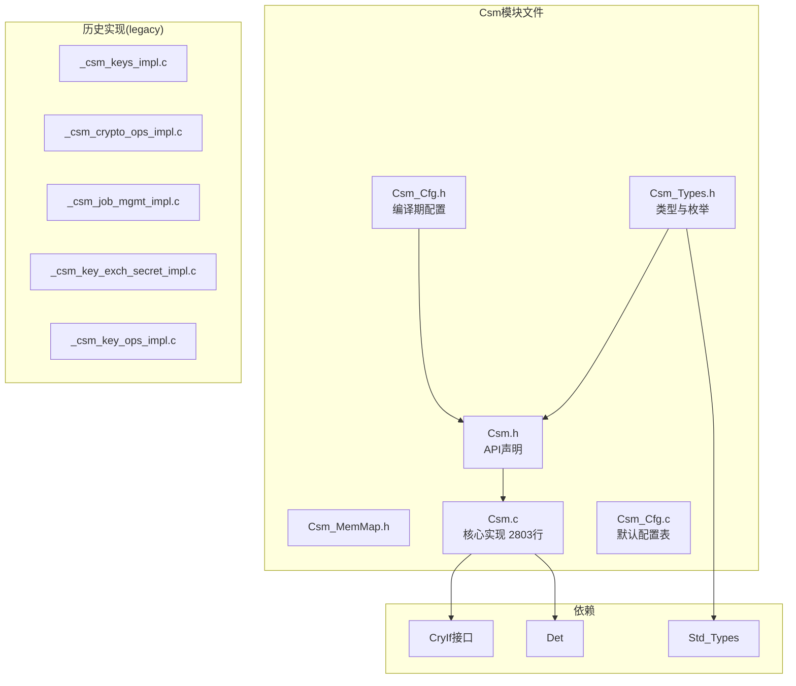
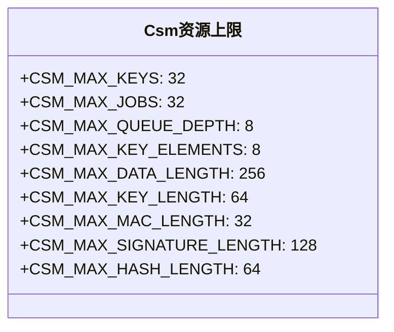
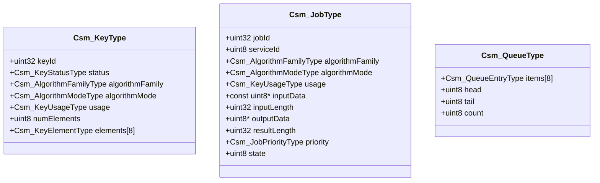
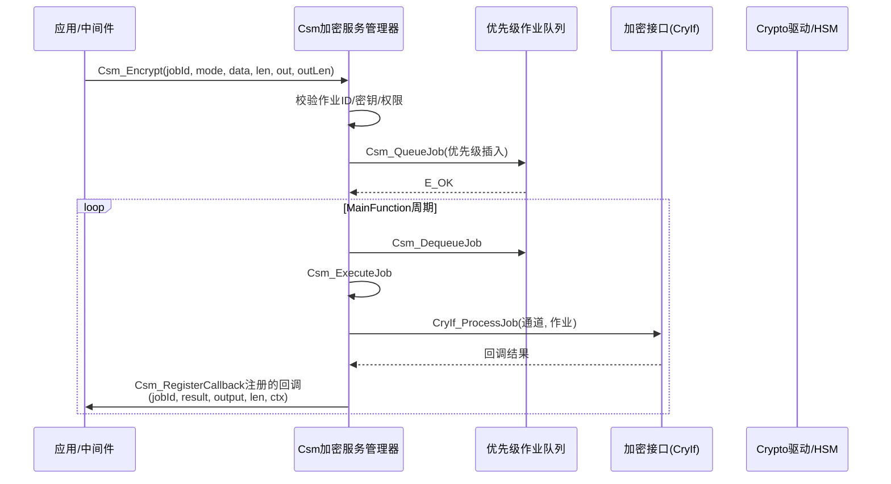
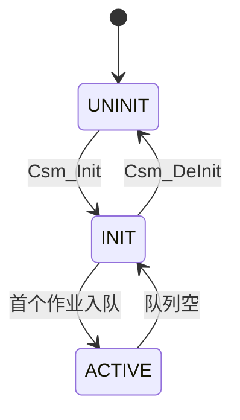
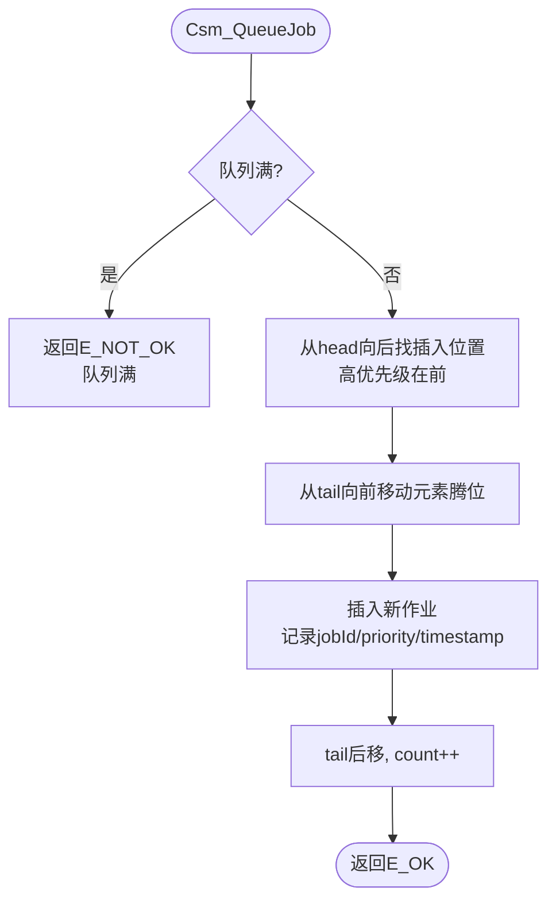

# 加密服务管理器（Csm）

<cite>
**本文档引用的文件**
- [Csm.h](file://src/bsw/services/csm/include/Csm.h)
- [Csm_Types.h](file://src/bsw/services/csm/include/Csm_Types.h)
- [Csm_Cfg.h](file://src/bsw/services/csm/include/Csm_Cfg.h)
- [Csm_MemMap.h](file://src/bsw/services/csm/include/Csm_MemMap.h)
- [Csm.c](file://src/bsw/services/csm/src/Csm.c)
- [Csm_Cfg.c](file://src/bsw/services/csm/src/Csm_Cfg.c)
- [Det.h](file://src/bsw/services/det/include/Det.h)
- [Std_Types.h](file://src/bsw/os/include/Std_Types.h)
</cite>

## 目录
1. [简介](#简介)
2. [项目结构](#项目结构)
3. [核心组件](#核心组件)
4. [架构概览](#架构概览)
5. [详细组件分析](#详细组件分析)
6. [依赖关系分析](#依赖关系分析)
7. [性能考虑](#性能考虑)
8. [故障排除指南](#故障排除指南)
9. [结论](#结论)
10. [附录](#附录)

## 简介

加密服务管理器（Csm）是遵循AUTOSAR 4.7.0标准的密码服务管理模块，位于服务层，模块ID为0x70U，厂商ID为43。Csm向上为应用/中间件提供统一的密码服务API（哈希、MAC、加解密、签名、随机数、密钥管理），向下通过CryIf接口路由到Crypto驱动，并负责密钥生命周期管理、作业队列调度与异步回调通知。

Csm是yuleASR安全体系的核心模块，支撑SecOC安全通信、安全启动、安全诊断、密钥管理等场景。实现采用"密钥表+作业表+优先级队列"架构，支持同步/异步服务与事件回调。

## 项目结构

Csm模块在项目中的文件组织如下：



**图表来源**
- [Csm.h:13-22](file://src/bsw/services/csm/include/Csm.h#L13-L22)
- [Csm_Types.h:11-20](file://src/bsw/services/csm/include/Csm_Types.h#L11-L20)

### 文件清单

| 文件 | 路径 | 职责 |
|------|------|------|
| Csm.h | include/Csm.h | 公开API、API ID定义 |
| Csm_Types.h | include/Csm_Types.h | 密钥/作业/队列/算法类型 |
| Csm_Cfg.h | include/Csm_Cfg.h | 队列/特性编译期配置 |
| Csm.c | src/Csm.c | 密钥管理、作业调度、服务执行 |
| Csm_Cfg.c | src/Csm_Cfg.c | Csm_Config默认配置实例 |
| legacy/ | legacy/ | 分文件历史实现（供参考） |

**章节来源**
- [Csm.h:1-501](file://src/bsw/services/csm/include/Csm.h#L1-L501)

## 核心组件

### 资源上限（Csm_Types.h）



**图表来源**
- [Csm_Types.h:28-47](file://src/bsw/services/csm/include/Csm_Types.h#L28-L47)

### 密钥模型

- **密钥状态**（Csm_KeyStatusType）：INVALID/VALID/EMPTY/UPDATE_IN_PROGRESS
- **密钥元素类型**（Csm_KeyElementType）：SECRET/PUBLIC/PRIVATE/IV/SALT/SEED/LABEL/CONTEXT
- **密钥使用权限**（Csm_KeyUsageType）：位掩码组合（ENCRYPT/DECRYPT/SIGN/VERIFY/HASH/MAC/KEY_EXCHANGE/DERIVE/RANDOM_GENERATE）



**图表来源**
- [Csm_Types.h:120-220](file://src/bsw/services/csm/include/Csm_Types.h#L120-L220)

### 算法家族（Csm_AlgorithmFamilyType）

覆盖SHA1/SHA2/SHA3全系列、AES/DES/3DES、RSA/ECDSA/ECDH、HMAC/CMAC、GCM/CCM、ChaCha20-Poly1305、DRBG、PKCS7填充，以及国密SM2/SM3（枚举已落地，后端待接入GmSSL或SM版HSM，实际调用fail-closed返回不支持）。

**章节来源**
- [Csm_Types.h:53-92](file://src/bsw/services/csm/include/Csm_Types.h#L53-L92)

## 架构概览

Csm服务处理架构：



**图表来源**
- [Csm.c:322-427](file://src/bsw/services/csm/src/Csm.c#L322-L427)

### 状态管理



**章节来源**
- [Csm.c:95-100](file://src/bsw/services/csm/src/Csm.c#L95-L100)

## 详细组件分析

### 初始化（Csm_Init）

初始化流程：
1. 校验配置（Csm_ValidateConfig：numKeys/numJobs不超上限）
2. 拒绝重复初始化（报CSM_E_ALREADY_INITIALIZED）
3. 清零密钥表/作业表/队列/回调表
4. 写入初始化魔数（Csm_InitMagic），置状态INIT

**章节来源**
- [Csm.c:619-708](file://src/bsw/services/csm/src/Csm.c#L619-L708)

### 队列管理（Csm_QueueJob / Csm_DequeueJob）

优先级插入队列实现：



出队从head取出作业，O(1)操作。

**章节来源**
- [Csm.c:322-392](file://src/bsw/services/csm/src/Csm.c#L322-L392)

### 作业执行（Csm_ExecuteJob）

作业执行根据serviceId分发到对应服务实现（哈希/MAC/加解密/签名/随机数），通过CryIf调用底层驱动；完成后通过Csm_NotifyEvent回调应用注册的回调函数。

**章节来源**
- [Csm.c:394-475](file://src/bsw/services/csm/src/Csm.c#L394-L475)

### 密钥管理API

| API | 说明 |
|-----|------|
| Csm_KeyElementSet | 写入密钥元素（经Csm_PersistKeyElement持久化） |
| Csm_KeySetValid | 所有必需元素就绪后使密钥生效 |
| Csm_KeyElementGet | 读取密钥元素（经Csm_LoadKeyElement） |
| Csm_KeyElementCopy | 元素级复制 |
| Csm_KeyCopy | 整密钥复制 |
| Csm_KeyElementIdsGet | 枚举元素ID |
| Csm_KeyGenerate / Csm_KeyDerive | 密钥生成与派生 |
| Csm_KeyExchangeCalcPubVal / CalcSecret | 密钥交换 |

**章节来源**
- [Csm.c:735-960](file://src/bsw/services/csm/src/Csm.c#L735-L960)

### 密码服务API

| API | API ID | 说明 |
|-----|--------|------|
| Csm_Hash | CSM_API_HASH (0x30U) | 哈希（START/UPDATE/FINISH） |
| Csm_MacGenerate / Csm_MacVerify | 0x40U/0x41U | MAC生成/验证 |
| Csm_Encrypt / Csm_Decrypt | 0x50U/0x51U | 对称加解密 |
| Csm_SignatureGenerate / Verify | 0x60U/0x61U | 数字签名 |
| Csm_RandomGenerate | 0x70U | 随机数生成 |
| Csm_JobKeySetUp / Async | 0x80U/0x81U | 作业密钥绑定 |
| Csm_CancelJob | 0x90U | 作业取消 |

**章节来源**
- [Csm.h:45-58](file://src/bsw/services/csm/include/Csm.h#L45-L58)

### 权限验证（Csm_ValidateKeyUsage）

作业执行前验证密钥使用权限位掩码（ENCRYPT/DECRYPT/SIGN等），防止密钥误用，是安全设计的关键防线。

**章节来源**
- [Csm.c:494-530](file://src/bsw/services/csm/src/Csm.c#L494-L530)

## 依赖关系分析

```mermaid
graph TB
subgraph "上层"
App[应用/SWC]
SecOC[SecOC安全通信]
KeyM[密钥管理]
end
subgraph "Csm"
Csm[加密服务管理器]
Cfg[Csm_Cfg]
Types[Csm_Types]
end
subgraph "下层"
CryIf[加密接口 CryIf]
Crypto[Crypto驱动]
HSM[硬件安全模块]
end
subgraph "基础"
Det[Det]
Std[Std_Types]
end
App --> Csm
SecOC --> Csm
KeyM --> Csm
Csm --> Cfg
Csm --> Types
Csm --> CryIf
CryIf --> Crypto
Crypto --> HSM
Csm --> Det
Csm --> Std
```

**图表来源**
- [Csm.c:44-60](file://src/bsw/services/csm/src/Csm.c#L44-L60)

### 关键依赖特性

1. **CryIf桥接**：作业经CryIf_ProcessJob路由到Crypto驱动
2. **Det集成**：开发错误通过Det_ReportError上报（CSM_MODULE_ID=0x70U）
3. **配置驱动**：队列深度/特性开关由Csm_Cfg.h的CSM_CFG_QUEUE_SUPPORT等控制
4. **时间服务**：队列条目timestamp依赖Csm_Cfg_GetTimestamp（配置提供）

**章节来源**
- [Csm.h:13-22](file://src/bsw/services/csm/include/Csm.h#L13-L22)

## 性能考虑

### 资源占用

- **密钥表**：Csm_KeyType ×32
- **作业表**：Csm_JobType ×32
- **队列**：8槽环形队列（CSM_MAX_QUEUE_DEPTH）
- **代码体积**：Csm.c约2803行，为服务层最大模块之一

### 性能特征

- **队列插入**：O(队列长度)的优先级插入，队列满时拒绝（CSM_E_QUEUE_FULL）
- **服务执行**：同步模式阻塞至完成；异步模式入队后MainFunction轮询
- **硬件加速**：AES/SHA/RSA等经HSM硬件卸载
- **回调开销**：每次作业完成触发一次回调（Csm_NotifyEvent）

### 优化建议

1. 高频作业（SecOC MAC）预绑定密钥（Csm_JobKeySetUp），减少作业设置开销
2. 大块数据使用异步模式+回调，避免阻塞应用
3. 队列深度按峰值并发作业规划，满队列触发背压
4. 国密算法接入GmSSL后启用SM2/SM3枚举，当前fail-closed返回不支持

**章节来源**
- [Csm_Types.h:28-47](file://src/bsw/services/csm/include/Csm_Types.h#L28-L47)

## 故障排除指南

### 错误代码

| 错误代码 | 含义 | 可能原因 | 解决方案 |
|----------|------|----------|----------|
| CSM_E_NOT_INITIALIZED (0x01U) | 未初始化 | 未调用Csm_Init | 检查初始化顺序 |
| CSM_E_ALREADY_INITIALIZED (0x02U) | 重复初始化 | 多次Init | 检查调用 |
| CSM_E_PARAM_KEY_ID (0x04U) | 密钥ID无效 | 密钥未加载 | 检查密钥表 |
| CSM_E_PARAM_JOB_ID (0x06U) | 作业ID无效 | 作业未创建 | 检查作业表 |
| CSM_E_KEY_NOT_AVAILABLE (0x0AU) | 密钥不可用 | 密钥元素缺失 | 补全元素并SetValid |
| CSM_E_KEY_NOT_VALID (0x0BU) | 密钥无效 | 未置Valid | 调用KeySetValid |
| CSM_E_JOB_BUSY (0x0DU) | 作业忙碌 | 作业占用中 | 等待或取消 |
| CSM_E_QUEUE_FULL (0x0EU) | 队列满 | 并发作业过多 | 背压或扩容 |
| CSM_E_SERVICE_NOT_SUPPORTED (0x0FU) | 服务不支持 | 算法/模式未实现 | 核对算法族 |
| CSM_E_HARDWARE_FAILURE (0x10U) | 硬件故障 | HSM异常 | 检查驱动 |

### 调试建议

1. **作业无回调**：检查Csm_RegisterCallback注册与MainFunction调度
2. **密钥操作失败**：确认KeyElementSet→KeySetValid顺序，检查权限位
3. **性能问题**：统计QueueFull次数，评估作业并发峰值
4. **SM2/SM3调用失败**：属预期（fail-closed），需接入国密后端
5. **内存异常**：检查Csm_InitMagic魔数校验逻辑

**章节来源**
- [Csm_Types.h:53-71](file://src/bsw/services/csm/include/Csm_Types.h#L53-L71)

## 结论

加密服务管理器（Csm）是yuleASR安全体系的中心模块：

1. **服务全面**：哈希/MAC/加解密/签名/随机数/密钥管理全覆盖
2. **异步架构**：优先级队列+回调机制，支持同步/异步双模式
3. **密钥安全**：密钥元素模型+使用权限位掩码+生命周期管理
4. **标准符合**：遵循AUTOSAR 4.7.0 CSM规范，API ID与标准一致

该模块为安全通信、安全启动、安全诊断提供了统一的密码服务入口。

## 附录

### API参考

- **生命周期**：Csm_Init(), Csm_DeInit(), Csm_GetVersionInfo()
- **密钥管理**：Csm_KeyElementSet/Get/Copy, Csm_KeySetValid, Csm_KeyCopy, Csm_KeyElementIdsGet, Csm_KeyGenerate, Csm_KeyDerive, Csm_KeyExchangeCalcPubVal/CalcSecret, Csm_GetKeyStatus
- **密码服务**：Csm_Hash, Csm_MacGenerate, Csm_MacVerify, Csm_Encrypt, Csm_Decrypt, Csm_SignatureGenerate, Csm_SignatureVerify, Csm_RandomGenerate
- **作业管理**：Csm_JobKeySetUp, Csm_JobKeySetUpAsync, Csm_CancelJob, Csm_GetJobState, Csm_RegisterCallback
- **周期处理**：Csm_MainFunction()

### 集成最佳实践

1. 应用侧统一通过CSM_API_*常量标识服务，保持与Det上报一致
2. 密钥按用途分配（SecOC密钥、诊断密钥分离），权限位最小化
3. 异步作业必须注册回调并设置合理超时
4. 硬件HSM不可用场景回退软件Crypto，需在配置层确认
