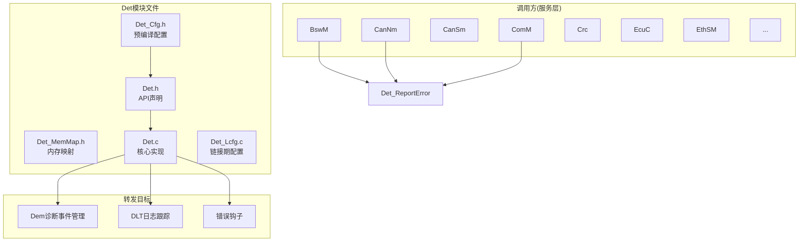
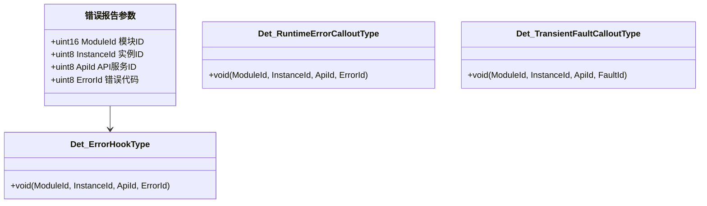
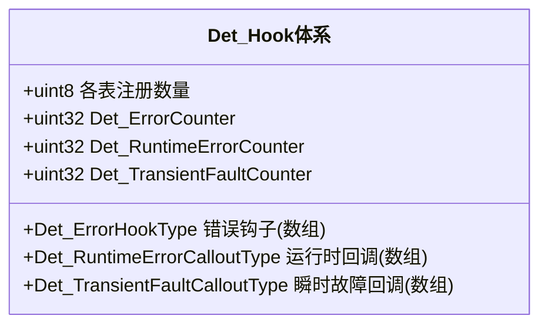
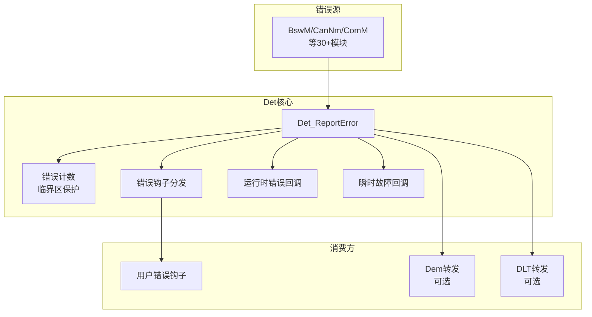
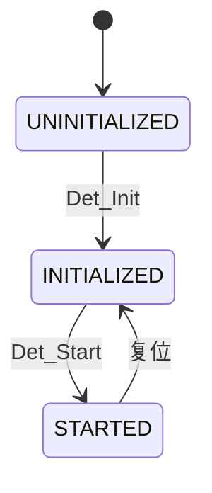
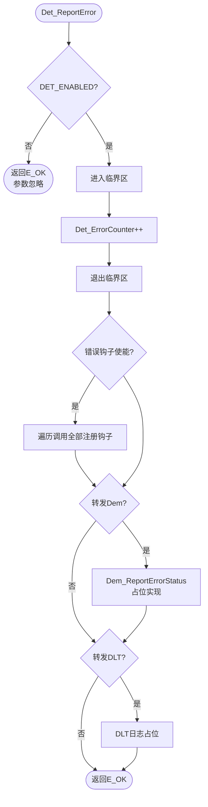

# 开发错误追踪器（Det）

<cite>
**本文档引用的文件**
- [Det.h](file://src/bsw/services/det/include/Det.h)
- [Det_Cfg.h](file://src/bsw/services/det/include/Det_Cfg.h)
- [Det_MemMap.h](file://src/bsw/services/det/include/Det_MemMap.h)
- [Det.c](file://src/bsw/services/det/src/Det.c)
- [Det_Lcfg.c](file://src/bsw/services/det/src/Det_Lcfg.c)
- [Std_Types.h](file://src/bsw/os/include/Std_Types.h)
</cite>

## 目录
1. [简介](#简介)
2. [项目结构](#项目结构)
3. [核心组件](#核心组件)
4. [架构概览](#架构概览)
5. [详细组件分析](#详细组件分析)
6. [依赖关系分析](#依赖关系分析)
7. [性能考虑](#性能考虑)
8. [故障排除指南](#故障排除指南)
9. [结论](#结论)
10. [附录](#附录)

## 简介

开发错误追踪器（Det）是遵循AUTOSAR R22-11标准（AUTOSAR_SWS_DevelopmentErrorTracer）的开发错误报告模块，位于服务层。Det为所有BSW模块提供统一的开发错误上报通道：模块通过Det_ReportError报告"模块ID+实例ID+API ID+错误ID"四元组，Det负责错误计数、回调分发及可选转发（Dem/Dlt）。

Det模块ID为15u（DET_MODULE_ID），厂商ID为100u，软件版本1.0.0。作为开发期最重要的诊断基础设施，Det的错误报告能力贯穿整个BSW栈——本仓库中几乎每个服务模块（BswM/CanNm/CanSm/ComM/Crc/EcuC/EthSM/EthTSyn等）都调用Det_ReportError上报开发错误。

## 项目结构

Det模块在项目中的文件组织如下：



**图表来源**
- [Det.h:14-20](file://src/bsw/services/det/include/Det.h#L14-L20)
- [Det.c:10-16](file://src/bsw/services/det/src/Det.c#L10-L16)

### 文件清单

| 文件 | 路径 | 职责 |
|------|------|------|
| Det.h | include/Det.h | 公开API、钩子类型定义 |
| Det_Cfg.h | include/Det_Cfg.h | 特性开关（DET_ENABLED等） |
| Det_MemMap.h | include/Det_MemMap.h | 内存段映射 |
| Det.c | src/Det.c | 错误报告、钩子分发、计数 |
| Det_Lcfg.c | src/Det_Lcfg.c | 链接期配置 |

**章节来源**
- [Det.h:1-253](file://src/bsw/services/det/include/Det.h#L1-L253)

## 核心组件

### 错误四元组



**图表来源**
- [Det.h:45-82](file://src/bsw/services/det/include/Det.h#L45-L82)

### 错误类别

Det区分三类错误报告机制：

| 类别 | API | 说明 |
|------|-----|------|
| 开发错误 | Det_ReportError | 开发期错误（参数越界等） |
| 运行时错误 | Det_ReportRuntimeError | 生产环境运行时错误 |
| 瞬时故障 | Det_ReportTransientFault | 可恢复的瞬时故障 |

### 钩子体系



**章节来源**
- [Det.c:65-112](file://src/bsw/services/det/src/Det.c#L65-L112)

## 架构概览

Det错误处理架构：



**图表来源**
- [Det.c:118-160](file://src/bsw/services/det/src/Det.c#L118-L160)

### 状态机



**章节来源**
- [Det.c:47-49](file://src/bsw/services/det/src/Det.c#L47-L49)

## 详细组件分析

### 初始化（Det_Init）

初始化流程：
1. 拒绝重复初始化（INITIALIZED/STARTED状态直接返回）
2. 进入临界区（DET_ENTER_CRITICAL_SECTION）
3. 保存配置指针DetConfigPtr
4. 置状态INITIALIZED、DetInitialized=TRUE
5. 清零三类错误计数器
6. 清空错误钩子/运行时回调/瞬时故障回调表
7. 退出临界区

**章节来源**
- [Det.c:118-165](file://src/bsw/services/det/src/Det.c#L118-L165)

### 开发错误报告（Det_ReportError）



**章节来源**
- [Det.c:167-230](file://src/bsw/services/det/src/Det.c#L167-L230)

### 运行时错误与瞬时故障

- **Det_ReportRuntimeError**：计数RuntimeErrorCounter，分发运行时回调（DET_RUNTIME_ERROR_CALLOUTS使能时返回E_OK）
- **Det_ReportTransientFault**：计数TransientFaultCounter，分发瞬时故障回调（DET_TRANSIENT_FAULT_CALLOUTS使能时返回E_OK）

**章节来源**
- [Det.c:232-290](file://src/bsw/services/det/src/Det.c#L232-L290)

### 钩子调用（Det_CallErrorHooks 等）

遍历注册表调用非空钩子，将ModuleId/InstanceId/ApiId/ErrorId原样传递。三类钩子表在Det_Init时清零。

**章节来源**
- [Det.c:318-365](file://src/bsw/services/det/src/Det.c#L318-L365)

## 依赖关系分析

```mermaid
graph TB
subgraph "调用方(全BSW)"
BswM[BSW模式管理器]
CanNm[CAN网络管理]
CanSm[CAN状态管理]
ComM[通信管理器]
EcuC[ECU配置]
EthSM[以太网状态管理]
EthTSyn[以太网时间同步]
FiM[功能抑制管理]
Crc[CRC服务]
Csm[加密服务管理]
end
subgraph "Det"
Det[开发错误追踪器]
Cfg[Det_Cfg]
Lcfg[Det_Lcfg]
end
subgraph "消费方"
UserHook[用户钩子]
Dem[Dem]
Dlt[DLT]
end
subgraph "基础"
Std[Std_Types]
Compiler[Compiler.h NULL_PTR]
end
BswM --> Det
CanNm --> Det
CanSm --> Det
ComM --> Det
EcuC --> Det
EthSM --> Det
EthTSyn --> Det
FiM --> Det
Crc --> Det
Csm --> Det
Det --> Cfg
Det --> Lcfg
Det --> UserHook
Det --> Dem
Det --> Dlt
Det --> Std
Det --> Compiler
```

**图表来源**
- [Det.h:23-25](file://src/bsw/services/det/include/Det.h#L23-L25)

### 关键依赖特性

1. **被全栈依赖**：服务层约30+模块调用Det_ReportError
2. **可选转发**：DET_FORWARD_TO_DEM/DLT可配置转发到诊断与日志
3. **极简依赖**：仅依赖Std_Types与Compiler（NULL_PTR）
4. **链接期配置**：Det_Lcfg.c提供错误钩子表

**章节来源**
- [Det_Cfg.h:15-48](file://src/bsw/services/det/include/Det_Cfg.h#L15-L48)

## 性能考虑

### 资源占用

- **静态变量**：状态/计数器/钩子表，<100字节
- **代码体积**：约3KB，全栈共享
- **无动态分配**：钩子表为固定大小数组

### 性能特征

- **报告开销**：计数（临界区）+钩子分发（表遍历），O(钩子数)
- **临界区**：DET_ENTER_CRITICAL_SECTION实现为关中断（简化实现，实际应使用OS服务）
- **可选路径**：Dem/Dlt转发关闭时报告开销最小

### 优化建议

1. 生产版本设置DET_ENABLED=STD_OFF或仅保留运行时错误路径
2. 钩子注册数量最小化（DET_MAX_ERROR_HOOKS）
3. 错误上报集中在开发/集成阶段使用，量产配置裁剪
4. 临界区实现替换为OS中断保护服务（GetResource/SuspendOSInterrupts）

**章节来源**
- [Det.c:36-40](file://src/bsw/services/det/src/Det.c#L36-L40)

## 故障排除指南

### 错误代码

| 错误代码 | 含义 | 触发条件 | 解决方案 |
|----------|------|----------|----------|
| DET_E_PARAM_POINTER (0x01U) | 指针无效 | GetVersionInfo传NULL | 检查传参 |
| DET_E_UNINIT (0x02U) | 未初始化 | 未调用Det_Init | 检查初始化顺序 |
| DET_E_ALREADY_INITIALIZED (0x03U) | 重复初始化 | 多次Det_Init | 检查调用次数 |

### 调试建议

1. **错误无响应**：确认DET_ENABLED=STD_ON且Det_Init已执行
2. **错误定位**：利用四元组（ModuleId/ApiId/ErrorId）对照各模块头文件定位
3. **钩子不触发**：确认DET_ERROR_HOOKS_ENABLED且钩子已注册
4. **计数溢出**：Det_ErrorCounter为uint32，长时间运行注意检查
5. **崩溃排查**：在Det_ReportError设置断点，查看调用栈回溯错误源模块

**章节来源**
- [Det.h:40-44](file://src/bsw/services/det/include/Det.h#L40-L44)

## 结论

开发错误追踪器（Det）模块提供了：

1. **统一错误通道**：四元组（模块/实例/API/错误）标准化上报
2. **三类错误机制**：开发错误/运行时错误/瞬时故障分通道处理
3. **可扩展分发**：钩子注册+Dem/Dlt可选转发
4. **全栈覆盖**：服务层所有模块的开发错误上报基础设施

Det是yuleASR开发期质量保障的基石，贯穿所有BSW模块的调试与集成验证。

## 附录

### API参考

- **初始化**：Det_Init(const Det_ConfigType*), Det_Start()
- **错误报告**：Det_ReportError(), Det_ReportRuntimeError(), Det_ReportTransientFault()
- **版本信息**：Det_GetVersionInfo()

### 错误上报示例

```c
/* 典型调用模式（以BswM为例） */
Det_ReportError(BSWM_MODULE_ID, 0U, BSWM_SID_INIT, BSWM_E_PARAM_POINTER);
/*               模块ID        实例ID     API ID      错误ID      */
```

### 配置最佳实践

1. 开发期：DET_ENABLED=STD_ON + 错误钩子全开
2. 集成期：开启DET_FORWARD_TO_DEM便于问题入库
3. 量产：评估关闭Det或仅保留运行时错误通道
