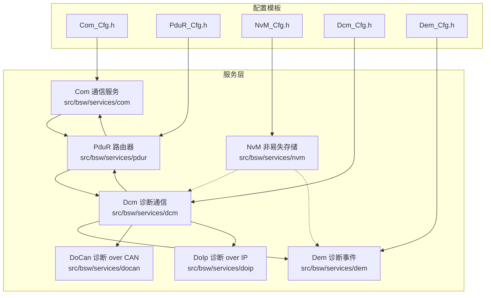
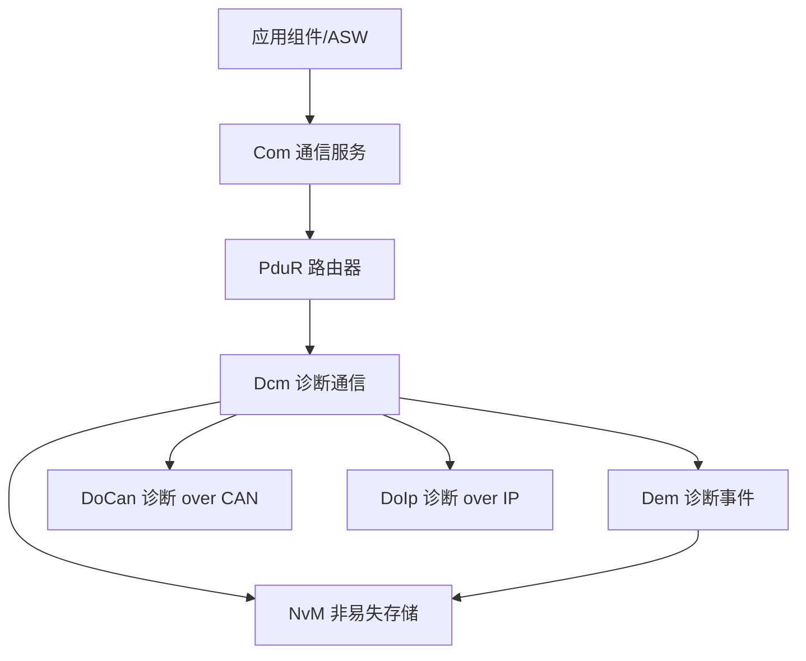
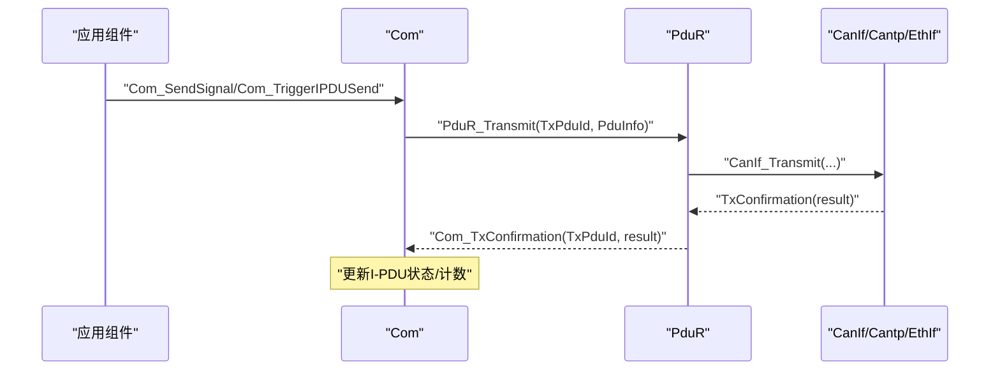
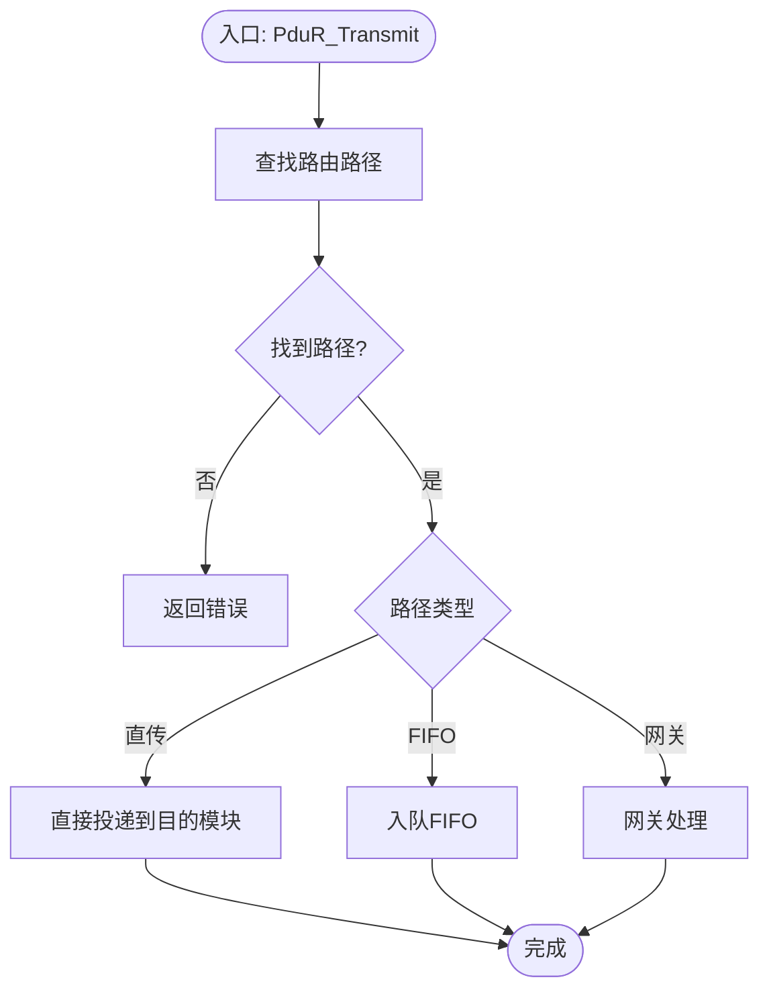
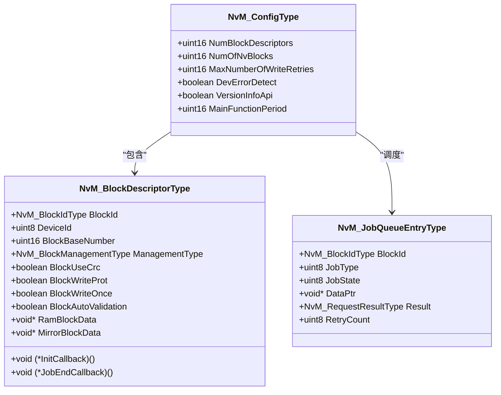
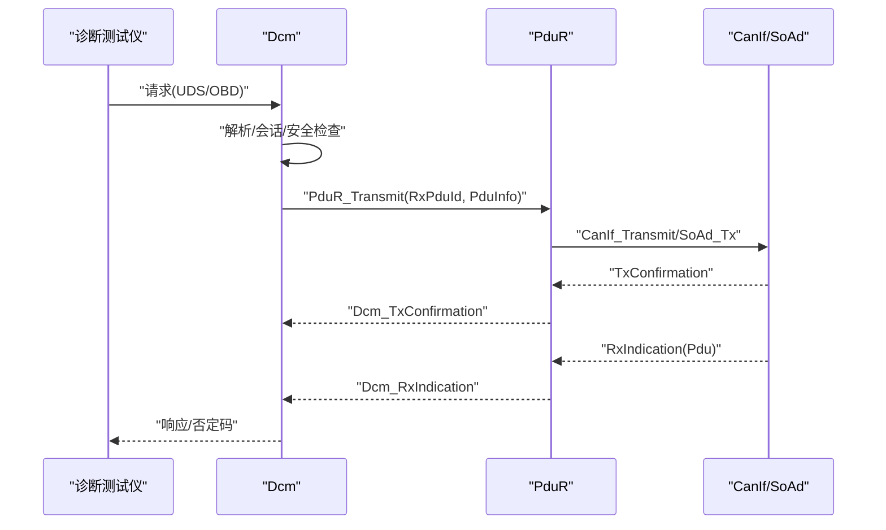
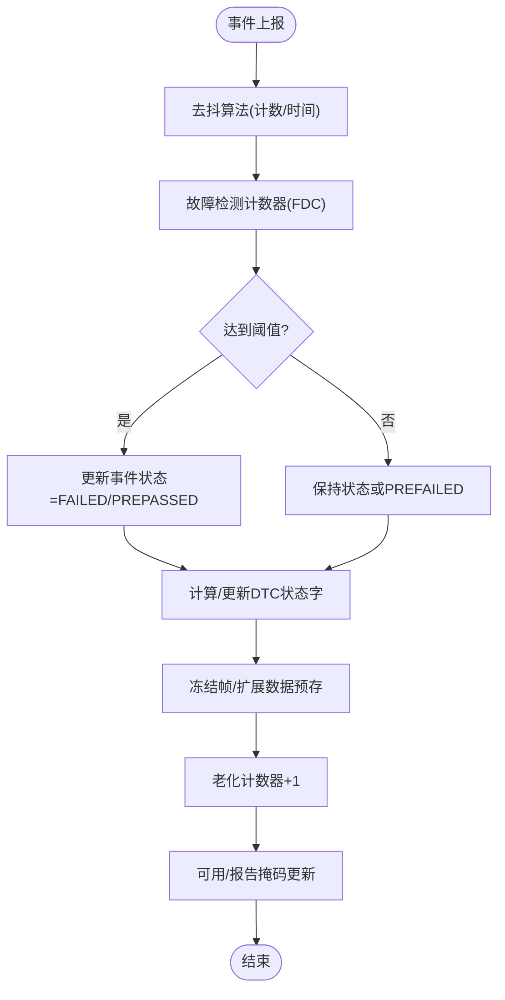
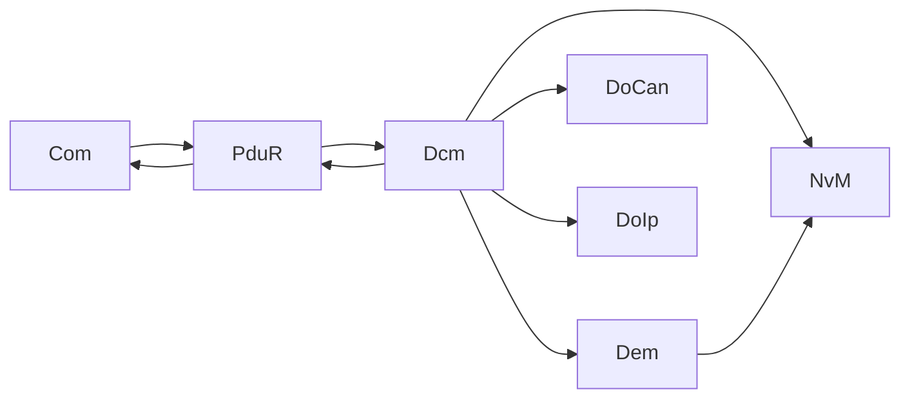

# 服务层

<cite>
**本文引用的文件**
- [Com.h](file://src/bsw/services/com/include/Com.h)
- [Com.c](file://src/bsw/services/com/src/Com.c)
- [Com_Cfg.h](file://src/bsw/config/templates/Com_Cfg.h)
- [PduR.h](file://src/bsw/services/pdur/include/PduR.h)
- [PduR.c](file://src/bsw/services/pdur/src/PduR.c)
- [PduR_Cfg.h](file://src/bsw/config/templates/PduR_Cfg.h)
- [NvM.h](file://src/bsw/services/nvm/include/NvM.h)
- [NvM.c](file://src/bsw/services/nvm/src/NvM.c)
- [NvM_Cfg.h](file://src/bsw/config/templates/NvM_Cfg.h)
- [Dcm.h](file://src/bsw/services/dcm/include/Dcm.h)
- [Dcm_Cfg.h](file://src/bsw/services/dcm/include/Dcm_Cfg.h)
- [Dem.h](file://src/bsw/services/dem/include/Dem.h)
- [Dem_Cfg.h](file://src/bsw/services/dem/include/Dem_Cfg.h)
- [DoCan.h](file://src/bsw/services/docan/include/DoCan.h)
- [DoIp.h](file://src/bsw/services/doip/include/DoIp.h)
</cite>

## 目录
1. [简介](#简介)
2. [项目结构](#项目结构)
3. [核心组件](#核心组件)
4. [架构总览](#架构总览)
5. [详细组件分析](#详细组件分析)
6. [依赖关系分析](#依赖关系分析)
7. [性能考虑](#性能考虑)
8. [故障排查指南](#故障排查指南)
9. [结论](#结论)
10. [附录](#附录)

## 简介
本文件面向服务层（AUTOSAR Classic Platform 4.x）的五大核心服务模块：Com通信服务、PduR PDU路由器、NvM NVRAM管理器、Dcm诊断通信管理器、Dem诊断事件管理器，并补充DoCan诊断通信与DoIp诊断通信的实现要点。文档从接口规范、数据结构、处理流程、回调机制、错误处理、性能优化与服务间交互等维度进行系统化阐述，帮助开发者快速理解与高效集成。

## 项目结构
服务层位于 src/bsw/services 下，按功能划分为独立子目录，每个子目录包含 include 与 src 两部分，遵循 AUTOSAR 分层与模块化组织方式。配置模板位于 src/bsw/config/templates 中，用于生成各模块运行时配置。

图表来源
- [Com.h:1-508](file://src/bsw/services/com/include/Com.h#L1-L508)
- [PduR.h:1-282](file://src/bsw/services/pdur/include/PduR.h#L1-L282)
- [NvM.h:1-355](file://src/bsw/services/nvm/include/NvM.h#L1-L355)
- [Dcm.h:1-379](file://src/bsw/services/dcm/include/Dcm.h#L1-L379)
- [Dem.h:1-541](file://src/bsw/services/dem/include/Dem.h#L1-L541)
- [DoCan.h:1-180](file://src/bsw/services/docan/include/DoCan.h#L1-L180)
- [DoIp.h:1-233](file://src/bsw/services/doip/include/DoIp.h#L1-L233)

章节来源
- [Com.h:1-508](file://src/bsw/services/com/include/Com.h#L1-L508)
- [PduR.h:1-282](file://src/bsw/services/pdur/include/PduR.h#L1-L282)
- [NvM.h:1-355](file://src/bsw/services/nvm/include/NvM.h#L1-L355)
- [Dcm.h:1-379](file://src/bsw/services/dcm/include/Dcm.h#L1-L379)
- [Dem.h:1-541](file://src/bsw/services/dem/include/Dem.h#L1-L541)
- [DoCan.h:1-180](file://src/bsw/services/docan/include/DoCan.h#L1-L180)
- [DoIp.h:1-233](file://src/bsw/services/doip/include/DoIp.h#L1-L233)

## 核心组件
本节概述五大核心服务模块的职责与关键接口能力：
- Com 通信服务：信号打包/解包、周期/混合/直接传输模式、I-PDU 组控制、接收/发送信号与组、Deadline 监控、主函数驱动。
- PduR PDU路由器：路由路径查找与转发、FIFO队列、直传/网关/延迟处理、上/下层回调映射。
- NvM NVRAM管理器：块读写/擦除/失效、CRC校验/镜像/冗余、多块读写、作业队列、主函数调度。
- Dcm 诊断通信管理器：UDS/OBD协议栈、会话/安全级别、DID/RID、请求响应缓冲、触发发送/收发确认。
- Dem 诊断事件管理器：故障码（DTC）状态机、冻结帧/扩展数据、操作循环/老化计数、指示灯状态、主函数调度。

章节来源
- [Com.h:240-501](file://src/bsw/services/com/include/Com.h#L240-L501)
- [PduR.h:163-279](file://src/bsw/services/pdur/include/PduR.h#L163-L279)
- [NvM.h:187-352](file://src/bsw/services/nvm/include/NvM.h#L187-L352)
- [Dcm.h:277-376](file://src/bsw/services/dcm/include/Dcm.h#L277-L376)
- [Dem.h:314-538](file://src/bsw/services/dem/include/Dem.h#L314-L538)

## 架构总览
服务层采用“上层应用/应用组件”通过 Com 与 PduR 进行消息路由，再由 Dcm/DoCan/DoIp 等模块对接底层网络（CAN/IP），NvM/DEM 提供非易失存储与故障码管理支撑。

图表来源
- [Com.h:240-501](file://src/bsw/services/com/include/Com.h#L240-L501)
- [PduR.h:234-279](file://src/bsw/services/pdur/include/PduR.h#L234-L279)
- [Dcm.h:277-376](file://src/bsw/services/dcm/include/Dcm.h#L277-L376)
- [Dem.h:314-538](file://src/bsw/services/dem/include/Dem.h#L314-L538)
- [NvM.h:187-352](file://src/bsw/services/nvm/include/NvM.h#L187-L352)
- [DoCan.h:127-178](file://src/bsw/services/docan/include/DoCan.h#L127-L178)
- [DoIp.h:164-230](file://src/bsw/services/doip/include/DoIp.h#L164-L230)

## 详细组件分析

### Com 通信服务
- 功能要点
  - 信号与信号组的发送/接收、无效化；I-PDU 触发发送、切换传输模式。
  - 周期/混合/直接/无传输模式；过滤算法（掩码/范围/间隔等）。
  - Deadline 监控（DM）与 I-PDU 组向量控制；主函数驱动接收/发送/信号路由。
  - 与 PduR 的回调：Com_RxIndication、Com_TxConfirmation、Com_TriggerTransmit。
- 关键数据结构
  - 信号/IPDU 配置类型、传输模式类型、状态枚举。
- 接口规范
  - 初始化/去初始化、状态查询、版本信息、信号/IPDU 操作、主函数。
- 错误处理
  - DET 报错、参数校验、未初始化、非法ID、服务不可用等。
- 性能优化
  - 信号更新位图、最小化拷贝、缓冲区复用、过滤减少无效传输。

图表来源
- [Com.h:429-463](file://src/bsw/services/com/include/Com.h#L429-L463)
- [PduR.h:191-205](file://src/bsw/services/pdur/include/PduR.h#L191-L205)

章节来源
- [Com.h:240-501](file://src/bsw/services/com/include/Com.h#L240-L501)
- [Com.c:1-200](file://src/bsw/services/com/src/Com.c#L1-L200)
- [Com_Cfg.h:1-129](file://src/bsw/config/templates/Com_Cfg.h#L1-L129)

### PduR PDU路由器
- 功能要点
  - 路由路径查找、目的模块分发、FIFO队列与延迟处理、直传/网关/延迟路径。
  - 上/下层回调映射：Com_Dcm_Rx/Tx、CanIf_Rx/Tx、TriggerTransmit。
  - 路由路径组启用/禁用、参数变更请求、取消收发请求。
- 关键数据结构
  - 路由路径配置、目的PDU配置、路径类型、FIFO队列。
- 接口规范
  - 初始化/去初始化、版本信息、Transmit/Cancel/ChangeParameter、Enable/DisableRouting、MainFunction。
- 错误处理
  - DET 参数错误、PDU ID无效、路径未找到、FIFO满等。
- 性能优化
  - 可配置最大目的地数量、FIFO深度、路径缓存索引。

图表来源
- [PduR.c:132-183](file://src/bsw/services/pdur/src/PduR.c#L132-L183)
- [PduR.h:140-149](file://src/bsw/services/pdur/include/PduR.h#L140-L149)

章节来源
- [PduR.h:163-279](file://src/bsw/services/pdur/include/PduR.h#L163-L279)
- [PduR.c:1-200](file://src/bsw/services/pdur/src/PduR.c#L1-L200)
- [PduR_Cfg.h:1-72](file://src/bsw/config/templates/PduR_Cfg.h#L1-L72)

### NvM NVRAM管理器
- 功能要点
  - 单块/多块读写、恢复默认、擦除、失效、CRC校验、镜像/冗余、写一次保护。
  - 标准队列与即时队列、作业状态机、结果回调、主函数周期调度。
- 关键数据结构
  - 块描述符、作业队列项、块状态、CRC类型。
- 接口规范
  - 初始化、设置数据索引、读写/擦除/失效、读写全部、取消作业、设置保护/锁、主函数。
- 错误处理
  - DET 参数错误、未初始化、块挂起、块配置错误、锁定/写保护。
- 性能优化
  - 双队列优先级、重试上限、CRC压缩机制、RAM块CRC计算可选。

图表来源
- [NvM.h:149-172](file://src/bsw/services/nvm/include/NvM.h#L149-L172)
- [NvM.h:121-144](file://src/bsw/services/nvm/include/NvM.h#L121-L144)
- [NvM.h:72-82](file://src/bsw/services/nvm/include/NvM.h#L72-L82)

章节来源
- [NvM.h:187-352](file://src/bsw/services/nvm/include/NvM.h#L187-L352)
- [NvM.c:1-200](file://src/bsw/services/nvm/src/NvM.c#L1-L200)
- [NvM_Cfg.h:1-93](file://src/bsw/config/templates/NvM_Cfg.h#L1-L93)

### Dcm 诊断通信管理器
- 功能要点
  - UDS/OBD协议支持、会话控制、安全访问、DID/RID、请求/响应缓冲、触发发送/收发确认。
  - 多协议/连接/会话/安全等级配置、定时参数（P2/S3）、主函数周期。
- 关键数据结构
  - 协议类型、消息上下文、DID/RID配置、会话/安全级别枚举。
- 接口规范
  - 初始化/启动/停止/去初始化、版本信息、安全/会话查询、触发事件、Tx/Rx/TriggerTransmit、主函数。
- 错误处理
  - DET 接口超时/返回值/缓冲溢出、未初始化、参数错误、无效值。
- 性能优化
  - 缓冲大小可配置、任务时间开关、响应全部请求可选。

图表来源
- [Dcm.h:349-373](file://src/bsw/services/dcm/include/Dcm.h#L349-L373)
- [PduR.h:261-276](file://src/bsw/services/pdur/include/PduR.h#L261-L276)

章节来源
- [Dcm.h:277-376](file://src/bsw/services/dcm/include/Dcm.h#L277-L376)
- [Dcm_Cfg.h:1-132](file://src/bsw/services/dcm/include/Dcm_Cfg.h#L1-L132)

### Dem 诊断事件管理器
- 功能要点
  - 故障检测计数器、事件状态机、DTC状态字、冻结帧/扩展数据记录、操作循环/老化。
  - 指示灯状态管理、DTC选择/清除、记录更新启停、主函数周期。
- 关键数据结构
  - 事件状态、DTC参数、冻结帧/扩展数据记录、操作循环类型。
- 接口规范
  - 初始化/关闭、版本信息、事件状态设置/重置、DTC查询/清除、指示灯、主函数。
- 错误处理
  - DET 参数/数据/未初始化/条件错误/配置错误。
- 性能优化
  - 可配置去抖算法（计数/时间）、老化阈值、内存分区（主/镜像/永久）。

图表来源
- [Dem.h:218-228](file://src/bsw/services/dem/include/Dem.h#L218-L228)
- [Dem.h:142-147](file://src/bsw/services/dem/include/Dem.h#L142-L147)

章节来源
- [Dem.h:314-538](file://src/bsw/services/dem/include/Dem.h#L314-L538)
- [Dem_Cfg.h:1-158](file://src/bsw/services/dem/include/Dem_Cfg.h#L1-L158)

### DoCan 诊断 over CAN
- 功能要点
  - 诊断PDU映射、物理/功能通道、超时控制、CanTp传输、收发确认、主函数。
- 关键数据结构
  - 通道类型/状态、PDU映射、通道配置。
- 接口规范
  - 初始化/去初始化、版本信息、Transmit/RxIndication/TxConfirmation、主函数。
- 错误处理
  - DET 参数/未初始化/无效PDU/通道、发送失败。

章节来源
- [DoCan.h:127-178](file://src/bsw/services/docan/include/DoCan.h#L127-L178)

### DoIp 诊断 over IP
- 功能要点
  - 连接状态管理、路由激活（WWH-OBD/中央安全）、Alive/通用超时、SoAd传输确认、主函数。
- 关键数据结构
  - 连接状态/路由激活类型、通用头部、连接/路由配置。
- 接口规范
  - 初始化/去初始化、版本信息、IfTransmit/IfRxIndication/ActivateRouting/CloseConnection、SoAdTxConfirmation、主函数。
- 错误处理
  - DET 参数/未初始化/无效PDU/连接/路由激活参数。

章节来源
- [DoIp.h:164-230](file://src/bsw/services/doip/include/DoIp.h#L164-L230)

## 依赖关系分析
- Com 依赖 PduR 进行跨模块路由，依赖 DET/MemMap。
- PduR 依赖上层（Com/Dcm）与下层（CanIf/Cantp/EthIf/SoAd）回调接口。
- Dcm 依赖 PduR 进行路由，依赖 DEM/NvM 提供事件与持久化能力。
- Dem 依赖 NvM 进行故障码持久化。
- DoCan/DoIp 作为 Dcm 的传输适配层，分别对接 CAN/IP 底层。

图表来源
- [Com.h:240-501](file://src/bsw/services/com/include/Com.h#L240-L501)
- [PduR.h:234-279](file://src/bsw/services/pdur/include/PduR.h#L234-L279)
- [Dcm.h:277-376](file://src/bsw/services/dcm/include/Dcm.h#L277-L376)
- [Dem.h:314-538](file://src/bsw/services/dem/include/Dem.h#L314-L538)
- [NvM.h:187-352](file://src/bsw/services/nvm/include/NvM.h#L187-L352)
- [DoCan.h:127-178](file://src/bsw/services/docan/include/DoCan.h#L127-L178)
- [DoIp.h:164-230](file://src/bsw/services/doip/include/DoIp.h#L164-L230)

## 性能考虑
- 通信与路由
  - Com 使用过滤算法与更新位图降低无效传输；PduR FIFO深度与路径类型影响吞吐与延迟。
  - 建议：根据负载调整 FIFO 深度、路径类型与主函数周期。
- 诊断处理
  - Dcm 缓冲大小与会话/安全策略影响响应时延；建议合理设置 P2/S3 与任务时间。
- 存储管理
  - NvM 双队列与重试次数限制写放大；建议启用 CRC 压缩与镜像冗余提升可靠性。
- 事件管理
  - Dem 去抖算法与老化阈值影响事件收敛速度；建议结合业务场景调参。

## 故障排查指南
- 通信与路由
  - 现象：Com 发送阻塞/丢包、PduR 路径未命中。
  - 排查：确认配置中 PDU ID/模块类型匹配；检查 DET 报错码；核对 FIFO 深度与路径组启用状态。
- 诊断通信
  - 现象：Dcm 无法响应、超时、否定码。
  - 排查：检查协议/会话/安全配置；核对缓冲大小与定时参数；验证 DoCan/DoIp 连接状态。
- 事件与存储
  - 现象：Dem 事件不更新、NvM 写失败。
  - 排查：确认块描述符与保护/锁状态；检查 CRC/镜像配置；查看 DET 报错码与作业队列状态。

章节来源
- [Com.h:89-103](file://src/bsw/services/com/include/Com.h#L89-L103)
- [PduR.h:52-71](file://src/bsw/services/pdur/include/PduR.h#L52-L71)
- [Dcm.h:66-76](file://src/bsw/services/dcm/include/Dcm.h#L66-L76)
- [Dem.h:87-97](file://src/bsw/services/dem/include/Dem.h#L87-L97)
- [NvM.h:65-92](file://src/bsw/services/nvm/include/NvM.h#L65-L92)

## 结论
服务层五大核心模块在 AUTOSAR 体系中承担“数据路由、通信编排、诊断协议、事件与存储”的关键职责。通过清晰的接口、可配置的参数与完善的错误处理，实现了高内聚、低耦合的服务架构。结合本文的配置参数、回调机制与性能优化建议，可在不同硬件平台与应用场景下稳定高效地部署诊断与通信功能。

## 附录
- 配置参数速览
  - Com：信号/IPDU 数量、端序、超时因子、主函数周期、网关支持、信号网关映射数。
  - PduR：路由路径/组数量、模块ID映射、FIFO深度、主函数周期。
  - NvM：块数量/数据集/ROM块、重试次数、CRC选项、主函数周期、队列尺寸。
  - Dcm：协议/连接/会话/安全等级、缓冲大小、定时参数、主函数周期、OBD/Routine/DataTransfer 支持。
  - Dem：事件/DTC数量、冻结帧/扩展数据配置、指示灯、操作循环、去抖与老化参数、主函数周期。

章节来源
- [Com_Cfg.h:1-129](file://src/bsw/config/templates/Com_Cfg.h#L1-L129)
- [PduR_Cfg.h:1-72](file://src/bsw/config/templates/PduR_Cfg.h#L1-L72)
- [NvM_Cfg.h:1-93](file://src/bsw/config/templates/NvM_Cfg.h#L1-L93)
- [Dcm_Cfg.h:1-132](file://src/bsw/services/dcm/include/Dcm_Cfg.h#L1-L132)
- [Dem_Cfg.h:1-158](file://src/bsw/services/dem/include/Dem_Cfg.h#L1-L158)