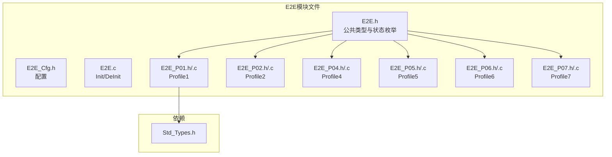
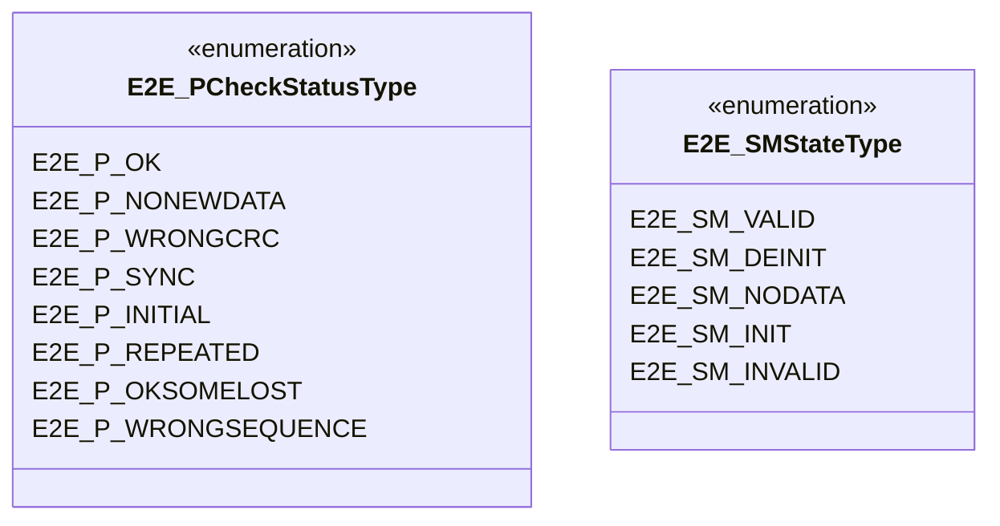
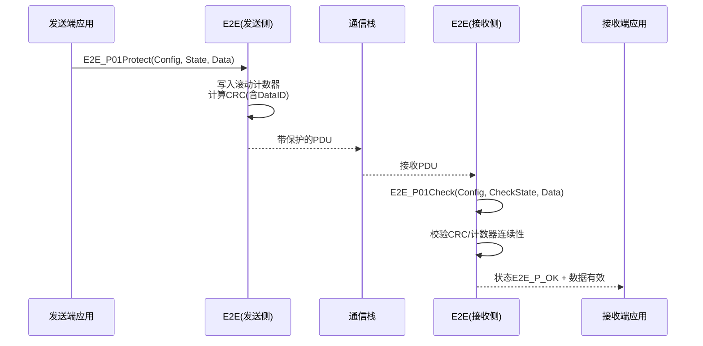
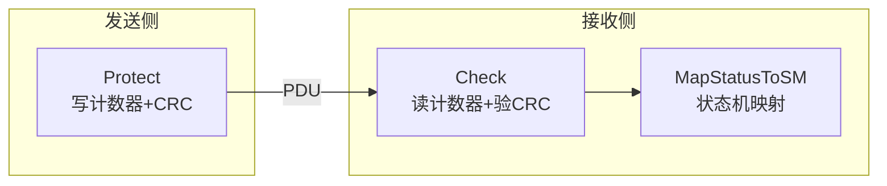
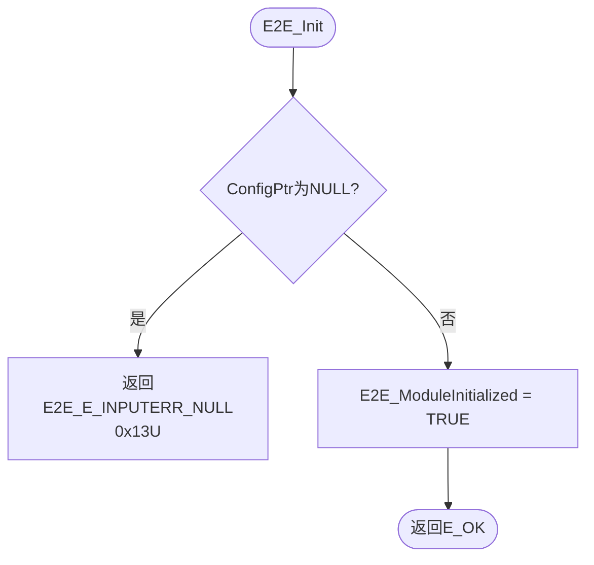
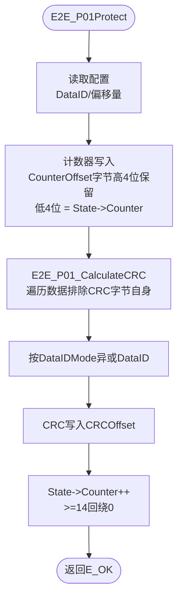
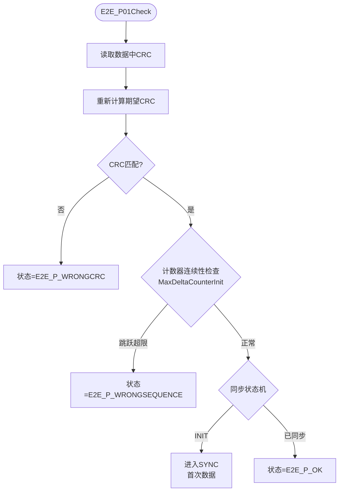

# 端到端保护（E2E）

<cite>
**本文档引用的文件**
- [E2E.h](file://src/bsw/services/e2e/include/E2E.h)
- [E2E_Cfg.h](file://src/bsw/services/e2e/include/E2E_Cfg.h)
- [E2E.c](file://src/bsw/services/e2e/src/E2E.c)
- [E2E_P01.h](file://src/bsw/services/e2e/include/E2E_P01.h)
- [E2E_P02.h](file://src/bsw/services/e2e/include/E2E_P02.h)
- [E2E_P04.h](file://src/bsw/services/e2e/include/E2E_P04.h)
- [E2E_P05.h](file://src/bsw/services/e2e/include/E2E_P05.h)
- [E2E_P06.h](file://src/bsw/services/e2e/include/E2E_P06.h)
- [E2E_P07.h](file://src/bsw/services/e2e/include/E2E_P07.h)
- [E2E_P01.c](file://src/bsw/services/e2e/src/E2E_P01.c)
- [E2E_P02.c](file://src/bsw/services/e2e/src/E2E_P02.c)
- [E2E_P04.c](file://src/bsw/services/e2e/src/E2E_P04.c)
- [E2E_P05.c](file://src/bsw/services/e2e/src/E2E_P05.c)
- [E2E_P06.c](file://src/bsw/services/e2e/src/E2E_P06.c)
- [E2E_P07.c](file://src/bsw/services/e2e/src/E2E_P07.c)
- [Std_Types.h](file://src/bsw/os/include/Std_Types.h)
</cite>

## 目录
1. [简介](#简介)
2. [项目结构](#项目结构)
3. [核心组件](#核心组件)
4. [架构概览](#架构概览)
5. [详细组件分析](#详细组件分析)
6. [依赖关系分析](#依赖关系分析)
7. [性能考虑](#性能考虑)
8. [故障排除指南](#故障排除指南)
9. [结论](#结论)
10. [附录](#附录)

## 简介

端到端保护（E2E）是遵循AUTOSAR经典平台4.4标准的端到端数据保护库，位于服务层，模块ID为0xF0U（E2E_MODULE_ID）。E2E用于保护跨ECU通信（或进程内通信）的数据完整性，通过"CRC校验+滚动计数器+数据ID"机制检测数据传输过程中的位翻转、丢失、重复、乱序、插入与伪装等错误，满足ASIL-D级功能安全对通信数据的要求。

本实现覆盖AUTOSAR E2E规范的6个Profile：
- **P01**：CRC8 + 4位计数器 + 16位DataID（常用，低开销）
- **P02**：CRC8（多项式0x2F）+ 计数器 + 16位DataID
- **P04**：CRC32 + 16位计数器 + 32位DataID（高检测力）
- **P05**：CRC64-ECMA + 32位计数器 + 32位DataID（最高检测力）
- **P06**：CRC64 + 16位计数器 + 动态长度
- **P07**：CRC32 + 8位计数器 + 动态长度

每个Profile提供Protect（发送侧保护）、Check（接收侧校验）、MapStatusToSM（状态机映射）三类API。

## 项目结构

E2E模块在项目中的文件组织如下：



**图表来源**
- [E2E.h:15-19](file://src/bsw/services/e2e/include/E2E.h#L15-L19)
- [E2E.c:17-24](file://src/bsw/services/e2e/src/E2E.c#L17-L24)

### 文件清单

| 文件 | 路径 | 职责 |
|------|------|------|
| E2E.h | include/E2E.h | 公共类型、状态枚举、Init/DeInit |
| E2E_P01~P07.h | include/ | 各Profile配置/状态类型与API |
| E2E.c | src/E2E.c | 模块级初始化 |
| E2E_P01~P07.c | src/ | 各Profile Protect/Check实现 |
| E2E_Lcfg.c | src/E2E_Lcfg.c | 链接期配置 |

**章节来源**
- [E2E.h:1-101](file://src/bsw/services/e2e/include/E2E.h#L1-L101)

## 核心组件

### 公共状态枚举



**图表来源**
- [E2E.h:44-57](file://src/bsw/services/e2e/include/E2E.h#L44-L57)

### Profile能力矩阵

| Profile | CRC宽度 | 计数器 | DataID | 多项式 | 说明 |
|---------|---------|--------|--------|--------|------|
| P01 | 8位 | 4位(0-14回绕) | 16位 | 0x1D (SAE J1850) | 低开销常用 |
| P02 | 8位 | 8位 | 16位 | 0x2F | 双CRC字节 |
| P04 | 32位 | 16位 | 32位 | 0x04C11DB7 (以太网) | 高检测力 |
| P05 | 64位 | 32位 | 32位 | CRC-64-ECMA | 最高检测力 |
| P06 | 64位 | 16位 | 32位 | CRC-64 | 动态长度 |
| P07 | 32位 | 8位 | 32位 | CRC32 | 动态长度 |

**章节来源**
- [E2E_P01.h:17-21](file://src/bsw/services/e2e/include/E2E_P01.h#L17-L21)
- [E2E_P04.h:30-36](file://src/bsw/services/e2e/include/E2E_P04.h#L30-L36)
- [E2E_P05.h:47](file://src/bsw/services/e2e/include/E2E_P05.h#L47)

### DataID模式（P01）

| 模式 | 值 | 说明 |
|------|----|----|
| E2E_P01_DATAID_BOTH | 0x00U | 高低字节都参与CRC |
| E2E_P01_DATAID_ALT | 0x01U | 按计数器奇偶交替高低字节 |
| E2E_P01_DATAID_LOW | 0x02U | 仅低字节 |
| E2E_P01_DATAID_NIBBLE | 0x03U | 半字节（按偏移） |

**章节来源**
- [E2E_P01.h:42-46](file://src/bsw/services/e2e/include/E2E_P01.h#L42-L46)

## 架构概览

E2E保护在通信链路中的位置：



**图表来源**
- [E2E_P01.c:152-200](file://src/bsw/services/e2e/src/E2E_P01.c#L152-L200)

### 保护-检查对称架构



**章节来源**
- [E2E_P01.h:50-64](file://src/bsw/services/e2e/include/E2E_P01.h#L50-L64)

## 详细组件分析

### 模块初始化（E2E_Init）



注意：AUTOSAR标准签名`E2E_Init(const void* ConfigPtr)`；host版同名无参E2E_Init(void)已于2026-08-08更名为E2E_Protection_Init，避免同名不同签名符号冲突（P2-4修复）。

**章节来源**
- [E2E.c:31-47](file://src/bsw/services/e2e/src/E2E.c#L31-L47)

### Profile 1 保护（E2E_P01Protect）



**实现细节**：CRC初值0xFF，查表法（E2E_P01_CRC8_Table 256项，SAE J1850多项式0x1D）。

**章节来源**
- [E2E_P01.c:82-150](file://src/bsw/services/e2e/src/E2E_P01.c#L82-L150)

### Profile 1 检查（E2E_P01Check）



**章节来源**
- [E2E_P01.c:200-307](file://src/bsw/services/e2e/src/E2E_P01.c#L200-L307)

### 状态机映射（E2E_P01MapStatusToSM）

将检查状态映射到E2E_SMStateType（VALID/DEINIT/NODATA/INIT/INVALID）并输出错误标志，供上层功能安全逻辑（如安全状态管理器）使用。

**章节来源**
- [E2E_P01.h:66-69](file://src/bsw/services/e2e/include/E2E_P01.h#L66-L69)

### 其他Profile特性

- **P02**：CRC8多项式0x2F，双CRC字节，适用于要求更高的短帧
- **P04**：32位以太网CRC，检测力强，适合大数据块
- **P05**：64位CRC+32位计数器，最高安全等级数据
- **P06/P07**：动态长度保护，CRC计算包含长度字段

各Profile实现相同的Protect/Check/MapStatusToSM三API结构，便于上层统一调用。

**章节来源**
- [E2E_P02.h:30-36](file://src/bsw/services/e2e/include/E2E_P02.h#L30-L36)
- [E2E_P05.h:3-7](file://src/bsw/services/e2e/include/E2E_P05.h#L3-L7)
- [E2E_P06.h:3-7](file://src/bsw/services/e2e/include/E2E_P06.h#L3-L7)
- [E2E_P07.h:3-7](file://src/bsw/services/e2e/include/E2E_P07.h#L3-L7)

## 依赖关系分析

```mermaid
graph TB
subgraph "上层"
SWC[应用/SWC]
RTE[RTE]
SecOC[SecOC(补充保护)]
end
subgraph "E2E"
E2E[端到端保护库]
P01[Profile 1-7实现]
Cfg[E2E_Cfg]
end
subgraph "依赖"
Std[Std_Types]
string.h
end
SWC --> E2E
RTE --> E2E
E2E --> P01
E2E --> Cfg
P01 --> Std
P01 --> string.h
```

**图表来源**
- [E2E_P01.c:20-21](file://src/bsw/services/e2e/src/E2E_P01.c#L20-L21)

### 关键依赖特性

1. **库式集成**：E2E为纯库实现，无运行时依赖其他BSW模块
2. **RTE集成**：RTE层信号收发前后调用E2E API（或由应用直接调用）
3. **Crc模块可选**：各Profile自带CRC实现（查表），不依赖Crc模块
4. **标准对齐**：E2E_E_OK/E2E_E_INPUTERR_NULL等错误码遵循AUTOSAR标准

**章节来源**
- [E2E.h:25-28](file://src/bsw/services/e2e/include/E2E.h#L25-L28)

## 性能考虑

### 各Profile开销对比

| Profile | CRC计算 | 每字节开销 | 适用场景 |
|---------|---------|------------|----------|
| P01 | 8位查表 | 1次查表/字节 | 常规控制报文 |
| P02 | 8位查表 | 1次查表/字节 | 常规控制报文 |
| P04 | 32位查表 | 1次查表+移位/字节 | 大数据块 |
| P05 | 64位 | 8位查表×2 | 最高安全数据 |
| P06/P07 | 64/32位 | 含长度字段 | 动态长度数据 |

### 资源占用

- **查表**：P01的256项CRC8表约256字节ROM（各Profile独立）
- **状态结构**：ProtectState/CheckState各10字节左右
- **无动态内存**：所有状态由调用方持有

### 优化建议

1. 报文短且频率高（如转向灯信号）用P01，开销最小
2. 安全关键大数据（如制动数据）用P04/P05
3. 计数器检查参数MaxDeltaCounterInit按报文周期配置，避免误报
4. 多Profile实例共享同一CRC表（若编译器合并只读数据）

**章节来源**
- [E2E_P01.c:27-62](file://src/bsw/services/e2e/src/E2E_P01.c#L27-L62)

## 故障排除指南

### 错误代码

| 错误代码 | 含义 | 可能原因 | 解决方案 |
|----------|------|----------|----------|
| E2E_E_OK (0x00U) | 成功 | - | - |
| E2E_E_NOT_OK (0x01U) | 失败 | 保护/检查失败 | 查看具体状态 |
| E2E_E_INPUTERR_NULL (0x13U) | 空指针 | Config/State/Data为NULL | 检查传参 |
| E2E_E_INPUTERR_WRONG (0x15U) | 输入错误 | 长度/偏移非法 | 检查配置 |
| E2E_E_INTERR (0x19U) | 内部错误 | 状态异常 | 检查状态结构 |
| E2E_E_OK_SOMELOST (0x26U) | 部分丢失 | 计数器跳变在容限内 | 视需求处理 |

### 检查状态诊断

| 状态 | 含义 | 处理建议 |
|------|------|----------|
| E2E_P_OK | 数据有效 | 使用数据 |
| E2E_P_WRONGCRC | CRC错误 | 丢弃数据 |
| E2E_P_WRONGSEQUENCE | 计数器乱序 | 丢弃并重新同步 |
| E2E_P_REPEATED | 重复帧 | 丢弃（重放攻击迹象） |
| E2E_P_OKSOMELOST | 丢失容忍内 | 按应用策略处理 |
| E2E_P_NONEWDATA | 无新数据 | 保持上一有效值 |

### 调试建议

1. **CRC失败**：确认发送/接收两端DataID、DataIDMode、CRC偏移配置一致
2. **乱序频繁**：检查总线负载与报文周期，调整MaxDeltaCounterInit
3. **首次通信失败**：检查接收侧同步状态机（INIT→SYNC→OK流程）
4. **字节序**：确认CRC与计数器字段在PDU中的位偏移（BitOffset）正确

**章节来源**
- [E2E.h:25-28](file://src/bsw/services/e2e/include/E2E.h#L25-L28)

## 结论

端到端保护（E2E）模块提供了：

1. **Profile全覆盖**：P01/P02/P04/P05/P06/P07六种保护配置
2. **对称API设计**：Protect/Check/MapStatusToSM三API贯穿所有Profile
3. **多级检测力**：从CRC8（低开销）到CRC64（最高检测力）梯度覆盖
4. **功能安全支撑**：满足ASIL-D对通信数据完整性检测的要求

E2E是yuleASR功能安全通信架构的核心保障组件，与SecOC（面向安全攻击）互补，分别应对偶发故障与恶意攻击。

## 附录

### API参考

- **模块级**：E2E_Init(), E2E_DeInit()
- **各Profile**：E2E_PxxProtect(), E2E_PxxCheck(), E2E_PxxMapStatusToSM()

### 集成示例（P01）

```c
E2E_P01ConfigType cfg = { .DataID = 0x1234U, .DataIDMode = E2E_P01_DATAID_BOTH, ... };
E2E_P01ProtectStateType txState = {0};
E2E_P01CheckStateType rxState = {0};

/* 发送侧 */
E2E_P01Protect(&cfg, &txState, txData);
/* 接收侧 */
E2E_P01Check(&cfg, &rxState, rxData);  /* 检查rxState.Status == E2E_P_OK */
```

### 配置建议

1. DataID每个信号唯一，防串信号
2. 计数器回绕值（P01为14）与报文周期匹配
3. 动态长度Profile（P06/P07）注意长度字段的CRC覆盖
