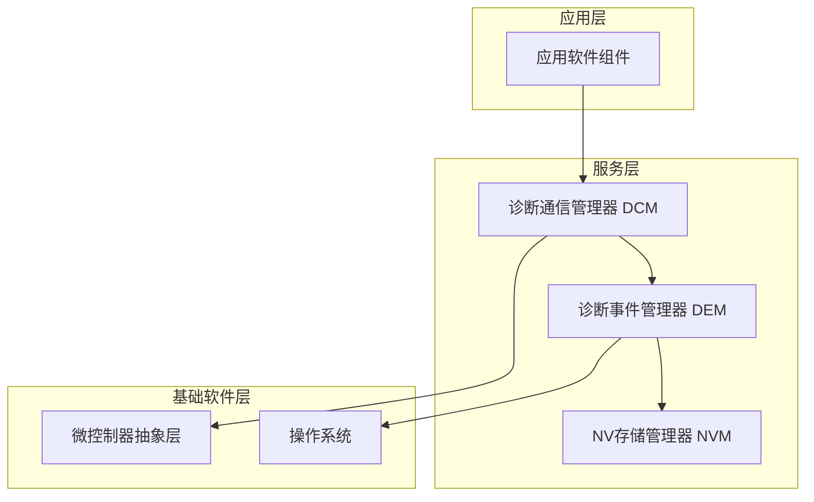
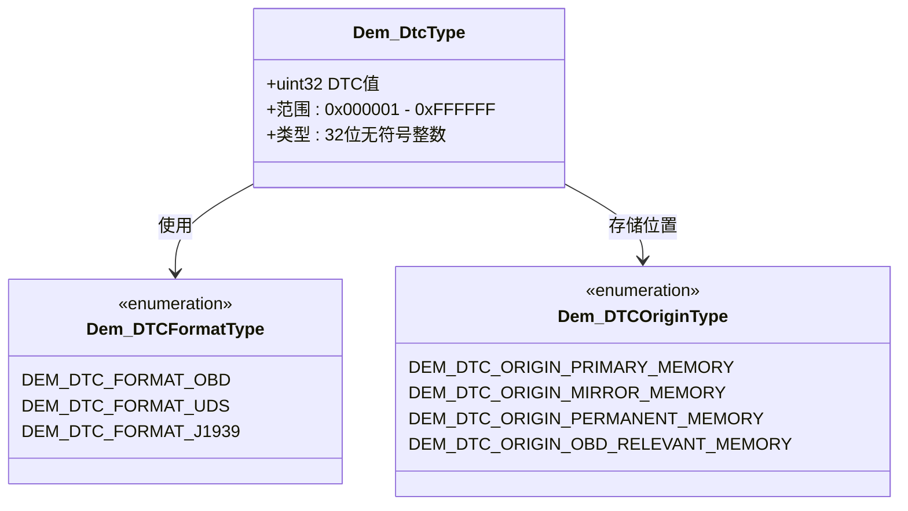
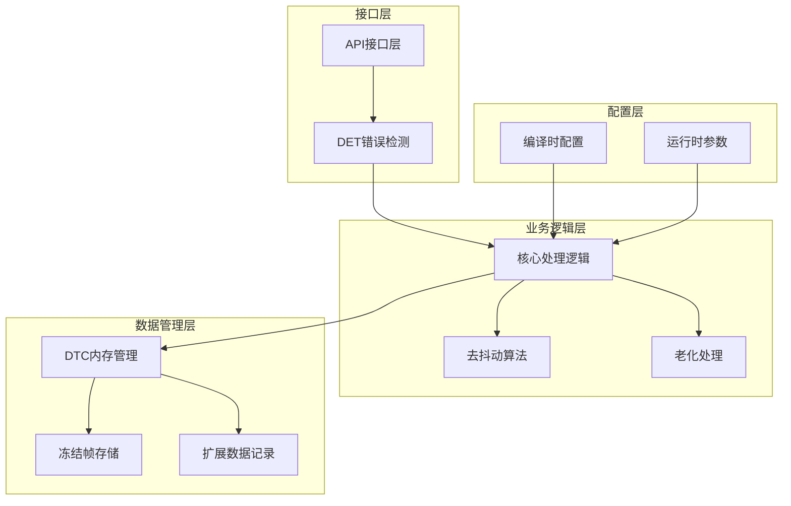
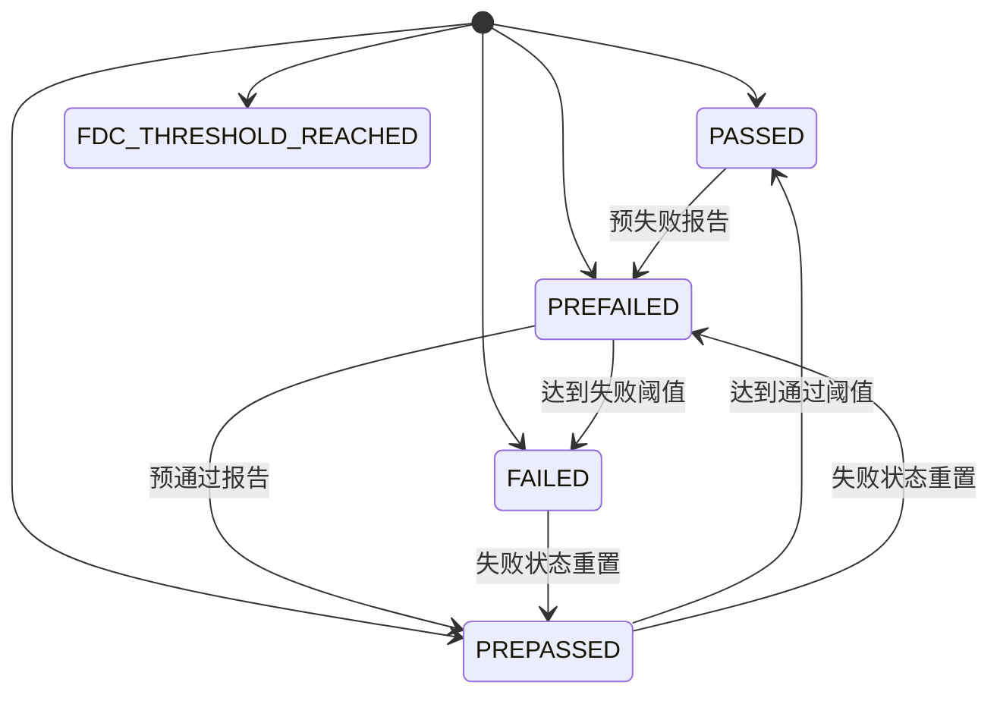
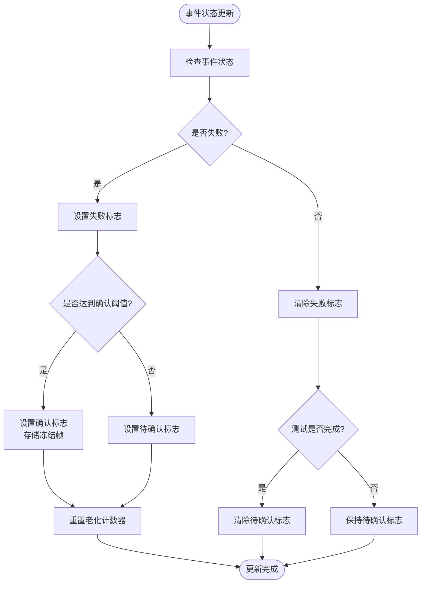
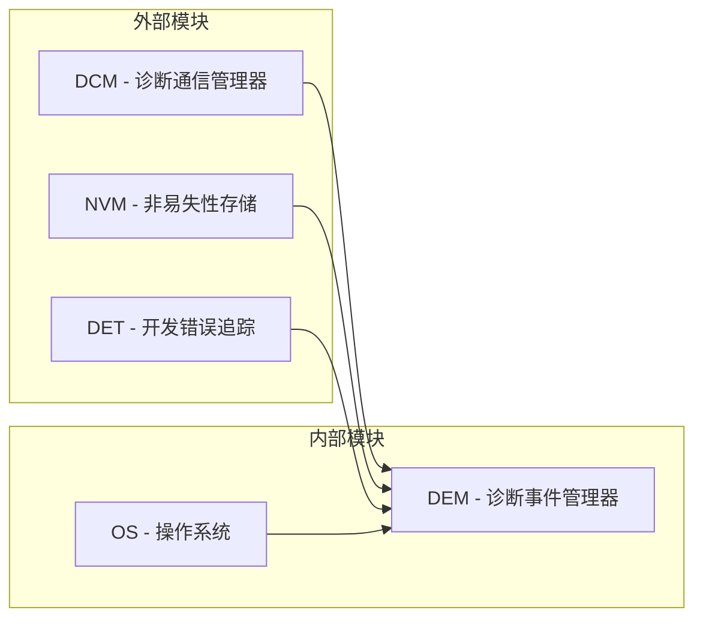
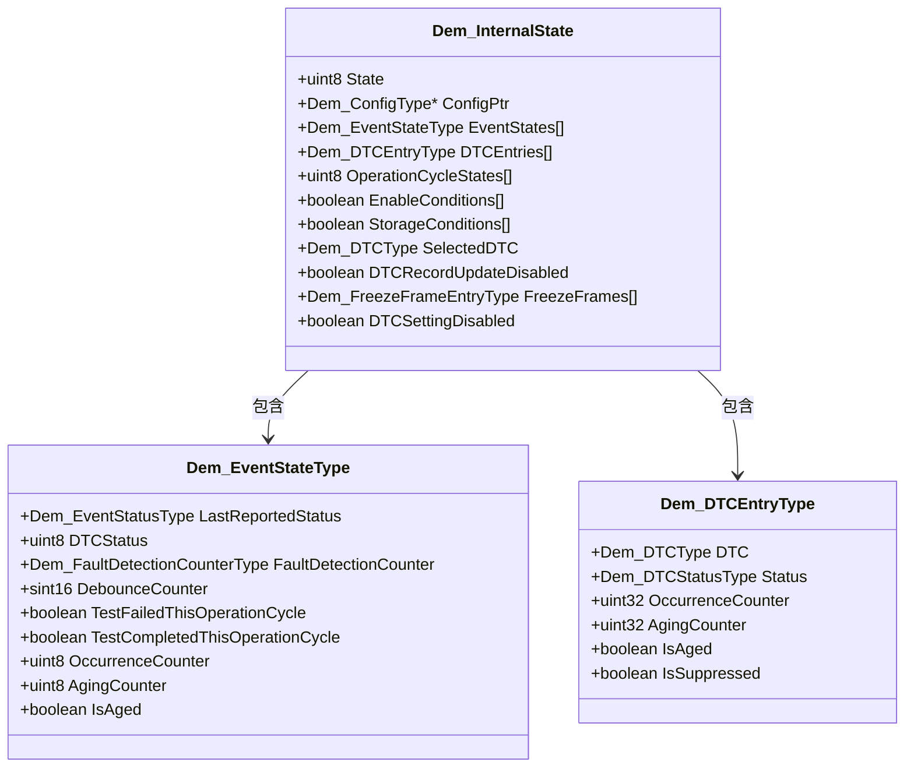

# DTC故障码管理

<cite>
**本文档引用的文件**
- [Dem.h](file://src/bsw/services/dem/include/Dem.h)
- [Dem.c](file://src/bsw/services/dem/src/Dem.c)
- [Dem_Cfg.h](file://src/bsw/services/dem/include/Dem_Cfg.h)
- [Dem_spec.md](file://openspec/changes/dev-dcm-dem-module/specs/Dem_spec.md)
- [Dcm.c](file://src/bsw/services/dcm/src/Dcm.c)
- [Dem_test.c](file://src/bsw/services/dem/src/Dem_test.c)
</cite>

## 目录
1. [简介](#简介)
2. [项目结构](#项目结构)
3. [核心组件](#核心组件)
4. [架构概览](#架构概览)
5. [详细组件分析](#详细组件分析)
6. [依赖关系分析](#依赖关系分析)
7. [性能考虑](#性能考虑)
8. [故障排除指南](#故障排除指南)
9. [结论](#结论)

## 简介

DTC（Diagnostic Trouble Code）故障码管理是汽车电子控制单元（ECU）诊断系统的核心功能模块。本模块基于AUTOSAR经典平台4.x标准，实现了完整的诊断事件管理、故障码存储与检索、冻结帧数据管理和故障记忆操作等功能。

该模块主要负责：
- 诊断事件的状态报告和处理
- DTC的存储、检索和状态管理
- 冻结帧数据的捕获和存储
- 故障记忆的清除和老化处理
- 操作周期的跟踪和管理

## 项目结构

DTC故障码管理功能位于服务层（Service Layer），采用AUTOSAR标准架构：

**图表来源**
- [Dem.h:1-541](file://src/bsw/services/dem/include/Dem.h#L1-L541)
- [Dem.c:1-1145](file://src/bsw/services/dem/src/Dem.c#L1-L1145)

**章节来源**
- [Dem.h:1-541](file://src/bsw/services/dem/include/Dem.h#L1-L541)
- [Dem_Cfg.h:1-158](file://src/bsw/services/dem/include/Dem_Cfg.h#L1-L158)

## 核心组件

### DTC类型定义

DTC在本系统中采用32位无符号整数表示，支持从0x000001到0xFFFFFF的有效范围：

**图表来源**
- [Dem.h:233](file://src/bsw/services/dem/include/Dem.h#L233)
- [Dem.h:152](file://src/bsw/services/dem/include/Dem.h#L152)
- [Dem.h:142](file://src/bsw/services/dem/include/Dem.h#L142)

### DTC状态位掩码机制

DTC状态字节遵循ISO 14229-1标准，包含8个状态位：

| 位编号 | 名称 | 描述 |
|--------|------|------|
| 0 | Test Failed (TF) | 最近一次测试结果失败 |
| 1 | Test Failed This Operation Cycle (TFTOC) | 当前操作周期内测试失败 |
| 2 | Pending DTC (PDTC) | 当前或之前周期测试失败 |
| 3 | Confirmed DTC (CDTC) | 故障已确认（足够次数） |
| 4 | Test Not Completed Since Last Clear (TNCSLC) | 自上次清除以来未完成测试 |
| 5 | Test Failed Since Last Clear (TFSLC) | 自上次清除以来至少失败过一次 |
| 6 | Test Not Completed This Operation Cycle (TNCTOC) | 本操作周期内未完成测试 |
| 7 | Warning Indicator Requested (WIR) | 应该点亮警告灯 |

**章节来源**
- [Dem.h:115](file://src/bsw/services/dem/include/Dem.h#L115)
- [Dem.h:120](file://src/bsw/services/dem/include/Dem.h#L120)

## 架构概览

DTC故障码管理系统采用分层架构设计：

**图表来源**
- [Dem.c:75](file://src/bsw/services/dem/src/Dem.c#L75)
- [Dem_Cfg.h:15](file://src/bsw/services/dem/include/Dem_Cfg.h#L15)

## 详细组件分析

### 事件状态管理

事件状态管理是DTC故障码管理的基础，支持四种状态：

**图表来源**
- [Dem.h:104](file://src/bsw/services/dem/include/Dem.h#L104)

### 去抖动算法实现

系统支持三种去抖动算法：

#### 计数器基础去抖动
- **失败阈值**: 127
- **通过阈值**: -128  
- **增量步长**: 1
- **减量步长**: 1

#### 时间基础去抖动
- **失败超时**: 100毫秒
- **通过超时**: 100毫秒
- **需要周期性处理**

#### 监控内部去抖动
- 直接采用报告模块的状态
- DEM不进行额外去抖处理

**章节来源**
- [Dem_spec.md:190](file://openspec/changes/dev-dcm-dem-module/specs/Dem_spec.md#L190)
- [Dem_Cfg.h:112](file://src/bsw/services/dem/include/Dem_Cfg.h#L112)

### DTC状态更新流程

DTC状态更新遵循严格的逻辑规则：

**图表来源**
- [Dem.c:278](file://src/bsw/services/dem/src/Dem.c#L278)
- [Dem.c:353](file://src/bsw/services/dem/src/Dem.c#L353)

**章节来源**
- [Dem.c:278](file://src/bsw/services/dem/src/Dem.c#L278)
- [Dem.c:353](file://src/bsw/services/dem/src/Dem.c#L353)

### DTC来源类型

系统支持四种DTC存储来源：

| 来源类型 | 编号 | 描述 | 应用场景 |
|----------|------|------|----------|
| 主内存 | 0x01 | 主要故障记忆区域 | 日常故障存储 |
| 镜像内存 | 0x02 | 主内存的备份 | 数据安全保护 |
| 永久内存 | 0x04 | 持久化故障存储 | 长期历史记录 |
| OBD相关内存 | 0x08 | OBD相关故障存储 | OBD诊断需求 |

**章节来源**
- [Dem.h:142](file://src/bsw/services/dem/include/Dem.h#L142)
- [Dem_Cfg.h:140](file://src/bsw/services/dem/include/Dem_Cfg.h#L140)

### DTC格式支持

系统支持三种DTC格式标准：

| 格式类型 | 编号 | 标准 | 特点 |
|----------|------|------|------|
| OBD | 0 | SAE J1939 | 车载诊断协议 |
| UDS | 1 | ISO 14229 | 国际统一诊断标准 |
| J1939 | 2 | SAE J1939 | 协调数据链路标准 |

**章节来源**
- [Dem.h:152](file://src/bsw/services/dem/include/Dem.h#L152)
- [Dem_Cfg.h:21](file://src/bsw/services/dem/include/Dem_Cfg.h#L21)

## 依赖关系分析

### 外部依赖

**图表来源**
- [Dem.c:19](file://src/bsw/services/dem/src/Dem.c#L19)

### 内部依赖关系

**图表来源**
- [Dem.c:75](file://src/bsw/services/dem/src/Dem.c#L75)
- [Dem.c:55](file://src/bsw/services/dem/src/Dem.c#L55)

**章节来源**
- [Dem.c:75](file://src/bsw/services/dem/src/Dem.c#L75)
- [Dem.c:55](file://src/bsw/services/dem/src/Dem.c#L55)

## 性能考虑

### 内存配置

系统采用多级内存架构优化性能：

- **主内存**: 4KB，用于日常故障存储
- **镜像内存**: 2KB，用于数据安全保护  
- **永久内存**: 1KB，用于长期历史记录
- **冻结帧存储**: 256字节 × 8条记录

### 处理效率

- **去抖动处理**: 在事件状态更新时实时计算
- **老化处理**: 在操作周期结束时批量处理
- **内存访问**: 采用索引查找，时间复杂度O(n)

### 并发处理

系统支持多任务环境下的DTC管理，通过以下机制保证数据一致性：
- 模块状态机防止并发访问
- 事件队列避免竞争条件
- 中断安全的数据更新

## 故障排除指南

### 常见错误代码

| 错误代码 | 值 | 描述 | 解决方案 |
|----------|----|------|----------|
| DEM_E_UNINIT | 0x20 | 模块未初始化 | 调用Dem_Init()初始化 |
| DEM_E_PARAM_POINTER | 0x12 | 空指针参数 | 检查传入指针有效性 |
| DEM_E_PARAM_DATA | 0x11 | 无效数据 | 验证EventId和DTC值范围 |
| DEM_E_PARAM_CONFIG | 0x10 | 无效配置 | 检查配置参数完整性 |
| DEM_E_NODATAAVAILABLE | 0x30 | 无可用数据 | 确认数据已正确存储 |
| DEM_E_WRONG_CONDITION | 0x40 | 条件错误 | 检查操作前置条件 |
| DEM_E_WRONG_CONFIGURATION | 0x50 | 配置错误 | 验证系统配置 |

### 调试建议

1. **初始化检查**: 确保Dem_Init()成功执行且返回E_OK
2. **参数验证**: 在调用API前验证所有输入参数
3. **状态监控**: 定期检查DTC状态字节的位变化
4. **内存检查**: 监控各内存区域的使用情况
5. **日志记录**: 启用DET错误报告以便问题诊断

**章节来源**
- [Dem_spec.md:242](file://openspec/changes/dev-dcm-dem-module/specs/Dem_spec.md#L242)
- [Dem_test.c:274](file://src/bsw/services/dem/src/Dem_test.c#L274)

## 结论

DTC故障码管理系统是一个功能完整、架构清晰的诊断管理模块。其特点包括：

**技术优势**：
- 完全符合AUTOSAR标准
- 支持多种DTC格式和来源
- 实现了完整的去抖动和老化处理
- 提供灵活的配置选项

**应用场景**：
- 车辆诊断系统的故障码管理
- OBD-II兼容的诊断功能
- 冻结帧数据的捕获和存储
- 故障记忆的持久化管理

**扩展能力**：
- 易于添加新的DTC格式支持
- 可配置的去抖动算法
- 灵活的内存管理策略
- 完善的错误处理机制

该模块为上层应用提供了可靠、高效的DTC管理服务，是现代汽车电子系统诊断功能的重要组成部分。