# Dem主函数与周期处理

<cite>
**本文档引用的文件**
- [Dem.c](file://src/bsw/services/dem/src/Dem.c)
- [Dem.h](file://src/bsw/services/dem/include/Dem.h)
- [Dem_Cfg.h](file://src/bsw/services/dem/include/Dem_Cfg.h)
- [Os_Cfg.h](file://src/bsw/os/include/Os_Cfg.h)
- [Os_Cfg.c](file://src/bsw/os/src/Os_Cfg.c)
- [Dem_spec.md](file://openspec/changes/dev-dcm-dem-module/specs/Dem_spec.md)
- [Os_Integration_spec.md](file://openspec/changes/dev-os-integration/specs/Os_Integration_spec.md)
- [Dem_test.c](file://src/bsw/services/dem/src/Dem_test.c)
</cite>

## 目录
1. [简介](#简介)
2. [项目结构](#项目结构)
3. [核心组件](#核心组件)
4. [架构概览](#架构概览)
5. [详细组件分析](#详细组件分析)
6. [依赖关系分析](#依赖关系分析)
7. [性能考虑](#性能考虑)
8. [故障排除指南](#故障排除指南)
9. [结论](#结论)

## 简介

Dem（Diagnostic Event Manager）模块是AutoSAR经典平台4.x服务层的重要组成部分，负责诊断事件管理、故障码（DTC）存储、冻结帧数据管理和故障记忆操作。本文档深入分析Dem主函数与周期处理功能，重点解释Dem_MainFunction主函数的实现原理和执行流程，包括事件状态更新、DTC老化处理和周期计数器管理。

## 项目结构

Dem模块位于服务层的诊断管理子系统中，采用标准的AutoSAR分层架构设计：

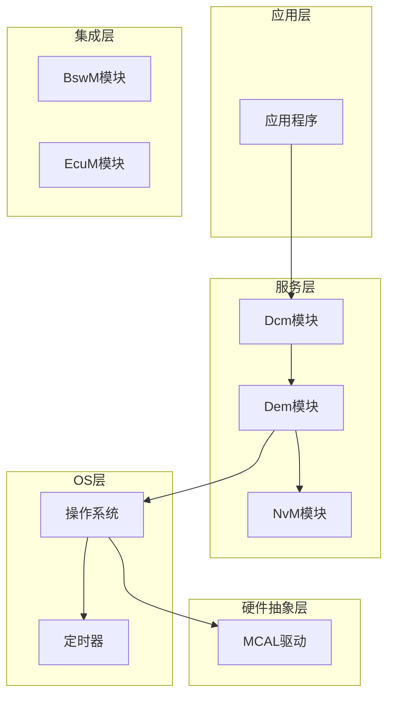

**图表来源**
- [Dem.c:1-50](file://src/bsw/services/dem/src/Dem.c#L1-L50)
- [Dem.h:1-50](file://src/bsw/services/dem/include/Dem.h#L1-L50)

**章节来源**
- [Dem.c:1-1145](file://src/bsw/services/dem/src/Dem.c#L1-L1145)
- [Dem.h:1-541](file://src/bsw/services/dem/include/Dem.h#L1-L541)

## 核心组件

### Dem主函数架构

Dem主函数采用"按需处理"的设计模式，主要处理逻辑集中在操作周期状态变化时触发：

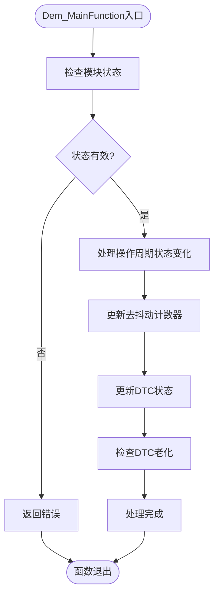

**图表来源**
- [Dem.c:937-940](file://src/bsw/services/dem/src/Dem.c#L937-L940)

### 数据结构设计

Dem模块使用多种关键数据结构来管理诊断信息：

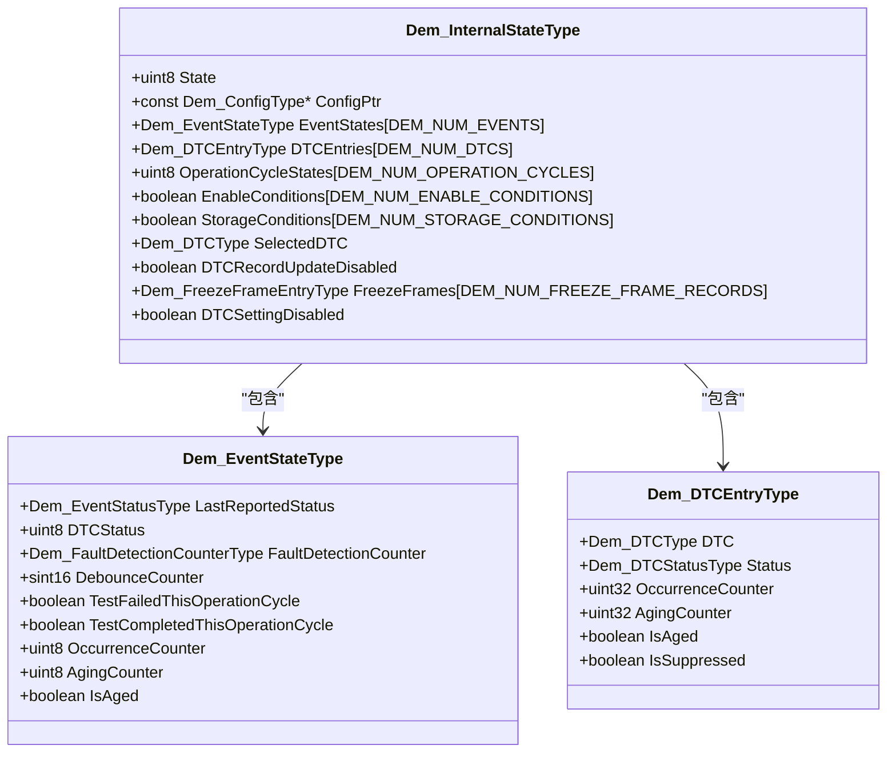

**图表来源**
- [Dem.c:74-88](file://src/bsw/services/dem/src/Dem.c#L74-L88)
- [Dem.c:218-228](file://src/bsw/services/dem/src/Dem.c#L218-L228)
- [Dem.c:54-63](file://src/bsw/services/dem/src/Dem.c#L54-L63)

**章节来源**
- [Dem.c:74-1145](file://src/bsw/services/dem/src/Dem.c#L74-L1145)
- [Dem.h:218-234](file://src/bsw/services/dem/include/Dem.h#L218-L234)

## 架构概览

### 操作系统集成架构

Dem模块通过操作系统定时器实现周期性处理，采用统一的调度框架：

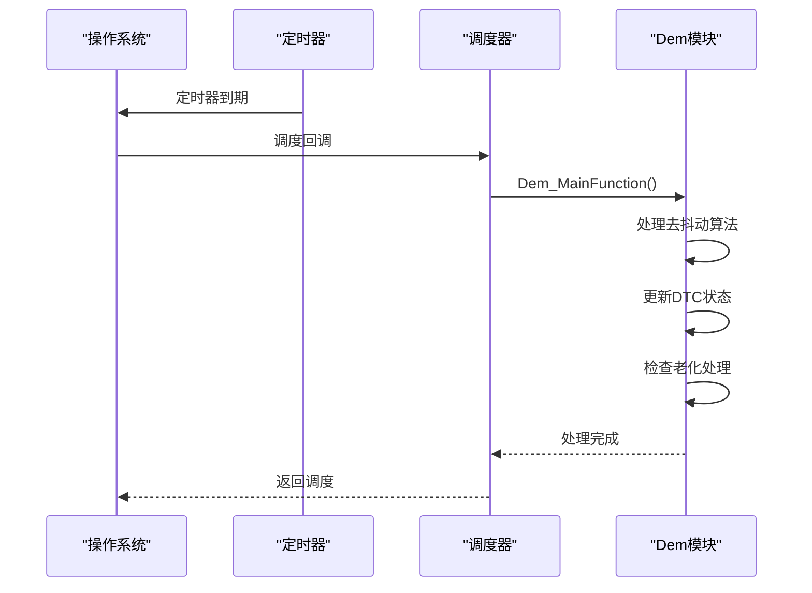

**图表来源**
- [Os_Cfg.c:319-352](file://src/bsw/os/src/Os_Cfg.c#L319-L352)
- [Os_Cfg.h:55-60](file://src/bsw/os/include/Os_Cfg.h#L55-L60)

### 周期处理流程

Dem模块的周期处理遵循严格的时间同步机制：

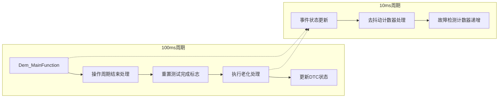

**图表来源**
- [Dem.c:897-910](file://src/bsw/services/dem/src/Dem.c#L897-L910)
- [Dem_spec.md:36-36](file://openspec/changes/dev-dcm-dem-module/specs/Dem_spec.md#L36-L36)

**章节来源**
- [Os_Cfg.c:217-226](file://src/bsw/os/src/Os_Cfg.c#L217-L226)
- [Os_Integration_spec.md:176-183](file://openspec/changes/dev-os-integration/specs/Os_Integration_spec.md#L176-L183)

## 详细组件分析

### Dem_MainFunction实现分析

当前版本的Dem_MainFunction采用了简化的实现方式，主要处理逻辑委托给操作周期状态变化：

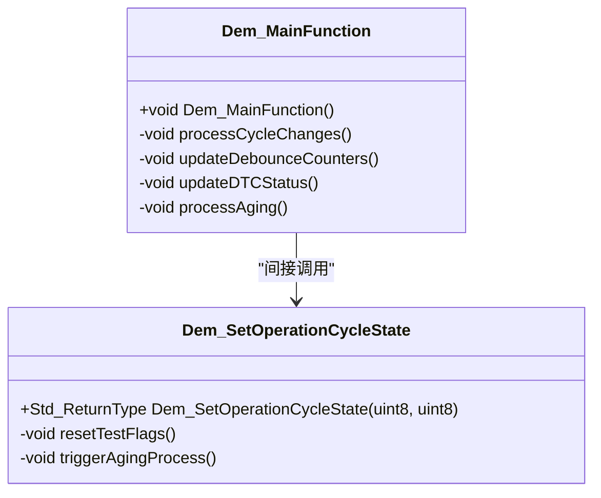

**图表来源**
- [Dem.c:937-940](file://src/bsw/services/dem/src/Dem.c#L937-L940)
- [Dem.c:876-916](file://src/bsw/services/dem/src/Dem.c#L876-L916)

#### 去抖动算法实现

Dem模块支持多种去抖动算法，当前实现基于计数器方法：

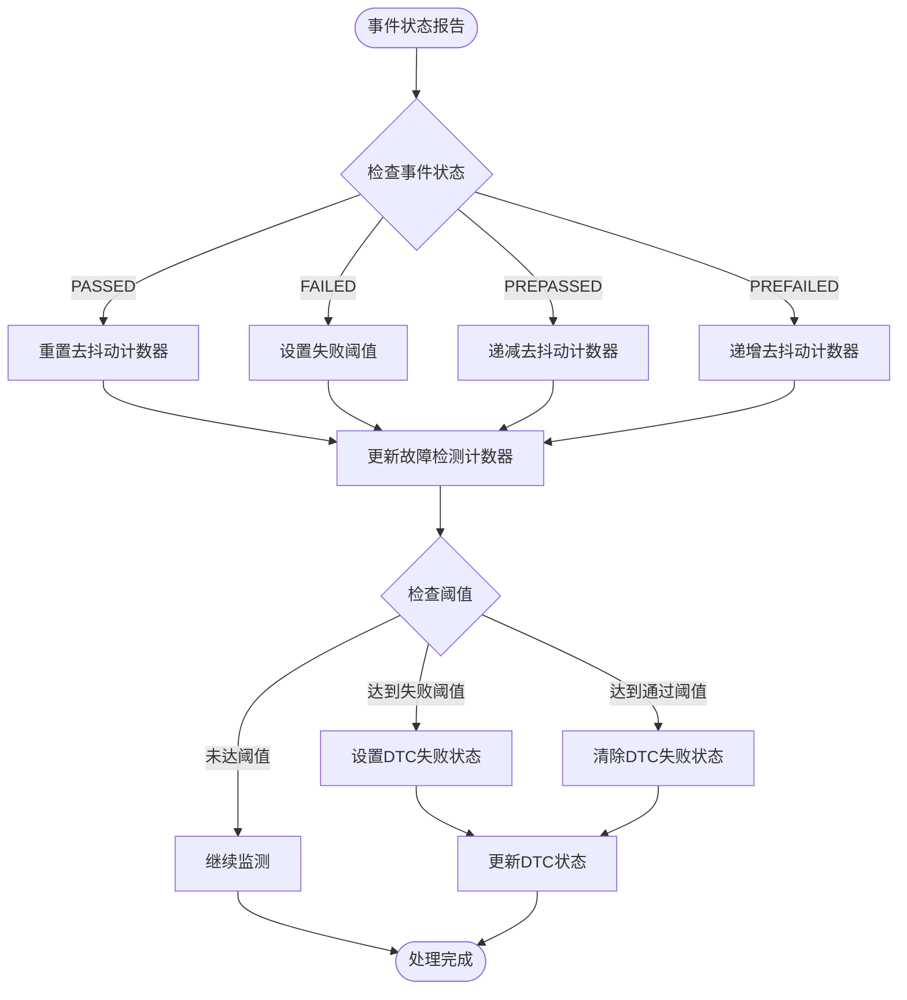

**图表来源**
- [Dem.c:198-248](file://src/bsw/services/dem/src/Dem.c#L198-L248)
- [Dem.c:278-348](file://src/bsw/services/dem/src/Dem.c#L278-L348)

**章节来源**
- [Dem.c:198-348](file://src/bsw/services/dem/src/Dem.c#L198-L348)
- [Dem_spec.md:192-222](file://openspec/changes/dev-dcm-dem-module/specs/Dem_spec.md#L192-L222)

### DTC老化处理机制

DTC老化处理是Dem模块的核心功能之一，确保故障记忆不会无限增长：

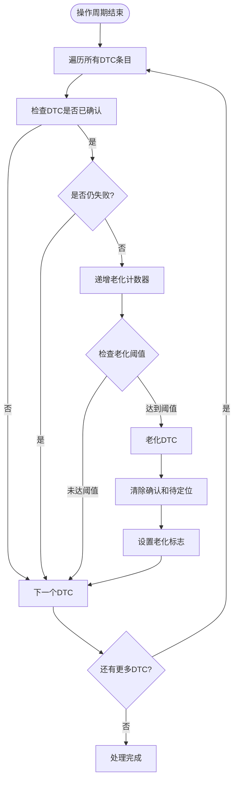

**图表来源**
- [Dem.c:353-381](file://src/bsw/services/dem/src/Dem.c#L353-L381)

#### 老化阈值配置

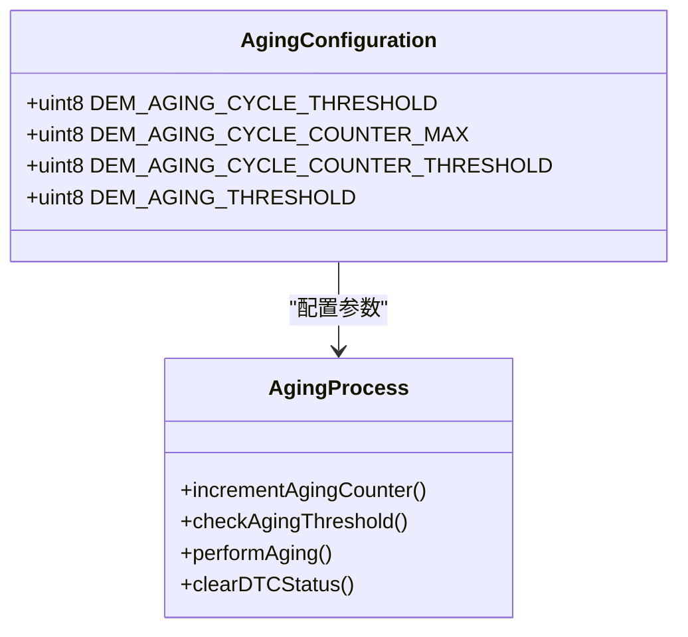

**图表来源**
- [Dem_Cfg.h:89-92](file://src/bsw/services/dem/include/Dem_Cfg.h#L89-L92)

**章节来源**
- [Dem.c:353-381](file://src/bsw/services/dem/src/Dem.c#L353-L381)
- [Dem_Cfg.h:89-92](file://src/bsw/services/dem/include/Dem_Cfg.h#L89-L92)

### 冻结帧数据管理

Dem模块支持冻结帧数据的预存储和管理：

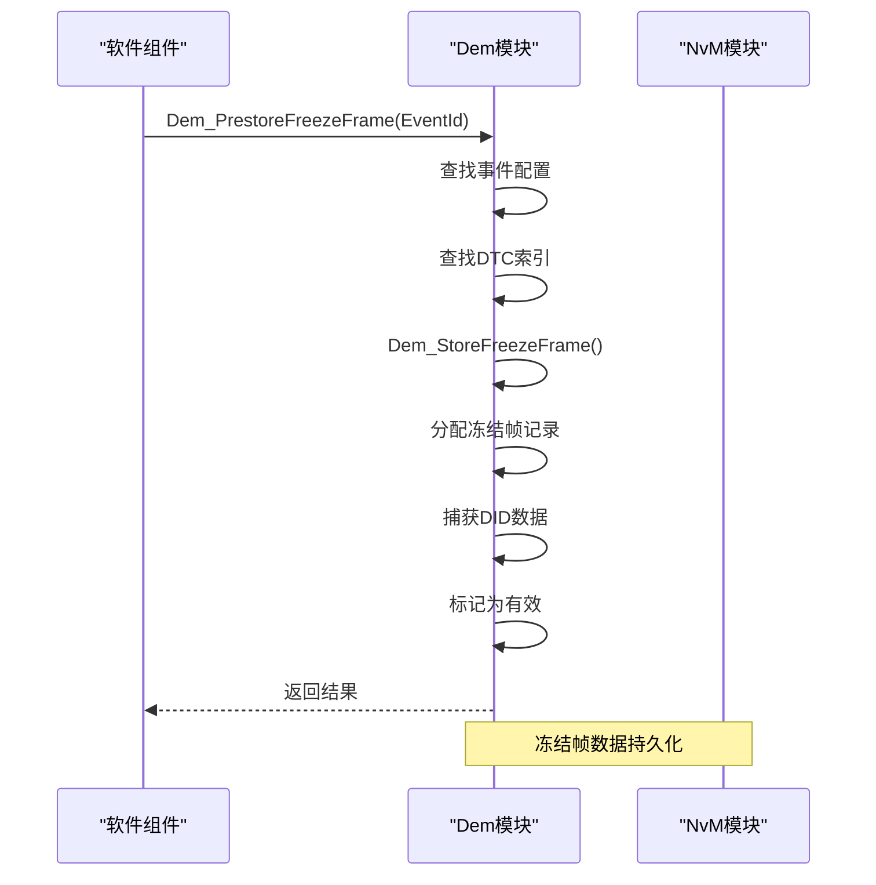

**图表来源**
- [Dem.c:970-1002](file://src/bsw/services/dem/src/Dem.c#L970-L1002)
- [Dem.c:256-276](file://src/bsw/services/dem/src/Dem.c#L256-L276)

**章节来源**
- [Dem.c:970-1039](file://src/bsw/services/dem/src/Dem.c#L970-L1039)

## 依赖关系分析

### 操作系统调度依赖

Dem模块与操作系统紧密集成，通过定时器实现精确的周期控制：

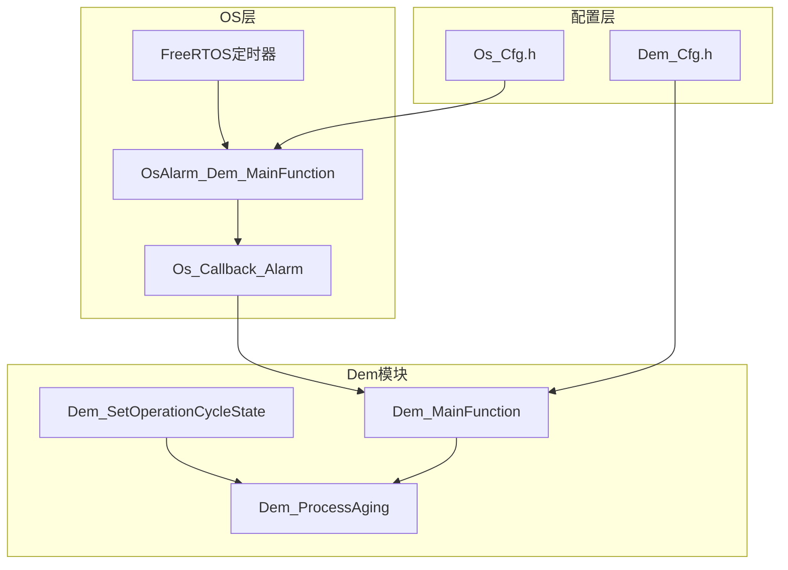

**图表来源**
- [Os_Cfg.c:319-352](file://src/bsw/os/src/Os_Cfg.c#L319-L352)
- [Os_Cfg.h:55-60](file://src/bsw/os/include/Os_Cfg.h#L55-L60)

### 配置参数依赖

Dem模块的性能和行为主要由配置参数决定：

| 配置项 | 默认值 | 描述 | 影响范围 |
|--------|--------|------|----------|
| DEM_MAIN_FUNCTION_PERIOD_MS | 10ms | 主函数周期 | 去抖动响应速度 |
| DEM_AGING_THRESHOLD | 40 | 老化阈值 | 故障记忆保留时间 |
| DEM_DEBOUNCE_COUNTER_FAILED_THRESHOLD | 127 | 失败阈值 | 故障确认灵敏度 |
| DEM_DEBOUNCE_COUNTER_PASSED_THRESHOLD | -128 | 通过阈值 | 故障清除灵敏度 |

**章节来源**
- [Dem_Cfg.h:135-135](file://src/bsw/services/dem/include/Dem_Cfg.h#L135-L135)
- [Dem_Cfg.h:92-92](file://src/bsw/services/dem/include/Dem_Cfg.h#L92-L92)
- [Dem_Cfg.h:112-117](file://src/bsw/services/dem/include/Dem_Cfg.h#L112-L117)

## 性能考虑

### 执行时间优化

Dem模块在100ms周期内完成所有处理，确保实时性要求：

- **去抖动处理**: O(n)复杂度，n为事件数量
- **DTC状态更新**: O(m)复杂度，m为DTC数量  
- **老化处理**: O(m)复杂度，m为DTC数量
- **总复杂度**: O(n+m)，满足100ms周期要求

### 内存使用优化

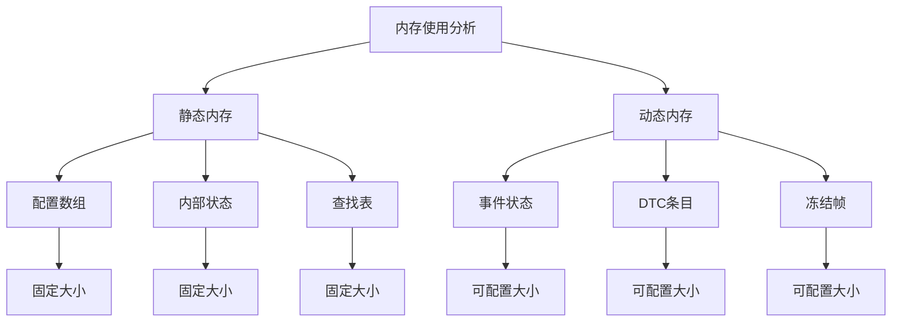

**图表来源**
- [Dem.c:96-96](file://src/bsw/services/dem/src/Dem.c#L96-L96)
- [Dem_Cfg.h:26-27](file://src/bsw/services/dem/include/Dem_Cfg.h#L26-L27)

### 资源消耗策略

1. **内存优化**: 使用静态分配减少碎片化
2. **计算优化**: 缓存查找结果避免重复计算
3. **I/O优化**: 批量处理减少系统调用次数

## 故障排除指南

### 常见问题诊断

#### 1. Dem_MainFunction不执行

**症状**: DTC状态不更新，老化处理不生效

**排查步骤**:
1. 检查操作周期状态是否正确切换
2. 验证定时器配置是否正确
3. 确认调度器回调是否正常

**解决方案**:
- 检查`Dem_SetOperationCycleState`调用
- 验证`OsAlarm_Dem_MainFunction`配置
- 确认`Os_Callback_Alarm`调度逻辑

#### 2. 去抖动算法异常

**症状**: 故障状态频繁切换，无稳定输出

**排查步骤**:
1. 检查去抖动计数器递增值
2. 验证阈值配置是否合理
3. 确认事件报告频率

**解决方案**:
- 调整去抖动阈值
- 实施事件过滤机制
- 优化事件报告频率

#### 3. DTC老化过快或过慢

**症状**: 老化阈值不匹配实际需求

**排查步骤**:
1. 检查老化计数器递增值
2. 验证操作周期配置
3. 确认老化处理触发条件

**解决方案**:
- 调整`DEM_AGING_THRESHOLD`配置
- 优化操作周期定义
- 实施自适应老化算法

### 调试技巧

#### 1. 实时监控

使用以下接口进行实时状态监控：
- `Dem_GetEventStatus()`: 获取事件状态
- `Dem_GetDTCStatus()`: 获取DTC状态
- `Dem_GetFaultDetectionCounter()`: 获取故障检测计数器

#### 2. 日志记录

建议实现以下日志点：
- 每个操作周期开始和结束
- DTC状态变化事件
- 去抖动计数器变化
- 老化处理触发

#### 3. 单元测试

参考现有测试用例结构：

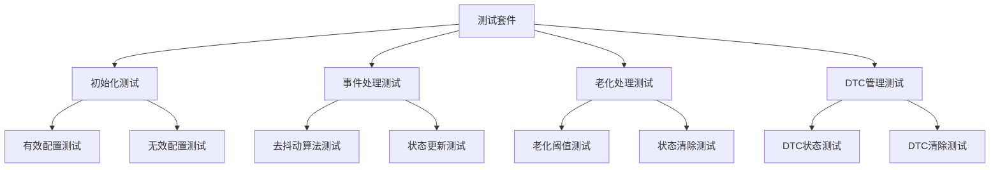

**图表来源**
- [Dem_test.c:88-328](file://src/bsw/services/dem/src/Dem_test.c#L88-L328)

**章节来源**
- [Dem_test.c:88-328](file://src/bsw/services/dem/src/Dem_test.c#L88-L328)

## 结论

Dem主函数与周期处理功能展现了AutoSAR架构中服务层模块的典型设计模式。通过简化的主函数实现和基于操作周期的状态管理，Dem模块实现了高效的诊断事件处理能力。

### 关键特性总结

1. **灵活的去抖动算法**: 支持多种去抖动策略，适应不同应用场景
2. **智能老化管理**: 自动清理长期未发生的故障，保持故障记忆的有效性
3. **精确的周期控制**: 通过操作系统定时器实现严格的实时性保证
4. **可配置的参数**: 支持运行时调整关键参数以适应不同需求

### 最佳实践建议

1. **合理配置周期参数**: 根据应用需求调整去抖动阈值和老化阈值
2. **监控系统健康**: 建立完善的日志和监控机制
3. **测试验证**: 充分的单元测试和集成测试确保系统可靠性
4. **性能优化**: 持续监控执行时间和内存使用情况

Dem模块为整个诊断系统的稳定性提供了坚实基础，其设计体现了AutoSAR标准对可靠性和可维护性的严格要求。