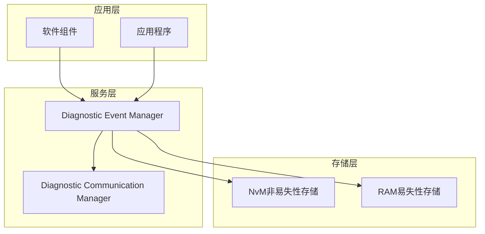
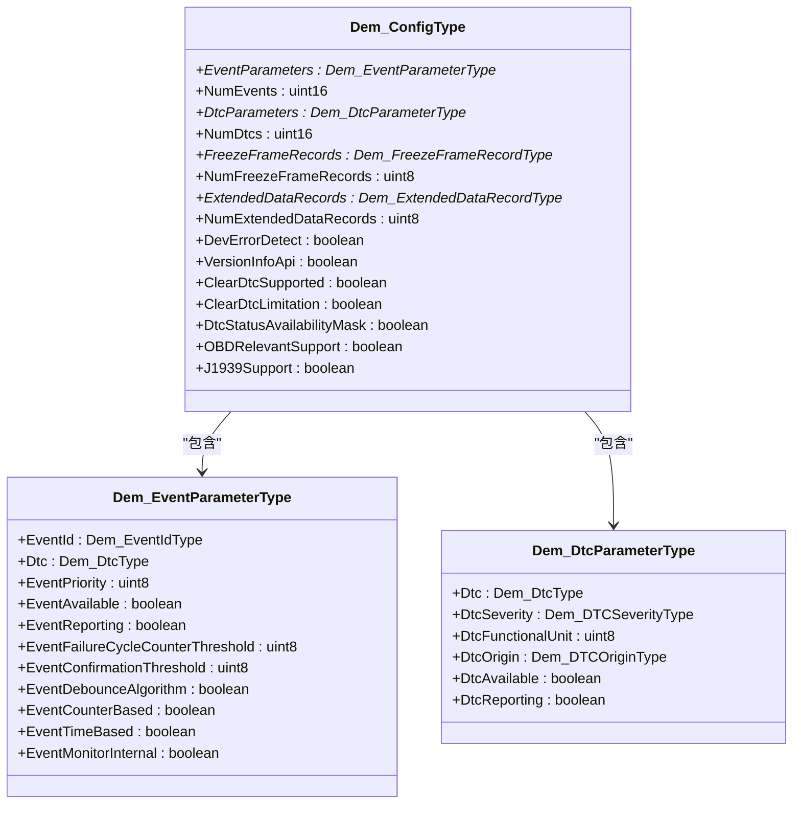
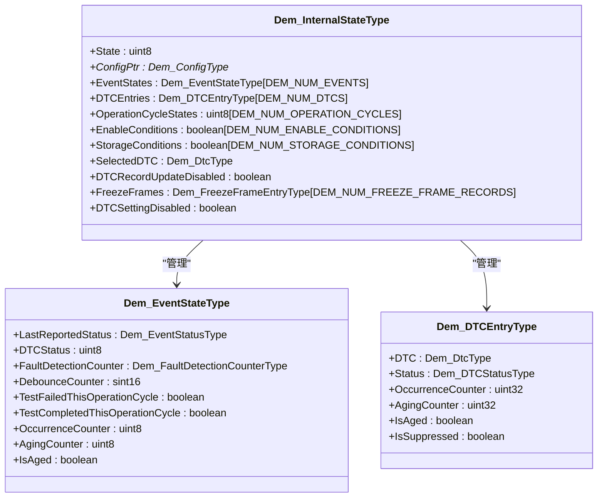
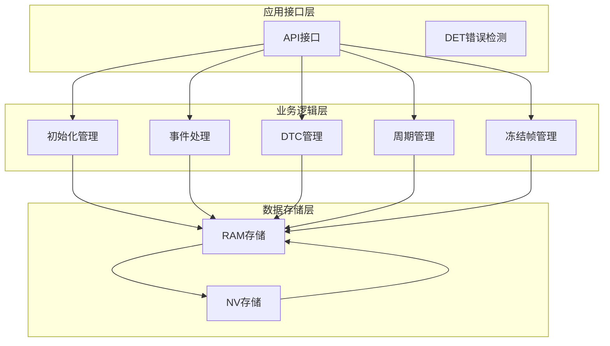
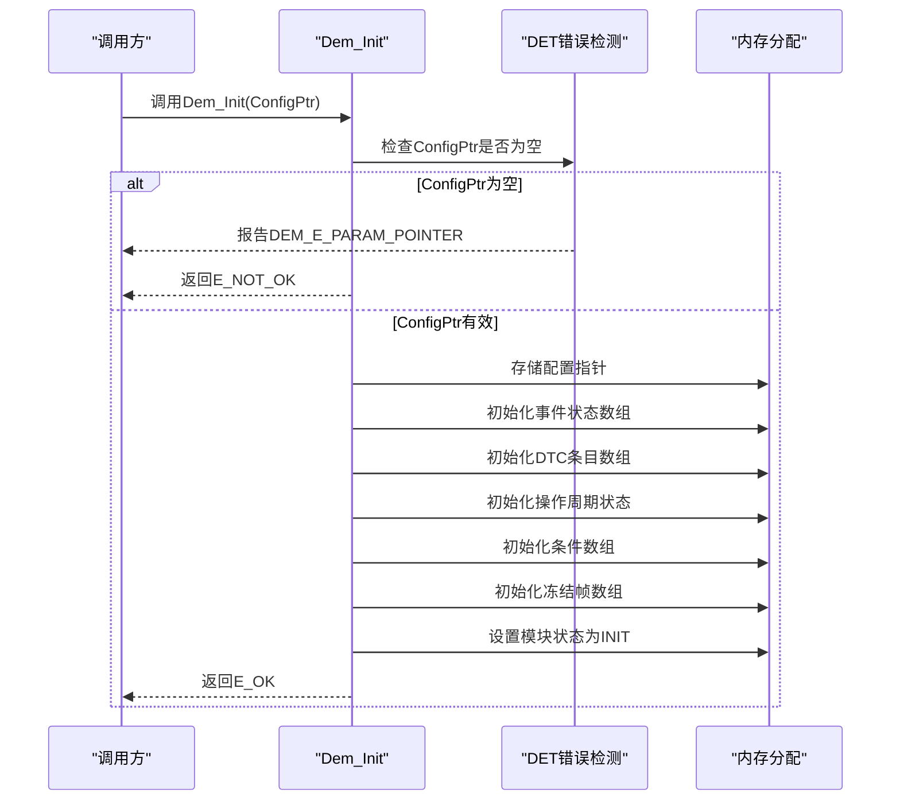
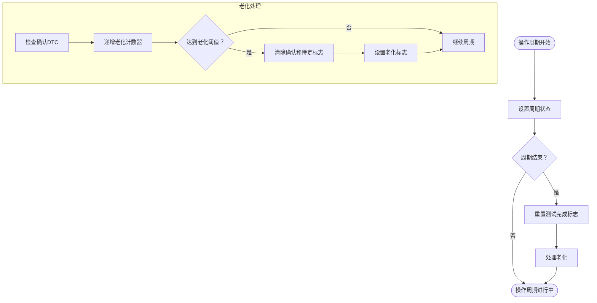
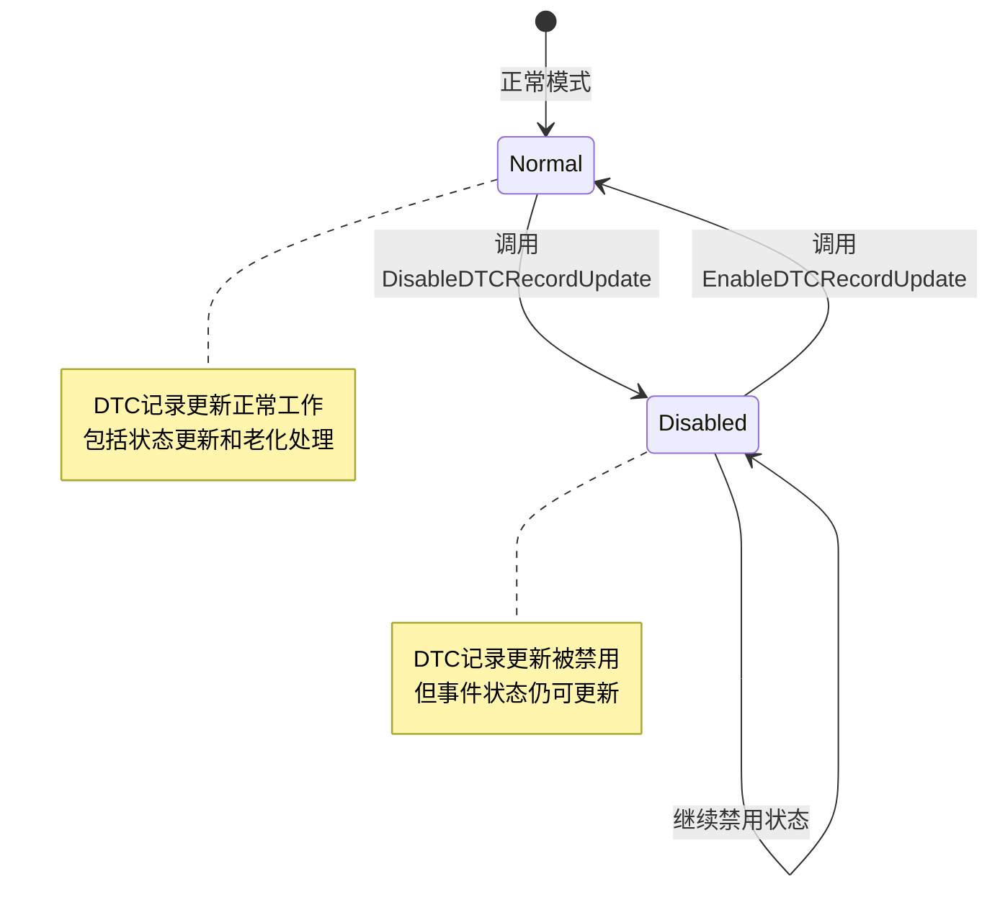
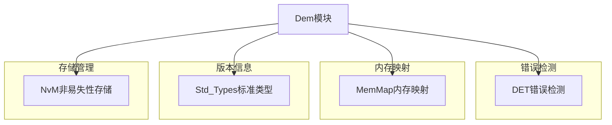
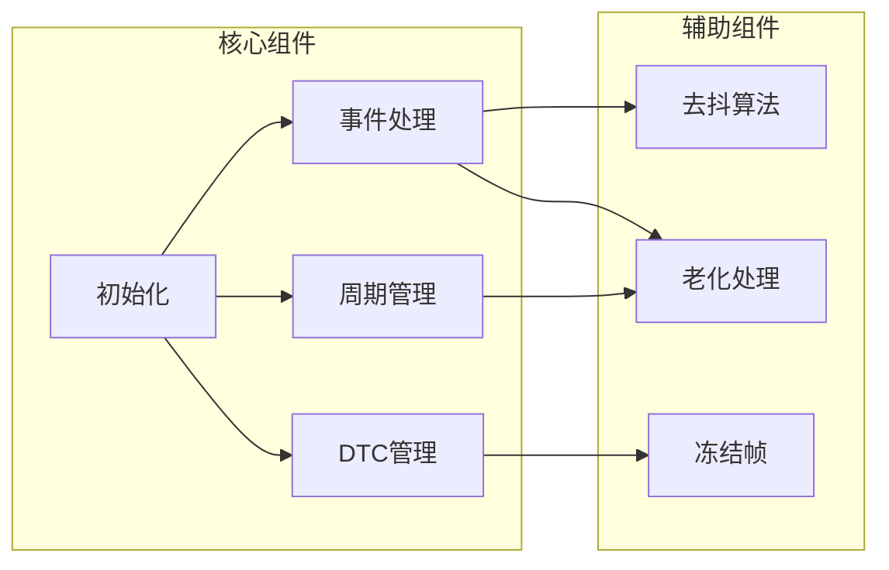
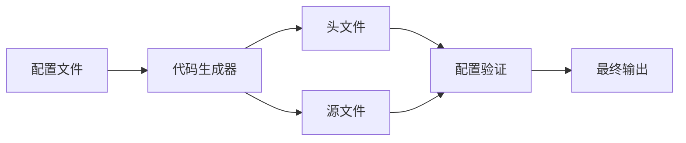

# Dem初始化与配置

<cite>
**本文档引用的文件**
- [Dem.h](file://src/bsw/services/dem/include/Dem.h)
- [Dem_Cfg.h](file://src/bsw/services/dem/include/Dem_Cfg.h)
- [Dem.c](file://src/bsw/services/dem/src/Dem.c)
- [Dem_test.c](file://src/bsw/services/dem/src/Dem_test.c)
- [Dem_spec.md](file://openspec/changes/dev-dcm-dem-module/specs/Dem_spec.md)
- [bsw_config.json](file://config/bsw_config.json)
- [code_generator.py](file://tools/generator/src/code_generator.py)
</cite>

## 目录
1. [简介](#简介)
2. [项目结构](#项目结构)
3. [核心组件](#核心组件)
4. [架构概览](#架构概览)
5. [详细组件分析](#详细组件分析)
6. [依赖关系分析](#依赖关系分析)
7. [性能考虑](#性能考虑)
8. [故障排除指南](#故障排除指南)
9. [结论](#结论)
10. [附录](#附录)

## 简介
本文档深入解析Dem初始化与配置功能，涵盖Dem_Init初始化过程的实现原理、配置参数验证、内存分配和状态初始化。详细说明Dem_ConfigType配置结构体的各个字段含义，包括事件参数、DTC参数、冻结帧记录和扩展数据记录的配置方法。文档化Dem_SetOperationCycleState设置操作周期状态、Dem_RestartOperationCycle重启操作周期的API使用。解释Dem_DisableDTCRecordUpdate禁用DTC记录更新、Dem_EnableDTCRecordUpdate启用DTC记录更新的功能机制。提供配置文件生成、参数校验和初始化流程的最佳实践指南。

## 项目结构
Dem模块位于服务层，遵循AutoSAR Classic Platform 4.x标准，负责诊断事件管理和故障记忆处理。

**图表来源**
- [Dem.h:1-541](file://src/bsw/services/dem/include/Dem.h#L1-L541)
- [Dem_Cfg.h:1-158](file://src/bsw/services/dem/include/Dem_Cfg.h#L1-L158)

**章节来源**
- [Dem.h:1-541](file://src/bsw/services/dem/include/Dem.h#L1-L541)
- [Dem_Cfg.h:1-158](file://src/bsw/services/dem/include/Dem_Cfg.h#L1-L158)

## 核心组件
Dem模块的核心组件包括配置类型、内部状态、事件状态和DTC条目等关键数据结构。

### 配置类型结构
Dem_ConfigType是模块的主要配置结构，定义了完整的诊断管理系统配置：

**图表来源**
- [Dem.h:284-300](file://src/bsw/services/dem/include/Dem.h#L284-L300)
- [Dem.h:238-250](file://src/bsw/services/dem/include/Dem.h#L238-L250)
- [Dem.h:255-262](file://src/bsw/services/dem/include/Dem.h#L255-L262)

### 内部状态管理
Dem模块维护复杂的内部状态，包括事件状态数组、DTC条目、操作周期状态等：

**图表来源**
- [Dem.c:75-88](file://src/bsw/services/dem/src/Dem.c#L75-L88)
- [Dem.h:218-228](file://src/bsw/services/dem/include/Dem.h#L218-L228)
- [Dem.h:55-63](file://src/bsw/services/dem/include/Dem.h#L55-L63)

**章节来源**
- [Dem.h:284-300](file://src/bsw/services/dem/include/Dem.h#L284-L300)
- [Dem.c:75-88](file://src/bsw/services/dem/src/Dem.c#L75-L88)

## 架构概览
Dem模块采用分层架构设计，遵循AutoSAR标准，提供完整的诊断事件管理功能。

**图表来源**
- [Dem.h:319-535](file://src/bsw/services/dem/include/Dem.h#L319-L535)
- [Dem.c:390-471](file://src/bsw/services/dem/src/Dem.c#L390-L471)

## 详细组件分析

### 初始化流程分析
Dem_Init函数实现了完整的初始化过程，包括参数验证、内存分配和状态初始化。

**图表来源**
- [Dem.c:390-471](file://src/bsw/services/dem/src/Dem.c#L390-L471)
- [Dem.h:323](file://src/bsw/services/dem/include/Dem.h#L323)

#### 初始化参数验证
初始化过程包含严格的参数验证机制：

1. **空指针检查**：验证ConfigPtr不为NULL
2. **配置完整性检查**：确保配置结构体完整
3. **边界条件验证**：检查数组边界和索引范围

#### 内存分配策略
模块采用静态内存分配策略，预分配固定大小的缓冲区：

- **事件状态数组**：大小为DEM_NUM_EVENTS × sizeof(Dem_EventStateType)
- **DTC条目数组**：大小为DEM_NUM_DTCS × sizeof(Dem_DTCEntryType)
- **操作周期状态数组**：大小为DEM_NUM_OPERATION_CYCLES × sizeof(uint8)
- **冻结帧数组**：大小为DEM_NUM_FREEZE_FRAME_RECORDS × sizeof(Dem_FreezeFrameEntryType)

#### 状态初始化机制
初始化过程中设置各种状态标志位：

- **测试完成标志**：TestCompletedThisOperationCycle = FALSE
- **老化计数器**：AgingCounter = 0
- **确认标志**：IsAged = FALSE
- **抑制标志**：IsSuppressed = FALSE

**章节来源**
- [Dem.c:390-471](file://src/bsw/services/dem/src/Dem.c#L390-L471)
- [Dem_Cfg.h:26-27](file://src/bsw/services/dem/include/Dem_Cfg.h#L26-L27)

### 配置参数详解

#### 事件参数配置
事件参数定义了单个诊断事件的所有属性：

| 字段名 | 类型 | 描述 | 默认值 |
|--------|------|------|--------|
| EventId | Dem_EventIdType | 事件标识符 | 1-127 |
| Dtc | Dem_DtcType | 关联的DTC码 | 0x000001-0xFFFFFF |
| EventPriority | uint8 | 事件优先级 | 1-255 |
| EventAvailable | boolean | 事件可用性 | TRUE |
| EventReporting | boolean | 事件报告能力 | TRUE |
| EventFailureCycleCounterThreshold | uint8 | 失败计数阈值 | 1 |
| EventConfirmationThreshold | uint8 | 确认阈值 | 2 |
| EventDebounceAlgorithm | boolean | 启用去抖算法 | TRUE |
| EventCounterBased | boolean | 计数器基础去抖 | TRUE |
| EventTimeBased | boolean | 时间基础去抖 | TRUE |
| EventMonitorInternal | boolean | 内部监控去抖 | TRUE |

#### DTC参数配置
DTC参数定义了诊断故障码的属性：

| 字段名 | 类型 | 描述 | 取值范围 |
|--------|------|------|----------|
| Dtc | Dem_DtcType | DTC码 | 0x000001-0xFFFFFF |
| DtcSeverity | Dem_DTCSeverityType | 故障严重程度 | 0-255 |
| DtcFunctionalUnit | uint8 | 功能单元号 | 0-255 |
| DtcOrigin | Dem_DTCOriginType | DTC来源 | PRIMARY/MIRROR/PERMANENT/OBD |
| DtcAvailable | boolean | DTC可用性 | TRUE/FALSE |
| DtcReporting | boolean | DTC报告能力 | TRUE/FALSE |

#### 冻结帧记录配置
冻结帧记录用于存储故障发生时的快照数据：

| 字段名 | 类型 | 描述 | 默认值 |
|--------|------|------|----------|
| RecordNumber | uint8 | 记录编号 | 0-255 |
| NumDids | uint8 | DID数量 | 0-16 |
| DidIds | uint16* | DID标识符数组 | 指向DID数组 |

#### 扩展数据记录配置
扩展数据记录存储额外的诊断信息：

| 字段名 | 类型 | 描述 | 默认值 |
|--------|------|------|----------|
| RecordNumber | uint8 | 记录编号 | 0-255 |
| DataSize | uint16 | 数据大小 | 0-128字节 |

**章节来源**
- [Dem.h:238-250](file://src/bsw/services/dem/include/Dem.h#L238-L250)
- [Dem.h:255-262](file://src/bsw/services/dem/include/Dem.h#L255-L262)
- [Dem.h:267-271](file://src/bsw/services/dem/include/Dem.h#L267-L271)
- [Dem.h:276-279](file://src/bsw/services/dem/include/Dem.h#L276-L279)

### 操作周期管理

#### 操作周期状态API
Dem_SetOperationCycleState和Dem_RestartOperationCycle提供了完整的操作周期管理功能：

**图表来源**
- [Dem.c:876-916](file://src/bsw/services/dem/src/Dem.c#L876-L916)
- [Dem.c:353-381](file://src/bsw/services/dem/src/Dem.c#L353-L381)

#### 操作周期类型定义
模块支持多种操作周期类型：

| 周期类型 | 编号 | 描述 |
|----------|------|------|
| DEM_OPCYC_POWER | 0 | 电源周期 |
| DEM_OPCYC_IGNITION | 1 | 点火周期 |
| DEM_OPCYC_WARMUP | 2 | 预热周期 |
| DEM_OPCYC_OBD_DCY | 3 | OBD驱动周期 |
| DEM_OPCYC_OTHER | 4 | 其他周期 |

**章节来源**
- [Dem.h:166-187](file://src/bsw/services/dem/include/Dem.h#L166-L187)
- [Dem.c:876-916](file://src/bsw/services/dem/src/Dem.c#L876-L916)

### DTC记录更新控制

#### DTC记录更新API
Dem_DisableDTCRecordUpdate和Dem_EnableDTCRecordUpdate提供了灵活的DTC记录控制机制：

**图表来源**
- [Dem.c:834-871](file://src/bsw/services/dem/src/Dem.c#L834-L871)

#### DTC设置控制
Dem_DisableDTCSetting和Dem_EnableDTCSetting提供了更高级别的DTC设置控制：

| 控制级别 | 功能描述 |
|----------|----------|
| DTC记录更新 | 控制DTC状态的持久化更新 |
| DTC设置 | 控制新的DTC条目的创建和设置 |

**章节来源**
- [Dem.c:834-871](file://src/bsw/services/dem/src/Dem.c#L834-L871)
- [Dem.c:1044-1079](file://src/bsw/services/dem/src/Dem.c#L1044-L1079)

## 依赖关系分析

### 外部依赖
Dem模块依赖于多个外部组件和接口：

**图表来源**
- [Dem.c:19-24](file://src/bsw/services/dem/src/Dem.c#L19-L24)

### 内部依赖关系
模块内部各组件之间的依赖关系：

**图表来源**
- [Dem.c:104-111](file://src/bsw/services/dem/src/Dem.c#L104-L111)

**章节来源**
- [Dem.c:19-24](file://src/bsw/services/dem/src/Dem.c#L19-L24)
- [Dem.c:104-111](file://src/bsw/services/dem/src/Dem.c#L104-L111)

## 性能考虑

### 内存使用优化
Dem模块采用静态内存分配策略，具有以下优势：

1. **确定性内存使用**：避免动态内存分配带来的不确定性
2. **实时性能保证**：无内存碎片问题
3. **配置灵活性**：通过配置文件调整内存大小

### 处理效率优化
模块实现了多项性能优化措施：

1. **快速查找算法**：使用线性搜索而非复杂数据结构
2. **批量操作**：支持批量DTC清除操作
3. **条件编译**：通过宏定义控制功能开关

### 实时性保证
模块设计考虑了实时系统的要求：

- **确定性响应时间**：所有API调用都有明确的执行时间
- **中断安全**：关键数据结构访问采用原子操作
- **优先级处理**：支持多任务环境下的优先级调度

## 故障排除指南

### 常见初始化错误
以下是初始化过程中可能遇到的常见错误及其解决方案：

#### 错误代码对照表

| 错误代码 | 描述 | 可能原因 | 解决方案 |
|----------|------|----------|----------|
| DEM_E_PARAM_POINTER | 参数指针无效 | ConfigPtr为NULL | 检查配置指针有效性 |
| DEM_E_UNINIT | 模块未初始化 | 在未初始化状态下调用API | 确保先调用Dem_Init |
| DEM_E_PARAM_DATA | 参数数据无效 | EventId超出范围 | 验证EventId在有效范围内 |
| DEM_E_PARAM_CONFIG | 配置参数无效 | 配置结构体不完整 | 检查配置文件完整性 |

#### 调试建议
1. **启用DET错误检测**：在开发阶段始终启用错误检测
2. **使用单元测试**：运行Dem_test.c中的测试用例
3. **内存检查**：验证所有数组边界访问
4. **状态监控**：定期检查内部状态变量

**章节来源**
- [Dem.h:89-96](file://src/bsw/services/dem/include/Dem.h#L89-L96)
- [Dem_test.c:99-111](file://src/bsw/services/dem/src/Dem_test.c#L99-L111)

### 配置验证最佳实践

#### 配置文件验证
1. **语法检查**：确保JSON格式正确
2. **字段完整性**：验证所有必需字段存在
3. **数值范围检查**：验证配置值在有效范围内
4. **依赖关系检查**：确保相关配置相互兼容

#### 代码生成流程
使用提供的代码生成器工具可以自动化配置文件的生成和验证：

**图表来源**
- [code_generator.py:131-152](file://tools/generator/src/code_generator.py#L131-L152)

**章节来源**
- [code_generator.py:131-152](file://tools/generator/src/code_generator.py#L131-L152)
- [bsw_config.json:1-21](file://config/bsw_config.json#L1-L21)

## 结论
Dem初始化与配置功能提供了完整的诊断事件管理基础设施。通过精心设计的配置结构、严格的参数验证和高效的内存管理，该模块能够满足汽车电子系统对诊断功能的严格要求。模块的架构设计充分考虑了实时性、可靠性和可维护性，为上层应用提供了稳定可靠的诊断服务接口。

关键特性包括：
- 完整的配置参数验证机制
- 高效的内存分配和状态管理
- 灵活的操作周期控制
- 可靠的DTC记录更新控制
- 完善的错误检测和处理

这些特性使得Dem模块能够适应各种复杂的汽车应用场景，为车辆诊断系统提供坚实的技术基础。

## 附录

### API参考
以下是最常用的API函数及其用途：

| API名称 | 功能描述 | 参数类型 | 返回值 |
|---------|----------|----------|--------|
| Dem_Init | 初始化DEM模块 | const Dem_ConfigType* | void |
| Dem_SetEventStatus | 设置事件状态 | Dem_EventIdType, Dem_EventStatusType | Std_ReturnType |
| Dem_GetDTCStatus | 获取DTC状态 | Dem_DtcType, Dem_DTCOriginType, Dem_DTCStatusType* | Std_ReturnType |
| Dem_ClearDTC | 清除DTC | Dem_DtcType, Dem_DTCFormatType, Dem_DTCOriginType | Std_ReturnType |
| Dem_SetOperationCycleState | 设置操作周期状态 | uint8, uint8 | Std_ReturnType |
| Dem_DisableDTCRecordUpdate | 禁用DTC记录更新 | void | Std_ReturnType |
| Dem_EnableDTCRecordUpdate | 启用DTC记录更新 | void | Std_ReturnType |

### 配置最佳实践
1. **合理设置数组大小**：根据实际需求调整DEM_NUM_EVENTS和DEM_NUM_DTCS
2. **启用必要的功能**：仅启用需要的功能以减少内存占用
3. **配置适当的阈值**：根据传感器特性和系统要求设置去抖阈值
4. **定期验证配置**：在发布前进行全面的配置验证测试