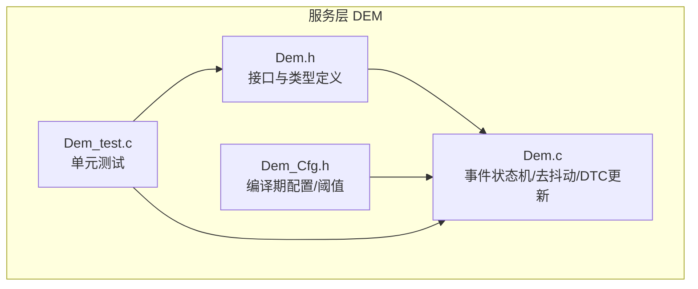
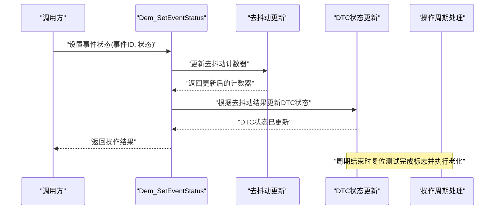
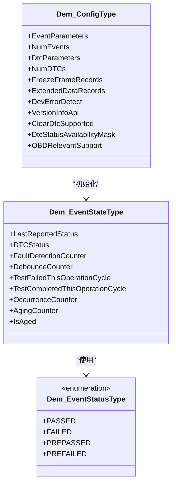
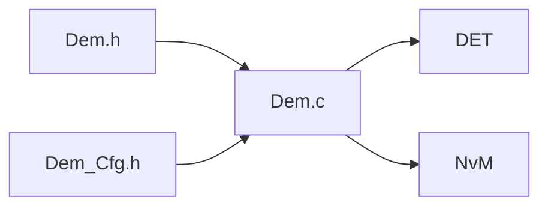
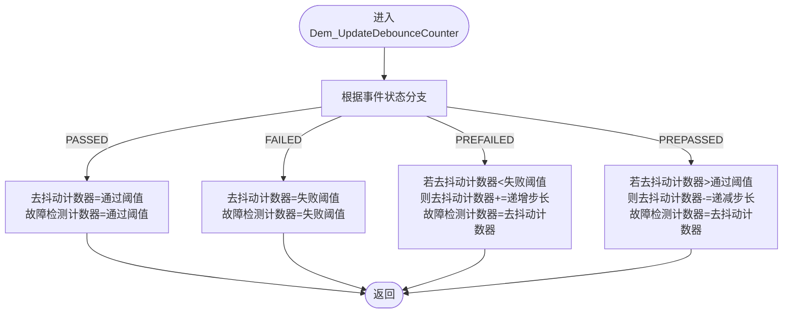
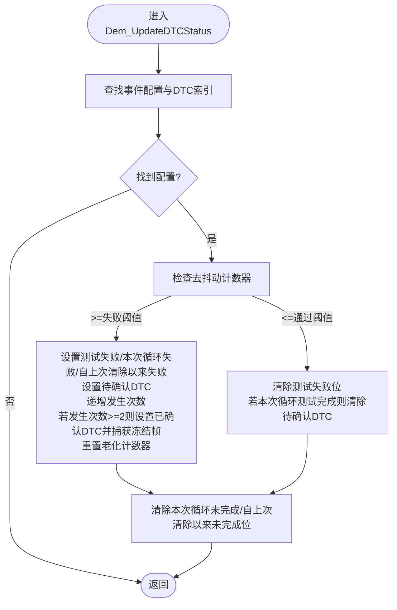

# 事件状态管理

<cite>
**本文引用的文件**
- [Dem.c](file://src/bsw/services/dem/src/Dem.c)
- [Dem.h](file://src/bsw/services/dem/include/Dem.h)
- [Dem_Cfg.h](file://src/bsw/services/dem/include/Dem_Cfg.h)
- [Dem_test.c](file://src/bsw/services/dem/src/Dem_test.c)
</cite>

## 目录
1. [简介](#简介)
2. [项目结构](#项目结构)
3. [核心组件](#核心组件)
4. [架构总览](#架构总览)
5. [详细组件分析](#详细组件分析)
6. [依赖关系分析](#依赖关系分析)
7. [性能考量](#性能考量)
8. [故障排查指南](#故障排查指南)
9. [结论](#结论)
10. [附录](#附录)

## 简介
本文件面向Dem事件状态管理功能，系统性阐述事件状态类型Dem_EventStatusType的四种状态（通过、失败、预通过、预失败）的语义与转换条件；详解Dem_SetEventStatus设置事件状态、Dem_ResetEventStatus重置事件状态的实现机制；文档化事件状态结构体Dem_EventStateType各字段的作用；解释故障检测计数器（FDC）的递增递减逻辑、去抖动算法的实现与事件状态转换的触发条件；并提供事件状态监控、调试与性能优化的实用指南。

## 项目结构
Dem事件状态管理位于服务层（Service Layer），属于AutoSAR Classic Platform 4.x标准下的诊断事件管理模块（DEM）。相关源码与接口定义如下：
- 头文件：Dem.h（对外接口、类型定义、常量）
- 实现：Dem.c（事件状态机、去抖动、DTC状态更新、操作周期处理等）
- 配置：Dem_Cfg.h（编译期配置、阈值、计数器步长等）
- 测试：Dem_test.c（单元测试覆盖状态设置、去抖动算法、DTC确认与清除）

图表来源
- [Dem.h:1-541](file://src/bsw/services/dem/include/Dem.h#L1-L541)
- [Dem.c:1-1145](file://src/bsw/services/dem/src/Dem.c#L1-L1145)
- [Dem_Cfg.h:1-158](file://src/bsw/services/dem/include/Dem_Cfg.h#L1-L158)
- [Dem_test.c:1-328](file://src/bsw/services/dem/src/Dem_test.c#L1-L328)

章节来源
- [Dem.h:1-541](file://src/bsw/services/dem/include/Dem.h#L1-L541)
- [Dem.c:1-1145](file://src/bsw/services/dem/src/Dem.c#L1-L1145)
- [Dem_Cfg.h:1-158](file://src/bsw/services/dem/include/Dem_Cfg.h#L1-L158)
- [Dem_test.c:1-328](file://src/bsw/services/dem/src/Dem_test.c#L1-L328)

## 核心组件
- 事件状态类型Dem_EventStatusType：包含通过（PASSED）、失败（FAILED）、预通过（PREPASSED）、预失败（PREFAILED）等状态枚举。
- 事件状态结构体Dem_EventStateType：记录事件当前状态、DTC状态、故障检测计数器、去抖动计数器、测试完成标志、发生次数、老化计数器等。
- 去抖动算法：基于计数器的递增/递减策略，结合阈值判断是否进入或退出故障状态。
- DTC状态更新：根据去抖动结果更新DTC状态字节，支持“待确认”、“已确认”、“本次循环失败”等位。
- 操作周期处理：在周期结束时复位测试完成标志并执行DTC老化流程。

章节来源
- [Dem.h:104-228](file://src/bsw/services/dem/include/Dem.h#L104-L228)
- [Dem.c:198-348](file://src/bsw/services/dem/src/Dem.c#L198-L348)
- [Dem_Cfg.h:112-131](file://src/bsw/services/dem/include/Dem_Cfg.h#L112-L131)

## 架构总览
事件状态管理的核心流程围绕“状态上报—去抖动—DTC状态更新—周期处理”的闭环展开。Dem_SetEventStatus负责接收外部上报的状态，更新内部去抖动计数器，并驱动DTC状态变化；Dem_ResetEventStatus用于重置去抖动计数器与测试完成标志；Dem_SetOperationCycleState在周期结束时触发测试完成标志复位与老化处理。

图表来源
- [Dem.c:496-535](file://src/bsw/services/dem/src/Dem.c#L496-L535)
- [Dem.c:198-248](file://src/bsw/services/dem/src/Dem.c#L198-L248)
- [Dem.c:278-348](file://src/bsw/services/dem/src/Dem.c#L278-L348)
- [Dem.c:876-916](file://src/bsw/services/dem/src/Dem.c#L876-L916)

## 详细组件分析

### 事件状态类型与含义
- 通过（PASSED）：表示事件检测结果为正常，去抖动计数器被重置到“通过阈值”，故障检测计数器同步更新。
- 失败（FAILED）：表示事件检测结果为异常，去抖动计数器被重置到“失败阈值”，故障检测计数器同步更新。
- 预通过（PREPASSED）：表示事件趋向于恢复正常，去抖动计数器按步长递减，故障检测计数器同步更新。
- 预失败（PREFAILED）：表示事件趋向于故障，去抖动计数器按步长递增，故障检测计数器同步更新。

章节来源
- [Dem.h:104-110](file://src/bsw/services/dem/include/Dem.h#L104-L110)
- [Dem.c:210-244](file://src/bsw/services/dem/src/Dem.c#L210-L244)

### 事件状态结构体Dem_EventStateType字段说明
- LastReportedStatus：最近一次上报的事件状态。
- DTCStatus：DTC状态字节，包含测试失败、待确认、本次循环失败等位。
- FaultDetectionCounter：故障检测计数器，与去抖动计数器保持一致。
- DebounceCounter：去抖动计数器，作为状态转换的量化依据。
- TestFailedThisOperationCycle：本次操作周期内是否发生过故障。
- TestCompletedThisOperationCycle：本次操作周期内是否已完成测试。
- OccurrenceCounter：故障发生次数，用于确认DTC。
- AgingCounter：老化计数器，用于确认DTC的自动清除。
- IsAged：标记DTC是否已老化。

章节来源
- [Dem.h:218-228](file://src/bsw/services/dem/include/Dem.h#L218-L228)
- [Dem.c:408-417](file://src/bsw/services/dem/src/Dem.c#L408-L417)

### 去抖动算法与故障检测计数器逻辑
- 计数器类型：去抖动计数器与故障检测计数器均为有符号整型，分别使用sint16与sint8，范围由配置决定。
- 阈值配置：失败阈值与通过阈值由配置项定义，递增/递减步长同样可配置。
- 状态转换规则：
  - 设置为通过（PASSED）：去抖动计数器与故障检测计数器重置为“通过阈值”。
  - 设置为失败（FAILED）：去抖动计数器与故障检测计数器重置为“失败阈值”。
  - 设置为预失败（PREFAILED）：若未达到失败阈值，则按步长递增；故障检测计数器同步更新。
  - 设置为预通过（PREPASSED）：若超过通过阈值，则按步长递减；故障检测计数器同步更新。
- 转换触发条件：当去抖动计数器达到或超过失败阈值时，判定为故障；当去抖动计数器低于或等于通过阈值时，判定为正常。

章节来源
- [Dem.c:198-248](file://src/bsw/services/dem/src/Dem.c#L198-L248)
- [Dem_Cfg.h:112-117](file://src/bsw/services/dem/include/Dem_Cfg.h#L112-L117)

### DTC状态更新与确认流程
- 当去抖动计数器≥失败阈值时：
  - 设置“测试失败”、“本次循环失败”、“自上次清除以来失败”、“待确认DTC”。
  - 故障发生次数递增，达到一定次数后设置“已确认DTC”，并捕获冻结帧数据。
  - 重置老化计数器并标记未老化。
- 当去抖动计数器≤通过阈值时：
  - 清除“测试失败”位；若本次循环已完成测试，则清除“待确认DTC”。
  - 清除“本次循环未完成”和“自上次清除以来未完成”位。
- 老化处理：在操作周期结束时，对已确认且当前未故障的DTC进行老化计数，达到阈值后清除“已确认DTC”和“待确认DTC”。

章节来源
- [Dem.c:278-348](file://src/bsw/services/dem/src/Dem.c#L278-L348)
- [Dem.c:353-381](file://src/bsw/services/dem/src/Dem.c#L353-L381)

### Dem_SetEventStatus实现机制
- 参数校验：检查模块初始化状态与事件ID有效性。
- 更新最近上报状态：将事件状态写入事件状态表。
- 去抖动更新：调用去抖动更新函数，按状态类型调整计数器。
- 标记测试完成：将“本次循环测试完成”标志置位。
- DTC状态更新：根据去抖动结果更新对应DTC状态。
- 返回E_OK表示成功。

章节来源
- [Dem.c:496-535](file://src/bsw/services/dem/src/Dem.c#L496-L535)

### Dem_ResetEventStatus实现机制
- 参数校验：检查模块初始化状态与事件ID有效性。
- 重置去抖动计数器：将去抖动计数器与故障检测计数器重置为“通过阈值”。
- 复位测试完成标志：将“本次循环测试完成”标志清零。
- 返回E_OK表示成功。

章节来源
- [Dem.c:540-573](file://src/bsw/services/dem/src/Dem.c#L540-L573)

### 操作周期处理与老化
- 周期结束处理：当某操作周期从开始切换到结束时，复位所有事件的“测试完成”标志，并触发老化处理。
- 老化逻辑：对已确认且当前未故障的DTC，老化计数器递增；达到阈值后清除“已确认DTC”和“待确认DTC”。

章节来源
- [Dem.c:876-916](file://src/bsw/services/dem/src/Dem.c#L876-L916)
- [Dem.c:353-381](file://src/bsw/services/dem/src/Dem.c#L353-L381)

### 类图：事件状态与去抖动关系

图表来源
- [Dem.h:218-228](file://src/bsw/services/dem/include/Dem.h#L218-L228)
- [Dem.h:104-110](file://src/bsw/services/dem/include/Dem.h#L104-L110)
- [Dem.h:284-300](file://src/bsw/services/dem/include/Dem.h#L284-L300)

## 依赖关系分析
- 内部依赖：
  - Dem.c依赖Dem.h与Dem_Cfg.h提供的类型、常量与配置。
  - Dem.c内部维护Dem_InternalState全局状态，包含事件状态数组、DTC条目、冻结帧等。
- 外部依赖：
  - DET（Development Error Tracing）：在启用错误检测时，对非法输入进行错误上报。
  - NvM：用于持久化存储（在Dem_ClearDTC等场景中可能涉及）。
- 关键耦合点：
  - 去抖动计数器与故障检测计数器同步更新，确保状态判断一致性。
  - DTC状态更新依赖去抖动计数器阈值，同时受操作周期标志影响。

图表来源
- [Dem.c:19-24](file://src/bsw/services/dem/src/Dem.c#L19-L24)
- [Dem.h:20-21](file://src/bsw/services/dem/include/Dem.h#L20-L21)

章节来源
- [Dem.c:19-24](file://src/bsw/services/dem/src/Dem.c#L19-L24)
- [Dem.h:20-21](file://src/bsw/services/dem/include/Dem.h#L20-L21)

## 性能考量
- 去抖动计数器更新复杂度：O(1)，每次状态上报仅进行常数次算术运算与位操作。
- DTC状态更新复杂度：O(1)，按事件数量线性处理，但通常只针对受影响的事件。
- 操作周期处理复杂度：O(N_events)，在周期结束时复位测试完成标志并触发老化。
- 内存占用：事件状态数组大小为事件数量×事件状态结构体大小；DTC条目数组大小为DTC数量×DTC条目大小；冻结帧数组大小为冻结帧记录数×最大冻结帧大小。
- 优化建议：
  - 合理设置去抖动阈值与步长，避免频繁跨越阈值导致状态抖动。
  - 在高频状态上报场景下，尽量合并状态更新，减少重复计算。
  - 老化处理可在周期结束统一执行，避免在主循环中重复扫描。

[本节为通用性能讨论，不直接分析具体文件]

## 故障排查指南
- 常见问题与定位方法：
  - 状态未按预期转换：检查去抖动阈值与步长配置是否合理；确认Dem_SetEventStatus调用频率与状态序列是否符合预期。
  - DTC未确认：确认故障发生次数是否达到确认阈值；检查Dem_SetEventStatus是否多次调用以累积计数。
  - DTC未清除：确认Dem_ClearDTC调用参数与目标DTC是否正确；检查DTC状态字节中相关位是否清零。
  - 周期处理无效：确认操作周期状态切换是否正确触发；检查Dem_SetOperationCycleState调用时机。
- 调试技巧：
  - 使用Dem_GetFaultDetectionCounter获取当前FDC值，观察其递增/递减趋势。
  - 使用Dem_GetEventFailed与Dem_GetEventTested验证故障与测试完成标志。
  - 使用Dem_GetDTCStatus获取DTC状态字节，逐位核对状态位。
- 单元测试参考：
  - 测试用例覆盖了状态设置、去抖动算法、DTC确认与清除、未初始化错误等关键路径，可作为回归测试与集成测试的参考。

章节来源
- [Dem_test.c:114-151](file://src/bsw/services/dem/src/Dem_test.c#L114-L151)
- [Dem_test.c:155-185](file://src/bsw/services/dem/src/Dem_test.c#L155-L185)
- [Dem_test.c:189-214](file://src/bsw/services/dem/src/Dem_test.c#L189-L214)
- [Dem_test.c:217-243](file://src/bsw/services/dem/src/Dem_test.c#L217-L243)
- [Dem_test.c:246-272](file://src/bsw/services/dem/src/Dem_test.c#L246-L272)
- [Dem_test.c:275-289](file://src/bsw/services/dem/src/Dem_test.c#L275-L289)

## 结论
Dem事件状态管理通过清晰的状态枚举、严格的去抖动算法与完善的DTC状态更新机制，实现了对故障事件的可靠监测与记录。配合操作周期处理与老化流程，能够有效区分瞬时干扰与持续故障，并在合适时机清理历史状态。通过合理的配置与调试手段，可进一步提升系统的稳定性与可维护性。

[本节为总结性内容，不直接分析具体文件]

## 附录

### 状态转换流程图（去抖动算法）

图表来源
- [Dem.c:198-248](file://src/bsw/services/dem/src/Dem.c#L198-L248)
- [Dem_Cfg.h:112-117](file://src/bsw/services/dem/include/Dem_Cfg.h#L112-L117)

### DTC状态更新流程图

图表来源
- [Dem.c:278-348](file://src/bsw/services/dem/src/Dem.c#L278-L348)