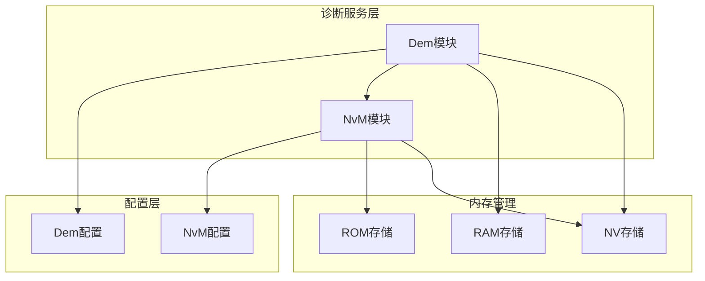
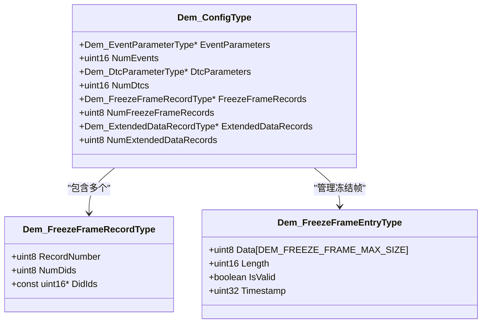
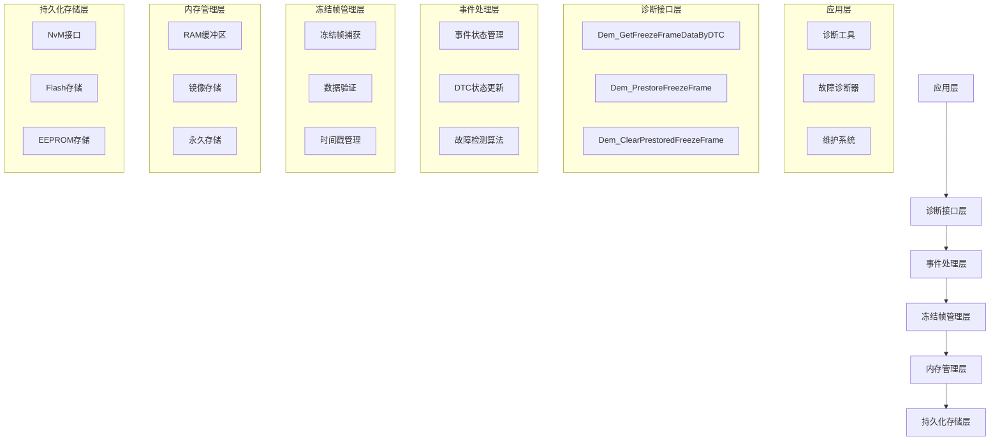
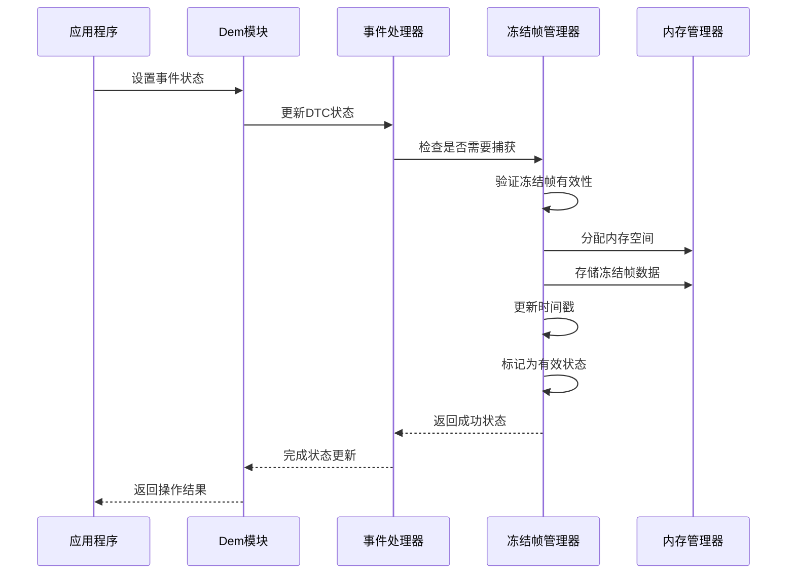
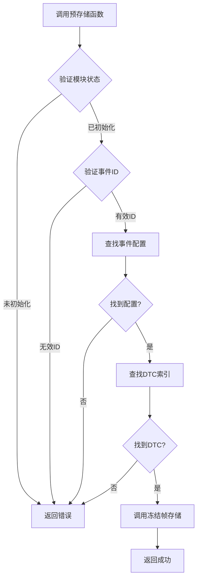
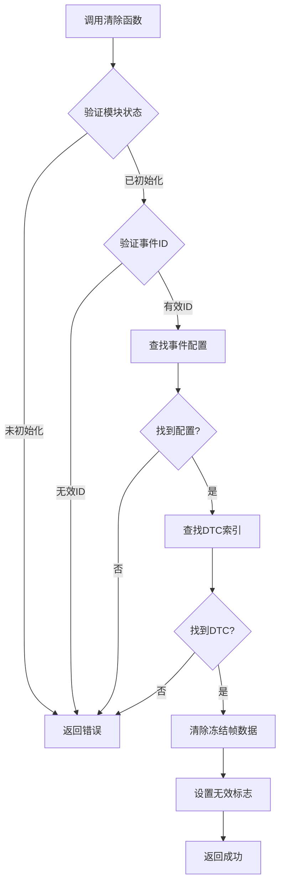
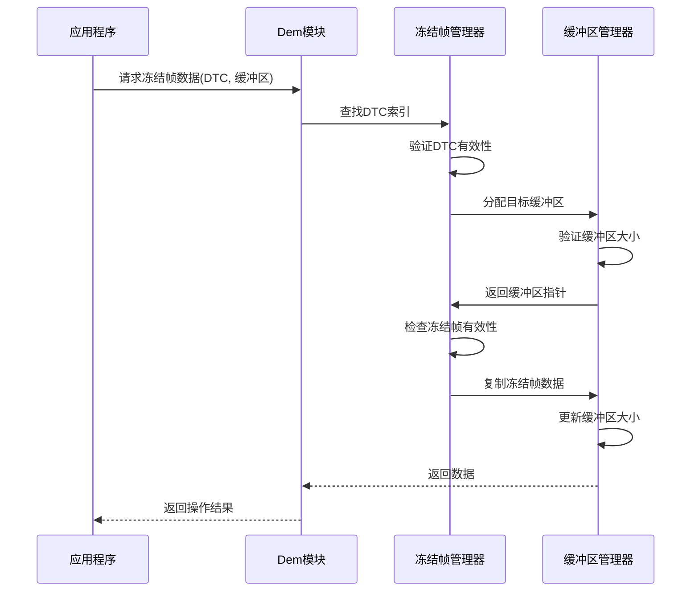
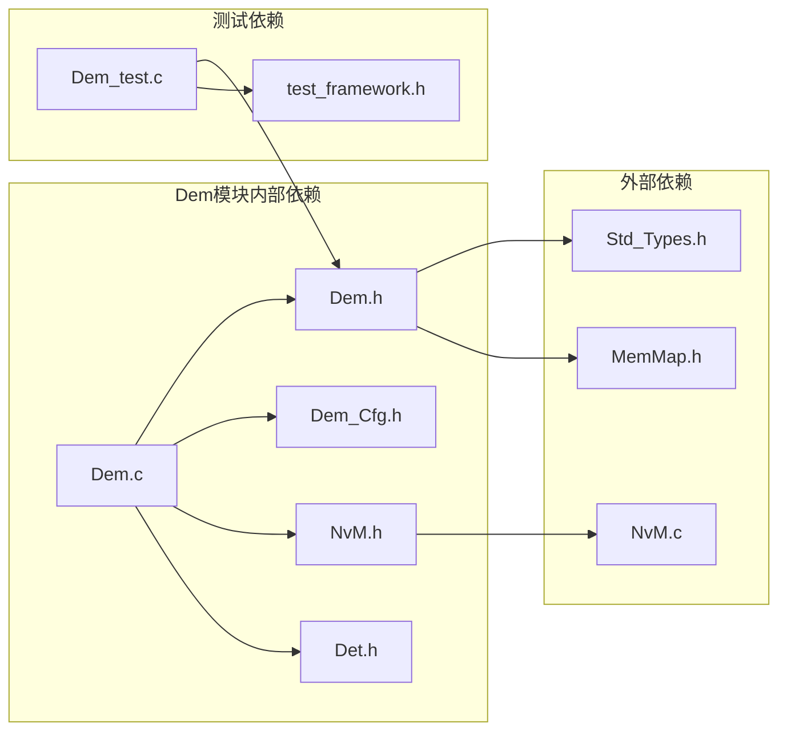
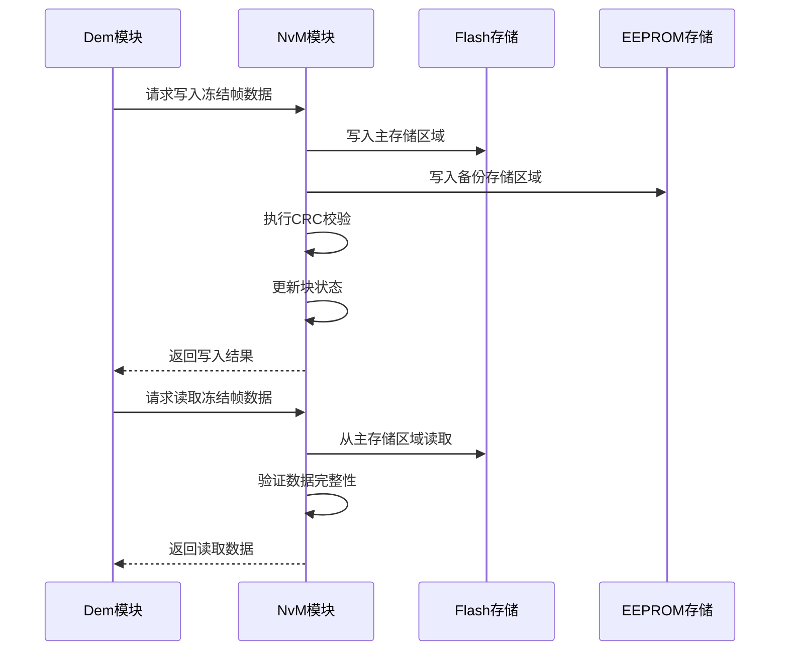

# 冻结帧数据管理

<cite>
**本文档引用的文件**
- [Dem.h](file://src/bsw/services/dem/include/Dem.h)
- [Dem.c](file://src/bsw/services/dem/src/Dem.c)
- [Dem_Cfg.h](file://src/bsw/services/dem/include/Dem_Cfg.h)
- [NvM.h](file://src/bsw/services/nvm/include/NvM.h)
- [NvM.c](file://src/bsw/services/nvm/src/NvM.c)
- [Dem_test.c](file://src/bsw/services/dem/src/Dem_test.c)
</cite>

## 目录
1. [简介](#简介)
2. [项目结构](#项目结构)
3. [核心组件](#核心组件)
4. [架构概览](#架构概览)
5. [详细组件分析](#详细组件分析)
6. [依赖关系分析](#依赖关系分析)
7. [性能考虑](#性能考虑)
8. [故障排除指南](#故障排除指南)
9. [结论](#结论)

## 简介

Dem冻结帧数据管理功能是汽车电子系统中诊断模块的重要组成部分，负责在故障发生时自动捕获和存储关键的运行状态数据。该功能基于AUTOSAR标准实现，提供了完整的冻结帧生命周期管理，包括数据捕获、存储、检索和清理等核心操作。

冻结帧数据在车辆诊断中具有重要意义，它能够记录故障发生瞬间的系统状态，为故障分析和维修提供宝贵的信息。通过预存储机制，系统可以在故障发生前就准备好冻结帧数据，确保关键信息不会丢失。

## 项目结构

Dem冻结帧功能位于AUTOSAR BSW（基础软件）的服务层中，采用模块化设计：



**图表来源**
- [Dem.h:1-541](file://src/bsw/services/dem/include/Dem.h#L1-L541)
- [Dem_Cfg.h:1-158](file://src/bsw/services/dem/include/Dem_Cfg.h#L1-L158)

**章节来源**
- [Dem.h:1-541](file://src/bsw/services/dem/include/Dem.h#L1-L541)
- [Dem_Cfg.h:1-158](file://src/bsw/services/dem/include/Dem_Cfg.h#L1-L158)

## 核心组件

### 冻结帧记录结构

Dem_FreezeFrameRecordType是冻结帧数据的核心数据结构，定义了冻结帧的基本组织方式：



**图表来源**
- [Dem.h:267-271](file://src/bsw/services/dem/include/Dem.h#L267-L271)
- [Dem.h:284-300](file://src/bsw/services/dem/include/Dem.h#L284-L300)
- [Dem.c:66-72](file://src/bsw/services/dem/src/Dem.c#L66-L72)

### 配置参数

系统提供了丰富的配置参数来控制冻结帧行为：

| 参数名称 | 默认值 | 描述 |
|---------|--------|------|
| DEM_NUM_FREEZE_FRAME_RECORDS | 8 | 冻结帧记录数量 |
| DEM_FREEZE_FRAME_MAX_DIDS | 16 | 每个记录的最大DID数量 |
| DEM_FREEZE_FRAME_MAX_SIZE | 256 | 单个冻结帧最大大小（字节） |
| DEM_NUM_EVENTS | 128 | 事件总数 |
| DEM_NUM_DTCS | 64 | DTC总数 |

**章节来源**
- [Dem_Cfg.h:49-54](file://src/bsw/services/dem/include/Dem_Cfg.h#L49-L54)
- [Dem_Cfg.h:26-27](file://src/bsw/services/dem/include/Dem_Cfg.h#L26-L27)

## 架构概览

Dem冻结帧数据管理采用分层架构设计，实现了清晰的职责分离：



**图表来源**
- [Dem.c:388-471](file://src/bsw/services/dem/src/Dem.c#L388-L471)
- [NvM.h:195-200](file://src/bsw/services/nvm/include/NvM.h#L195-L200)

## 详细组件分析

### 冻结帧捕获机制

冻结帧捕获是整个系统的核心功能，当DTC状态发生变化时自动触发：



**图表来源**
- [Dem.c:256-276](file://src/bsw/services/dem/src/Dem.c#L256-L276)
- [Dem.c:318-323](file://src/bsw/services/dem/src/Dem.c#L318-L323)

#### 捕获流程详细分析

冻结帧捕获过程包含以下关键步骤：

1. **索引验证**：检查DTC索引是否在有效范围内
2. **状态检查**：确认当前冻结帧是否已存在有效数据
3. **数据填充**：生成模拟的冻结帧数据（实际实现会读取真实DID数据）
4. **元数据设置**：设置数据长度、有效性标志和时间戳
5. **状态更新**：标记冻结帧为有效状态

**章节来源**
- [Dem.c:256-276](file://src/bsw/services/dem/src/Dem.c#L256-L276)

### 预存储冻结帧功能

预存储机制允许在故障发生前主动捕获冻结帧数据：



**图表来源**
- [Dem.c:970-1002](file://src/bsw/services/dem/src/Dem.c#L970-L1002)

#### 预存储实现细节

预存储功能通过以下步骤实现：

1. **状态检查**：确保DEM模块处于初始化状态
2. **参数验证**：验证事件ID的有效性
3. **配置查找**：根据事件ID查找对应的事件配置
4. **DTC映射**：将事件ID映射到具体的DTC索引
5. **数据捕获**：调用存储函数完成冻结帧捕获

**章节来源**
- [Dem.c:970-1002](file://src/bsw/services/dem/src/Dem.c#L970-L1002)

### 清除预存储冻结帧

清除功能用于删除已预存储的冻结帧数据：



**图表来源**
- [Dem.c:1007-1039](file://src/bsw/services/dem/src/Dem.c#L1007-L1039)

#### 清除机制工作原理

清除功能的实现相对简单直接：

1. **参数验证**：与预存储相同的验证流程
2. **数据清除**：将冻结帧条目的有效性标志设置为FALSE
3. **资源释放**：释放相关的内存资源

**章节来源**
- [Dem.c:1007-1039](file://src/bsw/services/dem/src/Dem.c#L1007-L1039)

### 按DTC获取冻结帧数据

数据检索接口提供了灵活的数据访问能力：



**图表来源**
- [Dem.c:1084-1116](file://src/bsw/services/dem/src/Dem.c#L1084-L1116)

#### 数据获取流程

数据获取过程包含以下关键步骤：

1. **DTC解析**：将输入的DTC转换为内部索引
2. **缓冲区管理**：动态管理目标缓冲区的分配和大小
3. **数据验证**：确保冻结帧数据的有效性和完整性
4. **安全复制**：执行安全的数据复制操作，防止缓冲区溢出

**章节来源**
- [Dem.c:1084-1116](file://src/bsw/services/dem/src/Dem.c#L1084-L1116)

### 冻结帧数据结构

冻结帧数据采用紧凑的内存布局设计：

```mermaid
erDiagram
DEM_FREEZE_FRAME_ENTRY {
uint8 Data[DEM_FREEZE_FRAME_MAX_SIZE]
uint16 Length
boolean IsValid
uint32 Timestamp
}
DEM_FREEZE_FRAME_RECORD {
uint8 RecordNumber
uint8 NumDids
const uint16* DidIds
}
DEM_CONFIG {
Dem_EventParameterType* EventParameters
uint16 NumEvents
Dem_DtcParameterType* DtcParameters
uint16 NumDtcs
Dem_FreezeFrameRecordType* FreezeFrameRecords
uint8 NumFreezeFrameRecords
}
DEM_CONFIG ||--o{ DEM_FREEZE_FRAME_RECORD : "包含"
DEM_CONFIG ||--o{ DEM_FREEZE_FRAME_ENTRY : "管理"
DEM_FREEZE_FRAME_ENTRY ||--|| DEM_FREEZE_FRAME_RECORD : "对应"
```

**图表来源**
- [Dem.c:66-72](file://src/bsw/services/dem/src/Dem.c#L66-L72)
- [Dem.h:267-271](file://src/bsw/services/dem/include/Dem.h#L267-L271)

**章节来源**
- [Dem.c:66-72](file://src/bsw/services/dem/src/Dem.c#L66-L72)
- [Dem.h:267-271](file://src/bsw/services/dem/include/Dem.h#L267-L271)

## 依赖关系分析

### 内部依赖关系

Dem冻结帧功能与系统其他组件存在密切的依赖关系：



**图表来源**
- [Dem.c:19-24](file://src/bsw/services/dem/src/Dem.c#L19-L24)
- [Dem.h:18-22](file://src/bsw/services/dem/include/Dem.h#L18-L22)

### 外部存储依赖

系统通过NvM模块实现数据的持久化存储：



**图表来源**
- [NvM.h:195-200](file://src/bsw/services/nvm/include/NvM.h#L195-L200)
- [NvM.c:2179-2222](file://src/bsw/services/nvm/src/NvM.c#L2179-L2222)

**章节来源**
- [NvM.h:195-200](file://src/bsw/services/nvm/include/NvM.h#L195-L200)
- [NvM.c:2179-2222](file://src/bsw/services/nvm/src/NvM.c#L2179-L2222)

## 性能考虑

### 内存使用优化

冻结帧数据管理在内存使用方面采用了多项优化策略：

1. **静态内存分配**：冻结帧数组在编译时确定大小，避免运行时动态分配
2. **紧凑数据结构**：使用最小化的数据结构减少内存占用
3. **条件存储**：只有在必要时才进行数据存储操作

### 访问效率优化

系统通过以下机制提高数据访问效率：

1. **索引查找**：使用DTC索引快速定位冻结帧条目
2. **批量操作**：支持批量数据读取和写入操作
3. **缓存机制**：利用RAM缓存提高频繁访问的数据访问速度

### 并发安全性

冻结帧管理实现了基本的并发安全保护：

1. **状态检查**：所有操作都检查模块的初始化状态
2. **参数验证**：严格的输入参数验证防止非法操作
3. **原子操作**：关键数据结构的更新采用原子操作

## 故障排除指南

### 常见错误类型

系统定义了多种错误类型来帮助诊断问题：

| 错误代码 | 含义 | 可能原因 |
|---------|------|----------|
| DEM_E_UNINIT | 未初始化 | 模块未正确初始化 |
| DEM_E_PARAM_DATA | 参数无效 | 传入了无效的事件ID或DTC |
| DEM_E_PARAM_POINTER | 指针参数无效 | 传入了NULL指针 |
| DEM_E_NODATAAVAILABLE | 无可用数据 | 冻结帧数据不存在或无效 |

### 调试技巧

1. **启用DET报告**：在开发阶段启用详细的错误报告
2. **状态监控**：定期检查冻结帧条目的有效性标志
3. **内存检查**：监控内存使用情况防止溢出
4. **日志记录**：记录关键操作的时间戳和状态变化

### 性能监控

建议监控以下关键指标：

1. **冻结帧捕获频率**：统计平均捕获间隔时间
2. **内存使用率**：监控冻结帧存储的内存占用
3. **操作延迟**：测量数据获取和存储的响应时间
4. **错误率**：统计各种错误的发生频率

**章节来源**
- [Dem.h:89-96](file://src/bsw/services/dem/include/Dem.h#L89-L96)
- [Dem_test.c:1-200](file://src/bsw/services/dem/src/Dem_test.c#L1-L200)

## 结论

Dem冻结帧数据管理功能提供了完整的诊断数据捕获和管理解决方案。通过精心设计的数据结构、健壮的错误处理机制和高效的内存管理策略，该系统能够在复杂的汽车电子环境中可靠地工作。

主要优势包括：

1. **可靠性**：完善的错误检测和处理机制确保系统稳定性
2. **可扩展性**：模块化设计支持功能扩展和配置调整
3. **性能优化**：静态内存分配和高效的数据结构减少运行时开销
4. **兼容性**：遵循AUTOSAR标准确保与其他系统的互操作性

未来可以考虑的改进方向包括：增强数据压缩算法、实现更智能的存储策略、添加数据加密功能等。