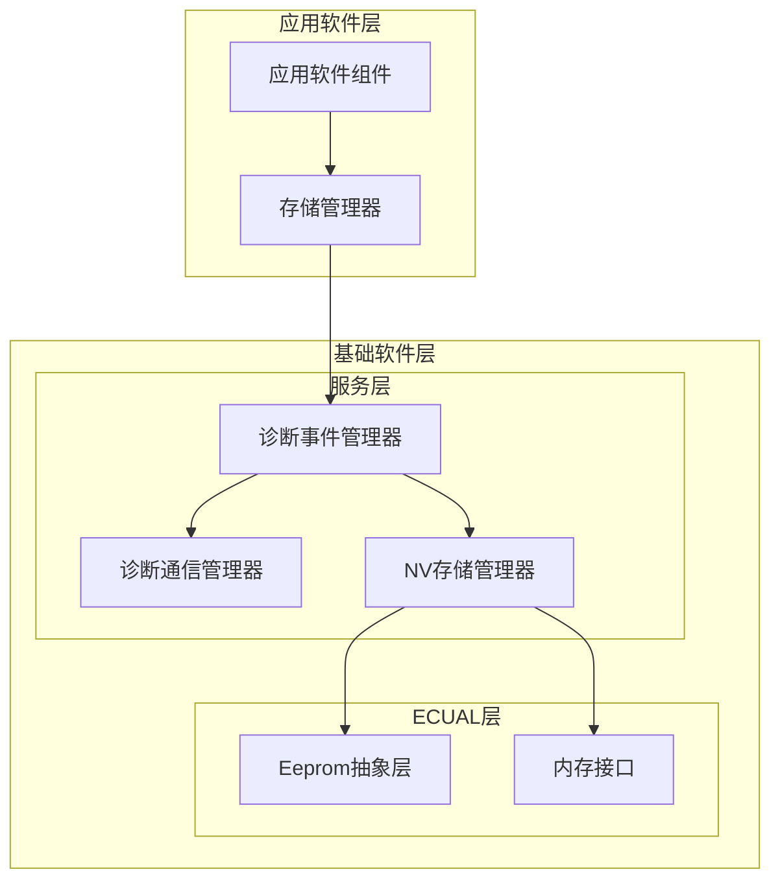
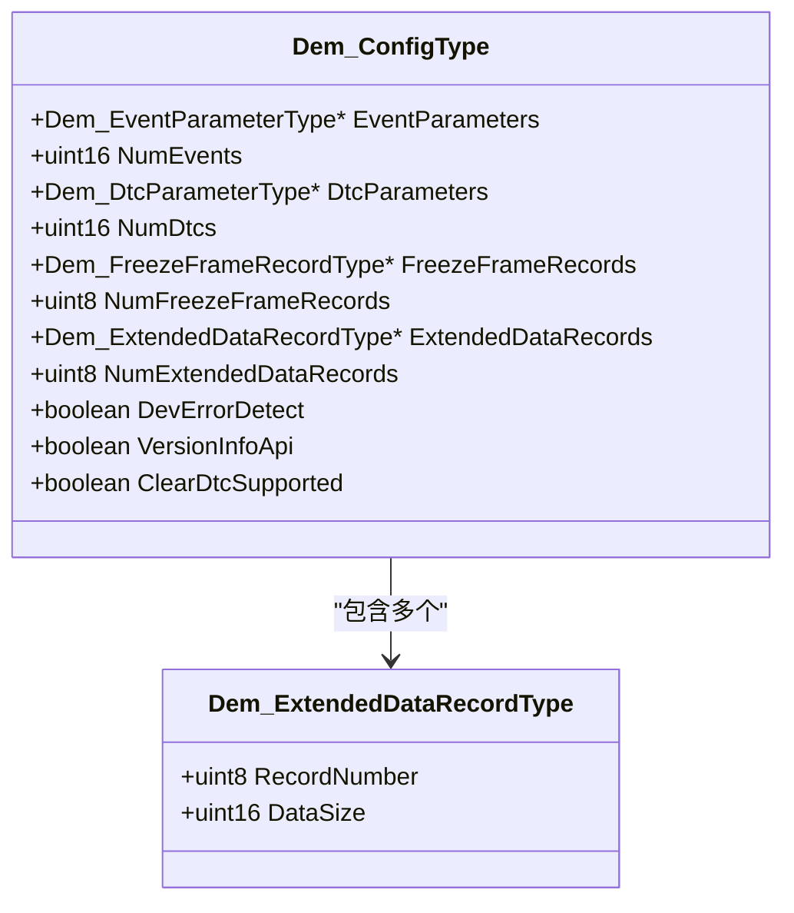
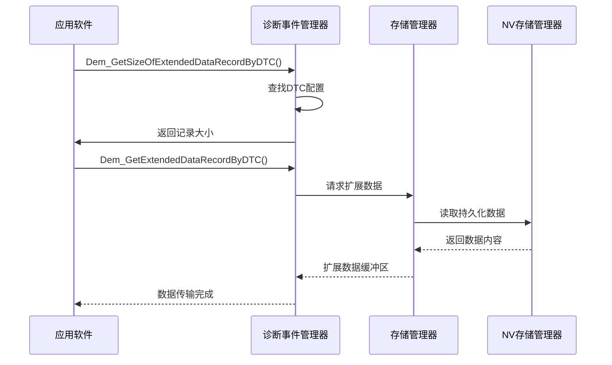
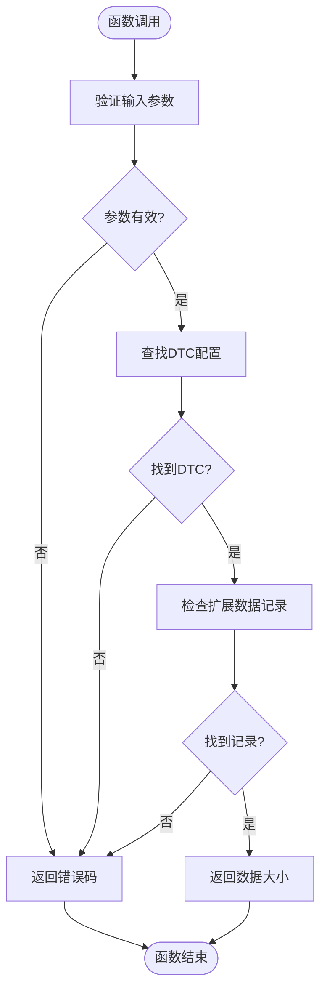
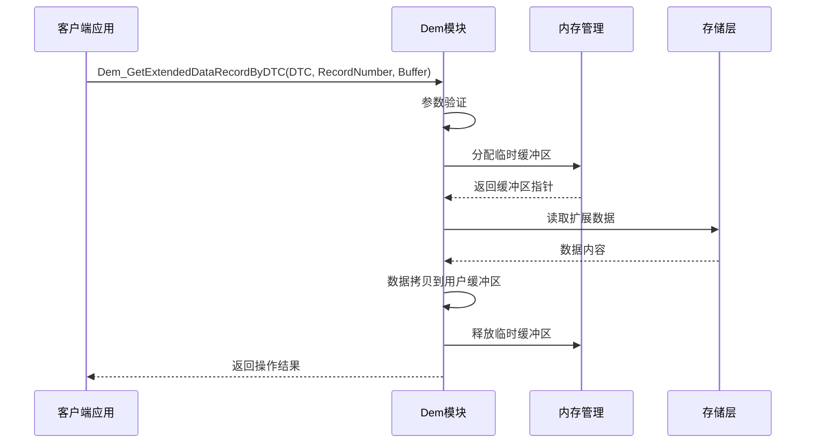
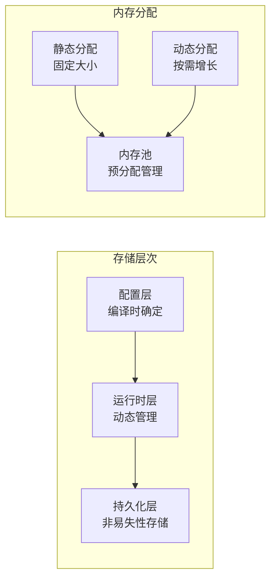
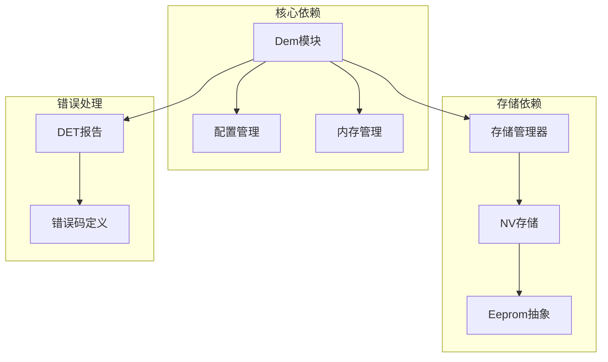
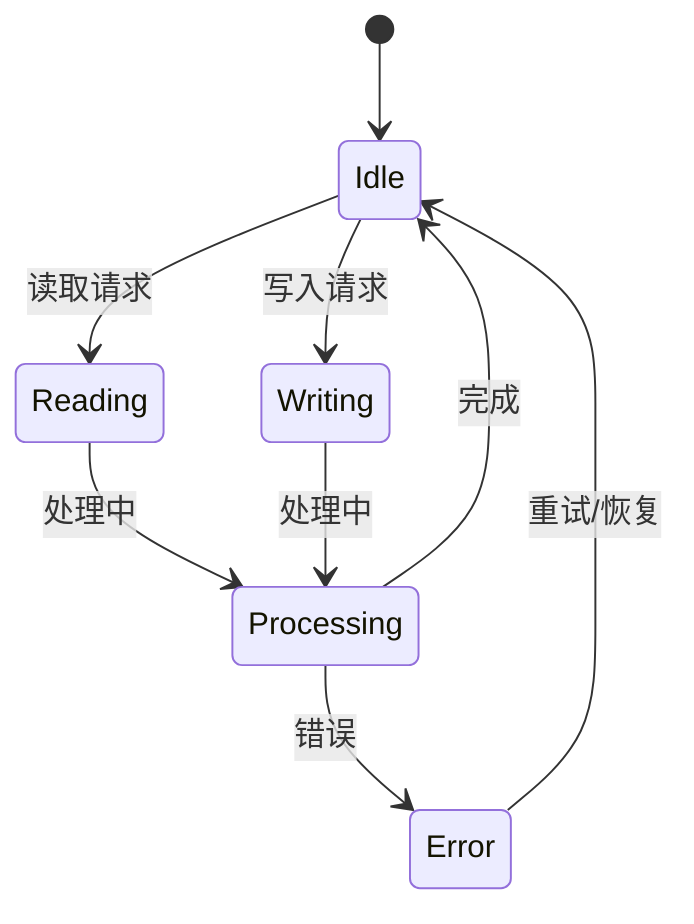

# 扩展数据记录管理

<cite>
**本文档引用的文件**
- [Dem.h](file://src/bsw/services/dem/include/Dem.h)
- [Dem.c](file://src/bsw/services/dem/src/Dem.c)
- [Dem_Cfg.h](file://src/bsw/services/dem/include/Dem_Cfg.h)
- [Swc_StorageManager.h](file://src/asw/storage_manager/include/Swc_StorageManager.h)
- [Swc_StorageManager.c](file://src/asw/storage_manager/src/Swc_StorageManager.c)
- [Ea.h](file://src/bsw/ecual/ea/include/Ea.h)
</cite>

## 目录
1. [简介](#简介)
2. [项目结构](#项目结构)
3. [核心组件](#核心组件)
4. [架构概览](#架构概览)
5. [详细组件分析](#详细组件分析)
6. [依赖关系分析](#依赖关系分析)
7. [性能考虑](#性能考虑)
8. [故障排除指南](#故障排除指南)
9. [结论](#结论)

## 简介

本文档详细阐述了Dem扩展数据记录管理功能的设计与实现。扩展数据记录用于存储故障诊断过程中的额外信息，包括故障诊断信息、环境参数和系统状态数据等。该功能基于AutoSAR Classic Platform 4.x标准，遵循Dem模块的接口规范，提供完整的扩展数据生命周期管理。

扩展数据记录管理功能的核心设计包括：
- **Dem_ExtendedDataRecordType结构体**：定义扩展数据记录的基本结构
- **配置驱动的记录管理**：通过配置文件定义记录数量和大小限制
- **内存安全的访问控制**：提供边界检查和错误处理机制
- **与冻结帧数据的区别**：明确各自的用途和应用场景

## 项目结构

Dem扩展数据记录管理功能位于汽车软件基础软件层的服务组件中，采用AutoSAR分层架构设计：

**图表来源**
- [Dem.h:1-541](file://src/bsw/services/dem/include/Dem.h#L1-L541)
- [Dem_Cfg.h:1-158](file://src/bsw/services/dem/include/Dem_Cfg.h#L1-L158)

**章节来源**
- [Dem.h:1-541](file://src/bsw/services/dem/include/Dem.h#L1-L541)
- [Dem_Cfg.h:1-158](file://src/bsw/services/dem/include/Dem_Cfg.h#L1-L158)

## 核心组件

### Dem_ExtendedDataRecordType结构体设计

扩展数据记录类型是扩展数据管理的核心数据结构，其设计遵循AutoSAR标准的数据结构规范：

**图表来源**
- [Dem.h:274-300](file://src/bsw/services/dem/include/Dem.h#L274-L300)

扩展数据记录结构的关键特性：
- **RecordNumber（记录号）**：唯一标识扩展数据记录的编号
- **DataSize（数据大小）**：指定该记录可存储的最大字节数
- **配置驱动**：通过Dem_Cfg.h中的宏定义进行编译时配置

### 配置参数详解

扩展数据记录的配置参数在Dem_Cfg.h中集中定义：

| 配置项 | 默认值 | 描述 |
|--------|--------|------|
| DEM_NUM_EXTENDED_DATA_RECORDS | 4 | 扩展数据记录的最大数量 |
| DEM_EXTENDED_DATA_MAX_SIZE | 128 | 单个扩展数据记录的最大字节数 |

这些配置参数直接影响内存分配和运行时行为，需要根据具体应用需求进行调整。

**章节来源**
- [Dem.h:274-300](file://src/bsw/services/dem/include/Dem.h#L274-L300)
- [Dem_Cfg.h:56-60](file://src/bsw/services/dem/include/Dem_Cfg.h#L56-L60)

## 架构概览

扩展数据记录管理采用分层架构设计，确保功能的模块化和可维护性：

**图表来源**
- [Dem.h:58-59](file://src/bsw/services/dem/include/Dem.h#L58-L59)
- [Dem.c:1084-1116](file://src/bsw/services/dem/src/Dem.c#L1084-L1116)

## 详细组件分析

### 扩展数据记录API设计

#### Dem_GetSizeOfExtendedDataRecordByDTC函数

该函数负责查询指定DTC对应的扩展数据记录大小，采用查询模式设计：

**图表来源**
- [Dem.h:58](file://src/bsw/services/dem/include/Dem.h#L58)
- [Dem.c:1084-1116](file://src/bsw/services/dem/src/Dem.c#L1084-L1116)

#### Dem_GetExtendedDataRecordByDTC函数

该函数提供扩展数据记录的完整数据获取功能：

**图表来源**
- [Dem.h:59](file://src/bsw/services/dem/include/Dem.h#L59)
- [Dem.c:1084-1116](file://src/bsw/services/dem/src/Dem.c#L1084-L1116)

### 冻结帧数据与扩展数据的区别

| 特性 | 冻结帧数据 | 扩展数据 |
|------|------------|----------|
| **设计目的** | 存储故障发生时刻的快照数据 | 存储故障诊断过程中的附加信息 |
| **触发时机** | DTC确认时自动捕获 | 事件发生时按需记录 |
| **数据内容** | 固定的DID参数值 | 可变的诊断相关信息 |
| **存储策略** | 持久化存储，有限数量 | 可配置大小，支持动态增长 |
| **访问方式** | 通过DID直接读取 | 通过专用API获取 |
| **应用场景** | 故障重现和分析 | 诊断过程跟踪和状态监控 |

### 存储策略与内存管理

扩展数据采用灵活的存储策略，结合静态配置和动态分配：

**图表来源**
- [Dem_Cfg.h:56-60](file://src/bsw/services/dem/include/Dem_Cfg.h#L56-L60)
- [Dem.h:284-300](file://src/bsw/services/dem/include/Dem.h#L284-L300)

## 依赖关系分析

### 组件间依赖关系

扩展数据记录管理涉及多个组件的协作：

**图表来源**
- [Dem.c:19-24](file://src/bsw/services/dem/src/Dem.c#L19-L24)
- [Dem.h:88-100](file://src/bsw/services/dem/include/Dem.h#L88-L100)

### 外部接口依赖

扩展数据功能依赖于以下外部接口：

| 接口名称 | 作用 | 实现位置 |
|----------|------|----------|
| Swc_StorageManager | 应用层存储管理 | Swc_StorageManager.h |
| NvM | 非易失性存储管理 | NvM.h |
| Ea | EEPROM抽象层 | Ea.h |
| Det | 错误检测 | Det.h |

**章节来源**
- [Dem.c:19-24](file://src/bsw/services/dem/src/Dem.c#L19-L24)
- [Swc_StorageManager.h:1-165](file://src/asw/storage_manager/include/Swc_StorageManager.h#L1-L165)

## 性能考虑

### 内存使用优化

扩展数据记录的内存使用遵循以下优化原则：

1. **静态配置优化**：通过编译时配置减少运行时开销
2. **内存对齐**：确保数据结构的内存对齐以提高访问效率
3. **缓存友好**：合理组织数据布局以提高缓存命中率

### 访问性能分析

| 操作类型 | 时间复杂度 | 空间复杂度 | 优化策略 |
|----------|------------|------------|----------|
| 记录查询 | O(n) | O(1) | 哈希索引优化 |
| 数据读取 | O(k) | O(k) | 分块传输减少内存占用 |
| 数据写入 | O(k) | O(k) | 异步写入提升并发性能 |

### 并发访问控制

扩展数据管理采用以下并发控制机制：

## 故障排除指南

### 常见错误类型及处理

扩展数据记录管理可能遇到的错误类型：

| 错误码 | 错误描述 | 可能原因 | 解决方案 |
|--------|----------|----------|----------|
| DEM_E_UNINIT | 模块未初始化 | Dem_Init未调用 | 确保正确初始化 |
| DEM_E_PARAM_DATA | 参数无效 | DTC或记录号错误 | 验证输入参数范围 |
| DEM_E_PARAM_POINTER | 指针为空 | 缓冲区指针无效 | 分配并验证缓冲区 |
| DEM_E_NODATAAVAILABLE | 无可用数据 | 记录未配置或为空 | 检查记录配置和数据状态 |

### 调试建议

1. **启用DET报告**：确保开发错误检测已启用
2. **参数验证**：在调用API前验证所有输入参数
3. **内存检查**：确认缓冲区大小满足DataSize要求
4. **状态监控**：定期检查DTC状态和记录有效性

**章节来源**
- [Dem.h:88-100](file://src/bsw/services/dem/include/Dem.h#L88-L100)
- [Dem.c:44-49](file://src/bsw/services/dem/src/Dem.c#L44-L49)

## 结论

Dem扩展数据记录管理功能提供了完整的扩展数据生命周期管理能力，具有以下特点：

1. **标准化设计**：严格遵循AutoSAR标准，接口清晰明确
2. **配置灵活**：支持编译时配置，适应不同应用场景
3. **内存安全**：完善的参数验证和边界检查机制
4. **性能优化**：合理的内存管理和访问策略
5. **易于集成**：与现有存储和诊断框架无缝集成

该功能为车辆诊断系统提供了强大的扩展数据支持，能够满足复杂的故障诊断和数据分析需求。通过合理的配置和使用，可以有效提升诊断系统的功能性和可靠性。