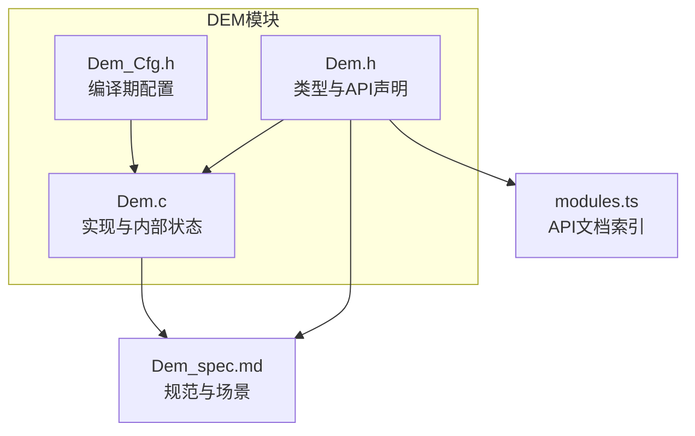
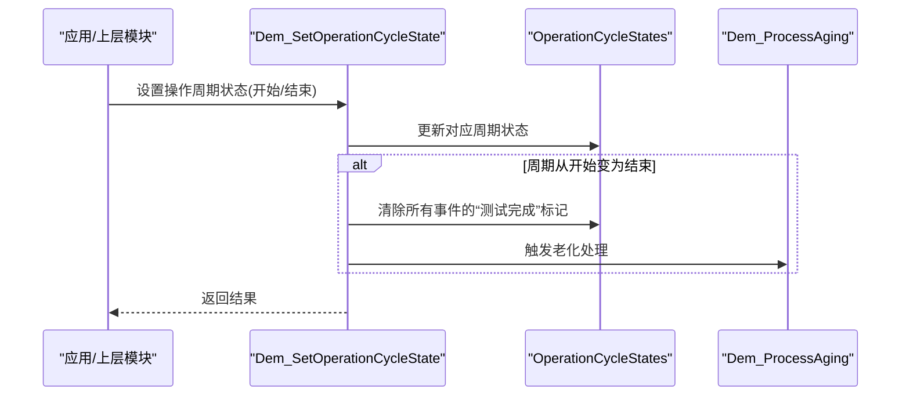
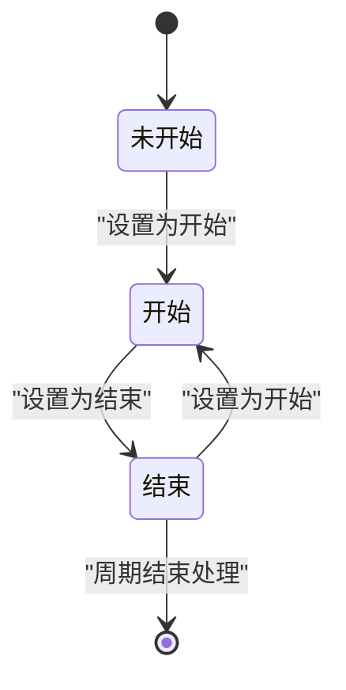
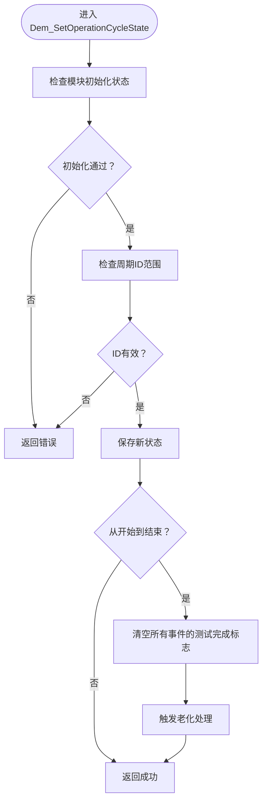
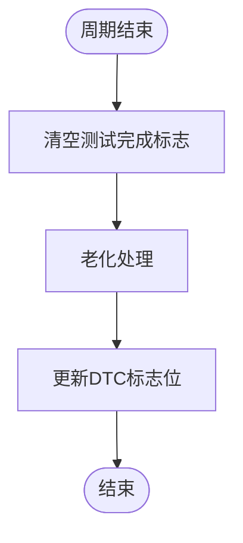
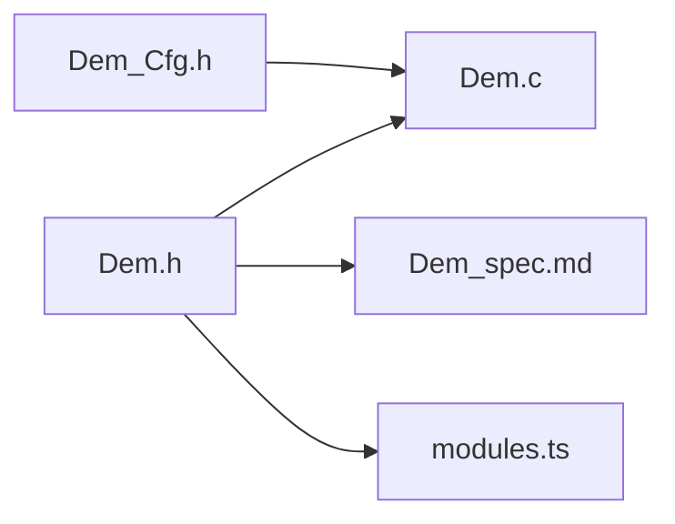

# 操作周期管理

<cite>
**本文档引用的文件**
- [Dem.h](file://src/bsw/services/dem/include/Dem.h)
- [Dem.c](file://src/bsw/services/dem/src/Dem.c)
- [Dem_Cfg.h](file://src/bsw/services/dem/include/Dem_Cfg.h)
- [Dem_spec.md](file://openspec/changes/dev-dcm-dem-module/specs/Dem_spec.md)
- [modules.ts](file://docs-site/src/data/modules.ts)
</cite>

## 目录
1. [简介](#简介)
2. [项目结构](#项目结构)
3. [核心组件](#核心组件)
4. [架构总览](#架构总览)
5. [详细组件分析](#详细组件分析)
6. [依赖关系分析](#依赖关系分析)
7. [性能考虑](#性能考虑)
8. [故障排查指南](#故障排查指南)
9. [结论](#结论)

## 简介
本文件聚焦于DEM（诊断事件管理器）中的操作周期管理功能，系统性阐述以下内容：
- 操作周期类型Dem_OperationCycleType的五种类型及其应用场景：电源周期(POWER)、点火周期(IGNITION)、暖机周期(WARMUP)、OBD日循环(OBD_DCY)、其他周期(OTHER)
- 操作周期状态类型Dem_OperationCycleStateType的两种状态：开始(START)与结束(END)，以及它们之间的转换逻辑
- 操作周期对DTC状态的影响，包括Test Failed Since Last Clear(TFSLC)与Test Not Completed This Operation Cycle(TNCTOC)等标志位的管理
- 实现机制：Dem_SetOperationCycleState设置操作周期状态、Dem_RestartOperationCycle重启操作周期（当前未实现）
- 操作周期监控、状态同步与性能优化的实践建议

## 项目结构
DEM模块位于服务层，提供DTC管理、事件处理、防抖算法、老化与操作周期管理等能力。与操作周期管理直接相关的接口与配置如下：
- 头文件定义了操作周期类型、状态类型及对外API
- 源文件实现了操作周期状态设置与周期结束时的处理流程
- 配置头文件定义了操作周期数量、阈值与行为参数

**图表来源**
- [Dem.h](file://src/bsw/services/dem/include/Dem.h)
- [Dem.c](file://src/bsw/services/dem/src/Dem.c)
- [Dem_Cfg.h](file://src/bsw/services/dem/include/Dem_Cfg.h)
- [Dem_spec.md](file://openspec/changes/dev-dcm-dem-module/specs/Dem_spec.md)
- [modules.ts](file://docs-site/src/data/modules.ts)

**章节来源**
- [Dem.h](file://src/bsw/services/dem/include/Dem.h)
- [Dem.c](file://src/bsw/services/dem/src/Dem.c)
- [Dem_Cfg.h](file://src/bsw/services/dem/include/Dem_Cfg.h)
- [Dem_spec.md](file://openspec/changes/dev-dcm-dem-module/specs/Dem_spec.md)

## 核心组件
- 操作周期类型枚举Dem_OperationCycleType：包含电源、点火、暖机、OBD日循环与其他五类
- 操作周期状态类型Dem_OperationCycleStateType：包含开始与结束两类
- 内部状态数组OperationCycleStates：维护每个操作周期的当前状态
- 关键API：
  - Dem_SetOperationCycleState：设置指定操作周期的状态（开始/结束）
  - Dem_GetOperationCycleState：查询指定操作周期的状态
  - Dem_RestartOperationCycle：重启指定操作周期（当前未实现）

这些组件共同构成操作周期管理的完整闭环：状态上报、状态变更触发、DTC状态更新与老化处理。

**章节来源**
- [Dem.h](file://src/bsw/services/dem/include/Dem.h)
- [Dem.c](file://src/bsw/services/dem/src/Dem.c)
- [Dem_Cfg.h](file://src/bsw/services/dem/include/Dem_Cfg.h)

## 架构总览
操作周期管理在DEM内部通过“状态机+周期结束处理”的方式实现。当检测到某操作周期从开始变为结束时，系统会：
- 清除所有事件的“本次周期已完成”标记
- 触发老化处理流程，评估确认的DTC是否可被移除

**图表来源**
- [Dem.c](file://src/bsw/services/dem/src/Dem.c)

**章节来源**
- [Dem.c](file://src/bsw/services/dem/src/Dem.c)

## 详细组件分析

### 操作周期类型与应用场景
- 电源周期(POWER)：ECU上电/断电过程，通常用于跟踪自检与初始化阶段的DTC状态变化
- 点火周期(IGNITION)：发动机点火/熄火循环，常用于与点火相关的传感器与执行器监测
- 暖机周期(WARMUP)：发动机温度上升至正常工作温度的过程，适合监测温度敏感系统的故障
- OBD日循环(OBD_DCY)：满足OBD法规要求的日间运行循环，用于排放相关系统的监测与DTC状态管理
- 其他周期(OTHER)：无法归入上述四类的特殊场景，如调试、试验等

这些类型在配置头文件中以常量形式定义，便于在上层模块中统一引用。

**章节来源**
- [Dem.h](file://src/bsw/services/dem/include/Dem.h)
- [Dem_Cfg.h](file://src/bsw/services/dem/include/Dem_Cfg.h)

### 操作周期状态类型与转换逻辑
- 状态类型：开始(START)与结束(END)
- 转换触发：由上层模块根据硬件状态或业务逻辑调用Dem_SetOperationCycleState进行切换
- 关键行为：
  - 当检测到从开始到结束的转换时，系统会重置所有事件的“测试完成”标志，并触发老化处理
  - 这一设计确保DTC状态能正确反映“本次操作周期内”的测试情况

**图表来源**
- [Dem.c](file://src/bsw/services/dem/src/Dem.c)

**章节来源**
- [Dem.h](file://src/bsw/services/dem/include/Dem.h)
- [Dem.c](file://src/bsw/services/dem/src/Dem.c)

### Dem_SetOperationCycleState实现机制
- 参数校验：模块初始化状态与周期ID范围检查
- 状态更新：将目标周期的新状态写入内部数组
- 转换处理：若旧状态为开始且新状态为结束，则执行以下操作：
  - 将所有事件的“测试完成”标志清零
  - 调用老化处理函数，评估确认DTC的移除条件
- 返回值：成功返回E_OK，否则返回错误码

**图表来源**
- [Dem.c](file://src/bsw/services/dem/src/Dem.c)

**章节来源**
- [Dem.c](file://src/bsw/services/dem/src/Dem.c)

### Dem_RestartOperationCycle实现现状与建议
- 接口声明：头文件中声明了该API，文档索引也列出其存在
- 实现状态：当前源文件中未找到其实现
- 建议：
  - 若需支持自动重启，可在Dem_RestartOperationCycle中封装“先设为结束再设为开始”的序列
  - 或者提供一个组合调用工具函数，避免重复代码
  - 同步更新文档索引，保持接口与实现一致

**章节来源**
- [Dem.h](file://src/bsw/services/dem/include/Dem.h)
- [modules.ts](file://docs-site/src/data/modules.ts)

### 操作周期对DTC状态的影响
- 标志位管理：
  - Test Failed Since Last Clear(TFSLC)：一旦发生故障并确认，该标志会被置位，直至DTC被清除
  - Test Not Completed This Operation Cycle(TNCTOC)：在周期结束时会被清除；若事件在周期内完成测试则不会置位
- 周期结束处理：
  - 清除所有事件的“测试完成”标志，确保下个周期的统计准确
  - 老化处理可能移除长时间未重现的确认DTC，从而影响TFSLC等标志位

**图表来源**
- [Dem.c](file://src/bsw/services/dem/src/Dem.c)

**章节来源**
- [Dem.c](file://src/bsw/services/dem/src/Dem.c)

## 依赖关系分析
- 类型与API依赖：Dem.h定义了操作周期类型、状态类型与对外API，Dem.c实现这些API并依赖内部状态结构
- 配置依赖：Dem_Cfg.h提供操作周期数量、老化阈值等编译期配置，直接影响运行时行为
- 规范与文档：Dem_spec.md提供了场景化描述与期望结果，modules.ts提供API索引

**图表来源**
- [Dem.h](file://src/bsw/services/dem/include/Dem.h)
- [Dem.c](file://src/bsw/services/dem/src/Dem.c)
- [Dem_Cfg.h](file://src/bsw/services/dem/include/Dem_Cfg.h)
- [Dem_spec.md](file://openspec/changes/dev-dcm-dem-module/specs/Dem_spec.md)
- [modules.ts](file://docs-site/src/data/modules.ts)

**章节来源**
- [Dem.h](file://src/bsw/services/dem/include/Dem.h)
- [Dem.c](file://src/bsw/services/dem/src/Dem.c)
- [Dem_Cfg.h](file://src/bsw/services/dem/include/Dem_Cfg.h)
- [Dem_spec.md](file://openspec/changes/dev-dcm-dem-module/specs/Dem_spec.md)
- [modules.ts](file://docs-site/src/data/modules.ts)

## 性能考虑
- 状态数组规模：操作周期数量由配置决定，建议按实际需求裁剪，避免不必要的内存占用
- 周期结束处理成本：周期结束时遍历所有事件并执行老化处理，应结合主函数调度周期合理安排
- 防抖与老化阈值：合理的阈值配置可减少频繁状态切换带来的处理开销
- 错误检测：启用开发错误检测有助于早期发现非法调用，但生产环境可根据需求关闭以降低开销

## 故障排查指南
- 常见问题
  - 未初始化调用：在模块未初始化状态下调用API会触发DET错误
  - 参数越界：周期ID超出范围或传入空指针会导致错误返回
  - Dem_RestartOperationCycle未实现：当前版本无此实现，需自行封装或等待后续完善
- 定位方法
  - 检查Dem_SetOperationCycleState的返回值与内部状态数组
  - 在周期结束时确认是否正确清除了事件的“测试完成”标志
  - 验证老化处理是否按预期执行，确认DTC标志位变化符合预期

**章节来源**
- [Dem.c](file://src/bsw/services/dem/src/Dem.c)
- [Dem_spec.md](file://openspec/changes/dev-dcm-dem-module/specs/Dem_spec.md)

## 结论
DEM的操作周期管理通过简洁的状态机与周期结束处理，实现了对DTC状态的精准控制。电源、点火、暖机、OBD日循环与其他周期的分类为不同场景下的故障监测提供了清晰边界。当前实现已覆盖状态设置与周期结束处理，Dem_RestartOperationCycle接口有待补充。结合合理的配置与主函数调度，可获得稳定可靠的诊断行为。