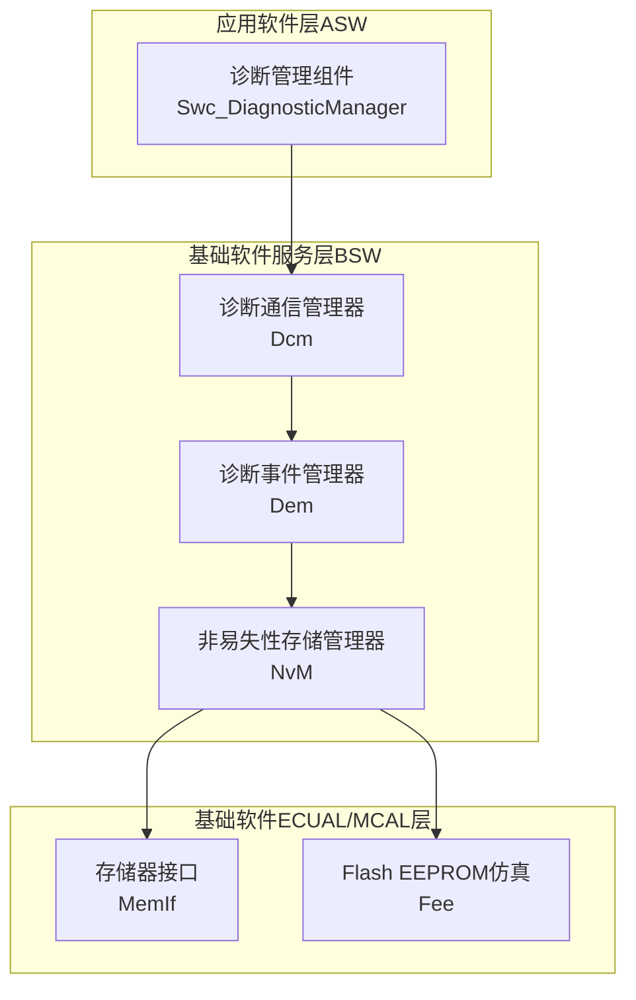
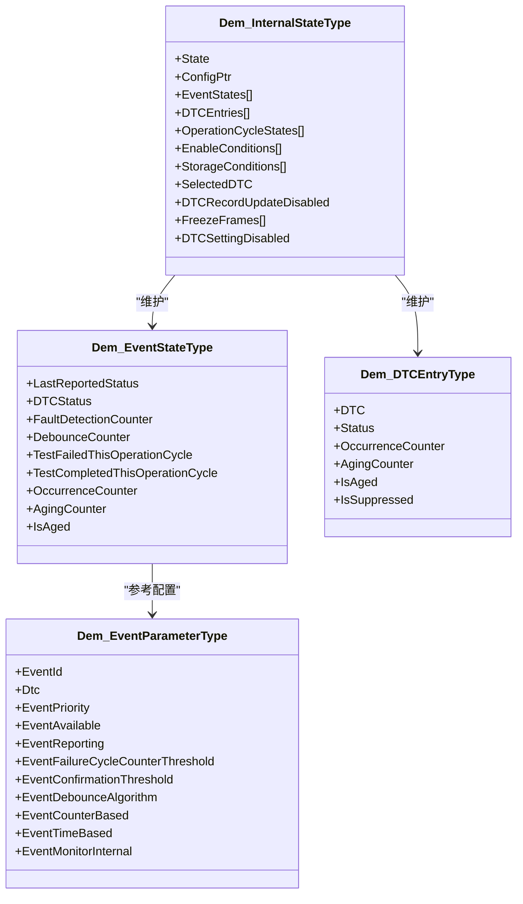
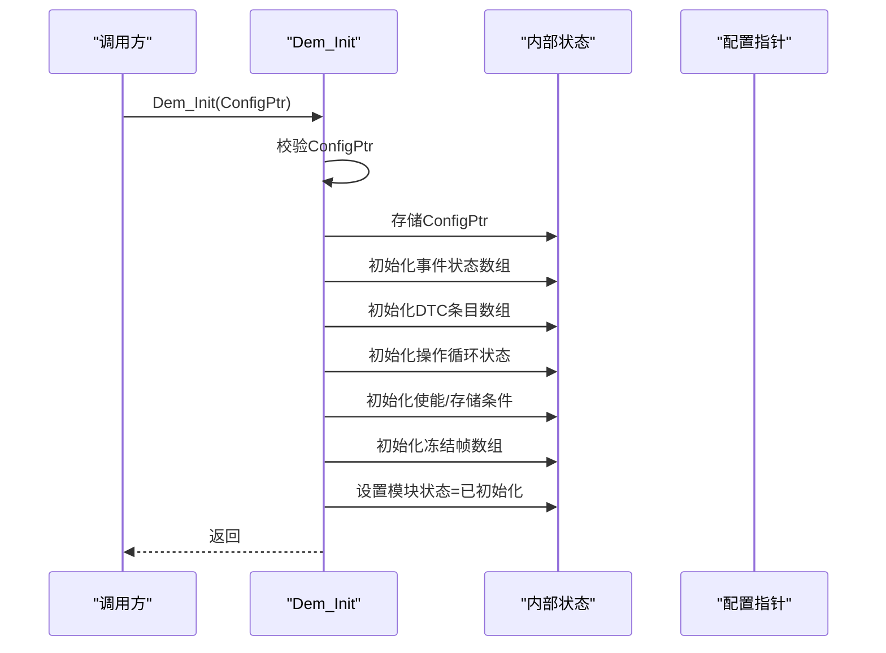
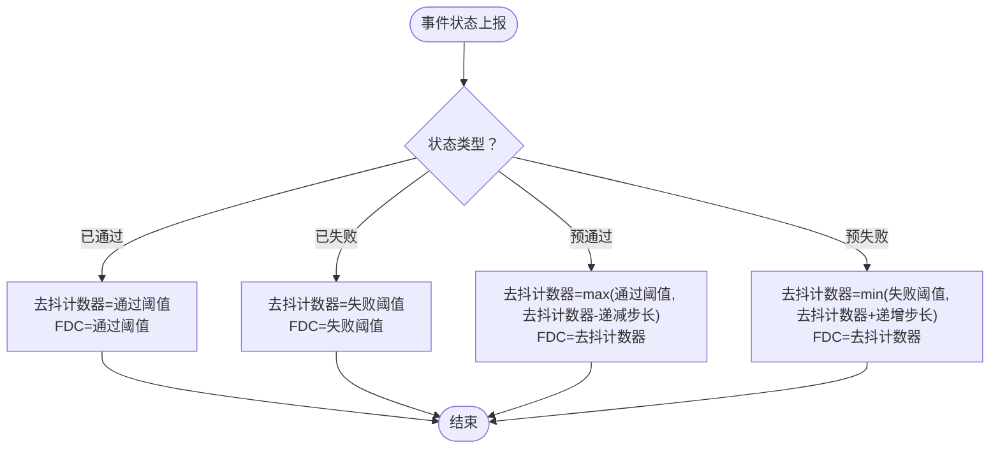
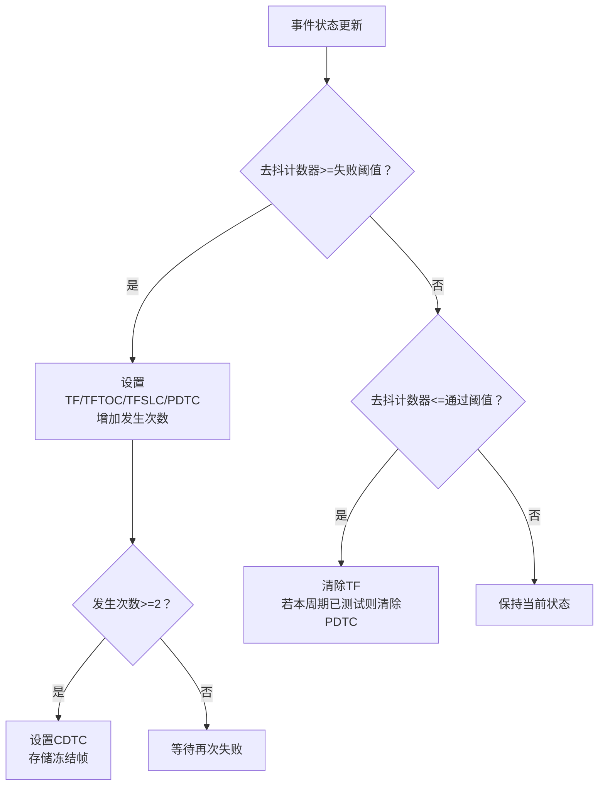
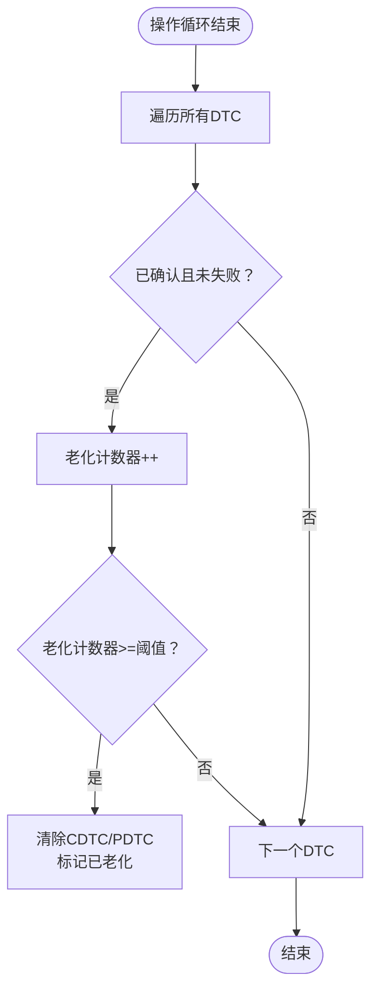
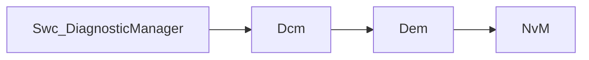

# 诊断事件管理器 (Dem)

<cite>
**本文引用的文件**
- [Dem.h](file://src/bsw/services/dem/include/Dem.h)
- [Dem.c](file://src/bsw/services/dem/src/Dem.c)
- [Dem_Cfg.h](file://src/bsw/services/dem/include/Dem_Cfg.h)
- [Dem_test.c](file://src/bsw/services/dem/src/Dem_test.c)
- [Dem_spec.md](file://openspec/changes/dev-dcm-dem-module/specs/Dem_spec.md)
- [modules.md](file://docs/modules.md)
- [Swc_DiagnosticManager.h](file://src/asw/diagnostic_manager/include/Swc_DiagnosticManager.h)
- [Swc_DiagnosticManager.c](file://src/asw/diagnostic_manager/src/Swc_DiagnosticManager.c)
</cite>

## 目录
1. [简介](#简介)
2. [项目结构](#项目结构)
3. [核心组件](#核心组件)
4. [架构总览](#架构总览)
5. [详细组件分析](#详细组件分析)
6. [依赖分析](#依赖分析)
7. [性能考虑](#性能考虑)
8. [故障排查指南](#故障排查指南)
9. [结论](#结论)
10. [附录](#附录)

## 简介
本文件为诊断事件管理器（Dem）服务的详细技术文档，面向应用软件组件（ASW）与基础软件（BSW）开发者，系统阐述Dem模块在AutoSAR Classic平台下的故障码（DTC）管理与诊断事件处理能力，覆盖故障检测、事件记录、状态管理、去抖算法、老化机制、冻结帧与扩展数据、以及与诊断通信管理器（Dcm）的协作关系。文档同时给出Dem_Init初始化流程、事件状态API（Dem_SetEventStatus、Dem_GetEventStatus）、故障码编码规则、事件优先级与存储策略、索引与参数查询、事件清除与OBD兼容性等关键实现要点，并提供单元测试用例与最佳实践建议。

## 项目结构
Dem模块位于基础软件（BSW）服务层，遵循AutoSAR Classic Platform 4.x标准，向上为Dcm与ASW组件提供DTC管理与诊断事件服务，向下依赖NvM进行持久化存储（当前实现中为占位逻辑，未来将接入）。Dem模块的对外接口集中在头文件中声明，内部状态与算法在源文件中实现。

图表来源
- [modules.md:299-315](file://docs/modules.md#L299-L315)
- [Dem_spec.md:334-350](file://openspec/changes/dev-dcm-dem-module/specs/Dem_spec.md#L334-L350)

章节来源
- [Dem.h:1-541](file://src/bsw/services/dem/include/Dem.h#L1-L541)
- [Dem.c:1-1145](file://src/bsw/services/dem/src/Dem.c#L1-L1145)
- [Dem_Cfg.h:1-158](file://src/bsw/services/dem/include/Dem_Cfg.h#L1-L158)
- [Dem_spec.md:1-357](file://openspec/changes/dev-dcm-dem-module/specs/Dem_spec.md#L1-L357)
- [modules.md:299-315](file://docs/modules.md#L299-L315)

## 核心组件
- 诊断事件管理器（Dem）
  - 负责事件状态上报、去抖算法、DTC状态字节更新、冻结帧与扩展数据记录、老化与清除、操作循环管理等。
  - 提供初始化、去初始化、版本信息、事件状态查询、DTC状态查询、冻结帧存取、操作循环控制、DTC设置开关等API。
- 诊断通信管理器（Dcm）
  - 作为上层接口，向Dem请求DTC状态、清除DTC、读取冻结帧等。
- 诊断管理组件（ASW）
  - 作为应用层组件，向Dem上报事件状态（如传感器故障、执行器异常），并根据DTC状态控制仪表指示灯等。

章节来源
- [Dem.h:319-538](file://src/bsw/services/dem/include/Dem.h#L319-L538)
- [Dem_spec.md:27-84](file://openspec/changes/dev-dcm-dem-module/specs/Dem_spec.md#L27-L84)
- [modules.md:282-315](file://docs/modules.md#L282-L315)

## 架构总览
Dem模块采用“事件-状态-内存”的三层结构：
- 事件层：事件ID、事件参数（与DTC映射、优先级、去抖算法等）。
- 状态层：事件状态（已上报状态、去抖计数器、故障检测计数器、测试完成标志、发生次数、老化计数、是否已老化）。
- 内存层：DTC条目（DTC值、状态字节、发生次数、老化计数、是否抑制/已老化、冻结帧记录）。

图表来源
- [Dem.h:218-262](file://src/bsw/services/dem/include/Dem.h#L218-L262)
- [Dem.c:75-88](file://src/bsw/services/dem/src/Dem.c#L75-L88)

章节来源
- [Dem.h:218-262](file://src/bsw/services/dem/include/Dem.h#L218-L262)
- [Dem.c:75-88](file://src/bsw/services/dem/src/Dem.c#L75-L88)

## 详细组件分析

### Dem_Init初始化流程
- 参数校验：若传入配置指针为空，且启用DET，则上报参数错误；否则继续。
- 存储配置指针，初始化内部状态（模块状态、配置指针、事件状态数组、DTC条目数组、操作循环状态、使能条件、存储条件、选中DTC、冻结帧数组、DTC记录更新开关、DTC设置开关）。
- 将事件状态与DTC条目的初始状态设置为“未完成”（对应UDS状态字节中的“自上次清除未完成”、“本次运行周期未完成”等位）。
- 设置模块状态为已初始化。

图表来源
- [Dem.c:390-471](file://src/bsw/services/dem/src/Dem.c#L390-L471)

章节来源
- [Dem.c:390-471](file://src/bsw/services/dem/src/Dem.c#L390-L471)

### 事件状态管理与去抖算法
- 支持四种事件状态：已通过、已失败、预通过、预失败、达到FDC阈值。
- 去抖算法（计数器法）：
  - 预失败：去抖计数器递增（步长默认为1），故障检测计数器同步更新。
  - 预通过：去抖计数器递减（步长默认为1），故障检测计数器同步更新。
  - 已通过：去抖计数器重置为“通过阈值”。
  - 已失败：去抖计数器重置为“失败阈值”。
- 阈值：
  - 失败阈值：默认127
  - 通过阈值：默认-128
- 故障检测计数器（FDC）：与去抖计数器保持一致，便于外部查询。

图表来源
- [Dem.c:198-248](file://src/bsw/services/dem/src/Dem.c#L198-L248)
- [Dem_Cfg.h:112-117](file://src/bsw/services/dem/include/Dem_Cfg.h#L112-L117)

章节来源
- [Dem.c:198-248](file://src/bsw/services/dem/src/Dem.c#L198-L248)
- [Dem_Cfg.h:112-117](file://src/bsw/services/dem/include/Dem_Cfg.h#L112-L117)

### DTC状态字节与确认机制
- DTC状态字节（UDS）包含8个位，分别表示“最近测试失败”、“本次运行周期失败”、“待定DTC”、“已确认DTC”、“自上次清除未完成”、“自上次清除失败”、“本次运行周期未完成”、“警告灯请求”。
- 当事件去抖计数器达到失败阈值时：
  - 设置“最近测试失败”、“本次运行周期失败”、“自上次清除失败”、“待定DTC”。
  - 增加发生次数；当发生次数≥2时，设置“已确认DTC”，并触发冻结帧存储。
- 当事件去抖计数器回到通过阈值时：
  - 清除“最近测试失败”；若本运行周期已完成测试，则清除“待定DTC”。

图表来源
- [Dem.c:278-348](file://src/bsw/services/dem/src/Dem.c#L278-L348)

章节来源
- [Dem.c:278-348](file://src/bsw/services/dem/src/Dem.c#L278-L348)

### 老化与清除
- 老化：当DTC处于“已确认”且“最近测试失败”为0时，老化计数器递增；达到阈值（默认40）后，清除“已确认DTC”和“待定DTC”，标记为已老化。
- 清除：支持按DTC或全部清除；清除后将状态重置为“自上次清除未完成”和“本次运行周期未完成”，发生次数与老化计数清零，冻结帧失效。

图表来源
- [Dem.c:353-381](file://src/bsw/services/dem/src/Dem.c#L353-L381)

章节来源
- [Dem.c:353-381](file://src/bsw/services/dem/src/Dem.c#L353-L381)

### 冻结帧与扩展数据
- 冻结帧：当DTC首次从“未确认”变为“已确认”时，捕获快照数据（当前实现为占位填充），并记录时间戳与长度。
- 扩展数据：Dem内部结构支持扩展数据记录类型，当前实现中相关API返回未实现（占位）。

章节来源
- [Dem.c:256-276](file://src/bsw/services/dem/src/Dem.c#L256-L276)
- [Dem.h:276-279](file://src/bsw/services/dem/include/Dem.h#L276-L279)
- [Dem.c:1119-1137](file://src/bsw/services/dem/src/Dem.c#L1119-L1137)

### Dem_SetEventStatus与Dem_GetEventStatus
- Dem_SetEventStatus
  - 校验模块初始化与事件ID有效性（启用DET时）。
  - 更新事件状态、去抖计数器、测试完成标志，并触发DTC状态更新。
- Dem_GetEventStatus
  - 返回最后一次上报的事件状态；启用DET时进行参数校验。

章节来源
- [Dem.c:496-535](file://src/bsw/services/dem/src/Dem.c#L496-L535)
- [Dem.c:578-609](file://src/bsw/services/dem/src/Dem.c#L578-L609)

### Dem_ClearDTC与DTC选择
- Dem_ClearDTC
  - 支持清除指定DTC或全部DTC；清除后重置状态字节、发生次数、老化计数、冻结帧有效位。
- Dem_SelectDTC
  - 选择当前关注的DTC，便于后续操作（当前实现为占位）。

章节来源
- [Dem.c:758-805](file://src/bsw/services/dem/src/Dem.c#L758-L805)
- [Dem.c:810-829](file://src/bsw/services/dem/src/Dem.c#L810-L829)

### 操作循环与主函数
- Dem_SetOperationCycleState
  - 设置操作循环开始/结束；在循环结束时重置各事件的“本周期已测试”标志，并触发老化处理。
- Dem_MainFunction
  - 当前实现为空（占位），未来可用于时间基去抖等周期性处理。

章节来源
- [Dem.c:876-916](file://src/bsw/services/dem/src/Dem.c#L876-L916)
- [Dem.c:937-940](file://src/bsw/services/dem/src/Dem.c#L937-L940)

### 冻结帧预存储与读取
- Dem_PrestoreFreezeFrame
  - 预存储冻结帧数据（当前实现为占位）。
- Dem_ClearPrestoredFreezeFrame
  - 清除预存储的冻结帧。
- Dem_GetFreezeFrameDataByDTC
  - 读取指定DTC的冻结帧数据（当前实现为占位）。

章节来源
- [Dem.c:970-1002](file://src/bsw/services/dem/src/Dem.c#L970-L1002)
- [Dem.c:1007-1039](file://src/bsw/services/dem/src/Dem.c#L1007-L1039)
- [Dem.c:1084-1116](file://src/bsw/services/dem/src/Dem.c#L1084-L1116)

### OBD兼容性与维护提醒
- OBD相关支持：配置中开启OBD相关支持，便于在OBD诊断场景下提供相关功能。
- 维护提醒：通过冻结帧与扩展数据记录，结合事件状态变化，可为维护提醒提供数据基础（当前实现为占位，未来可接入实际DID采集）。

章节来源
- [Dem_Cfg.h:20-21](file://src/bsw/services/dem/include/Dem_Cfg.h#L20-L21)
- [Dem.h:276-279](file://src/bsw/services/dem/include/Dem.h#L276-L279)

## 依赖分析
- 上层依赖
  - Dcm：通过Dem提供的DTC状态查询、清除、冻结帧读取等接口实现诊断服务。
  - ASW组件：通过Dem上报事件状态，参与故障检测与状态管理。
- 下层依赖
  - NvM：当前实现为占位，未来将用于持久化DTC状态与冻结帧。
- 同层依赖
  - Dcm与Dem之间存在直接交互，Dem为Dcm提供底层DTC管理能力。

图表来源
- [modules.md:369-371](file://docs/modules.md#L369-L371)
- [Dem_spec.md:334-350](file://openspec/changes/dev-dcm-dem-module/specs/Dem_spec.md#L334-L350)

章节来源
- [modules.md:369-371](file://docs/modules.md#L369-L371)
- [Dem_spec.md:334-350](file://openspec/changes/dev-dcm-dem-module/specs/Dem_spec.md#L334-L350)

## 性能考虑
- 去抖算法复杂度：每次事件上报为O(1)，状态更新与阈值判断均为常数时间。
- DTC状态更新：按事件ID索引访问事件状态数组，再定位DTC条目，整体为O(1)。
- 老化处理：遍历所有DTC条目，复杂度O(N)，其中N为DTC数量；建议在操作循环结束时批量处理。
- 冻结帧存储：当前实现为占位，实际实现应避免频繁分配与拷贝，建议使用固定缓冲区与DMA方式。

[本节为通用指导，不直接分析具体文件]

## 故障排查指南
- 初始化错误
  - 症状：调用Dem_Init传入空指针导致DET错误。
  - 排查：检查配置指针是否正确传递；确认配置结构体完整。
- 未初始化调用
  - 症状：在模块未初始化状态下调用API返回错误。
  - 排查：确保先调用Dem_Init，再进行其他API调用。
- 事件ID无效
  - 症状：事件ID超出范围或为0，返回参数错误。
  - 排查：核对事件ID范围与配置中的事件数量。
- DTC状态查询失败
  - 症状：查询DTC状态返回未实现或无数据。
  - 排查：确认DTC值存在于配置中，且Dem_ClearDTC未被调用导致状态被清除。
- 冻结帧读取失败
  - 症状：Dem_GetFreezeFrameDataByDTC返回未实现。
  - 排查：当前实现为占位，需在实际项目中接入DID采集与存储逻辑。

章节来源
- [Dem_test.c:99-111](file://src/bsw/services/dem/src/Dem_test.c#L99-L111)
- [Dem_test.c:274-289](file://src/bsw/services/dem/src/Dem_test.c#L274-L289)
- [Dem.c:1119-1137](file://src/bsw/services/dem/src/Dem.c#L1119-L1137)

## 结论
Dem模块提供了完整的诊断事件与DTC管理能力，具备去抖算法、确认机制、老化与清除、冻结帧与扩展数据支持，并与Dcm、ASW组件形成清晰的分层协作关系。当前实现中部分功能（如冻结帧数据采集、NvM持久化）为占位，建议在实际项目中按配置参数与需求逐步完善，以满足OBD与维护提醒等场景。

[本节为总结性内容，不直接分析具体文件]

## 附录

### API一览与使用要点
- 初始化与版本
  - Dem_Init：初始化模块，传入配置指针。
  - Dem_GetVersionInfo：获取版本信息（可选）。
- 事件管理
  - Dem_SetEventStatus：上报事件状态（已通过/已失败/预通过/预失败）。
  - Dem_GetEventStatus：获取最后一次上报的状态。
  - Dem_ResetEventStatus：重置事件状态与去抖计数。
  - Dem_GetEventFailed：判断事件是否已失败。
  - Dem_GetEventTested：判断事件是否已在本周期测试。
  - Dem_GetFaultDetectionCounter：获取故障检测计数器（FDC）。
- DTC管理
  - Dem_GetDTCStatus：获取DTC状态字节。
  - Dem_ClearDTC：清除指定DTC或全部DTC。
  - Dem_SelectDTC：选择当前关注的DTC。
- 冻结帧与扩展数据
  - Dem_PrestoreFreezeFrame：预存储冻结帧。
  - Dem_ClearPrestoredFreezeFrame：清除预存储冻结帧。
  - Dem_GetFreezeFrameDataByDTC：按DTC读取冻结帧。
- 操作循环
  - Dem_SetOperationCycleState：设置操作循环开始/结束。
  - Dem_RestartOperationCycle：重启操作循环。
  - Dem_MainFunction：周期性主函数（占位）。
- DTC设置控制
  - Dem_DisableDTCSetting / Dem_EnableDTCSetting：禁用/启用DTC设置。

章节来源
- [Dem.h:319-538](file://src/bsw/services/dem/include/Dem.h#L319-L538)

### 配置要点
- 事件与DTC数量：通过宏定义配置事件与DTC的最大数量。
- 去抖参数：失败/通过阈值、递增/递减步长、时间阈值等。
- 老化参数：老化阈值与计数器上限。
- 冻结帧与扩展数据：最大记录数与大小限制。
- OBD/J1939支持：按需开启。

章节来源
- [Dem_Cfg.h:26-158](file://src/bsw/services/dem/include/Dem_Cfg.h#L26-L158)

### 单元测试要点
- 初始化：验证空配置指针与有效配置的行为。
- 事件状态：验证已通过/已失败/预通过/预失败对去抖计数器与FDC的影响。
- DTC状态：验证确认与清除后的状态变化。
- 未初始化调用：验证DET错误上报。
- 版本信息：验证版本号返回。

章节来源
- [Dem_test.c:88-328](file://src/bsw/services/dem/src/Dem_test.c#L88-L328)