# 诊断日志和跟踪(DLT)

<cite>
**本文档引用的文件**
- [Dlt.h](file://src/bsw/services/dlt/include/Dlt.h)
- [Dlt_Cfg.h](file://src/bsw/services/dlt/include/Dlt_Cfg.h)
- [Dlt_Internal.h](file://src/bsw/services/dlt/include/Dlt_Internal.h)
- [Dlt_Types.h](file://src/bsw/services/dlt/include/Dlt_Types.h)
- [Dlt.c](file://src/bsw/services/dlt/src/Dlt.c)
- [test_Dlt.c](file://tests/unit/services/test_Dlt.c)
- [api-reference.md](file://docs/api-reference.md)
- [modules.md](file://docs/modules.md)
</cite>

## 目录
1. [简介](#简介)
2. [项目结构](#项目结构)
3. [核心组件](#核心组件)
4. [架构概览](#架构概览)
5. [详细组件分析](#详细组件分析)
6. [依赖关系分析](#依赖关系分析)
7. [性能考虑](#性能考虑)
8. [故障排除指南](#故障排除指南)
9. [结论](#结论)

## 简介

诊断日志和跟踪(Diagnostic Log and Trace, DLT)是YuleTech AutoSAR BSW平台中的关键模块，提供符合AutoSAR Classic Platform 4.x规范的诊断日志和跟踪服务。该模块实现了标准化的诊断通信协议，支持多种传输协议，并提供了完整的应用注册、消息过滤和队列管理功能。

DLT模块的主要功能包括：
- 符合AutoSAR规范的诊断日志消息传输
- 跟踪消息的实时监控和记录
- 多种传输协议支持（UDP/TCP/SOME/IP）
- 应用级别的消息过滤和优先级控制
- 高效的消息队列管理和缓冲区控制

## 项目结构

DLT模块采用标准的AutoSAR分层架构设计，包含以下核心目录结构：

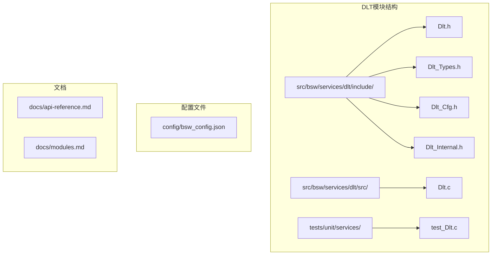

**图表来源**
- [Dlt.h:1-295](file://src/bsw/services/dlt/include/Dlt.h#L1-L295)
- [Dlt.c:1-645](file://src/bsw/services/dlt/src/Dlt.c#L1-L645)

**章节来源**
- [Dlt.h:1-295](file://src/bsw/services/dlt/include/Dlt.h#L1-L295)
- [Dlt_Cfg.h:1-115](file://src/bsw/services/dlt/include/Dlt_Cfg.h#L1-L115)
- [Dlt_Internal.h:1-197](file://src/bsw/services/dlt/include/Dlt_Internal.h#L1-L197)
- [Dlt_Types.h:1-219](file://src/bsw/services/dlt/include/Dlt_Types.h#L1-L219)

## 核心组件

### 主要API接口

DLT模块提供了完整的AutoSAR标准API接口，包括初始化、反初始化、应用管理、消息发送和状态查询等功能：

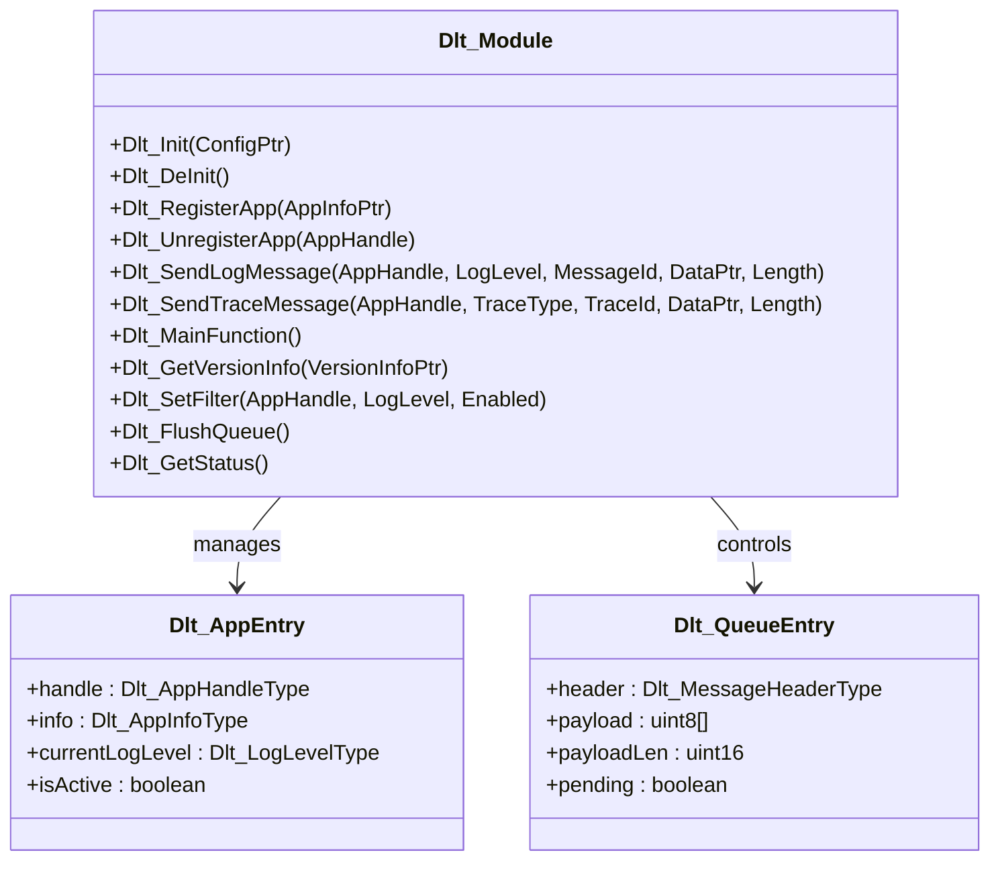

**图表来源**
- [Dlt.h:82-245](file://src/bsw/services/dlt/include/Dlt.h#L82-L245)
- [Dlt_Internal.h:67-98](file://src/bsw/services/dlt/include/Dlt_Internal.h#L67-L98)

### 数据类型定义

DLT模块定义了完整的数据类型体系，确保与AutoSAR规范的兼容性：

| 类型名称 | 描述 | 值范围 |
|---------|------|--------|
| Dlt_AppHandleType | 应用句柄类型 | uint16 (0xFFFF为无效句柄) |
| Dlt_LogLevelType | 日志级别 | FATAL(0)-VERBOSE(5) |
| Dlt_TraceType | 跟踪类型 | VARIABLE(0)-BUFFER(3) |
| Dlt_MessageType | 消息类型 | LOG(0)-TRACE(1)-CONTROL(2) |
| Dlt_TransportProtocolType | 传输协议 | UDP(0)-TCP(1)-SOMEIP(2) |

**章节来源**
- [Dlt_Types.h:67-163](file://src/bsw/services/dlt/include/Dlt_Types.h#L67-L163)
- [Dlt_Types.h:172-216](file://src/bsw/services/dlt/include/Dlt_Types.h#L172-L216)

## 架构概览

### 系统架构图

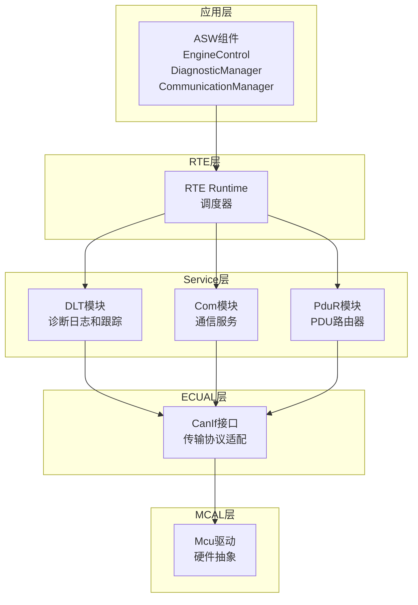

**图表来源**
- [modules.md:558-623](file://docs/modules.md#L558-L623)

### 消息处理流程

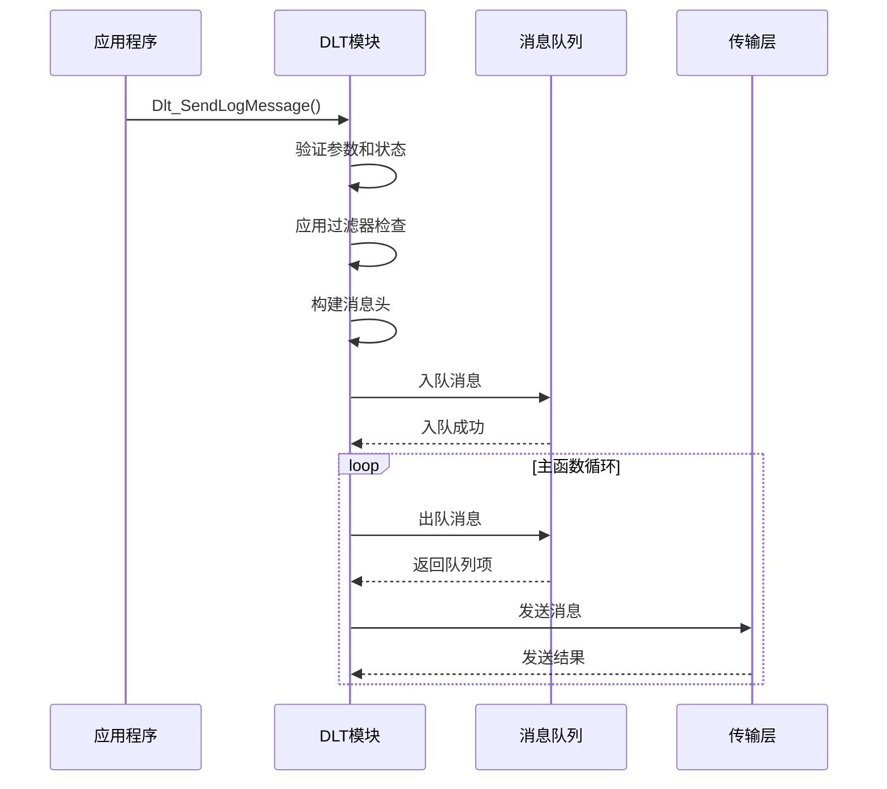

**图表来源**
- [Dlt.c:234-387](file://src/bsw/services/dlt/src/Dlt.c#L234-L387)

## 详细组件分析

### DLT核心实现

#### 初始化和状态管理

DLT模块采用三阶段状态管理机制：

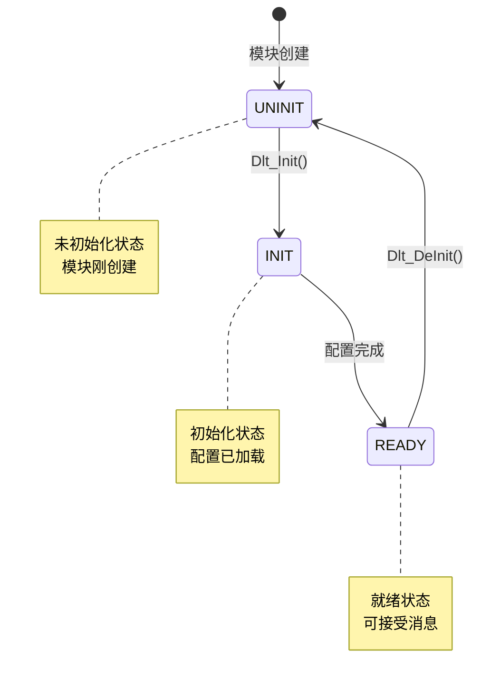

**图表来源**
- [Dlt_Types.h:202-206](file://src/bsw/services/dlt/include/Dlt_Types.h#L202-L206)

#### 应用注册和管理

DLT模块支持最多32个并发应用注册，每个应用都有独立的句柄和配置：

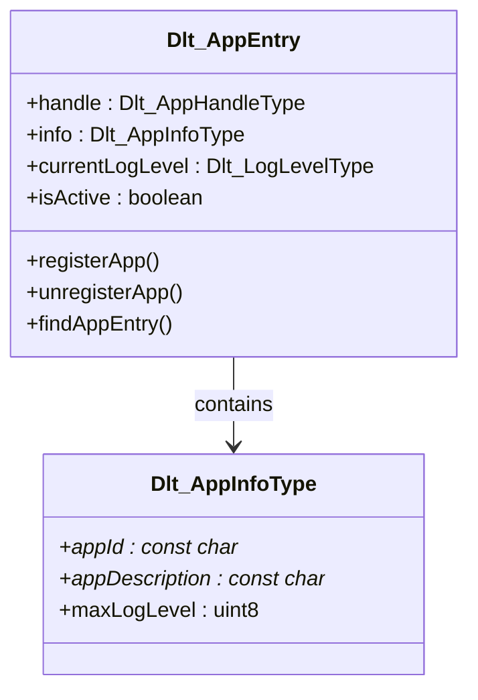

**图表来源**
- [Dlt_Internal.h:67-72](file://src/bsw/services/dlt/include/Dlt_Internal.h#L67-L72)
- [Dlt_Types.h:125-129](file://src/bsw/services/dlt/include/Dlt_Types.h#L125-L129)

#### 消息队列管理

DLT模块实现了高效的环形缓冲区队列，支持最多256条消息的排队：

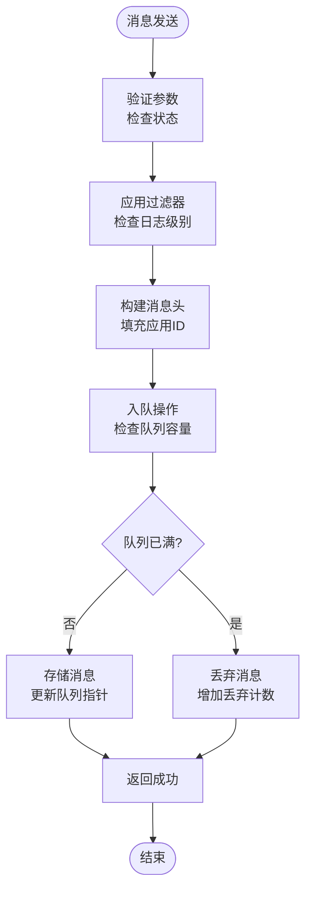

**图表来源**
- [Dlt.c:520-537](file://src/bsw/services/dlt/src/Dlt.c#L520-L537)

**章节来源**
- [Dlt.c:97-131](file://src/bsw/services/dlt/src/Dlt.c#L97-L131)
- [Dlt.c:156-197](file://src/bsw/services/dlt/src/Dlt.c#L156-L197)
- [Dlt.c:520-558](file://src/bsw/services/dlt/src/Dlt.c#L520-L558)

### 传输协议支持

DLT模块支持多种传输协议，通过配置参数进行选择：

| 协议类型 | 端口号 | 缓冲区大小 | 最大消息大小 |
|---------|--------|------------|-------------|
| UDP | 3490 | 4096字节 | 1400字节 |
| TCP | 可配置 | 可配置 | 可配置 |
| SOME/IP | 可配置 | 可配置 | 可配置 |

**章节来源**
- [Dlt_Cfg.h:36-51](file://src/bsw/services/dlt/include/Dlt_Cfg.h#L36-L51)
- [Dlt.c:51-56](file://src/bsw/services/dlt/src/Dlt.c#L51-L56)

### 错误处理和调试

DLT模块实现了完整的错误检测机制，支持开发时错误检测：

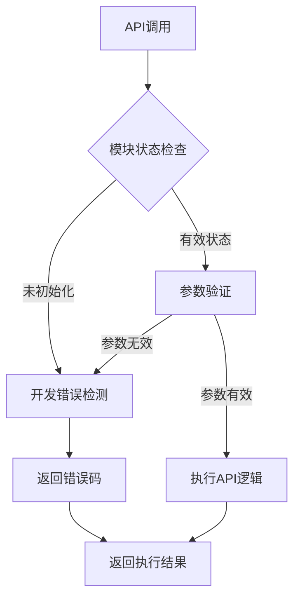

**图表来源**
- [Dlt.h:251-266](file://src/bsw/services/dlt/include/Dlt.h#L251-L266)

**章节来源**
- [Dlt.h:268-289](file://src/bsw/services/dlt/include/Dlt.h#L268-L289)
- [Dlt.c:99-105](file://src/bsw/services/dlt/src/Dlt.c#L99-L105)

## 依赖关系分析

### 模块间依赖

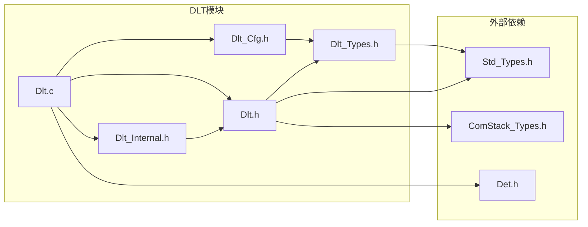

**图表来源**
- [Dlt.h:27-29](file://src/bsw/services/dlt/include/Dlt.h#L27-L29)
- [Dlt.c:13-17](file://src/bsw/services/dlt/src/Dlt.c#L13-L17)

### 配置依赖关系

DLT模块的配置通过预编译常量和运行时配置相结合的方式实现：

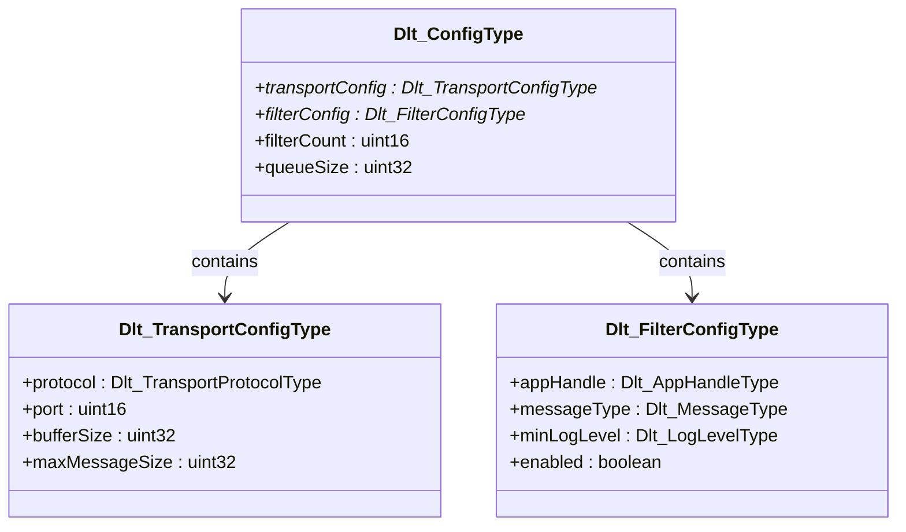

**图表来源**
- [Dlt_Types.h:158-163](file://src/bsw/services/dlt/include/Dlt_Types.h#L158-L163)
- [Dlt_Types.h:138-143](file://src/bsw/services/dlt/include/Dlt_Types.h#L138-L143)
- [Dlt_Types.h:148-153](file://src/bsw/services/dlt/include/Dlt_Types.h#L148-L153)

**章节来源**
- [Dlt_Types.h:135-163](file://src/bsw/services/dlt/include/Dlt_Types.h#L135-L163)
- [Dlt_Cfg.h:97-112](file://src/bsw/services/dlt/include/Dlt_Cfg.h#L97-L112)

## 性能考虑

### 内存使用优化

DLT模块采用了内存友好的设计策略：

- **静态内存分配**: 所有核心数据结构都使用静态内存分配，避免动态内存碎片
- **环形缓冲区**: 使用固定大小的环形缓冲区，支持O(1)时间复杂度的入队和出队操作
- **最小化复制**: 消息头和负载分离存储，减少不必要的数据复制

### 并发处理

DLT模块支持多应用并发处理，通过以下机制保证线程安全：

- **原子操作**: 关键状态更新使用原子操作
- **队列同步**: 使用队列头尾指针实现无锁队列
- **应用表管理**: 独立的应用表避免跨应用竞争

### 传输效率

- **批量发送**: 主函数周期性处理队列，支持批量消息发送
- **优先级过滤**: 在发送前进行应用级过滤，减少无效传输
- **缓冲区复用**: 使用固定大小的缓冲区，避免频繁分配释放

## 故障排除指南

### 常见问题诊断

#### 模块初始化问题

**症状**: 调用任何DLT API都返回错误
**可能原因**: 
- 未调用`Dlt_Init()`函数
- 配置指针为NULL
- 模块处于UNINIT状态

**解决方案**:
```c
// 正确的初始化流程
Dlt_Init(&Dlt_Config);
Dlt_AppHandleType handle = Dlt_RegisterApp(&appInfo);
```

#### 应用注册失败

**症状**: `Dlt_RegisterApp()`返回无效句柄
**可能原因**:
- 模块未初始化
- 应用数量达到上限(32个)
- 应用信息指针为NULL

**解决方案**:
```c
// 检查模块状态
if (Dlt_GetStatus() != DLT_STATE_READY) {
    // 先初始化模块
    Dlt_Init(&Dlt_Config);
}

// 注册应用
Dlt_AppHandleType handle = Dlt_RegisterApp(&appInfo);
if (handle == DLT_INVALID_APP_HANDLE) {
    // 处理注册失败
}
```

#### 消息发送失败

**症状**: `Dlt_SendLogMessage()`返回E_NOT_OK
**可能原因**:
- 模块未初始化
- 应用句柄无效
- 数据指针为NULL
- 消息长度超过限制(1400字节)

**解决方案**:
```c
// 验证输入参数
if (DataPtr == NULL || Length > DLT_MAX_MSG_SIZE) {
    return E_NOT_OK;
}

// 发送消息
Std_ReturnType result = Dlt_SendLogMessage(
    handle, 
    DLT_LOG_INFO, 
    messageId, 
    DataPtr, 
    Length
);
```

### 性能监控

DLT模块提供了内置的性能统计功能：

| 统计指标 | 描述 | 更新时机 |
|---------|------|----------|
| totalMessagesSent | 总发送消息数 | 发送成功时递增 |
| totalMessagesDropped | 总丢弃消息数 | 队列满时递增 |
| queueCount | 当前队列消息数 | 入队/出队时更新 |

**章节来源**
- [Dlt_Internal.h:96-98](file://src/bsw/services/dlt/include/Dlt_Internal.h#L96-L98)
- [Dlt.c:383-386](file://src/bsw/services/dlt/src/Dlt.c#L383-L386)

### 单元测试覆盖

DLT模块包含完整的单元测试套件，覆盖所有主要功能：

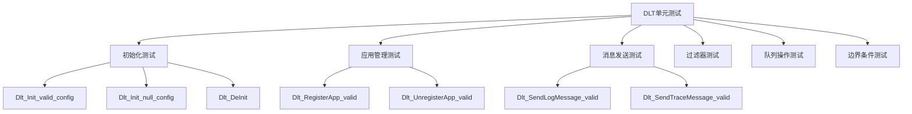

**图表来源**
- [test_Dlt.c:51-473](file://tests/unit/services/test_Dlt.c#L51-L473)

**章节来源**
- [test_Dlt.c:1-473](file://tests/unit/services/test_Dlt.c#L1-L473)

## 结论

DLT模块作为YuleTech AutoSAR BSW平台的核心诊断组件，实现了完整的AutoSAR规范要求。通过模块化的架构设计、完善的错误处理机制和高效的性能优化，DLT模块为整个系统的诊断和调试提供了可靠的技术支撑。

### 主要优势

1. **完全符合AutoSAR规范**: 严格遵循Classic Platform 4.x规范
2. **灵活的配置选项**: 支持多种传输协议和配置参数
3. **高效的消息处理**: 采用环形缓冲区和无锁队列设计
4. **完整的错误检测**: 支持开发时和运行时错误检测
5. **全面的测试覆盖**: 包含单元测试和集成测试

### 未来改进方向

1. **增强传输协议支持**: 扩展现有的UDP/TCP/SOME/IP支持
2. **优化内存使用**: 考虑动态内存分配以适应不同应用场景
3. **扩展过滤功能**: 增加更精细的消息过滤和路由功能
4. **性能监控增强**: 添加更详细的性能统计和分析功能

DLT模块为YuleTech AutoSAR平台提供了坚实的诊断基础，其设计充分体现了现代汽车软件工程的最佳实践。