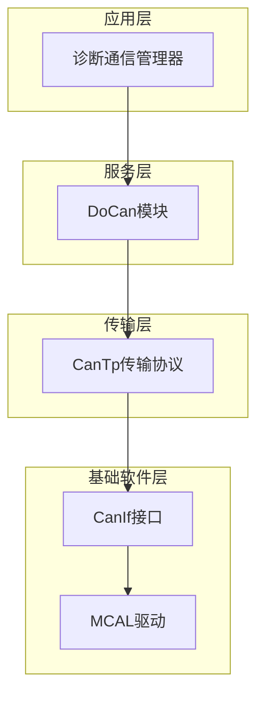
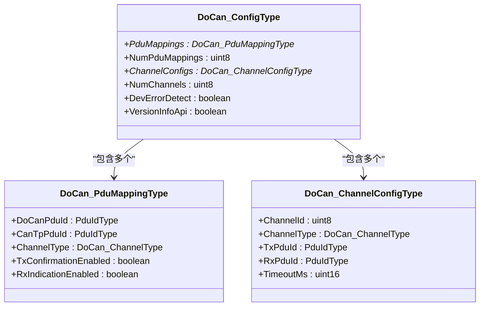
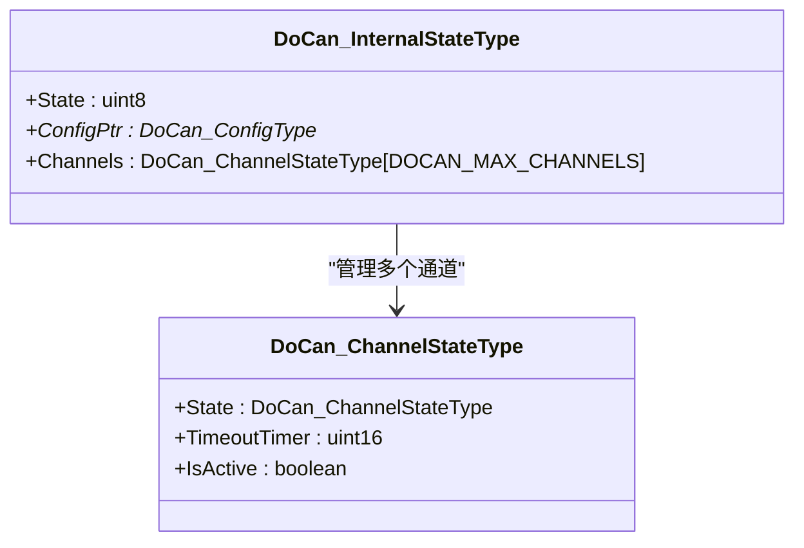
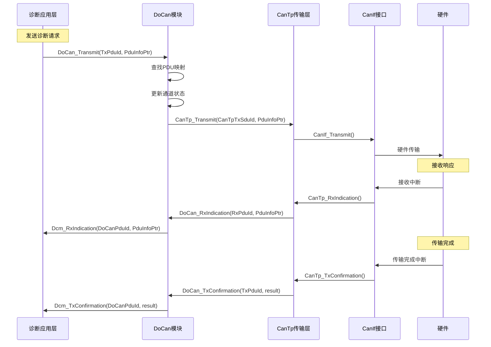
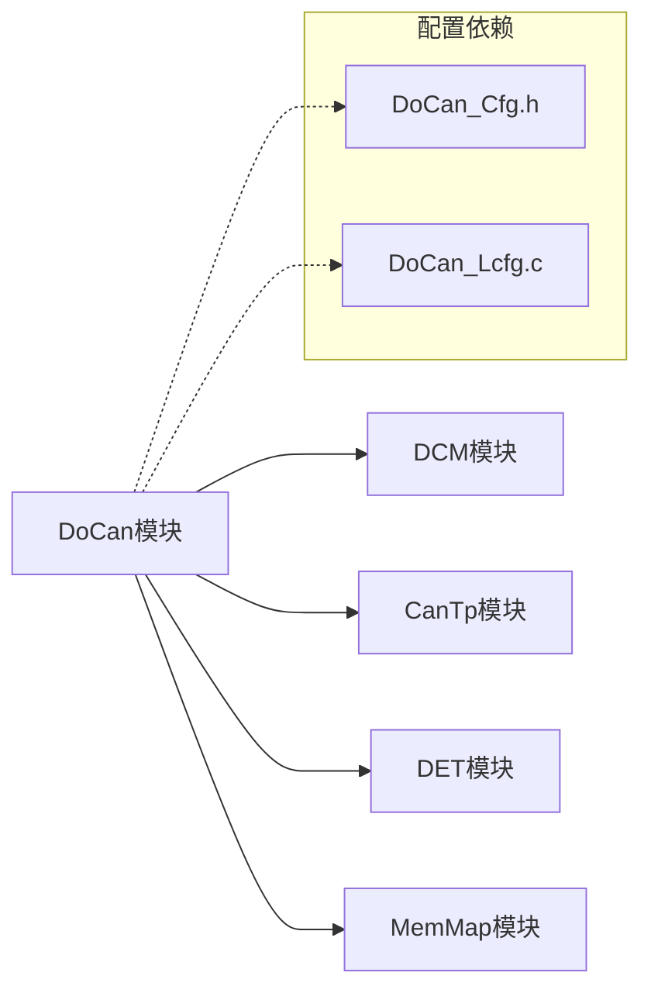
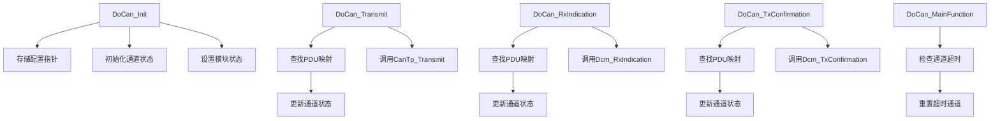

# API接口参考

<cite>
**本文档引用的文件**
- [DoCan.h](file://src/bsw/services/docan/include/DoCan.h)
- [DoCan.c](file://src/bsw/services/docan/src/DoCan.c)
- [DoCan_Cfg.h](file://src/bsw/services/docan/include/DoCan_Cfg.h)
- [DoCan_Lcfg.c](file://src/bsw/services/docan/src/DoCan_Lcfg.c)
- [DoCan_test.c](file://src/bsw/services/docan/src/DoCan_test.c)
- [Det.h](file://src/bsw/services/det/include/Det.h)
- [main.c](file://examples/can_demo/main.c)
</cite>

## 目录
1. [简介](#简介)
2. [项目结构](#项目结构)
3. [核心组件](#核心组件)
4. [架构概览](#架构概览)
5. [详细组件分析](#详细组件分析)
6. [依赖关系分析](#依赖关系分析)
7. [性能考虑](#性能考虑)
8. [故障排除指南](#故障排除指南)
9. [结论](#结论)

## 简介

DoCan（Diagnostic over CAN）模块是遵循AutoSAR Classic Platform 4.x标准的诊断通信服务层模块。该模块实现了基于CAN总线的诊断协议栈，负责在诊断应用层（DCM）和传输层（CanTp）之间进行消息路由和状态管理。

本参考文档详细记录了DoCan模块的所有公共API接口，包括初始化、去初始化、版本信息查询、数据传输、接收指示和确认处理等核心功能。文档还提供了服务ID定义、错误码说明、调用时机分析、线程安全性考虑以及最佳实践指导。

## 项目结构

DoCan模块位于服务层（Service Layer），采用AutoSAR标准的分层架构设计：



**图表来源**
- [DoCan.h:1-180](file://src/bsw/services/docan/include/DoCan.h#L1-L180)
- [DoCan.c:1-481](file://src/bsw/services/docan/src/DoCan.c#L1-L481)

**章节来源**
- [DoCan.h:1-180](file://src/bsw/services/docan/include/DoCan.h#L1-L180)
- [DoCan_Cfg.h:1-54](file://src/bsw/services/docan/include/DoCan_Cfg.h#L1-L54)

## 核心组件

### 模块配置类型

DoCan模块的核心配置结构体定义如下：



**图表来源**
- [DoCan.h:84-113](file://src/bsw/services/docan/include/DoCan.h#L84-L113)

### 运行时状态管理

模块维护内部运行时状态以跟踪通道状态和超时：



**图表来源**
- [DoCan.c:54-67](file://src/bsw/services/docan/src/DoCan.c#L54-L67)

**章节来源**
- [DoCan.h:106-113](file://src/bsw/services/docan/include/DoCan.h#L106-L113)
- [DoCan.c:62-67](file://src/bsw/services/docan/src/DoCan.c#L62-L67)

## 架构概览

DoCan模块采用事件驱动的架构模式，通过回调机制与上层和下层模块交互：



**图表来源**
- [DoCan.c:27-29](file://src/bsw/services/docan/src/DoCan.c#L27-L29)
- [DoCan.c:242-303](file://src/bsw/services/docan/src/DoCan.c#L242-L303)
- [DoCan.c:311-359](file://src/bsw/services/docan/src/DoCan.c#L311-L359)
- [DoCan.c:367-409](file://src/bsw/services/docan/src/DoCan.c#L367-L409)

## 详细组件分析

### 初始化函数 - DoCan_Init

**函数原型**
```c
void DoCan_Init(const DoCan_ConfigType* ConfigPtr);
```

**参数说明**
- `ConfigPtr`: 指向配置结构体的指针，不能为NULL

**返回值**
- 无返回值

**功能描述**
初始化DoCan模块，设置内部状态为已初始化，并对所有通道进行状态复位。

**调用时机**
- 系统启动时，在所有相关模块初始化之后调用
- 必须在任何其他DoCan API调用之前调用

**线程安全性**
- 单线程环境下安全
- 多线程环境下需要外部同步保护

**复杂度分析**
- 时间复杂度：O(N)，其中N为最大通道数
- 空间复杂度：O(1)

**章节来源**
- [DoCan.h:136](file://src/bsw/services/docan/include/DoCan.h#L136)
- [DoCan.c:187-212](file://src/bsw/services/docan/src/DoCan.c#L187-L212)

### 去初始化函数 - DoCan_DeInit

**函数原型**
```c
void DoCan_DeInit(void);
```

**参数说明**
- 无参数

**返回值**
- 无返回值

**功能描述**
释放DoCan模块资源，清除配置指针，设置模块状态为未初始化。

**调用时机**
- 系统关闭或模块卸载时调用
- 调用后，所有其他DoCan API调用都会产生错误报告

**线程安全性**
- 单线程环境下安全
- 多线程环境下需要确保没有并发的API调用

**复杂度分析**
- 时间复杂度：O(1)
- 空间复杂度：O(1)

**章节来源**
- [DoCan.h:141](file://src/bsw/services/docan/include/DoCan.h#L141)
- [DoCan.c:219-234](file://src/bsw/services/docan/src/DoCan.c#L219-L234)

### 版本信息查询 - DoCan_GetVersionInfo

**函数原型**
```c
void DoCan_GetVersionInfo(Std_VersionInfoType* versioninfo);
```

**参数说明**
- `versioninfo`: 指向版本信息结构体的指针，不能为NULL

**返回值**
- 无返回值

**功能描述**
获取DoCan模块的版本信息，包括供应商ID、模块ID、软件主版本号、软件次版本号和补丁版本号。

**调用时机**
- 需要查询模块版本信息时调用
- 可在模块初始化前后调用

**线程安全性**
- 单线程环境下安全
- 多线程环境下需要外部同步

**复杂度分析**
- 时间复杂度：O(1)
- 空间复杂度：O(1)

**章节来源**
- [DoCan.h:147](file://src/bsw/services/docan/include/DoCan.h#L147)
- [DoCan.c:453-473](file://src/bsw/services/docan/src/DoCan.c#L453-L473)

### 数据传输 - DoCan_Transmit

**函数原型**
```c
Std_ReturnType DoCan_Transmit(PduIdType TxPduId, const PduInfoType* PduInfoPtr);
```

**参数说明**
- `TxPduId`: DCM面向的PDU标识符
- `PduInfoPtr`: 指向PDU信息的指针，包含数据缓冲区和长度

**返回值**
- `E_OK`: 传输成功
- `E_NOT_OK`: 传输失败

**功能描述**
将诊断消息从DCM传输到CanTp层，支持物理地址和功能地址两种模式。

**调用时机**
- 当DCM有诊断数据需要发送时调用
- 必须在模块初始化后调用

**线程安全性**
- 单线程环境下安全
- 多线程环境下需要外部同步保护

**复杂度分析**
- 时间复杂度：O(M + N)，其中M为PDU映射数量，N为通道数量
- 空间复杂度：O(1)

**章节来源**
- [DoCan.h:155](file://src/bsw/services/docan/include/DoCan.h#L155)
- [DoCan.c:242-303](file://src/bsw/services/docan/src/DoCan.c#L242-L303)

### 接收指示 - DoCan_RxIndication

**函数原型**
```c
void DoCan_RxIndication(PduIdType RxPduId, const PduInfoType* PduInfoPtr);
```

**参数说明**
- `RxPduId`: CanTp接收的PDU标识符
- `PduInfoPtr`: 指向接收到的数据的指针

**返回值**
- 无返回值

**功能描述**
处理来自CanTp的接收指示，将数据转发给DCM层。

**调用时机**
- 由CanTp层在接收到诊断数据时调用
- 通常在中断上下文中调用

**线程安全性**
- 单线程环境下安全
- 多线程环境下需要外部同步

**复杂度分析**
- 时间复杂度：O(M + N)，其中M为PDU映射数量，N为通道数量
- 空间复杂度：O(1)

**章节来源**
- [DoCan.h:162](file://src/bsw/services/docan/include/DoCan.h#L162)
- [DoCan.c:311-359](file://src/bsw/services/docan/src/DoCan.c#L311-L359)

### 传输确认 - DoCan_TxConfirmation

**函数原型**
```c
void DoCan_TxConfirmation(PduIdType TxPduId, Std_ReturnType result);
```

**参数说明**
- `TxPduId`: CanTp传输的PDU标识符
- `result`: 传输结果状态

**返回值**
- 无返回值

**功能描述**
处理来自CanTp的传输确认，通知DCM层传输完成状态。

**调用时机**
- 由CanTp层在传输完成后调用
- 通常在中断上下文中调用

**线程安全性**
- 单线程环境下安全
- 多线程环境下需要外部同步

**复杂度分析**
- 时间复杂度：O(M + N)，其中M为PDU映射数量，N为通道数量
- 空间复杂度：O(1)

**章节来源**
- [DoCan.h:169](file://src/bsw/services/docan/include/DoCan.h#L169)
- [DoCan.c:367-409](file://src/bsw/services/docan/src/DoCan.c#L367-L409)

### 主函数 - DoCan_MainFunction

**函数原型**
```c
void DoCan_MainFunction(void);
```

**参数说明**
- 无参数

**返回值**
- 无返回值

**功能描述**
执行周期性处理任务，主要是检查通道超时状态并重置超时的通道。

**调用时机**
- 在主循环中定期调用
- 调用频率由`DOCAN_MAIN_FUNCTION_PERIOD_MS`配置决定

**线程安全性**
- 单线程环境下安全
- 多线程环境下需要外部同步

**复杂度分析**
- 时间复杂度：O(N)，其中N为最大通道数
- 空间复杂度：O(1)

**章节来源**
- [DoCan.h:174](file://src/bsw/services/docan/include/DoCan.h#L174)
- [DoCan.c:416-446](file://src/bsw/services/docan/src/DoCan.c#L416-L446)

## 依赖关系分析

### 外部依赖

DoCan模块依赖于以下外部模块：



**图表来源**
- [DoCan.c:19-22](file://src/bsw/services/docan/src/DoCan.c#L19-L22)
- [DoCan.h:19-21](file://src/bsw/services/docan/include/DoCan.h#L19-L21)

### 内部依赖关系



**图表来源**
- [DoCan.c:187-212](file://src/bsw/services/docan/src/DoCan.c#L187-L212)
- [DoCan.c:242-303](file://src/bsw/services/docan/src/DoCan.c#L242-L303)
- [DoCan.c:311-359](file://src/bsw/services/docan/src/DoCan.c#L311-L359)
- [DoCan.c:367-409](file://src/bsw/services/docan/src/DoCan.c#L367-L409)
- [DoCan.c:416-446](file://src/bsw/services/docan/src/DoCan.c#L416-L446)

**章节来源**
- [DoCan.c:27-29](file://src/bsw/services/docan/src/DoCan.c#L27-L29)
- [DoCan.c:83-85](file://src/bsw/services/docan/src/DoCan.c#L83-L85)

## 性能考虑

### 时间复杂度分析

| 函数 | 最佳情况 | 平均情况 | 最坏情况 | 说明 |
|------|----------|----------|----------|------|
| DoCan_Init | O(1) | O(N) | O(N) | N为最大通道数 |
| DoCan_DeInit | O(1) | O(1) | O(1) | 无循环操作 |
| DoCan_Transmit | O(M+N) | O(M+N) | O(M+N) | M为PDU映射数，N为通道数 |
| DoCan_RxIndication | O(M+N) | O(M+N) | O(M+N) | 同上 |
| DoCan_TxConfirmation | O(M+N) | O(M+N) | O(M+N) | 同上 |
| DoCan_MainFunction | O(N) | O(N) | O(N) | N为最大通道数 |

### 内存使用分析

- **静态内存**: 约100字节（内部状态结构体）
- **动态内存**: 无（完全静态分配）
- **堆栈使用**: 每个函数约16-32字节（取决于编译器优化）

### 性能优化建议

1. **配置优化**: 合理设置`DOCAN_MAX_CHANNELS`和`DOCAN_MAX_PDU_MAPPINGS`
2. **超时配置**: 根据实际应用需求调整通道超时时间
3. **错误检测**: 在开发阶段启用错误检测，在生产环境可考虑关闭以节省资源

## 故障排除指南

### 常见错误码

| 错误码 | 含义 | 触发条件 | 解决方案 |
|--------|------|----------|----------|
| DOCAN_E_PARAM_POINTER | 参数指针无效 | 传入NULL指针 | 检查传入参数的有效性 |
| DOCAN_E_PARAM_CONFIG | 配置参数无效 | 配置结构体不正确 | 验证配置数据完整性 |
| DOCAN_E_UNINIT | 模块未初始化 | 在未初始化状态下调用API | 确保先调用DoCan_Init |
| DOCAN_E_INVALID_PDU_ID | PDU ID无效 | 找不到对应的PDU映射 | 检查PDU ID配置 |
| DOCAN_E_INVALID_CHANNEL | 通道无效 | 找不到对应的通道配置 | 验证通道配置 |
| DOCAN_E_TX_FAILED | 传输失败 | CanTp传输返回错误 | 检查CanTp层状态 |

### 调试技巧

1. **启用错误检测**: 在开发阶段保持`DOCAN_DEV_ERROR_DETECT`为`STD_ON`
2. **日志记录**: 利用DET模块记录错误信息
3. **单元测试**: 使用提供的测试用例验证功能正确性

**章节来源**
- [DoCan.h:49-54](file://src/bsw/services/docan/include/DoCan.h#L49-L54)
- [DoCan_test.c:110-133](file://src/bsw/services/docan/src/DoCan_test.c#L110-L133)

## 结论

DoCan模块提供了完整的诊断通信服务，具有以下特点：

1. **标准兼容**: 完全符合AutoSAR Classic Platform 4.x标准
2. **功能完整**: 支持物理地址和功能地址两种诊断模式
3. **错误处理**: 提供完善的错误检测和报告机制
4. **性能优化**: 采用静态内存分配，运行时开销最小
5. **易于集成**: 清晰的API接口，便于与其他模块集成

在使用过程中，开发者应特别注意模块的生命周期管理、错误处理机制和线程安全性要求，以确保系统的稳定性和可靠性。