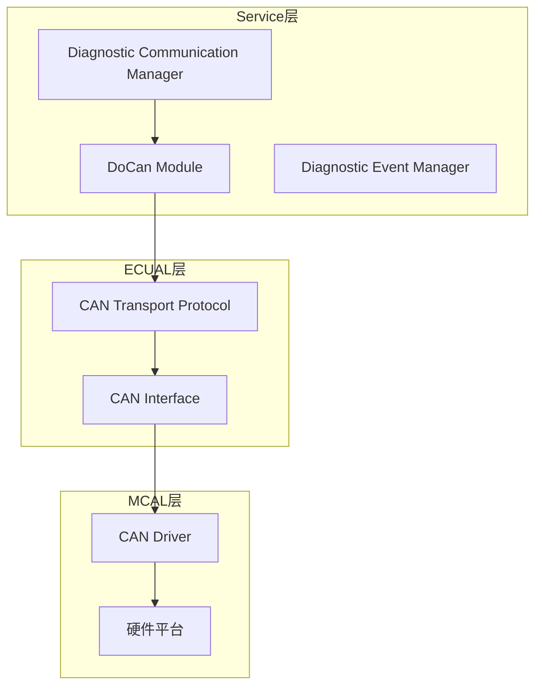
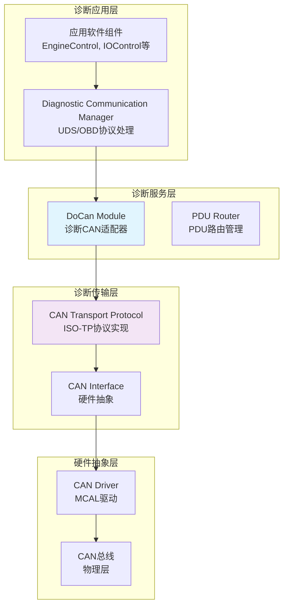
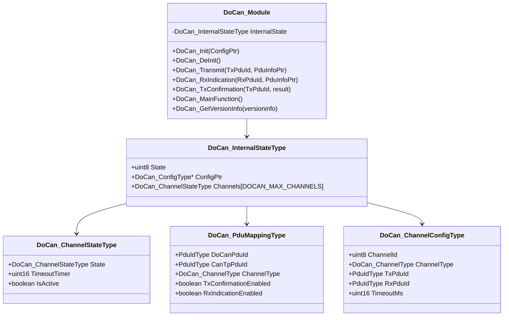
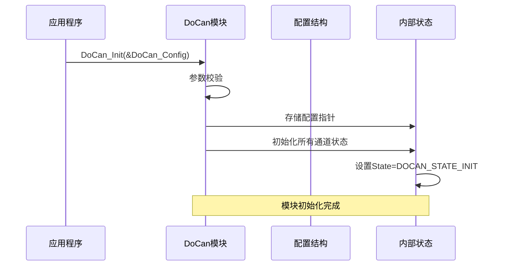
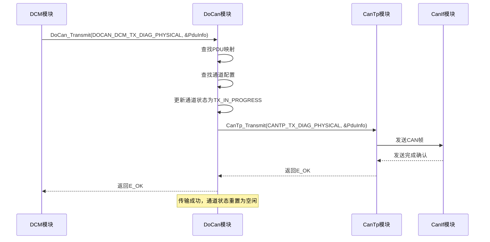
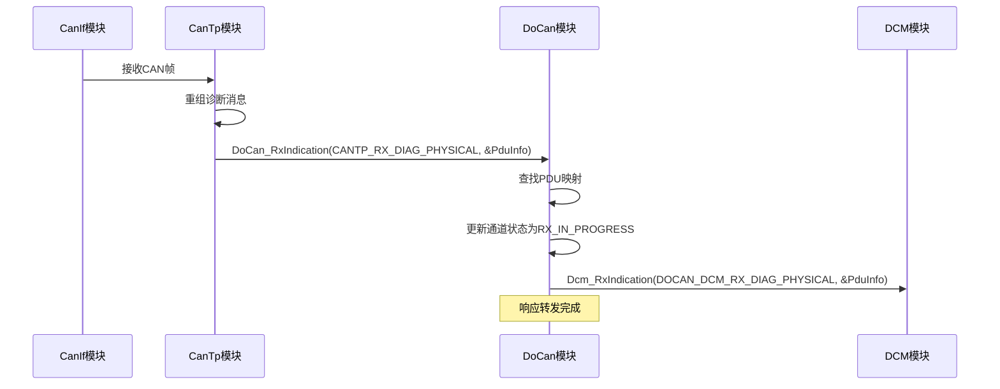
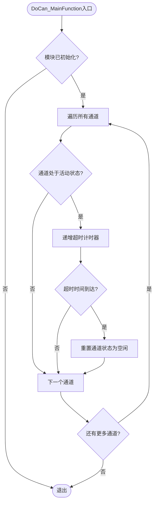

# DoCan模块概述

<cite>
**本文档引用的文件**
- [DoCan.h](file://src/bsw/services/docan/include/DoCan.h)
- [DoCan.c](file://src/bsw/services/docan/src/DoCan.c)
- [DoCan_Cfg.h](file://src/bsw/services/docan/include/DoCan_Cfg.h)
- [DoCan_Lcfg.c](file://src/bsw/services/docan/src/DoCan_Lcfg.c)
- [DoCan_spec.md](file://openspec/changes/dev-doip-docan-module/specs/DoCan_spec.md)
- [modules.md](file://docs/modules.md)
- [Dcm.h](file://src/bsw/services/dcm/include/Dcm.h)
- [CanTp.h](file://src/bsw/ecual/cantp/include/CanTp.h)
- [DoCan_test.c](file://src/bsw/services/docan/src/DoCan_test.c)
</cite>

## 目录
1. [简介](#简介)
2. [项目结构](#项目结构)
3. [核心组件](#核心组件)
4. [架构总览](#架构总览)
5. [详细组件分析](#详细组件分析)
6. [依赖关系分析](#依赖关系分析)
7. [性能考虑](#性能考虑)
8. [故障排除指南](#故障排除指南)
9. [结论](#结论)
10. [附录](#附录)

## 简介
DoCan（Diagnostic over CAN）是AutoSAR Classic Platform 4.x标准下的诊断通信适配器模块，位于Service层。它作为诊断通信管理器（DCM）与CAN传输协议（CanTp）之间的桥梁，负责诊断消息的封装、传输和接收处理，实现ISO 15765-2（ISO-TP）协议支持，为UDS诊断通信提供可靠的CAN传输通道。

DoCan模块的核心职责包括：
- 将DCM面向的诊断PDU ID映射到CanTp的N-SDU ID
- 管理诊断会话的CAN传输状态
- 路由来自CanTp的传输确认和接收指示
- 提供超时管理和状态维护机制

## 项目结构
DoCan模块在YuleTech AutoSAR BSW平台中的组织结构如下：



**图表来源**
- [modules.md:340-376](file://docs/modules.md#L340-L376)
- [DoCan_spec.md:21-32](file://openspec/changes/dev-doip-docan-module/specs/DoCan_spec.md#L21-L32)

**章节来源**
- [modules.md:227-316](file://docs/modules.md#L227-L316)
- [DoCan_spec.md:11-32](file://openspec/changes/dev-doip-docan-module/specs/DoCan_spec.md#L11-L32)

## 核心组件
DoCan模块包含以下核心组件和数据结构：

### 主要数据类型
- **DoCan_StateType**: 模块状态枚举（未初始化/已初始化）
- **DoCan_ChannelType**: 通道类型（物理地址/功能地址）
- **DoCan_ChannelStateType**: 通道运行时状态（空闲/发送中/接收中）
- **DoCan_PduMappingType**: PDU映射配置结构
- **DoCan_ChannelConfigType**: 通道配置结构
- **DoCan_ConfigType**: 全局配置结构

### 关键配置参数
- 最大通道数量：4个
- 最大PDU映射数量：8个
- 主函数周期：10ms
- 开发错误检测：启用
- 版本信息API：启用

**章节来源**
- [DoCan.h:59-113](file://src/bsw/services/docan/include/DoCan.h#L59-L113)
- [DoCan_Cfg.h:15-27](file://src/bsw/services/docan/include/DoCan_Cfg.h#L15-L27)

## 架构总览
DoCan模块在AutoSAR诊断通信栈中的位置和职责：



**图表来源**
- [DoCan_spec.md:21-32](file://openspec/changes/dev-doip-docan-module/specs/DoCan_spec.md#L21-L32)
- [modules.md:558-623](file://docs/modules.md#L558-L623)

## 详细组件分析

### DoCan模块类图


**图表来源**
- [DoCan.h:59-113](file://src/bsw/services/docan/include/DoCan.h#L59-L113)
- [DoCan.c:52-67](file://src/bsw/services/docan/src/DoCan.c#L52-L67)

### 初始化流程序列图


**图表来源**
- [DoCan.c:187-212](file://src/bsw/services/docan/src/DoCan.c#L187-L212)
- [DoCan_Lcfg.c:123-130](file://src/bsw/services/docan/src/DoCan_Lcfg.c#L123-L130)

### 诊断请求发送流程


**图表来源**
- [DoCan.c:242-303](file://src/bsw/services/docan/src/DoCan.c#L242-L303)
- [DoCan_spec.md:172-186](file://openspec/changes/dev-doip-docan-module/specs/DoCan_spec.md#L172-L186)

### 诊断响应接收流程


**图表来源**
- [DoCan.c:311-359](file://src/bsw/services/docan/src/DoCan.c#L311-L359)
- [DoCan_spec.md:190-203](file://openspec/changes/dev-doip-docan-module/specs/DoCan_spec.md#L190-L203)

### 超时处理流程


**图表来源**
- [DoCan.c:416-446](file://src/bsw/services/docan/src/DoCan.c#L416-L446)

**章节来源**
- [DoCan.c:187-446](file://src/bsw/services/docan/src/DoCan.c#L187-L446)
- [DoCan_Lcfg.c:26-130](file://src/bsw/services/docan/src/DoCan_Lcfg.c#L26-L130)

## 依赖关系分析
DoCan模块的依赖关系和接口定义：

```mermaid
graph TB
subgraph "上层依赖"
DCM[DCM模块<br/>Dcm_RxIndication()<br/>Dcm_TxConfirmation()]
end
subgraph "下层依赖"
CanTp[CanTp模块<br/>CanTp_Transmit()]
end
subgraph "通用依赖"
Det[DET模块<br/>错误报告]
MemMap[内存映射<br/>MemMap.h]
end
DoCan --> DCM
DoCan --> CanTp
DoCan --> Det
DoCan --> MemMap
style DoCan fill:#e3f2fd
```

**图表来源**
- [DoCan.c:27-30](file://src/bsw/services/docan/src/DoCan.c#L27-L30)
- [DoCan_spec.md:237-247](file://openspec/changes/dev-doip-docan-module/specs/DoCan_spec.md#L237-L247)

### 服务接口定义
DoCan模块提供的API接口：

| API名称 | 服务ID | 功能描述 |
|---------|--------|----------|
| DoCan_Init | 0x01 | 初始化DoCan模块 |
| DoCan_DeInit | 0x02 | 反初始化DoCan模块 |
| DoCan_GetVersionInfo | 0x03 | 获取版本信息 |
| DoCan_Transmit | 0x04 | 发送诊断消息 |
| DoCan_RxIndication | 0x05 | 接收指示回调 |
| DoCan_TxConfirmation | 0x06 | 传输确认回调 |
| DoCan_MainFunction | 0x07 | 主函数 |

**章节来源**
- [DoCan.h:38-44](file://src/bsw/services/docan/include/DoCan.h#L38-L44)
- [DoCan_spec.md:36-58](file://openspec/changes/dev-doip-docan-module/specs/DoCan_spec.md#L36-L58)

## 性能考虑
DoCan模块在性能方面的设计特点：

### 内存管理
- 使用静态内部状态变量存储模块运行时信息
- 通道状态数组大小固定为最大通道数
- 配置数据存储在只读段中

### 时间复杂度
- PDU映射查找：O(n) 线性搜索
- 通道配置查找：O(n) 线性搜索
- 主函数处理：O(k) k为活动通道数量

### 并发处理
- 单线程设计，无互斥锁
- 通道状态独立管理
- 超时检测在主函数中集中处理

## 故障排除指南
### 错误码说明
DoCan模块支持的错误检测（DET）错误码：

| 错误码 | 值 | 描述 |
|--------|----|------|
| DOCAN_E_PARAM_POINTER | 0x01 | 传入空指针参数 |
| DOCAN_E_PARAM_CONFIG | 0x02 | 配置参数无效 |
| DOCAN_E_UNINIT | 0x03 | 模块未初始化 |
| DOCAN_E_INVALID_PDU_ID | 0x04 | 无效的PDU标识符 |
| DOCAN_E_INVALID_CHANNEL | 0x05 | 无效的通道标识符 |
| DOCAN_E_TX_FAILED | 0x06 | 传输失败 |

### 常见问题诊断
1. **模块未初始化错误**：确保在调用任何DoCan API之前先调用DoCan_Init
2. **PDU映射失败**：检查DoCan_Config中的PduMappings配置是否正确
3. **传输超时**：调整通道超时配置或检查CanTp层配置
4. **内存不足**：检查静态内存分配和配置数组大小

**章节来源**
- [DoCan.h:49-54](file://src/bsw/services/docan/include/DoCan.h#L49-L54)
- [DoCan_test.c:110-133](file://src/bsw/services/docan/src/DoCan_test.c#L110-L133)

## 结论
DoCan模块作为AutoSAR诊断通信栈中的关键适配器，成功实现了以下目标：

1. **标准化接口**：提供了清晰的DCM接口和CanTp接口
2. **可靠传输**：通过ISO-TP协议确保诊断消息的可靠传输
3. **灵活配置**：支持物理地址和功能地址两种传输模式
4. **完整错误处理**：实现了全面的开发错误检测机制
5. **高效性能**：优化的内存使用和线性搜索算法

该模块为整个诊断通信系统提供了稳定的基础，支持UDS诊断协议在CAN总线上的可靠传输，满足了现代汽车电子系统的诊断需求。

## 附录

### 版本信息
- **模块版本**：1.0.0
- **AutoSAR版本**：4.4.0
- **供应商ID**：0x01 (YuleTech)
- **模块ID**：0x4D (DOCAN)

### 配置参数总览
DoCan模块的关键配置参数：

| 参数名称 | 默认值 | 描述 |
|----------|--------|------|
| DOCAN_DEV_ERROR_DETECT | STD_ON | 启用开发错误检测 |
| DOCAN_VERSION_INFO_API | STD_ON | 启用版本信息API |
| DOCAN_MAX_CHANNELS | 4U | 最大通道数量 |
| DOCAN_MAX_PDU_MAPPINGS | 8U | 最大PDU映射数量 |
| DOCAN_MAIN_FUNCTION_PERIOD_MS | 10U | 主函数周期(ms) |

### PDU ID定义
DoCan模块支持的诊断PDU ID：

| PDU ID | 值 | 描述 |
|--------|----|------|
| DOCAN_DCM_TX_DIAG_PHYSICAL | 0U | DCM物理地址发送 |
| DOCAN_DCM_TX_DIAG_FUNCTIONAL | 1U | DCM功能地址发送 |
| DOCAN_DCM_RX_DIAG_PHYSICAL | 2U | DCM物理地址接收 |
| DOCAN_DCM_RX_DIAG_FUNCTIONAL | 3U | DCM功能地址接收 |

**章节来源**
- [DoCan.h:26-33](file://src/bsw/services/docan/include/DoCan.h#L26-L33)
- [DoCan_Cfg.h:15-52](file://src/bsw/services/docan/include/DoCan_Cfg.h#L15-L52)
- [DoCan_Lcfg.c:26-87](file://src/bsw/services/docan/src/DoCan_Lcfg.c#L26-L87)