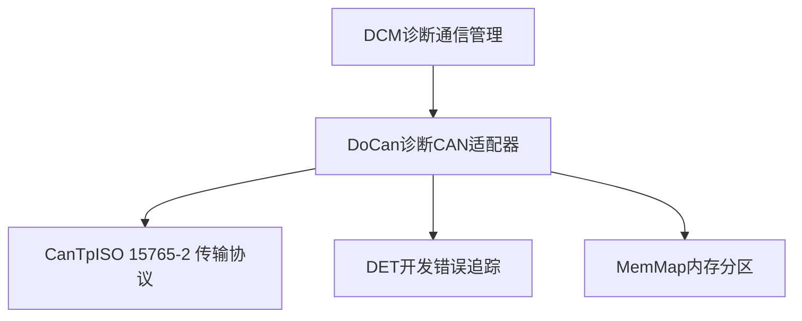
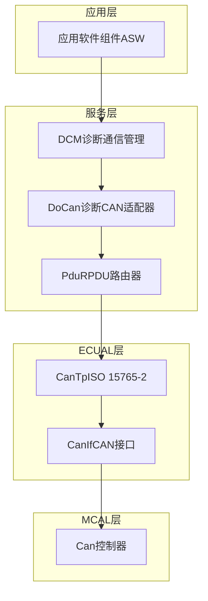
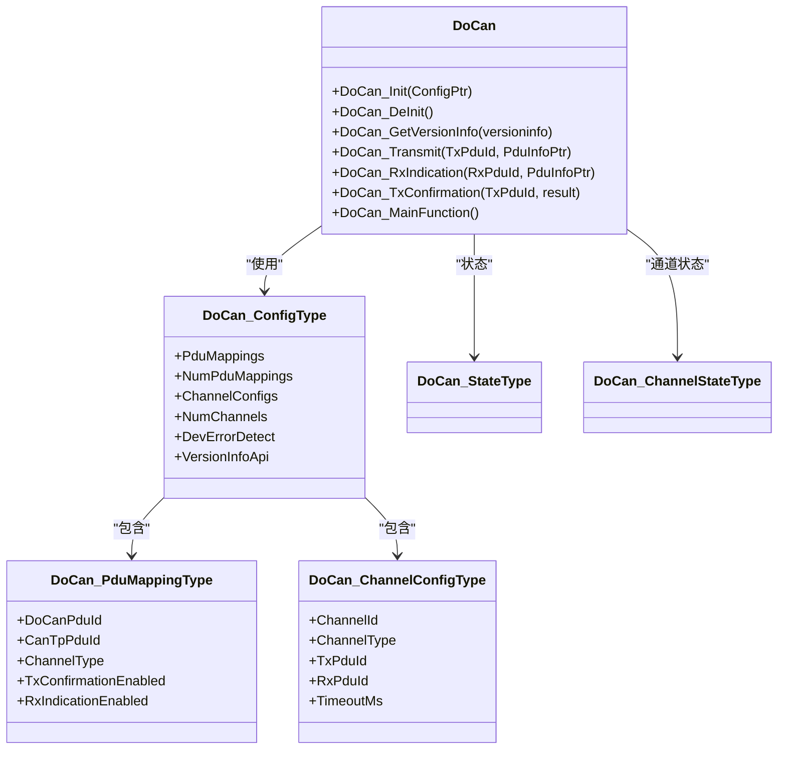
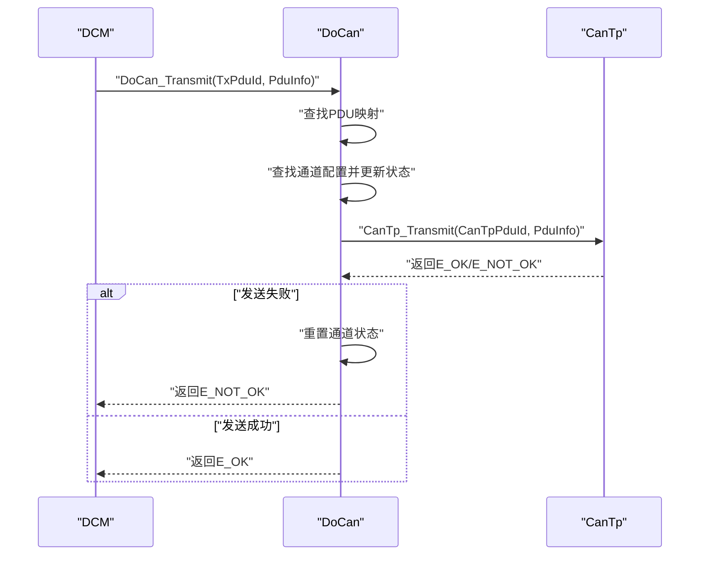
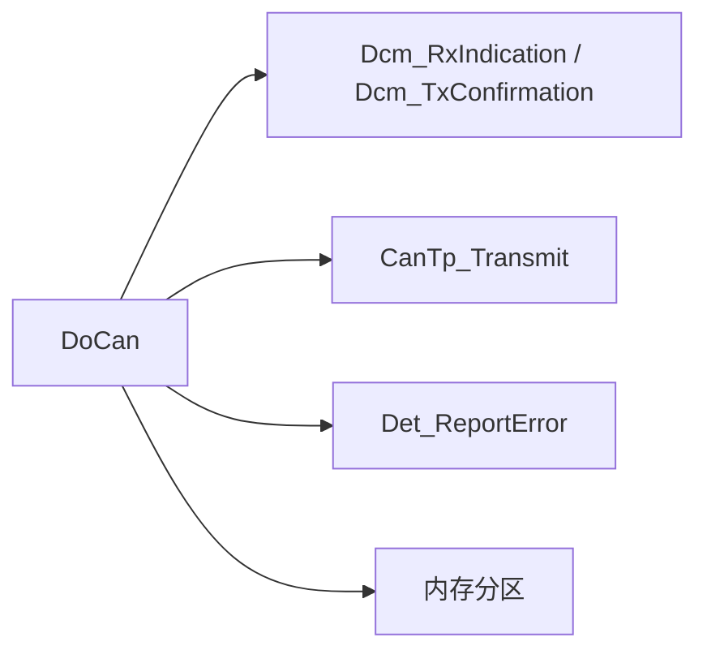

# 测试与验证

<cite>
**本文引用的文件**   
- [DoCan.h](file://src/bsw/services/docan/include/DoCan.h)
- [DoCan.c](file://src/bsw/services/docan/src/DoCan.c)
- [DoCan_Lcfg.c](file://src/bsw/services/docan/src/DoCan_Lcfg.c)
- [DoCan_Cfg.h](file://src/bsw/services/docan/include/DoCan_Cfg.h)
- [DoCan_test.c](file://src/bsw/services/docan/src/DoCan_test.c)
- [DoIp_spec.md](file://openspec/changes/dev-doip-docan-module/specs/DoIp_spec.md)
- [DoIp.h](file://src/bsw/services/doip/include/DoIp.h)
- [DoIp.c](file://src/bsw/services/doip/src/DoIp.c)
- [DoIp_test.c](file://src/bsw/services/doip/src/DoIp_test.c)
- [DoCan_spec.md](file://openspec/changes/dev-doip-docan-module/specs/DoCan_spec.md)
- [integration_test.c](file://src/bsw/integration/tests/integration_test.c)
- [integration_test_cfg.h](file://src/bsw/integration/tests/integration_test_cfg.h)
- [test_framework.h](file://tests/unit/test_framework.h)
- [bsw_integration_verification.md](file://verification/bsw_integration_verification.md)
</cite>

## 目录
1. [引言](#引言)
2. [项目结构](#项目结构)
3. [核心组件](#核心组件)
4. [架构总览](#架构总览)
5. [详细组件分析](#详细组件分析)
6. [依赖关系分析](#依赖关系分析)
7. [性能考虑](#性能考虑)
8. [故障排查指南](#故障排查指南)
9. [结论](#结论)
10. [附录](#附录)

## 引言
本文件面向DoCan（诊断通过CAN）模块的测试与验证，系统化阐述测试策略、验证方法与测试用例设计思路，并覆盖单元测试、集成测试与系统测试的实施路径。文档同时给出测试环境搭建、工具使用、测试数据准备、边界条件与异常处理测试、性能测试方法、测试结果分析与问题定位指南，以及DoCan与CanTp模块的联合测试与诊断通信链路验证流程。

## 项目结构
DoCan位于服务层（Service Layer），作为DCM与CanTp之间的诊断传输适配器，负责：
- 将DCM侧PDU ID映射到CanTp侧N-SDU ID
- 路由来自CanTp的接收指示与发送确认至DCM
- 维护通道状态并执行超时控制
- 提供版本信息与错误检测（DET）

DoCan的典型上层/下层接口如下：
- 上层：DCM（通过DoCan_Transmit、DoCan_RxIndication、DoCan_TxConfirmation）
- 下层：CanTp（通过CanTp_Transmit）
- 公共：DET（错误上报）、MemMap（内存分区）

图表来源
- [DoCan_spec.md: 诊断CAN栈:21-32](file://openspec/changes/dev-doip-docan-module/specs/DoCan_spec.md#L21-L32)
- [DoCan.c: 外部函数声明:27-29](file://src/bsw/services/docan/src/DoCan.c#L27-L29)

章节来源
- [DoCan_spec.md: 诊断CAN栈:21-32](file://openspec/changes/dev-doip-docan-module/specs/DoCan_spec.md#L21-L32)
- [DoCan.h: API与数据类型:132-177](file://src/bsw/services/docan/include/DoCan.h#L132-L177)
- [DoCan.c: 外部函数声明:27-29](file://src/bsw/services/docan/src/DoCan.c#L27-L29)

## 核心组件
- DoCan模块接口与数据结构
  - 生命周期：初始化、去初始化、版本信息查询
  - 诊断消息传输：DoCan_Transmit
  - 接收指示与发送确认：DoCan_RxIndication、DoCan_TxConfirmation
  - 主函数：DoCan_MainFunction（周期性处理，含超时维护）
- 配置与映射
  - PDU映射表：DoCan_PduMappingType
  - 通道配置：DoCan_ChannelConfigType
  - 全局配置：DoCan_ConfigType
- 错误检测与状态机
  - 模块状态：DOCAN_STATE_UNINIT、DOCAN_STATE_INIT
  - 通道状态：DOCAN_CHANNEL_IDLE、DOCAN_CHANNEL_TX_IN_PROGRESS、DOCAN_CHANNEL_RX_IN_PROGRESS
  - DET错误码：参数指针、配置参数、未初始化、无效PDU ID、无效通道、发送失败等

章节来源
- [DoCan.h: 数据类型与API:59-177](file://src/bsw/services/docan/include/DoCan.h#L59-L177)
- [DoCan_Lcfg.c: PDU映射与通道配置:26-130](file://src/bsw/services/docan/src/DoCan_Lcfg.c#L26-L130)
- [DoCan_spec.md: 错误处理与DET:125-144](file://openspec/changes/dev-doip-docan-module/specs/DoCan_spec.md#L125-L144)

## 架构总览
DoCan在AutoSAR经典平台4.x中承担“服务层”职责，其典型诊断CAN栈如下：

图表来源
- [DoCan_spec.md: 诊断CAN栈:21-32](file://openspec/changes/dev-doip-docan-module/specs/DoCan_spec.md#L21-L32)
- [DoIp_spec.md: DoIP协议栈:22-31](file://openspec/changes/dev-doip-docan-module/specs/DoIp_spec.md#L22-L31)

## 详细组件分析

### DoCan单元测试
DoCan单元测试采用轻量级测试框架，通过mock外部依赖（CanTp、Dcm、Det）验证DoCan行为。

- 测试覆盖点
  - 初始化：有效配置初始化成功；空配置触发DET错误
  - 发送路径：DoCan_Transmit正确转发至CanTp，物理/功能寻址均覆盖
  - 接收路径：DoCan_RxIndication正确路由至DCM
  - 确认路径：DoCan_TxConfirmation正确通知DCM
  - 异常路径：未初始化调用DoCan_Transmit/DoCan_RxIndication触发DET错误
  - 版本信息：DoCan_GetVersionInfo返回正确版本号
  - 功能寻址：功能地址请求映射正确

- 关键测试用例路径
  - [DoCan_test.c: 初始化与DET错误:110-133](file://src/bsw/services/docan/src/DoCan_test.c#L110-L133)
  - [DoCan_test.c: 发送路径与功能寻址:135-255](file://src/bsw/services/docan/src/DoCan_test.c#L135-L255)
  - [DoCan_test.c: 接收与确认路径:157-192](file://src/bsw/services/docan/src/DoCan_test.c#L157-L192)
  - [DoCan_test.c: 未初始化错误检测:194-276](file://src/bsw/services/docan/src/DoCan_test.c#L194-L276)
  - [DoCan_test.c: 版本信息:217-233](file://src/bsw/services/docan/src/DoCan_test.c#L217-L233)

- 单元测试类图（映射实际源码）

图表来源
- [DoCan.h: 数据类型定义:84-113](file://src/bsw/services/docan/include/DoCan.h#L84-L113)
- [DoCan.c: 内部状态与API实现:54-67](file://src/bsw/services/docan/src/DoCan.c#L54-L67)

- 单元测试序列图（DoCan_Transmit流程）

图表来源
- [DoCan.c: DoCan_Transmit实现:242-303](file://src/bsw/services/docan/src/DoCan.c#L242-L303)
- [DoCan_test.c: 发送路径测试:135-155](file://src/bsw/services/docan/src/DoCan_test.c#L135-L155)

章节来源
- [DoCan_test.c: 测试用例集合:109-294](file://src/bsw/services/docan/src/DoCan_test.c#L109-L294)
- [DoCan.h: API与错误码:132-177](file://src/bsw/services/docan/include/DoCan.h#L132-L177)
- [DoCan.c: 关键API实现:187-446](file://src/bsw/services/docan/src/DoCan.c#L187-L446)

### DoCan与CanTp联合测试
- 场景一：物理寻址诊断请求发送
  - DCM调用DoCan_Transmit，DoCan根据映射将请求转发给CanTp，最终经CanIf/CAN控制器发送
  - 预期：DoCan返回E_OK，CanTp收到对应N-SDU
- 场景二：诊断响应接收
  - CanTp完成重组后调用DoCan_RxIndication，DoCan将数据转发给DCM
  - 预期：DCM收到完整诊断响应
- 场景三：发送确认
  - CanTp完成帧发送后调用DoCan_TxConfirmation，DoCan通知DCM
  - 预期：DCM收到发送成功的确认

- 参考场景描述
  - [DoCan_spec.md: 场景1-3:170-221](file://openspec/changes/dev-doip-docan-module/specs/DoCan_spec.md#L170-L221)

章节来源
- [DoCan_spec.md: 场景1-3:170-221](file://openspec/changes/dev-doip-docan-module/specs/DoCan_spec.md#L170-L221)
- [DoCan.c: Rx/Tx回调实现:311-409](file://src/bsw/services/docan/src/DoCan.c#L311-L409)

### DoIp与DoCan联合测试（跨模块）
DoIp作为诊断通过IP的适配器，与DoCan同属服务层，二者均可与DCM交互。DoIp侧重以太网链路，DoCan侧重CAN链路。联合测试可验证：
- DCM通过不同传输适配器（DoCan/DoIp）向同一目标发起诊断
- 两种链路上的路由激活、连接管理与诊断消息封装一致性

- 参考DoIp能力与场景
  - [DoIp_spec.md: API列表与场景:35-66](file://openspec/changes/dev-doip-docan-module/specs/DoIp_spec.md#L35-L66)
  - [DoIp_spec.md: 场景1-4:244-315](file://openspec/changes/dev-doip-docan-module/specs/DoIp_spec.md#L244-L315)

章节来源
- [DoIp_spec.md: API与场景:35-66](file://openspec/changes/dev-doip-docan-module/specs/DoIp_spec.md#L35-L66)
- [DoIp_spec.md: 场景1-4:244-315](file://openspec/changes/dev-doip-docan-module/specs/DoIp_spec.md#L244-L315)

### 集成测试与系统测试
- 集成测试（Cross-Layer Integration Tests）
  - 目标：验证DoCan/CanTp/PduR/CanIf/Can等多模块协同
  - 方法：通过大量mock（如Can、Fee、Gpt、OS、Dcm、BswM、Com、PduR、Rte等）构建仿真环境
  - 关键点：CAN写入、读取、中断、定时器、唤醒、NvM读写、Dcm路由、BswM模式切换、Com信号与PduR路由、Rte调度等
  - 参考：[integration_test.c: 模块头文件与mock变量:18-172](file://src/bsw/integration/tests/integration_test.c#L18-L172)

- 系统测试建议
  - 在SIL（软件在环）或半实物在环（HIL）环境中，结合真实MCAL与ECUAL驱动
  - 使用真实CAN总线与网络设备，验证端到端诊断通信链路
  - 覆盖边界条件：最大PDU长度、最大通道数、超时阈值、错误注入（丢帧、乱序、CRC错误）

章节来源
- [integration_test.c: 模块头文件与mock变量:18-172](file://src/bsw/integration/tests/integration_test.c#L18-L172)
- [integration_test_cfg.h: 测试配置宏:22-100](file://src/bsw/integration/tests/integration_test_cfg.h#L22-L100)
- [bsw_integration_verification.md: 集成验证概览:15-193](file://verification/bsw_integration_verification.md#L15-L193)

## 依赖关系分析
DoCan对外部模块的依赖关系如下：

图表来源
- [DoCan.c: 外部函数声明与实现:27-29](file://src/bsw/services/docan/src/DoCan.c#L27-L29)
- [DoCan.c: DET宏与错误上报:43-48](file://src/bsw/services/docan/src/DoCan.c#L43-L48)

章节来源
- [DoCan.c: 外部函数声明与实现:27-29](file://src/bsw/services/docan/src/DoCan.c#L27-L29)
- [DoCan.h: DET错误码:48-54](file://src/bsw/services/docan/include/DoCan.h#L48-L54)

## 性能考虑
- 主函数周期与超时
  - 主函数周期由DOCAN_MAIN_FUNCTION_PERIOD_MS定义，默认10ms
  - 通道超时由各通道TimeoutMs配置，DoCan_MainFunction按周期递增计时并检测超时
- 内存与数据结构
  - 最大通道数与PDU映射数由预编译配置决定，影响静态内存占用
- 性能测试建议
  - 连续发送/接收最大长度诊断报文，测量端到端延迟与吞吐
  - 并发通道场景下的状态切换与超时处理稳定性
  - 在高负载CAN总线上验证DoCan对超时与确认的响应

章节来源
- [DoCan_spec.md: 主函数与超时:54-58](file://openspec/changes/dev-doip-docan-module/specs/DoCan_spec.md#L54-L58)
- [DoCan_Cfg.h: 主函数周期与上限:27-22](file://src/bsw/services/docan/include/DoCan_Cfg.h#L27-L22)
- [DoCan.c: 主函数实现:416-446](file://src/bsw/services/docan/src/DoCan.c#L416-L446)

## 故障排查指南
- 常见错误与定位
  - 未初始化调用：DoCan_Transmit/DoCan_RxIndication触发DOCAN_E_UNINIT
  - 空指针：DoCan_Init传入NULL触发DOCAN_E_PARAM_POINTER
  - 无效PDU ID：无法匹配映射触发DOCAN_E_INVALID_PDU_ID
  - 发送失败：CanTp返回非E_OK触发DOCAN_E_TX_FAILED
- 定位步骤
  - 检查DoCan_Init是否被调用且配置有效
  - 核对PDU映射表与通道配置，确保DoCanPduId与CanTpPduId一致
  - 检查CanTp_Transmit返回值与通道状态变化
  - 通过DET错误码快速定位问题类型
- 单元测试辅助
  - 使用DoCan_test中的异常路径用例快速复现与验证

章节来源
- [DoCan_spec.md: DET错误与使用:125-144](file://openspec/changes/dev-doip-docan-module/specs/DoCan_spec.md#L125-L144)
- [DoCan_test.c: 异常用例:194-276](file://src/bsw/services/docan/src/DoCan_test.c#L194-L276)

## 结论
DoCan模块测试体系涵盖单元、集成与系统三个层面。单元测试通过mock验证关键路径与异常路径；集成测试通过多模块仿真验证端到端链路；系统测试建议在SIL/HIL环境下进行。DoCan与CanTp的联合测试可确保诊断通信在CAN链路上的正确性与鲁棒性；DoIp与DoCan的联合测试则为跨链路诊断提供了统一验证视角。建议持续完善测试覆盖率与回归测试策略，确保满足AUTOSAR规范与项目质量标准。

## 附录

### 测试环境搭建与工具
- 测试框架
  - 自研轻量级测试框架，提供断言宏与测试运行器
  - 参考：[test_framework.h:123-138](file://tests/unit/test_framework.h#L123-L138)
- 单元测试运行
  - 在DoCan_test.c中定义测试用例并通过TEST_MAIN_BEGIN/END运行
  - 参考：[DoCan_test.c: 测试主入口:281-294](file://src/bsw/services/docan/src/DoCan_test.c#L281-L294)
- 集成测试运行
  - 在integration_test.c中包含各层头文件并提供大量mock
  - 参考：[integration_test.c: 模块头文件与mock:18-172](file://src/bsw/integration/tests/integration_test.c#L18-L172)

章节来源
- [test_framework.h: 测试框架:123-138](file://tests/unit/test_framework.h#L123-L138)
- [DoCan_test.c: 测试主入口:281-294](file://src/bsw/services/docan/src/DoCan_test.c#L281-L294)
- [integration_test.c: 模块头文件与mock:18-172](file://src/bsw/integration/tests/integration_test.c#L18-L172)

### 测试数据准备
- 单元测试数据
  - 构造PduInfoType（SduDataPtr、SduLength、MetaDataPtr）
  - 使用DoCan_Cfg.h中定义的PDU ID常量
  - 参考：[DoCan_test.c: 测试数据构造:138-147](file://src/bsw/services/docan/src/DoCan_test.c#L138-L147)
- 集成测试数据
  - 通过integration_test_cfg.h定义信号、IPDU、NvM块、CAN消息等测试宏
  - 参考：[integration_test_cfg.h: 测试配置宏:22-100](file://src/bsw/integration/tests/integration_test_cfg.h#L22-L100)

章节来源
- [DoCan_test.c: 测试数据构造:138-147](file://src/bsw/services/docan/src/DoCan_test.c#L138-L147)
- [integration_test_cfg.h: 测试配置宏:22-100](file://src/bsw/integration/tests/integration_test_cfg.h#L22-L100)

### 边界条件与异常处理测试清单
- 参数边界
  - 最大通道数、最大PDU映射数、最大PDU长度
- 异常路径
  - 未初始化调用、空指针、无效PDU ID、发送失败
- 超时与状态
  - 各通道TimeoutMs生效、状态机在超时后复位
- 参考
  - [DoCan_Cfg.h: 上限与周期:21-27](file://src/bsw/services/docan/include/DoCan_Cfg.h#L21-L27)
  - [DoCan_test.c: 异常用例:194-276](file://src/bsw/services/docan/src/DoCan_test.c#L194-L276)

章节来源
- [DoCan_Cfg.h: 上限与周期:21-27](file://src/bsw/services/docan/include/DoCan_Cfg.h#L21-L27)
- [DoCan_test.c: 异常用例:194-276](file://src/bsw/services/docan/src/DoCan_test.c#L194-L276)

### 性能测试方法
- 压力测试
  - 连续发送/接收最大长度诊断报文，记录端到端延迟与丢包率
- 负载测试
  - 多通道并发场景下的状态切换与超时处理
- 环境测试
  - 在真实CAN总线与网络设备上验证链路稳定性
- 参考
  - [DoCan_spec.md: 主函数与超时:54-58](file://openspec/changes/dev-doip-docan-module/specs/DoCan_spec.md#L54-L58)

章节来源
- [DoCan_spec.md: 主函数与超时:54-58](file://openspec/changes/dev-doip-docan-module/specs/DoCan_spec.md#L54-L58)

### 测试结果分析与问题定位
- 单元测试结果
  - 通过test_framework.h统计总数、通过数、失败数
  - 参考：[test_framework.h: 统计与输出:123-138](file://tests/unit/test_framework.h#L123-L138)
- 集成测试结果
  - 通过integration_test.c中的mock跟踪各模块交互
  - 参考：[integration_test.c: mock跟踪:83-160](file://src/bsw/integration/tests/integration_test.c#L83-L160)
- 问题定位
  - 结合DET错误码与单元测试用例快速定位问题类型与发生位置

章节来源
- [test_framework.h: 统计与输出:123-138](file://tests/unit/test_framework.h#L123-L138)
- [integration_test.c: mock跟踪:83-160](file://src/bsw/integration/tests/integration_test.c#L83-L160)